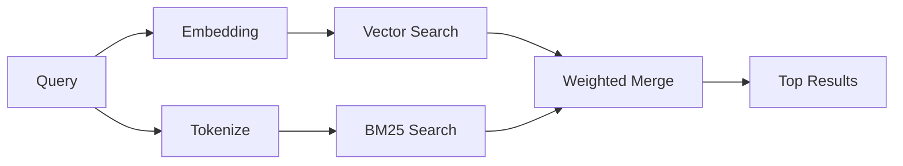

---
read_when:
    - คุณต้องการเข้าใจวิธีการทำงานของ memory_search
    - คุณต้องการเลือก provider ของ embedding
    - คุณต้องการปรับแต่งคุณภาพการค้นหา
summary: วิธีที่การค้นหาหน่วยความจำค้นหาบันทึกที่เกี่ยวข้องโดยใช้ embeddings และการค้นคืนแบบไฮบริด
title: การค้นหาหน่วยความจำ
x-i18n:
    generated_at: "2026-04-25T13:45:50Z"
    model: gpt-5.4
    provider: openai
    source_hash: 5cc6bbaf7b0a755bbe44d3b1b06eed7f437ebdc41a81c48cca64bd08bbc546b7
    source_path: concepts/memory-search.md
    workflow: 15
---

`memory_search` จะค้นหาบันทึกที่เกี่ยวข้องจากไฟล์หน่วยความจำของคุณ แม้ว่า
ถ้อยคำจะแตกต่างจากข้อความต้นฉบับก็ตาม มันทำงานโดยการทำดัชนีหน่วยความจำเป็นชิ้นเล็ก ๆ
และค้นหาชิ้นเหล่านั้นด้วย embeddings, คีย์เวิร์ด หรือทั้งสองอย่างร่วมกัน

## เริ่มต้นอย่างรวดเร็ว

หากคุณมีการสมัครใช้ GitHub Copilot หรือมีการตั้งค่า OpenAI, Gemini, Voyage หรือ Mistral
API key ไว้แล้ว การค้นหาหน่วยความจำจะทำงานโดยอัตโนมัติ หากต้องการตั้งค่า provider
อย่างชัดเจน:

```json5
{
  agents: {
    defaults: {
      memorySearch: {
        provider: "openai", // หรือ "gemini", "local", "ollama" เป็นต้น
      },
    },
  },
}
```

สำหรับ embeddings แบบ local ที่ไม่ใช้ API key ให้ติดตั้งแพ็กเกจ runtime เสริม `node-llama-cpp`
ไว้ข้าง ๆ OpenClaw แล้วใช้ `provider: "local"`

## provider ที่รองรับ

| Provider       | ID               | ต้องใช้ API key | หมายเหตุ                                             |
| -------------- | ---------------- | --------------- | ---------------------------------------------------- |
| Bedrock        | `bedrock`        | ไม่ต้องใช้      | ตรวจจับอัตโนมัติเมื่อ AWS credential chain resolve ได้ |
| Gemini         | `gemini`         | ต้องใช้         | รองรับการทำดัชนีภาพ/เสียง                           |
| GitHub Copilot | `github-copilot` | ไม่ต้องใช้      | ตรวจจับอัตโนมัติ ใช้การสมัคร GitHub Copilot         |
| Local          | `local`          | ไม่ต้องใช้      | โมเดล GGUF, ดาวน์โหลดประมาณ 0.6 GB                  |
| Mistral        | `mistral`        | ต้องใช้         | ตรวจจับอัตโนมัติ                                     |
| Ollama         | `ollama`         | ไม่ต้องใช้      | แบบ local, ต้องตั้งค่าเองอย่างชัดเจน                |
| OpenAI         | `openai`         | ต้องใช้         | ตรวจจับอัตโนมัติ, รวดเร็ว                            |
| Voyage         | `voyage`         | ต้องใช้         | ตรวจจับอัตโนมัติ                                     |

## วิธีการทำงานของการค้นหา

OpenClaw รันเส้นทางการค้นคืนสองแบบขนานกันแล้วรวมผลลัพธ์เข้าด้วยกัน:



- **การค้นหาแบบเวกเตอร์** จะพบบันทึกที่มีความหมายใกล้เคียงกัน ("gateway host" จับคู่กับ
  "เครื่องที่กำลังรัน OpenClaw")
- **การค้นหาคีย์เวิร์ดแบบ BM25** จะหาการตรงกันแบบตรงตัว (ID, สตริงข้อผิดพลาด, config
  key)

หากมีเพียงเส้นทางเดียวที่ใช้งานได้ (ไม่มี embeddings หรือไม่มี FTS) อีกเส้นทางจะทำงานเดี่ยว ๆ

เมื่อ embeddings ใช้งานไม่ได้ OpenClaw จะยังคงใช้การจัดอันดับเชิงศัพท์เหนือผลลัพธ์ FTS แทนที่จะถอยกลับไปใช้เพียงการเรียงลำดับ exact-match ดิบเท่านั้น โหมดลดประสิทธิภาพนี้จะเพิ่มน้ำหนักให้ chunk ที่ครอบคลุมคำค้นได้ดีกว่าและมีพาธไฟล์ที่เกี่ยวข้อง ซึ่งช่วยให้ recall ยังมีประโยชน์ได้แม้ไม่มี `sqlite-vec` หรือ provider ของ embedding

## การปรับปรุงคุณภาพการค้นหา

มีฟีเจอร์เสริมสองอย่างที่ช่วยได้เมื่อคุณมีประวัติบันทึกจำนวนมาก:

### การลดน้ำหนักตามเวลา

บันทึกเก่าจะค่อย ๆ สูญเสียน้ำหนักในการจัดอันดับ เพื่อให้ข้อมูลล่าสุดแสดงขึ้นมาก่อน
ด้วยค่า half-life เริ่มต้น 30 วัน บันทึกจากเดือนที่แล้วจะมีคะแนนเหลือ 50% ของ
น้ำหนักเดิม ไฟล์ถาวรอย่าง `MEMORY.md` จะไม่ถูกลดน้ำหนักตามเวลา

<Tip>
เปิดใช้การลดน้ำหนักตามเวลาหากเอเจนต์ของคุณมีบันทึกรายวันหลายเดือน และข้อมูลเก่า
ยังคงมีอันดับสูงกว่าบริบทล่าสุด
</Tip>

### MMR (ความหลากหลาย)

ลดผลลัพธ์ที่ซ้ำซ้อน หากมีบันทึกห้ารายการที่กล่าวถึง config ของ router เดียวกัน MMR
จะช่วยให้ผลลัพธ์อันดับต้น ๆ ครอบคลุมหัวข้อที่ต่างกันแทนการซ้ำเนื้อหาเดิม

<Tip>
เปิดใช้ MMR หาก `memory_search` มักคืน snippet ที่เกือบซ้ำกันจาก
บันทึกรายวันหลายฉบับ
</Tip>

### เปิดใช้ทั้งสองอย่าง

```json5
{
  agents: {
    defaults: {
      memorySearch: {
        query: {
          hybrid: {
            mmr: { enabled: true },
            temporalDecay: { enabled: true },
          },
        },
      },
    },
  },
}
```

## หน่วยความจำแบบหลายสื่อ

ด้วย Gemini Embedding 2 คุณสามารถทำดัชนีไฟล์ภาพและเสียงควบคู่ไปกับ
Markdown ได้ คำค้นหายังคงเป็นข้อความ แต่จะจับคู่กับเนื้อหาภาพและเสียง ดู
[เอกสารอ้างอิงการกำหนดค่าหน่วยความจำ](/th/reference/memory-config) สำหรับ
การตั้งค่า

## การค้นหาหน่วยความจำของเซสชัน

คุณสามารถเลือกทำดัชนี transcript ของเซสชันได้ เพื่อให้ `memory_search` สามารถเรียกคืน
การสนทนาก่อนหน้าได้ ฟีเจอร์นี้เป็นแบบ opt-in ผ่าน
`memorySearch.experimental.sessionMemory` ดู
[เอกสารอ้างอิงการกำหนดค่า](/th/reference/memory-config) สำหรับรายละเอียด

## การแก้ปัญหา

**ไม่มีผลลัพธ์?** รัน `openclaw memory status` เพื่อตรวจสอบดัชนี หากว่างอยู่ ให้รัน
`openclaw memory index --force`

**มีแต่การตรงกันของคีย์เวิร์ด?** provider ของ embedding ของคุณอาจยังไม่ได้ตั้งค่า ตรวจสอบ
`openclaw memory status --deep`

**หา文本 CJK ไม่เจอ?** สร้างดัชนี FTS ใหม่ด้วย
`openclaw memory index --force`

## อ่านเพิ่มเติม

- [Active Memory](/th/concepts/active-memory) -- หน่วยความจำของ sub-agent สำหรับเซสชันแชตแบบโต้ตอบ
- [หน่วยความจำ](/th/concepts/memory) -- โครงสร้างไฟล์, แบ็กเอนด์, เครื่องมือ
- [เอกสารอ้างอิงการกำหนดค่าหน่วยความจำ](/th/reference/memory-config) -- ตัวเลือก config ทั้งหมด

## ที่เกี่ยวข้อง

- [ภาพรวมหน่วยความจำ](/th/concepts/memory)
- [Active Memory](/th/concepts/active-memory)
- [เอนจินหน่วยความจำในตัว](/th/concepts/memory-builtin)
