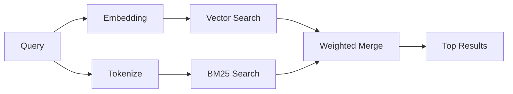

---
read_when:
    - คุณต้องการทำความเข้าใจว่า `memory_search` ทำงานอย่างไร
    - คุณต้องการเลือกผู้ให้บริการ embedding
    - คุณต้องการปรับแต่งคุณภาพการค้นหา
summary: การที่การค้นหาความทรงจำค้นหาบันทึกที่เกี่ยวข้องโดยใช้ embeddings และการดึงข้อมูลแบบไฮบริดอย่างไร
title: การค้นหาความทรงจำ
x-i18n:
    generated_at: "2026-04-26T11:27:42Z"
    model: gpt-5.4
    provider: openai
    source_hash: 95d86fb3efe79aae92f5e3590f1c15fb0d8f3bb3301f8fe9a41f891e290d7a14
    source_path: concepts/memory-search.md
    workflow: 15
---

`memory_search` จะค้นหาบันทึกที่เกี่ยวข้องจากไฟล์ความทรงจำของคุณ แม้ถ้อยคำ
จะแตกต่างจากข้อความต้นฉบับก็ตาม โดยทำงานด้วยการทำดัชนีความทรงจำเป็นส่วนย่อยขนาดเล็ก
และค้นหาส่วนเหล่านั้นด้วย embeddings, คีย์เวิร์ด หรือทั้งสองอย่างร่วมกัน

## เริ่มต้นอย่างรวดเร็ว

หากคุณมีการสมัครใช้ GitHub Copilot หรือกำหนดค่า API key ของ OpenAI, Gemini, Voyage หรือ Mistral
ไว้แล้ว การค้นหาความทรงจำจะทำงานโดยอัตโนมัติ หากต้องการกำหนดผู้ให้บริการ
อย่างชัดเจน:

```json5
{
  agents: {
    defaults: {
      memorySearch: {
        provider: "openai", // หรือ "gemini", "local", "ollama" เป็นต้น
      },
    },
  },
}
```

สำหรับ embeddings แบบ local ที่ไม่ใช้ API key ให้ติดตั้งแพ็กเกจรันไทม์ `node-llama-cpp`
แบบทางเลือกไว้ข้าง OpenClaw แล้วใช้ `provider: "local"`

## ผู้ให้บริการที่รองรับ

| ผู้ให้บริการ    | ID               | ต้องใช้ API key | หมายเหตุ                                              |
| ---------------- | ---------------- | --------------- | ----------------------------------------------------- |
| Bedrock          | `bedrock`        | ไม่ต้องใช้      | ตรวจพบอัตโนมัติเมื่อ AWS credential chain resolve ได้ |
| Gemini           | `gemini`         | ใช่             | รองรับการทำดัชนีภาพ/เสียง                            |
| GitHub Copilot   | `github-copilot` | ไม่ต้องใช้      | ตรวจพบอัตโนมัติ ใช้การสมัคร GitHub Copilot          |
| Local            | `local`          | ไม่ต้องใช้      | โมเดล GGUF, ดาวน์โหลดประมาณ 0.6 GB                  |
| Mistral          | `mistral`        | ใช่             | ตรวจพบอัตโนมัติ                                       |
| Ollama           | `ollama`         | ไม่ต้องใช้      | แบบ local ต้องตั้งค่าอย่างชัดเจน                      |
| OpenAI           | `openai`         | ใช่             | ตรวจพบอัตโนมัติ ทำงานรวดเร็ว                         |
| Voyage           | `voyage`         | ใช่             | ตรวจพบอัตโนมัติ                                       |

## การค้นหาทำงานอย่างไร

OpenClaw รันเส้นทางการดึงข้อมูลสองแบบแบบขนาน แล้วรวมผลลัพธ์เข้าด้วยกัน:



- **Vector search** ค้นหาบันทึกที่มีความหมายใกล้เคียงกัน ("gateway host" ตรงกับ
  "เครื่องที่รัน OpenClaw")
- **BM25 keyword search** ค้นหาคำที่ตรงกันแบบเป๊ะ (ID, สตริงข้อผิดพลาด, คีย์คอนฟิก)

หากมีเพียงเส้นทางเดียวที่ใช้งานได้ (ไม่มี embeddings หรือไม่มี FTS) ระบบจะใช้เส้นทางนั้นเพียงลำพัง

เมื่อ embeddings ใช้งานไม่ได้ OpenClaw จะยังคงใช้การจัดอันดับเชิงคำศัพท์กับผลลัพธ์ FTS แทนที่จะ fallback ไปใช้การจัดลำดับแบบตรงกันเป๊ะดิบ ๆ เท่านั้น โหมดลดระดับนี้จะเพิ่มน้ำหนักให้กับส่วนย่อยที่ครอบคลุมคำใน query ได้ดีกว่าและมีพาธไฟล์ที่เกี่ยวข้อง ซึ่งช่วยให้ recall ยังมีประโยชน์แม้ไม่มี `sqlite-vec` หรือผู้ให้บริการ embedding

## การปรับปรุงคุณภาพการค้นหา

มีฟีเจอร์เสริมสองอย่างที่ช่วยได้เมื่อคุณมีประวัติบันทึกจำนวนมาก:

### Temporal decay

บันทึกเก่าจะค่อย ๆ สูญเสียน้ำหนักในการจัดอันดับ เพื่อให้ข้อมูลล่าสุดขึ้นมาก่อน
ด้วย half-life เริ่มต้น 30 วัน บันทึกจากเดือนที่แล้วจะได้คะแนนเหลือ 50% ของ
น้ำหนักเดิม ไฟล์ถาวรอย่าง `MEMORY.md` จะไม่ถูกลดทอนน้ำหนัก

<Tip>
เปิดใช้ temporal decay หากเอเจนต์ของคุณมีบันทึกประจำวันสะสมหลายเดือน และข้อมูลเก่า
มักถูกจัดอันดับสูงกว่าบริบทล่าสุด
</Tip>

### MMR (ความหลากหลาย)

ช่วยลดผลลัพธ์ซ้ำซ้อน หากมีบันทึกห้ารายการที่กล่าวถึงคอนฟิกเราเตอร์เดียวกัน MMR
จะทำให้ผลลัพธ์บนสุดครอบคลุมหัวข้อที่ต่างกัน แทนที่จะซ้ำกันไปมา

<Tip>
เปิดใช้ MMR หาก `memory_search` มักคืน snippet ที่เกือบซ้ำกัน
จากบันทึกประจำวันหลายรายการ
</Tip>

### เปิดใช้ทั้งสองอย่าง

```json5
{
  agents: {
    defaults: {
      memorySearch: {
        query: {
          hybrid: {
            mmr: { enabled: true },
            temporalDecay: { enabled: true },
          },
        },
      },
    },
  },
}
```

## ความทรงจำแบบมัลติโหมด

ด้วย Gemini Embedding 2 คุณสามารถทำดัชนีภาพและไฟล์เสียงควบคู่ไปกับ
Markdown ได้ Query การค้นหายังคงเป็นข้อความ แต่จะจับคู่กับเนื้อหาภาพและเสียงได้ ดู [เอกสารอ้างอิงการกำหนดค่า Memory](/th/reference/memory-config) สำหรับ
การตั้งค่า

## การค้นหาความทรงจำของเซสชัน

คุณสามารถเลือกทำดัชนีทรานสคริปต์ของเซสชันเพื่อให้ `memory_search` เรียกคืน
การสนทนาก่อนหน้าได้ ฟีเจอร์นี้เป็นแบบเลือกใช้ผ่าน
`memorySearch.experimental.sessionMemory` ดู
[เอกสารอ้างอิงการกำหนดค่า](/th/reference/memory-config) สำหรับรายละเอียด

## การแก้ปัญหา

**ไม่มีผลลัพธ์?** รัน `openclaw memory status` เพื่อตรวจสอบดัชนี หากว่างเปล่าให้รัน
`openclaw memory index --force`

**มีแต่ผลลัพธ์แบบคีย์เวิร์ด?** ผู้ให้บริการ embedding ของคุณอาจยังไม่ได้กำหนดค่า ตรวจสอบ
`openclaw memory status --deep`

**embeddings แบบ local หมดเวลา?** `ollama`, `lmstudio` และ `local` ใช้
inline batch timeout ที่ยาวกว่าโดยค่าเริ่มต้น หากโฮสต์เพียงแค่ช้า ให้ตั้งค่า
`agents.defaults.memorySearch.sync.embeddingBatchTimeoutSeconds` แล้วรัน
`openclaw memory index --force` อีกครั้ง

**ค้นหาไม่เจอข้อความ CJK?** สร้างดัชนี FTS ใหม่ด้วย
`openclaw memory index --force`

## อ่านเพิ่มเติม

- [Active Memory](/th/concepts/active-memory) -- ความทรงจำของซับเอเจนต์สำหรับเซสชันแชตแบบโต้ตอบ
- [Memory](/th/concepts/memory) -- โครงสร้างไฟล์, แบ็กเอนด์, เครื่องมือ
- [เอกสารอ้างอิงการกำหนดค่า Memory](/th/reference/memory-config) -- ตัวเลือกคอนฟิกทั้งหมด

## ที่เกี่ยวข้อง

- [ภาพรวม Memory](/th/concepts/memory)
- [Active memory](/th/concepts/active-memory)
- [เอนจิน Memory ในตัว](/th/concepts/memory-builtin)
