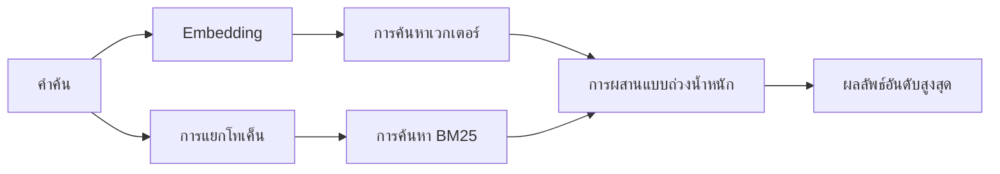

---
read_when:
    - คุณต้องการทำความเข้าใจว่า memory_search ทำงานอย่างไร
    - คุณต้องการเลือกผู้ให้บริการ Embedding
    - คุณต้องการปรับแต่งคุณภาพการค้นหา
summary: การค้นหาหน่วยความจำค้นหาบันทึกที่เกี่ยวข้องโดยใช้ embeddings และการดึงข้อมูลแบบไฮบริดได้อย่างไร
title: การค้นหาหน่วยความจำ
x-i18n:
    generated_at: "2026-07-16T19:09:31Z"
    model: gpt-5.6
    postprocess_version: locale-links-v1
    prompt_version: 32
    provider: openai
    source_hash: 2ae0830843fba28c24159d85425240051fb8caf086cd0563d3091890045dcfad
    source_path: concepts/memory-search.md
    workflow: 16
---

`memory_search` ค้นหาบันทึกที่เกี่ยวข้องจากไฟล์หน่วยความจำ แม้ถ้อยคำจะแตกต่างจากข้อความต้นฉบับ โดยแบ่งหน่วยความจำเป็นส่วนย่อยๆ และค้นหาด้วย embeddings คีย์เวิร์ด หรือทั้งสองอย่าง

## เริ่มต้นอย่างรวดเร็ว

OpenClaw ใช้ embeddings ของ OpenAI เป็นค่าเริ่มต้น หากต้องการใช้ผู้ให้บริการรายอื่น ให้กำหนดอย่างชัดเจน:

```json5
{
  agents: {
    defaults: {
      memorySearch: {
        provider: "openai", // หรือ "gemini", "voyage", "mistral", "bedrock", "local", "ollama", "lmstudio", "github-copilot", "openai-compatible"
      },
    },
  },
}
```

`provider` ยังสามารถอ้างอิงรายการ `models.providers.<id>` แบบกำหนดเองได้ (เช่น
`ollama-5080`) ตราบใดที่รายการนั้นกำหนด `api` เป็น `"ollama"` หรือ
ID ผู้ให้บริการรายอื่นที่มีอะแดปเตอร์ embedding สำหรับหน่วยความจำ

สำหรับ embeddings ภายในเครื่องที่ไม่ใช้คีย์ API ให้ติดตั้ง Plugin ผู้ให้บริการ llama.cpp อย่างเป็นทางการ
และกำหนด `provider: "local"`:

```bash
openclaw plugins install @openclaw/llama-cpp-provider
```

การเช็กเอาต์ซอร์สยังต้องอนุมัติการบิลด์แบบเนทีฟ: `pnpm approve-builds` จากนั้น
`pnpm rebuild node-llama-cpp`

ปลายทาง embedding บางรายการที่เข้ากันได้กับ OpenAI ต้องใช้ป้ายกำกับ `input_type`
แบบอสมมาตร เช่น `"query"` สำหรับการค้นหา และ `"document"`/`"passage"` สำหรับส่วนย่อย
ที่ทำดัชนีแล้ว กำหนดค่าเหล่านี้ด้วย `queryInputType` และ `documentInputType`; ดู
[ข้อมูลอ้างอิงการกำหนดค่าหน่วยความจำ](/th/reference/memory-config#provider-specific-config)

## ผู้ให้บริการที่รองรับ

| ผู้ให้บริการ          | ID                  | ต้องใช้คีย์ API | หมายเหตุ                             |
| ----------------- | ------------------- | ------------- | --------------------------------- |
| Bedrock           | `bedrock`           | ไม่            | ใช้สายโซ่ข้อมูลประจำตัวของ AWS     |
| DeepInfra         | `deepinfra`         | ใช่           | โมเดลเริ่มต้น `BAAI/bge-m3`       |
| Gemini            | `gemini`            | ใช่           | รองรับการทำดัชนีรูปภาพ/เสียง     |
| GitHub Copilot    | `github-copilot`    | ไม่            | ใช้การสมัครสมาชิก Copilot ของคุณ    |
| ภายในเครื่อง             | `local`             | ไม่            | โมเดล GGUF ดาวน์โหลดอัตโนมัติประมาณ 0.6 GB |
| LM Studio         | `lmstudio`          | ไม่            | เซิร์ฟเวอร์ภายในเครื่อง/โฮสต์เอง          |
| Mistral           | `mistral`           | ใช่           |                                   |
| Ollama            | `ollama`            | ไม่            | เซิร์ฟเวอร์ภายในเครื่อง/โฮสต์เอง          |
| OpenAI            | `openai`            | ใช่           | ค่าเริ่มต้น                           |
| เข้ากันได้กับ OpenAI | `openai-compatible` | โดยปกติ       | ปลายทาง `/v1/embeddings` ทั่วไป |
| Voyage            | `voyage`            | ใช่           |                                   |

## วิธีการทำงานของการค้นหา

OpenClaw เรียกใช้เส้นทางการดึงข้อมูลสองเส้นทางพร้อมกันและผสานผลลัพธ์:



- **การค้นหาเวกเตอร์** จับคู่ความหมายที่คล้ายกัน ("โฮสต์ Gateway" จับคู่กับ "เครื่อง
  ที่เรียกใช้ OpenClaw")
- **การค้นหาคีย์เวิร์ด BM25** จับคู่คำที่ตรงกันทุกประการ (ID, สตริงข้อผิดพลาด, คีย์
  การกำหนดค่า)
- **การค้นหาชื่อไฟล์** ทำดัชนีพาธแยกจากเนื้อหาบันทึก พาธแบบเต็มที่ตรงกันทุกประการ
  ชื่อไฟล์ฐาน และส่วนชื่อไฟล์ที่ไม่มีนามสกุล จะมีอันดับสูงกว่าพาธที่ตรงกันบางส่วน
  ขณะที่ตัวอย่างข้อความและคะแนนคีย์เวิร์ดในเนื้อหายังคงมาจากเนื้อหาบันทึก

หากมีเพียงเส้นทางเดียว เส้นทางนั้นจะทำงานเพียงลำพัง

**โหมด FTS เท่านั้น** กำหนด `provider: "none"` เพื่อปิดใช้ embeddings โดยตั้งใจ
และค้นหาด้วยคีย์เวิร์ดเท่านั้น การไม่กำหนด `provider` หรือกำหนดเป็น `"auto"`
จะย้อนกลับไปใช้การจัดอันดับด้วยคีย์เวิร์ดเท่านั้นเช่นกัน หากไม่ได้กำหนดค่าการยืนยันตัวตนสำหรับ embedding
โดยไม่เกิดข้อผิดพลาด และ `provider: "local"` (ผู้ให้บริการ GGUF/llama.cpp)
ก็ทำเช่นเดียวกันเมื่อล้มเหลว

**ผู้ให้บริการที่ระบุอย่างชัดเจนไม่พร้อมใช้งาน** หากระบุผู้ให้บริการรายอื่นอย่างชัดเจน
(เช่น `openai`, `ollama`, `gemini`) และผู้ให้บริการนั้นไม่พร้อมใช้งาน
ขณะส่งคำขอ (การยืนยันตัวตนไม่ถูกต้อง เครือข่ายล้มเหลว) `memory_search` จะรายงานว่าหน่วยความจำ
ไม่พร้อมใช้งาน แทนที่จะลดระดับเป็นผลลัพธ์แบบ FTS เท่านั้นโดยไม่แจ้งให้ทราบ วิธีนี้ทำให้มองเห็น
ผู้ให้บริการที่กำหนดค่าไว้แต่ขัดข้อง กำหนด `provider: "none"` สำหรับการเรียกคืน
แบบ FTS เท่านั้นโดยตั้งใจ หรือแก้ไขการกำหนดค่าผู้ให้บริการ/การยืนยันตัวตนเพื่อคืนค่าการจัดอันดับ
ตามความหมาย

## การปรับปรุงคุณภาพการค้นหา

ฟีเจอร์เสริมสองรายการช่วยจัดการประวัติบันทึกขนาดใหญ่

### การลดน้ำหนักตามเวลา

บันทึกเก่าจะค่อยๆ สูญเสียน้ำหนักในการจัดอันดับ เพื่อให้ข้อมูลล่าสุดปรากฏก่อน
ด้วยค่าครึ่งชีวิตเริ่มต้น 30 วัน บันทึกจากเดือนก่อนจะได้คะแนน 50% ของน้ำหนัก
เดิม `MEMORY.md` และไฟล์อื่นที่ไม่มีวันที่ภายใต้ `memory/` เป็นข้อมูลถาวร
และจะไม่ถูกลดน้ำหนัก มีเพียงไฟล์ `memory/YYYY-MM-DD.md` ที่ระบุวันที่เท่านั้นที่ถูกลดน้ำหนัก

<Tip>
เปิดใช้ตัวเลือกนี้หากเอเจนต์มีบันทึกรายวันหลายเดือนและข้อมูลเก่า
ยังคงมีอันดับสูงกว่าบริบทล่าสุด
</Tip>

### MMR (ความหลากหลาย)

ลดผลลัพธ์ที่ซ้ำซ้อน หากบันทึกห้ารายการกล่าวถึงการกำหนดค่าเราเตอร์เดียวกันทั้งหมด
MMR จะทำให้ผลลัพธ์อันดับสูงสุดครอบคลุมหัวข้อต่างๆ แทนการแสดงซ้ำ

<Tip>
เปิดใช้ตัวเลือกนี้หาก `memory_search` ยังคงส่งคืนตัวอย่างข้อความที่เกือบซ้ำกันจาก
บันทึกรายวันต่างรายการ
</Tip>

### เปิดใช้ทั้งสองอย่าง

```json5
{
  agents: {
    defaults: {
      memorySearch: {
        query: {
          hybrid: {
            mmr: { enabled: true },
            temporalDecay: { enabled: true },
          },
        },
      },
    },
  },
}
```

## หน่วยความจำหลายรูปแบบ

เมื่อใช้ `gemini-embedding-2-preview` สามารถทำดัชนีรูปภาพและเสียงควบคู่กับ
Markdown ได้ คุณสมบัตินี้ใช้กับไฟล์ภายใต้ `memorySearch.extraPaths` เท่านั้น ตำแหน่งราก
ของหน่วยความจำเริ่มต้น (`MEMORY.md`, `memory/*.md`) ยังคงรองรับเฉพาะ Markdown คำค้นหา
ยังคงเป็นข้อความ แต่สามารถจับคู่กับเนื้อหาภาพและเสียงได้ ดู
[ข้อมูลอ้างอิงการกำหนดค่าหน่วยความจำ](/th/reference/memory-config#multimodal-memory-gemini)
สำหรับการตั้งค่า

## การค้นหาหน่วยความจำเซสชัน

สำหรับการเรียกคืนข้อความแบบเต็มที่ตรงกันทุกประการจากทรานสคริปต์เซสชัน ให้ใช้ [`sessions_search`](/concepts/session-search)
จากนั้นเปิดผลลัพธ์ด้วย `sessions_history` การค้นหาหน่วยความจำเซสชันยังคงเป็นส่วนเสริม
เชิงความหมายที่อยู่ในขั้นทดลอง

เลือกทำดัชนีทรานสคริปต์เซสชันเพื่อให้ `memory_search` สามารถเรียกคืน
บทสนทนาก่อนหน้าได้ คุณสมบัตินี้ต้องเลือกเปิดใช้: กำหนด `experimental.sessionMemory: true` และเพิ่ม
`"sessions"` ไปยัง `sources` (ค่าเริ่มต้น `sources` คือ `["memory"]`)

ผลลัพธ์จากเซสชันเป็นไปตาม `tools.sessions.visibility`: ค่าเริ่มต้น `"tree"` จะเปิดเผยเฉพาะ
เซสชันปัจจุบันและเซสชันที่เซสชันนี้สร้างขึ้น หากต้องการเรียกคืนเซสชันที่ไม่เกี่ยวข้อง
ของเอเจนต์เดียวกันจากอีกเซสชันหนึ่ง (เช่น เซสชันที่ Gateway ส่งงานมาจาก DM)
ให้ขยายการมองเห็นเป็น `"agent"`

เมื่อใช้แบ็กเอนด์ QMD ให้กำหนด `memory.qmd.sessions.enabled: true` ด้วย เพื่อให้
ทรานสคริปต์ถูกส่งออกไปยังคอลเลกชัน QMD; `experimental.sessionMemory`
และ `sources` เพียงอย่างเดียวจะไม่ส่งออกทรานสคริปต์ไปยัง QMD ดู
[ข้อมูลอ้างอิงการกำหนดค่า](/th/reference/memory-config#session-memory-search-experimental)

## การแก้ไขปัญหา

**ไม่พบผลลัพธ์ใช่หรือไม่** เรียกใช้ `openclaw memory status` เพื่อตรวจสอบดัชนี หากว่าง ให้เรียกใช้
`openclaw memory index --force`

**พบเฉพาะคีย์เวิร์ดที่ตรงกันใช่หรือไม่** ผู้ให้บริการ embedding อาจยังไม่ได้กำหนดค่า ตรวจสอบ
`openclaw memory status --deep`

**Embeddings ภายในเครื่องหมดเวลาใช่หรือไม่** `ollama`, `lmstudio` และ `local` ใช้เวลา
หมดเวลาของแบตช์แบบอินไลน์ที่นานกว่าเป็นค่าเริ่มต้น หากโฮสต์ทำงานช้าเท่านั้น ให้กำหนด
`agents.defaults.memorySearch.sync.embeddingBatchTimeoutSeconds` และเรียกใช้
`openclaw memory index --force` อีกครั้ง

**ไม่พบข้อความ CJK ใช่หรือไม่** สร้างดัชนี FTS ใหม่ด้วย
`openclaw memory index --force`

## ที่เกี่ยวข้อง

- [ภาพรวมหน่วยความจำ](/th/concepts/memory)
- [Active Memory](/th/concepts/active-memory)
- [กลไกหน่วยความจำในตัว](/th/concepts/memory-builtin)
- [ข้อมูลอ้างอิงการกำหนดค่าหน่วยความจำ](/th/reference/memory-config)
