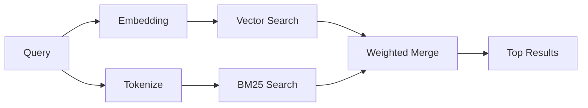

---
read_when:
    - คุณต้องการทำความเข้าใจว่า memory_search ทำงานอย่างไร
    - คุณต้องการเลือกผู้ให้บริการการฝังเวกเตอร์
    - คุณต้องการปรับแต่งคุณภาพการค้นหา
summary: วิธีที่การค้นหาหน่วยความจำค้นพบบันทึกที่เกี่ยวข้องโดยใช้เวกเตอร์ฝังตัวและการดึงข้อมูลแบบไฮบริด
title: การค้นหาหน่วยความจำ
x-i18n:
    generated_at: "2026-05-02T10:13:33Z"
    model: gpt-5.5
    provider: openai
    source_hash: 2a71fb0809d5c70689e8046f854e4b4b4e79f45769ac2964e40a762ebb4e91a8
    source_path: concepts/memory-search.md
    workflow: 16
---

`memory_search` ค้นหาโน้ตที่เกี่ยวข้องจากไฟล์หน่วยความจำของคุณ แม้เมื่อถ้อยคำแตกต่างจากข้อความต้นฉบับ โดยทำงานด้วยการทำดัชนีหน่วยความจำเป็นชิ้นเล็กๆ แล้วค้นหาด้วย embeddings, คำสำคัญ หรือทั้งสองแบบ

## เริ่มต้นอย่างรวดเร็ว

หากคุณมีการสมัครสมาชิก GitHub Copilot หรือกำหนดค่า API key ของ OpenAI, Gemini, Voyage หรือ Mistral ไว้ การค้นหาหน่วยความจำจะทำงานโดยอัตโนมัติ หากต้องการกำหนดผู้ให้บริการอย่างชัดเจน:

```json5
{
  agents: {
    defaults: {
      memorySearch: {
        provider: "openai", // or "gemini", "local", "ollama", etc.
      },
    },
  },
}
```

สำหรับการตั้งค่าหลาย endpoint `provider` ยังสามารถเป็นรายการ `models.providers.<id>` แบบกำหนดเองได้ เช่น `ollama-5080` เมื่อผู้ให้บริการนั้นตั้งค่า `api: "ollama"` หรือเจ้าของอะแดปเตอร์ embedding อื่น

สำหรับ embeddings แบบ local ที่ไม่มี API key ให้ตั้งค่า `provider: "local"` เช็กเอาต์ซอร์สอาจยังต้องการการอนุมัติ native build: `pnpm approve-builds` แล้วจึง `pnpm rebuild node-llama-cpp`

endpoint embedding ที่เข้ากันได้กับ OpenAI บางรายการต้องใช้ป้ายกำกับแบบอสมมาตร เช่น `input_type: "query"` สำหรับการค้นหา และ `input_type: "document"` หรือ `"passage"` สำหรับชิ้นข้อมูลที่ทำดัชนีไว้ กำหนดค่าด้วย `memorySearch.queryInputType` และ `memorySearch.documentInputType`; ดู [เอกสารอ้างอิงการกำหนดค่าหน่วยความจำ](/th/reference/memory-config#provider-specific-config)

## ผู้ให้บริการที่รองรับ

| ผู้ให้บริการ       | ID               | ต้องใช้ API key | หมายเหตุ                                                |
| -------------- | ---------------- | ------------- | ---------------------------------------------------- |
| Bedrock        | `bedrock`        | ไม่            | ตรวจพบอัตโนมัติเมื่อเชนข้อมูลรับรอง AWS resolved |
| Gemini         | `gemini`         | ใช่           | รองรับการทำดัชนีรูปภาพ/เสียง                        |
| GitHub Copilot | `github-copilot` | ไม่            | ตรวจพบอัตโนมัติ ใช้การสมัครสมาชิก Copilot             |
| Local          | `local`          | ไม่            | โมเดล GGUF, ดาวน์โหลด ~0.6 GB                         |
| Mistral        | `mistral`        | ใช่           | ตรวจพบอัตโนมัติ                                        |
| Ollama         | `ollama`         | ไม่            | Local, ต้องตั้งค่าอย่างชัดเจน                           |
| OpenAI         | `openai`         | ใช่           | ตรวจพบอัตโนมัติ รวดเร็ว                                  |
| Voyage         | `voyage`         | ใช่           | ตรวจพบอัตโนมัติ                                        |

## การค้นหาทำงานอย่างไร

OpenClaw เรียกใช้เส้นทางการดึงข้อมูลสองแบบพร้อมกันและรวมผลลัพธ์:



- **การค้นหาแบบเวกเตอร์** ค้นหาโน้ตที่มีความหมายคล้ายกัน ("gateway host" ตรงกับ
  "เครื่องที่กำลังรัน OpenClaw")
- **การค้นหาคำสำคัญ BM25** ค้นหารายการที่ตรงกันแบบเป๊ะๆ (ID, สตริงข้อผิดพลาด, คีย์การกำหนดค่า)

หากมีเพียงเส้นทางเดียวที่พร้อมใช้งาน (ไม่มี embeddings หรือไม่มี FTS) อีกเส้นทางจะทำงานเพียงลำพัง

เมื่อ embeddings ไม่พร้อมใช้งาน OpenClaw ยังคงใช้การจัดอันดับตามคำศัพท์เหนือผลลัพธ์ FTS แทนที่จะถอยกลับไปใช้เฉพาะการเรียงลำดับแบบตรงกันเป๊ะดิบๆ โหมดที่ลดระดับนี้จะเพิ่มน้ำหนักให้ชิ้นข้อมูลที่ครอบคลุมคำค้นได้ดีกว่าและมีพาธไฟล์ที่เกี่ยวข้อง ทำให้การเรียกคืนยังมีประโยชน์แม้ไม่มี `sqlite-vec` หรือผู้ให้บริการ embedding

## การปรับปรุงคุณภาพการค้นหา

ฟีเจอร์เสริมสองอย่างช่วยได้เมื่อคุณมีประวัติโน้ตขนาดใหญ่:

### การลดน้ำหนักตามเวลา

โน้ตเก่าจะค่อยๆ ลดน้ำหนักในการจัดอันดับ เพื่อให้ข้อมูลล่าสุดปรากฏก่อน ด้วยค่า half-life เริ่มต้น 30 วัน โน้ตจากเดือนที่แล้วจะได้คะแนน 50% ของน้ำหนักเดิม ไฟล์ที่ใช้ได้ตลอดเวลา เช่น `MEMORY.md` จะไม่ถูกลดน้ำหนัก

<Tip>
เปิดใช้การลดน้ำหนักตามเวลา หากเอเจนต์ของคุณมีโน้ตรายวันหลายเดือนและข้อมูลเก่าคอยจัดอันดับสูงกว่าบริบทล่าสุด
</Tip>

### MMR (ความหลากหลาย)

ลดผลลัพธ์ที่ซ้ำซ้อน หากโน้ตห้ารายการทั้งหมดกล่าวถึงการกำหนดค่าเราเตอร์เดียวกัน MMR จะทำให้ผลลัพธ์อันดับต้นๆ ครอบคลุมหัวข้อที่แตกต่างกันแทนการแสดงซ้ำ

<Tip>
เปิดใช้ MMR หาก `memory_search` ยังคงส่งคืน snippet ที่เกือบซ้ำกันจากโน้ตรายวันที่แตกต่างกัน
</Tip>

### เปิดใช้ทั้งสองอย่าง

```json5
{
  agents: {
    defaults: {
      memorySearch: {
        query: {
          hybrid: {
            mmr: { enabled: true },
            temporalDecay: { enabled: true },
          },
        },
      },
    },
  },
}
```

## หน่วยความจำหลายรูปแบบ

ด้วย Gemini Embedding 2 คุณสามารถทำดัชนีรูปภาพและไฟล์เสียงควบคู่ไปกับ Markdown ได้ คำค้นหายังคงเป็นข้อความ แต่จะจับคู่กับเนื้อหาภาพและเสียง ดู [เอกสารอ้างอิงการกำหนดค่าหน่วยความจำ](/th/reference/memory-config) สำหรับการตั้งค่า

## การค้นหาหน่วยความจำของเซสชัน

คุณสามารถเลือกทำดัชนีทรานสคริปต์ของเซสชัน เพื่อให้ `memory_search` เรียกคืนบทสนทนาก่อนหน้าได้ ฟีเจอร์นี้ต้องเลือกเปิดผ่าน `memorySearch.experimental.sessionMemory` ดู [เอกสารอ้างอิงการกำหนดค่า](/th/reference/memory-config) สำหรับรายละเอียด

## การแก้ไขปัญหา

**ไม่มีผลลัพธ์?** รัน `openclaw memory status` เพื่อตรวจสอบดัชนี หากว่าง ให้รัน `openclaw memory index --force`

**มีเฉพาะการจับคู่คำสำคัญ?** ผู้ให้บริการ embedding ของคุณอาจยังไม่ได้กำหนดค่า ตรวจสอบ `openclaw memory status --deep`

**embeddings แบบ Local หมดเวลา?** `ollama`, `lmstudio` และ `local` ใช้ค่า timeout ของ inline batch ที่ยาวกว่าโดยค่าเริ่มต้น หากโฮสต์ช้าเพียงอย่างเดียว ให้ตั้งค่า `agents.defaults.memorySearch.sync.embeddingBatchTimeoutSeconds` แล้วรัน `openclaw memory index --force` อีกครั้ง

**ไม่พบข้อความ CJK?** สร้างดัชนี FTS ใหม่ด้วย `openclaw memory index --force`

## อ่านเพิ่มเติม

- [Active Memory](/th/concepts/active-memory) -- หน่วยความจำของ sub-agent สำหรับเซสชันแชตแบบโต้ตอบ
- [หน่วยความจำ](/th/concepts/memory) -- เค้าโครงไฟล์, backend, เครื่องมือ
- [เอกสารอ้างอิงการกำหนดค่าหน่วยความจำ](/th/reference/memory-config) -- ปุ่มปรับแต่งการกำหนดค่าทั้งหมด

## ที่เกี่ยวข้อง

- [ภาพรวมหน่วยความจำ](/th/concepts/memory)
- [Active Memory](/th/concepts/active-memory)
- [เอนจินหน่วยความจำในตัว](/th/concepts/memory-builtin)
