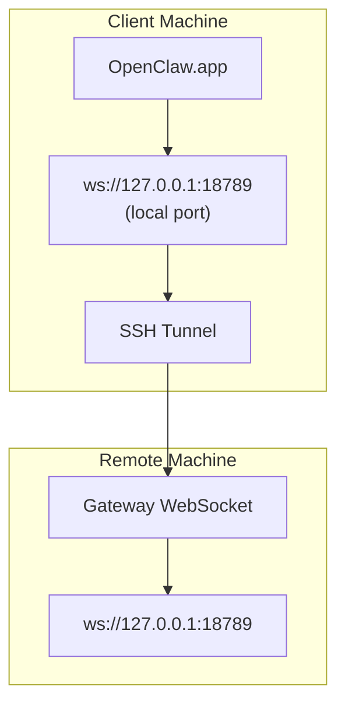

> เนื้อหานี้ถูกรวมเข้าไปใน [การเข้าถึงระยะไกล](/th/gateway/remote#macos-persistent-ssh-tunnel-via-launchagent) แล้ว ดูหน้านั้นสำหรับคู่มือปัจจุบัน

# การเรียกใช้ OpenClaw.app ด้วย Gateway ระยะไกล

OpenClaw.app ใช้การสร้างอุโมงค์ SSH เพื่อเชื่อมต่อกับ Gateway ระยะไกล คู่มือนี้แสดงวิธีตั้งค่า

## ภาพรวม



## การตั้งค่าอย่างรวดเร็ว

### ขั้นตอนที่ 1: เพิ่มการตั้งค่า SSH

แก้ไข `~/.ssh/config` แล้วเพิ่ม:

```ssh
Host remote-gateway
    HostName <REMOTE_IP>          # e.g., 172.27.187.184
    User <REMOTE_USER>            # e.g., jefferson
    LocalForward 18789 127.0.0.1:18789
    IdentityFile ~/.ssh/id_rsa
```

แทนที่ `<REMOTE_IP>` และ `<REMOTE_USER>` ด้วยค่าของคุณ

### ขั้นตอนที่ 2: คัดลอกคีย์ SSH

คัดลอกคีย์สาธารณะของคุณไปยังเครื่องระยะไกล (ป้อนรหัสผ่านหนึ่งครั้ง):

```bash
ssh-copy-id -i ~/.ssh/id_rsa <REMOTE_USER>@<REMOTE_IP>
```

### ขั้นตอนที่ 3: กำหนดค่าการตรวจสอบสิทธิ์ Gateway ระยะไกล

```bash
openclaw config set gateway.remote.token "<your-token>"
```

ใช้ `gateway.remote.password` แทนหาก Gateway ระยะไกลของคุณใช้การตรวจสอบสิทธิ์ด้วยรหัสผ่าน
`OPENCLAW_GATEWAY_TOKEN` ยังคงใช้ได้ในฐานะการ override ระดับ shell แต่การตั้งค่า
ไคลเอนต์ระยะไกลแบบถาวรคือ `gateway.remote.token` / `gateway.remote.password`

### ขั้นตอนที่ 4: เริ่มอุโมงค์ SSH

```bash
ssh -N remote-gateway &
```

### ขั้นตอนที่ 5: รีสตาร์ท OpenClaw.app

```bash
# Quit OpenClaw.app (⌘Q), then reopen:
open /path/to/OpenClaw.app
```

ตอนนี้แอปจะเชื่อมต่อกับ Gateway ระยะไกลผ่านอุโมงค์ SSH

---

## เริ่มอุโมงค์อัตโนมัติเมื่อเข้าสู่ระบบ

หากต้องการให้อุโมงค์ SSH เริ่มโดยอัตโนมัติเมื่อคุณเข้าสู่ระบบ ให้สร้าง Launch Agent

### สร้างไฟล์ PLIST

บันทึกไฟล์นี้เป็น `~/Library/LaunchAgents/ai.openclaw.ssh-tunnel.plist`:

```xml
<?xml version="1.0" encoding="UTF-8"?>
<!DOCTYPE plist PUBLIC "-//Apple//DTD PLIST 1.0//EN" "http://www.apple.com/DTDs/PropertyList-1.0.dtd">
<plist version="1.0">
<dict>
    <key>Label</key>
    <string>ai.openclaw.ssh-tunnel</string>
    <key>ProgramArguments</key>
    <array>
        <string>/usr/bin/ssh</string>
        <string>-N</string>
        <string>remote-gateway</string>
    </array>
    <key>KeepAlive</key>
    <true/>
    <key>RunAtLoad</key>
    <true/>
</dict>
</plist>
```

### โหลด Launch Agent

```bash
launchctl bootstrap gui/$UID ~/Library/LaunchAgents/ai.openclaw.ssh-tunnel.plist
```

ตอนนี้อุโมงค์จะ:

- เริ่มโดยอัตโนมัติเมื่อคุณเข้าสู่ระบบ
- รีสตาร์ทหากขัดข้อง
- ทำงานต่อไปในพื้นหลัง

หมายเหตุสำหรับระบบเดิม: ลบ LaunchAgent `com.openclaw.ssh-tunnel` ที่อาจเหลืออยู่ หากมี

---

## การแก้ไขปัญหา

**ตรวจสอบว่าอุโมงค์กำลังทำงานอยู่หรือไม่:**

```bash
ps aux | grep "ssh -N remote-gateway" | grep -v grep
lsof -i :18789
```

**รีสตาร์ทอุโมงค์:**

```bash
launchctl kickstart -k gui/$UID/ai.openclaw.ssh-tunnel
```

**หยุดอุโมงค์:**

```bash
launchctl bootout gui/$UID/ai.openclaw.ssh-tunnel
```

---

## วิธีทำงาน

| องค์ประกอบ                         | ทำอะไร                                            |
| ------------------------------------ | ------------------------------------------------------------ |
| `LocalForward 18789 127.0.0.1:18789` | ส่งต่อพอร์ตภายในเครื่อง 18789 ไปยังพอร์ตระยะไกล 18789 |
| `ssh -N`                             | SSH โดยไม่เรียกใช้คำสั่งระยะไกล (ทำเฉพาะการส่งต่อพอร์ต) |
| `KeepAlive`                          | รีสตาร์ทอุโมงค์โดยอัตโนมัติหากขัดข้อง |
| `RunAtLoad`                          | เริ่มอุโมงค์เมื่อ agent โหลด |

OpenClaw.app เชื่อมต่อกับ `ws://127.0.0.1:18789` บนเครื่องไคลเอนต์ของคุณ อุโมงค์ SSH จะส่งต่อการเชื่อมต่อนั้นไปยังพอร์ต 18789 บนเครื่องระยะไกลที่ Gateway กำลังทำงานอยู่

## ที่เกี่ยวข้อง

- [การเข้าถึงระยะไกล](/th/gateway/remote)
- [Tailscale](/th/gateway/tailscale)
