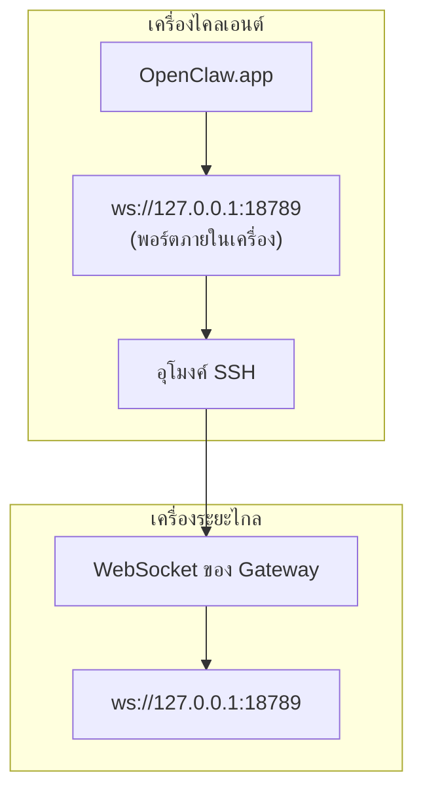

<Note>
เนื้อหานี้ได้ย้ายไปอยู่ที่ [การเข้าถึงจากระยะไกล](/th/gateway/remote#macos-persistent-ssh-tunnel-via-launchagent) แล้ว โปรดใช้หน้านั้นสำหรับคู่มือฉบับปัจจุบัน ส่วนหน้านี้ยังคงไว้เป็นปลายทางการเปลี่ยนเส้นทาง
</Note>

# การใช้งาน OpenClaw.app กับ Gateway ระยะไกล

OpenClaw.app เชื่อมต่อกับ Gateway ระยะไกลผ่านอุโมงค์ SSH โดย `LocalForward` ของ SSH จะแมปพอร์ตภายในเครื่องไปยังพอร์ต WebSocket ของ Gateway บนโฮสต์ระยะไกล

## การตั้งค่า

1. เพิ่มรายการกำหนดค่า SSH ที่มี `LocalForward 18789 127.0.0.1:18789` (ดูบล็อกการกำหนดค่าฉบับเต็มได้ที่ [การเข้าถึงจากระยะไกล](/th/gateway/remote#macos-persistent-ssh-tunnel-via-launchagent))
2. คัดลอกคีย์ SSH ของคุณไปยังโฮสต์ระยะไกลด้วย `ssh-copy-id`
3. ตั้งค่า `gateway.remote.token` (หรือ `gateway.remote.password`) ผ่าน `openclaw config set gateway.remote.token "<your-token>"`
4. เริ่มอุโมงค์: `ssh -N remote-gateway &`
5. ปิดและเปิด OpenClaw.app ใหม่

หากต้องการอุโมงค์ที่ยังคงทำงานหลังจากรีบูตและเชื่อมต่อใหม่โดยอัตโนมัติ ให้ใช้การตั้งค่า LaunchAgent ในหน้า [การเข้าถึงจากระยะไกล](/th/gateway/remote#macos-persistent-ssh-tunnel-via-launchagent) แทนการเรียกใช้ `ssh -N` ด้วยตนเอง

## หลักการทำงาน

| องค์ประกอบ                           | หน้าที่                                                          |
| ------------------------------------ | ---------------------------------------------------------------- |
| `LocalForward 18789 127.0.0.1:18789` | ส่งต่อพอร์ต 18789 ภายในเครื่องไปยังพอร์ต 18789 บนเครื่องระยะไกล |
| `ssh -N`                             | ใช้ SSH โดยไม่เรียกใช้คำสั่งบนเครื่องระยะไกล (ส่งต่อพอร์ตเท่านั้น) |
| `KeepAlive`                          | เริ่มอุโมงค์ใหม่โดยอัตโนมัติหากหยุดทำงาน (LaunchAgent)          |
| `RunAtLoad`                          | เริ่มอุโมงค์เมื่อ LaunchAgent โหลด (LaunchAgent)                 |

OpenClaw.app เชื่อมต่อกับ `ws://127.0.0.1:18789` บนเครื่องไคลเอนต์ อุโมงค์จะส่งต่อการเชื่อมต่อนั้นไปยังพอร์ต 18789 บนโฮสต์ระยะไกลที่ใช้งาน Gateway

## เนื้อหาที่เกี่ยวข้อง

- [การเข้าถึงจากระยะไกล](/th/gateway/remote)
- [Tailscale](/th/gateway/tailscale)
