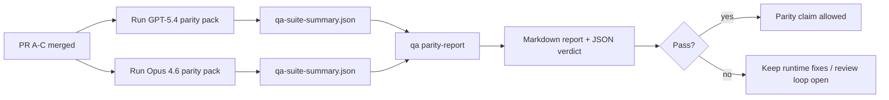

---
read_when:
    - การรีวิวชุด PR สำหรับ parity ของ GPT-5.4 / Codex
    - การดูแลสถาปัตยกรรม agentic แบบหกสัญญาที่อยู่เบื้องหลังโครงการ parity
summary: วิธีรีวิวโครงการ parity ของ GPT-5.4 / Codex ในรูปแบบหน่วย merge สี่ส่วน
title: บันทึกสำหรับผู้ดูแล parity ของ GPT-5.4 / Codex
x-i18n:
    generated_at: "2026-04-25T13:50:04Z"
    model: gpt-5.4
    provider: openai
    source_hash: 162ea68476880d4dbf9b8c3b9397a51a2732c3eb10ac52e421a9c9d90e04eec2
    source_path: help/gpt54-codex-agentic-parity-maintainers.md
    workflow: 15
---

บันทึกนี้อธิบายวิธีรีวิวโครงการ parity ของ GPT-5.4 / Codex ในรูปแบบหน่วย merge สี่ส่วน โดยไม่ทำให้สถาปัตยกรรมแบบหกสัญญาเดิมสูญหายไป

## หน่วย merge

### PR A: การทำงานแบบ strict-agentic

ครอบคลุม:

- `executionContract`
- การทำงานต่อใน turn เดียวกันแบบ GPT-5-first
- `update_plan` ในฐานะการติดตามความคืบหน้าแบบไม่ใช่จุดสิ้นสุด
- สถานะติดขัดแบบ explicit แทนการหยุดเงียบที่มีแต่แผน

ไม่ครอบคลุม:

- การจัดประเภทความล้มเหลวของ auth/runtime
- ความถูกต้องตรงไปตรงมาของ permission
- การออกแบบ replay/continuation ใหม่
- parity benchmarking

### PR B: ความถูกต้องตรงไปตรงมาของ runtime

ครอบคลุม:

- ความถูกต้องของ scope ใน Codex OAuth
- การจัดประเภทความล้มเหลวของ provider/runtime แบบมีชนิด
- ความพร้อมใช้งานจริงของ `/elevated full` และเหตุผลที่ถูกบล็อก

ไม่ครอบคลุม:

- การ normalize schema ของ tool
- สถานะ replay/liveness
- benchmark gating

### PR C: ความถูกต้องของการทำงาน

ครอบคลุม:

- ความเข้ากันได้ของ OpenAI/Codex tool ที่เป็นเจ้าของโดย provider
- การจัดการ strict schema แบบไม่มีพารามิเตอร์
- การแสดง replay-invalid
- การมองเห็นสถานะ paused, blocked และ abandoned ของงานยาว

ไม่ครอบคลุม:

- continuation ที่เลือกเอง
- พฤติกรรม dialect ของ Codex แบบทั่วไปนอกเหนือจาก provider hooks
- benchmark gating

### PR D: parity harness

ครอบคลุม:

- first-wave scenario pack ของ GPT-5.4 เทียบกับ Opus 4.6
- เอกสาร parity
- parity report และกลไก release-gate

ไม่ครอบคลุม:

- การเปลี่ยนแปลงพฤติกรรม runtime นอก QA-lab
- การจำลอง auth/proxy/DNS ภายใน harness

## การแมปกลับไปยังหกสัญญาเดิม

| สัญญาเดิม                                 | หน่วย merge |
| ----------------------------------------- | ----------- |
| ความถูกต้องของ provider transport/auth    | PR B        |
| ความเข้ากันได้ของ tool contract/schema   | PR C        |
| การทำงานใน turn เดียวกัน                  | PR A        |
| ความถูกต้องตรงไปตรงมาของ permission      | PR B        |
| ความถูกต้องของ replay/continuation/liveness | PR C      |
| Benchmark/release gate                    | PR D        |

## ลำดับการรีวิว

1. PR A
2. PR B
3. PR C
4. PR D

PR D คือชั้นพิสูจน์ผล ไม่ควรเป็นเหตุผลที่ทำให้ PR ด้านความถูกต้องของ runtime ล่าช้า

## สิ่งที่ควรมองหา

### PR A

- การรัน GPT-5 ลงมือทำหรือ fail closed แทนการหยุดแค่คำอธิบาย
- `update_plan` ไม่ดูเหมือนความคืบหน้าในตัวมันเองอีกต่อไป
- พฤติกรรมยังคงเป็น GPT-5-first และอยู่ในขอบเขต embedded-Pi

### PR B

- ความล้มเหลวของ auth/proxy/runtime ไม่ถูกรวมเป็นการจัดการ “model failed” แบบกว้างๆ อีกต่อไป
- `/elevated full` ถูกอธิบายว่าใช้ได้เฉพาะเมื่อใช้ได้จริงเท่านั้น
- เหตุผลที่ถูกบล็อกมองเห็นได้ทั้งกับโมเดลและ runtime ที่ผู้ใช้เห็น

### PR C

- การลงทะเบียน strict OpenAI/Codex tool มีพฤติกรรมที่คาดการณ์ได้
- tools แบบไม่มีพารามิเตอร์ไม่ล้มเหลวในการตรวจ strict schema
- ผลลัพธ์ของ replay และ Compaction รักษาสถานะ liveness ที่ตรงไปตรงมาไว้

### PR D

- scenario pack เข้าใจได้และทำซ้ำได้
- pack มี lane ความปลอดภัยของ replay แบบ mutating ไม่ใช่แค่โฟลว์แบบ read-only
- reports อ่านได้ทั้งโดยมนุษย์และระบบอัตโนมัติ
- คำกล่าวอ้างเรื่อง parity มีหลักฐานรองรับ ไม่ใช่แค่ประสบการณ์เล่า

artifacts ที่คาดหวังจาก PR D:

- `qa-suite-report.md` / `qa-suite-summary.json` สำหรับการรันแต่ละโมเดล
- `qa-agentic-parity-report.md` พร้อมการเปรียบเทียบทั้งแบบรวมและระดับ scenario
- `qa-agentic-parity-summary.json` พร้อม verdict ที่เครื่องอ่านได้

## Release gate

อย่าอ้างว่า GPT-5.4 มี parity หรือเหนือกว่า Opus 4.6 จนกว่าจะ:

- PR A, PR B และ PR C merge แล้ว
- PR D รัน first-wave parity pack ผ่านอย่างสะอาด
- regression suites ของ runtime-truthfulness ยังคงเป็นสีเขียว
- parity report ไม่แสดงกรณี fake-success และไม่มี regression ในพฤติกรรมการหยุด

parity harness ไม่ใช่แหล่งหลักฐานเพียงแหล่งเดียว ให้คงการแยกนี้ไว้อย่างชัดเจนในการรีวิว:

- PR D เป็นเจ้าของการเปรียบเทียบ GPT-5.4 กับ Opus 4.6 แบบอิง scenario
- deterministic suites ของ PR B ยังคงเป็นเจ้าของหลักฐานด้าน auth/proxy/DNS และความถูกต้องตรงไปตรงมาของการเข้าถึงแบบเต็ม

## Quick maintainer merge workflow

ใช้สิ่งนี้เมื่อคุณพร้อมจะ land parity PR และต้องการลำดับที่ทำซ้ำได้และมีความเสี่ยงต่ำ

1. ยืนยันว่า evidence bar ผ่านก่อน merge:
   - อาการที่ทำซ้ำได้หรือการทดสอบที่ล้มเหลว
   - ยืนยัน root cause ในโค้ดที่ถูกแตะต้องแล้ว
   - มีการแก้ไขในเส้นทางที่เป็นสาเหตุ
   - มี regression test หรือบันทึกการยืนยันด้วยตนเองอย่างชัดเจน
2. คัดแยก/ติดป้ายก่อน merge:
   - ใช้ labels `r:*` สำหรับ auto-close เมื่อ PR ไม่ควรถูก land
   - ให้ merge candidates ไม่มี blocker threads ที่ยังไม่คลี่คลาย
3. ตรวจสอบในเครื่องบนพื้นผิวที่ถูกแตะต้อง:
   - `pnpm check:changed`
   - `pnpm test:changed` เมื่อมีการเปลี่ยนการทดสอบ หรือความมั่นใจในการแก้บั๊กขึ้นอยู่กับ test coverage
4. Land ด้วยโฟลว์ maintainer มาตรฐาน (กระบวนการ `/landpr`) แล้วตรวจสอบ:
   - พฤติกรรม auto-close ของ issues ที่ลิงก์ไว้
   - CI และสถานะหลัง merge บน `main`
5. หลัง land แล้ว ให้ค้นหางานที่ซ้ำกันใน PRs/issues ที่ยังเปิดอยู่ และปิดเฉพาะเมื่อมี canonical reference

หากขาดรายการใดรายการหนึ่งใน evidence bar ให้ขอ changes แทนการ merge

## แผนที่เป้าหมายสู่หลักฐาน

| รายการใน completion gate                  | เจ้าของหลัก | artifact สำหรับรีวิว                                            |
| ---------------------------------------- | ----------- | --------------------------------------------------------------- |
| ไม่มีการค้างที่มีแต่แผน                   | PR A        | strict-agentic runtime tests และ `approval-turn-tool-followthrough` |
| ไม่มีความคืบหน้าปลอมหรือการทำ tool เสร็จปลอม | PR A + PR D | จำนวน fake-success ใน parity พร้อมรายละเอียดรายระดับ scenario |
| ไม่มีคำแนะนำ `/elevated full` ที่ผิด       | PR B        | deterministic runtime-truthfulness suites                       |
| ความล้มเหลวของ replay/liveness ยังชัดเจน  | PR C + PR D | lifecycle/replay suites พร้อม `compaction-retry-mutating-tool` |
| GPT-5.4 เทียบเท่าหรือดีกว่า Opus 4.6      | PR D        | `qa-agentic-parity-report.md` และ `qa-agentic-parity-summary.json` |

## ชวเลขสำหรับผู้รีวิว: ก่อน vs หลัง

| ปัญหาที่ผู้ใช้มองเห็นก่อน                                  | สัญญาณในการรีวิวหลังจากนั้น                                                       |
| ----------------------------------------------------------- | ---------------------------------------------------------------------------------- |
| GPT-5.4 หยุดหลังจากวางแผน                                   | PR A แสดงพฤติกรรมแบบลงมือทำหรือบล็อก แทนการจบด้วยคำอธิบายอย่างเดียว             |
| การใช้ tool ดูเปราะบางกับ strict OpenAI/Codex schemas      | PR C ทำให้การลงทะเบียน tool และการเรียกแบบไม่มีพารามิเตอร์มีพฤติกรรมที่คาดการณ์ได้ |
| คำแนะนำ `/elevated full` บางครั้งทำให้เข้าใจผิด             | PR B ผูกคำแนะนำเข้ากับความสามารถจริงของ runtime และเหตุผลที่ถูกบล็อก             |
| งานยาวอาจหายไปในความกำกวมของ replay/Compaction             | PR C ส่งสถานะ paused, blocked, abandoned และ replay-invalid แบบชัดเจน             |
| คำกล่าวอ้างเรื่อง parity เป็นเพียงประสบการณ์เล่า            | PR D สร้างรายงานพร้อม JSON verdict ด้วยความครอบคลุม scenario เดียวกันบนทั้งสองโมเดล |

## ที่เกี่ยวข้อง

- [GPT-5.4 / Codex agentic parity](/th/help/gpt54-codex-agentic-parity)
