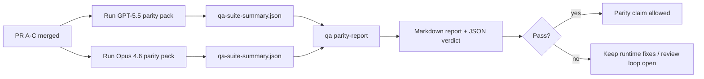

---
read_when:
    - การรีวิวชุด PR ความสอดคล้องระหว่าง GPT-5.5 / Codex
    - การดูแลรักษาสถาปัตยกรรมแบบเอเจนต์ที่มีหกสัญญาซึ่งอยู่เบื้องหลังโปรแกรมความเทียบเท่า
summary: วิธีตรวจทานโครงการความเท่าเทียมของ GPT-5.5 / Codex เป็นหน่วยการรวมสี่หน่วย
title: บันทึกผู้ดูแลเกี่ยวกับความเท่าเทียมของ GPT-5.5 / Codex
x-i18n:
    generated_at: "2026-05-06T09:16:33Z"
    model: gpt-5.5
    provider: openai
    source_hash: 5752b4610f8b0d70b80d880ea10df75478b5f85ca431cdb73d3b61d745b23356
    source_path: help/gpt55-codex-agentic-parity-maintainers.md
    workflow: 16
---

บันทึกนี้อธิบายวิธีตรวจทานโปรแกรมความเท่าเทียม GPT-5.5 / Codex เป็นหน่วย merge สี่หน่วย โดยไม่สูญเสียสถาปัตยกรรมหกสัญญาเดิม

## หน่วย merge

### PR A: การดำเนินการแบบ agentic ที่เข้มงวด

รับผิดชอบ:

- `executionContract`
- การติดตามงานให้จบภายใน turn เดียวกันแบบเน้น GPT-5 เป็นอันดับแรก
- `update_plan` ในฐานะการติดตามความคืบหน้าแบบไม่ใช่สถานะปลายทาง
- สถานะถูกบล็อกที่ชัดเจนแทนการหยุดเงียบแบบมีแต่แผน

ไม่รับผิดชอบ:

- การจัดประเภทความล้มเหลวของ auth/runtime
- ความซื่อตรงของ permission
- การออกแบบ replay/continuation ใหม่
- การวัดเปรียบเทียบความเท่าเทียม

### PR B: ความซื่อตรงของ runtime

รับผิดชอบ:

- ความถูกต้องของ scope OAuth ของ Codex
- การจัดประเภทความล้มเหลวของ provider/runtime แบบมีชนิด
- ความพร้อมใช้งานและเหตุผลการถูกบล็อกของ `/elevated full` ที่ตรงความจริง

ไม่รับผิดชอบ:

- การทำ normalization ของ tool schema
- สถานะ replay/liveness
- การตั้ง gate สำหรับ benchmark

### PR C: ความถูกต้องของการดำเนินการ

รับผิดชอบ:

- ความเข้ากันได้ของเครื่องมือ OpenAI/Codex ที่ provider เป็นเจ้าของ
- การจัดการ strict schema แบบไม่มี parameter
- การแสดง replay-invalid
- การมองเห็นสถานะงานยาวที่ paused, blocked และ abandoned

ไม่รับผิดชอบ:

- continuation ที่เลือกเอง
- พฤติกรรม dialect ทั่วไปของ Codex นอก provider hooks
- การตั้ง gate สำหรับ benchmark

### PR D: ชุดทดสอบความเท่าเทียม

รับผิดชอบ:

- ชุด scenario ระลอกแรกสำหรับ GPT-5.5 เทียบกับ Opus 4.6
- เอกสารความเท่าเทียม
- รายงานความเท่าเทียมและกลไก release-gate

ไม่รับผิดชอบ:

- การเปลี่ยนแปลงพฤติกรรม runtime นอก QA-lab
- การจำลอง auth/proxy/DNS ภายในชุดทดสอบ

## การแมปกลับไปยังหกสัญญาเดิม

| สัญญาเดิม                                | หน่วย merge |
| ---------------------------------------- | ---------- |
| ความถูกต้องของ transport/auth ของ provider | PR B       |
| ความเข้ากันได้ของ tool contract/schema   | PR C       |
| การดำเนินการใน turn เดียวกัน             | PR A       |
| ความซื่อตรงของ permission                | PR B       |
| ความถูกต้องของ replay/continuation/liveness | PR C       |
| Benchmark/release gate                   | PR D       |

## ลำดับการตรวจทาน

1. PR A
2. PR B
3. PR C
4. PR D

PR D คือชั้นพิสูจน์ ไม่ควรเป็นเหตุให้ PR ด้านความถูกต้องของ runtime ล่าช้า

## สิ่งที่ต้องตรวจดู

### PR A

- การรัน GPT-5 ลงมือทำหรือ fail closed แทนการหยุดที่ commentary
- `update_plan` ไม่ดูเหมือนความคืบหน้าโดยตัวมันเองอีกต่อไป
- พฤติกรรมยังคงเน้น GPT-5 เป็นอันดับแรกและจำกัดขอบเขตกับ Pi แบบฝังตัว

### PR B

- ความล้มเหลวของ auth/proxy/runtime ไม่ถูกยุบเป็นการจัดการแบบทั่วไปว่า "model failed" อีกต่อไป
- `/elevated full` ถูกอธิบายว่าพร้อมใช้งานก็ต่อเมื่อพร้อมใช้งานจริง
- เหตุผลการถูกบล็อกมองเห็นได้ทั้งกับโมเดลและ runtime ที่ผู้ใช้เห็น

### PR C

- การลงทะเบียนเครื่องมือ OpenAI/Codex แบบเข้มงวดมีพฤติกรรมคาดเดาได้
- เครื่องมือที่ไม่มี parameter ไม่ล้มเหลวในการตรวจ strict schema
- ผลลัพธ์ของ replay และ Compaction รักษาสถานะ liveness ที่ตรงความจริง

### PR D

- ชุด scenario เข้าใจได้และทำซ้ำได้
- ชุดนี้มี lane ความปลอดภัยของ replay แบบมีการเปลี่ยนแปลง ไม่ใช่เฉพาะ flow แบบอ่านอย่างเดียว
- รายงานอ่านได้ทั้งโดยมนุษย์และระบบอัตโนมัติ
- คำกล่าวอ้างเรื่องความเท่าเทียมมีหลักฐานรองรับ ไม่ใช่เรื่องเล่าจากประสบการณ์

artifact ที่คาดหวังจาก PR D:

- `qa-suite-report.md` / `qa-suite-summary.json` สำหรับการรันแต่ละโมเดล
- `qa-agentic-parity-report.md` พร้อมการเปรียบเทียบระดับรวมและระดับ scenario
- `qa-agentic-parity-summary.json` พร้อมคำตัดสินที่เครื่องอ่านได้

## Release gate

อย่าอ้างว่า GPT-5.5 เท่าเทียมหรือเหนือกว่า Opus 4.6 จนกว่า:

- PR A, PR B และ PR C จะ merge แล้ว
- PR D รันชุดความเท่าเทียมระลอกแรกได้สะอาด
- ชุด regression ด้านความซื่อตรงของ runtime ยังคงผ่าน
- รายงานความเท่าเทียมไม่แสดงกรณี fake-success และไม่มี regression ในพฤติกรรมการหยุด

ชุดทดสอบความเท่าเทียมไม่ใช่แหล่งหลักฐานเพียงแหล่งเดียว ให้แยกเรื่องนี้ไว้อย่างชัดเจนในการตรวจทาน:

- PR D รับผิดชอบการเปรียบเทียบ GPT-5.5 กับ Opus 4.6 ตาม scenario
- ชุด deterministic ของ PR B ยังคงรับผิดชอบหลักฐานด้าน auth/proxy/DNS และความซื่อตรงของ full-access

## Workflow merge ด่วนสำหรับ maintainer

ใช้ส่วนนี้เมื่อคุณพร้อม land PR ความเท่าเทียมและต้องการลำดับที่ทำซ้ำได้และความเสี่ยงต่ำ

1. ยืนยันว่าเกณฑ์หลักฐานผ่านก่อน merge:
   - symptom ที่ทำซ้ำได้หรือ test ที่ล้มเหลว
   - root cause ที่ตรวจยืนยันแล้วใน code ที่แตะ
   - fix ใน path ที่เกี่ยวข้อง
   - regression test หรือบันทึกการยืนยันด้วยมือที่ชัดเจน
2. Triage/label ก่อน merge:
   - ใช้ label auto-close `r:*` ใด ๆ เมื่อ PR ไม่ควร land
   - รักษา merge candidates ให้ไม่มี thread ตัวบล็อกที่ยังไม่ resolved
3. ตรวจสอบในเครื่องบนพื้นผิวที่แตะ:
   - `pnpm check:changed`
   - `pnpm test:changed` เมื่อ test เปลี่ยนหรือความมั่นใจของ bug-fix ขึ้นกับ coverage ของ test
4. Land ด้วย flow มาตรฐานของ maintainer (กระบวนการ `/landpr`) แล้วตรวจสอบ:
   - พฤติกรรม auto-close ของ issue ที่ลิงก์ไว้
   - CI และสถานะหลัง merge บน `main`
5. หลัง land แล้ว ให้ค้นหา duplicate สำหรับ PR/issue เปิดที่เกี่ยวข้อง และปิดเฉพาะเมื่อมี reference มาตรฐานเท่านั้น

หากมีรายการใดรายการหนึ่งในเกณฑ์หลักฐานที่ขาดไป ให้ request changes แทนการ merge

## แผนที่เป้าหมายสู่หลักฐาน

| รายการ completion gate                   | เจ้าของหลัก | artifact สำหรับตรวจทาน                                      |
| ---------------------------------------- | ------------- | ------------------------------------------------------------------- |
| ไม่มีการค้างแบบมีแต่แผน                 | PR A          | test runtime แบบ strict-agentic และ `approval-turn-tool-followthrough` |
| ไม่มีความคืบหน้าปลอมหรือการทำเครื่องมือเสร็จปลอม | PR A + PR D   | จำนวน fake-success ของความเท่าเทียมพร้อมรายละเอียดรายงานระดับ scenario |
| ไม่มีคำแนะนำ `/elevated full` ที่ผิดพลาด | PR B          | ชุด deterministic ด้านความซื่อตรงของ runtime                       |
| ความล้มเหลวของ replay/liveness ยังคงชัดเจน | PR C + PR D   | ชุด lifecycle/replay พร้อม `compaction-retry-mutating-tool`       |
| GPT-5.5 เทียบเท่าหรือดีกว่า Opus 4.6    | PR D          | `qa-agentic-parity-report.md` และ `qa-agentic-parity-summary.json`  |

## คำย่อสำหรับ reviewer: ก่อนเทียบกับหลัง

| ปัญหาที่ผู้ใช้มองเห็นก่อนหน้า                           | สัญญาณการตรวจทานหลังแก้ไข                                                        |
| ----------------------------------------------------------- | --------------------------------------------------------------------------------------- |
| GPT-5.5 หยุดหลังวางแผน                              | PR A แสดงพฤติกรรม act-or-block แทนการจบแบบมีแต่ commentary                  |
| การใช้เครื่องมือรู้สึกเปราะกับ schema OpenAI/Codex แบบเข้มงวด | PR C ทำให้การลงทะเบียนเครื่องมือและการเรียกแบบไม่มี parameter คาดเดาได้ |
| คำใบ้ `/elevated full` บางครั้งทำให้เข้าใจผิด            | PR B ผูกคำแนะนำกับ capability ของ runtime จริงและเหตุผลการถูกบล็อก                     |
| งานยาวอาจหายไปในความกำกวมของ replay/Compaction | PR C emit สถานะ paused, blocked, abandoned และ replay-invalid ที่ชัดเจน                |
| คำกล่าวอ้างเรื่องความเท่าเทียมเป็นเรื่องเล่าจากประสบการณ์ | PR D สร้างรายงานพร้อมคำตัดสิน JSON โดยมี coverage ของ scenario เดียวกันบนทั้งสองโมเดล |

## ที่เกี่ยวข้อง

- [ความเท่าเทียมเชิง agentic ของ GPT-5.5 / Codex](/th/help/gpt55-codex-agentic-parity)
