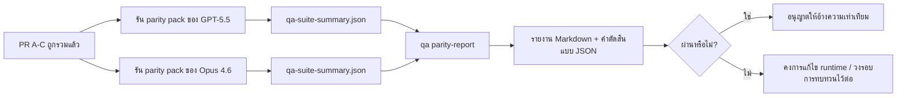

---
read_when:
    - การทบทวนชุด PR ความเท่าเทียมของ GPT-5.5 / Codex
    - การดูแลสถาปัตยกรรม agentic แบบหกสัญญาที่อยู่เบื้องหลังโปรแกรมความเท่าเทียม
summary: วิธีทบทวนโปรแกรมความเท่าเทียมของ GPT-5.5 / Codex เป็นหน่วยรวมสี่ส่วน
title: บันทึกสำหรับผู้ดูแลเกี่ยวกับความเท่าเทียมของ GPT-5.5 / Codex
x-i18n:
    generated_at: "2026-04-26T11:32:54Z"
    model: gpt-5.4
    provider: openai
    source_hash: 8de69081f5985954b88583880c36388dc47116c3351c15d135b8ab3a660058e3
    source_path: help/gpt55-codex-agentic-parity-maintainers.md
    workflow: 15
---

บันทึกนี้อธิบายวิธีทบทวนโปรแกรมความเท่าเทียมของ GPT-5.5 / Codex เป็นหน่วยรวมสี่ส่วน โดยไม่สูญเสียสถาปัตยกรรมแบบหกสัญญาดั้งเดิม

## หน่วยรวม

### PR A: การรันแบบ strict-agentic

รับผิดชอบ:

- `executionContract`
- การทำงานต่อเนื่องในเทิร์นเดียวกันแบบ GPT-5-first
- `update_plan` ในฐานะการติดตามความคืบหน้าที่ไม่ใช่สถานะปลายทาง
- สถานะติดขัดแบบ explicit แทนการหยุดเงียบ ๆ แบบมีแต่แผน

ไม่รับผิดชอบ:

- การจัดประเภทความล้มเหลวของ auth/runtime
- ความซื่อสัตย์ของ permission
- การออกแบบ replay/continuation ใหม่
- การวัดความเท่าเทียม

### PR B: ความซื่อสัตย์ของ runtime

รับผิดชอบ:

- ความถูกต้องของ OAuth scope ของ Codex
- การจัดประเภทความล้มเหลวของ provider/runtime แบบมีชนิด
- ความพร้อมใช้งานของ `/elevated full` และเหตุผลการถูกบล็อกที่ตรงความจริง

ไม่รับผิดชอบ:

- การทำ schema ของเครื่องมือให้เป็นแบบเดียวกัน
- สถานะ replay/liveness
- benchmark gating

### PR C: ความถูกต้องของการรัน

รับผิดชอบ:

- ความเข้ากันได้ของเครื่องมือ OpenAI/Codex ที่ผู้ให้บริการเป็นเจ้าของ
- การจัดการ strict schema สำหรับกรณีไม่มีพารามิเตอร์
- การแสดงผล replay-invalid
- การมองเห็นสถานะงานยาวแบบ paused, blocked และ abandoned

ไม่รับผิดชอบ:

- continuation ที่เลือกเอง
- พฤติกรรมของ dialect Codex แบบทั่วไปนอกเหนือจาก provider hooks
- benchmark gating

### PR D: parity harness

รับผิดชอบ:

- ชุดสถานการณ์ระลอกแรกของ GPT-5.5 เทียบกับ Opus 4.6
- เอกสารความเท่าเทียม
- กลไกรายงานความเท่าเทียมและ release gate

ไม่รับผิดชอบ:

- การเปลี่ยนแปลงพฤติกรรม runtime นอก QA-lab
- การจำลอง auth/proxy/DNS ภายใน harness

## การแมปกลับไปยังหกสัญญาดั้งเดิม

| สัญญาดั้งเดิม                            | หน่วยรวม |
| ---------------------------------------- | --------- |
| ความถูกต้องของ transport/auth ของ Provider | PR B      |
| ความเข้ากันได้ของสัญญา/schema ของเครื่องมือ | PR C      |
| การรันในเทิร์นเดียวกัน                   | PR A      |
| ความซื่อสัตย์ของ permission              | PR B      |
| ความถูกต้องของ replay/continuation/liveness | PR C      |
| benchmark/release gate                   | PR D      |

## ลำดับการทบทวน

1. PR A
2. PR B
3. PR C
4. PR D

PR D คือชั้นพิสูจน์ ไม่ควรเป็นเหตุผลที่ทำให้ PR ด้านความถูกต้องของ runtime ล่าช้า

## สิ่งที่ควรมองหา

### PR A

- GPT-5 รัน action หรือ fail closed แทนการหยุดอยู่ที่คำอธิบาย
- `update_plan` ไม่ดูเหมือนความคืบหน้าในตัวมันเองอีกต่อไป
- พฤติกรรมยังคงเป็น GPT-5-first และมีขอบเขตอยู่ที่ embedded-Pi

### PR B

- ความล้มเหลวของ auth/proxy/runtime ไม่ถูกยุบรวมเป็นการจัดการ “model failed” แบบทั่วไปอีกต่อไป
- `/elevated full` จะถูกอธิบายว่าใช้งานได้เฉพาะเมื่อใช้งานได้จริงเท่านั้น
- เหตุผลที่ถูกบล็อกมองเห็นได้ทั้งต่อโมเดลและ runtime ที่ผู้ใช้มองเห็น

### PR C

- การลงทะเบียนเครื่องมือ strict OpenAI/Codex ทำงานได้อย่างคาดเดาได้
- เครื่องมือที่ไม่มีพารามิเตอร์ไม่ล้มเหลวในการตรวจสอบ strict schema
- ผลลัพธ์ของ replay และ Compaction คงสถานะ liveness ที่ตรงความจริงไว้

### PR D

- ชุดสถานการณ์เข้าใจได้และทำซ้ำได้
- ชุดนี้มี lane ความปลอดภัยของ replay แบบกลายพันธุ์ ไม่ใช่เฉพาะโฟลว์แบบอ่านอย่างเดียว
- รายงานอ่านได้ทั้งโดยมนุษย์และระบบอัตโนมัติ
- ข้ออ้างเรื่องความเท่าเทียมมีหลักฐานรองรับ ไม่ใช่คำบอกเล่า

อาร์ติแฟกต์ที่คาดหวังจาก PR D:

- `qa-suite-report.md` / `qa-suite-summary.json` สำหรับการรันของแต่ละโมเดล
- `qa-agentic-parity-report.md` พร้อมการเปรียบเทียบทั้งแบบรวมและระดับสถานการณ์
- `qa-agentic-parity-summary.json` พร้อมคำตัดสินที่อ่านได้ด้วยเครื่อง

## Release gate

อย่าอ้างว่า GPT-5.5 มีความเท่าเทียมหรือเหนือกว่า Opus 4.6 จนกว่าจะ:

- PR A, PR B และ PR C ถูกรวมแล้ว
- PR D รันชุด parity ระลอกแรกได้อย่างสะอาด
- regression suites ด้าน runtime-truthfulness ยังคงเป็นสีเขียว
- รายงาน parity ไม่แสดงกรณี fake-success และไม่มี regression ในพฤติกรรมการหยุด

parity harness ไม่ใช่แหล่งหลักฐานเพียงแหล่งเดียว ให้แยกส่วนนี้ให้ชัดเจนในการทบทวน:

- PR D รับผิดชอบการเปรียบเทียบ GPT-5.5 กับ Opus 4.6 แบบอิงสถานการณ์
- deterministic suites ของ PR B ยังคงรับผิดชอบหลักฐานด้าน auth/proxy/DNS และความซื่อสัตย์ของ full-access

## เวิร์กโฟลว์การรวมแบบย่อสำหรับ maintainer

ใช้สิ่งนี้เมื่อคุณพร้อมจะรวม parity PR และต้องการลำดับที่ทำซ้ำได้และมีความเสี่ยงต่ำ

1. ยืนยันว่าระดับหลักฐานผ่านเกณฑ์ก่อนรวม:
   - มีอาการที่ทำซ้ำได้หรือมีการทดสอบที่ล้มเหลว
   - ยืนยัน root cause ในโค้ดที่ถูกแตะต้องแล้ว
   - มีการแก้ไขในเส้นทางที่เกี่ยวข้อง
   - มี regression test หรือหมายเหตุการตรวจสอบด้วยตนเองแบบ explicit
2. คัดแยก/ติดป้ายก่อนรวม:
   - ใส่ป้าย `r:*` สำหรับการปิดอัตโนมัติเมื่อ PR นั้นไม่ควรถูกรวม
   - ให้ PR ที่เป็นผู้สมัครสำหรับการรวมไม่มีเธรด blocker ที่ยังไม่คลี่คลาย
3. ตรวจสอบในเครื่องบนพื้นผิวที่ถูกแตะต้อง:
   - `pnpm check:changed`
   - `pnpm test:changed` เมื่อมีการเปลี่ยนการทดสอบ หรือความเชื่อมั่นของการแก้บั๊กขึ้นอยู่กับความครอบคลุมของการทดสอบ
4. รวมด้วยโฟลว์ maintainer มาตรฐาน (กระบวนการ `/landpr`) แล้วตรวจสอบ:
   - พฤติกรรมการปิดอัตโนมัติของ issue ที่ลิงก์ไว้
   - สถานะ CI และหลังการรวมบน `main`
5. หลังจากรวมแล้ว ให้ค้นหารายการ PRs/issues ที่เปิดอยู่ซึ่งซ้ำกัน และปิดเฉพาะเมื่อมี canonical reference

หากขาดรายการใดรายการหนึ่งจากระดับหลักฐาน ให้ขอแก้ไขแทนการรวม

## แผนที่เป้าหมายสู่หลักฐาน

| รายการเกตความเสร็จสมบูรณ์              | ผู้รับผิดชอบหลัก | อาร์ติแฟกต์การทบทวน                                              |
| ---------------------------------------- | ---------------- | ------------------------------------------------------------------ |
| ไม่มีการค้างแบบมีแต่แผน                 | PR A             | strict-agentic runtime tests และ `approval-turn-tool-followthrough` |
| ไม่มีความคืบหน้าปลอมหรือการทำเครื่องมือสำเร็จปลอม | PR A + PR D      | จำนวน fake-success ของ parity พร้อมรายละเอียดรายงานระดับสถานการณ์ |
| ไม่มีคำแนะนำ `/elevated full` ที่ผิด     | PR B             | deterministic runtime-truthfulness suites                          |
| ความล้มเหลวของ replay/liveness ยังคงชัดเจน | PR C + PR D      | lifecycle/replay suites พร้อม `compaction-retry-mutating-tool`     |
| GPT-5.5 เทียบเท่าหรือดีกว่า Opus 4.6    | PR D             | `qa-agentic-parity-report.md` และ `qa-agentic-parity-summary.json` |

## ชวเลขสำหรับผู้ทบทวน: ก่อน vs หลัง

| ปัญหาที่ผู้ใช้มองเห็นก่อนหน้า                              | สัญญาณการทบทวนหลังจากแก้ไข                                                         |
| ----------------------------------------------------------- | ------------------------------------------------------------------------------------ |
| GPT-5.5 หยุดหลังจากวางแผน                                  | PR A แสดงพฤติกรรมแบบ act-or-block แทนการจบแบบมีแต่คำอธิบาย                         |
| การใช้เครื่องมือดูเปราะบางกับ strict OpenAI/Codex schemas | PR C ทำให้การลงทะเบียนเครื่องมือและการเรียกใช้แบบไม่มีพารามิเตอร์คาดเดาได้         |
| คำใบ้ `/elevated full` บางครั้งทำให้เข้าใจผิด                | PR B ผูกคำแนะนำเข้ากับความสามารถของ runtime และเหตุผลการถูกบล็อกที่แท้จริง         |
| งานยาวอาจหายไปในความกำกวมของ replay/Compaction           | PR C ส่งออกสถานะ paused, blocked, abandoned และ replay-invalid แบบชัดเจน            |
| ข้ออ้างเรื่องความเท่าเทียมเป็นเพียงคำบอกเล่า               | PR D สร้างรายงานพร้อมคำตัดสินแบบ JSON ด้วยความครอบคลุมสถานการณ์เดียวกันบนทั้งสองโมเดล |

## ที่เกี่ยวข้อง

- [ความเท่าเทียมแบบ agentic ของ GPT-5.5 / Codex](/th/help/gpt55-codex-agentic-parity)
