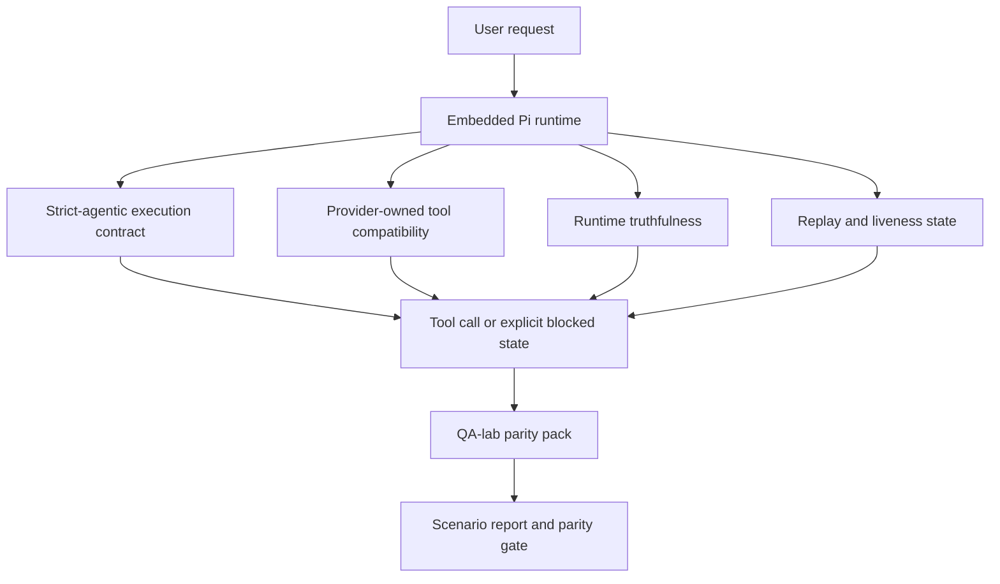
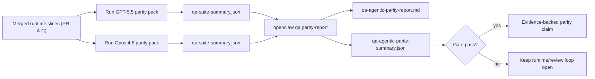

---
read_when:
    - การดีบักพฤติกรรมของ GPT-5.5 หรือเอเจนต์ Codex
    - การเปรียบเทียบพฤติกรรมเชิงเอเจนต์ของ OpenClaw ระหว่างโมเดลแนวหน้าต่าง ๆ
    - กำลังตรวจสอบการแก้ไข strict-agentic, tool-schema, elevation และ replay
summary: OpenClaw ปิดช่องว่างในการดำเนินงานแบบเอเจนต์สำหรับโมเดล GPT-5.5 และโมเดลสไตล์ Codex ได้อย่างไร
title: ความเท่าเทียมเชิงเอเจนต์ของ GPT-5.5 / Codex
x-i18n:
    generated_at: "2026-05-06T09:16:41Z"
    model: gpt-5.5
    provider: openai
    source_hash: bbc32f418dfffe2786093fa6b42b19f92a2d382c9408dfc55dd0154d67959390
    source_path: help/gpt55-codex-agentic-parity.md
    workflow: 16
---

OpenClaw ทำงานได้ดีอยู่แล้วกับโมเดล frontier ที่ใช้เครื่องมือได้ แต่ GPT-5.5 และโมเดลสไตล์ Codex ยังทำได้ต่ำกว่าที่ควรในเชิงปฏิบัติบางด้าน:

- อาจหยุดหลังจากวางแผนแทนที่จะลงมือทำงาน
- อาจใช้ schema เครื่องมือแบบเข้มงวดของ OpenAI/Codex ไม่ถูกต้อง
- อาจขอ `/elevated full` แม้ในกรณีที่การเข้าถึงแบบเต็มเป็นไปไม่ได้
- อาจสูญเสียสถานะของงานที่ใช้เวลานานระหว่างการเล่นซ้ำหรือ Compaction
- คำกล่าวอ้างเรื่องความทัดเทียมกับ Claude Opus 4.6 อิงจากเรื่องเล่าแทนที่จะเป็นสถานการณ์ที่ทำซ้ำได้

โปรแกรมความทัดเทียมนี้แก้ช่องว่างเหล่านั้นเป็นสี่ส่วนที่ตรวจทานได้

## สิ่งที่เปลี่ยนแปลง

### PR A: การทำงานแบบ strict-agentic

ส่วนนี้เพิ่มสัญญาการทำงาน `strict-agentic` แบบเลือกเปิดใช้สำหรับการรัน GPT-5 ที่ฝังอยู่ใน Pi

เมื่อเปิดใช้ OpenClaw จะหยุดยอมรับรอบที่มีแต่แผนว่าเป็นการทำงานเสร็จที่ "ดีพอ" หากโมเดลเพียงบอกว่าตั้งใจจะทำอะไร แต่ไม่ได้ใช้เครื่องมือจริงหรือทำให้เกิดความคืบหน้า OpenClaw จะลองใหม่ด้วยการชี้นำให้ลงมือทันที แล้วปิดแบบล้มเหลวด้วยสถานะถูกบล็อกที่ชัดเจน แทนที่จะจบงานแบบเงียบ ๆ

สิ่งนี้ช่วยปรับปรุงประสบการณ์ GPT-5.5 มากที่สุดในกรณีต่อไปนี้:

- การตอบต่อสั้น ๆ แบบ "โอเค ทำเลย"
- งานโค้ดที่ขั้นตอนแรกชัดเจน
- โฟลว์ที่ `update_plan` ควรเป็นการติดตามความคืบหน้า ไม่ใช่ข้อความเติมพื้นที่

### PR B: ความซื่อตรงของรันไทม์

ส่วนนี้ทำให้ OpenClaw บอกความจริงเกี่ยวกับสองเรื่อง:

- เหตุผลที่การเรียก provider/runtime ล้มเหลว
- `/elevated full` ใช้งานได้จริงหรือไม่

นั่นหมายความว่า GPT-5.5 จะได้รับสัญญาณรันไทม์ที่ดีขึ้นสำหรับ scope ที่ขาดหาย ความล้มเหลวในการรีเฟรช auth ความล้มเหลวของ HTML 403 auth ปัญหา proxy ความล้มเหลวของ DNS หรือ timeout และโหมด full-access ที่ถูกบล็อก โมเดลจึงมีโอกาสน้อยลงที่จะหลอนวิธีแก้ไขผิด ๆ หรือขอโหมดสิทธิ์ที่รันไทม์ไม่สามารถจัดให้ได้ซ้ำ ๆ

### PR C: ความถูกต้องของการทำงาน

ส่วนนี้ปรับปรุงความถูกต้องสองประเภท:

- ความเข้ากันได้ของ schema เครื่องมือ OpenAI/Codex ที่ provider เป็นเจ้าของ
- การแสดงสภาพพร้อมทำงานของการเล่นซ้ำและงานระยะยาว

งานด้านความเข้ากันได้ของเครื่องมือลดแรงเสียดทานของ schema สำหรับการลงทะเบียนเครื่องมือ OpenAI/Codex แบบเข้มงวด โดยเฉพาะกับเครื่องมือที่ไม่มีพารามิเตอร์และความคาดหวังเรื่อง root แบบ object ที่เข้มงวด งานด้านการเล่นซ้ำ/สภาพพร้อมทำงานทำให้งานที่ใช้เวลานานสังเกตเห็นได้มากขึ้น เพื่อให้สถานะที่หยุดพัก ถูกบล็อก และถูกละทิ้งมองเห็นได้ แทนที่จะหายไปในข้อความล้มเหลวทั่วไป

### PR D: ชุดทดสอบความทัดเทียม

ส่วนนี้เพิ่มแพ็กความทัดเทียม QA-lab ระลอกแรก เพื่อให้ GPT-5.5 และ Opus 4.6 ถูกทดสอบผ่านสถานการณ์เดียวกันและเปรียบเทียบด้วยหลักฐานร่วมกันได้

แพ็กความทัดเทียมคือชั้นพิสูจน์ผล มันไม่ได้เปลี่ยนพฤติกรรมรันไทม์ด้วยตัวเอง

หลังจากคุณมี artifact `qa-suite-summary.json` สองรายการแล้ว ให้สร้างการเปรียบเทียบ release-gate ด้วย:

```bash
pnpm openclaw qa parity-report \
  --repo-root . \
  --candidate-summary .artifacts/qa-e2e/gpt55/qa-suite-summary.json \
  --baseline-summary .artifacts/qa-e2e/opus46/qa-suite-summary.json \
  --output-dir .artifacts/qa-e2e/parity
```

คำสั่งนั้นจะเขียน:

- รายงาน Markdown ที่มนุษย์อ่านได้
- verdict แบบ JSON ที่เครื่องอ่านได้
- ผล gate `pass` / `fail` ที่ชัดเจน

## เหตุผลที่สิ่งนี้ปรับปรุง GPT-5.5 ในทางปฏิบัติ

ก่อนงานนี้ GPT-5.5 บน OpenClaw อาจให้ความรู้สึกเป็น agentic น้อยกว่า Opus ในเซสชันเขียนโค้ดจริง เพราะรันไทม์ยอมทนต่อพฤติกรรมที่เป็นอันตรายเป็นพิเศษสำหรับโมเดลสไตล์ GPT-5:

- รอบที่มีแต่คำอธิบาย
- แรงเสียดทานของ schema รอบเครื่องมือ
- feedback เรื่องสิทธิ์ที่คลุมเครือ
- การเล่นซ้ำหรือ Compaction ที่เสียหายแบบเงียบ ๆ

เป้าหมายไม่ใช่การทำให้ GPT-5.5 เลียนแบบ Opus เป้าหมายคือการให้สัญญารันไทม์แก่ GPT-5.5 ที่ให้รางวัลกับความคืบหน้าจริง จัดเตรียม semantics ของเครื่องมือและสิทธิ์ที่สะอาดขึ้น และเปลี่ยนโหมดความล้มเหลวให้เป็นสถานะที่เครื่องและมนุษย์อ่านได้อย่างชัดเจน

สิ่งนั้นเปลี่ยนประสบการณ์ผู้ใช้จาก:

- "โมเดลมีแผนที่ดีแต่หยุดไป"

เป็น:

- "โมเดลลงมือทำ หรือ OpenClaw แสดงเหตุผลที่แน่ชัดว่าทำไมจึงทำไม่ได้"

## ก่อนและหลังสำหรับผู้ใช้ GPT-5.5

| ก่อนโปรแกรมนี้                                                                            | หลัง PR A-D                                                                             |
| ---------------------------------------------------------------------------------------------- | ---------------------------------------------------------------------------------------- |
| GPT-5.5 อาจหยุดหลังจากให้แผนที่สมเหตุสมผลโดยไม่ทำขั้นตอนเครื่องมือถัดไป                   | PR A เปลี่ยน "มีแต่แผน" เป็น "ลงมือเดี๋ยวนี้หรือแสดงสถานะถูกบล็อก"                         |
| schema เครื่องมือแบบเข้มงวดอาจปฏิเสธเครื่องมือที่ไม่มีพารามิเตอร์หรือเครื่องมือรูปแบบ OpenAI/Codex ด้วยวิธีที่สับสน | PR C ทำให้การลงทะเบียนและการเรียกใช้เครื่องมือที่ provider เป็นเจ้าของคาดเดาได้มากขึ้น              |
| คำแนะนำ `/elevated full` อาจคลุมเครือหรือผิดในรันไทม์ที่ถูกบล็อก                          | PR B ให้คำใบ้รันไทม์และสิทธิ์ที่ตรงจริงแก่ GPT-5.5 และผู้ใช้                    |
| ความล้มเหลวของการเล่นซ้ำหรือ Compaction อาจให้ความรู้สึกเหมือนงานหายไปเงียบ ๆ                    | PR C แสดงผลลัพธ์ที่หยุดพัก ถูกบล็อก ถูกละทิ้ง และ replay-invalid อย่างชัดเจน         |
| "GPT-5.5 รู้สึกแย่กว่า Opus" ส่วนใหญ่เป็นเรื่องเล่า                                           | PR D เปลี่ยนสิ่งนั้นให้เป็นแพ็กสถานการณ์เดียวกัน เมตริกเดียวกัน และ gate ผ่าน/ไม่ผ่านที่ชัดเจน |

## สถาปัตยกรรม



## โฟลว์การ release



## แพ็กสถานการณ์

แพ็กความทัดเทียมระลอกแรกในปัจจุบันครอบคลุมห้าสถานการณ์:

### `approval-turn-tool-followthrough`

ตรวจสอบว่าโมเดลไม่หยุดที่ "ฉันจะทำให้" หลังจากการอนุมัติสั้น ๆ ควรลงมือทำการกระทำที่เป็นรูปธรรมแรกในรอบเดียวกัน

### `model-switch-tool-continuity`

ตรวจสอบว่างานที่ใช้เครื่องมือยังคงสอดคล้องกันข้ามขอบเขตการสลับโมเดล/รันไทม์ แทนที่จะรีเซ็ตเป็นคำอธิบายหรือสูญเสียบริบทการทำงาน

### `source-docs-discovery-report`

ตรวจสอบว่าโมเดลสามารถอ่านซอร์สและเอกสาร สังเคราะห์ข้อค้นพบ และทำงานต่อแบบ agentic แทนที่จะสร้างสรุปบาง ๆ แล้วหยุดก่อนเวลา

### `image-understanding-attachment`

ตรวจสอบว่างานแบบผสมโหมดที่เกี่ยวข้องกับไฟล์แนบยังคงนำไปปฏิบัติได้ และไม่ยุบเหลือเพียงคำบรรยายคลุมเครือ

### `compaction-retry-mutating-tool`

ตรวจสอบว่างานที่มีการเขียนเปลี่ยนแปลงจริงยังคงแสดงความไม่ปลอดภัยต่อการเล่นซ้ำอย่างชัดเจน แทนที่จะดูเหมือนปลอดภัยต่อการเล่นซ้ำอย่างเงียบ ๆ หากการรันเกิดการ compact, retry หรือสูญเสียสถานะการตอบกลับภายใต้แรงกดดัน

## เมทริกซ์สถานการณ์

| สถานการณ์                           | สิ่งที่ทดสอบ                           | พฤติกรรม GPT-5.5 ที่ดี                                                          | สัญญาณความล้มเหลว                                                                 |
| ---------------------------------- | --------------------------------------- | ------------------------------------------------------------------------------ | ------------------------------------------------------------------------------ |
| `approval-turn-tool-followthrough` | รอบอนุมัติสั้น ๆ หลังจากแผน       | เริ่มการกระทำเครื่องมือที่เป็นรูปธรรมแรกทันทีแทนที่จะย้ำเจตนา  | การตอบต่อที่มีแต่แผน ไม่มีกิจกรรมเครื่องมือ หรือรอบที่ถูกบล็อกโดยไม่มีตัวบล็อกจริง  |
| `model-switch-tool-continuity`     | การสลับรันไทม์/โมเดลขณะใช้เครื่องมือ  | รักษาบริบทงานและลงมือทำต่ออย่างสอดคล้อง                         | รีเซ็ตเป็นคำอธิบาย สูญเสียบริบทเครื่องมือ หรือหยุดหลังจากสลับ              |
| `source-docs-discovery-report`     | การอ่านซอร์ส + การสังเคราะห์ + การลงมือทำ     | หาแหล่งข้อมูล ใช้เครื่องมือ และสร้างรายงานที่มีประโยชน์โดยไม่ชะงัก       | สรุปบาง ๆ งานเครื่องมือหายไป หรือหยุดทั้งที่รอบยังไม่สมบูรณ์                       |
| `image-understanding-attachment`   | งาน agentic ที่ขับเคลื่อนด้วยไฟล์แนบ          | ตีความไฟล์แนบ เชื่อมโยงกับเครื่องมือ และทำงานต่อ        | คำบรรยายคลุมเครือ มองข้ามไฟล์แนบ หรือไม่มีการกระทำถัดไปที่เป็นรูปธรรม                |
| `compaction-retry-mutating-tool`   | งานที่เปลี่ยนแปลงข้อมูลภายใต้แรงกดดันจาก Compaction | ทำการเขียนจริงและคงความไม่ปลอดภัยต่อการเล่นซ้ำไว้อย่างชัดเจนหลัง side effect | มีการเขียนเปลี่ยนแปลงเกิดขึ้น แต่บอกเป็นนัยว่าปลอดภัยต่อการเล่นซ้ำ ขาดหาย หรือขัดแย้งกัน |

## Release gate

GPT-5.5 จะถือว่าทัดเทียมหรือดีกว่าได้ก็ต่อเมื่อรันไทม์ที่ merge แล้วผ่านทั้งแพ็กความทัดเทียมและ regression ด้านความซื่อตรงของรันไทม์พร้อมกัน

ผลลัพธ์ที่ต้องมี:

- ไม่มีการชะงักแบบมีแต่แผนเมื่อการกระทำเครื่องมือถัดไปชัดเจน
- ไม่มีการจบปลอมโดยไม่มีการทำงานจริง
- ไม่มีคำแนะนำ `/elevated full` ที่ไม่ถูกต้อง
- ไม่มีการละทิ้งการเล่นซ้ำหรือ Compaction แบบเงียบ ๆ
- เมตริกของแพ็กความทัดเทียมที่อย่างน้อยแข็งแรงเท่ากับ baseline Opus 4.6 ที่ตกลงกันไว้

สำหรับชุดทดสอบระลอกแรก gate จะเปรียบเทียบ:

- อัตราการทำสำเร็จ
- อัตราการหยุดโดยไม่ตั้งใจ
- อัตราการเรียกเครื่องมือที่ถูกต้อง
- จำนวน fake-success

หลักฐานความทัดเทียมตั้งใจแยกออกเป็นสองชั้น:

- PR D พิสูจน์พฤติกรรม GPT-5.5 เทียบกับ Opus 4.6 ในสถานการณ์เดียวกันด้วย QA-lab
- ชุดทดสอบ deterministic ของ PR B พิสูจน์ความซื่อตรงด้าน auth, proxy, DNS และ `/elevated full` นอกชุดทดสอบหลัก

## เมทริกซ์เป้าหมายสู่หลักฐาน

| รายการ gate การทำสำเร็จ                                     | PR เจ้าของ   | แหล่งหลักฐาน                                                    | สัญญาณผ่าน                                                                              |
| -------------------------------------------------------- | ----------- | ------------------------------------------------------------------ | ---------------------------------------------------------------------------------------- |
| GPT-5.5 ไม่ชะงักหลังจากวางแผนอีกต่อไป                  | PR A        | `approval-turn-tool-followthrough` รวมถึงชุดทดสอบรันไทม์ PR A        | รอบอนุมัติกระตุ้นงานจริงหรือสถานะถูกบล็อกที่ชัดเจน                            |
| GPT-5.5 ไม่แกล้งทำว่าคืบหน้าหรือแกล้งทำว่าเครื่องมือเสร็จอีกต่อไป | PR A + PR D | ผลลัพธ์สถานการณ์ในรายงานความทัดเทียมและจำนวน fake-success             | ไม่มีผลผ่านที่น่าสงสัยและไม่มีการทำสำเร็จที่มีแต่คำอธิบาย                             |
| GPT-5.5 ไม่ให้คำแนะนำ `/elevated full` ที่ผิดอีกต่อไป  | PR B        | ชุดทดสอบความซื่อตรงแบบ deterministic                                  | เหตุผลที่ถูกบล็อกและคำใบ้ full-access ยังคงตรงกับรันไทม์                              |
| ความล้มเหลวของการเล่นซ้ำ/สภาพพร้อมทำงานยังคงชัดเจน                   | PR C + PR D | ชุดทดสอบ lifecycle/replay ของ PR C รวมถึง `compaction-retry-mutating-tool` | งานที่เปลี่ยนแปลงข้อมูลคงความไม่ปลอดภัยต่อการเล่นซ้ำไว้อย่างชัดเจนแทนที่จะหายไปเงียบ ๆ            |
| GPT-5.5 เท่ากับหรือเหนือกว่า Opus 4.6 ในเมตริกที่ตกลงกันไว้  | PR D        | `qa-agentic-parity-report.md` และ `qa-agentic-parity-summary.json` | ครอบคลุมสถานการณ์เดียวกันและไม่มี regression ด้านการทำสำเร็จ พฤติกรรมการหยุด หรือการใช้เครื่องมือที่ถูกต้อง |

## วิธีอ่าน verdict ความทัดเทียม

ใช้ verdict ใน `qa-agentic-parity-summary.json` เป็นการตัดสินใจขั้นสุดท้ายที่เครื่องอ่านได้สำหรับแพ็กความทัดเทียมระลอกแรก

- `pass` หมายความว่า GPT-5.5 ครอบคลุมสถานการณ์เดียวกันกับ Opus 4.6 และไม่มีการถดถอยในเมตริกรวมที่ตกลงกันไว้
- `fail` หมายความว่ามี hard gate อย่างน้อยหนึ่งรายการที่ถูกกระตุ้น: completion อ่อนกว่า, การหยุดโดยไม่ตั้งใจแย่ลง, การใช้เครื่องมือที่ถูกต้องอ่อนกว่า, มีกรณี fake-success ใด ๆ, หรือการครอบคลุมสถานการณ์ไม่ตรงกัน
- "ปัญหา CI shared/base" ไม่ใช่ผลลัพธ์ parity ในตัวเอง หากสัญญาณรบกวนของ CI นอก PR D บล็อกการรัน คำตัดสินควรรอการประมวลผล merged-runtime ที่สะอาด แทนที่จะอนุมานจากล็อกในยุคของ branch
- Auth, proxy, DNS และความตรงตามความจริงของ `/elevated full` ยังคงมาจากชุดทดสอบแบบกำหนดผลได้ของ PR B ดังนั้นคำกล่าวอ้างสำหรับรีลีสสุดท้ายต้องมีทั้งสองอย่าง: คำตัดสิน parity ของ PR D ที่ผ่าน และการครอบคลุมความตรงตามความจริงของ PR B ที่เป็นสีเขียว

## ใครควรเปิดใช้ `strict-agentic`

ใช้ `strict-agentic` เมื่อ:

- คาดหวังให้ agent ลงมือทันทีเมื่อขั้นตอนถัดไปชัดเจน
- GPT-5.5 หรือโมเดลตระกูล Codex เป็น runtime หลัก
- คุณชอบสถานะที่ระบุชัดเจนว่าถูกบล็อก มากกว่าการตอบกลับที่มีเพียงสรุปย้อนหลังแบบ "ช่วยเหลือ"

คง contract เริ่มต้นไว้เมื่อ:

- คุณต้องการพฤติกรรมเดิมที่ผ่อนปรนกว่า
- คุณไม่ได้ใช้โมเดลตระกูล GPT-5
- คุณกำลังทดสอบ prompt แทนการบังคับใช้ที่ระดับ runtime

## ที่เกี่ยวข้อง

- [หมายเหตุสำหรับ maintainer เรื่อง parity ของ GPT-5.5 / Codex](/th/help/gpt55-codex-agentic-parity-maintainers)
