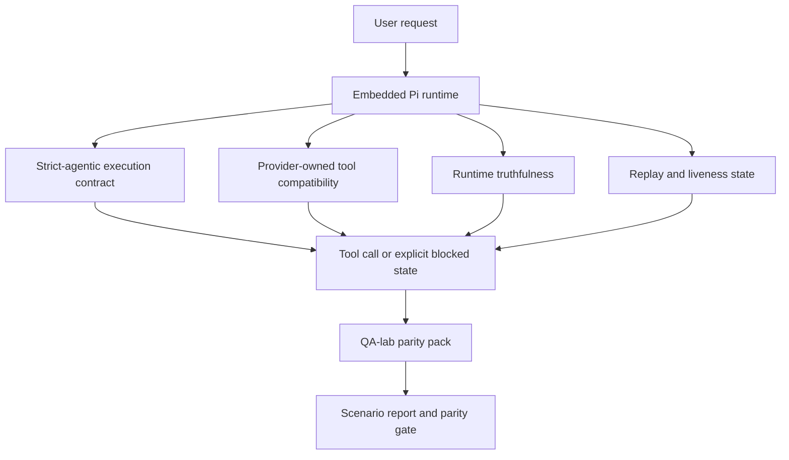
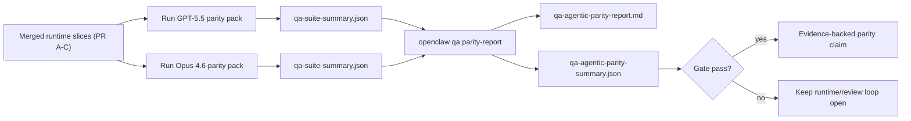

---
read_when:
    - การแก้ไขข้อบกพร่องของพฤติกรรมเอเจนต์ใน GPT-5.5 หรือ Codex
    - การเปรียบเทียบพฤติกรรมแบบ agentic ของ OpenClaw ข้ามโมเดล frontier ต่าง ๆ
    - การตรวจสอบการแก้ไขในส่วน strict-agentic, tool-schema, elevation และ replay
summary: OpenClaw ปิดช่องว่างของการทำงานแบบ agentic สำหรับ GPT-5.5 และโมเดลสไตล์ Codex อย่างไร
title: GPT-5.5 / Codex agentic parity
x-i18n:
    generated_at: "2026-04-26T11:33:09Z"
    model: gpt-5.4
    provider: openai
    source_hash: 8a3b9375cd9e9d95855c4a1135953e00fd7a939e52fb7b75342da3bde2d83fe1
    source_path: help/gpt55-codex-agentic-parity.md
    workflow: 15
---

# GPT-5.5 / Codex Agentic Parity ใน OpenClaw

OpenClaw ทำงานร่วมกับโมเดล frontier ที่ใช้เครื่องมือได้ดีอยู่แล้ว แต่โมเดลสไตล์ GPT-5.5 และ Codex ยังมีประสิทธิภาพต่ำกว่าที่ควรในทางปฏิบัติอยู่บางประการ:

- อาจหยุดหลังจากวางแผนแทนที่จะลงมือทำงาน
- อาจใช้ strict OpenAI/Codex tool schemas อย่างไม่ถูกต้อง
- อาจขอ `/elevated full` แม้ในกรณีที่ full access เป็นไปไม่ได้
- อาจสูญเสียสถานะของงานที่ใช้เวลานานระหว่าง replay หรือ Compaction
- การอ้างว่าเทียบชั้นกับ Claude Opus 4.6 อิงจากเรื่องเล่า มากกว่าสถานการณ์ที่ทำซ้ำได้

โปรแกรม parity นี้แก้ช่องว่างเหล่านั้นเป็นสี่ส่วนที่ตรวจทานได้

## สิ่งที่เปลี่ยนไป

### PR A: การทำงาน strict-agentic

ส่วนนี้เพิ่มสัญญาการทำงาน `strict-agentic` แบบเลือกเปิดใช้สำหรับการรัน Pi GPT-5 แบบฝังตัว

เมื่อเปิดใช้ OpenClaw จะไม่ยอมรับ turn ที่มีแต่แผนว่าเป็นการเสร็จสมบูรณ์ที่ “ดีพอ” อีกต่อไป หากโมเดลเพียงบอกว่าจะทำอะไร แต่ไม่ได้ใช้เครื่องมือจริงหรือไม่ได้คืบหน้า OpenClaw จะลองใหม่ด้วยการ steer ให้ลงมือทำทันที แล้ว fail closed พร้อมสถานะติดขัดที่ชัดเจน แทนที่จะจบงานไปอย่างเงียบ ๆ

สิ่งนี้ช่วยปรับปรุงประสบการณ์ของ GPT-5.5 มากที่สุดในกรณีต่อไปนี้:

- ข้อความติดตามสั้น ๆ แบบ “โอเค ทำเลย”
- งานเขียนโค้ดที่ขั้นตอนแรกชัดเจนอยู่แล้ว
- โฟลว์ที่ `update_plan` ควรเป็นการติดตามความคืบหน้า ไม่ใช่ข้อความเติมเต็ม

### PR B: ความตรงไปตรงมาของรันไทม์

ส่วนนี้ทำให้ OpenClaw บอกความจริงเกี่ยวกับสองเรื่อง:

- เหตุใดการเรียก provider/runtime จึงล้มเหลว
- `/elevated full` ใช้งานได้จริงหรือไม่

นั่นหมายความว่า GPT-5.5 จะได้รับสัญญาณจากรันไทม์ที่ดีขึ้นสำหรับปัญหา scope ที่ขาดหาย ความล้มเหลวของการรีเฟรช auth ความล้มเหลวของ auth แบบ HTML 403 ปัญหา proxy ปัญหา DNS หรือ timeout และโหมด full-access ที่ถูกบล็อก โมเดลจึงมีแนวโน้มน้อยลงที่จะหลอนวิธีแก้ที่ผิด หรือขอ permission mode ที่รันไทม์ให้ไม่ได้ซ้ำ ๆ

### PR C: ความถูกต้องของการทำงาน

ส่วนนี้ปรับปรุงความถูกต้องสองประเภท:

- ความเข้ากันได้ของ OpenAI/Codex tool-schema ที่ provider เป็นเจ้าของ
- การทำให้ replay และสถานะการมีชีวิตของงานระยะยาวมองเห็นได้ชัดเจน

งานด้านความเข้ากันได้ของเครื่องมือช่วยลดแรงเสียดทานของ schema สำหรับการลงทะเบียนเครื่องมือแบบ strict ของ OpenAI/Codex โดยเฉพาะในเรื่องเครื่องมือที่ไม่มีพารามิเตอร์และความคาดหวังเรื่อง object-root แบบ strict งานด้าน replay/liveness ทำให้งานที่ใช้เวลานานสังเกตได้ง่ายขึ้น ดังนั้นสถานะ paused, blocked และ abandoned จะมองเห็นได้ แทนที่จะหายไปในข้อความล้มเหลวแบบทั่วไป

### PR D: parity harness

ส่วนนี้เพิ่ม parity pack ระลอกแรกของ QA-lab เพื่อให้ GPT-5.5 และ Opus 4.6 ถูกทดสอบผ่านสถานการณ์เดียวกันและเปรียบเทียบกันด้วยหลักฐานชุดเดียวกัน

parity pack คือชั้นพิสูจน์ผล โดยตัวมันเองไม่ได้เปลี่ยนพฤติกรรมรันไทม์

หลังจากคุณมี artifacts `qa-suite-summary.json` สองชุดแล้ว ให้สร้างการเปรียบเทียบสำหรับ release gate ด้วย:

```bash
pnpm openclaw qa parity-report \
  --repo-root . \
  --candidate-summary .artifacts/qa-e2e/gpt55/qa-suite-summary.json \
  --baseline-summary .artifacts/qa-e2e/opus46/qa-suite-summary.json \
  --output-dir .artifacts/qa-e2e/parity
```

คำสั่งนี้จะเขียน:

- รายงาน Markdown ที่มนุษย์อ่านได้
- verdict แบบ JSON ที่เครื่องอ่านได้
- ผล gate แบบชัดเจนว่า `pass` / `fail`

## เหตุใดสิ่งนี้จึงทำให้ GPT-5.5 ดีขึ้นในทางปฏิบัติ

ก่อนงานชุดนี้ GPT-5.5 บน OpenClaw อาจให้ความรู้สึก agentic น้อยกว่า Opus ในเซสชันเขียนโค้ดจริง เพราะรันไทม์ยอมรับพฤติกรรมที่เป็นอันตรายต่อโมเดลสไตล์ GPT-5 เป็นพิเศษ:

- turn ที่มีแต่คำอธิบาย
- แรงเสียดทานของ schema รอบเครื่องมือ
- ฟีดแบ็กเรื่องสิทธิ์ที่คลุมเครือ
- ความเสียหายของ replay หรือ Compaction แบบเงียบ ๆ

เป้าหมายไม่ใช่ทำให้ GPT-5.5 เลียนแบบ Opus เป้าหมายคือให้ GPT-5.5 ได้รับสัญญารันไทม์ที่ให้รางวัลกับความคืบหน้าจริง ให้ semantics ของเครื่องมือและสิทธิ์ที่สะอาดกว่า และเปลี่ยนโหมดความล้มเหลวให้กลายเป็นสถานะที่ทั้งเครื่องและมนุษย์อ่านได้อย่างชัดเจน

สิ่งนี้เปลี่ยนประสบการณ์ของผู้ใช้จาก:

- “โมเดลมีแผนที่ดีแต่หยุดไป”

เป็น:

- “โมเดลลงมือทำ หรือ OpenClaw แสดงเหตุผลที่แน่ชัดว่าทำไม่ได้”

## ก่อนและหลังสำหรับผู้ใช้ GPT-5.5

| ก่อนโปรแกรมนี้                                                                            | หลัง PR A-D                                                                                |
| ------------------------------------------------------------------------------------------ | ------------------------------------------------------------------------------------------ |
| GPT-5.5 อาจหยุดหลังแผนที่สมเหตุสมผลโดยไม่ลงมือใช้เครื่องมือขั้นถัดไป                     | PR A เปลี่ยน “มีแต่แผน” ให้เป็น “ลงมือทันทีหรือแสดงสถานะติดขัด”                           |
| strict tool schemas อาจปฏิเสธเครื่องมือที่ไม่มีพารามิเตอร์หรือเครื่องมือรูปแบบ OpenAI/Codex แบบชวนสับสน | PR C ทำให้การลงทะเบียนและเรียกใช้เครื่องมือที่ provider เป็นเจ้าของคาดเดาได้มากขึ้น          |
| คำแนะนำเกี่ยวกับ `/elevated full` อาจคลุมเครือหรือผิดในรันไทม์ที่ถูกบล็อก               | PR B ให้คำใบ้ด้านรันไทม์และสิทธิ์ที่ตรงกับความจริงแก่ GPT-5.5 และผู้ใช้                    |
| ความล้มเหลวของ replay หรือ Compaction อาจให้ความรู้สึกเหมือนงานหายไปอย่างเงียบ ๆ         | PR C ทำให้ผลลัพธ์แบบ paused, blocked, abandoned และ replay-invalid ชัดเจน                  |
| “GPT-5.5 แย่กว่า Opus” ส่วนใหญ่เป็นเพียงเรื่องเล่า                                      | PR D เปลี่ยนสิ่งนั้นให้เป็น scenario pack เดียวกัน metrics เดียวกัน และ gate แบบ pass/fail ที่ชัดเจน |

## สถาปัตยกรรม



## โฟลว์รีลีส



## Scenario pack

ปัจจุบัน parity pack ระลอกแรกครอบคลุมห้าสถานการณ์:

### `approval-turn-tool-followthrough`

ตรวจสอบว่าโมเดลไม่หยุดอยู่ที่ “ฉันจะทำให้” หลังจากการอนุมัติสั้น ๆ โดยควรลงมือทำอย่างเป็นรูปธรรมขั้นแรกใน turn เดียวกัน

### `model-switch-tool-continuity`

ตรวจสอบว่างานที่ใช้เครื่องมือยังคงต่อเนื่องอย่างมีเหตุผลข้ามขอบเขตการสลับโมเดล/รันไทม์ แทนที่จะรีเซ็ตเป็นคำอธิบายหรือสูญเสียบริบทการทำงาน

### `source-docs-discovery-report`

ตรวจสอบว่าโมเดลสามารถอ่านซอร์สและเอกสาร สังเคราะห์ข้อค้นพบ และทำงานต่อแบบ agentic ได้ แทนที่จะสรุปแบบบาง ๆ แล้วหยุดเร็วเกินไป

### `image-understanding-attachment`

ตรวจสอบว่างานแบบผสมที่มีไฟล์แนบยังคงดำเนินการได้จริง และไม่ยุบเหลือเพียงคำบรรยายแบบกำกวม

### `compaction-retry-mutating-tool`

ตรวจสอบว่างานที่มีการเขียนแก้ไขจริงยังคงแสดงความไม่ปลอดภัยต่อ replay อย่างชัดเจน แทนที่จะดูเหมือน replay-safe แบบเงียบ ๆ เมื่อการรันเกิด Compaction, retry หรือสูญเสียสถานะการตอบกลับภายใต้แรงกดดัน

## ตารางสถานการณ์

| สถานการณ์                         | สิ่งที่ทดสอบ                           | พฤติกรรม GPT-5.5 ที่ดี                                                        | สัญญาณความล้มเหลว                                                                  |
| --------------------------------- | -------------------------------------- | ----------------------------------------------------------------------------- | ----------------------------------------------------------------------------------- |
| `approval-turn-tool-followthrough` | turn อนุมัติสั้น ๆ หลังแผน            | เริ่มการกระทำด้วยเครื่องมืออย่างเป็นรูปธรรมทันที แทนที่จะทวนเจตนา            | follow-up ที่มีแต่แผน ไม่มีกิจกรรมเครื่องมือ หรือ turn ที่ติดขัดโดยไม่มีตัวติดขัดจริง |
| `model-switch-tool-continuity`     | การสลับรันไทม์/โมเดลระหว่างใช้เครื่องมือ | รักษาบริบทของงานและทำงานต่ออย่างสอดคล้อง                                     | รีเซ็ตเป็นคำอธิบาย สูญเสียบริบทเครื่องมือ หรือหยุดหลังสลับ                         |
| `source-docs-discovery-report`     | การอ่านซอร์ส + สังเคราะห์ + ลงมือทำ   | พบแหล่งข้อมูล ใช้เครื่องมือ และสร้างรายงานที่มีประโยชน์โดยไม่ชะงัก          | สรุปบางเกินไป ไม่มีงานเครื่องมือ หรือหยุดก่อนจบ turn                               |
| `image-understanding-attachment`   | งานแบบ agentic ที่ขับเคลื่อนด้วยไฟล์แนบ | ตีความไฟล์แนบ เชื่อมโยงกับเครื่องมือ และทำงานต่อ                              | คำบรรยายกำกวม เพิกเฉยไฟล์แนบ หรือไม่มีการกระทำขั้นถัดไปที่เป็นรูปธรรม              |
| `compaction-retry-mutating-tool`   | งานที่แก้ไขจริงภายใต้แรงกดดันจาก Compaction | มีการเขียนจริงและยังคงแสดงความไม่ปลอดภัยต่อ replay หลังเกิดผลข้างเคียง       | เกิดการเขียนแก้ไข แต่ความปลอดภัยต่อ replay ถูกสื่อเป็นนัย หายไป หรือขัดแย้งกัน      |

## Release gate

GPT-5.5 จะถือว่าเทียบชั้นหรือดีกว่าได้ก็ต่อเมื่อรันไทม์ที่ merge แล้วผ่าน parity pack และ regression ด้าน runtime-truthfulness พร้อมกัน

ผลลัพธ์ที่ต้องได้:

- ไม่มีการชะงักแบบมีแต่แผน เมื่อการกระทำด้วยเครื่องมือขั้นถัดไปชัดเจน
- ไม่มีการเสร็จปลอมโดยไม่มีการทำงานจริง
- ไม่มีคำแนะนำ `/elevated full` ที่ไม่ถูกต้อง
- ไม่มีการละทิ้งจาก replay หรือ Compaction แบบเงียบ ๆ
- metrics ของ parity-pack อย่างน้อยต้องแข็งแรงเท่ากับ baseline Opus 4.6 ที่ตกลงกันไว้

สำหรับ harness ระลอกแรก gate จะเปรียบเทียบ:

- อัตราการทำงานสำเร็จ
- อัตราการหยุดโดยไม่ตั้งใจ
- อัตราการเรียกเครื่องมือที่ถูกต้อง
- จำนวน fake-success

หลักฐานของ parity ถูกแยกออกเป็นสองชั้นโดยตั้งใจ:

- PR D พิสูจน์พฤติกรรม GPT-5.5 เทียบกับ Opus 4.6 ในสถานการณ์เดียวกันด้วย QA-lab
- deterministic suites ของ PR B พิสูจน์ความตรงกับความจริงของ auth, proxy, DNS และ `/elevated full` นอก harness

## ตารางเป้าหมายต่อหลักฐาน

| รายการใน completion gate                              | PR เจ้าของ   | แหล่งหลักฐาน                                                   | สัญญาณผ่าน                                                                                  |
| ----------------------------------------------------- | ------------ | --------------------------------------------------------------- | -------------------------------------------------------------------------------------------- |
| GPT-5.5 ไม่ชะงักหลังวางแผนอีกต่อไป                   | PR A         | `approval-turn-tool-followthrough` พร้อม runtime suites ของ PR A | turn อนุมัติทำให้เกิดงานจริงหรือแสดงสถานะติดขัดอย่างชัดเจน                                 |
| GPT-5.5 ไม่แสร้งว่าคืบหน้าหรือแสร้งว่าเครื่องมือทำงานเสร็จ | PR A + PR D  | ผลลัพธ์ของสถานการณ์ใน parity report และจำนวน fake-success       | ไม่มีผลผ่านที่น่าสงสัย และไม่มีการเสร็จสิ้นแบบมีแต่คำอธิบาย                                 |
| GPT-5.5 ไม่ให้คำแนะนำ `/elevated full` ที่ผิดอีกต่อไป | PR B         | deterministic truthfulness suites                               | เหตุผลของการบล็อกและคำใบ้เรื่อง full-access ยังคงตรงกับความจริงของรันไทม์                 |
| ความล้มเหลวของ replay/liveness ยังคงชัดเจน            | PR C + PR D  | lifecycle/replay suites ของ PR C พร้อม `compaction-retry-mutating-tool` | งานที่มีการแก้ไขจริงยังคงแสดงความไม่ปลอดภัยต่อ replay อย่างชัดเจน แทนที่จะหายไปอย่างเงียบ ๆ |
| GPT-5.5 เทียบหรือดีกว่า Opus 4.6 ใน metrics ที่ตกลงกัน | PR D         | `qa-agentic-parity-report.md` และ `qa-agentic-parity-summary.json` | ครอบคลุมสถานการณ์เดียวกัน และไม่มี regression ด้าน completion พฤติกรรมการหยุด หรือการใช้เครื่องมือที่ถูกต้อง |

## วิธีอ่าน parity verdict

ใช้ verdict ใน `qa-agentic-parity-summary.json` เป็นการตัดสินแบบ machine-readable ขั้นสุดท้ายสำหรับ parity pack ระลอกแรก

- `pass` หมายความว่า GPT-5.5 ครอบคลุมสถานการณ์เดียวกับ Opus 4.6 และไม่มี regression ใน metrics แบบรวมที่ตกลงกันไว้
- `fail` หมายความว่ามี hard gate อย่างน้อยหนึ่งข้อถูกกระตุ้น: completion อ่อนกว่า, การหยุดโดยไม่ตั้งใจแย่กว่า, การใช้เครื่องมือที่ถูกต้องอ่อนกว่า, มีกรณี fake-success ใด ๆ หรือการครอบคลุมสถานการณ์ไม่ตรงกัน
- “shared/base CI issue” ไม่ใช่ผล parity ในตัวเอง หาก noise ของ CI ภายนอก PR D บล็อกการรัน verdict ควรรอการรัน merged-runtime ที่สะอาด แทนที่จะอนุมานจาก logs สมัยที่ยังอยู่บน branch
- ความตรงกับความจริงของ auth, proxy, DNS และ `/elevated full` ยังคงมาจาก deterministic suites ของ PR B ดังนั้นคำกล่าวอ้างสำหรับ release ขั้นสุดท้ายจึงต้องมีทั้งสองอย่าง: parity verdict ของ PR D ที่ผ่าน และ truthfulness coverage ของ PR B ที่เป็นสีเขียว

## ใครควรเปิดใช้ `strict-agentic`

ใช้ `strict-agentic` เมื่อ:

- คาดหวังให้เอเจนต์ลงมือทำทันทีเมื่อขั้นตอนถัดไปชัดเจน
- ใช้โมเดลตระกูล GPT-5.5 หรือ Codex เป็นรันไทม์หลัก
- คุณต้องการสถานะติดขัดที่ชัดเจนมากกว่าคำตอบที่เป็นเพียงการสรุปย้อนอย่าง “มีประโยชน์”

คงสัญญาเริ่มต้นไว้เมื่อ:

- คุณต้องการพฤติกรรมแบบหลวมเดิม
- คุณไม่ได้ใช้โมเดลตระกูล GPT-5
- คุณกำลังทดสอบ prompts มากกว่าการบังคับใช้ที่ระดับรันไทม์

## ที่เกี่ยวข้อง

- [บันทึกสำหรับผู้ดูแล GPT-5.5 / Codex parity](/th/help/gpt55-codex-agentic-parity-maintainers)
