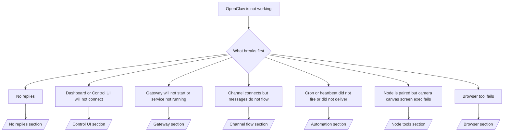

---
read_when:
    - OpenClaw ไม่ทำงาน และคุณต้องการวิธีแก้ไขที่รวดเร็วที่สุด
    - คุณต้องการขั้นตอนการคัดแยกก่อนเจาะลึกลงในรันบุ๊กโดยละเอียด
summary: ศูนย์กลางการแก้ไขปัญหาแบบเริ่มจากอาการสำหรับ OpenClaw
title: การแก้ไขปัญหาทั่วไป
x-i18n:
    generated_at: "2026-05-06T09:17:32Z"
    model: gpt-5.5
    provider: openai
    source_hash: 624fa34cda3b440fa9cc636beb3fe6e3608a77a332933fa593097ebc556ac745
    source_path: help/troubleshooting.md
    workflow: 16
---

หากคุณมีเวลาเพียง 2 นาที ให้ใช้หน้านี้เป็นจุดเริ่มต้นสำหรับการคัดแยกปัญหา

## 60 วินาทีแรก

รันลำดับคำสั่งนี้ตามลำดับ:

```bash
openclaw status
openclaw status --all
openclaw gateway probe
openclaw gateway status
openclaw doctor
openclaw channels status --probe
openclaw logs --follow
```

ผลลัพธ์ที่ดีในหนึ่งบรรทัด:

- `openclaw status` → แสดงช่องทางที่กำหนดค่าไว้และไม่มีข้อผิดพลาดด้าน auth ที่ชัดเจน
- `openclaw status --all` → มีรายงานฉบับเต็มและแชร์ได้
- `openclaw gateway probe` → เป้าหมาย Gateway ที่คาดไว้เข้าถึงได้ (`Reachable: yes`) `Capability: ...` บอกคุณว่าการตรวจสอบพิสูจน์ระดับ auth ใดได้ และ `Read probe: limited - missing scope: operator.read` คือการวินิจฉัยที่ลดระดับลง ไม่ใช่การเชื่อมต่อล้มเหลว
- `openclaw gateway status` → `Runtime: running`, `Connectivity probe: ok` และบรรทัด `Capability: ...` ที่สมเหตุสมผล ใช้ `--require-rpc` หากคุณต้องการหลักฐาน RPC ที่มี read-scope ด้วย
- `openclaw doctor` → ไม่มีข้อผิดพลาดด้านการกำหนดค่า/บริการที่บล็อกการทำงาน
- `openclaw channels status --probe` → Gateway ที่เข้าถึงได้จะส่งคืนสถานะการส่งข้อมูลต่อบัญชีแบบสด พร้อมผลการตรวจสอบ/audit เช่น `works` หรือ `audit ok`; หาก Gateway เข้าถึงไม่ได้ คำสั่งจะถอยกลับไปใช้สรุปจากการกำหนดค่าเท่านั้น
- `openclaw logs --follow` → มีกิจกรรมต่อเนื่อง ไม่มีข้อผิดพลาดร้ายแรงที่เกิดซ้ำ

## Anthropic long context 429

หากคุณเห็น:
`HTTP 429: rate_limit_error: Extra usage is required for long context requests`,
ไปที่ [/gateway/troubleshooting#anthropic-429-extra-usage-required-for-long-context](/th/gateway/troubleshooting#anthropic-429-extra-usage-required-for-long-context)

## แบ็กเอนด์ที่เข้ากันได้กับ OpenAI ในเครื่องทำงานโดยตรงแต่ล้มเหลวใน OpenClaw

หากแบ็กเอนด์ `/v1` ในเครื่องหรือที่โฮสต์เองตอบการตรวจสอบ
`/v1/chat/completions` ขนาดเล็กโดยตรง แต่ล้มเหลวกับ `openclaw infer model run` หรือรอบ agent ปกติ:

1. หากข้อผิดพลาดกล่าวถึง `messages[].content` ว่าคาดหวัง string ให้ตั้งค่า
   `models.providers.<provider>.models[].compat.requiresStringContent: true`
2. หากแบ็กเอนด์ยังล้มเหลวเฉพาะในรอบ agent ของ OpenClaw ให้ตั้งค่า
   `models.providers.<provider>.models[].compat.supportsTools: false` แล้วลองอีกครั้ง
3. หากการเรียกขนาดเล็กโดยตรงยังทำงาน แต่พรอมป์ OpenClaw ที่ใหญ่ขึ้นทำให้
   แบ็กเอนด์ล่ม ให้ถือว่าปัญหาที่เหลือเป็นข้อจำกัดของโมเดล/เซิร์ฟเวอร์ upstream และ
   ดำเนินการต่อในคู่มือเชิงลึก:
   [/gateway/troubleshooting#local-openai-compatible-backend-passes-direct-probes-but-agent-runs-fail](/th/gateway/troubleshooting#local-openai-compatible-backend-passes-direct-probes-but-agent-runs-fail)

## การติดตั้ง Plugin ล้มเหลวเพราะไม่มี openclaw extensions

หากการติดตั้งล้มเหลวด้วย `package.json missing openclaw.extensions` แพ็กเกจ Plugin
กำลังใช้รูปแบบเก่าที่ OpenClaw ไม่ยอมรับอีกต่อไป

แก้ไขในแพ็กเกจ Plugin:

1. เพิ่ม `openclaw.extensions` ใน `package.json`
2. ชี้รายการไปที่ไฟล์ runtime ที่ build แล้ว (โดยปกติคือ `./dist/index.js`)
3. เผยแพร่ Plugin อีกครั้ง แล้วรัน `openclaw plugins install <package>` ใหม่

ตัวอย่าง:

```json
{
  "name": "@openclaw/my-plugin",
  "version": "1.2.3",
  "openclaw": {
    "extensions": ["./dist/index.js"]
  }
}
```

อ้างอิง: [สถาปัตยกรรม Plugin](/th/plugins/architecture)

## มี Plugin อยู่แต่ถูกบล็อกเพราะ ownership น่าสงสัย

หาก `openclaw doctor`, การตั้งค่า หรือคำเตือนตอนเริ่มต้นแสดงว่า:

```text
blocked plugin candidate: suspicious ownership (... uid=1000, expected uid=0 or root)
plugin present but blocked
```

ไฟล์ Plugin เป็นของผู้ใช้ Unix คนละรายกับกระบวนการที่โหลดไฟล์เหล่านั้น
อย่าลบการกำหนดค่า Plugin ให้แก้ไข ownership ของไฟล์ หรือรัน OpenClaw เป็นผู้ใช้
เดียวกับที่เป็นเจ้าของไดเรกทอรีสถานะ

การติดตั้ง Docker โดยปกติรันเป็น `node` (uid `1000`) สำหรับการตั้งค่า Docker
เริ่มต้น ให้ซ่อมแซม bind mount บนโฮสต์:

```bash
sudo chown -R 1000:1000 /path/to/openclaw-config /path/to/openclaw-workspace
openclaw doctor --fix
```

หากคุณตั้งใจรัน OpenClaw เป็น root ให้ซ่อมแซม root ของ Plugin ที่จัดการอยู่ให้เป็น
ownership ของ root แทน:

```bash
sudo chown -R root:root /path/to/openclaw-config/npm
openclaw doctor --fix
```

เอกสารเชิงลึก:

- [ownership ของพาธ Plugin](/th/tools/plugin#blocked-plugin-path-ownership)
- [สิทธิ์ของ Docker](/th/install/docker#permissions-and-eacces)

## แผนผังการตัดสินใจ



<AccordionGroup>
  <Accordion title="No replies">
    ```bash
    openclaw status
    openclaw gateway status
    openclaw channels status --probe
    openclaw pairing list --channel <channel> [--account <id>]
    openclaw logs --follow
    ```

    ผลลัพธ์ที่ดีมีลักษณะดังนี้:

    - `Runtime: running`
    - `Connectivity probe: ok`
    - `Capability: read-only`, `write-capable` หรือ `admin-capable`
    - ช่องทางของคุณแสดงว่าการส่งข้อมูลเชื่อมต่ออยู่ และในที่ที่รองรับ มี `works` หรือ `audit ok` ใน `channels status --probe`
    - ผู้ส่งปรากฏว่าได้รับอนุมัติแล้ว (หรือนโยบาย DM เปิด/เป็น allowlist)

    รูปแบบ log ที่พบบ่อย:

    - `drop guild message (mention required` → การบังคับ mention บล็อกข้อความใน Discord
    - `pairing request` → ผู้ส่งยังไม่ได้รับอนุมัติและกำลังรอการอนุมัติการจับคู่ DM
    - `blocked` / `allowlist` ใน log ของช่องทาง → ผู้ส่ง ห้อง หรือกลุ่มถูกกรองออก

    หน้าเชิงลึก:

    - [/gateway/troubleshooting#no-replies](/th/gateway/troubleshooting#no-replies)
    - [/channels/troubleshooting](/th/channels/troubleshooting)
    - [/channels/pairing](/th/channels/pairing)

  </Accordion>

  <Accordion title="Dashboard or Control UI will not connect">
    ```bash
    openclaw status
    openclaw gateway status
    openclaw logs --follow
    openclaw doctor
    openclaw channels status --probe
    ```

    ผลลัพธ์ที่ดีมีลักษณะดังนี้:

    - มีการแสดง `Dashboard: http://...` ใน `openclaw gateway status`
    - `Connectivity probe: ok`
    - `Capability: read-only`, `write-capable` หรือ `admin-capable`
    - ไม่มี auth loop ใน log

    รูปแบบ log ที่พบบ่อย:

    - `device identity required` → บริบท HTTP/ไม่ปลอดภัยไม่สามารถทำ device auth ให้เสร็จสมบูรณ์ได้
    - `origin not allowed` → `Origin` ของเบราว์เซอร์ไม่ได้รับอนุญาตสำหรับเป้าหมาย Gateway ของ Control UI
    - `AUTH_TOKEN_MISMATCH` พร้อมคำใบ้ให้ลองซ้ำ (`canRetryWithDeviceToken=true`) → อาจมีการลองซ้ำด้วย device-token ที่เชื่อถือแล้วหนึ่งครั้งโดยอัตโนมัติ
    - การลองซ้ำด้วยโทเคนที่แคชไว้นั้นใช้ชุด scope ที่แคชไว้ซึ่งจัดเก็บกับ device token ที่จับคู่แล้ว ผู้เรียกที่ระบุ `deviceToken` / `scopes` อย่างชัดเจนจะยังคงใช้ชุด scope ที่ร้องขอไว้แทน
    - บนเส้นทาง Control UI แบบ async ของ Tailscale Serve ความพยายามที่ล้มเหลวสำหรับ
      `{scope, ip}` เดียวกันจะถูกจัดลำดับก่อนที่ตัวจำกัดจะบันทึกความล้มเหลว ดังนั้น
      การลองซ้ำผิดพลาดพร้อมกันครั้งที่สองอาจแสดง `retry later` ได้แล้ว
    - `too many failed authentication attempts (retry later)` จาก origin ของเบราว์เซอร์ localhost → ความล้มเหลวซ้ำจาก `Origin` เดียวกันนั้นถูกล็อกชั่วคราว; origin localhost อื่นใช้ bucket แยกต่างหาก
    - `unauthorized` ซ้ำหลังจากการลองซ้ำนั้น → โทเคน/รหัสผ่านผิด, โหมด auth ไม่ตรงกัน หรือ device token ที่จับคู่แล้วล้าสมัย
    - `gateway connect failed:` → UI กำลังชี้ไปยัง URL/พอร์ตผิด หรือ Gateway เข้าถึงไม่ได้

    หน้าเชิงลึก:

    - [/gateway/troubleshooting#dashboard-control-ui-connectivity](/th/gateway/troubleshooting#dashboard-control-ui-connectivity)
    - [/web/control-ui](/th/web/control-ui)
    - [/gateway/authentication](/th/gateway/authentication)

  </Accordion>

  <Accordion title="Gateway will not start or service installed but not running">
    ```bash
    openclaw status
    openclaw gateway status
    openclaw logs --follow
    openclaw doctor
    openclaw channels status --probe
    ```

    ผลลัพธ์ที่ดีมีลักษณะดังนี้:

    - `Service: ... (loaded)`
    - `Runtime: running`
    - `Connectivity probe: ok`
    - `Capability: read-only`, `write-capable` หรือ `admin-capable`

    รูปแบบ log ที่พบบ่อย:

    - `Gateway start blocked: set gateway.mode=local` หรือ `existing config is missing gateway.mode` → โหมด Gateway เป็น remote หรือไฟล์กำหนดค่าขาดตราประทับ local-mode และควรได้รับการซ่อมแซม
    - `refusing to bind gateway ... without auth` → การ bind แบบ non-loopback โดยไม่มีเส้นทาง auth ของ Gateway ที่ถูกต้อง (token/password หรือ trusted-proxy เมื่อกำหนดค่าไว้)
    - `another gateway instance is already listening` หรือ `EADDRINUSE` → พอร์ตถูกใช้งานอยู่แล้ว

    หน้าเชิงลึก:

    - [/gateway/troubleshooting#gateway-service-not-running](/th/gateway/troubleshooting#gateway-service-not-running)
    - [/gateway/background-process](/th/gateway/background-process)
    - [/gateway/configuration](/th/gateway/configuration)

  </Accordion>

  <Accordion title="Channel connects but messages do not flow">
    ```bash
    openclaw status
    openclaw gateway status
    openclaw logs --follow
    openclaw doctor
    openclaw channels status --probe
    ```

    ผลลัพธ์ที่ดีมีลักษณะดังนี้:

    - การส่งข้อมูลของช่องทางเชื่อมต่ออยู่
    - การตรวจสอบการจับคู่/allowlist ผ่าน
    - ตรวจพบ mention ในที่ที่จำเป็น

    รูปแบบ log ที่พบบ่อย:

    - `mention required` → การบังคับ mention ในกลุ่มบล็อกการประมวลผล
    - `pairing` / `pending` → ผู้ส่ง DM ยังไม่ได้รับอนุมัติ
    - `not_in_channel`, `missing_scope`, `Forbidden`, `401/403` → ปัญหา token สิทธิ์ของช่องทาง

    หน้าเชิงลึก:

    - [/gateway/troubleshooting#channel-connected-messages-not-flowing](/th/gateway/troubleshooting#channel-connected-messages-not-flowing)
    - [/channels/troubleshooting](/th/channels/troubleshooting)

  </Accordion>

  <Accordion title="Cron or heartbeat did not fire or did not deliver">
    ```bash
    openclaw status
    openclaw gateway status
    openclaw cron status
    openclaw cron list
    openclaw cron runs --id <jobId> --limit 20
    openclaw logs --follow
    ```

    ผลลัพธ์ที่ดีมีลักษณะดังนี้:

    - `cron.status` แสดงว่าเปิดใช้งานพร้อมเวลาปลุกครั้งถัดไป
    - `cron runs` แสดงรายการ `ok` ล่าสุด
    - Heartbeat เปิดใช้งานอยู่และไม่ได้อยู่นอกช่วงเวลาทำงาน

    รูปแบบ log ที่พบบ่อย:

    - `cron: scheduler disabled; jobs will not run automatically` → Cron ถูกปิดใช้งาน
    - `heartbeat skipped` พร้อม `reason=quiet-hours` → อยู่นอกช่วงเวลาทำงานที่กำหนดค่าไว้
    - `heartbeat skipped` พร้อม `reason=empty-heartbeat-file` → มี `HEARTBEAT.md` อยู่ แต่มีเพียงโครงร่างว่าง/มีแต่หัวข้อเท่านั้น
    - `heartbeat skipped` พร้อม `reason=no-tasks-due` → โหมดงานของ `HEARTBEAT.md` เปิดอยู่ แต่ยังไม่มีช่วงเวลาของงานใดครบกำหนด
    - `heartbeat skipped` พร้อม `reason=alerts-disabled` → การมองเห็น Heartbeat ทั้งหมดถูกปิดใช้งาน (`showOk`, `showAlerts` และ `useIndicator` ปิดทั้งหมด)
    - `requests-in-flight` → ช่องทางหลักไม่ว่าง; การปลุกของ Heartbeat ถูกเลื่อนออกไป
    - `unknown accountId` → ไม่มีบัญชีเป้าหมายสำหรับการส่ง Heartbeat

    หน้าเชิงลึก:

    - [/gateway/troubleshooting#cron-and-heartbeat-delivery](/th/gateway/troubleshooting#cron-and-heartbeat-delivery)
    - [/automation/cron-jobs#troubleshooting](/th/automation/cron-jobs#troubleshooting)
    - [/gateway/heartbeat](/th/gateway/heartbeat)

  </Accordion>

  <Accordion title="Node is paired but tool fails camera canvas screen exec">
    ```bash
    openclaw status
    openclaw gateway status
    openclaw nodes status
    openclaw nodes describe --node <idOrNameOrIp>
    openclaw logs --follow
    ```

    ผลลัพธ์ที่ดีมีลักษณะดังนี้:

    - Node แสดงอยู่ในรายการว่าเชื่อมต่อแล้วและจับคู่สำหรับบทบาท `node`
    - มี capability สำหรับคำสั่งที่คุณกำลังเรียกใช้
    - สถานะสิทธิ์ได้รับอนุญาตสำหรับเครื่องมือ

    รูปแบบ log ที่พบบ่อย:

    - `NODE_BACKGROUND_UNAVAILABLE` → นำแอป Node มาไว้ด้านหน้า.
    - `*_PERMISSION_REQUIRED` → สิทธิ์ของ OS ถูกปฏิเสธ/ขาดหายไป.
    - `SYSTEM_RUN_DENIED: approval required` → การอนุมัติ exec ยังรอดำเนินการอยู่.
    - `SYSTEM_RUN_DENIED: allowlist miss` → คำสั่งไม่อยู่ใน allowlist ของ exec.

    หน้าเชิงลึก:

    - [/gateway/troubleshooting#node-paired-tool-fails](/th/gateway/troubleshooting#node-paired-tool-fails)
    - [/nodes/troubleshooting](/th/nodes/troubleshooting)
    - [/tools/exec-approvals](/th/tools/exec-approvals)

  </Accordion>

  <Accordion title="Exec ขออนุมัติกะทันหัน">
    ```bash
    openclaw config get tools.exec.host
    openclaw config get tools.exec.security
    openclaw config get tools.exec.ask
    openclaw gateway restart
    ```

    สิ่งที่เปลี่ยนไป:

    - หากไม่ได้ตั้งค่า `tools.exec.host` ค่าเริ่มต้นคือ `auto`.
    - `host=auto` จะ resolve เป็น `sandbox` เมื่อมี runtime sandbox ที่ใช้งานอยู่ มิฉะนั้นจะเป็น `gateway`.
    - `host=auto` เป็นเพียงการกำหนดเส้นทางเท่านั้น; พฤติกรรม "YOLO" แบบไม่ถาม prompt มาจาก `security=full` พร้อมกับ `ask=off` บน gateway/node.
    - บน `gateway` และ `node` หากไม่ได้ตั้งค่า `tools.exec.security` ค่าเริ่มต้นคือ `full`.
    - หากไม่ได้ตั้งค่า `tools.exec.ask` ค่าเริ่มต้นคือ `off`.
    - ผลลัพธ์: หากคุณเห็นการขออนุมัติ แสดงว่านโยบายบางอย่างเฉพาะ host-local หรือ per-session ได้จำกัด exec ให้เข้มงวดกว่าค่าเริ่มต้นปัจจุบัน.

    คืนค่าพฤติกรรมเริ่มต้นปัจจุบันแบบไม่ต้องอนุมัติ:

    ```bash
    openclaw config set tools.exec.host gateway
    openclaw config set tools.exec.security full
    openclaw config set tools.exec.ask off
    openclaw gateway restart
    ```

    ทางเลือกที่ปลอดภัยกว่า:

    - ตั้งเฉพาะ `tools.exec.host=gateway` หากคุณต้องการเพียงการกำหนดเส้นทาง host ที่เสถียร.
    - ใช้ `security=allowlist` กับ `ask=on-miss` หากคุณต้องการ host exec แต่ยังต้องการให้ตรวจสอบเมื่อ allowlist ไม่ตรง.
    - เปิดใช้โหมด sandbox หากคุณต้องการให้ `host=auto` resolve กลับไปเป็น `sandbox`.

    รูปแบบ log ที่พบบ่อย:

    - `Approval required.` → คำสั่งกำลังรอ `/approve ...`.
    - `SYSTEM_RUN_DENIED: approval required` → การอนุมัติ exec บน node-host ยังรอดำเนินการอยู่.
    - `exec host=sandbox requires a sandbox runtime for this session` → มีการเลือก sandbox โดยนัย/โดยชัดแจ้ง แต่โหมด sandbox ปิดอยู่.

    หน้าเชิงลึก:

    - [/tools/exec](/th/tools/exec)
    - [/tools/exec-approvals](/th/tools/exec-approvals)
    - [/gateway/security#what-the-audit-checks-high-level](/th/gateway/security#what-the-audit-checks-high-level)

  </Accordion>

  <Accordion title="เครื่องมือเบราว์เซอร์ล้มเหลว">
    ```bash
    openclaw status
    openclaw gateway status
    openclaw browser status
    openclaw logs --follow
    openclaw doctor
    ```

    เอาต์พุตที่ดีควรมีลักษณะดังนี้:

    - สถานะเบราว์เซอร์แสดง `running: true` และเบราว์เซอร์/โปรไฟล์ที่เลือก.
    - `openclaw` เริ่มทำงาน หรือ `user` สามารถเห็นแท็บ Chrome ในเครื่องได้.

    รูปแบบ log ที่พบบ่อย:

    - `unknown command "browser"` หรือ `unknown command 'browser'` → มีการตั้งค่า `plugins.allow` และไม่ได้รวม `browser`.
    - `Failed to start Chrome CDP on port` → การเปิดเบราว์เซอร์ในเครื่องล้มเหลว.
    - `browser.executablePath not found` → path ของ binary ที่กำหนดค่าไว้ไม่ถูกต้อง.
    - `browser.cdpUrl must be http(s) or ws(s)` → URL CDP ที่กำหนดค่าไว้ใช้ scheme ที่ไม่รองรับ.
    - `browser.cdpUrl has invalid port` → URL CDP ที่กำหนดค่าไว้มีพอร์ตที่ไม่ถูกต้องหรืออยู่นอกช่วง.
    - `No Chrome tabs found for profile="user"` → โปรไฟล์แนบ Chrome MCP ไม่มีแท็บ Chrome ในเครื่องที่เปิดอยู่.
    - `Remote CDP for profile "<name>" is not reachable` → endpoint CDP ระยะไกลที่กำหนดค่าไว้ไม่สามารถเข้าถึงได้จาก host นี้.
    - `Browser attachOnly is enabled ... not reachable` หรือ `Browser attachOnly is enabled and CDP websocket ... is not reachable` → โปรไฟล์แบบ attach-only ไม่มีเป้าหมาย CDP ที่ทำงานอยู่.
    - viewport / dark-mode / locale / offline overrides ที่ค้างอยู่บนโปรไฟล์ attach-only หรือ remote CDP → รัน `openclaw browser stop --browser-profile <name>` เพื่อปิดเซสชันควบคุมที่ใช้งานอยู่และปล่อยสถานะ emulation โดยไม่ต้องรีสตาร์ต Gateway.

    หน้าเชิงลึก:

    - [/gateway/troubleshooting#browser-tool-fails](/th/gateway/troubleshooting#browser-tool-fails)
    - [/tools/browser#missing-browser-command-or-tool](/th/tools/browser#missing-browser-command-or-tool)
    - [/tools/browser-linux-troubleshooting](/th/tools/browser-linux-troubleshooting)
    - [/tools/browser-wsl2-windows-remote-cdp-troubleshooting](/th/tools/browser-wsl2-windows-remote-cdp-troubleshooting)

  </Accordion>

</AccordionGroup>

## ที่เกี่ยวข้อง

- [FAQ](/th/help/faq) — คำถามที่พบบ่อย
- [การแก้ไขปัญหา Gateway](/th/gateway/troubleshooting) — ปัญหาเฉพาะ Gateway
- [Doctor](/th/gateway/doctor) — การตรวจสอบและซ่อมแซมสุขภาพระบบอัตโนมัติ
- [การแก้ไขปัญหาช่องทาง](/th/channels/troubleshooting) — ปัญหาการเชื่อมต่อช่องทาง
- [การแก้ไขปัญหา Automation](/th/automation/cron-jobs#troubleshooting) — ปัญหา cron และ heartbeat
