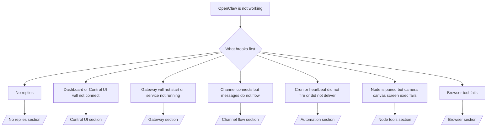

---
read_when:
    - OpenClaw ไม่ทำงานและคุณต้องการวิธีที่เร็วที่สุดในการแก้ไข
    - คุณต้องการขั้นตอนการคัดแยกเบื้องต้นก่อนลงลึกในคู่มือปฏิบัติการอย่างละเอียด
summary: ศูนย์รวมการแก้ไขปัญหาตามอาการสำหรับ OpenClaw
title: การแก้ปัญหาทั่วไป
x-i18n:
    generated_at: "2026-06-27T17:42:51Z"
    model: gpt-5.5
    postprocess_version: locale-links-v1
    provider: openai
    source_hash: ae1236c73e3a5c9237bd81d603e8dca18c595a8bcbb71f5931bfbf2389b342cd
    source_path: help/troubleshooting.md
    workflow: 16
---

หากคุณมีเวลาเพียง 2 นาที ให้ใช้หน้านี้เป็นประตูหน้าสำหรับการคัดแยกปัญหา

## 60 วินาทีแรก

รันลำดับคำสั่งนี้ตามลำดับ:

```bash
openclaw status
openclaw status --all
openclaw gateway probe
openclaw gateway status
openclaw doctor
openclaw channels status --probe
openclaw logs --follow
```

ผลลัพธ์ที่ดีในบรรทัดเดียว:

- `openclaw status` → แสดงช่องทางที่กำหนดค่าไว้และไม่มีข้อผิดพลาด auth ที่ชัดเจน
- `openclaw status --all` → มีรายงานฉบับเต็มและแชร์ได้
- `openclaw gateway probe` → เป้าหมาย gateway ที่คาดไว้เข้าถึงได้ (`Reachable: yes`) `Capability: ...` บอกระดับ auth ที่ probe พิสูจน์ได้ และ `Read probe: limited - missing scope: operator.read` คือ diagnostics ที่ลดระดับ ไม่ใช่การเชื่อมต่อล้มเหลว
- `openclaw gateway status` → `Runtime: running`, `Connectivity probe: ok` และบรรทัด `Capability: ...` ที่สมเหตุสมผล ใช้ `--require-rpc` หากคุณต้องการ proof ของ RPC แบบ read-scope ด้วย
- `openclaw doctor` → ไม่มีข้อผิดพลาด config/service ที่บล็อกการทำงาน
- `openclaw channels status --probe` → gateway ที่เข้าถึงได้จะคืนค่าสถานะ transport แบบสดรายบัญชี
  พร้อมผลลัพธ์ probe/audit เช่น `works` หรือ `audit ok`; หาก
  gateway เข้าถึงไม่ได้ คำสั่งจะ fallback เป็นสรุปจาก config เท่านั้น
- `openclaw logs --follow` → มีกิจกรรมต่อเนื่อง ไม่มีข้อผิดพลาด fatal ที่เกิดซ้ำ

## ผู้ช่วยดูเหมือนถูกจำกัดหรือขาดเครื่องมือ

หากผู้ช่วยไม่สามารถตรวจไฟล์ รันคำสั่ง ใช้ browser automation หรือ
มองไม่เห็นเครื่องมือที่คาดไว้ ให้ตรวจ effective tool profile ก่อน:

```bash
openclaw status
openclaw status --all
openclaw doctor
```

สาเหตุที่พบบ่อย:

- `tools.profile: "messaging"` ตั้งใจให้แคบสำหรับ agent แบบแชทเท่านั้น
- `tools.profile: "coding"` คือโปรไฟล์ปกติสำหรับ repository, file, shell,
  และ runtime workflows
- `tools.profile: "full"` เปิดเผยชุดเครื่องมือที่กว้างที่สุด และควรจำกัดไว้
  สำหรับ agent ที่ควบคุมโดย operator ที่เชื่อถือได้
- การ override ราย agent ที่ `agents.list[].tools` สามารถจำกัดหรือขยาย root
  profile สำหรับ agent หนึ่งตัวได้

เปลี่ยน root หรือ per-agent tool profile แล้ว restart หรือ reload Gateway
และรัน `openclaw status --all` อีกครั้ง ดู [เครื่องมือ](/th/tools) สำหรับโมเดล profile
และการ override allow/deny

## Anthropic long context 429

หากคุณเห็น:
`HTTP 429: rate_limit_error: Extra usage is required for long context requests`,
ไปที่ [/gateway/troubleshooting#anthropic-429-extra-usage-required-for-long-context](/th/gateway/troubleshooting#anthropic-429-extra-usage-required-for-long-context)

## Backend แบบ local ที่เข้ากันได้กับ OpenAI ทำงานโดยตรงแต่ล้มเหลวใน OpenClaw

หาก backend `/v1` แบบ local หรือ self-hosted ของคุณตอบ probe
`/v1/chat/completions` ขนาดเล็กโดยตรงได้ แต่ล้มเหลวกับ `openclaw infer model run` หรือ turn
ปกติของ agent:

1. หากข้อผิดพลาดกล่าวถึง `messages[].content` ว่าคาดหวัง string ให้ตั้ง
   `models.providers.<provider>.models[].compat.requiresStringContent: true`
2. หาก backend ยังล้มเหลวเฉพาะกับ turn ของ OpenClaw agent ให้ตั้ง
   `models.providers.<provider>.models[].compat.supportsTools: false` แล้วลองใหม่
3. หาก direct call ขนาดจิ๋วยังทำงานได้ แต่ prompt ของ OpenClaw ที่ใหญ่กว่าทำให้
   backend crash ให้ถือว่าปัญหาที่เหลือเป็นข้อจำกัดของ upstream model/server และ
   ดำเนินต่อใน deep runbook:
   [/gateway/troubleshooting#local-openai-compatible-backend-passes-direct-probes-but-agent-runs-fail](/th/gateway/troubleshooting#local-openai-compatible-backend-passes-direct-probes-but-agent-runs-fail)

## การติดตั้ง Plugin ล้มเหลวเพราะขาด openclaw extensions

หากการติดตั้งล้มเหลวด้วย `package.json missing openclaw.extensions` แปลว่า package ของ plugin
ใช้รูปแบบเก่าที่ OpenClaw ไม่ยอมรับอีกต่อไป

แก้ใน package ของ plugin:

1. เพิ่ม `openclaw.extensions` ลงใน `package.json`
2. ชี้ entries ไปยังไฟล์ runtime ที่ build แล้ว (โดยปกติคือ `./dist/index.js`)
3. publish plugin อีกครั้ง แล้วรัน `openclaw plugins install <package>` อีกครั้ง

ตัวอย่าง:

```json
{
  "name": "@openclaw/my-plugin",
  "version": "1.2.3",
  "openclaw": {
    "extensions": ["./dist/index.js"]
  }
}
```

อ้างอิง: [สถาปัตยกรรม Plugin](/th/plugins/architecture)

## Install policy บล็อกการติดตั้งหรืออัปเดต plugin

หากการอัปเดตเสร็จสิ้นแต่ plugin ล้าสมัย ถูกปิดใช้งาน หรือแสดงข้อความเช่น
`blocked by install policy`, `install policy failed closed` หรือ
`Disabled "<plugin>" after plugin update failure` ให้ตรวจ
`security.installPolicy`

Install policy ทำงานในการติดตั้งและอัปเดต plugin เวอร์ชันของ plugin
ที่ OpenClaw เป็นเจ้าของมักเคลื่อนไปพร้อมกับ OpenClaw release ดังนั้นการอัปเดต OpenClaw
อาจต้องมีการอัปเดต plugin `@openclaw/*` ที่สอดคล้องกันระหว่าง post-update sync ด้วย

หลีกเลี่ยงรูปแบบ policy ที่กว้างเหล่านี้ เว้นแต่คุณจะดูแล upgrade
rule ที่ตรงกันด้วย:

- ตรึง plugin ที่ OpenClaw เป็นเจ้าของไว้กับเวอร์ชันเก่าแบบ exact เพียงเวอร์ชันเดียว เช่น อนุญาต
  เฉพาะ `@openclaw/*@2026.5.3`
- บล็อกด้วยชนิด source เพียงอย่างเดียว เช่นทุกคำขอ plugin แบบ npm, network หรือ
  `request.mode: "update"`
- ถือว่า policy command เป็น optional เมื่อเปิดใช้ `security.installPolicy`
  executable ของ policy ที่หายไป ช้า อ่านไม่ได้ หรือถูก permission บล็อก
  จะ fail closed
- อนุมัติเวอร์ชัน plugin โดยไม่พิจารณา
  `openclawVersion` ของ policy request และ metadata ของ candidate plugin

policy rule ที่ปลอดภัยกว่าอนุญาตให้อัปเดต plugin ที่ OpenClaw เป็นเจ้าของและเชื่อถือได้ เมื่อ
candidate เข้ากันได้กับ host OpenClaw ปัจจุบัน แทนที่จะ pin
release เดียวตลอดไป หากคุณบล็อก npm โดย default ให้สร้าง exception แคบๆ
สำหรับ package plugin `@openclaw/*` หรือ plugin id ที่เชื่อถือได้ที่คุณใช้ หากคุณ
แยกคำขอ install และ update ให้ใช้ trust rule เดียวกันกับ
`request.mode: "update"`

การกู้คืน:

```bash
openclaw doctor --deep
openclaw plugins update --all
openclaw status --all
```

หาก policy เข้มงวดโดยตั้งใจ ให้ผ่อนคลายในช่วง upgrade
ของ OpenClaw ที่เชื่อถือได้ รัน `openclaw plugins update --all` อีกครั้ง แล้วคืน rule ที่เข้มงวดกว่า
หาก plugin ถูกปิดใช้งานหลังจาก update failure ให้ตรวจสอบและเปิดใช้งานอีกครั้งเฉพาะ
หลังจากการอัปเดตสำเร็จ:

```bash
openclaw plugins inspect <plugin-id> --runtime --json
openclaw plugins enable <plugin-id>
```

อ้างอิง: [Operator install policy](/th/tools/skills-config#operator-install-policy-securityinstallpolicy)

## มี Plugin อยู่แต่ถูกบล็อกเพราะ ownership น่าสงสัย

หาก `openclaw doctor`, setup หรือ startup warnings แสดง:

```text
blocked plugin candidate: suspicious ownership (... uid=1000, expected uid=0 or root)
plugin present but blocked
```

ไฟล์ plugin เป็นของ Unix user คนละคนกับ process ที่โหลดไฟล์เหล่านั้น
อย่าลบ config ของ plugin ให้แก้ file ownership หรือรัน OpenClaw เป็น
user เดียวกับที่เป็นเจ้าของ state directory

โดยปกติการติดตั้ง Docker จะรันเป็น `node` (uid `1000`) สำหรับ Docker
setup ค่า default ให้ซ่อม host bind mounts:

```bash
sudo chown -R 1000:1000 /path/to/openclaw-config /path/to/openclaw-workspace
openclaw doctor --fix
```

หากคุณตั้งใจรัน OpenClaw เป็น root ให้ซ่อม managed plugin root ให้เป็น
root ownership แทน:

```bash
sudo chown -R root:root /path/to/openclaw-config/npm
openclaw doctor --fix
```

เอกสารเชิงลึก:

- [Plugin path ownership](/th/tools/plugin#blocked-plugin-path-ownership)
- [Docker permissions](/th/install/docker#permissions-and-eacces)

## Decision tree



<AccordionGroup>
  <Accordion title="ไม่มีการตอบกลับ">
    ```bash
    openclaw status
    openclaw gateway status
    openclaw channels status --probe
    openclaw pairing list --channel <channel> [--account <id>]
    openclaw logs --follow
    ```

    ผลลัพธ์ที่ดีมีลักษณะดังนี้:

    - `Runtime: running`
    - `Connectivity probe: ok`
    - `Capability: read-only`, `write-capable` หรือ `admin-capable`
    - ช่องทางของคุณแสดงว่า transport เชื่อมต่อแล้ว และเมื่อรองรับ จะมี `works` หรือ `audit ok` ใน `channels status --probe`
    - sender ดูเหมือนได้รับอนุมัติแล้ว (หรือ DM policy เปิดอยู่/อยู่ใน allowlist)

    log signature ที่พบบ่อย:

    - `drop guild message (mention required` → mention gating บล็อกข้อความใน Discord
    - `pairing request` → sender ยังไม่ได้รับอนุมัติและกำลังรอ DM pairing approval
    - `blocked` / `allowlist` ใน channel logs → sender, room หรือ group ถูกกรอง

    หน้าเชิงลึก:

    - [/gateway/troubleshooting#no-replies](/th/gateway/troubleshooting#no-replies)
    - [/channels/troubleshooting](/th/channels/troubleshooting)
    - [/channels/pairing](/th/channels/pairing)

  </Accordion>

  <Accordion title="Dashboard หรือ Control UI เชื่อมต่อไม่ได้">
    ```bash
    openclaw status
    openclaw gateway status
    openclaw logs --follow
    openclaw doctor
    openclaw channels status --probe
    ```

    ผลลัพธ์ที่ดีมีลักษณะดังนี้:

    - `Dashboard: http://...` แสดงใน `openclaw gateway status`
    - `Connectivity probe: ok`
    - `Capability: read-only`, `write-capable` หรือ `admin-capable`
    - ไม่มี auth loop ใน logs

    log signature ที่พบบ่อย:

    - `device identity required` → HTTP/non-secure context ไม่สามารถทำ device auth ให้เสร็จได้
    - `origin not allowed` → browser `Origin` ไม่ได้รับอนุญาตสำหรับ Control UI
      gateway target
    - `AUTH_TOKEN_MISMATCH` พร้อม retry hints (`canRetryWithDeviceToken=true`) → trusted device-token retry หนึ่งครั้งอาจเกิดขึ้นโดยอัตโนมัติ
    - cached-token retry นั้นใช้ cached scope set ที่เก็บไว้กับ paired
      device token ซ้ำ caller ที่ระบุ `deviceToken` / `scopes` อย่างชัดเจนจะคง
      requested scope set ของตนไว้แทน
    - บน path async Tailscale Serve Control UI ความพยายามที่ล้มเหลวสำหรับ
      `{scope, ip}` เดียวกันจะถูก serialize ก่อนที่ limiter จะบันทึก failure ดังนั้น
      bad retry พร้อมกันครั้งที่สองอาจแสดง `retry later` ได้แล้ว
    - `too many failed authentication attempts (retry later)` จาก localhost
      browser origin → ความล้มเหลวซ้ำจาก `Origin` เดียวกันนั้นถูก
      lock out ชั่วคราว; localhost origin อื่นใช้ bucket แยกกัน
    - `unauthorized` ซ้ำหลัง retry นั้น → token/password ผิด, auth mode mismatch หรือ paired device token เก่า
    - `gateway connect failed:` → UI ชี้ไปยัง URL/port ผิด หรือ gateway เข้าถึงไม่ได้

    หน้าเชิงลึก:

    - [/gateway/troubleshooting#dashboard-control-ui-connectivity](/th/gateway/troubleshooting#dashboard-control-ui-connectivity)
    - [/web/control-ui](/th/web/control-ui)
    - [/gateway/authentication](/th/gateway/authentication)

  </Accordion>

  <Accordion title="Gateway ไม่เริ่มทำงาน หรือ service ติดตั้งแล้วแต่ไม่รัน">
    ```bash
    openclaw status
    openclaw gateway status
    openclaw logs --follow
    openclaw doctor
    openclaw channels status --probe
    ```

    ผลลัพธ์ที่ดีมีลักษณะดังนี้:

    - `Service: ... (loaded)`
    - `Runtime: running`
    - `Connectivity probe: ok`
    - `Capability: read-only`, `write-capable` หรือ `admin-capable`

    log signature ที่พบบ่อย:

    - `Gateway start blocked: set gateway.mode=local` หรือ `existing config is missing gateway.mode` → gateway mode เป็น remote หรือไฟล์ config ขาด local-mode stamp และควรถูกซ่อม
    - `refusing to bind gateway ... without auth` → bind แบบ non-loopback โดยไม่มี gateway auth path ที่ถูกต้อง (token/password หรือ trusted-proxy เมื่อกำหนดค่าไว้)
    - `another gateway instance is already listening` หรือ `EADDRINUSE` → port ถูกใช้งานอยู่แล้ว

    หน้าเชิงลึก:

    - [/gateway/troubleshooting#gateway-service-not-running](/th/gateway/troubleshooting#gateway-service-not-running)
    - [/gateway/background-process](/th/gateway/background-process)
    - [/gateway/configuration](/th/gateway/configuration)

  </Accordion>

  <Accordion title="Channel เชื่อมต่อแล้วแต่ข้อความไม่ไหล">
    ```bash
    openclaw status
    openclaw gateway status
    openclaw logs --follow
    openclaw doctor
    openclaw channels status --probe
    ```

    เอาต์พุตที่ดีมีลักษณะดังนี้:

    - การขนส่งของ Channel เชื่อมต่อแล้ว
    - การตรวจสอบการจับคู่/allowlist ผ่าน
    - ตรวจพบการกล่าวถึงในจุดที่จำเป็น

    รูปแบบล็อกที่พบบ่อย:

    - `mention required` → การกั้นด้วยการกล่าวถึงในกลุ่มบล็อกการประมวลผล
    - `pairing` / `pending` → ผู้ส่ง DM ยังไม่ได้รับอนุมัติ
    - `not_in_channel`, `missing_scope`, `Forbidden`, `401/403` → ปัญหาโทเค็นสิทธิ์ของ Channel

    หน้าเชิงลึก:

    - [/gateway/troubleshooting#channel-connected-messages-not-flowing](/th/gateway/troubleshooting#channel-connected-messages-not-flowing)
    - [/channels/troubleshooting](/th/channels/troubleshooting)

  </Accordion>

  <Accordion title="Cron หรือ Heartbeat ไม่ทำงานหรือไม่ส่งมอบ">
    ```bash
    openclaw status
    openclaw gateway status
    openclaw cron status
    openclaw cron list
    openclaw cron runs --id <jobId> --limit 20
    openclaw logs --follow
    ```

    เอาต์พุตที่ดีมีลักษณะดังนี้:

    - `cron.status` แสดงว่าเปิดใช้งานพร้อมเวลาปลุกถัดไป
    - `cron runs` แสดงรายการ `ok` ล่าสุด
    - Heartbeat เปิดใช้งานอยู่และไม่ได้อยู่นอกเวลาที่ใช้งาน

    รูปแบบล็อกที่พบบ่อย:

    - `cron: scheduler disabled; jobs will not run automatically` → Cron ถูกปิดใช้งาน
    - `heartbeat skipped` พร้อม `reason=quiet-hours` → อยู่นอกเวลาที่ใช้งานที่กำหนดค่าไว้
    - `heartbeat skipped` พร้อม `reason=empty-heartbeat-file` → มี `HEARTBEAT.md` อยู่ แต่มีเพียงโครงเปล่า เช่น บรรทัดว่าง ความเห็น ส่วนหัว fence หรือ checklist ว่าง
    - `heartbeat skipped` พร้อม `reason=no-tasks-due` → โหมดงานของ `HEARTBEAT.md` ทำงานอยู่ แต่ยังไม่มีช่วงเวลางานใดถึงกำหนด
    - `heartbeat skipped` พร้อม `reason=alerts-disabled` → การมองเห็น Heartbeat ทั้งหมดถูกปิดใช้งาน (`showOk`, `showAlerts` และ `useIndicator` ปิดทั้งหมด)
    - `requests-in-flight` → เลนหลักไม่ว่าง การปลุกของ Heartbeat จึงถูกเลื่อนออกไป
    - `unknown accountId` → บัญชีเป้าหมายสำหรับการส่ง Heartbeat ไม่มีอยู่

    หน้าเชิงลึก:

    - [/gateway/troubleshooting#cron-and-heartbeat-delivery](/th/gateway/troubleshooting#cron-and-heartbeat-delivery)
    - [/automation/cron-jobs#troubleshooting](/th/automation/cron-jobs#troubleshooting)
    - [/gateway/heartbeat](/th/gateway/heartbeat)

  </Accordion>

  <Accordion title="Node จับคู่แล้วแต่เครื่องมือ camera canvas screen exec ล้มเหลว">
    ```bash
    openclaw status
    openclaw gateway status
    openclaw nodes status
    openclaw nodes describe --node <idOrNameOrIp>
    openclaw logs --follow
    ```

    เอาต์พุตที่ดีมีลักษณะดังนี้:

    - Node ถูกแสดงว่าเชื่อมต่อแล้วและจับคู่สำหรับบทบาท `node`
    - มีความสามารถสำหรับคำสั่งที่คุณกำลังเรียกใช้
    - สถานะสิทธิ์ได้รับอนุญาตสำหรับเครื่องมือแล้ว

    รูปแบบล็อกที่พบบ่อย:

    - `NODE_BACKGROUND_UNAVAILABLE` → นำแอป Node มาไว้ด้านหน้า
    - `*_PERMISSION_REQUIRED` → สิทธิ์ของ OS ถูกปฏิเสธ/ขาดหาย
    - `SYSTEM_RUN_DENIED: approval required` → การอนุมัติ exec กำลังรอดำเนินการ
    - `SYSTEM_RUN_DENIED: allowlist miss` → คำสั่งไม่ได้อยู่ใน exec allowlist

    หน้าเชิงลึก:

    - [/gateway/troubleshooting#node-paired-tool-fails](/th/gateway/troubleshooting#node-paired-tool-fails)
    - [/nodes/troubleshooting](/th/nodes/troubleshooting)
    - [/tools/exec-approvals](/th/tools/exec-approvals)

  </Accordion>

  <Accordion title="Exec ขออนุมัติขึ้นมาอย่างกะทันหัน">
    ```bash
    openclaw config get tools.exec.host
    openclaw config get tools.exec.security
    openclaw config get tools.exec.ask
    openclaw gateway restart
    ```

    สิ่งที่เปลี่ยนไป:

    - หากไม่ได้ตั้งค่า `tools.exec.host` ค่าเริ่มต้นคือ `auto`
    - `host=auto` จะแปลงเป็น `sandbox` เมื่อ runtime แบบ sandbox ทำงานอยู่ มิฉะนั้นจะเป็น `gateway`
    - `host=auto` เป็นเพียงการกำหนดเส้นทางเท่านั้น; พฤติกรรม "YOLO" แบบไม่ถามยืนยันมาจาก `security=full` ร่วมกับ `ask=off` บน gateway/node
    - บน `gateway` และ `node` หากไม่ได้ตั้งค่า `tools.exec.security` ค่าเริ่มต้นคือ `full`
    - หากไม่ได้ตั้งค่า `tools.exec.ask` ค่าเริ่มต้นคือ `off`
    - ผลลัพธ์: หากคุณเห็นการขออนุมัติ แสดงว่านโยบายเฉพาะโฮสต์หรือเฉพาะเซสชันบางอย่างได้จำกัด exec ให้เข้มงวดกว่าค่าเริ่มต้นปัจจุบัน

    คืนค่าพฤติกรรมเริ่มต้นปัจจุบันแบบไม่ต้องอนุมัติ:

    ```bash
    openclaw config set tools.exec.host gateway
    openclaw config set tools.exec.security full
    openclaw config set tools.exec.ask off
    openclaw gateway restart
    ```

    ทางเลือกที่ปลอดภัยกว่า:

    - ตั้งค่าเฉพาะ `tools.exec.host=gateway` หากคุณต้องการเพียงการกำหนดเส้นทางโฮสต์ที่เสถียร
    - ใช้ `security=allowlist` กับ `ask=on-miss` หากคุณต้องการ host exec แต่ยังต้องการให้ตรวจทานเมื่อไม่พบใน allowlist
    - เปิดใช้งานโหมด sandbox หากคุณต้องการให้ `host=auto` แปลงกลับเป็น `sandbox`

    รูปแบบล็อกที่พบบ่อย:

    - `Approval required.` → คำสั่งกำลังรอ `/approve ...`
    - `SYSTEM_RUN_DENIED: approval required` → การอนุมัติ exec บนโฮสต์ node กำลังรอดำเนินการ
    - `exec host=sandbox requires a sandbox runtime for this session` → มีการเลือก sandbox โดยนัย/โดยตรง แต่โหมด sandbox ปิดอยู่

    หน้าเชิงลึก:

    - [/tools/exec](/th/tools/exec)
    - [/tools/exec-approvals](/th/tools/exec-approvals)
    - [/gateway/security#what-the-audit-checks-high-level](/th/gateway/security#what-the-audit-checks-high-level)

  </Accordion>

  <Accordion title="เครื่องมือ Browser ล้มเหลว">
    ```bash
    openclaw status
    openclaw gateway status
    openclaw browser status
    openclaw logs --follow
    openclaw doctor
    ```

    เอาต์พุตที่ดีมีลักษณะดังนี้:

    - สถานะ Browser แสดง `running: true` และ browser/profile ที่เลือก
    - `openclaw` เริ่มทำงาน หรือ `user` มองเห็นแท็บ Chrome ในเครื่อง

    รูปแบบล็อกที่พบบ่อย:

    - `unknown command "browser"` หรือ `unknown command 'browser'` → ตั้งค่า `plugins.allow` ไว้และไม่ได้รวม `browser`
    - `Failed to start Chrome CDP on port` → การเปิดเบราว์เซอร์ในเครื่องล้มเหลว
    - `browser.executablePath not found` → เส้นทางไบนารีที่กำหนดค่าไว้ไม่ถูกต้อง
    - `browser.cdpUrl must be http(s) or ws(s)` → URL ของ CDP ที่กำหนดค่าไว้ใช้ scheme ที่ไม่รองรับ
    - `browser.cdpUrl has invalid port` → URL ของ CDP ที่กำหนดค่าไว้มีพอร์ตไม่ถูกต้องหรืออยู่นอกช่วง
    - `No Chrome tabs found for profile="user"` → โปรไฟล์ Chrome MCP attach ไม่มีแท็บ Chrome ในเครื่องที่เปิดอยู่
    - `Remote CDP for profile "<name>" is not reachable` → endpoint ของ CDP ระยะไกลที่กำหนดค่าไว้ไม่สามารถเข้าถึงได้จากโฮสต์นี้
    - `Browser attachOnly is enabled ... not reachable` หรือ `Browser attachOnly is enabled and CDP websocket ... is not reachable` → โปรไฟล์แบบ attach-only ไม่มีเป้าหมาย CDP ที่ยังทำงานอยู่
    - การ override viewport / dark-mode / locale / offline ที่ค้างอยู่บนโปรไฟล์ attach-only หรือ CDP ระยะไกล → เรียกใช้ `openclaw browser stop --browser-profile <name>` เพื่อปิดเซสชันควบคุมที่ใช้งานอยู่และปล่อยสถานะ emulation โดยไม่ต้องรีสตาร์ท Gateway

    หน้าเชิงลึก:

    - [/gateway/troubleshooting#browser-tool-fails](/th/gateway/troubleshooting#browser-tool-fails)
    - [/tools/browser#missing-browser-command-or-tool](/th/tools/browser#missing-browser-command-or-tool)
    - [/tools/browser-linux-troubleshooting](/th/tools/browser-linux-troubleshooting)
    - [/tools/browser-wsl2-windows-remote-cdp-troubleshooting](/th/tools/browser-wsl2-windows-remote-cdp-troubleshooting)

  </Accordion>

</AccordionGroup>

## ที่เกี่ยวข้อง

- [FAQ](/th/help/faq) — คำถามที่พบบ่อย
- [การแก้ไขปัญหา Gateway](/th/gateway/troubleshooting) — ปัญหาเฉพาะ Gateway
- [Doctor](/th/gateway/doctor) — การตรวจสุขภาพและการซ่อมแซมอัตโนมัติ
- [การแก้ไขปัญหา Channel](/th/channels/troubleshooting) — ปัญหาการเชื่อมต่อ Channel
- [การแก้ไขปัญหา Automation](/th/automation/cron-jobs#troubleshooting) — ปัญหา Cron และ Heartbeat
