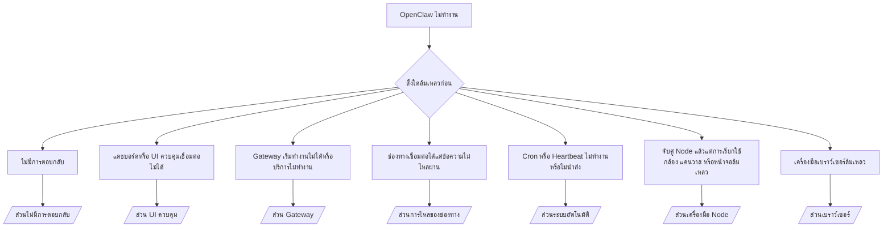

---
read_when:
    - OpenClaw ไม่ทำงาน และคุณต้องการวิธีแก้ไขที่รวดเร็วที่สุด
    - คุณต้องการขั้นตอนการคัดกรองปัญหาก่อนลงรายละเอียดในคู่มือปฏิบัติงานเชิงลึก
summary: ศูนย์รวมการแก้ไขปัญหาสำหรับ OpenClaw โดยเริ่มจากอาการที่พบ
title: การแก้ไขปัญหาทั่วไป
x-i18n:
    generated_at: "2026-07-12T16:16:00Z"
    model: gpt-5.6
    postprocess_version: locale-links-v1
    provider: openai
    source_hash: db50e0cdf4d11f3aa6196be445358d904a2b9c40c89243f1b124c77167f6dd85
    source_path: help/troubleshooting.md
    workflow: 16
---

จุดเริ่มต้นสำหรับการคัดแยกปัญหา ใช้เวลา 2 นาทีเพื่อวินิจฉัย จากนั้นไปยังหน้าเชิงลึก

## 60 วินาทีแรก

เรียกใช้คำสั่งตามลำดับนี้:

```bash
openclaw status
openclaw status --all
openclaw gateway probe
openclaw gateway status
openclaw doctor
openclaw channels status --probe
openclaw logs --follow
```

ผลลัพธ์ที่ถูกต้องสำหรับแต่ละรายการ:

- `openclaw status` แสดงช่องทางที่กำหนดค่าไว้โดยไม่มีข้อผิดพลาดด้านการยืนยันตัวตน
- `openclaw status --all` สร้างรายงานฉบับเต็มที่แชร์ได้
- `openclaw gateway probe` แสดง `Reachable: yes` ส่วน `Capability: ...` คือระดับการยืนยันตัวตนที่การตรวจสอบยืนยันได้ และ `Read probe: limited - missing scope:
operator.read` หมายถึงความสามารถในการวินิจฉัยลดลง ไม่ใช่ความล้มเหลวในการเชื่อมต่อ
- `openclaw gateway status` แสดง `Runtime: running`, `Connectivity probe:
ok` และค่า `Capability: ...` ที่สมเหตุสมผล เพิ่ม `--require-rpc` เพื่อกำหนดให้ต้องมีหลักฐาน RPC สำหรับขอบเขตการอ่านด้วย
- `openclaw doctor` รายงานว่าไม่มีข้อผิดพลาดด้านการกำหนดค่าหรือบริการที่ขัดขวางการทำงาน
- `openclaw channels status --probe` ส่งคืนสถานะการรับส่งข้อมูลจริงของแต่ละบัญชี
  (`works` / `audit ok`) เมื่อเข้าถึง Gateway ได้ หากเข้าถึงไม่ได้
  จะย้อนกลับไปแสดงเฉพาะข้อมูลสรุปจากการกำหนดค่า
- `openclaw logs --follow` แสดงกิจกรรมที่สม่ำเสมอโดยไม่มีข้อผิดพลาดร้ายแรงเกิดซ้ำ

## ผู้ช่วยดูมีข้อจำกัดหรือเครื่องมือหายไป

ตรวจสอบโปรไฟล์เครื่องมือที่มีผลใช้งานจริง:

```bash
openclaw status
openclaw status --all
openclaw doctor
```

สาเหตุที่พบบ่อย:

- `tools.profile: "minimal"` อนุญาตเฉพาะ `session_status`
- `tools.profile: "messaging"` มีขอบเขตจำกัดสำหรับเอเจนต์ที่ใช้แชตเท่านั้น
- `tools.profile: "coding"` เป็นค่าเริ่มต้นสำหรับการกำหนดค่าในเครื่องรายการใหม่ (งานเกี่ยวกับรีโพซิทอรี ไฟล์
  เชลล์ และรันไทม์)
- `tools.profile: "full"` ยกเลิกข้อจำกัดของโปรไฟล์ ควรใช้เฉพาะกับ
  เอเจนต์ที่เชื่อถือได้และอยู่ภายใต้การควบคุมของผู้ปฏิบัติงาน
- `agents.list[].tools` ของแต่ละเอเจนต์จะแทนที่เพื่อจำกัดหรือขยายโปรไฟล์ราก
  สำหรับเอเจนต์หนึ่งตัว

เปลี่ยนโปรไฟล์ รีสตาร์ตหรือโหลด Gateway ใหม่ แล้วตรวจสอบอีกครั้งด้วย
`openclaw status --all` ตารางโปรไฟล์/กลุ่มฉบับเต็ม: [โปรไฟล์เครื่องมือ](/th/gateway/config-tools#tool-profiles)

## บริบทยาวของ Anthropic เกิดข้อผิดพลาด 429

`HTTP 429: rate_limit_error: Extra usage is required for long context requests`
→ [Anthropic 429 ต้องมีโควตาการใช้งานเพิ่มเติมสำหรับบริบทยาว](/th/gateway/troubleshooting#anthropic-429-extra-usage-required-for-long-context)

## แบ็กเอนด์ในเครื่องที่เข้ากันได้กับ OpenAI ทำงานได้โดยตรงแต่ล้มเหลวใน OpenClaw

แบ็กเอนด์ `/v1` ในเครื่อง/ที่โฮสต์เองของคุณตอบสนองต่อการตรวจสอบ `/v1/chat/completions`
โดยตรง แต่ล้มเหลวเมื่อใช้ `openclaw infer model run` หรือการโต้ตอบปกติของเอเจนต์:

1. หากข้อผิดพลาดระบุว่า `messages[].content` ต้องเป็นสตริง ให้ตั้งค่า
   `models.providers.<provider>.models[].compat.requiresStringContent: true`
2. หากยังล้มเหลวเฉพาะในการโต้ตอบของเอเจนต์ OpenClaw ให้ตั้งค่า
   `models.providers.<provider>.models[].compat.supportsTools: false` แล้วลองอีกครั้ง
3. หากการเรียกโดยตรงขนาดเล็กทำงานได้ แต่พรอมต์ OpenClaw ขนาดใหญ่ทำให้แบ็กเอนด์ขัดข้อง
   นั่นเป็นข้อจำกัดของโมเดล/เซิร์ฟเวอร์ต้นทาง ไม่ใช่ข้อบกพร่องของ OpenClaw อ่านต่อที่
   [แบ็กเอนด์ในเครื่องที่เข้ากันได้กับ OpenAI ผ่านการตรวจสอบโดยตรง แต่การทำงานของเอเจนต์ล้มเหลว](/th/gateway/troubleshooting#local-openai-compatible-backend-passes-direct-probes-but-agent-runs-fail)

## การติดตั้ง Plugin ล้มเหลวเนื่องจากไม่มี openclaw extensions

`package.json missing openclaw.extensions` หมายความว่าแพ็กเกจ Plugin ใช้
โครงสร้างที่ OpenClaw ไม่ยอมรับอีกต่อไป

แก้ไขในแพ็กเกจ Plugin:

1. เพิ่ม `openclaw.extensions` ลงใน `package.json` โดยชี้ไปยังไฟล์รันไทม์
   ที่สร้างแล้ว (โดยทั่วไปคือ `./dist/index.js`)
2. เผยแพร่ใหม่ แล้วเรียกใช้ `openclaw plugins install <package>` อีกครั้ง

```json
{
  "name": "@openclaw/my-plugin",
  "version": "1.2.3",
  "openclaw": {
    "extensions": ["./dist/index.js"]
  }
}
```

เอกสารอ้างอิง: [สถาปัตยกรรม Plugin](/th/plugins/architecture)

## นโยบายการติดตั้งขัดขวางการติดตั้งหรืออัปเดต Plugin

การอัปเดตเสร็จสิ้น แต่ Plugin ล้าสมัย ถูกปิดใช้งาน หรือแสดง `blocked by install
policy`, `install policy failed closed` หรือ `Disabled "<plugin>" after plugin
update failure`: ให้ตรวจสอบ `security.installPolicy`

นโยบายการติดตั้งจะทำงานระหว่างการติดตั้งและอัปเดต Plugin โดยทั่วไปเวอร์ชันของ Plugin
`@openclaw/*` จะเปลี่ยนไปพร้อมกับรุ่น OpenClaw ดังนั้นการอัปเดต OpenClaw
อาจต้องมีการอัปเดต Plugin ที่ตรงกันระหว่างการซิงค์หลังการอัปเดต

หลีกเลี่ยงนโยบายรูปแบบต่อไปนี้ เว้นแต่คุณจะดูแลกฎการอัปเกรดที่สอดคล้องกันด้วย:

- การตรึง Plugin ที่ OpenClaw เป็นเจ้าของไว้กับเวอร์ชันเก่าเพียงเวอร์ชันเดียว (เช่น อนุญาตเฉพาะ
  `@openclaw/*@2026.5.3`)
- การบล็อกโดยพิจารณาเพียงชนิดของแหล่งที่มา (คำขอ npm, เครือข่าย หรือ `request.mode:
"update"` ทั้งหมด)
- การถือว่าคำสั่งนโยบายเป็นตัวเลือก เมื่อเปิดใช้งาน `security.installPolicy`
  ไฟล์ปฏิบัติการของนโยบายที่หายไป ทำงานช้า อ่านไม่ได้ หรือถูกสิทธิ์การเข้าถึงขัดขวาง
  จะทำให้ระบบปฏิเสธการทำงานเพื่อความปลอดภัย
- การอนุมัติเวอร์ชันโดยไม่ตรวจสอบ `openclawVersion` ของคำขอกับ
  เมทาดาทาของ Plugin ที่เป็นตัวเลือก

ควรใช้กฎที่อนุญาตให้อัปเดต `@openclaw/*` ที่เชื่อถือได้และเข้ากันได้กับ
โฮสต์ปัจจุบัน แทนการตรึงรุ่นเดียวไว้ตลอดไป หากคุณบล็อก npm
ตามค่าเริ่มต้น ให้เพิ่มข้อยกเว้นแบบจำกัดสำหรับรหัส Plugin ที่คุณใช้ และใช้
กฎความเชื่อถือเดียวกันกับ `request.mode: "update"` และการติดตั้ง

การกู้คืน:

```bash
openclaw doctor --deep
openclaw plugins update --all
openclaw status --all
```

หากตั้งใจให้นโยบายเข้มงวด ให้ผ่อนคลายนโยบายระหว่างช่วงเวลาการอัปเกรด
ที่เชื่อถือได้ เรียกใช้ `openclaw plugins update --all` อีกครั้ง แล้วคืนค่ากฎที่เข้มงวดกว่าเดิม
หากความล้มเหลวในการอัปเดตทำให้ Plugin ถูกปิดใช้งาน ให้ตรวจสอบก่อนเปิดใช้งานอีกครั้ง:

```bash
openclaw plugins inspect <plugin-id> --runtime --json
openclaw plugins enable <plugin-id>
```

เอกสารอ้างอิง: [นโยบายการติดตั้งของผู้ปฏิบัติงาน](/th/tools/skills-config#operator-install-policy-securityinstallpolicy)

## มี Plugin แต่ถูกบล็อกเนื่องจากความเป็นเจ้าของที่น่าสงสัย

คำเตือนจาก `openclaw doctor` การตั้งค่า หรือการเริ่มทำงานแสดงว่า:

```text
blocked plugin candidate: suspicious ownership (... uid=1000, expected uid=0 or root)
plugin present but blocked
```

ไฟล์ Plugin เป็นของผู้ใช้ Unix คนละรายกับกระบวนการที่กำลังโหลดไฟล์เหล่านั้น
อย่าลบการกำหนดค่า Plugin ให้แก้ไขความเป็นเจ้าของไฟล์ หรือเรียกใช้
OpenClaw ด้วยผู้ใช้ที่เป็นเจ้าของไดเรกทอรีสถานะ

การติดตั้ง Docker ทำงานด้วยผู้ใช้ `node` (uid `1000`) ให้ซ่อมแซมไดเรกทอรีที่ผูกเมานต์จากโฮสต์:

```bash
sudo chown -R 1000:1000 /path/to/openclaw-config /path/to/openclaw-workspace
openclaw doctor --fix
```

หากคุณตั้งใจเรียกใช้ OpenClaw ด้วย root ให้ซ่อมแซมรากของ Plugin ที่ระบบจัดการแทน:

```bash
sudo chown -R root:root /path/to/openclaw-config/npm
openclaw doctor --fix
```

เอกสารเชิงลึก: [ความเป็นเจ้าของพาธ Plugin ที่ถูกบล็อก](/th/tools/plugin#blocked-plugin-path-ownership), [Docker: สิทธิ์และ EACCES](/th/install/docker#shell-helpers-optional)

## แผนผังการตัดสินใจ



<AccordionGroup>
  <Accordion title="ไม่มีการตอบกลับ">
    ```bash
    openclaw status
    openclaw gateway status
    openclaw channels status --probe
    openclaw pairing list --channel <channel> [--account <id>]
    openclaw logs --follow
    ```

    ผลลัพธ์ที่ถูกต้อง:

    - `Runtime: running`
    - `Connectivity probe: ok`
    - `Capability: read-only`, `write-capable` หรือ `admin-capable`
    - ช่องทางแสดงว่าการรับส่งข้อมูลเชื่อมต่อแล้ว และแสดง `works` หรือ
      `audit ok` ใน `channels status --probe` หากรองรับ
    - ผู้ส่งได้รับอนุมัติแล้ว (หรือนโยบาย DM เป็นแบบเปิด/รายการอนุญาต)

    รูปแบบข้อความในบันทึก:

    - `drop guild message (mention required` → การบังคับให้กล่าวถึงใน Discord บล็อกข้อความ
    - `pairing request` → ผู้ส่งยังไม่ได้รับอนุมัติและกำลังรอการอนุมัติการจับคู่ DM
    - `blocked` / `allowlist` ในบันทึกช่องทาง → ผู้ส่ง ห้อง หรือกลุ่มถูกกรองออก

    หน้าเชิงลึก: [ไม่มีการตอบกลับ](/th/gateway/troubleshooting#no-replies), [การแก้ไขปัญหาช่องทาง](/th/channels/troubleshooting), [การจับคู่](/th/channels/pairing)

  </Accordion>

  <Accordion title="แดชบอร์ดหรือ UI ควบคุมเชื่อมต่อไม่ได้">
    ```bash
    openclaw status
    openclaw gateway status
    openclaw logs --follow
    openclaw doctor
    openclaw channels status --probe
    ```

    ผลลัพธ์ที่ถูกต้อง:

    - `Dashboard: http://...` แสดงอยู่ใน `openclaw gateway status`
    - `Connectivity probe: ok`
    - `Capability: read-only`, `write-capable` หรือ `admin-capable`
    - ไม่มีวงจรการยืนยันตัวตนซ้ำในบันทึก

    รูปแบบข้อความในบันทึก:

    - `device identity required` → บริบท HTTP/ไม่ปลอดภัยไม่สามารถดำเนินการยืนยันตัวตนของอุปกรณ์ให้เสร็จสมบูรณ์
    - `origin not allowed` → ไม่อนุญาต `Origin` ของเบราว์เซอร์สำหรับปลายทาง Gateway ของ UI ควบคุม
    - `AUTH_TOKEN_MISMATCH` พร้อม `canRetryWithDeviceToken=true` → ระบบอาจลองอีกครั้งโดยอัตโนมัติหนึ่งครั้งด้วยโทเค็นอุปกรณ์ที่เชื่อถือได้ โดยใช้ขอบเขตที่แคชไว้ของโทเค็นที่จับคู่แล้ว
    - `unauthorized` ที่เกิดซ้ำหลังจากลองอีกครั้ง → โทเค็น/รหัสผ่านไม่ถูกต้อง โหมดการยืนยันตัวตนไม่ตรงกัน หรือโทเค็นอุปกรณ์ที่จับคู่ไว้ล้าสมัย
    - `too many failed authentication attempts (retry later)` → ความล้มเหลวซ้ำจาก `Origin` ของเบราว์เซอร์นั้นถูกระงับชั่วคราว ส่วน Origin อื่นของ localhost ใช้บักเก็ตแยกกัน ดูรายละเอียดเกี่ยวกับการลองซ้ำพร้อมกันของ Tailscale Serve ที่ [การเชื่อมต่อแดชบอร์ด/UI ควบคุม](/th/gateway/troubleshooting#dashboard-control-ui-connectivity)
    - `gateway connect failed:` → UI กำหนดเป้าหมาย URL/พอร์ตไม่ถูกต้อง หรือไม่สามารถเข้าถึง Gateway ได้

    หน้าเชิงลึก: [การเชื่อมต่อแดชบอร์ด/UI ควบคุม](/th/gateway/troubleshooting#dashboard-control-ui-connectivity), [UI ควบคุม](/th/web/control-ui), [การยืนยันตัวตน](/th/gateway/authentication)

  </Accordion>

  <Accordion title="Gateway เริ่มทำงานไม่ได้ หรือติดตั้งบริการแล้วแต่บริการไม่ทำงาน">
    ```bash
    openclaw status
    openclaw gateway status
    openclaw logs --follow
    openclaw doctor
    openclaw channels status --probe
    ```

    ผลลัพธ์ที่ถูกต้อง:

    - `Service: ... (loaded)`
    - `Runtime: running`
    - `Connectivity probe: ok`
    - `Capability: read-only`, `write-capable` หรือ `admin-capable`

    รูปแบบข้อความในบันทึก:

    - `Gateway start blocked: set gateway.mode=local` หรือ `existing config is missing gateway.mode` → โหมด Gateway เป็นแบบระยะไกล หรือการกำหนดค่าไม่มีเครื่องหมายโหมดในเครื่องและต้องได้รับการซ่อมแซม
    - `refusing to bind gateway ... without auth` → ผูกกับที่อยู่ที่ไม่ใช่ local loopback โดยไม่มีช่องทางการยืนยันตัวตนที่ถูกต้อง (โทเค็น/รหัสผ่าน หรือพร็อกซีที่เชื่อถือได้หากกำหนดค่าไว้)
    - `another gateway instance is already listening` หรือ `EADDRINUSE` → พอร์ตถูกใช้งานอยู่แล้ว

    หน้าเชิงลึก: [บริการ Gateway ไม่ทำงาน](/th/gateway/troubleshooting#gateway-service-not-running), [กระบวนการเบื้องหลัง](/th/gateway/background-process), [การกำหนดค่า](/th/gateway/configuration)

  </Accordion>

  <Accordion title="ช่องทางเชื่อมต่อได้แต่ข้อความไม่ไหลผ่าน">
    ```bash
    openclaw status
    openclaw gateway status
    openclaw logs --follow
    openclaw doctor
    openclaw channels status --probe
    ```

    ผลลัพธ์ที่ถูกต้อง:

    - การรับส่งข้อมูลของช่องทางเชื่อมต่อแล้ว
    - การตรวจสอบการจับคู่/รายการอนุญาตผ่าน
    - ตรวจพบการกล่าวถึงในจุดที่กำหนดให้ต้องมี

    รูปแบบข้อความในบันทึก:

    - `mention required` → การบังคับให้กล่าวถึงในกลุ่มบล็อกการประมวลผล
    - `pairing` / `pending` → ผู้ส่ง DM ยังไม่ได้รับอนุมัติ
    - `not_in_channel`, `missing_scope`, `Forbidden`, `401/403` → ปัญหาสิทธิ์หรือโทเค็นของช่องทาง

    หน้าเชิงลึก: [ช่องทางเชื่อมต่อแล้วแต่ข้อความไม่ไหลผ่าน](/th/gateway/troubleshooting#channel-connected-messages-not-flowing), [การแก้ไขปัญหาช่องทาง](/th/channels/troubleshooting)

  </Accordion>

  <Accordion title="Cron หรือ Heartbeat ไม่ทำงานหรือไม่นำส่ง">
    ```bash
    openclaw status
    openclaw gateway status
    openclaw cron status
    openclaw cron list
    openclaw cron runs --id <jobId> --limit 20
    openclaw logs --follow
    ```

    ผลลัพธ์ที่ถูกต้อง:

    - `cron status` แสดงว่าตัวกำหนดเวลาเปิดใช้งานอยู่พร้อมเวลาปลุกครั้งถัดไป
    - `cron runs` แสดงรายการ `ok` ล่าสุด
    - Heartbeat เปิดใช้งานอยู่และอยู่ภายในช่วงเวลาทำงาน

    รูปแบบข้อความในบันทึก:

    - `cron: scheduler disabled; jobs will not run automatically` → Cron ถูกปิดใช้งาน
    - `heartbeat skipped` เหตุผล `quiet-hours` → อยู่นอกช่วงเวลาทำงานที่กำหนดไว้
    - `heartbeat skipped` เหตุผล `empty-heartbeat-file` → มี `HEARTBEAT.md` อยู่ แต่มีเพียงโครงร่างที่เป็นบรรทัดว่าง ความคิดเห็น ส่วนหัว รั้วโค้ด หรือรายการตรวจสอบว่าง
    - `heartbeat skipped` เหตุผล `no-tasks-due` → โหมดงานทำงานอยู่ แต่ยังไม่มีงานใดถึงรอบเวลาที่กำหนด
    - `heartbeat skipped` เหตุผล `alerts-disabled` → `showOk`, `showAlerts` และ `useIndicator` ปิดอยู่ทั้งหมด
    - `requests-in-flight` → เลนหลักไม่ว่าง จึงเลื่อนการปลุก Heartbeat ออกไป
    - `unknown accountId` → ไม่มีบัญชีเป้าหมายสำหรับส่ง Heartbeat

    หน้าเชิงลึก: [การส่ง Cron และ Heartbeat](/th/gateway/troubleshooting#cron-and-heartbeat-delivery), [งานตามกำหนดเวลา: การแก้ไขปัญหา](/th/automation/cron-jobs#troubleshooting), [Heartbeat](/th/gateway/heartbeat)

  </Accordion>

  <Accordion title="จับคู่ Node แล้ว แต่เครื่องมือกล้อง แคนวาส หน้าจอ หรือ exec ล้มเหลว">
    ```bash
    openclaw status
    openclaw gateway status
    openclaw nodes status
    openclaw nodes describe --node <idOrNameOrIp>
    openclaw logs --follow
    ```

    ผลลัพธ์ที่ถูกต้อง:

    - Node แสดงสถานะว่าเชื่อมต่อและจับคู่แล้วสำหรับบทบาท `node`
    - มีความสามารถที่จำเป็นสำหรับคำสั่งที่คุณกำลังเรียกใช้
    - สถานะสิทธิ์อนุญาตให้ใช้เครื่องมือแล้ว

    รูปแบบข้อความในบันทึก:

    - `NODE_BACKGROUND_UNAVAILABLE` → นำแอป Node มาไว้เบื้องหน้า
    - `*_PERMISSION_REQUIRED` → สิทธิ์ของระบบปฏิบัติการถูกปฏิเสธหรือขาดหาย
    - `SYSTEM_RUN_DENIED: approval required` → การอนุมัติ exec กำลังรอดำเนินการ
    - `SYSTEM_RUN_DENIED: allowlist miss` → คำสั่งไม่ได้อยู่ในรายการอนุญาตของ exec

    หน้าเชิงลึก: [จับคู่ Node แล้ว แต่เครื่องมือล้มเหลว](/th/gateway/troubleshooting#node-paired-tool-fails), [การแก้ไขปัญหา Node](/th/nodes/troubleshooting), [การอนุมัติ Exec](/th/tools/exec-approvals)

  </Accordion>

  <Accordion title="Exec ขอการอนุมัติโดยกะทันหัน">
    ```bash
    openclaw config get tools.exec.host
    openclaw config get tools.exec.security
    openclaw config get tools.exec.ask
    openclaw gateway restart
    ```

    สิ่งที่เปลี่ยนแปลง:

    - เมื่อไม่ได้ตั้งค่า `tools.exec.host` ค่าเริ่มต้นคือ `auto` ซึ่งจะถูกแปลงเป็น `sandbox`
      เมื่อรันไทม์แซนด์บ็อกซ์ทำงานอยู่ มิฉะนั้นจะเป็น `gateway`
    - `host=auto` มีหน้าที่กำหนดเส้นทางเท่านั้น ส่วนพฤติกรรมที่ไม่แสดงข้อความแจ้งมาจาก
      `security=full` ร่วมกับ `ask=off` บน Gateway/Node
    - เมื่อไม่ได้ตั้งค่า `tools.exec.security` ค่าเริ่มต้นคือ `full` บน `gateway`/`node`
    - เมื่อไม่ได้ตั้งค่า `tools.exec.ask` ค่าเริ่มต้นคือ `off`
    - หากคุณเห็นคำขออนุมัติ แสดงว่านโยบายเฉพาะโฮสต์หรือเฉพาะเซสชันบางอย่าง
      จำกัด exec ให้เข้มงวดกว่าค่าเริ่มต้นเหล่านี้

    คืนค่าค่าเริ่มต้นปัจจุบันที่ไม่ต้องขออนุมัติ:

    ```bash
    openclaw config set tools.exec.host gateway
    openclaw config set tools.exec.security full
    openclaw config set tools.exec.ask off
    openclaw gateway restart
    ```

    ทางเลือกที่ปลอดภัยกว่า:

    - ตั้งค่าเฉพาะ `tools.exec.host=gateway` เพื่อให้การกำหนดเส้นทางโฮสต์คงที่
    - ใช้ `security=allowlist` ร่วมกับ `ask=on-miss` สำหรับ exec บนโฮสต์ โดยให้ตรวจสอบ
      เมื่อคำสั่งไม่ตรงกับรายการอนุญาต
    - เปิดใช้โหมดแซนด์บ็อกซ์เพื่อให้ `host=auto` ถูกแปลงกลับเป็น `sandbox`

    รูปแบบข้อความในบันทึก:

    - `Approval required.` → คำสั่งกำลังรอ `/approve ...`
    - `SYSTEM_RUN_DENIED: approval required` → การอนุมัติ exec บนโฮสต์ Node กำลังรอดำเนินการ
    - `exec host=sandbox requires a sandbox runtime for this session` → มีการเลือกแซนด์บ็อกซ์โดยปริยายหรือโดยชัดแจ้ง แต่โหมดแซนด์บ็อกซ์ปิดอยู่

    หน้าเชิงลึก: [Exec](/th/tools/exec), [การอนุมัติ Exec](/th/tools/exec-approvals), [ความปลอดภัย: สิ่งที่การตรวจสอบประเมิน](/th/gateway/security#what-the-audit-checks-high-level)

  </Accordion>

  <Accordion title="เครื่องมือเบราว์เซอร์ล้มเหลว">
    ```bash
    openclaw status
    openclaw gateway status
    openclaw browser status
    openclaw logs --follow
    openclaw doctor
    ```

    ผลลัพธ์ที่ถูกต้อง:

    - สถานะเบราว์เซอร์แสดง `running: true` พร้อมเบราว์เซอร์/โปรไฟล์ที่เลือก
    - โปรไฟล์ `openclaw` เริ่มทำงาน หรือโปรไฟล์ `user` มองเห็นแท็บ Chrome ภายในเครื่อง

    รูปแบบข้อความในบันทึก:

    - `unknown command "browser"` → มีการตั้งค่า `plugins.allow` และไม่รวม `browser`
    - `Failed to start Chrome CDP on port` → การเปิดเบราว์เซอร์ภายในเครื่องล้มเหลว
    - `browser.executablePath not found` → พาธไบนารีที่กำหนดค่าไว้ไม่ถูกต้อง
    - `browser.cdpUrl must be http(s) or ws(s)` → URL ของ CDP ที่กำหนดค่าไว้ใช้รูปแบบที่ไม่รองรับ
    - `browser.cdpUrl has invalid port` → URL ของ CDP ที่กำหนดค่าไว้มีพอร์ตไม่ถูกต้องหรืออยู่นอกช่วง
    - `No Chrome tabs found for profile="user"` → โปรไฟล์แนบ Chrome MCP ไม่มีแท็บ Chrome ภายในเครื่องที่เปิดอยู่
    - `Remote CDP for profile "<name>" is not reachable` → ไม่สามารถเข้าถึงปลายทาง CDP ระยะไกลที่กำหนดค่าไว้จากโฮสต์นี้
    - `Browser attachOnly is enabled ... not reachable` → โปรไฟล์แบบแนบเท่านั้นไม่มีเป้าหมาย CDP ที่ทำงานอยู่
    - การตั้งค่าทับวิวพอร์ต/โหมดมืด/ภาษาท้องถิ่น/ออฟไลน์ที่ค้างอยู่บนโปรไฟล์แบบแนบเท่านั้นหรือโปรไฟล์ CDP ระยะไกล → เรียกใช้ `openclaw browser stop --browser-profile <name>` เพื่อปิดเซสชันควบคุมและปล่อยสถานะการจำลองโดยไม่ต้องเริ่ม Gateway ใหม่

    หน้าเชิงลึก: [เครื่องมือเบราว์เซอร์ล้มเหลว](/th/gateway/troubleshooting#browser-tool-fails), [ไม่พบคำสั่งหรือเครื่องมือเบราว์เซอร์](/th/tools/browser#missing-browser-command-or-tool), [เบราว์เซอร์: การแก้ไขปัญหาบน Linux](/th/tools/browser-linux-troubleshooting), [เบราว์เซอร์: การแก้ไขปัญหา CDP ระยะไกลบน WSL2/Windows](/th/tools/browser-wsl2-windows-remote-cdp-troubleshooting)

  </Accordion>

</AccordionGroup>

## ที่เกี่ยวข้อง

- [คำถามที่พบบ่อย](/th/help/faq) — คำถามที่ถามกันบ่อย
- [การแก้ไขปัญหา Gateway](/th/gateway/troubleshooting) — ปัญหาเฉพาะของ Gateway
- [Doctor](/th/gateway/doctor) — การตรวจสอบสภาพและซ่อมแซมโดยอัตโนมัติ
- [การแก้ไขปัญหาช่องทาง](/th/channels/troubleshooting) — ปัญหาการเชื่อมต่อช่องทาง
- [งานตามกำหนดเวลา: การแก้ไขปัญหา](/th/automation/cron-jobs#troubleshooting) — ปัญหาเกี่ยวกับ Cron และ Heartbeat
