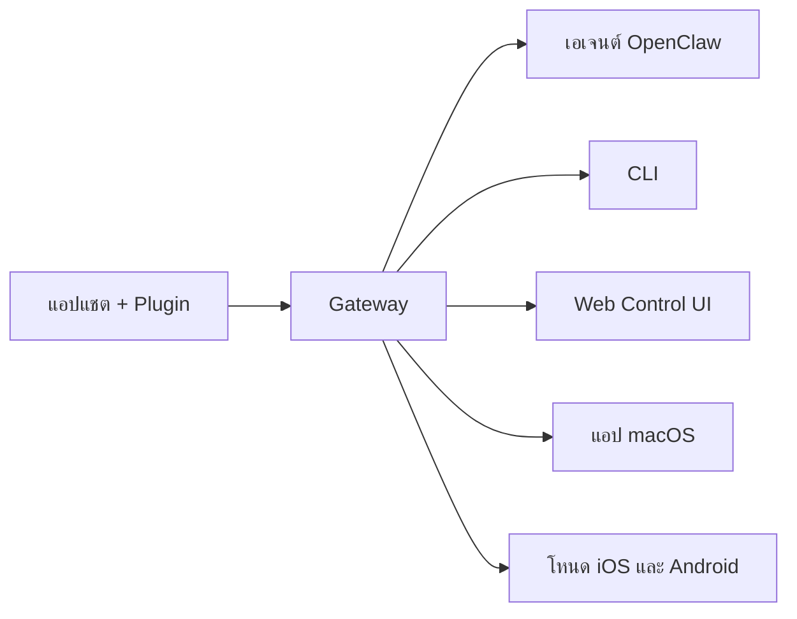

---
read_when:
    - แนะนำ OpenClaw สำหรับผู้เริ่มต้น
summary: OpenClaw คือ Gateway แบบหลายช่องทางสำหรับเอเจนต์ AI ที่ทำงานได้บนทุกระบบปฏิบัติการ
title: OpenClaw
x-i18n:
    generated_at: "2026-07-16T19:13:29Z"
    model: gpt-5.6
    postprocess_version: locale-links-v1
    prompt_version: 32
    provider: openai
    source_hash: fe97e7299be4855fd9af21838e0626b5a5c8aafe46d982859e9033f0efec2443
    source_path: index.md
    workflow: 16
---

# OpenClaw 🦞

<p align="center">
    
    
</p>

> _"ขัดผิว! ขัดผิว!"_ — กุ้งล็อบสเตอร์อวกาศสักตัว คงจะใช่

<p align="center">
  <strong>Gateway สำหรับทุกระบบปฏิบัติการที่เชื่อมต่อเอเจนต์ AI ผ่าน Discord, Google Chat, iMessage, Matrix, Microsoft Teams, Signal, Slack, Telegram, WhatsApp, Zalo และอื่น ๆ</strong><br />
  ส่งข้อความแล้วรับคำตอบจากเอเจนต์ได้จากอุปกรณ์ในกระเป๋าของคุณ ใช้ Gateway เดียวร่วมกับ Plugin ช่องทาง, WebChat และโหนดอุปกรณ์เคลื่อนที่
</p>

<Columns>
  <Card title="เริ่มต้นใช้งาน" href="/th/start/getting-started" icon="rocket">
    ติดตั้ง OpenClaw และเปิดใช้งาน Gateway ได้ภายในไม่กี่นาที
  </Card>
  <Card title="ดำเนินการเริ่มต้นใช้งาน" href="/th/start/wizard" icon="list-checks">
    การตั้งค่าแบบมีคำแนะนำด้วย `openclaw onboard` และขั้นตอนการจับคู่
  </Card>
  <Card title="เชื่อมต่อช่องทาง" href="/th/channels" icon="message-circle">
    เชื่อมโยง Discord, Signal, Telegram, WhatsApp และอื่น ๆ เพื่อแชตได้จากทุกที่
  </Card>
  <Card title="เปิด Control UI" href="/th/web/control-ui" icon="layout-dashboard">
    เปิดแดชบอร์ดบนเบราว์เซอร์สำหรับแชต การกำหนดค่า และเซสชัน
  </Card>
</Columns>

## เรียกดูเอกสาร

เบราว์เซอร์บนอุปกรณ์เคลื่อนที่อาจแสดงเมนูส่วนต่าง ๆ โดยไม่มีแถบแท็บเดสก์ท็อปแบบเต็ม ใช้
ลิงก์ศูนย์รวมเหล่านี้เพื่อเข้าถึงส่วนเอกสารระดับบนสุดเดียวกันจากเนื้อหาของหน้า

<Columns>
  <Card title="เริ่มต้นใช้งาน" href="/th" icon="rocket">
    ภาพรวม ตัวอย่างผลงาน ขั้นตอนแรก และคู่มือการตั้งค่า
  </Card>
  <Card title="ติดตั้ง" href="/th/install" icon="download">
    วิธีติดตั้ง การอัปเดต คอนเทนเนอร์ โฮสติ้ง และการตั้งค่าขั้นสูง
  </Card>
  <Card title="ช่องทาง" href="/th/channels" icon="messages-square">
    ช่องทางรับส่งข้อความ การจับคู่ การกำหนดเส้นทาง กลุ่มการเข้าถึง และการประกันคุณภาพช่องทาง
  </Card>
  <Card title="เอเจนต์" href="/th/concepts/architecture" icon="bot">
    สถาปัตยกรรม เซสชัน บริบท หน่วยความจำ และการกำหนดเส้นทางแบบหลายเอเจนต์
  </Card>
  <Card title="ความสามารถ" href="/th/tools" icon="wand-sparkles">
    เครื่องมือ Skills, cron, webhooks และความสามารถด้านระบบอัตโนมัติ
  </Card>
  <Card title="ClawHub" href="/th/clawhub" icon="store">
    ตลาด Plugin การเผยแพร่ การคัดสรร และคำแนะนำด้านความน่าเชื่อถือ
  </Card>
  <Card title="โมเดล" href="/th/providers" icon="brain">
    ผู้ให้บริการ การกำหนดค่าโมเดล การสลับสำรองเมื่อขัดข้อง และบริการโมเดลภายในเครื่อง
  </Card>
  <Card title="แพลตฟอร์ม" href="/th/platforms" icon="monitor-smartphone">
    macOS, Windows, iOS, Android, โหนด และส่วนติดต่อเว็บ
  </Card>
  <Card title="Gateway และการปฏิบัติการ" href="/th/gateway" icon="server">
    การกำหนดค่า Gateway ความปลอดภัย การวินิจฉัย และการปฏิบัติการ
  </Card>
  <Card title="ข้อมูลอ้างอิง" href="/th/cli" icon="terminal">
    ข้อมูลอ้างอิง CLI, สคีมา, RPC, บันทึกประจำรุ่น และเทมเพลต
  </Card>
  <Card title="ความช่วยเหลือ" href="/th/help" icon="life-buoy">
    การแก้ไขปัญหา คำถามที่พบบ่อย การทดสอบ การวินิจฉัย และการตรวจสอบสภาพแวดล้อม
  </Card>
</Columns>

## OpenClaw คืออะไร

OpenClaw คือ **Gateway ที่โฮสต์ด้วยตนเอง** ซึ่งเชื่อมต่อแอปแชตที่คุณชื่นชอบ ได้แก่ Discord, Google Chat, iMessage, Matrix, Microsoft Teams, Signal, Slack, Telegram, WhatsApp, Zalo และอื่น ๆ ผ่าน Plugin ช่องทาง เข้ากับเอเจนต์ AI สำหรับการเขียนโค้ด คุณเรียกใช้กระบวนการ Gateway เพียงกระบวนการเดียวบนเครื่องของคุณเอง (หรือเซิร์ฟเวอร์) แล้วกระบวนการนั้นจะทำหน้าที่เป็นสะพานเชื่อมระหว่างแอปรับส่งข้อความกับผู้ช่วย AI ที่พร้อมใช้งานตลอดเวลา

**เหมาะสำหรับใคร** นักพัฒนาและผู้ใช้ขั้นสูงที่ต้องการผู้ช่วย AI ส่วนตัวซึ่งส่งข้อความหาได้จากทุกที่ โดยไม่ต้องสละการควบคุมข้อมูลของตนเองหรือพึ่งพาบริการที่มีผู้ให้บริการโฮสต์ให้

**แตกต่างอย่างไร**

- **โฮสต์ด้วยตนเอง**: ทำงานบนฮาร์ดแวร์และตามกฎของคุณ
- **หลายช่องทาง**: Gateway เดียวให้บริการ Plugin ช่องทางที่กำหนดค่าไว้ทั้งหมดพร้อมกัน
- **ออกแบบเพื่อเอเจนต์โดยตรง**: สร้างขึ้นสำหรับเอเจนต์เขียนโค้ด พร้อมการใช้เครื่องมือ เซสชัน หน่วยความจำ และการกำหนดเส้นทางแบบหลายเอเจนต์
- **โอเพนซอร์ส**: ใช้สัญญาอนุญาต MIT และขับเคลื่อนโดยชุมชน

**ต้องใช้อะไรบ้าง** Node 24.15+ (แนะนำ), Node 22 LTS (`22.22.3+`) เพื่อความเข้ากันได้ หรือ Node 25.9+, คีย์ API จากผู้ให้บริการที่เลือก และเวลา 5 นาที เพื่อคุณภาพและความปลอดภัยสูงสุด ให้ใช้โมเดลรุ่นล่าสุดที่ทรงประสิทธิภาพที่สุดซึ่งพร้อมให้บริการ

## วิธีการทำงาน



Gateway เป็นแหล่งข้อมูลจริงเพียงแหล่งเดียวสำหรับเซสชัน การกำหนดเส้นทาง และการเชื่อมต่อช่องทาง

## ความสามารถหลัก

<Columns>
  <Card title="Gateway หลายช่องทาง" icon="network" href="/th/channels">
    รองรับ Discord, iMessage, Signal, Slack, Telegram, WhatsApp, WebChat และอื่น ๆ ด้วยกระบวนการ Gateway เพียงกระบวนการเดียว
  </Card>
  <Card title="ช่องทางแบบ Plugin" icon="plug" href="/th/tools/plugin">
    Plugin ช่องทางช่วยเพิ่ม Matrix, Nostr, Twitch, Zalo และอื่น ๆ โดยสามารถติดตั้ง Plugin อย่างเป็นทางการเมื่อต้องการ
  </Card>
  <Card title="การกำหนดเส้นทางแบบหลายเอเจนต์" icon="route" href="/th/concepts/multi-agent">
    แยกเซสชันตามเอเจนต์ เวิร์กสเปซ หรือผู้ส่ง
  </Card>
  <Card title="รองรับสื่อ" icon="image" href="/th/nodes/images">
    ส่งและรับรูปภาพ เสียง และเอกสาร
  </Card>
  <Card title="Web Control UI" icon="monitor" href="/th/web/control-ui">
    แดชบอร์ดบนเบราว์เซอร์สำหรับแชต การกำหนดค่า เซสชัน และโหนด
  </Card>
  <Card title="โหนดอุปกรณ์เคลื่อนที่" icon="smartphone" href="/th/nodes">
    จับคู่โหนด iOS และ Android สำหรับเวิร์กโฟลว์ที่ใช้ Canvas กล้อง และเสียง
  </Card>
</Columns>

## เริ่มต้นอย่างรวดเร็ว

<Steps>
  <Step title="ติดตั้ง OpenClaw">
    ```bash
    npm install -g openclaw@latest
    ```
  </Step>
  <Step title="เริ่มต้นใช้งานและติดตั้งบริการ">
    ```bash
    openclaw onboard --install-daemon
    ```
  </Step>
  <Step title="แชต">
    เปิด Control UI ในเบราว์เซอร์แล้วส่งข้อความ:

    ```bash
    openclaw dashboard
    ```

    หรือเชื่อมต่อช่องทาง ([Telegram](/th/channels/telegram) เร็วที่สุด) แล้วแชตจากโทรศัพท์ของคุณ

  </Step>
</Steps>

ต้องการขั้นตอนการติดตั้งและการตั้งค่าสำหรับการพัฒนาแบบครบถ้วนใช่ไหม ดู[การเริ่มต้นใช้งาน](/th/start/getting-started)

## แดชบอร์ด

เปิด Control UI บนเบราว์เซอร์หลังจาก Gateway เริ่มทำงาน

- ค่าเริ่มต้นภายในเครื่อง: [http://127.0.0.1:18789/](http://127.0.0.1:18789/)
- การเข้าถึงจากระยะไกล: [ส่วนติดต่อเว็บ](/th/web) และ [Tailscale](/th/gateway/tailscale)

<p align="center">
  
</p>

## การกำหนดค่า (ไม่บังคับ)

การกำหนดค่าอยู่ที่ `~/.openclaw/openclaw.json`

- หากคุณ **ไม่ดำเนินการใด ๆ** OpenClaw จะใช้รันไทม์เอเจนต์ OpenClaw ที่มาพร้อมกัน โดยข้อความส่วนตัวจะใช้เซสชันหลักของเอเจนต์ร่วมกัน และแชตกลุ่มแต่ละกลุ่มจะมีเซสชันของตนเอง
- หากต้องการจำกัดการเข้าถึง ให้เริ่มด้วย `channels.whatsapp.allowFrom` และใช้กฎการกล่าวถึงสำหรับกลุ่ม

ตัวอย่าง:

```json5
{
  channels: {
    whatsapp: {
      allowFrom: ["+15555550123"],
      groups: { "*": { requireMention: true } },
    },
  },
  messages: { groupChat: { mentionPatterns: ["@openclaw"] } },
}
```

## เริ่มที่นี่

<Columns>
  <Card title="ศูนย์รวมเอกสาร" href="/th/start/hubs" icon="book-open">
    เอกสารและคู่มือทั้งหมด จัดระเบียบตามกรณีการใช้งาน
  </Card>
  <Card title="การกำหนดค่า" href="/th/gateway/configuration" icon="settings">
    การตั้งค่า Gateway หลัก โทเค็น และการกำหนดค่าผู้ให้บริการ
  </Card>
  <Card title="การเข้าถึงจากระยะไกล" href="/th/gateway/remote" icon="globe">
    รูปแบบการเข้าถึงผ่าน SSH และ tailnet
  </Card>
  <Card title="ช่องทาง" href="/th/channels/telegram" icon="message-square">
    การตั้งค่าเฉพาะช่องทางสำหรับ Discord, Feishu, Microsoft Teams, Telegram, WhatsApp และอื่น ๆ
  </Card>
  <Card title="โหนด" href="/th/nodes" icon="smartphone">
    โหนด iOS และ Android พร้อมการจับคู่ Canvas กล้อง และการดำเนินการบนอุปกรณ์
  </Card>
  <Card title="ความช่วยเหลือ" href="/th/help" icon="life-buoy">
    จุดเริ่มต้นสำหรับวิธีแก้ไขทั่วไปและการแก้ไขปัญหา
  </Card>
</Columns>

## เรียนรู้เพิ่มเติม

<Columns>
  <Card title="รายการคุณสมบัติทั้งหมด" href="/th/concepts/features" icon="list">
    ความสามารถด้านช่องทาง การกำหนดเส้นทาง และสื่ออย่างครบถ้วน
  </Card>
  <Card title="การกำหนดเส้นทางแบบหลายเอเจนต์" href="/th/concepts/multi-agent" icon="route">
    การแยกเวิร์กสเปซและเซสชันแยกตามเอเจนต์
  </Card>
  <Card title="ความปลอดภัย" href="/th/gateway/security" icon="shield">
    โทเค็น รายการที่อนุญาต และการควบคุมความปลอดภัย
  </Card>
  <Card title="การแก้ไขปัญหา" href="/th/gateway/troubleshooting" icon="wrench">
    การวินิจฉัย Gateway และข้อผิดพลาดที่พบบ่อย
  </Card>
  <Card title="เกี่ยวกับโครงการและผู้มีส่วนร่วม" href="/th/reference/credits" icon="info">
    ที่มาของโครงการ ผู้มีส่วนร่วม และสัญญาอนุญาต
  </Card>
</Columns>
