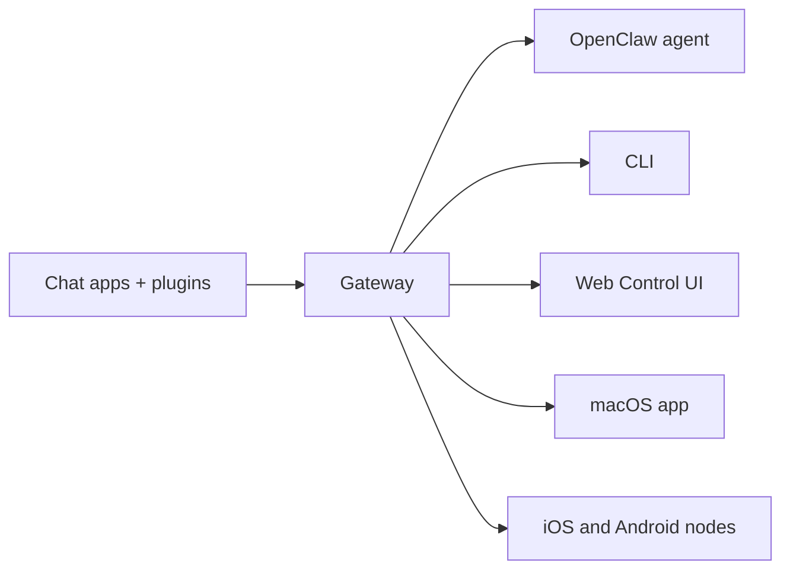

---
read_when:
    - แนะนำ OpenClaw ให้กับผู้เริ่มต้นใช้งาน
summary: OpenClaw เป็น Gateway แบบหลายช่องทางสำหรับเอเจนต์ AI ที่ทำงานได้บนทุก OS
title: OpenClaw
x-i18n:
    generated_at: "2026-06-27T17:42:50Z"
    model: gpt-5.5
    postprocess_version: locale-links-v1
    provider: openai
    source_hash: fcaa54a0a6d7aa62193fd9f03428bbcbfdcb2c00a184bcd6f49e4e093fefc473
    source_path: index.md
    workflow: 16
---

# OpenClaw 🦞

<p align="center">
    
    
</p>

> _"ขัดเปลือก! ขัดเปลือก!"_ — ล็อบสเตอร์อวกาศตัวหนึ่ง อาจจะนะ

<p align="center">
  <strong>Gateway สำหรับ AI agent บนทุก OS ครอบคลุม Discord, Google Chat, iMessage, Matrix, Microsoft Teams, Signal, Slack, Telegram, WhatsApp, Zalo และอื่นๆ</strong><br />
  ส่งข้อความ แล้วรับคำตอบจาก agent ได้จากกระเป๋าของคุณ รัน Gateway เดียวกับช่องทางในตัว, Plugin ช่องทางที่มาพร้อมกัน, WebChat และโหนดมือถือ
</p>

<Columns>
  <Card title="เริ่มต้นใช้งาน" href="/th/start/getting-started" icon="rocket">
    ติดตั้ง OpenClaw แล้วเปิด Gateway ได้ในไม่กี่นาที
  </Card>
  <Card title="รันการเริ่มใช้งาน" href="/th/start/wizard" icon="sparkles">
    การตั้งค่าพร้อมคำแนะนำด้วย `openclaw onboard` และโฟลว์การจับคู่
  </Card>
  <Card title="เปิด Control UI" href="/th/web/control-ui" icon="layout-dashboard">
    เปิดแดชบอร์ดในเบราว์เซอร์สำหรับแชท การกำหนดค่า และเซสชัน
  </Card>
</Columns>

## OpenClaw คืออะไร?

OpenClaw คือ **Gateway แบบโฮสต์เอง** ที่เชื่อมต่อแอปแชทและพื้นผิวช่องทางที่คุณชื่นชอบ — ช่องทางในตัว รวมถึง Plugin ช่องทางที่มาพร้อมกันหรือภายนอก เช่น Discord, Google Chat, iMessage, Matrix, Microsoft Teams, Signal, Slack, Telegram, WhatsApp, Zalo และอื่นๆ — เข้ากับ AI coding agent คุณรันกระบวนการ Gateway เดียวบนเครื่องของคุณเอง (หรือเซิร์ฟเวอร์) แล้วมันจะกลายเป็นสะพานเชื่อมระหว่างแอปส่งข้อความของคุณกับผู้ช่วย AI ที่พร้อมใช้งานเสมอ

**เหมาะกับใคร?** นักพัฒนาและผู้ใช้ขั้นสูงที่ต้องการผู้ช่วย AI ส่วนตัวซึ่งส่งข้อความหาได้จากทุกที่ — โดยไม่ต้องสละการควบคุมข้อมูลของตนเองหรือพึ่งพาบริการแบบโฮสต์

**อะไรทำให้แตกต่าง?**

- **โฮสต์เอง**: รันบนฮาร์ดแวร์ของคุณ กติกาของคุณ
- **หลายช่องทาง**: Gateway เดียวให้บริการช่องทางในตัว รวมถึง Plugin ช่องทางที่มาพร้อมกันหรือภายนอกพร้อมกัน
- **ออกแบบมาสำหรับ agent**: สร้างมาเพื่อ coding agent ที่มีการใช้เครื่องมือ เซสชัน หน่วยความจำ และการกำหนดเส้นทางหลาย agent
- **โอเพนซอร์ส**: ใบอนุญาต MIT ขับเคลื่อนโดยชุมชน

**ต้องใช้อะไรบ้าง?** Node 24 (แนะนำ) หรือ Node 22 LTS (`22.19+`) เพื่อความเข้ากันได้, API key จากผู้ให้บริการที่คุณเลือก และเวลา 5 นาที เพื่อคุณภาพและความปลอดภัยที่ดีที่สุด ให้ใช้โมเดลรุ่นล่าสุดที่แข็งแกร่งที่สุดที่มีให้ใช้งาน

## ทำงานอย่างไร



Gateway เป็นแหล่งความจริงเดียวสำหรับเซสชัน การกำหนดเส้นทาง และการเชื่อมต่อช่องทาง

## ความสามารถหลัก

<Columns>
  <Card title="Gateway หลายช่องทาง" icon="network" href="/th/channels">
    Discord, iMessage, Signal, Slack, Telegram, WhatsApp, WebChat และอื่นๆ ด้วยกระบวนการ Gateway เดียว
  </Card>
  <Card title="ช่องทาง Plugin" icon="plug" href="/th/tools/plugin">
    Plugin ที่มาพร้อมกันเพิ่ม Matrix, Nostr, Twitch, Zalo และอื่นๆ ในรีลีสปัจจุบันตามปกติ
  </Card>
  <Card title="การกำหนดเส้นทางหลาย agent" icon="route" href="/th/concepts/multi-agent">
    เซสชันแยกกันต่อ agent, เวิร์กสเปซ หรือผู้ส่ง
  </Card>
  <Card title="รองรับสื่อ" icon="image" href="/th/nodes/images">
    ส่งและรับรูปภาพ เสียง และเอกสาร
  </Card>
  <Card title="Web Control UI" icon="monitor" href="/th/web/control-ui">
    แดชบอร์ดในเบราว์เซอร์สำหรับแชท การกำหนดค่า เซสชัน และโหนด
  </Card>
  <Card title="โหนดมือถือ" icon="smartphone" href="/th/nodes">
    จับคู่โหนด iOS และ Android สำหรับเวิร์กโฟลว์ที่รองรับ Canvas, กล้อง และเสียง
  </Card>
</Columns>

## เริ่มต้นอย่างรวดเร็ว

<Steps>
  <Step title="ติดตั้ง OpenClaw">
    ```bash
    npm install -g openclaw@latest
    ```
  </Step>
  <Step title="เริ่มใช้งานและติดตั้งบริการ">
    ```bash
    openclaw onboard --install-daemon
    ```
  </Step>
  <Step title="แชท">
    เปิด Control UI ในเบราว์เซอร์ของคุณ แล้วส่งข้อความ:

    ```bash
    openclaw dashboard
    ```

    หรือเชื่อมต่อช่องทาง ([Telegram](/th/channels/telegram) เร็วที่สุด) แล้วแชทจากโทรศัพท์ของคุณ

  </Step>
</Steps>

ต้องการการติดตั้งแบบเต็มและการตั้งค่าสำหรับพัฒนาหรือไม่? ดู [เริ่มต้นใช้งาน](/th/start/getting-started)

## แดชบอร์ด

เปิด Control UI ในเบราว์เซอร์หลังจาก Gateway เริ่มทำงาน

- ค่าเริ่มต้นในเครื่อง: [http://127.0.0.1:18789/](http://127.0.0.1:18789/)
- การเข้าถึงระยะไกล: [พื้นผิวเว็บ](/th/web) และ [Tailscale](/th/gateway/tailscale)

<p align="center">
  
</p>

## การกำหนดค่า (ไม่บังคับ)

การกำหนดค่าอยู่ที่ `~/.openclaw/openclaw.json`

- หากคุณ **ไม่ทำอะไรเลย** OpenClaw จะใช้รันไทม์ OpenClaw agent ที่มาพร้อมกันพร้อมเซสชันแยกตามผู้ส่ง
- หากคุณต้องการล็อกให้เข้มงวด ให้เริ่มด้วย `channels.whatsapp.allowFrom` และกฎการกล่าวถึง (สำหรับกลุ่ม)

ตัวอย่าง:

```json5
{
  channels: {
    whatsapp: {
      allowFrom: ["+15555550123"],
      groups: { "*": { requireMention: true } },
    },
  },
  messages: { groupChat: { mentionPatterns: ["@openclaw"] } },
}
```

## เริ่มที่นี่

<Columns>
  <Card title="ศูนย์รวมเอกสาร" href="/th/start/hubs" icon="book-open">
    เอกสารและคู่มือทั้งหมด จัดตามกรณีการใช้งาน
  </Card>
  <Card title="การกำหนดค่า" href="/th/gateway/configuration" icon="settings">
    การตั้งค่า Gateway หลัก โทเคน และการกำหนดค่าผู้ให้บริการ
  </Card>
  <Card title="การเข้าถึงระยะไกล" href="/th/gateway/remote" icon="globe">
    รูปแบบการเข้าถึง SSH และ tailnet
  </Card>
  <Card title="ช่องทาง" href="/th/channels/telegram" icon="message-square">
    การตั้งค่าเฉพาะช่องทางสำหรับ Feishu, Microsoft Teams, WhatsApp, Telegram, Discord และอื่นๆ
  </Card>
  <Card title="โหนด" href="/th/nodes" icon="smartphone">
    โหนด iOS และ Android พร้อมการจับคู่ Canvas กล้อง และการทำงานของอุปกรณ์
  </Card>
  <Card title="ความช่วยเหลือ" href="/th/help" icon="life-buoy">
    จุดเริ่มต้นสำหรับวิธีแก้ไขทั่วไปและการแก้ไขปัญหา
  </Card>
</Columns>

## เรียนรู้เพิ่มเติม

<Columns>
  <Card title="รายการฟีเจอร์ทั้งหมด" href="/th/concepts/features" icon="list">
    ความสามารถทั้งหมดด้านช่องทาง การกำหนดเส้นทาง และสื่อ
  </Card>
  <Card title="การกำหนดเส้นทางหลาย agent" href="/th/concepts/multi-agent" icon="route">
    การแยกเวิร์กสเปซและเซสชันราย agent
  </Card>
  <Card title="ความปลอดภัย" href="/th/gateway/security" icon="shield">
    โทเคน รายการอนุญาต และการควบคุมความปลอดภัย
  </Card>
  <Card title="การแก้ไขปัญหา" href="/th/gateway/troubleshooting" icon="wrench">
    การวินิจฉัย Gateway และข้อผิดพลาดทั่วไป
  </Card>
  <Card title="เกี่ยวกับและเครดิต" href="/th/reference/credits" icon="info">
    จุดกำเนิดของโปรเจกต์ ผู้มีส่วนร่วม และใบอนุญาต
  </Card>
</Columns>
