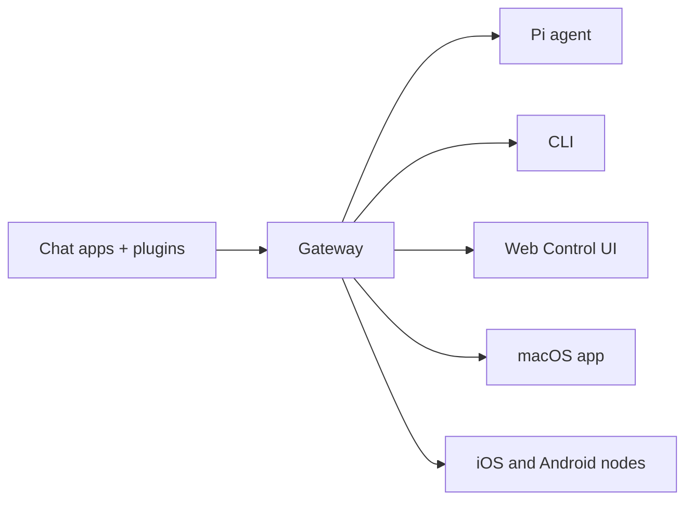

---
read_when:
    - แนะนำ OpenClaw ให้ผู้ใช้ใหม่รู้จัก
summary: OpenClaw เป็น Gateway แบบหลายช่องทางสำหรับเอเจนต์ AI ที่ทำงานได้บนทุกระบบปฏิบัติการ
title: OpenClaw
x-i18n:
    generated_at: "2026-05-07T13:20:38Z"
    model: gpt-5.5
    provider: openai
    source_hash: 7bf82c8551703257e55289d2b82f6436c9900a8afae7ab9b6a655332716ff37b
    source_path: index.md
    workflow: 16
---

# OpenClaw 🦞

<p align="center">
    
    
</p>

> _"ลอกคราบ! ลอกคราบ!"_ — ลอบสเตอร์อวกาศตัวหนึ่ง อาจจะ

<p align="center">
  <strong>Gateway บนระบบปฏิบัติการใดก็ได้สำหรับ AI agents บน Discord, Google Chat, iMessage, Matrix, Microsoft Teams, Signal, Slack, Telegram, WhatsApp, Zalo และอื่นๆ</strong><br />
  ส่งข้อความ แล้วรับคำตอบจาก agent ได้จากในกระเป๋าของคุณ รัน Gateway หนึ่งตัวบนแชนเนลในตัว, channel plugins ที่รวมมาให้, WebChat และโหนดมือถือ
</p>

<Columns>
  <Card title="เริ่มต้นใช้งาน" href="/th/start/getting-started" icon="rocket">
    ติดตั้ง OpenClaw และเปิดใช้งาน Gateway ได้ในไม่กี่นาที
  </Card>
  <Card title="รันการเริ่มต้นใช้งาน" href="/th/start/wizard" icon="sparkles">
    การตั้งค่าแบบมีคำแนะนำด้วย `openclaw onboard` และขั้นตอนการจับคู่
  </Card>
  <Card title="เปิด Control UI" href="/th/web/control-ui" icon="layout-dashboard">
    เปิดแดชบอร์ดในเบราว์เซอร์สำหรับแชต การกำหนดค่า และเซสชัน
  </Card>
</Columns>

## OpenClaw คืออะไร?

OpenClaw คือ **gateway แบบโฮสต์เอง** ที่เชื่อมต่อแอปแชตและพื้นผิวแชนเนลที่คุณชื่นชอบ — แชนเนลในตัว รวมถึง channel plugins ที่รวมมาให้หรือจากภายนอก เช่น Discord, Google Chat, iMessage, Matrix, Microsoft Teams, Signal, Slack, Telegram, WhatsApp, Zalo และอื่นๆ — เข้ากับ AI coding agents อย่าง Pi คุณรันกระบวนการ Gateway เพียงตัวเดียวบนเครื่องของคุณเอง (หรือบนเซิร์ฟเวอร์) แล้วมันจะกลายเป็นสะพานเชื่อมระหว่างแอปส่งข้อความของคุณกับผู้ช่วย AI ที่พร้อมใช้งานเสมอ

**เหมาะกับใคร?** นักพัฒนาและผู้ใช้ขั้นสูงที่ต้องการผู้ช่วย AI ส่วนตัวซึ่งส่งข้อความถึงได้จากทุกที่ โดยไม่ต้องสละการควบคุมข้อมูลของตนหรือพึ่งพาบริการแบบโฮสต์

**อะไรที่ทำให้แตกต่าง?**

- **โฮสต์เอง**: รันบนฮาร์ดแวร์ของคุณ ตามกฎของคุณ
- **หลายแชนเนล**: Gateway หนึ่งตัวให้บริการแชนเนลในตัว รวมถึง channel plugins ที่รวมมาให้หรือจากภายนอกได้พร้อมกัน
- **ออกแบบมาสำหรับ agent**: สร้างมาสำหรับ coding agents ที่มีการใช้เครื่องมือ เซสชัน หน่วยความจำ และการกำหนดเส้นทางหลาย agent
- **โอเพนซอร์ส**: ใช้สัญญาอนุญาต MIT และขับเคลื่อนโดยชุมชน

**คุณต้องมีอะไรบ้าง?** Node 24 (แนะนำ) หรือ Node 22 LTS (`22.16+`) เพื่อความเข้ากันได้, API key จากผู้ให้บริการที่คุณเลือก และเวลา 5 นาที เพื่อคุณภาพและความปลอดภัยที่ดีที่สุด ให้ใช้โมเดลรุ่นล่าสุดที่แข็งแกร่งที่สุดที่มี

## วิธีการทำงาน



Gateway คือแหล่งข้อมูลจริงเพียงหนึ่งเดียวสำหรับเซสชัน การกำหนดเส้นทาง และการเชื่อมต่อแชนเนล

## ความสามารถหลัก

<Columns>
  <Card title="Gateway หลายแชนเนล" icon="network" href="/th/channels">
    Discord, iMessage, Signal, Slack, Telegram, WhatsApp, WebChat และอื่นๆ ด้วยกระบวนการ Gateway เพียงตัวเดียว
  </Card>
  <Card title="แชนเนล Plugin" icon="plug" href="/th/tools/plugin">
    Plugins ที่รวมมาให้เพิ่ม Matrix, Nostr, Twitch, Zalo และอื่นๆ ในรุ่นปัจจุบันปกติ
  </Card>
  <Card title="การกำหนดเส้นทางหลาย agent" icon="route" href="/th/concepts/multi-agent">
    เซสชันที่แยกกันตาม agent, พื้นที่ทำงาน หรือผู้ส่ง
  </Card>
  <Card title="การรองรับสื่อ" icon="image" href="/th/nodes/images">
    ส่งและรับรูปภาพ เสียง และเอกสาร
  </Card>
  <Card title="Web Control UI" icon="monitor" href="/th/web/control-ui">
    แดชบอร์ดในเบราว์เซอร์สำหรับแชต การกำหนดค่า เซสชัน และโหนด
  </Card>
  <Card title="โหนดมือถือ" icon="smartphone" href="/th/nodes">
    จับคู่โหนด iOS และ Android สำหรับเวิร์กโฟลว์ที่รองรับ Canvas, กล้อง และเสียง
  </Card>
</Columns>

## เริ่มต้นอย่างรวดเร็ว

<Steps>
  <Step title="ติดตั้ง OpenClaw">
    ```bash
    npm install -g openclaw@latest
    ```
  </Step>
  <Step title="เริ่มต้นใช้งานและติดตั้งบริการ">
    ```bash
    openclaw onboard --install-daemon
    ```
  </Step>
  <Step title="แชต">
    เปิด Control UI ในเบราว์เซอร์ของคุณและส่งข้อความ:

    ```bash
    openclaw dashboard
    ```

    หรือเชื่อมต่อแชนเนล ([Telegram](/th/channels/telegram) เร็วที่สุด) แล้วแชตจากโทรศัพท์ของคุณ

  </Step>
</Steps>

ต้องการการติดตั้งและการตั้งค่าสำหรับพัฒนาแบบครบถ้วนใช่ไหม? ดู [เริ่มต้นใช้งาน](/th/start/getting-started)

## แดชบอร์ด

เปิด Control UI ในเบราว์เซอร์หลังจาก Gateway เริ่มทำงาน

- ค่าเริ่มต้นในเครื่อง: [http://127.0.0.1:18789/](http://127.0.0.1:18789/)
- การเข้าถึงจากระยะไกล: [พื้นผิวเว็บ](/th/web) และ [Tailscale](/th/gateway/tailscale)

<p align="center">
  
</p>

## การกำหนดค่า (ไม่บังคับ)

การกำหนดค่าอยู่ที่ `~/.openclaw/openclaw.json`

- หากคุณ **ไม่ทำอะไรเลย** OpenClaw จะใช้ไบนารี Pi ที่รวมมาให้ในโหมด RPC พร้อมเซสชันแยกตามผู้ส่ง
- หากคุณต้องการจำกัดการใช้งาน ให้เริ่มจาก `channels.whatsapp.allowFrom` และกฎการกล่าวถึง (สำหรับกลุ่ม)

ตัวอย่าง:

```json5
{
  channels: {
    whatsapp: {
      allowFrom: ["+15555550123"],
      groups: { "*": { requireMention: true } },
    },
  },
  messages: { groupChat: { mentionPatterns: ["@openclaw"] } },
}
```

## เริ่มที่นี่

<Columns>
  <Card title="ศูนย์รวมเอกสาร" href="/th/start/hubs" icon="book-open">
    เอกสารและคู่มือทั้งหมด จัดตามกรณีการใช้งาน
  </Card>
  <Card title="การกำหนดค่า" href="/th/gateway/configuration" icon="settings">
    การตั้งค่า Gateway หลัก โทเค็น และการกำหนดค่าผู้ให้บริการ
  </Card>
  <Card title="การเข้าถึงจากระยะไกล" href="/th/gateway/remote" icon="globe">
    รูปแบบการเข้าถึงผ่าน SSH และ tailnet
  </Card>
  <Card title="แชนเนล" href="/th/channels/telegram" icon="message-square">
    การตั้งค่าเฉพาะแชนเนลสำหรับ Feishu, Microsoft Teams, WhatsApp, Telegram, Discord และอื่นๆ
  </Card>
  <Card title="โหนด" href="/th/nodes" icon="smartphone">
    โหนด iOS และ Android พร้อมการจับคู่, Canvas, กล้อง และการทำงานของอุปกรณ์
  </Card>
  <Card title="ความช่วยเหลือ" href="/th/help" icon="life-buoy">
    จุดเริ่มต้นสำหรับการแก้ไขปัญหาทั่วไปและการแก้ไขข้อขัดข้อง
  </Card>
</Columns>

## เรียนรู้เพิ่มเติม

<Columns>
  <Card title="รายการฟีเจอร์ทั้งหมด" href="/th/concepts/features" icon="list">
    ความสามารถของแชนเนล การกำหนดเส้นทาง และสื่ออย่างครบถ้วน
  </Card>
  <Card title="การกำหนดเส้นทางหลาย agent" href="/th/concepts/multi-agent" icon="route">
    การแยกพื้นที่ทำงานและเซสชันตาม agent
  </Card>
  <Card title="ความปลอดภัย" href="/th/gateway/security" icon="shield">
    โทเค็น รายการอนุญาต และการควบคุมความปลอดภัย
  </Card>
  <Card title="การแก้ไขปัญหา" href="/th/gateway/troubleshooting" icon="wrench">
    การวินิจฉัย Gateway และข้อผิดพลาดทั่วไป
  </Card>
  <Card title="เกี่ยวกับและเครดิต" href="/th/reference/credits" icon="info">
    จุดกำเนิดโครงการ ผู้มีส่วนร่วม และสัญญาอนุญาต
  </Card>
</Columns>
