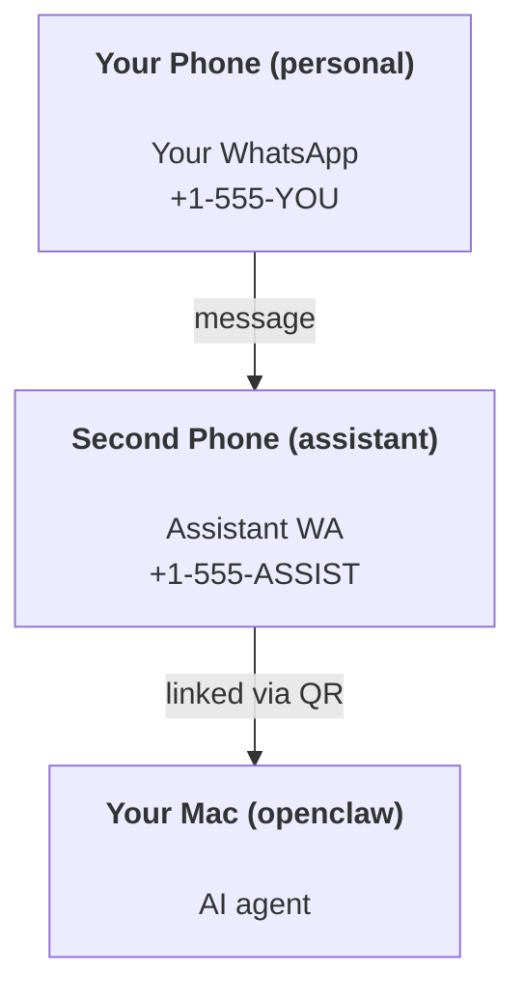

---
read_when:
    - การเริ่มต้นใช้งานอินสแตนซ์ผู้ช่วยใหม่
    - กำลังทบทวนผลกระทบด้านความปลอดภัย/สิทธิ์
summary: คู่มือแบบครบวงจรสำหรับการใช้งาน OpenClaw ในฐานะผู้ช่วยส่วนตัวพร้อมข้อควรระวังด้านความปลอดภัย
title: การตั้งค่าผู้ช่วยส่วนตัว
x-i18n:
    generated_at: "2026-06-27T18:24:13Z"
    model: gpt-5.5
    postprocess_version: locale-links-v1
    provider: openai
    source_hash: b0cd640872a2a60fd88d2dc3df6d038ef8574163430d8683ef9b67921b0c87f4
    source_path: start/openclaw.md
    workflow: 16
---

OpenClaw เป็น Gateway แบบโฮสต์เองที่เชื่อมต่อ Discord, Google Chat, iMessage, Matrix, Microsoft Teams, Signal, Slack, Telegram, WhatsApp, Zalo และอื่น ๆ เข้ากับเอเจนต์ AI คู่มือนี้ครอบคลุมการตั้งค่าแบบ "ผู้ช่วยส่วนตัว": หมายเลข WhatsApp เฉพาะที่ทำงานเหมือนผู้ช่วย AI ที่พร้อมใช้งานตลอดเวลา

## ⚠️ ความปลอดภัยมาก่อน

คุณกำลังวางเอเจนต์ไว้ในตำแหน่งที่สามารถ:

- รันคำสั่งบนเครื่องของคุณ (ขึ้นอยู่กับนโยบายเครื่องมือของคุณ)
- อ่าน/เขียนไฟล์ในเวิร์กสเปซของคุณ
- ส่งข้อความกลับออกไปผ่าน WhatsApp/Telegram/Discord/Mattermost และช่องทางที่บันเดิลมาอื่น ๆ

เริ่มแบบรัดกุมไว้ก่อน:

- ตั้งค่า `channels.whatsapp.allowFrom` เสมอ (อย่าเปิดให้ทั้งโลกเข้าถึงบน Mac ส่วนตัวของคุณ)
- ใช้หมายเลข WhatsApp เฉพาะสำหรับผู้ช่วย
- Heartbeats ตอนนี้มีค่าเริ่มต้นเป็นทุก 30 นาที ปิดไว้จนกว่าคุณจะเชื่อถือการตั้งค่านี้โดยตั้งค่า `agents.defaults.heartbeat.every: "0m"`

## ข้อกำหนดเบื้องต้น

- ติดตั้งและทำ onboarding OpenClaw แล้ว - ดู [เริ่มต้นใช้งาน](/th/start/getting-started) หากคุณยังไม่ได้ทำ
- หมายเลขโทรศัพท์ที่สอง (SIM/eSIM/เติมเงิน) สำหรับผู้ช่วย

## การตั้งค่าแบบสองโทรศัพท์ (แนะนำ)

สิ่งที่คุณต้องการคือแบบนี้:



หากคุณลิงก์ WhatsApp ส่วนตัวของคุณเข้ากับ OpenClaw ทุกข้อความที่ส่งถึงคุณจะกลายเป็น "อินพุตของเอเจนต์" ซึ่งแทบจะไม่ใช่สิ่งที่คุณต้องการ

## เริ่มต้นอย่างรวดเร็วใน 5 นาที

1. จับคู่ WhatsApp Web (แสดง QR; สแกนด้วยโทรศัพท์ของผู้ช่วย):

```bash
openclaw channels login
```

2. เริ่ม Gateway (ปล่อยให้รันต่อไป):

```bash
openclaw gateway --port 18789
```

3. ใส่คอนฟิกขั้นต่ำใน `~/.openclaw/openclaw.json`:

```json5
{
  gateway: { mode: "local" },
  channels: { whatsapp: { allowFrom: ["+15555550123"] } },
}
```

ตอนนี้ส่งข้อความไปยังหมายเลขผู้ช่วยจากโทรศัพท์ที่อยู่ในรายการอนุญาตของคุณ

เมื่อ onboarding เสร็จ OpenClaw จะเปิดแดชบอร์ดอัตโนมัติและพิมพ์ลิงก์ที่สะอาด (ไม่มีโทเค็น) หากแดชบอร์ดขอการยืนยันตัวตน ให้วาง shared secret ที่กำหนดค่าไว้ในส่วนการตั้งค่า Control UI โดยค่าเริ่มต้น onboarding จะใช้โทเค็น (`gateway.auth.token`) แต่การยืนยันตัวตนด้วยรหัสผ่านก็ใช้ได้เช่นกันหากคุณเปลี่ยน `gateway.auth.mode` เป็น `password` หากต้องการเปิดใหม่ภายหลัง: `openclaw dashboard`

## ให้เวิร์กสเปซแก่เอเจนต์ (AGENTS)

OpenClaw อ่านคำสั่งการทำงานและ "หน่วยความจำ" จากไดเรกทอรีเวิร์กสเปซของมัน

โดยค่าเริ่มต้น OpenClaw ใช้ `~/.openclaw/workspace` เป็นเวิร์กสเปซของเอเจนต์ และจะสร้างให้โดยอัตโนมัติ (พร้อม `AGENTS.md`, `SOUL.md`, `TOOLS.md`, `IDENTITY.md`, `USER.md`, `HEARTBEAT.md` เริ่มต้น) ระหว่างการตั้งค่า/การรันเอเจนต์ครั้งแรก `BOOTSTRAP.md` จะถูกสร้างเฉพาะเมื่อเวิร์กสเปซใหม่เอี่ยมเท่านั้น (ไม่ควรกลับมาหลังจากคุณลบไปแล้ว) `MEMORY.md` เป็นทางเลือก (ไม่ได้สร้างอัตโนมัติ); เมื่อมีไฟล์นี้ จะถูกโหลดสำหรับเซสชันปกติ เซสชัน subagent จะ inject เฉพาะ `AGENTS.md` และ `TOOLS.md`

<Tip>
ปฏิบัติกับโฟลเดอร์นี้เหมือนหน่วยความจำของ OpenClaw และทำให้เป็น repo git (ควรเป็น private) เพื่อให้ `AGENTS.md` และไฟล์หน่วยความจำของคุณได้รับการสำรองข้อมูล หากติดตั้ง git ไว้ เวิร์กสเปซใหม่เอี่ยมจะถูก initialize โดยอัตโนมัติ
</Tip>

```bash
openclaw setup
```

เลย์เอาต์เวิร์กสเปซแบบเต็ม + คู่มือการสำรองข้อมูล: [เวิร์กสเปซเอเจนต์](/th/concepts/agent-workspace)
เวิร์กโฟลว์หน่วยความจำ: [หน่วยความจำ](/th/concepts/memory)

ทางเลือก: เลือกเวิร์กสเปซอื่นด้วย `agents.defaults.workspace` (รองรับ `~`)

```json5
{
  agents: {
    defaults: {
      workspace: "~/.openclaw/workspace",
    },
  },
}
```

หากคุณจัดส่งไฟล์เวิร์กสเปซของคุณเองจาก repo อยู่แล้ว คุณสามารถปิดการสร้างไฟล์ bootstrap ทั้งหมดได้:

```json5
{
  agents: {
    defaults: {
      skipBootstrap: true,
    },
  },
}
```

## คอนฟิกที่เปลี่ยนมันให้เป็น "ผู้ช่วย"

OpenClaw มีค่าเริ่มต้นเป็นการตั้งค่าผู้ช่วยที่ดีอยู่แล้ว แต่โดยปกติคุณจะต้องปรับ:

- บุคลิก/คำสั่งใน [`SOUL.md`](/th/concepts/soul)
- ค่าเริ่มต้นการคิด (หากต้องการ)
- heartbeats (เมื่อคุณเชื่อถือมันแล้ว)

ตัวอย่าง:

```json5
{
  logging: { level: "info" },
  agents: {
    defaults: {
      model: { primary: "anthropic/claude-opus-4-6" },
      workspace: "~/.openclaw/workspace",
      thinkingDefault: "high",
      timeoutSeconds: 1800,
      // Start with 0; enable later.
      heartbeat: { every: "0m" },
    },
    list: [
      {
        id: "main",
        default: true,
        groupChat: {
          mentionPatterns: ["@openclaw", "openclaw"],
        },
      },
    ],
  },
  channels: {
    whatsapp: {
      allowFrom: ["+15555550123"],
      groups: {
        "*": { requireMention: true },
      },
    },
  },
  session: {
    scope: "per-sender",
    resetTriggers: ["/new", "/reset"],
    reset: {
      mode: "daily",
      atHour: 4,
      idleMinutes: 10080,
    },
  },
}
```

## เซสชันและหน่วยความจำ

- ไฟล์เซสชัน: `~/.openclaw/agents/<agentId>/sessions/{{SessionId}}.jsonl`
- เมทาดาทาเซสชัน (การใช้โทเค็น, เส้นทางล่าสุด ฯลฯ): `~/.openclaw/agents/<agentId>/sessions/sessions.json` (legacy: `~/.openclaw/sessions/sessions.json`)
- `/new` หรือ `/reset` เริ่มเซสชันใหม่สำหรับแชตนั้น (กำหนดค่าได้ผ่าน `resetTriggers`) หากส่งมาเพียงอย่างเดียว OpenClaw จะรับทราบการรีเซ็ตโดยไม่เรียกใช้โมเดล
- `/compact [instructions]` ทำ Compaction บริบทเซสชันและรายงานงบประมาณบริบทที่เหลือ

## Heartbeats (โหมดเชิงรุก)

โดยค่าเริ่มต้น OpenClaw จะรัน Heartbeat ทุก 30 นาทีด้วยพรอมป์:
`Read HEARTBEAT.md if it exists (workspace context). Follow it strictly. Do not infer or repeat old tasks from prior chats. If nothing needs attention, reply HEARTBEAT_OK.`
ตั้งค่า `agents.defaults.heartbeat.every: "0m"` เพื่อปิดใช้งาน

- หากมี `HEARTBEAT.md` แต่โดยผลลัพธ์แล้วว่างเปล่า (มีเฉพาะบรรทัดว่าง, คอมเมนต์ Markdown/HTML, หัวข้อ Markdown เช่น `# Heading`, fence markers หรือ checklist stubs ว่าง) OpenClaw จะข้ามการรัน Heartbeat เพื่อประหยัดการเรียก API
- หากไม่มีไฟล์ Heartbeat จะยังรันอยู่และโมเดลจะตัดสินใจว่าจะทำอะไร
- หากเอเจนต์ตอบด้วย `HEARTBEAT_OK` (อาจมี padding สั้น ๆ; ดู `agents.defaults.heartbeat.ackMaxChars`) OpenClaw จะระงับการส่งออกสำหรับ Heartbeat นั้น
- โดยค่าเริ่มต้น อนุญาตให้ส่ง Heartbeat ไปยังเป้าหมายแบบ DM-style `user:<id>` ได้ ตั้งค่า `agents.defaults.heartbeat.directPolicy: "block"` เพื่อระงับการส่งไปยังเป้าหมายโดยตรงในขณะที่ยังคงให้การรัน Heartbeat ทำงานอยู่
- Heartbeats รันเทิร์นเอเจนต์เต็มรูปแบบ - ช่วงเวลาที่สั้นลงจะใช้โทเค็นมากขึ้น

```json5
{
  agents: {
    defaults: {
      heartbeat: { every: "30m" },
    },
  },
}
```

## สื่อเข้าและออก

ไฟล์แนบขาเข้า (รูปภาพ/เสียง/เอกสาร) สามารถส่งต่อไปยังคำสั่งของคุณผ่านเทมเพลต:

- `{{MediaPath}}` (พาธไฟล์ชั่วคราวในเครื่อง)
- `{{MediaUrl}}` (pseudo-URL)
- `{{Transcript}}` (หากเปิดใช้การถอดเสียง)

ไฟล์แนบขาออกจากเอเจนต์ใช้ฟิลด์สื่อแบบมีโครงสร้างบนเครื่องมือข้อความหรือ payload การตอบกลับ เช่น `media`, `mediaUrl`, `mediaUrls`, `path` หรือ `filePath` ตัวอย่างอาร์กิวเมนต์ message-tool:

```json
{
  "message": "Here's the screenshot.",
  "mediaUrl": "https://example.com/screenshot.png"
}
```

OpenClaw ส่งสื่อแบบมีโครงสร้างควบคู่ไปกับข้อความ การตอบกลับสุดท้ายแบบ legacy ของผู้ช่วยอาจยังถูก normalize เพื่อความเข้ากันได้ แต่ผลลัพธ์จากเครื่องมือ, ผลลัพธ์เบราว์เซอร์, บล็อกสตรีมมิง และแอ็กชันข้อความจะไม่แยกวิเคราะห์ข้อความเป็นคำสั่งไฟล์แนบ

พฤติกรรมพาธในเครื่องใช้โมเดลความเชื่อถือในการอ่านไฟล์เดียวกับเอเจนต์:

- หาก `tools.fs.workspaceOnly` เป็น `true` พาธสื่อขาออกในเครื่องจะยังจำกัดอยู่ที่ temp root ของ OpenClaw, media cache, พาธเวิร์กสเปซเอเจนต์ และไฟล์ที่ sandbox สร้างขึ้น
- หาก `tools.fs.workspaceOnly` เป็น `false` สื่อขาออกในเครื่องสามารถใช้ไฟล์ host-local ที่เอเจนต์ได้รับอนุญาตให้อ่านอยู่แล้ว
- พาธในเครื่องสามารถเป็นพาธแบบ absolute, สัมพัทธ์กับเวิร์กสเปซ หรือสัมพัทธ์กับ home ด้วย `~/`
- การส่ง host-local ยังอนุญาตเฉพาะสื่อและชนิดเอกสารที่ปลอดภัยเท่านั้น (รูปภาพ, เสียง, วิดีโอ, PDF, เอกสาร Office และเอกสารข้อความที่ผ่านการตรวจสอบ เช่น Markdown/MD, TXT, JSON, YAML และ YML) นี่เป็นส่วนขยายของขอบเขตความเชื่อถือการอ่าน host ที่มีอยู่ ไม่ใช่ตัวสแกนความลับ: หากเอเจนต์อ่าน `secret.txt` หรือ `config.json` แบบ host-local ได้ มันก็สามารถแนบไฟล์นั้นได้เมื่อส่วนขยายและการตรวจสอบเนื้อหาตรงกัน

นั่นหมายความว่ารูปภาพ/ไฟล์ที่สร้างขึ้นนอกเวิร์กสเปซสามารถส่งได้แล้วเมื่อ fs policy ของคุณอนุญาตการอ่านเหล่านั้นอยู่แล้ว ขณะที่ส่วนขยายข้อความ host-local ใด ๆ ยังคงถูกบล็อก เก็บไฟล์อ่อนไหวไว้นอกระบบไฟล์ที่เอเจนต์อ่านได้ หรือคง `tools.fs.workspaceOnly=true` ไว้สำหรับการส่งพาธในเครื่องที่เข้มงวดขึ้น

## เช็กลิสต์การปฏิบัติการ

```bash
openclaw status          # local status (creds, sessions, queued events)
openclaw status --all    # full diagnosis (read-only, pasteable)
openclaw status --deep   # asks the gateway for a live health probe with channel probes when supported
openclaw health --json   # gateway health snapshot (WS; default can return a fresh cached snapshot)
```

ล็อกอยู่ภายใต้ `/tmp/openclaw/` (ค่าเริ่มต้น: `openclaw-YYYY-MM-DD.log`)

## ขั้นตอนถัดไป

- WebChat: [WebChat](/th/web/webchat)
- การดำเนินงาน Gateway: [runbook ของ Gateway](/th/gateway)
- Cron + การปลุก: [งาน Cron](/th/automation/cron-jobs)
- คู่หูแถบเมนู macOS: [แอป OpenClaw macOS](/th/platforms/macos)
- แอปโหนด iOS: [แอป iOS](/th/platforms/ios)
- แอปโหนด Android: [แอป Android](/th/platforms/android)
- Windows Hub: [Windows](/th/platforms/windows)
- สถานะ Linux: [แอป Linux](/th/platforms/linux)
- ความปลอดภัย: [ความปลอดภัย](/th/gateway/security)

## ที่เกี่ยวข้อง

- [เริ่มต้นใช้งาน](/th/start/getting-started)
- [การตั้งค่า](/th/start/setup)
- [ภาพรวมช่องทาง](/th/channels)
