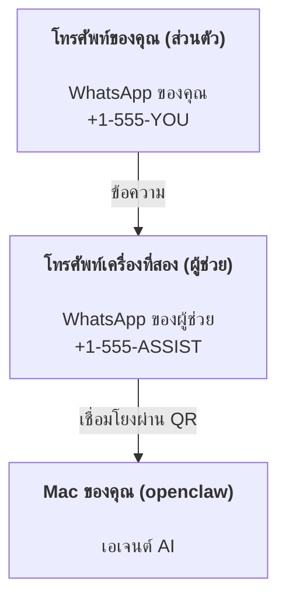

---
read_when:
    - การเริ่มต้นใช้งานอินสแตนซ์ผู้ช่วยใหม่
    - การตรวจสอบผลกระทบด้านความปลอดภัย/สิทธิ์อนุญาต
summary: คู่มือฉบับสมบูรณ์สำหรับใช้งาน OpenClaw เป็นผู้ช่วยส่วนตัว พร้อมข้อควรระวังด้านความปลอดภัย
title: การตั้งค่าผู้ช่วยส่วนตัว
x-i18n:
    generated_at: "2026-07-16T19:42:29Z"
    model: gpt-5.6
    postprocess_version: locale-links-v1
    prompt_version: 32
    provider: openai
    source_hash: e8c34e31314f55647059fd600935330110add27b338a675bc0ce1529bebb207d
    source_path: start/openclaw.md
    workflow: 16
---

OpenClaw คือ Gateway ที่โฮสต์ด้วยตนเอง ซึ่งเชื่อมต่อ Discord, Google Chat, iMessage, Matrix, Microsoft Teams, Signal, Slack, Telegram, WhatsApp, Zalo และบริการอื่นๆ เข้ากับเอเจนต์ AI คู่มือนี้ครอบคลุมการตั้งค่า "ผู้ช่วยส่วนตัว": หมายเลข WhatsApp เฉพาะที่ทำงานเสมือนผู้ช่วย AI ซึ่งพร้อมใช้งานตลอดเวลา

## ความปลอดภัยต้องมาก่อน

การให้เอเจนต์เข้าถึงช่องทางทำให้เอเจนต์สามารถเรียกใช้คำสั่งบนเครื่อง (ขึ้นอยู่กับนโยบายเครื่องมือของคุณ) อ่าน/เขียนไฟล์ในพื้นที่ทำงาน และส่งข้อความออกผ่านช่องทางใดๆ ที่เชื่อมต่ออยู่ เริ่มต้นอย่างรัดกุม:

- ตั้งค่า `channels.whatsapp.allowFrom` เสมอ (ห้ามเปิดให้ทุกคนบนอินเทอร์เน็ตเข้าถึงบน Mac ส่วนตัวของคุณ)
- ใช้หมายเลข WhatsApp เฉพาะสำหรับผู้ช่วย
- ค่าเริ่มต้นของ Heartbeat คือทุก 30 นาที ปิดใช้งานไว้จนกว่าคุณจะเชื่อถือการตั้งค่านี้ โดยตั้งค่า `agents.defaults.heartbeat.every: "0m"`

## ข้อกำหนดเบื้องต้น

- ติดตั้งและดำเนินการเริ่มต้นใช้งาน OpenClaw แล้ว - ดู [เริ่มต้นใช้งาน](/th/start/getting-started) หากคุณยังไม่ได้ดำเนินการ
- หมายเลขโทรศัพท์ที่สอง (SIM/eSIM/แบบเติมเงิน) สำหรับผู้ช่วย

## การตั้งค่าแบบสองโทรศัพท์ (แนะนำ)

รูปแบบที่ต้องการคือ:



หากคุณเชื่อมโยง WhatsApp ส่วนตัวกับ OpenClaw ทุกข้อความที่ส่งถึงคุณจะกลายเป็น "อินพุตของเอเจนต์" ซึ่งแทบไม่ใช่สิ่งที่คุณต้องการ

## เริ่มต้นอย่างรวดเร็วภายใน 5 นาที

1. จับคู่ WhatsApp Web (ระบบจะแสดง QR ให้สแกนด้วยโทรศัพท์ของผู้ช่วย):

```bash
openclaw channels login
```

2. เริ่ม Gateway (ปล่อยให้ทำงานต่อไป):

```bash
openclaw gateway --port 18789
```

3. ใส่การกำหนดค่าขั้นต่ำใน `~/.openclaw/openclaw.json`:

```json5
{
  gateway: { mode: "local" },
  channels: { whatsapp: { allowFrom: ["+15555550123"] } },
}
```

ตอนนี้ให้ส่งข้อความจากโทรศัพท์ที่อยู่ในรายการอนุญาตไปยังหมายเลขของผู้ช่วย

เมื่อการเริ่มต้นใช้งานเสร็จสิ้น OpenClaw จะเปิดแดชบอร์ดโดยอัตโนมัติและแสดงลิงก์แบบสะอาด (ไม่มีโทเค็น) หากแดชบอร์ดแจ้งให้ยืนยันตัวตน ให้วางข้อมูลลับที่ใช้ร่วมกันซึ่งกำหนดค่าไว้ในการตั้งค่า Control UI การเริ่มต้นใช้งานใช้โทเค็นเป็นค่าเริ่มต้น (`gateway.auth.token`) แต่การยืนยันตัวตนด้วยรหัสผ่านก็ใช้ได้เช่นกัน หากคุณเปลี่ยน `gateway.auth.mode` เป็น `password` หากต้องการเปิดอีกครั้งภายหลัง: `openclaw dashboard`

## กำหนดพื้นที่ทำงานให้เอเจนต์ (AGENTS)

OpenClaw อ่านคำแนะนำการทำงานและ "หน่วยความจำ" จากไดเรกทอรีพื้นที่ทำงาน

ตามค่าเริ่มต้น OpenClaw ใช้ `~/.openclaw/workspace` เป็นพื้นที่ทำงานของเอเจนต์ และสร้างพื้นที่นี้ (รวมถึงไฟล์เริ่มต้น `AGENTS.md`, `SOUL.md`, `TOOLS.md`, `IDENTITY.md`, `USER.md`, `HEARTBEAT.md`) โดยอัตโนมัติระหว่างการเริ่มต้นใช้งานหรือการเรียกใช้เอเจนต์ครั้งแรก `BOOTSTRAP.md` จะสร้างขึ้นเฉพาะสำหรับพื้นที่ทำงานใหม่เท่านั้น และไม่ควรกลับมาอีกหลังจากคุณลบออก `MEMORY.md` เป็นตัวเลือกเสริมและจะไม่สร้างขึ้นโดยอัตโนมัติ เมื่อมีไฟล์นี้ ระบบจะโหลดสำหรับเซสชันปกติ เซสชันของเอเจนต์ย่อยจะแทรกเฉพาะ `AGENTS.md` และ `TOOLS.md`

<Tip>
ให้ถือว่าโฟลเดอร์นี้เป็นหน่วยความจำของ OpenClaw และสร้างเป็นที่เก็บ git (ควรเป็นแบบส่วนตัว) เพื่อสำรองข้อมูล `AGENTS.md` และไฟล์หน่วยความจำของคุณ หากติดตั้ง git ไว้ พื้นที่ทำงานใหม่จะเริ่มต้นโดยอัตโนมัติพร้อม `git init`
</Tip>

หากต้องการสร้างโฟลเดอร์พื้นที่ทำงานและโฟลเดอร์การกำหนดค่าโดยไม่เรียกใช้ตัวช่วยเริ่มต้นใช้งานแบบเต็ม:

```bash
openclaw setup --baseline
```

(`openclaw setup` แบบไม่มีอาร์กิวเมนต์เป็นนามแฝงของ `openclaw onboard` และเรียกใช้ตัวช่วยแบบโต้ตอบเต็มรูปแบบ)

คู่มือโครงสร้างพื้นที่ทำงานทั้งหมดและการสำรองข้อมูล: [พื้นที่ทำงานของเอเจนต์](/th/concepts/agent-workspace)
ขั้นตอนการทำงานของหน่วยความจำ: [หน่วยความจำ](/th/concepts/memory)

ตัวเลือกเสริม: เลือกพื้นที่ทำงานอื่นด้วย `agents.defaults.workspace` (รองรับ `~`)

```json5
{
  agents: {
    defaults: {
      workspace: "~/.openclaw/workspace",
    },
  },
}
```

หากคุณจัดส่งไฟล์พื้นที่ทำงานของตนเองจากที่เก็บอยู่แล้ว คุณสามารถปิดการสร้างไฟล์เริ่มต้นทั้งหมดได้:

```json5
{
  agents: {
    defaults: {
      skipBootstrap: true,
    },
  },
}
```

## การกำหนดค่าที่ทำให้ระบบกลายเป็น "ผู้ช่วย"

ค่าเริ่มต้นของ OpenClaw เหมาะสำหรับการตั้งค่าเป็นผู้ช่วย แต่โดยทั่วไปคุณควรปรับแต่ง:

- บุคลิก/คำแนะนำใน [`SOUL.md`](/th/concepts/soul)
- ค่าเริ่มต้นของการคิด (หากต้องการ)
- Heartbeat (เมื่อคุณเชื่อถือระบบแล้ว)

ตัวอย่าง:

```json5
{
  logging: { level: "info" },
  agents: {
    defaults: {
      model: { primary: "anthropic/claude-opus-4-8" },
      workspace: "~/.openclaw/workspace",
      thinkingDefault: "high",
      timeoutSeconds: 1800,
      // เริ่มต้นด้วย 0 แล้วเปิดใช้ภายหลัง
      heartbeat: { every: "0m" },
    },
    list: [
      {
        id: "main",
        default: true,
        groupChat: {
          mentionPatterns: ["@openclaw", "openclaw"],
        },
      },
    ],
  },
  channels: {
    whatsapp: {
      allowFrom: ["+15555550123"],
      groups: {
        "*": { requireMention: true },
      },
    },
  },
  session: {
    scope: "per-sender",
    resetTriggers: ["/new", "/reset"],
    reset: {
      mode: "daily",
      atHour: 4,
      idleMinutes: 10080,
    },
  },
}
```

## เซสชันและหน่วยความจำ

- แถวเซสชัน แถวบันทึกบทสนทนา และข้อมูลเมตา (การใช้โทเค็น เส้นทางล่าสุด ฯลฯ): `~/.openclaw/agents/<agentId>/agent/openclaw-agent.sqlite`
- อาร์ติแฟกต์บันทึกบทสนทนาแบบเดิม/ที่เก็บถาวร: `~/.openclaw/agents/<agentId>/sessions/`
- แหล่งข้อมูลสำหรับย้ายแถวแบบเดิม: `~/.openclaw/agents/<agentId>/sessions/sessions.json`
- `/new` หรือ `/reset` จะเริ่มเซสชันใหม่สำหรับแชตนั้น (กำหนดค่าได้ผ่าน `session.resetTriggers`) หากส่งเพียงคำสั่งเดียว OpenClaw จะยืนยันการรีเซ็ตโดยไม่เรียกใช้โมเดล
- `/compact [instructions]` จะกระชับบริบทของเซสชันและรายงานงบประมาณบริบทที่เหลืออยู่

## Heartbeat (โหมดเชิงรุก)

ตามค่าเริ่มต้น OpenClaw จะเรียกใช้ Heartbeat ทุก 30 นาทีด้วยพรอมต์:
`Read HEARTBEAT.md if it exists (workspace context). Follow it strictly. Do not infer or repeat old tasks from prior chats. If nothing needs attention, reply HEARTBEAT_OK.`
ตั้งค่า `agents.defaults.heartbeat.every: "0m"` เพื่อปิดใช้งาน

- หากมี `HEARTBEAT.md` แต่ไฟล์นั้นว่างเปล่าโดยพฤตินัย (มีเฉพาะบรรทัดว่าง ความคิดเห็น Markdown/HTML หัวข้อ Markdown เช่น `# Heading` เครื่องหมายขอบเขตโค้ด หรือรายการตรวจสอบเปล่า) OpenClaw จะข้ามการเรียกใช้ Heartbeat เพื่อประหยัดการเรียก API
- หากไม่มีไฟล์ Heartbeat จะยังคงทำงานและโมเดลจะตัดสินใจว่าควรทำอะไร
- หากเอเจนต์ตอบกลับด้วย `HEARTBEAT_OK` (อาจมีข้อความเติมสั้นๆ โปรดดู `agents.defaults.heartbeat.ackMaxChars`) OpenClaw จะระงับการส่งข้อความออกสำหรับ Heartbeat นั้น
- ตามค่าเริ่มต้น อนุญาตให้ส่ง Heartbeat ไปยังเป้าหมาย `user:<id>` แบบข้อความส่วนตัว ตั้งค่า `agents.defaults.heartbeat.directPolicy: "block"` เพื่อระงับการส่งไปยังเป้าหมายโดยตรง แต่ยังคงให้ Heartbeat ทำงานอยู่
- Heartbeat จะเรียกใช้เอเจนต์ครบหนึ่งรอบ ช่วงเวลาที่สั้นลงจะใช้โทเค็นมากขึ้น

```json5
{
  agents: {
    defaults: {
      heartbeat: { every: "30m" },
    },
  },
}
```

## สื่อขาเข้าและขาออก

ไฟล์แนบขาเข้า (รูปภาพ/เสียง/เอกสาร) สามารถส่งต่อไปยังคำสั่งของคุณผ่านเทมเพลต:

- `{{MediaPath}}` (พาธไฟล์ชั่วคราวในเครื่อง)
- `{{MediaUrl}}` (URL จำลอง)
- `{{Transcript}}` (หากเปิดใช้การถอดเสียง)

ไฟล์แนบขาออกจากเอเจนต์ใช้ฟิลด์สื่อแบบมีโครงสร้างในเครื่องมือส่งข้อความหรือเพย์โหลดการตอบกลับ เช่น `media`, `mediaUrl`, `mediaUrls`, `path` หรือ `filePath` ตัวอย่างอาร์กิวเมนต์ของเครื่องมือส่งข้อความ:

```json
{
  "message": "นี่คือภาพหน้าจอ",
  "mediaUrl": "https://example.com/screenshot.png"
}
```

OpenClaw ส่งสื่อแบบมีโครงสร้างไปพร้อมกับข้อความ การตอบกลับสุดท้ายของผู้ช่วยในรูปแบบเดิมอาจยังถูกปรับให้เป็นรูปแบบมาตรฐานเพื่อความเข้ากันได้ แต่เอาต์พุตของเครื่องมือ เอาต์พุตของเบราว์เซอร์ บล็อกการสตรีม และการดำเนินการกับข้อความจะไม่แยกวิเคราะห์ข้อความเป็นคำสั่งไฟล์แนบ

ลักษณะการทำงานของพาธในเครื่องเป็นไปตามโมเดลความไว้วางใจในการอ่านไฟล์แบบเดียวกับเอเจนต์:

- หาก `tools.fs.workspaceOnly` เป็น `true` พาธสื่อขาออกในเครื่องจะยังถูกจำกัดไว้ที่รากของไฟล์ชั่วคราว OpenClaw แคชสื่อ พาธพื้นที่ทำงานของเอเจนต์ และไฟล์ที่สร้างโดยแซนด์บ็อกซ์
- หาก `tools.fs.workspaceOnly` เป็น `false` สื่อขาออกในเครื่องสามารถใช้ไฟล์ภายในโฮสต์ที่เอเจนต์ได้รับอนุญาตให้อ่านอยู่แล้ว
- พาธในเครื่องอาจเป็นพาธแบบสัมบูรณ์ พาธสัมพัทธ์กับพื้นที่ทำงาน หรือพาธสัมพัทธ์กับโฮมโดยใช้ `~/`
- การส่งไฟล์ภายในโฮสต์ยังอนุญาตเฉพาะสื่อและประเภทเอกสารที่ปลอดภัย (รูปภาพ เสียง วิดีโอ PDF เอกสาร Office และเอกสารข้อความที่ผ่านการตรวจสอบ เช่น Markdown/MD, TXT, JSON, YAML และ YML) นี่เป็นการขยายขอบเขตความไว้วางใจในการอ่านข้อมูลจากโฮสต์ที่มีอยู่ ไม่ใช่เครื่องมือตรวจหาข้อมูลลับ: หากเอเจนต์สามารถอ่าน `secret.txt` หรือ `config.json` ภายในโฮสต์ได้ เอเจนต์ก็สามารถแนบไฟล์นั้นได้เมื่อส่วนขยายและการตรวจสอบเนื้อหาตรงตามข้อกำหนด

เก็บไฟล์ที่ละเอียดอ่อนไว้นอกระบบไฟล์ที่เอเจนต์อ่านได้ หรือคงค่า `tools.fs.workspaceOnly: true` ไว้เพื่อจำกัดการส่งด้วยพาธในเครื่องให้เข้มงวดยิ่งขึ้น

## รายการตรวจสอบการปฏิบัติงาน

```bash
openclaw status          # สถานะภายในเครื่อง (ข้อมูลรับรอง เซสชัน เหตุการณ์ที่อยู่ในคิว)
openclaw status --all    # การวินิจฉัยแบบเต็ม (อ่านอย่างเดียว สามารถคัดลอกไปวางได้)
openclaw status --deep   # ตรวจสอบช่องทาง (WhatsApp Web + Telegram + Discord + Slack + Signal)
openclaw health --json   # สแนปช็อตสถานะของ Gateway ผ่านการเชื่อมต่อ WS
```

บันทึกอยู่ภายใต้ `/tmp/openclaw/` (ค่าเริ่มต้น: `openclaw-YYYY-MM-DD.log`)

## ขั้นตอนถัดไป

- WebChat: [WebChat](/th/web/webchat)
- การปฏิบัติงานของ Gateway: [คู่มือปฏิบัติงาน Gateway](/th/gateway)
- Cron + การปลุก: [งาน Cron](/th/automation/cron-jobs)
- แอปคู่หูบนแถบเมนู macOS: [แอป OpenClaw สำหรับ macOS](/th/platforms/macos)
- แอป Node สำหรับ iOS: [แอป iOS](/th/platforms/ios)
- แอป Node สำหรับ Android: [แอป Android](/th/platforms/android)
- ฮับสำหรับ Windows: [Windows](/th/platforms/windows)
- สถานะของ Linux: [แอป Linux](/th/platforms/linux)
- ความปลอดภัย: [ความปลอดภัย](/th/gateway/security)

## เนื้อหาที่เกี่ยวข้อง

- [เริ่มต้นใช้งาน](/th/start/getting-started)
- [การตั้งค่า](/th/start/setup)
- [ภาพรวมช่องทาง](/th/channels)
