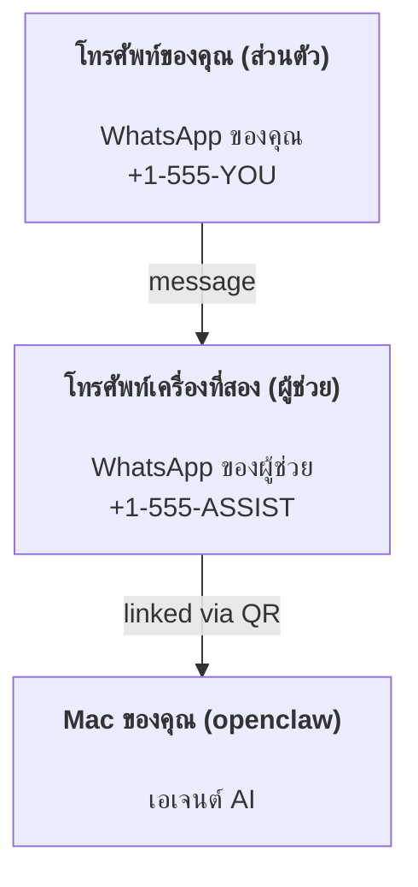

---
read_when:
    - การเริ่มต้นใช้งานอินสแตนซ์ผู้ช่วยใหม่
    - การทบทวนผลกระทบด้านความปลอดภัย/สิทธิ์อนุญาต
summary: คู่มือแบบ end-to-end สำหรับการใช้งาน OpenClaw เป็นผู้ช่วยส่วนตัว พร้อมข้อควรระวังด้านความปลอดภัย
title: การตั้งค่าผู้ช่วยส่วนตัว
x-i18n:
    generated_at: "2026-04-25T13:59:13Z"
    model: gpt-5.4
    provider: openai
    source_hash: 1647b78e8cf23a3a025969c52fbd8a73aed78df27698abf36bbf62045dc30e3b
    source_path: start/openclaw.md
    workflow: 15
---

# การสร้างผู้ช่วยส่วนตัวด้วย OpenClaw

OpenClaw คือ Gateway แบบ self-hosted ที่เชื่อมต่อ Discord, Google Chat, iMessage, Matrix, Microsoft Teams, Signal, Slack, Telegram, WhatsApp, Zalo และอื่น ๆ เข้ากับเอเจนต์ AI คู่มือนี้ครอบคลุมการตั้งค่าแบบ "ผู้ช่วยส่วนตัว": หมายเลข WhatsApp แยกต่างหากที่ทำงานเป็นผู้ช่วย AI แบบออนไลน์ตลอดเวลาของคุณ

## ⚠️ ความปลอดภัยต้องมาก่อน

คุณกำลังวางเอเจนต์ไว้ในตำแหน่งที่สามารถ:

- รันคำสั่งบนเครื่องของคุณได้ (ขึ้นอยู่กับนโยบายเครื่องมือของคุณ)
- อ่าน/เขียนไฟล์ใน workspace ของคุณ
- ส่งข้อความกลับออกไปผ่าน WhatsApp/Telegram/Discord/Mattermost และแชนเนลที่มาพร้อมระบบอื่น ๆ

เริ่มต้นแบบระมัดระวัง:

- ตั้งค่า `channels.whatsapp.allowFrom` เสมอ (อย่ารันแบบเปิดให้ทั้งโลกเข้าถึงบน Mac ส่วนตัวของคุณ)
- ใช้หมายเลข WhatsApp แยกเฉพาะสำหรับผู้ช่วย
- ตอนนี้ Heartbeat มีค่าเริ่มต้นทุก 30 นาที ปิดไว้ก่อนจนกว่าคุณจะเชื่อถือการตั้งค่านี้ โดยตั้งค่า `agents.defaults.heartbeat.every: "0m"`

## สิ่งที่ต้องมีก่อน

- ติดตั้งและ onboard OpenClaw แล้ว — ดู [Getting Started](/th/start/getting-started) หากคุณยังไม่ได้ทำ
- หมายเลขโทรศัพท์ที่สอง (SIM/eSIM/เติมเงิน) สำหรับผู้ช่วย

## การตั้งค่าแบบสองโทรศัพท์ (แนะนำ)

คุณต้องการแบบนี้:



หากคุณลิงก์ WhatsApp ส่วนตัวเข้ากับ OpenClaw ทุกข้อความที่ส่งถึงคุณจะกลายเป็น “อินพุตของเอเจนต์” ซึ่งนั่นมักไม่ใช่สิ่งที่คุณต้องการ

## เริ่มต้นอย่างรวดเร็วใน 5 นาที

1. จับคู่ WhatsApp Web (จะแสดง QR; สแกนด้วยโทรศัพท์ของผู้ช่วย):

```bash
openclaw channels login
```

2. เริ่ม Gateway (ปล่อยให้ทำงานต่อไป):

```bash
openclaw gateway --port 18789
```

3. ใส่ config ขั้นต่ำใน `~/.openclaw/openclaw.json`:

```json5
{
  gateway: { mode: "local" },
  channels: { whatsapp: { allowFrom: ["+15555550123"] } },
}
```

ตอนนี้ส่งข้อความไปยังหมายเลขผู้ช่วยจากโทรศัพท์ที่อยู่ใน allowlist ของคุณ

เมื่อ onboarding เสร็จสิ้น OpenClaw จะเปิดแดชบอร์ดโดยอัตโนมัติและพิมพ์ลิงก์ที่สะอาด (ไม่มีโทเค็น) หากแดชบอร์ดขอ auth ให้วาง shared secret ที่กำหนดค่าไว้ลงใน settings ของ Control UI onboarding ใช้ token เป็นค่าเริ่มต้น (`gateway.auth.token`) แต่ auth แบบ password ก็ใช้ได้เช่นกันหากคุณสลับ `gateway.auth.mode` เป็น `password` หากต้องการเปิดอีกครั้งในภายหลัง: `openclaw dashboard`

## ให้เอเจนต์มี workspace (AGENTS)

OpenClaw จะอ่านคำสั่งการทำงานและ “memory” จากไดเรกทอรี workspace ของมัน

ตามค่าเริ่มต้น OpenClaw ใช้ `~/.openclaw/workspace` เป็น agent workspace และจะสร้างมันขึ้นมา (พร้อม `AGENTS.md`, `SOUL.md`, `TOOLS.md`, `IDENTITY.md`, `USER.md`, `HEARTBEAT.md` เริ่มต้น) โดยอัตโนมัติระหว่าง setup/การรันเอเจนต์ครั้งแรก `BOOTSTRAP.md` จะถูกสร้างเฉพาะเมื่อ workspace ใหม่จริง ๆ เท่านั้น (ไม่ควรกลับมาอีกหลังจากคุณลบมัน) `MEMORY.md` เป็นไฟล์แบบไม่บังคับ (ไม่ถูกสร้างอัตโนมัติ); หากมีอยู่ ระบบจะโหลดสำหรับเซสชันปกติ ส่วนเซสชัน subagent จะ inject เฉพาะ `AGENTS.md` และ `TOOLS.md`

เคล็ดลับ: ให้มองโฟลเดอร์นี้เป็น “memory” ของ OpenClaw และทำให้มันเป็น git repo (ควรเป็นแบบ private) เพื่อให้ `AGENTS.md` + ไฟล์ memory ของคุณมีการสำรองข้อมูล หากติดตั้ง git อยู่ workspace ใหม่เอี่ยมจะถูกเริ่มต้นให้อัตโนมัติ

```bash
openclaw setup
```

โครงสร้าง workspace แบบเต็ม + คู่มือการสำรองข้อมูล: [Agent workspace](/th/concepts/agent-workspace)
เวิร์กโฟลว์ Memory: [Memory](/th/concepts/memory)

ทางเลือก: เลือก workspace อื่นด้วย `agents.defaults.workspace` (รองรับ `~`)

```json5
{
  agents: {
    defaults: {
      workspace: "~/.openclaw/workspace",
    },
  },
}
```

หากคุณมีไฟล์ workspace ของตัวเองจาก repo อยู่แล้ว คุณสามารถปิดการสร้าง bootstrap files ได้ทั้งหมด:

```json5
{
  agents: {
    defaults: {
      skipBootstrap: true,
    },
  },
}
```

## config ที่ทำให้มันกลายเป็น "ผู้ช่วย"

OpenClaw มีค่าเริ่มต้นที่เหมาะกับการเป็นผู้ช่วยอยู่แล้ว แต่โดยปกติคุณมักจะต้องปรับแต่ง:

- persona/คำสั่งใน [`SOUL.md`](/th/concepts/soul)
- ค่าเริ่มต้นของการคิด (หากต้องการ)
- Heartbeat (เมื่อคุณเชื่อถือมันแล้ว)

ตัวอย่าง:

```json5
{
  logging: { level: "info" },
  agent: {
    model: "anthropic/claude-opus-4-6",
    workspace: "~/.openclaw/workspace",
    thinkingDefault: "high",
    timeoutSeconds: 1800,
    // เริ่มที่ 0; เปิดใช้ในภายหลัง
    heartbeat: { every: "0m" },
  },
  channels: {
    whatsapp: {
      allowFrom: ["+15555550123"],
      groups: {
        "*": { requireMention: true },
      },
    },
  },
  routing: {
    groupChat: {
      mentionPatterns: ["@openclaw", "openclaw"],
    },
  },
  session: {
    scope: "per-sender",
    resetTriggers: ["/new", "/reset"],
    reset: {
      mode: "daily",
      atHour: 4,
      idleMinutes: 10080,
    },
  },
}
```

## Sessions และ memory

- ไฟล์เซสชัน: `~/.openclaw/agents/<agentId>/sessions/{{SessionId}}.jsonl`
- ข้อมูลเมตาของเซสชัน (การใช้โทเค็น, เส้นทางล่าสุด ฯลฯ): `~/.openclaw/agents/<agentId>/sessions/sessions.json` (แบบเดิม: `~/.openclaw/sessions/sessions.json`)
- `/new` หรือ `/reset` จะเริ่มเซสชันใหม่สำหรับแชตนั้น (กำหนดค่าได้ผ่าน `resetTriggers`) หากส่งเพียงอย่างเดียว เอเจนต์จะตอบกลับด้วยคำทักทายสั้น ๆ เพื่อยืนยันการรีเซ็ต
- `/compact [instructions]` จะทำ Compaction บริบทของเซสชันและรายงานงบประมาณบริบทที่เหลืออยู่

## Heartbeat (โหมด proactive)

ตามค่าเริ่มต้น OpenClaw จะรัน Heartbeat ทุก 30 นาทีด้วยพรอมต์:
`Read HEARTBEAT.md if it exists (workspace context). Follow it strictly. Do not infer or repeat old tasks from prior chats. If nothing needs attention, reply HEARTBEAT_OK.`
ตั้งค่า `agents.defaults.heartbeat.every: "0m"` เพื่อปิดใช้งาน

- หากมี `HEARTBEAT.md` แต่มีเนื้อหาว่างโดยพฤตินัย (มีเพียงบรรทัดว่างและหัวข้อ Markdown เช่น `# Heading`) OpenClaw จะข้ามการรัน Heartbeat เพื่อประหยัด API calls
- หากไม่มีไฟล์นี้ Heartbeat จะยังคงรัน และให้โมเดลตัดสินใจว่าจะทำอะไร
- หากเอเจนต์ตอบกลับด้วย `HEARTBEAT_OK` (อาจมีข้อความสั้นเพิ่มเติมได้; ดู `agents.defaults.heartbeat.ackMaxChars`) OpenClaw จะระงับการส่งออกสำหรับ Heartbeat นั้น
- ตามค่าเริ่มต้น อนุญาตให้ส่ง Heartbeat ไปยังเป้าหมายแบบ DM ลักษณะ `user:<id>` ได้ ตั้งค่า `agents.defaults.heartbeat.directPolicy: "block"` เพื่อระงับการส่งไปยังเป้าหมายแบบ direct ขณะที่ยังคงเปิดการรัน Heartbeat ไว้
- Heartbeat รันเป็นเทิร์นเต็มของเอเจนต์ — ช่วงเวลาที่สั้นลงจะใช้โทเค็นมากขึ้น

```json5
{
  agent: {
    heartbeat: { every: "30m" },
  },
}
```

## สื่อขาเข้าและขาออก

ไฟล์แนบขาเข้า (รูปภาพ/เสียง/เอกสาร) สามารถถูกส่งเข้าไปในคำสั่งของคุณผ่านเทมเพลต:

- `{{MediaPath}}` (พาธไฟล์ชั่วคราวในเครื่อง)
- `{{MediaUrl}}` (pseudo-URL)
- `{{Transcript}}` (หากเปิดใช้การถอดเสียง audio)

ไฟล์แนบขาออกจากเอเจนต์: ให้ใส่ `MEDIA:<path-or-url>` ในบรรทัดของมันเอง (ไม่มีช่องว่าง) ตัวอย่าง:

```
Here’s the screenshot.
MEDIA:https://example.com/screenshot.png
```

OpenClaw จะดึงสิ่งเหล่านี้ออกมาและส่งเป็นสื่อควบคู่ไปกับข้อความ

พฤติกรรมของ local-path ใช้ trust model การอ่านไฟล์แบบเดียวกับเอเจนต์:

- หาก `tools.fs.workspaceOnly` เป็น `true`, local paths ของ `MEDIA:` ขาออกจะยังคงถูกจำกัดอยู่ที่ temp root ของ OpenClaw, media cache, พาธของ agent workspace และไฟล์ที่สร้างจาก sandbox
- หาก `tools.fs.workspaceOnly` เป็น `false`, `MEDIA:` ขาออกสามารถใช้ไฟล์ในเครื่องโฮสต์ที่เอเจนต์ได้รับอนุญาตให้อ่านอยู่แล้ว
- การส่งไฟล์ในเครื่องโฮสต์ยังคงอนุญาตเฉพาะสื่อและประเภทเอกสารที่ปลอดภัยเท่านั้น (รูปภาพ, เสียง, วิดีโอ, PDF และเอกสาร Office) ไฟล์ข้อความล้วนและไฟล์ที่คล้ายความลับจะไม่ถูกถือว่าเป็นสื่อที่ส่งได้

นั่นหมายความว่ารูปภาพ/ไฟล์ที่สร้างขึ้นนอก workspace สามารถถูกส่งได้เมื่อ fs policy ของคุณอนุญาตการอ่านเหล่านั้นอยู่แล้ว โดยไม่ต้องเปิดช่องให้มีการดึงไฟล์ข้อความบนโฮสต์ออกไปอย่างอิสระอีกครั้ง

## เช็กลิสต์การปฏิบัติงาน

```bash
openclaw status          # สถานะภายในเครื่อง (creds, sessions, queued events)
openclaw status --all    # การวินิจฉัยแบบเต็ม (อ่านอย่างเดียว, คัดลอกไปใช้ได้)
openclaw status --deep   # ขอ live health probe จาก gateway พร้อม channel probes เมื่อรองรับ
openclaw health --json   # gateway health snapshot (WS; ค่าเริ่มต้นอาจคืน cached snapshot ที่ยังใหม่)
```

บันทึกจะอยู่ภายใต้ `/tmp/openclaw/` (ค่าเริ่มต้น: `openclaw-YYYY-MM-DD.log`)

## ขั้นตอนถัดไป

- WebChat: [WebChat](/th/web/webchat)
- การปฏิบัติงานของ Gateway: [Gateway runbook](/th/gateway)
- Cron + การปลุก: [Cron jobs](/th/automation/cron-jobs)
- แอปคู่หูบน macOS แบบแถบเมนู: [OpenClaw macOS app](/th/platforms/macos)
- แอป iOS node: [iOS app](/th/platforms/ios)
- แอป Android node: [Android app](/th/platforms/android)
- สถานะบน Windows: [Windows (WSL2)](/th/platforms/windows)
- สถานะบน Linux: [Linux app](/th/platforms/linux)
- ความปลอดภัย: [Security](/th/gateway/security)

## ที่เกี่ยวข้อง

- [Getting started](/th/start/getting-started)
- [Setup](/th/start/setup)
- [Channels overview](/th/channels)
