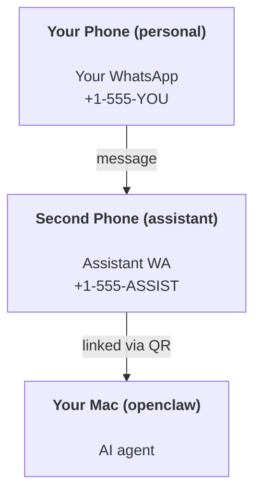

---
read_when:
    - การเริ่มต้นใช้งานอินสแตนซ์ผู้ช่วยใหม่
    - กำลังตรวจสอบผลกระทบด้านความปลอดภัย/สิทธิ์
summary: คู่มือแบบครบวงจรสำหรับการใช้งาน OpenClaw ในฐานะผู้ช่วยส่วนตัวพร้อมข้อควรระวังด้านความปลอดภัย
title: การตั้งค่าผู้ช่วยส่วนตัว
x-i18n:
    generated_at: "2026-05-06T09:31:43Z"
    model: gpt-5.5
    provider: openai
    source_hash: 6fea1194e6b9e8d8816cc712296940487b38faaabea463bd45ba1f37ff52d44d
    source_path: start/openclaw.md
    workflow: 16
---

OpenClaw เป็น gateway แบบโฮสต์เองที่เชื่อมต่อ Discord, Google Chat, iMessage, Matrix, Microsoft Teams, Signal, Slack, Telegram, WhatsApp, Zalo และอื่นๆ เข้ากับเอเจนต์ AI คู่มือนี้ครอบคลุมการตั้งค่าแบบ “ผู้ช่วยส่วนตัว”: หมายเลข WhatsApp เฉพาะที่ทำงานเหมือนผู้ช่วย AI ของคุณซึ่งพร้อมใช้งานเสมอ

## ⚠️ ความปลอดภัยต้องมาก่อน

คุณกำลังวางเอเจนต์ไว้ในตำแหน่งที่สามารถ:

- รันคำสั่งบนเครื่องของคุณ (ขึ้นอยู่กับนโยบายเครื่องมือของคุณ)
- อ่าน/เขียนไฟล์ใน workspace ของคุณ
- ส่งข้อความกลับออกไปผ่าน WhatsApp/Telegram/Discord/Mattermost และช่องทางอื่นๆ ที่รวมมาให้

เริ่มแบบรัดกุมไว้ก่อน:

- ตั้งค่า `channels.whatsapp.allowFrom` เสมอ (อย่ารันแบบเปิดให้ทั้งโลกบน Mac ส่วนตัวของคุณ)
- ใช้หมายเลข WhatsApp เฉพาะสำหรับผู้ช่วย
- ตอนนี้ Heartbeat มีค่าเริ่มต้นเป็นทุก 30 นาที ปิดไว้ก่อนจนกว่าคุณจะเชื่อถือการตั้งค่านี้ โดยตั้งค่า `agents.defaults.heartbeat.every: "0m"`

## ข้อกำหนดเบื้องต้น

- ติดตั้งและตั้งค่าเริ่มต้น OpenClaw แล้ว - ดู [เริ่มต้นใช้งาน](/th/start/getting-started) หากคุณยังไม่ได้ทำ
- หมายเลขโทรศัพท์ที่สอง (SIM/eSIM/เติมเงิน) สำหรับผู้ช่วย

## การตั้งค่าแบบสองเครื่อง (แนะนำ)

สิ่งที่คุณต้องการคือแบบนี้:



หากคุณเชื่อม WhatsApp ส่วนตัวของคุณกับ OpenClaw ทุกข้อความที่ส่งถึงคุณจะกลายเป็น “อินพุตของเอเจนต์” ซึ่งแทบไม่ใช่สิ่งที่คุณต้องการ

## เริ่มอย่างรวดเร็วใน 5 นาที

1. จับคู่ WhatsApp Web (แสดง QR; สแกนด้วยโทรศัพท์ของผู้ช่วย):

```bash
openclaw channels login
```

2. เริ่ม Gateway (ปล่อยให้รันอยู่):

```bash
openclaw gateway --port 18789
```

3. ใส่ config ขั้นต่ำใน `~/.openclaw/openclaw.json`:

```json5
{
  gateway: { mode: "local" },
  channels: { whatsapp: { allowFrom: ["+15555550123"] } },
}
```

จากนั้นส่งข้อความไปยังหมายเลขผู้ช่วยจากโทรศัพท์ที่อยู่ในรายการอนุญาตของคุณ

เมื่อการตั้งค่าเริ่มต้นเสร็จสิ้น OpenClaw จะเปิด dashboard อัตโนมัติและพิมพ์ลิงก์แบบสะอาด (ไม่ใส่ token) หาก dashboard ขอ auth ให้แปะ shared secret ที่กำหนดไว้ใน Control UI settings การตั้งค่าเริ่มต้นใช้ token เป็นค่าเริ่มต้น (`gateway.auth.token`) แต่ auth แบบ password ก็ใช้ได้เช่นกันหากคุณเปลี่ยน `gateway.auth.mode` เป็น `password` หากต้องการเปิดใหม่ภายหลัง: `openclaw dashboard`

## ให้ workspace แก่เอเจนต์ (AGENTS)

OpenClaw อ่านคำสั่งการทำงานและ “หน่วยความจำ” จากไดเรกทอรี workspace ของมัน

โดยค่าเริ่มต้น OpenClaw ใช้ `~/.openclaw/workspace` เป็น workspace ของเอเจนต์ และจะสร้างไดเรกทอรีนี้ (พร้อมไฟล์เริ่มต้น `AGENTS.md`, `SOUL.md`, `TOOLS.md`, `IDENTITY.md`, `USER.md`, `HEARTBEAT.md`) โดยอัตโนมัติระหว่างการตั้งค่า/การรันเอเจนต์ครั้งแรก `BOOTSTRAP.md` จะถูกสร้างเฉพาะเมื่อ workspace เป็นของใหม่เท่านั้น (ไม่ควรกลับมาหลังจากที่คุณลบมัน) `MEMORY.md` เป็นตัวเลือก (ไม่ได้สร้างอัตโนมัติ); เมื่อมีอยู่ จะถูกโหลดสำหรับเซสชันปกติ เซสชันของ subagent จะฉีดเฉพาะ `AGENTS.md` และ `TOOLS.md`

<Tip>
ให้มองโฟลเดอร์นี้เหมือนหน่วยความจำของ OpenClaw และทำให้เป็น repo ของ git (ควรเป็น private) เพื่อสำรอง `AGENTS.md` และไฟล์หน่วยความจำของคุณ หากติดตั้ง git ไว้ workspace ใหม่เอี่ยมจะถูกเริ่มต้นอัตโนมัติ
</Tip>

```bash
openclaw setup
```

เลย์เอาต์ workspace แบบเต็ม + คู่มือสำรองข้อมูล: [workspace ของเอเจนต์](/th/concepts/agent-workspace)
เวิร์กโฟลว์หน่วยความจำ: [หน่วยความจำ](/th/concepts/memory)

ตัวเลือกเพิ่มเติม: เลือก workspace อื่นด้วย `agents.defaults.workspace` (รองรับ `~`)

```json5
{
  agents: {
    defaults: {
      workspace: "~/.openclaw/workspace",
    },
  },
}
```

หากคุณส่งไฟล์ workspace ของคุณเองจาก repo อยู่แล้ว คุณสามารถปิดการสร้างไฟล์ bootstrap ทั้งหมดได้:

```json5
{
  agents: {
    defaults: {
      skipBootstrap: true,
    },
  },
}
```

## config ที่เปลี่ยนมันให้เป็น “ผู้ช่วย”

OpenClaw มีค่าเริ่มต้นเป็นการตั้งค่าผู้ช่วยที่ดีอยู่แล้ว แต่โดยปกติคุณจะต้องปรับ:

- persona/คำสั่งใน [`SOUL.md`](/th/concepts/soul)
- ค่าเริ่มต้นของการคิด (หากต้องการ)
- Heartbeat (เมื่อคุณเชื่อถือมันแล้ว)

ตัวอย่าง:

```json5
{
  logging: { level: "info" },
  agent: {
    model: "anthropic/claude-opus-4-6",
    workspace: "~/.openclaw/workspace",
    thinkingDefault: "high",
    timeoutSeconds: 1800,
    // Start with 0; enable later.
    heartbeat: { every: "0m" },
  },
  channels: {
    whatsapp: {
      allowFrom: ["+15555550123"],
      groups: {
        "*": { requireMention: true },
      },
    },
  },
  routing: {
    groupChat: {
      mentionPatterns: ["@openclaw", "openclaw"],
    },
  },
  session: {
    scope: "per-sender",
    resetTriggers: ["/new", "/reset"],
    reset: {
      mode: "daily",
      atHour: 4,
      idleMinutes: 10080,
    },
  },
}
```

## เซสชันและหน่วยความจำ

- ไฟล์เซสชัน: `~/.openclaw/agents/<agentId>/sessions/{{SessionId}}.jsonl`
- metadata ของเซสชัน (การใช้ token, route ล่าสุด และอื่นๆ): `~/.openclaw/agents/<agentId>/sessions/sessions.json` (แบบเดิม: `~/.openclaw/sessions/sessions.json`)
- `/new` หรือ `/reset` เริ่มเซสชันใหม่สำหรับแชตนั้น (กำหนดค่าได้ผ่าน `resetTriggers`) หากส่งมาเดี่ยวๆ OpenClaw จะยืนยันการ reset โดยไม่เรียกโมเดล
- `/compact [instructions]` ทำ Compaction บริบทของเซสชันและรายงานงบประมาณบริบทที่เหลือ

## Heartbeat (โหมดเชิงรุก)

โดยค่าเริ่มต้น OpenClaw รัน Heartbeat ทุก 30 นาทีด้วย prompt:
`Read HEARTBEAT.md if it exists (workspace context). Follow it strictly. Do not infer or repeat old tasks from prior chats. If nothing needs attention, reply HEARTBEAT_OK.`
ตั้งค่า `agents.defaults.heartbeat.every: "0m"` เพื่อปิดใช้งาน

- หาก `HEARTBEAT.md` มีอยู่แต่แทบจะว่างเปล่า (มีเพียงบรรทัดว่างและหัวข้อ markdown เช่น `# Heading`) OpenClaw จะข้ามการรัน Heartbeat เพื่อประหยัดการเรียก API
- หากไฟล์หายไป Heartbeat ยังคงรันและให้โมเดลตัดสินใจว่าจะทำอะไร
- หากเอเจนต์ตอบกลับด้วย `HEARTBEAT_OK` (อาจมีข้อความสั้นๆ ต่อท้ายได้; ดู `agents.defaults.heartbeat.ackMaxChars`) OpenClaw จะระงับการส่งออกสำหรับ Heartbeat นั้น
- โดยค่าเริ่มต้น อนุญาตให้ส่ง Heartbeat ไปยังเป้าหมาย `user:<id>` แบบ DM ได้ ตั้งค่า `agents.defaults.heartbeat.directPolicy: "block"` เพื่อระงับการส่งไปยังเป้าหมายโดยตรง ขณะที่ยังคงให้การรัน Heartbeat ทำงานอยู่
- Heartbeat รันเป็นรอบการทำงานของเอเจนต์แบบเต็ม - ช่วงเวลาที่สั้นลงจะใช้ token มากขึ้น

```json5
{
  agent: {
    heartbeat: { every: "30m" },
  },
}
```

## สื่อขาเข้าและขาออก

ไฟล์แนบขาเข้า (รูปภาพ/เสียง/เอกสาร) สามารถถูกส่งต่อไปยังคำสั่งของคุณผ่านเทมเพลต:

- `{{MediaPath}}` (พาธไฟล์ชั่วคราวในเครื่อง)
- `{{MediaUrl}}` (pseudo-URL)
- `{{Transcript}}` (หากเปิดใช้งานการถอดเสียง)

ไฟล์แนบขาออกจากเอเจนต์: ใส่ `MEDIA:<path-or-url>` ในบรรทัดของตัวเอง (ไม่มีช่องว่าง) ตัวอย่าง:

```
Here's the screenshot.
MEDIA:https://example.com/screenshot.png
```

OpenClaw จะแยกส่วนเหล่านี้ออกมาและส่งเป็นสื่อพร้อมกับข้อความ

พฤติกรรมของพาธในเครื่องใช้โมเดลความเชื่อถือการอ่านไฟล์เดียวกับเอเจนต์:

- หาก `tools.fs.workspaceOnly` เป็น `true` พาธในเครื่องของ `MEDIA:` ขาออกจะถูกจำกัดอยู่ที่ temp root ของ OpenClaw, media cache, พาธ workspace ของเอเจนต์ และไฟล์ที่สร้างโดย sandbox
- หาก `tools.fs.workspaceOnly` เป็น `false` `MEDIA:` ขาออกสามารถใช้ไฟล์ในเครื่องโฮสต์ที่เอเจนต์ได้รับอนุญาตให้อ่านอยู่แล้ว
- พาธในเครื่องอาจเป็นแบบ absolute, สัมพัทธ์กับ workspace หรือสัมพัทธ์กับ home ด้วย `~/`
- การส่งจากเครื่องโฮสต์ยังคงอนุญาตเฉพาะสื่อและประเภทเอกสารที่ปลอดภัยเท่านั้น (รูปภาพ, เสียง, วิดีโอ, PDF และเอกสาร Office) ไฟล์ข้อความธรรมดาและไฟล์ที่ดูเหมือนความลับจะไม่ถูกถือว่าเป็นสื่อที่ส่งได้

นั่นหมายความว่ารูปภาพ/ไฟล์ที่สร้างขึ้นนอก workspace สามารถส่งได้แล้วเมื่อ policy ของ fs ของคุณอนุญาตการอ่านเหล่านั้นอยู่แล้ว โดยไม่เปิดทางให้ขโมยไฟล์แนบข้อความจากโฮสต์แบบ arbitrary อีกครั้ง

## เช็กลิสต์การปฏิบัติการ

```bash
openclaw status          # local status (creds, sessions, queued events)
openclaw status --all    # full diagnosis (read-only, pasteable)
openclaw status --deep   # asks the gateway for a live health probe with channel probes when supported
openclaw health --json   # gateway health snapshot (WS; default can return a fresh cached snapshot)
```

บันทึกอยู่ภายใต้ `/tmp/openclaw/` (ค่าเริ่มต้น: `openclaw-YYYY-MM-DD.log`)

## ขั้นตอนถัดไป

- WebChat: [WebChat](/th/web/webchat)
- การปฏิบัติการ Gateway: [runbook ของ Gateway](/th/gateway)
- Cron + การปลุก: [งาน Cron](/th/automation/cron-jobs)
- แอปคู่หูในแถบเมนู macOS: [แอป OpenClaw macOS](/th/platforms/macos)
- แอปโหนด iOS: [แอป iOS](/th/platforms/ios)
- แอปโหนด Android: [แอป Android](/th/platforms/android)
- สถานะ Windows: [Windows (WSL2)](/th/platforms/windows)
- สถานะ Linux: [แอป Linux](/th/platforms/linux)
- ความปลอดภัย: [ความปลอดภัย](/th/gateway/security)

## ที่เกี่ยวข้อง

- [เริ่มต้นใช้งาน](/th/start/getting-started)
- [การตั้งค่า](/th/start/setup)
- [ภาพรวมช่องทาง](/th/channels)
