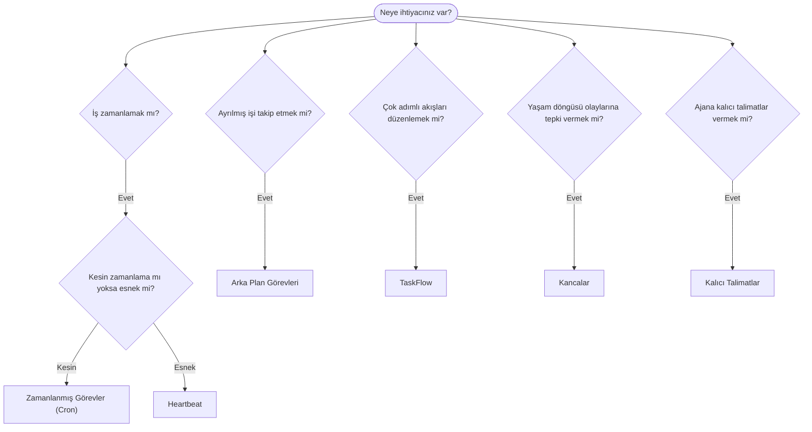

---
read_when:
    - OpenClaw ile işlerin nasıl otomatikleştirileceğine karar verme
    - Heartbeat, Cron, kancalar ve kalıcı talimatlar arasında seçim yapma
    - Doğru otomasyon başlangıç noktasını arama
summary: 'Otomasyon mekanizmalarına genel bakış: görevler, Cron, kancalar, kalıcı talimatlar ve TaskFlow'
title: Otomasyon ve görevler
x-i18n:
    generated_at: "2026-04-26T11:22:56Z"
    model: gpt-5.4
    provider: openai
    source_hash: 6d2a2d3ef58830133e07b34f33c611664fc1032247e9dd81005adf7fc0c43cdb
    source_path: automation/index.md
    workflow: 15
---

OpenClaw, işleri arka planda görevler, zamanlanmış işler, olay kancaları ve kalıcı talimatlar aracılığıyla yürütür. Bu sayfa, doğru mekanizmayı seçmenize ve bunların nasıl birlikte çalıştığını anlamanıza yardımcı olur.

## Hızlı karar kılavuzu

| Kullanım durumu                          | Önerilen               | Neden                                            |
| ---------------------------------------- | ---------------------- | ------------------------------------------------ |
| Günlük raporu tam 09:00'da gönder        | Zamanlanmış Görevler (Cron) | Kesin zamanlama, izole yürütme              |
| Bana 20 dakika içinde hatırlat           | Zamanlanmış Görevler (Cron) | Hassas zamanlamalı tek seferlik (`--at`)    |
| Haftalık derin analiz çalıştır           | Zamanlanmış Görevler (Cron) | Bağımsız görev, farklı model kullanabilir    |
| Gelen kutusunu her 30 dakikada bir kontrol et | Heartbeat         | Diğer kontrollerle toplu çalışır, bağlam farkındalığı vardır |
| Takvimde yaklaşan etkinlikleri izle      | Heartbeat              | Periyodik farkındalık için doğal uyum            |
| Bir alt ajanın veya ACP çalışmasının durumunu incele | Arka Plan Görevleri | Görev kaydı tüm ayrılmış işleri izler |
| Ne çalıştı ve ne zaman çalıştı denetle   | Arka Plan Görevleri    | `openclaw tasks list` ve `openclaw tasks audit`  |
| Çok adımlı araştırma yapıp sonra özetle  | TaskFlow               | Revizyon takibiyle dayanıklı orkestrasyon        |
| Oturum sıfırlamada bir betik çalıştır    | Kancalar               | Olay güdümlü, yaşam döngüsü olaylarında tetiklenir |
| Her araç çağrısında kod çalıştır         | Plugin kancaları       | Süreç içi kancalar araç çağrılarını yakalayabilir |
| Yanıtlamadan önce her zaman uyumluluğu kontrol et | Kalıcı Talimatlar | Her oturuma otomatik olarak eklenir         |

### Zamanlanmış Görevler (Cron) ve Heartbeat karşılaştırması

| Boyut           | Zamanlanmış Görevler (Cron)         | Heartbeat                            |
| --------------- | ----------------------------------- | ------------------------------------ |
| Zamanlama       | Kesin (cron ifadeleri, tek seferlik) | Yaklaşık (varsayılan olarak 30 dakikada bir) |
| Oturum bağlamı  | Yeni (izole) veya paylaşılan        | Tam ana oturum bağlamı               |
| Görev kayıtları | Her zaman oluşturulur               | Hiç oluşturulmaz                     |
| Teslimat        | Kanal, Webhook veya sessiz          | Ana oturumda satır içi               |
| En uygun kullanım | Raporlar, hatırlatıcılar, arka plan işleri | Gelen kutusu kontrolleri, takvim, bildirimler |

Kesin zamanlama veya izole yürütme gerektiğinde Zamanlanmış Görevler (Cron) kullanın. İş tam oturum bağlamından fayda görüyorsa ve yaklaşık zamanlama yeterliyse Heartbeat kullanın.

## Temel kavramlar

### Zamanlanmış görevler (cron)

Cron, Gateway'in hassas zamanlama için yerleşik zamanlayıcısıdır. İşleri kalıcı olarak saklar, ajanı doğru zamanda uyandırır ve çıktıyı bir sohbet kanalına veya Webhook uç noktasına iletebilir. Tek seferlik hatırlatıcıları, yinelenen ifadeleri ve gelen Webhook tetikleyicilerini destekler.

Bkz. [Zamanlanmış Görevler](/tr/automation/cron-jobs).

### Görevler

Arka plan görev kaydı, tüm ayrılmış işleri izler: ACP çalışmaları, alt ajan başlatmaları, izole cron yürütmeleri ve CLI işlemleri. Görevler zamanlayıcı değil, kayıttır. Bunları incelemek için `openclaw tasks list` ve `openclaw tasks audit` kullanın.

Bkz. [Arka Plan Görevleri](/tr/automation/tasks).

### TaskFlow

TaskFlow, arka plan görevlerinin üzerindeki akış orkestrasyonu altyapısıdır. Yönetilen ve yansıtılmış eşzamanlama modları, revizyon takibi ve inceleme için `openclaw tasks flow list|show|cancel` ile dayanıklı çok adımlı akışları yönetir.

Bkz. [TaskFlow](/tr/automation/taskflow).

### Kalıcı talimatlar

Kalıcı talimatlar, ajana tanımlı programlar için kalıcı çalışma yetkisi verir. Çalışma alanı dosyalarında bulunurlar (genellikle `AGENTS.md`) ve her oturuma eklenirler. Zamana bağlı uygulama için cron ile birleştirin.

Bkz. [Kalıcı Talimatlar](/tr/automation/standing-orders).

### Kancalar

Dahili kancalar, ajan yaşam döngüsü olayları
(`/new`, `/reset`, `/stop`), oturum Compaction, Gateway başlangıcı ve mesaj
akışı tarafından tetiklenen olay güdümlü betiklerdir. Dizinlerden otomatik olarak keşfedilirler ve
`openclaw hooks` ile yönetilebilirler. Süreç içi araç çağrısı yakalama için
[Plugin kancaları](/tr/plugins/hooks) kullanın.

Bkz. [Kancalar](/tr/automation/hooks).

### Heartbeat

Heartbeat, periyodik bir ana oturum dönüşüdür (varsayılan olarak her 30 dakikada bir). Tam oturum bağlamıyla bir ajan dönüşünde birden çok kontrolü (gelen kutusu, takvim, bildirimler) toplu olarak yürütür. Heartbeat dönüşleri görev kaydı oluşturmaz ve günlük/boşta oturum sıfırlama tazeliğini uzatmaz. Küçük bir kontrol listesi için `HEARTBEAT.md` veya yalnızca vadesi gelen periyodik kontrolleri Heartbeat içinde çalıştırmak istediğinizde bir `tasks:` bloğu kullanın. Boş heartbeat dosyaları `empty-heartbeat-file` olarak atlanır; yalnızca vadesi gelen görev modu ise `no-tasks-due` olarak atlanır.

Bkz. [Heartbeat](/tr/gateway/heartbeat).

## Birlikte nasıl çalışırlar

- **Cron**, hassas zamanlamaları (günlük raporlar, haftalık gözden geçirmeler) ve tek seferlik hatırlatıcıları yönetir. Tüm cron yürütmeleri görev kaydı oluşturur.
- **Heartbeat**, rutin izlemeyi (gelen kutusu, takvim, bildirimler) her 30 dakikada bir tek bir toplu dönüşte ele alır.
- **Kancalar**, özel betiklerle belirli olaylara (oturum sıfırlamaları, Compaction, mesaj akışı) tepki verir. Plugin kancaları araç çağrılarını kapsar.
- **Kalıcı talimatlar**, ajana kalıcı bağlam ve yetki sınırları verir.
- **TaskFlow**, tek tek görevlerin üzerinde çok adımlı akışları koordine eder.
- **Görevler**, tüm ayrılmış işleri otomatik olarak izler; böylece bunları inceleyebilir ve denetleyebilirsiniz.

## İlgili

- [Zamanlanmış Görevler](/tr/automation/cron-jobs) — hassas zamanlama ve tek seferlik hatırlatıcılar
- [Arka Plan Görevleri](/tr/automation/tasks) — tüm ayrılmış işler için görev kaydı
- [TaskFlow](/tr/automation/taskflow) — dayanıklı çok adımlı akış orkestrasyonu
- [Kancalar](/tr/automation/hooks) — olay güdümlü yaşam döngüsü betikleri
- [Plugin kancaları](/tr/plugins/hooks) — süreç içi araç, istem, mesaj ve yaşam döngüsü kancaları
- [Kalıcı Talimatlar](/tr/automation/standing-orders) — kalıcı ajan talimatları
- [Heartbeat](/tr/gateway/heartbeat) — periyodik ana oturum dönüşleri
- [Yapılandırma Başvurusu](/tr/gateway/configuration-reference) — tüm yapılandırma anahtarları
