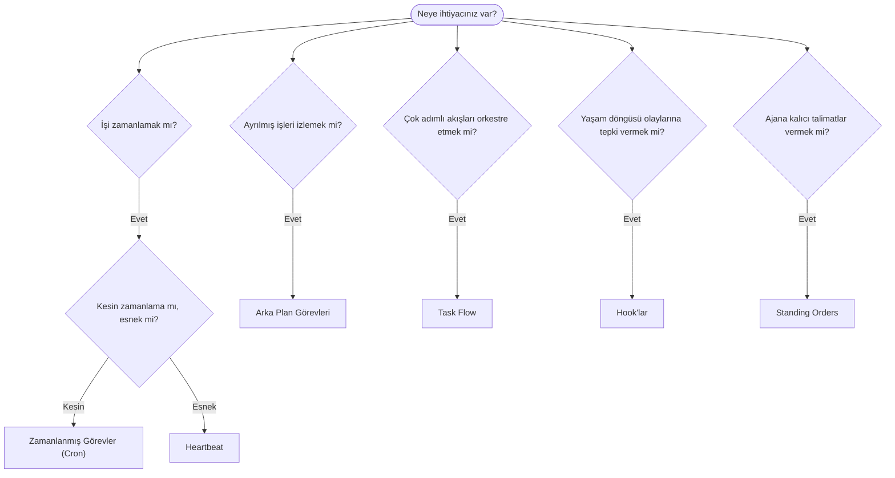

---
read_when:
    - OpenClaw ile işleri nasıl otomatikleştireceğinize karar verirken
    - Heartbeat, cron, hook'lar ve standing order'lar arasında seçim yaparken
    - Doğru otomasyon giriş noktasını ararken
summary: Görevler, cron, hook'lar, standing order'lar ve Task Flow dahil olmak üzere otomasyon mekanizmalarına genel bakış
title: Otomasyon ve Görevler
x-i18n:
    generated_at: "2026-04-05T13:42:28Z"
    model: gpt-5.4
    provider: openai
    source_hash: 13cd05dcd2f38737f7bb19243ad1136978bfd727006fd65226daa3590f823afe
    source_path: automation/index.md
    workflow: 15
---

# Otomasyon ve Görevler

OpenClaw; görevler, zamanlanmış işler, olay hook'ları ve kalıcı talimatlar aracılığıyla arka planda işler çalıştırır. Bu sayfa, doğru mekanizmayı seçmenize ve bunların nasıl birlikte çalıştığını anlamanıza yardımcı olur.

## Hızlı karar kılavuzu

| Kullanım durumu                         | Önerilen               | Neden                                            |
| --------------------------------------- | ---------------------- | ------------------------------------------------ |
| Her gün tam 09:00'da günlük rapor gönder | Zamanlanmış Görevler (Cron) | Kesin zamanlama, yalıtılmış yürütme              |
| Bana 20 dakika içinde hatırlat          | Zamanlanmış Görevler (Cron) | Kesin zamanlamalı tek seferlik çalışma (`--at`)  |
| Haftalık derin analiz çalıştır          | Zamanlanmış Görevler (Cron) | Bağımsız görev, farklı model kullanabilir        |
| Gelen kutusunu her 30 dakikada bir kontrol et | Heartbeat              | Diğer kontrollerle gruplanır, bağlam farkındalığı vardır |
| Takvimi yaklaşan etkinlikler için izle  | Heartbeat              | Periyodik farkındalık için doğal uyum sağlar     |
| Bir alt ajan veya ACP çalıştırmasının durumunu incele | Arka Plan Görevleri    | Görev kayıt defteri tüm ayrılmış işleri izler    |
| Neyin ne zaman çalıştığını denetle      | Arka Plan Görevleri    | `openclaw tasks list` ve `openclaw tasks audit`  |
| Çok adımlı araştırma yap, sonra özetle  | Task Flow              | Revizyon takibiyle dayanıklı orkestrasyon sağlar |
| Oturum sıfırlamada bir betik çalıştır   | Hook'lar               | Olay güdümlüdür, yaşam döngüsü olaylarında tetiklenir |
| Her araç çağrısında kod çalıştır        | Hook'lar               | Hook'lar olay türüne göre filtreleyebilir        |
| Yanıt vermeden önce her zaman uyumluluğu kontrol et | Standing Orders        | Her oturuma otomatik olarak enjekte edilir       |

### Zamanlanmış Görevler (Cron) ile Heartbeat karşılaştırması

| Boyut           | Zamanlanmış Görevler (Cron)         | Heartbeat                            |
| --------------- | ----------------------------------- | ------------------------------------ |
| Zamanlama       | Kesin (cron ifadeleri, tek seferlik) | Yaklaşık (varsayılan olarak her 30 dakikada bir) |
| Oturum bağlamı  | Yeni (yalıtılmış) veya paylaşılan   | Ana oturumun tam bağlamı             |
| Görev kayıtları | Her zaman oluşturulur               | Hiç oluşturulmaz                     |
| Teslimat        | Kanal, webhook veya sessiz          | Ana oturum içinde satır içi          |
| En uygun kullanım | Raporlar, hatırlatıcılar, arka plan işleri | Gelen kutusu kontrolleri, takvim, bildirimler |

Kesin zamanlama veya yalıtılmış yürütme gerektiğinde Zamanlanmış Görevler'i (Cron) kullanın. İşin tam oturum bağlamından fayda sağladığı ve yaklaşık zamanlamanın yeterli olduğu durumlarda Heartbeat kullanın.

## Temel kavramlar

### Zamanlanmış görevler (cron)

Cron, Gateway'in kesin zamanlama için yerleşik zamanlayıcısıdır. İşleri kalıcı olarak saklar, ajanı doğru zamanda uyandırır ve çıktıyı bir sohbet kanalına veya webhook uç noktasına teslim edebilir. Tek seferlik hatırlatıcıları, yinelenen ifadeleri ve gelen webhook tetikleyicilerini destekler.

Bkz. [Zamanlanmış Görevler](/automation/cron-jobs).

### Görevler

Arka plan görev kayıt defteri; ACP çalıştırmaları, alt ajan başlatmaları, yalıtılmış cron yürütmeleri ve CLI işlemleri dahil tüm ayrılmış işleri izler. Görevler zamanlayıcı değil, kayıttır. Bunları incelemek için `openclaw tasks list` ve `openclaw tasks audit` kullanın.

Bkz. [Arka Plan Görevleri](/automation/tasks).

### Task Flow

Task Flow, arka plan görevlerinin üzerindeki akış orkestrasyonu altyapısıdır. Yönetilen ve yansıtılmış senkronizasyon modları, revizyon takibi ve inceleme için `openclaw tasks flow list|show|cancel` ile dayanıklı çok adımlı akışları yönetir.

Bkz. [Task Flow](/automation/taskflow).

### Standing order'lar

Standing order'lar, ajana tanımlı programlar için kalıcı çalışma yetkisi verir. Çalışma alanı dosyalarında bulunurlar (genellikle `AGENTS.md`) ve her oturuma enjekte edilirler. Zamana bağlı uygulama için cron ile birleştirin.

Bkz. [Standing Orders](/automation/standing-orders).

### Hook'lar

Hook'lar; ajan yaşam döngüsü olayları (`/new`, `/reset`, `/stop`), oturum sıkıştırma, gateway başlangıcı, mesaj akışı ve araç çağrılarıyla tetiklenen olay güdümlü betiklerdir. Hook'lar dizinlerden otomatik olarak bulunur ve `openclaw hooks` ile yönetilebilir.

Bkz. [Hook'lar](/automation/hooks).

### Heartbeat

Heartbeat, periyodik bir ana oturum turudur (varsayılan olarak her 30 dakikada bir). Birden fazla kontrolü (gelen kutusu, takvim, bildirimler) tam oturum bağlamıyla tek bir ajan turunda toplar. Heartbeat turları görev kaydı oluşturmaz. Küçük bir kontrol listesi için `HEARTBEAT.md` kullanın veya heartbeat'in kendi içinde yalnızca zamanı gelmiş periyodik kontroller istediğinizde bir `tasks:` bloğu kullanın. Boş heartbeat dosyaları `empty-heartbeat-file` olarak atlanır; yalnızca zamanı gelen görev modu ise `no-tasks-due` olarak atlanır.

Bkz. [Heartbeat](/gateway/heartbeat).

## Birlikte nasıl çalışırlar

- **Cron**, kesin zamanlamaları (günlük raporlar, haftalık incelemeler) ve tek seferlik hatırlatıcıları yönetir. Tüm cron yürütmeleri görev kaydı oluşturur.
- **Heartbeat**, rutin izlemeyi (gelen kutusu, takvim, bildirimler) her 30 dakikada bir toplu bir turda yönetir.
- **Hook'lar**, belirli olaylara (araç çağrıları, oturum sıfırlamaları, sıkıştırma) özel betiklerle tepki verir.
- **Standing order'lar**, ajana kalıcı bağlam ve yetki sınırları sağlar.
- **Task Flow**, tek tek görevlerin üzerindeki çok adımlı akışları koordine eder.
- **Görevler**, tüm ayrılmış işleri otomatik olarak izler; böylece bunları inceleyebilir ve denetleyebilirsiniz.

## İlgili

- [Zamanlanmış Görevler](/automation/cron-jobs) — kesin zamanlama ve tek seferlik hatırlatıcılar
- [Arka Plan Görevleri](/automation/tasks) — tüm ayrılmış işler için görev kayıt defteri
- [Task Flow](/automation/taskflow) — dayanıklı çok adımlı akış orkestrasyonu
- [Hook'lar](/automation/hooks) — olay güdümlü yaşam döngüsü betikleri
- [Standing Orders](/automation/standing-orders) — kalıcı ajan talimatları
- [Heartbeat](/gateway/heartbeat) — periyodik ana oturum turları
- [Yapılandırma Başvurusu](/gateway/configuration-reference) — tüm yapılandırma anahtarları
