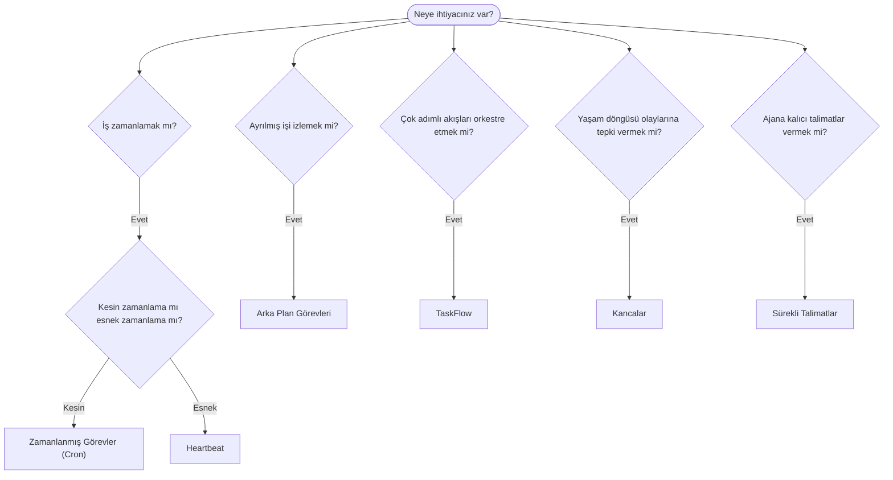

---
read_when:
    - OpenClaw ile işin nasıl otomatikleştirileceğine karar verme
    - Heartbeat, Cron, kancalar ve sürekli talimatlar arasında seçim yapma
    - Doğru otomasyon başlangıç noktasını arama
summary: 'Otomasyon mekanizmalarına genel bakış: görevler, cron, kancalar, sürekli talimatlar ve TaskFlow'
title: Otomasyon ve görevler
x-i18n:
    generated_at: "2026-04-24T08:57:10Z"
    model: gpt-5.4
    provider: openai
    source_hash: 1b4615cc05a6d0ef7c92f44072d11a2541bc5e17b7acb88dc27ddf0c36b2dcab
    source_path: automation/index.md
    workflow: 15
---

OpenClaw, görevler, zamanlanmış işler, olay kancaları ve kalıcı talimatlar aracılığıyla arka planda işleri yürütür. Bu sayfa, doğru mekanizmayı seçmenize ve bunların nasıl birlikte çalıştığını anlamanıza yardımcı olur.

## Hızlı karar kılavuzu

| Kullanım durumu                          | Önerilen               | Neden                                            |
| ---------------------------------------- | ---------------------- | ------------------------------------------------ |
| Günlük raporu tam sabah 9'da gönder      | Zamanlanmış Görevler (Cron) | Kesin zamanlama, yalıtılmış yürütme          |
| Bana 20 dakika içinde hatırlat           | Zamanlanmış Görevler (Cron) | Kesin zamanlamalı tek seferlik (`--at`)      |
| Haftalık derin analiz çalıştır           | Zamanlanmış Görevler (Cron) | Bağımsız görev, farklı model kullanabilir    |
| Gelen kutusunu her 30 dakikada kontrol et | Heartbeat              | Diğer kontrollerle toplu çalışır, bağlam farkındalığı vardır |
| Takvimde yaklaşan etkinlikleri izle      | Heartbeat              | Periyodik farkındalık için doğal uyum            |
| Bir alt ajan veya ACP çalışmasının durumunu incele | Arka Plan Görevleri | Görev kaydı tüm ayrılmış işleri izler            |
| Neyin ne zaman çalıştığını denetle       | Arka Plan Görevleri    | `openclaw tasks list` ve `openclaw tasks audit`  |
| Çok adımlı araştırma yapıp sonra özetle  | TaskFlow               | Revizyon takibiyle kalıcı orkestrasyon           |
| Oturum sıfırlamada bir betik çalıştır    | Kancalar               | Olay güdümlüdür, yaşam döngüsü olaylarında tetiklenir |
| Her araç çağrısında kod yürüt            | Kancalar               | Kancalar olay türüne göre filtreleyebilir        |
| Yanıtlamadan önce her zaman uyumluluğu kontrol et | Sürekli Talimatlar | Her oturuma otomatik olarak enjekte edilir       |

### Zamanlanmış Görevler (Cron) ve Heartbeat karşılaştırması

| Boyut           | Zamanlanmış Görevler (Cron)         | Heartbeat                            |
| --------------- | ----------------------------------- | ------------------------------------ |
| Zamanlama       | Kesin (cron ifadeleri, tek seferlik) | Yaklaşık (varsayılan olarak her 30 dk) |
| Oturum bağlamı  | Yeni (yalıtılmış) veya paylaşımlı   | Tam ana oturum bağlamı               |
| Görev kayıtları | Her zaman oluşturulur               | Asla oluşturulmaz                    |
| Teslimat        | Kanal, Webhook veya sessiz          | Ana oturum içinde satır içi          |
| En uygun kullanım | Raporlar, hatırlatıcılar, arka plan işleri | Gelen kutusu kontrolleri, takvim, bildirimler |

Kesin zamanlamaya veya yalıtılmış yürütmeye ihtiyacınız olduğunda Zamanlanmış Görevler (Cron) kullanın. İş tam oturum bağlamından faydalanıyorsa ve yaklaşık zamanlama yeterliyse Heartbeat kullanın.

## Temel kavramlar

### Zamanlanmış görevler (cron)

Cron, Gateway'in kesin zamanlama için yerleşik zamanlayıcısıdır. İşleri kalıcı olarak saklar, ajanı doğru zamanda uyandırır ve çıktıyı bir sohbet kanalına veya Webhook uç noktasına iletebilir. Tek seferlik hatırlatıcıları, yinelenen ifadeleri ve gelen Webhook tetikleyicilerini destekler.

Bkz. [Zamanlanmış Görevler](/tr/automation/cron-jobs).

### Görevler

Arka plan görev kaydı, tüm ayrılmış işleri izler: ACP çalışmaları, alt ajan başlatmaları, yalıtılmış cron yürütmeleri ve CLI işlemleri. Görevler zamanlayıcı değil, kayıttır. Bunları incelemek için `openclaw tasks list` ve `openclaw tasks audit` kullanın.

Bkz. [Arka Plan Görevleri](/tr/automation/tasks).

### TaskFlow

TaskFlow, arka plan görevlerinin üzerindeki akış orkestrasyonu katmanıdır. Yönetilen ve yansıtılmış eşzamanlama modları, revizyon takibi ve inceleme için `openclaw tasks flow list|show|cancel` ile kalıcı çok adımlı akışları yönetir.

Bkz. [TaskFlow](/tr/automation/taskflow).

### Sürekli talimatlar

Sürekli talimatlar, belirli programlar için ajana kalıcı çalışma yetkisi verir. Çalışma alanı dosyalarında bulunurlar (`AGENTS.md` tipik örnektir) ve her oturuma enjekte edilirler. Zaman tabanlı uygulama için cron ile birleştirin.

Bkz. [Sürekli Talimatlar](/tr/automation/standing-orders).

### Kancalar

Kancalar; ajan yaşam döngüsü olayları (`/new`, `/reset`, `/stop`), oturum Compaction, Gateway başlatma, mesaj akışı ve araç çağrıları tarafından tetiklenen olay güdümlü betiklerdir. Kancalar dizinlerden otomatik olarak keşfedilir ve `openclaw hooks` ile yönetilebilir.

Bkz. [Kancalar](/tr/automation/hooks).

### Heartbeat

Heartbeat, periyodik bir ana oturum dönüşüdür (varsayılan olarak her 30 dakikada bir). Birden çok kontrolü (gelen kutusu, takvim, bildirimler) tam oturum bağlamıyla tek bir ajan dönüşünde toplar. Heartbeat dönüşleri görev kaydı oluşturmaz. Küçük bir kontrol listesi için `HEARTBEAT.md`, heartbeat içinde yalnızca zamanı gelen periyodik kontroller istediğinizde ise `tasks:` bloğunu kullanın. Boş heartbeat dosyaları `empty-heartbeat-file` olarak atlanır; yalnızca zamanı gelen görev modu ise `no-tasks-due` olarak atlanır.

Bkz. [Heartbeat](/tr/gateway/heartbeat).

## Birlikte nasıl çalışırlar

- **Cron**, kesin zamanlamaları (günlük raporlar, haftalık değerlendirmeler) ve tek seferlik hatırlatıcıları yönetir. Tüm cron yürütmeleri görev kaydı oluşturur.
- **Heartbeat**, rutin izlemeyi (gelen kutusu, takvim, bildirimler) her 30 dakikada bir tek bir toplu dönüşte yönetir.
- **Kancalar**, özel betiklerle belirli olaylara (araç çağrıları, oturum sıfırlamaları, Compaction) tepki verir.
- **Sürekli talimatlar**, ajana kalıcı bağlam ve yetki sınırları verir.
- **TaskFlow**, tekil görevlerin üzerindeki çok adımlı akışları koordine eder.
- **Görevler**, inceleyip denetleyebilmeniz için tüm ayrılmış işleri otomatik olarak izler.

## İlgili

- [Zamanlanmış Görevler](/tr/automation/cron-jobs) — kesin zamanlama ve tek seferlik hatırlatıcılar
- [Arka Plan Görevleri](/tr/automation/tasks) — tüm ayrılmış işler için görev kaydı
- [TaskFlow](/tr/automation/taskflow) — kalıcı çok adımlı akış orkestrasyonu
- [Kancalar](/tr/automation/hooks) — olay güdümlü yaşam döngüsü betikleri
- [Sürekli Talimatlar](/tr/automation/standing-orders) — kalıcı ajan talimatları
- [Heartbeat](/tr/gateway/heartbeat) — periyodik ana oturum dönüşleri
- [Yapılandırma Başvurusu](/tr/gateway/configuration-reference) — tüm yapılandırma anahtarları
