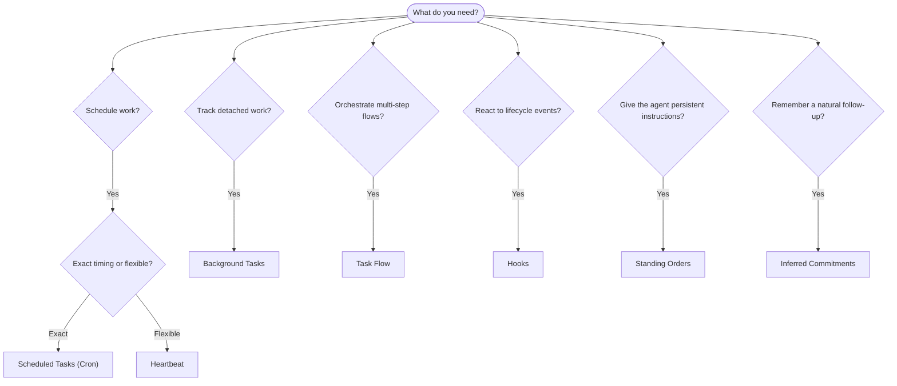

---
read_when:
    - OpenClaw ile işleri nasıl otomatikleştireceğinize karar verme
    - Heartbeat, Cron, taahhütler, kancalar ve kalıcı talimatlar arasında seçim yapma
    - Doğru otomasyon giriş noktasını bulma
summary: 'Otomasyon mekanizmalarına genel bakış: görevler, Cron, hook''lar, standing order''lar ve Task Flow'
title: Otomasyon ve görevler
x-i18n:
    generated_at: "2026-05-06T09:02:21Z"
    model: gpt-5.5
    provider: openai
    source_hash: ee7f34fa4840c0e43e50d09e415b2529ef0c8bc3ccb6e3546b8a873c9458832d
    source_path: automation/index.md
    workflow: 16
---

OpenClaw, görevler, zamanlanmış işler, çıkarılan taahhütler, olay hook’ları ve kalıcı talimatlar aracılığıyla işleri arka planda çalıştırır. Bu sayfa, doğru mekanizmayı seçmenize ve bunların birlikte nasıl çalıştığını anlamanıza yardımcı olur.

## Hızlı karar kılavuzu

| Kullanım durumu                                  | Önerilen                | Neden                                            |
| ------------------------------------------------ | ----------------------- | ------------------------------------------------ |
| Günlük raporu tam 09:00’da gönder                | Zamanlanmış Görevler (Cron) | Kesin zamanlama, yalıtılmış yürütme              |
| Bana 20 dakika sonra hatırlat                    | Zamanlanmış Görevler (Cron) | Kesin zamanlamalı tek seferlik iş (`--at`)       |
| Haftalık derin analiz çalıştır                   | Zamanlanmış Görevler (Cron) | Bağımsız görev, farklı model kullanabilir        |
| Gelen kutusunu her 30 dakikada bir kontrol et    | Heartbeat               | Diğer kontrollerle toplu çalışır, bağlam farkındadır |
| Yaklaşan etkinlikler için takvimi izle           | Heartbeat               | Periyodik farkındalık için doğal uyum            |
| Bahsedilen bir görüşmeden sonra kontrol et       | Çıkarılan Taahhütler    | Bellek benzeri takip, kesin hatırlatma isteği yok |
| Kullanıcı bağlamından sonra nazik ilgi kontrolü  | Çıkarılan Taahhütler    | Aynı ajana ve kanala kapsamlanır                 |
| Bir alt ajanın veya ACP çalışmasının durumunu incele | Arka Plan Görevleri | Görev defteri tüm ayrılmış işleri izler          |
| Neyin ne zaman çalıştığını denetle               | Arka Plan Görevleri     | `openclaw tasks list` ve `openclaw tasks audit`  |
| Çok adımlı araştırma yap ve sonra özetle         | Task Flow               | Revizyon izlemeli dayanıklı orkestrasyon         |
| Oturum sıfırlamada bir betik çalıştır            | Hook’lar                | Olay odaklıdır, yaşam döngüsü olaylarında tetiklenir |
| Her araç çağrısında kod yürüt                    | Plugin hook’ları        | Süreç içi hook’lar araç çağrılarını yakalayabilir |
| Yanıtlamadan önce her zaman uyumluluğu kontrol et | Kalıcı Emirler         | Her oturuma otomatik olarak enjekte edilir       |

### Zamanlanmış Görevler (Cron) ve Heartbeat

| Boyut           | Zamanlanmış Görevler (Cron)         | Heartbeat                             |
| --------------- | ----------------------------------- | ------------------------------------- |
| Zamanlama       | Kesin (cron ifadeleri, tek seferlik) | Yaklaşık (varsayılan her 30 dakikada bir) |
| Oturum bağlamı  | Taze (yalıtılmış) veya paylaşılan   | Tam ana oturum bağlamı                |
| Görev kayıtları | Her zaman oluşturulur               | Asla oluşturulmaz                     |
| Teslim          | Kanal, webhook veya sessiz          | Ana oturum içinde satır içi           |
| En uygun olduğu işler | Raporlar, hatırlatmalar, arka plan işleri | Gelen kutusu kontrolleri, takvim, bildirimler |

Kesin zamanlamaya veya yalıtılmış yürütmeye ihtiyacınız olduğunda Zamanlanmış Görevler’i (Cron) kullanın. İş tam oturum bağlamından yararlanıyorsa ve yaklaşık zamanlama yeterliyse Heartbeat kullanın.

## Temel kavramlar

### Zamanlanmış görevler (cron)

Cron, kesin zamanlama için Gateway’in yerleşik zamanlayıcısıdır. İşleri kalıcı hale getirir, ajanı doğru zamanda uyandırır ve çıktıyı bir sohbet kanalına veya webhook uç noktasına teslim edebilir. Tek seferlik hatırlatmaları, yinelenen ifadeleri ve gelen webhook tetikleyicilerini destekler.

Bkz. [Zamanlanmış Görevler](/tr/automation/cron-jobs).

### Görevler

Arka plan görev defteri tüm ayrılmış işleri izler: ACP çalışmaları, alt ajan başlatmaları, yalıtılmış cron yürütmeleri ve CLI işlemleri. Görevler kayıttır, zamanlayıcı değildir. Bunları incelemek için `openclaw tasks list` ve `openclaw tasks audit` kullanın.

Bkz. [Arka Plan Görevleri](/tr/automation/tasks).

### Çıkarılan taahhütler

Taahhütler, isteğe bağlı, kısa ömürlü takip bellekleridir. OpenClaw bunları normal konuşmalardan çıkarır, aynı ajana ve kanala kapsamlar ve zamanı gelen kontrolleri Heartbeat üzerinden teslim eder. Kullanıcının kesin olarak istediği hatırlatmalar hâlâ cron’a aittir.

Bkz. [Çıkarılan Taahhütler](/tr/concepts/commitments).

### Task Flow

Task Flow, arka plan görevlerinin üzerindeki akış orkestrasyonu altyapısıdır. Yönetilen ve yansıtılan eşitleme modları, revizyon izleme ve inceleme için `openclaw tasks flow list|show|cancel` ile dayanıklı çok adımlı akışları yönetir.

Bkz. [Task Flow](/tr/automation/taskflow).

### Kalıcı emirler

Kalıcı emirler, tanımlı programlar için ajana kalıcı işletim yetkisi verir. Çalışma alanı dosyalarında (genellikle `AGENTS.md`) bulunur ve her oturuma enjekte edilir. Zamana dayalı yaptırım için cron ile birleştirin.

Bkz. [Kalıcı Emirler](/tr/automation/standing-orders).

### Hook’lar

Dahili hook’lar, ajan yaşam döngüsü olayları (`/new`, `/reset`, `/stop`), oturum Compaction’ı, Gateway başlatma ve mesaj akışı tarafından tetiklenen olay odaklı betiklerdir. Dizinlerden otomatik olarak keşfedilir ve `openclaw hooks` ile yönetilebilir. Süreç içi araç çağrısı yakalama için [Plugin hook’ları](/tr/plugins/hooks) kullanın.

Bkz. [Hook’lar](/tr/automation/hooks).

### Heartbeat

Heartbeat, periyodik bir ana oturum turudur (varsayılan her 30 dakikada bir). Birden fazla kontrolü (gelen kutusu, takvim, bildirimler) tam oturum bağlamıyla tek bir ajan turunda toplar. Heartbeat turları görev kaydı oluşturmaz ve günlük/boşta oturum sıfırlama tazeliğini uzatmaz. Küçük bir kontrol listesi için `HEARTBEAT.md` kullanın veya yalnızca zamanı gelen periyodik kontrolleri Heartbeat içinde istiyorsanız bir `tasks:` bloğu kullanın. Boş Heartbeat dosyaları `empty-heartbeat-file` olarak atlanır; yalnızca zamanı gelen görev modu `no-tasks-due` olarak atlanır. Heartbeat’ler, cron işi etkin veya kuyruğa alınmışken ertelenir ve `heartbeat.skipWhenBusy`, alt ajan veya iç içe şeritler meşgulken de bunları erteleyebilir.

Bkz. [Heartbeat](/tr/gateway/heartbeat).

## Birlikte nasıl çalışırlar

- **Cron**, kesin zamanlamaları (günlük raporlar, haftalık gözden geçirmeler) ve tek seferlik hatırlatmaları yönetir. Tüm cron yürütmeleri görev kayıtları oluşturur.
- **Heartbeat**, rutin izlemeyi (gelen kutusu, takvim, bildirimler) her 30 dakikada bir tek toplu turda yönetir.
- **Hook’lar**, belirli olaylara (oturum sıfırlamaları, Compaction, mesaj akışı) özel betiklerle tepki verir. Plugin hook’ları araç çağrılarını kapsar.
- **Kalıcı emirler**, ajana kalıcı bağlam ve yetki sınırları verir.
- **Task Flow**, tek tek görevlerin üzerindeki çok adımlı akışları koordine eder.
- **Görevler**, tüm ayrılmış işleri otomatik olarak izler; böylece bunları inceleyebilir ve denetleyebilirsiniz.

## İlgili

- [Zamanlanmış Görevler](/tr/automation/cron-jobs) — kesin zamanlama ve tek seferlik hatırlatmalar
- [Çıkarılan Taahhütler](/tr/concepts/commitments) — bellek benzeri takip kontrolleri
- [Arka Plan Görevleri](/tr/automation/tasks) — tüm ayrılmış işler için görev defteri
- [Task Flow](/tr/automation/taskflow) — dayanıklı çok adımlı akış orkestrasyonu
- [Hook’lar](/tr/automation/hooks) — olay odaklı yaşam döngüsü betikleri
- [Plugin hook’ları](/tr/plugins/hooks) — süreç içi araç, istem, mesaj ve yaşam döngüsü hook’ları
- [Kalıcı Emirler](/tr/automation/standing-orders) — kalıcı ajan talimatları
- [Heartbeat](/tr/gateway/heartbeat) — periyodik ana oturum turları
- [Yapılandırma Başvurusu](/tr/gateway/configuration-reference) — tüm yapılandırma anahtarları
