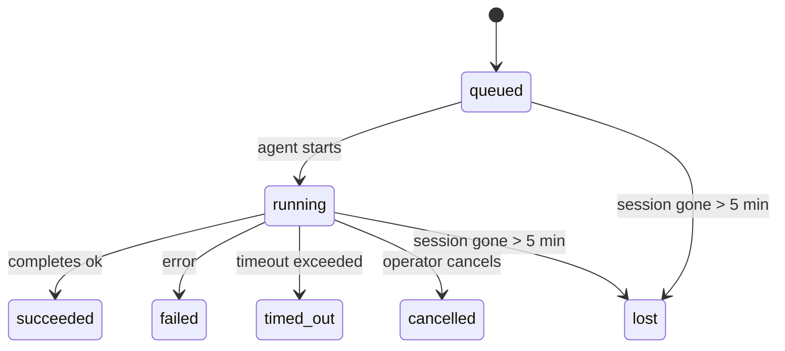

---
read_when:
    - Devam eden veya yakın zamanda tamamlanan arka plan işlerinin incelenmesi
    - Ayrılmış aracı çalıştırmaları için teslimat hatalarının ayıklanması
    - Arka plan çalıştırmalarının oturumlar, Cron ve Heartbeat ile nasıl ilişkili olduğunu anlama
sidebarTitle: Background tasks
summary: ACP çalıştırmaları, alt aracılar, izole Cron işleri ve CLI işlemleri için arka plan görev takibi
title: Arka plan görevleri
x-i18n:
    generated_at: "2026-04-26T11:22:54Z"
    model: gpt-5.4
    provider: openai
    source_hash: 46952a378babdee9f43102bfa71dbd35b6ca7ecb142ffce3785eeb479e19d6b6
    source_path: automation/tasks.md
    workflow: 15
---

<Note>
Zamanlama mı arıyorsunuz? Doğru mekanizmayı seçmek için [Automation & Tasks](/tr/automation) sayfasına bakın. Bu sayfa arka plan işlerini **izlemeyi** kapsar, zamanlamayı değil.
</Note>

Arka plan görevleri, **ana konuşma oturumunuzun dışında** çalışan işleri izler: ACP çalıştırmaları, alt aracı başlatmaları, izole Cron işi yürütmeleri ve CLI tarafından başlatılan işlemler.

Görevler oturumların, Cron işlerinin veya Heartbeat'lerin yerini **almaz** — bunlar, ayrılmış işlerin ne zaman gerçekleştiğini ve başarılı olup olmadığını kaydeden **etkinlik defteri**dir.

<Note>
Her aracı çalıştırması bir görev oluşturmaz. Heartbeat dönüşleri ve normal etkileşimli sohbet oluşturmaz. Tüm Cron yürütmeleri, ACP başlatmaları, alt aracı başlatmaları ve CLI aracı komutları oluşturur.
</Note>

## Kısaca

- Görevler zamanlayıcı değil, **kayıtlardır** — işin _ne zaman_ çalışacağını Cron ve Heartbeat belirler, _ne olduğunu_ görevler izler.
- ACP, alt aracılar, tüm Cron işleri ve CLI işlemleri görev oluşturur. Heartbeat dönüşleri oluşturmaz.
- Her görev `queued → running → terminal` (succeeded, failed, timed_out, cancelled veya lost) akışından geçer.
- Cron görevleri, Cron çalışma zamanı işi hâlâ sahipleniyorken canlı kalır; bellek içi çalışma zamanı durumu kaybolmuşsa, görev bakımı bir görevi lost olarak işaretlemeden önce önce kalıcı Cron çalıştırma geçmişini kontrol eder.
- Tamamlanma push odaklıdır: ayrılmış iş doğrudan bildirim yapabilir veya bittiğinde istekte bulunan oturumu/Heartbeat'i uyandırabilir; bu yüzden durum yoklama döngüleri genellikle doğru yaklaşım değildir.
- İzole Cron çalıştırmaları ve alt aracı tamamlanmaları, son temizleme muhasebesinden önce, alt oturumları için izlenen tarayıcı sekmelerini/süreçlerini mümkün olan en iyi şekilde temizler.
- İzole Cron teslimi, alt aracı soyundan gelen işler hâlâ boşalırken eski ara üst yanıtları bastırır ve teslimden önce ulaşırsa son alt çıktılarını tercih eder.
- Tamamlanma bildirimleri doğrudan bir kanala iletilir veya bir sonraki Heartbeat için kuyruğa alınır.
- `openclaw tasks list` tüm görevleri gösterir; `openclaw tasks audit` sorunları ortaya çıkarır.
- Terminal kayıtları 7 gün tutulur, ardından otomatik olarak temizlenir.

## Hızlı başlangıç

<Tabs>
  <Tab title="Listele ve filtrele">
    ```bash
    # Tüm görevleri listele (en yeniden en eskiye)
    openclaw tasks list

    # Çalışma zamanı veya duruma göre filtrele
    openclaw tasks list --runtime acp
    openclaw tasks list --status running
    ```

  </Tab>
  <Tab title="İncele">
    ```bash
    # Belirli bir görev için ayrıntıları göster (kimlik, çalıştırma kimliği veya oturum anahtarı ile)
    openclaw tasks show <lookup>
    ```
  </Tab>
  <Tab title="İptal et ve bildir">
    ```bash
    # Çalışan bir görevi iptal et (alt oturumu sonlandırır)
    openclaw tasks cancel <lookup>

    # Bir görev için bildirim ilkesini değiştir
    openclaw tasks notify <lookup> state_changes
    ```

  </Tab>
  <Tab title="Denetim ve bakım">
    ```bash
    # Sağlık denetimi çalıştır
    openclaw tasks audit

    # Bakımı önizle veya uygula
    openclaw tasks maintenance
    openclaw tasks maintenance --apply
    ```

  </Tab>
  <Tab title="Görev akışı">
    ```bash
    # TaskFlow durumunu incele
    openclaw tasks flow list
    openclaw tasks flow show <lookup>
    openclaw tasks flow cancel <lookup>
    ```
  </Tab>
</Tabs>

## Hangi durumlar görev oluşturur

| Kaynak                | Çalışma zamanı türü | Görev kaydının oluşturulduğu an                        | Varsayılan bildirim ilkesi |
| --------------------- | ------------------- | ------------------------------------------------------ | -------------------------- |
| ACP arka plan çalıştırmaları | `acp`               | Alt ACP oturumu başlatılırken                          | `done_only`                |
| Alt aracı orkestrasyonu | `subagent`          | `sessions_spawn` ile alt aracı başlatılırken           | `done_only`                |
| Cron işleri (tüm türler) | `cron`              | Her Cron yürütmesinde (ana oturum ve izole)            | `silent`                   |
| CLI işlemleri         | `cli`               | Gateway üzerinden çalışan `openclaw agent` komutları   | `silent`                   |
| Aracı medya işleri    | `cli`               | Oturum destekli `video_generate` çalıştırmaları        | `silent`                   |

<AccordionGroup>
  <Accordion title="Cron ve medya için bildirim varsayılanları">
    Ana oturum Cron görevleri varsayılan olarak `silent` bildirim ilkesi kullanır — izleme için kayıt oluştururlar ancak bildirim üretmezler. İzole Cron görevleri de varsayılan olarak `silent` kullanır, ancak kendi oturumlarında çalıştıkları için daha görünürdür.

    Oturum destekli `video_generate` çalıştırmaları da `silent` bildirim ilkesi kullanır. Yine de görev kaydı oluştururlar, ancak tamamlanma orijinal aracı oturumuna dahili bir uyandırma olarak geri verilir; böylece aracı takip mesajını yazabilir ve tamamlanan videoyu kendisi ekleyebilir. `tools.media.asyncCompletion.directSend` seçeneğini etkinleştirirseniz, eşzamansız `music_generate` ve `video_generate` tamamlanmaları, istekte bulunan oturumun uyandırma yoluna geri dönmeden önce önce doğrudan kanal teslimini dener.

  </Accordion>
  <Accordion title="Eşzamanlı video_generate koruması">
    Oturum destekli bir `video_generate` görevi hâlâ etkin durumdayken, araç aynı zamanda bir koruma olarak davranır: aynı oturumda yinelenen `video_generate` çağrıları, ikinci bir eşzamanlı üretimi başlatmak yerine etkin görev durumunu döndürür. Aracı tarafında açık bir ilerleme/durum sorgulaması istediğinizde `action: "status"` kullanın.
  </Accordion>
  <Accordion title="Hangi durumlar görev oluşturmaz">
    - Heartbeat dönüşleri — ana oturum; bkz. [Heartbeat](/tr/gateway/heartbeat)
    - Normal etkileşimli sohbet dönüşleri
    - Doğrudan `/command` yanıtları
  </Accordion>
</AccordionGroup>

## Görev yaşam döngüsü



| Durum       | Anlamı                                                                     |
| ----------- | -------------------------------------------------------------------------- |
| `queued`    | Oluşturuldu, aracının başlaması bekleniyor                                 |
| `running`   | Aracı dönüşü etkin olarak yürütülüyor                                      |
| `succeeded` | Başarıyla tamamlandı                                                       |
| `failed`    | Bir hatayla tamamlandı                                                     |
| `timed_out` | Yapılandırılmış zaman aşımı aşıldı                                         |
| `cancelled` | Operatör tarafından `openclaw tasks cancel` ile durduruldu                 |
| `lost`      | Çalışma zamanı, 5 dakikalık bir ek süreden sonra yetkili arka durumu kaybetti |

Geçişler otomatik olarak gerçekleşir — ilişkili aracı çalıştırması bittiğinde görev durumu buna göre güncellenir.

Etkin görev kayıtlarında aracı çalıştırmasının tamamlanması yetkilidir. Başarılı bir ayrılmış çalıştırma `succeeded` olarak sonlanır, normal çalıştırma hataları `failed` olarak sonlanır ve zaman aşımı veya iptal sonuçları `timed_out` olarak sonlanır. Bir operatör görevi zaten iptal ettiyse veya çalışma zamanı `failed`, `timed_out` ya da `lost` gibi daha güçlü bir terminal durumu zaten kaydettiyse, daha sonra gelen bir başarı sinyali bu terminal durumu düşürmez.

`lost` çalışma zamanına duyarlıdır:

- ACP görevleri: arka plandaki ACP alt oturum meta verisi kayboldu.
- Alt aracı görevleri: arka plandaki alt oturum hedef aracı deposundan kayboldu.
- Cron görevleri: Cron çalışma zamanı artık işi etkin olarak izlemiyor ve kalıcı Cron çalıştırma geçmişi bu çalıştırma için terminal bir sonuç göstermiyor. Çevrimdışı CLI denetimi, kendi boş süreç içi Cron çalışma zamanı durumunu yetkili kabul etmez.
- CLI görevleri: izole alt oturum görevleri alt oturumu kullanır; sohbet destekli CLI görevleri ise bunun yerine canlı çalıştırma bağlamını kullanır, bu nedenle kalan kanal/grup/doğrudan oturum satırları onları canlı tutmaz. Gateway destekli `openclaw agent` çalıştırmaları da çalıştırma sonucundan sonlanır, bu nedenle tamamlanan çalıştırmalar, temizleyici onları `lost` olarak işaretleyene kadar etkin durumda kalmaz.

## Teslim ve bildirimler

Bir görev terminal duruma ulaştığında OpenClaw sizi bilgilendirir. İki teslim yolu vardır:

**Doğrudan teslim** — görevin bir kanal hedefi varsa (`requesterOrigin`), tamamlanma mesajı doğrudan o kanala gider (Telegram, Discord, Slack vb.). Alt aracı tamamlanmaları için OpenClaw, mevcut olduğunda bağlı ileti dizisi/konu yönlendirmesini de korur ve doğrudan teslimden vazgeçmeden önce istekte bulunan oturumun kayıtlı rotasından (`lastChannel` / `lastTo` / `lastAccountId`) eksik bir `to` / hesabı doldurabilir.

**Oturum kuyruğuna alınmış teslim** — doğrudan teslim başarısız olursa veya kaynak ayarlanmadıysa, güncelleme istekte bulunan oturumda bir sistem olayı olarak kuyruğa alınır ve bir sonraki Heartbeat'te görünür.

<Tip>
Görev tamamlanması anında bir Heartbeat uyandırmasını tetikler; böylece sonucu hızlıca görürsünüz — bir sonraki zamanlanmış Heartbeat tikini beklemeniz gerekmez.
</Tip>

Bu, olağan iş akışının push tabanlı olduğu anlamına gelir: ayrılmış işi bir kez başlatın, sonra çalışma zamanının tamamlandığında sizi uyandırmasına veya bilgilendirmesine izin verin. Görev durumunu yalnızca hata ayıklama, müdahale veya açık bir denetim gerektiğinde yoklayın.

### Bildirim ilkeleri

Her görev hakkında ne kadar bilgi alacağınızı kontrol edin:

| İlke                 | Teslim edilen içerik                                                      |
| -------------------- | ------------------------------------------------------------------------- |
| `done_only` (varsayılan) | Yalnızca terminal durum (succeeded, failed vb.) — **varsayılan budur** |
| `state_changes`      | Her durum geçişi ve ilerleme güncellemesi                                 |
| `silent`             | Hiçbir şey                                                               |

Bir görev çalışırken ilkeyi değiştirin:

```bash
openclaw tasks notify <lookup> state_changes
```

## CLI referansı

<AccordionGroup>
  <Accordion title="tasks list">
    ```bash
    openclaw tasks list [--runtime <acp|subagent|cron|cli>] [--status <status>] [--json]
    ```

    Çıktı sütunları: Görev Kimliği, Tür, Durum, Teslim, Çalıştırma Kimliği, Alt Oturum, Özet.

  </Accordion>
  <Accordion title="tasks show">
    ```bash
    openclaw tasks show <lookup>
    ```

    Arama belirteci bir görev kimliğini, çalıştırma kimliğini veya oturum anahtarını kabul eder. Zamanlama, teslim durumu, hata ve terminal özet dahil olmak üzere tam kaydı gösterir.

  </Accordion>
  <Accordion title="tasks cancel">
    ```bash
    openclaw tasks cancel <lookup>
    ```

    ACP ve alt aracı görevleri için bu, alt oturumu sonlandırır. CLI ile izlenen görevler için iptal görev kaydına işlenir (ayrı bir alt çalışma zamanı tanıtıcısı yoktur). Durum `cancelled` olarak değişir ve uygun olduğunda bir teslim bildirimi gönderilir.

  </Accordion>
  <Accordion title="tasks notify">
    ```bash
    openclaw tasks notify <lookup> <done_only|state_changes|silent>
    ```
  </Accordion>
  <Accordion title="tasks audit">
    ```bash
    openclaw tasks audit [--json]
    ```

    Operasyonel sorunları ortaya çıkarır. Sorunlar tespit edildiğinde bulgular `openclaw status` içinde de görünür.

    | Bulgu                     | Önem derecesi | Tetikleyici                                                                                                  |
    | ------------------------- | ------------- | ------------------------------------------------------------------------------------------------------------ |
    | `stale_queued`            | warn          | 10 dakikadan uzun süredir kuyrukta                                                                            |
    | `stale_running`           | error         | 30 dakikadan uzun süredir çalışıyor                                                                           |
    | `lost`                    | warn/error    | Çalışma zamanı destekli görev sahipliği kayboldu; elde tutulan lost görevler `cleanupAfter` zamanına kadar uyarı verir, sonrasında hata olur |
    | `delivery_failed`         | warn          | Teslim başarısız oldu ve bildirim ilkesi `silent` değil                                                       |
    | `missing_cleanup`         | warn          | Temizleme zaman damgası olmayan terminal görev                                                                |
    | `inconsistent_timestamps` | warn          | Zaman çizelgesi ihlali (örneğin, bitişin başlangıçtan önce olması)                                            |

  </Accordion>
  <Accordion title="tasks maintenance">
    ```bash
    openclaw tasks maintenance [--json]
    openclaw tasks maintenance --apply [--json]
    ```

    Bunu görevler ve TaskFlow durumu için uzlaştırma, temizleme damgalama ve budamayı önizlemek veya uygulamak için kullanın.

    Uzlaştırma çalışma zamanına duyarlıdır:

    - ACP/alt aracı görevleri, arka plandaki alt oturumlarını kontrol eder.
    - Cron görevleri, önce Cron çalışma zamanının işe hâlâ sahip olup olmadığını kontrol eder, ardından `lost` durumuna düşmeden önce kalıcı Cron çalıştırma günlüklerinden/iş durumundan terminal durumu kurtarır. Bellek içi Cron etkin iş kümesi için yalnızca Gateway süreci yetkilidir; çevrimdışı CLI denetimi kalıcı geçmişi kullanır, ancak yalnızca yerel `Set` boş diye bir Cron görevini lost olarak işaretlemez.
    - Sohbet destekli CLI görevleri, yalnızca sohbet oturum satırını değil, sahip olan canlı çalıştırma bağlamını kontrol eder.

    Tamamlanma temizliği de çalışma zamanına duyarlıdır:

    - Alt aracı tamamlanması, duyuru temizliği devam etmeden önce alt oturum için izlenen tarayıcı sekmelerini/süreçlerini mümkün olan en iyi şekilde kapatır.
    - İzole Cron tamamlanması, çalıştırma tamamen kapatılmadan önce Cron oturumu için izlenen tarayıcı sekmelerini/süreçlerini mümkün olan en iyi şekilde kapatır.
    - İzole Cron teslimi, gerektiğinde alt aracı soyundan gelen takip işlerinin tamamlanmasını bekler ve eski üst onay metnini duyurmak yerine bastırır.
    - Alt aracı tamamlanma teslimi, en son görünen yardımcı metnini tercih eder; bu boşsa, temizlenmiş en son tool/toolResult metnine geri döner ve yalnızca zaman aşımına uğramış tool çağrısı çalıştırmaları kısa bir kısmi ilerleme özetine indirgenebilir. Terminal failed çalıştırmalar, yakalanmış yanıt metnini yeniden oynatmadan başarısızlık durumunu duyurur.
    - Temizleme hataları gerçek görev sonucunu maskelemez.

  </Accordion>
  <Accordion title="tasks flow list | show | cancel">
    ```bash
    openclaw tasks flow list [--status <status>] [--json]
    openclaw tasks flow show <lookup> [--json]
    openclaw tasks flow cancel <lookup>
    ```

    Bunları, tek bir arka plan görev kaydından çok, ilgilendiğiniz şey orkestrasyonu yapan TaskFlow olduğunda kullanın.

  </Accordion>
</AccordionGroup>

## Sohbet görev panosu (`/tasks`)

Oturuma bağlı arka plan görevlerini görmek için herhangi bir sohbet oturumunda `/tasks` kullanın. Pano; etkin ve yakın zamanda tamamlanmış görevleri çalışma zamanı, durum, zamanlama ve ilerleme veya hata ayrıntısıyla gösterir.

Geçerli oturumda görünür bağlı görev yoksa, `/tasks` diğer oturum ayrıntılarını sızdırmadan yine de genel bir görünüm alabilmeniz için aracı-yerel görev sayılarına geri döner.

Tam operatör defteri için CLI kullanın: `openclaw tasks list`.

## Durum entegrasyonu (görev baskısı)

`openclaw status`, tek bakışta görülebilen bir görev özeti içerir:

```
Tasks: 3 queued · 2 running · 1 issues
```

Özet şunları bildirir:

- **active** — `queued` + `running` sayısı
- **failures** — `failed` + `timed_out` + `lost` sayısı
- **byRuntime** — `acp`, `subagent`, `cron`, `cli` kırılımı

Hem `/status` hem de `session_status` aracı, temizleme farkındalığı olan bir görev anlık görüntüsü kullanır: etkin görevler tercih edilir, eski tamamlanmış satırlar gizlenir ve yakın tarihli hatalar yalnızca etkin iş kalmadığında gösterilir. Bu, durum kartını şu anda önemli olana odaklı tutar.

## Depolama ve bakım

### Görevlerin bulunduğu yer

Görev kayıtları SQLite içinde şu konumda kalıcıdır:

```
$OPENCLAW_STATE_DIR/tasks/runs.sqlite
```

Kayıt defteri Gateway başlatıldığında belleğe yüklenir ve yeniden başlatmalar arasında kalıcılık için yazmaları SQLite ile eşzamanlar.

### Otomatik bakım

Her **60 saniyede** bir bir temizleyici çalışır ve üç işi yapar:

<Steps>
  <Step title="Uzlaştırma">
    Etkin görevlerin hâlâ yetkili çalışma zamanı arka durumuna sahip olup olmadığını kontrol eder. ACP/alt aracı görevleri alt oturum durumunu, Cron görevleri etkin iş sahipliğini ve sohbet destekli CLI görevleri sahip olan çalıştırma bağlamını kullanır. Bu arka durum 5 dakikadan uzun süredir yoksa, görev `lost` olarak işaretlenir.
  </Step>
  <Step title="Temizleme damgalama">
    Terminal görevlerde bir `cleanupAfter` zaman damgası ayarlar (`endedAt + 7 gün`). Elde tutma süresi boyunca lost görevler denetimde hâlâ uyarı olarak görünür; `cleanupAfter` süresi dolduktan sonra veya temizleme meta verisi eksik olduğunda hata olurlar.
  </Step>
  <Step title="Budama">
    `cleanupAfter` tarihini geçmiş kayıtları siler.
  </Step>
</Steps>

<Note>
**Elde tutma:** terminal görev kayıtları **7 gün** boyunca tutulur, ardından otomatik olarak budanır. Yapılandırma gerekmez.
</Note>

## Görevlerin diğer sistemlerle ilişkisi

<AccordionGroup>
  <Accordion title="Görevler ve TaskFlow">
    [TaskFlow](/tr/automation/taskflow), arka plan görevlerinin üzerindeki akış orkestrasyon katmanıdır. Tek bir akış, yaşam döngüsü boyunca yönetilen veya yansıtılan eşitleme modlarını kullanarak birden çok görevi koordine edebilir. Tek tek görev kayıtlarını incelemek için `openclaw tasks`, orkestrasyonu yapan akışı incelemek için `openclaw tasks flow` kullanın.

    Ayrıntılar için [TaskFlow](/tr/automation/taskflow) sayfasına bakın.

  </Accordion>
  <Accordion title="Görevler ve Cron">
    Bir Cron işi **tanımı** `~/.openclaw/cron/jobs.json` içinde bulunur; çalışma zamanı yürütme durumu ise yanında `~/.openclaw/cron/jobs-state.json` içinde bulunur. **Her** Cron yürütmesi bir görev kaydı oluşturur — hem ana oturum hem de izole yürütmeler. Ana oturum Cron görevleri, bildirim üretmeden izleme yapmaları için varsayılan olarak `silent` bildirim ilkesini kullanır.

    Bkz. [Cron Jobs](/tr/automation/cron-jobs).

  </Accordion>
  <Accordion title="Görevler ve Heartbeat">
    Heartbeat çalıştırmaları ana oturum dönüşleridir — görev kaydı oluşturmazlar. Bir görev tamamlandığında, sonucu hızlıca görebilmeniz için bir Heartbeat uyandırmasını tetikleyebilir.

    Bkz. [Heartbeat](/tr/gateway/heartbeat).

  </Accordion>
  <Accordion title="Görevler ve oturumlar">
    Bir görev `childSessionKey` (işin çalıştığı yer) ve `requesterSessionKey` (onu kimin başlattığı) başvuruları içerebilir. Oturumlar konuşma bağlamıdır; görevler ise bunun üzerindeki etkinlik takibidir.
  </Accordion>
  <Accordion title="Görevler ve aracı çalıştırmaları">
    Bir görevin `runId` değeri, işi yapan aracı çalıştırmasına bağlanır. Aracı yaşam döngüsü olayları (başlangıç, bitiş, hata) görev durumunu otomatik olarak günceller — yaşam döngüsünü elle yönetmeniz gerekmez.
  </Accordion>
</AccordionGroup>

## İlgili

- [Automation & Tasks](/tr/automation) — tüm otomasyon mekanizmalarına tek bakışta genel görünüm
- [CLI: Tasks](/tr/cli/tasks) — CLI komut başvurusu
- [Heartbeat](/tr/gateway/heartbeat) — periyodik ana oturum dönüşleri
- [Scheduled Tasks](/tr/automation/cron-jobs) — arka plan işlerini zamanlama
- [TaskFlow](/tr/automation/taskflow) — görevlerin üzerindeki akış orkestrasyonu
