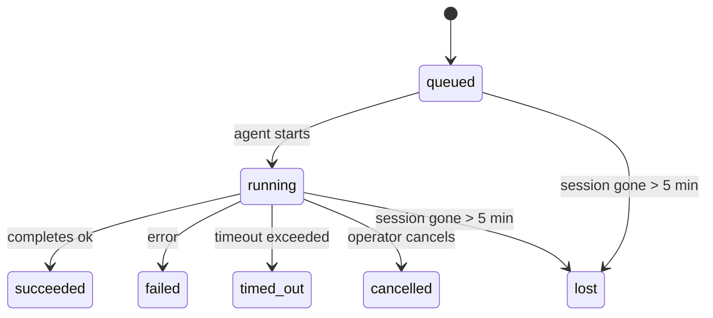

---
read_when:
    - Devam eden veya yakın zamanda tamamlanan arka plan çalışmalarını inceleme
    - Bağımsız ajan çalıştırmalarında teslimat hatalarında hata ayıklama
    - Arka plan çalıştırmalarının oturumlar, Cron ve Heartbeat ile ilişkisini anlama
sidebarTitle: Background tasks
summary: ACP çalıştırmaları, alt ajanlar, yalıtılmış Cron işleri ve CLI işlemleri için arka plan görev takibi
title: Arka plan görevleri
x-i18n:
    generated_at: "2026-04-30T16:28:01Z"
    model: gpt-5.5
    provider: openai
    source_hash: 999653c9360323d5135e33193c76458cba8c288227de46a6217f1ccbed2a6d34
    source_path: automation/tasks.md
    workflow: 16
---

<Note>
Zamanlama mı arıyorsunuz? Doğru mekanizmayı seçmek için [Otomasyon ve görevler](/tr/automation) sayfasına bakın. Bu sayfa, arka plan işi için etkinlik defteridir; zamanlayıcı değildir.
</Note>

Arka plan görevleri, **ana konuşma oturumunuzun dışında** çalışan işleri izler: ACP çalıştırmaları, alt ajan oluşturma işlemleri, yalıtılmış cron işi yürütmeleri ve CLI tarafından başlatılan işlemler.

Görevler; oturumların, cron işlerinin veya heartbeat'lerin yerini **almaz** — bunlar, hangi ayrık işin ne zaman gerçekleştiğini ve başarılı olup olmadığını kaydeden **etkinlik defteridir**.

<Note>
Her ajan çalıştırması bir görev oluşturmaz. Heartbeat dönüşleri ve normal etkileşimli sohbet oluşturmaz. Tüm cron yürütmeleri, ACP oluşturma işlemleri, alt ajan oluşturma işlemleri ve CLI ajan komutları oluşturur.
</Note>

## Kısaca

- Görevler zamanlayıcı değil, **kayıtlardır** — cron ve heartbeat işin _ne zaman_ çalışacağını belirler, görevler _ne olduğunu_ izler.
- ACP, alt ajanlar, tüm cron işleri ve CLI işlemleri görev oluşturur. Heartbeat dönüşleri oluşturmaz.
- Her görev `queued → running → terminal` boyunca ilerler (succeeded, failed, timed_out, cancelled veya lost).
- Cron çalışma zamanı işi hâlâ sahiplenirken cron görevleri canlı kalır; bellek içi çalışma zamanı durumu kaybolmuşsa görev bakımı, bir görevi lost olarak işaretlemeden önce dayanıklı cron çalıştırma geçmişini denetler.
- Tamamlama push odaklıdır: ayrık iş, bittiğinde doğrudan bildirim gönderebilir veya istekte bulunan oturumu/heartbeat'i uyandırabilir; bu yüzden durum yoklama döngüleri genellikle yanlış biçimdir.
- Yalıtılmış cron çalıştırmaları ve alt ajan tamamlanmaları, son temizlik defter kaydından önce alt oturumları için izlenen tarayıcı sekmelerini/süreçlerini en iyi çabayla temizler.
- Yalıtılmış cron teslimi, alt alt ajan işi hâlâ boşalırken bayat geçici üst yanıtları bastırır ve teslimden önce ulaştığında son alt çıktıyı tercih eder.
- Tamamlama bildirimleri doğrudan bir kanala teslim edilir veya bir sonraki heartbeat için kuyruğa alınır.
- `openclaw tasks list` tüm görevleri gösterir; `openclaw tasks audit` sorunları ortaya çıkarır.
- Terminal kayıtları 7 gün tutulur, sonra otomatik olarak temizlenir.

## Hızlı başlangıç

<Tabs>
  <Tab title="Listele ve filtrele">
    ```bash
    # List all tasks (newest first)
    openclaw tasks list

    # Filter by runtime or status
    openclaw tasks list --runtime acp
    openclaw tasks list --status running
    ```

  </Tab>
  <Tab title="İncele">
    ```bash
    # Show details for a specific task (by ID, run ID, or session key)
    openclaw tasks show <lookup>
    ```
  </Tab>
  <Tab title="İptal et ve bildir">
    ```bash
    # Cancel a running task (kills the child session)
    openclaw tasks cancel <lookup>

    # Change notification policy for a task
    openclaw tasks notify <lookup> state_changes
    ```

  </Tab>
  <Tab title="Denetim ve bakım">
    ```bash
    # Run a health audit
    openclaw tasks audit

    # Preview or apply maintenance
    openclaw tasks maintenance
    openclaw tasks maintenance --apply
    ```

  </Tab>
  <Tab title="Görev akışı">
    ```bash
    # Inspect TaskFlow state
    openclaw tasks flow list
    openclaw tasks flow show <lookup>
    openclaw tasks flow cancel <lookup>
    ```
  </Tab>
</Tabs>

## Görevi ne oluşturur

| Kaynak                 | Çalışma zamanı türü | Görev kaydının oluşturulduğu zaman                       | Varsayılan bildirim ilkesi |
| ---------------------- | ------------ | ------------------------------------------------------ | --------------------- |
| ACP arka plan çalıştırmaları | `acp`        | Alt ACP oturumu oluşturulurken                           | `done_only`           |
| Alt ajan orkestrasyonu | `subagent`   | `sessions_spawn` aracılığıyla alt ajan oluşturulurken    | `done_only`           |
| Cron işleri (tüm türler)  | `cron`       | Her cron yürütmesi (ana oturum ve yalıtılmış)       | `silent`              |
| CLI işlemleri         | `cli`        | Gateway üzerinden çalışan `openclaw agent` komutları | `silent`              |
| Ajan medya işleri       | `cli`        | Oturum destekli `video_generate` çalıştırmaları                   | `silent`              |

<AccordionGroup>
  <Accordion title="Cron ve medya için bildirim varsayılanları">
    Ana oturum cron görevleri varsayılan olarak `silent` bildirim ilkesini kullanır — izleme için kayıt oluştururlar ama bildirim üretmezler. Yalıtılmış cron görevleri de varsayılan olarak `silent` kullanır ancak kendi oturumlarında çalıştıkları için daha görünürdür.

    Oturum destekli `video_generate` çalıştırmaları da `silent` bildirim ilkesini kullanır. Yine de görev kayıtları oluştururlar, ancak tamamlama özgün ajan oturumuna iç uyandırma olarak geri verilir; böylece ajan takip mesajını yazabilir ve tamamlanan videoyu kendisi ekleyebilir. `tools.media.asyncCompletion.directSend` seçeneğine katılırsanız, asenkron `music_generate` ve `video_generate` tamamlanmaları istekte bulunan oturumun uyandırma yoluna geri dönmeden önce doğrudan kanal teslimini dener.

  </Accordion>
  <Accordion title="Eşzamanlı video_generate koruması">
    Oturum destekli bir `video_generate` görevi hâlâ etkinken araç aynı zamanda bir koruma olarak davranır: aynı oturumdaki tekrarlanan `video_generate` çağrıları, ikinci bir eşzamanlı üretim başlatmak yerine etkin görev durumunu döndürür. Ajan tarafından açık bir ilerleme/durum araması istediğinizde `action: "status"` kullanın.
  </Accordion>
  <Accordion title="Görev oluşturmayanlar">
    - Heartbeat dönüşleri — ana oturum; bkz. [Heartbeat](/tr/gateway/heartbeat)
    - Normal etkileşimli sohbet dönüşleri
    - Doğrudan `/command` yanıtları

  </Accordion>
</AccordionGroup>

## Görev yaşam döngüsü



| Durum      | Anlamı                                                              |
| ----------- | -------------------------------------------------------------------------- |
| `queued`    | Oluşturuldu, ajanın başlamasını bekliyor                                    |
| `running`   | Ajan dönüşü etkin olarak yürütülüyor                                           |
| `succeeded` | Başarıyla tamamlandı                                                     |
| `failed`    | Bir hatayla tamamlandı                                                    |
| `timed_out` | Yapılandırılan zaman aşımını aştı                                            |
| `cancelled` | Operatör tarafından `openclaw tasks cancel` ile durduruldu                        |
| `lost`      | Çalışma zamanı, 5 dakikalık ek süreden sonra yetkili destek durumunu kaybetti |

Geçişler otomatik olarak gerçekleşir — ilişkili ajan çalıştırması bittiğinde görev durumu buna uyacak şekilde güncellenir.

Ajan çalıştırmasının tamamlanması etkin görev kayıtları için yetkilidir. Başarılı bir ayrık çalıştırma `succeeded` olarak sonlandırılır, sıradan çalıştırma hataları `failed` olarak sonlandırılır ve zaman aşımı veya iptal sonuçları `timed_out` olarak sonlandırılır. Bir operatör görevi zaten iptal etmişse veya çalışma zamanı `failed`, `timed_out` ya da `lost` gibi daha güçlü bir terminal durumu zaten kaydetmişse, daha sonraki bir başarı sinyali bu terminal durumunu düşürmez.

`lost` çalışma zamanı bilincine sahiptir:

- ACP görevleri: destekleyen ACP alt oturum meta verileri kayboldu.
- Alt ajan görevleri: destekleyen alt oturum hedef ajan deposundan kayboldu.
- Cron görevleri: cron çalışma zamanı işi artık etkin olarak izlemiyor ve dayanıklı cron çalıştırma geçmişi bu çalıştırma için terminal sonuç göstermiyor. Çevrimdışı CLI denetimi, kendi boş süreç içi cron çalışma zamanı durumunu yetkili kabul etmez.
- CLI görevleri: yalıtılmış alt oturum görevleri alt oturumu kullanır; sohbet destekli CLI görevleri bunun yerine canlı çalıştırma bağlamını kullanır, bu yüzden kalıcı kanal/grup/doğrudan oturum satırları onları canlı tutmaz. Gateway destekli `openclaw agent` çalıştırmaları da çalıştırma sonucundan sonlandırılır, bu yüzden tamamlanmış çalıştırmalar süpürücü onları `lost` olarak işaretleyene kadar etkin kalmaz.

## Teslim ve bildirimler

Bir görev terminal duruma ulaştığında OpenClaw sizi bilgilendirir. İki teslim yolu vardır:

**Doğrudan teslim** — görevde bir kanal hedefi varsa (`requesterOrigin`), tamamlama mesajı doğrudan o kanala gider (Telegram, Discord, Slack vb.). Alt ajan tamamlanmaları için OpenClaw, varsa bağlı iş parçacığı/konu yönlendirmesini de korur ve doğrudan teslimden vazgeçmeden önce eksik `to` / hesabını, istekte bulunan oturumun saklanan rotasından (`lastChannel` / `lastTo` / `lastAccountId`) doldurabilir.

**Oturum kuyruğuna alınan teslim** — doğrudan teslim başarısız olursa veya kaynak ayarlanmamışsa güncelleme, istekte bulunanın oturumunda bir sistem olayı olarak kuyruğa alınır ve bir sonraki heartbeat'te görünür.

<Tip>
Görev tamamlanması, sonucu hızlıca görmeniz için anında bir heartbeat uyandırması tetikler — bir sonraki zamanlanmış heartbeat tikini beklemeniz gerekmez.
</Tip>

Bu, olağan iş akışının push tabanlı olduğu anlamına gelir: ayrık işi bir kez başlatın, sonra çalışma zamanının tamamlandığında sizi uyandırmasına veya bilgilendirmesine izin verin. Görev durumunu yalnızca hata ayıklama, müdahale veya açık bir denetim gerektiğinde yoklayın.

### Bildirim ilkeleri

Her görev hakkında ne kadar duyacağınızı denetleyin:

| İlke                | Teslim edilenler                                                       |
| --------------------- | ----------------------------------------------------------------------- |
| `done_only` (varsayılan) | Yalnızca terminal durum (succeeded, failed vb.) — **varsayılan budur** |
| `state_changes`       | Her durum geçişi ve ilerleme güncellemesi                              |
| `silent`              | Hiçbir şey                                                          |

Bir görev çalışırken ilkeyi değiştirin:

```bash
openclaw tasks notify <lookup> state_changes
```

## CLI başvurusu

<AccordionGroup>
  <Accordion title="tasks list">
    ```bash
    openclaw tasks list [--runtime <acp|subagent|cron|cli>] [--status <status>] [--json]
    ```

    Çıktı sütunları: Görev Kimliği, Tür, Durum, Teslim, Çalıştırma Kimliği, Alt Oturum, Özet.

  </Accordion>
  <Accordion title="tasks show">
    ```bash
    openclaw tasks show <lookup>
    ```

    Arama belirteci bir görev kimliği, çalıştırma kimliği veya oturum anahtarı kabul eder. Zamanlama, teslim durumu, hata ve terminal özeti dahil tam kaydı gösterir.

  </Accordion>
  <Accordion title="tasks cancel">
    ```bash
    openclaw tasks cancel <lookup>
    ```

    ACP ve alt ajan görevleri için bu, alt oturumu sonlandırır. CLI tarafından izlenen görevlerde iptal, görev kayıt defterine kaydedilir (ayrı bir alt çalışma zamanı tanıtıcısı yoktur). Durum `cancelled` değerine geçer ve uygulanabilir olduğunda bir teslim bildirimi gönderilir.

  </Accordion>
  <Accordion title="tasks notify">
    ```bash
    openclaw tasks notify <lookup> <done_only|state_changes|silent>
    ```
  </Accordion>
  <Accordion title="tasks audit">
    ```bash
    openclaw tasks audit [--json]
    ```

    Operasyonel sorunları ortaya çıkarır. Bulgular, sorunlar algılandığında `openclaw status` içinde de görünür.

    | Bulgular                  | Önem      | Tetikleyici                                                                                                  |
    | ------------------------- | ---------- | ------------------------------------------------------------------------------------------------------------ |
    | `stale_queued`            | uyarı      | 10 dakikadan uzun süredir kuyruğa alınmış                                                                    |
    | `stale_running`           | hata       | 30 dakikadan uzun süredir çalışıyor                                                                          |
    | `lost`                    | uyarı/hata | Çalışma zamanı destekli görev sahipliği kayboldu; tutulan kayıp görevler `cleanupAfter` zamanına kadar uyarı verir, sonra hataya dönüşür |
    | `delivery_failed`         | uyarı      | Teslim başarısız oldu ve bildirim ilkesi `silent` değil                                                      |
    | `missing_cleanup`         | uyarı      | Temizleme zaman damgası olmayan terminal görev                                                               |
    | `inconsistent_timestamps` | uyarı      | Zaman çizelgesi ihlali (örneğin başlamadan önce bitmiş)                                                      |

  </Accordion>
  <Accordion title="görev bakımı">
    ```bash
    openclaw tasks maintenance [--json]
    openclaw tasks maintenance --apply [--json]
    ```

    Bunu görevler ve Task Flow durumu için uzlaştırma, temizleme damgalama ve budamayı önizlemek veya uygulamak üzere kullanın.

    Uzlaştırma çalışma zamanı farkındadır:

    - ACP/alt ajan görevleri, destekleyen alt oturumlarını denetler.
    - Alt oturumunda yeniden başlatma-kurtarma mezar taşı bulunan alt ajan görevleri, kurtarılabilir destek oturumları olarak ele alınmak yerine kayıp olarak işaretlenir.
    - Cron görevleri, cron çalışma zamanının işi hâlâ sahiplenip sahiplenmediğini denetler, ardından `lost` durumuna düşmeden önce kalıcı cron çalıştırma günlüklerinden/iş durumundan terminal durumunu kurtarır. Bellek içi cron etkin iş kümesi için yalnızca Gateway süreci yetkilidir; çevrimdışı CLI denetimi kalıcı geçmişi kullanır ancak yalnızca yerel Set boş olduğu için bir cron görevini kayıp olarak işaretlemez.
    - Sohbet destekli CLI görevleri, yalnızca sohbet oturumu satırını değil, sahip olan canlı çalıştırma bağlamını denetler.

    Tamamlanma temizliği de çalışma zamanı farkındadır:

    - Alt ajan tamamlanması, duyuru temizliği devam etmeden önce alt oturum için izlenen tarayıcı sekmelerini/süreçlerini en iyi çabayla kapatır.
    - Yalıtılmış cron tamamlanması, çalıştırma tamamen sonlandırılmadan önce cron oturumu için izlenen tarayıcı sekmelerini/süreçlerini en iyi çabayla kapatır.
    - Yalıtılmış cron teslimi, gerektiğinde alt alt ajan takip işleminin bitmesini bekler ve bunu duyurmak yerine bayat üst onay metnini bastırır.
    - Alt ajan tamamlanma teslimi en son görünür asistan metnini tercih eder; bu boşsa temizlenmiş en son araç/toolResult metnine geri döner ve yalnızca zaman aşımına uğramış araç çağrısı çalıştırmaları kısa bir kısmi ilerleme özetine daraltılabilir. Terminal başarısız çalıştırmalar, yakalanan yanıt metnini yeniden oynatmadan başarısızlık durumunu duyurur.
    - Temizleme hataları gerçek görev sonucunu maskelemez.

  </Accordion>
  <Accordion title="görev akışı listele | göster | iptal et">
    ```bash
    openclaw tasks flow list [--status <status>] [--json]
    openclaw tasks flow show <lookup> [--json]
    openclaw tasks flow cancel <lookup>
    ```

    Tek bir arka plan görev kaydından ziyade düzenleyici Task Flow ile ilgilendiğinizde bunları kullanın.

  </Accordion>
</AccordionGroup>

## Sohbet görev panosu (`/tasks`)

Bu oturuma bağlı arka plan görevlerini görmek için herhangi bir sohbet oturumunda `/tasks` kullanın. Pano, etkin ve yakın zamanda tamamlanan görevleri çalışma zamanı, durum, zamanlama ve ilerleme ya da hata ayrıntısıyla gösterir.

Geçerli oturumda görünür bağlı görev olmadığında, `/tasks` ajan yerel görev sayılarına geri döner; böylece diğer oturumların ayrıntılarını sızdırmadan yine de bir genel bakış elde edersiniz.

Tam operatör defteri için CLI kullanın: `openclaw tasks list`.

## Durum entegrasyonu (görev baskısı)

`openclaw status`, tek bakışta anlaşılır bir görev özeti içerir:

```
Tasks: 3 queued · 2 running · 1 issues
```

Özet şunları bildirir:

- **active** — `queued` + `running` sayısı
- **failures** — `failed` + `timed_out` + `lost` sayısı
- **byRuntime** — `acp`, `subagent`, `cron`, `cli` bazında döküm

Hem `/status` hem de `session_status` aracı, temizleme farkındalığı olan bir görev anlık görüntüsü kullanır: etkin görevler tercih edilir, bayat tamamlanmış satırlar gizlenir ve son hatalar yalnızca etkin iş kalmadığında gösterilir. Bu, durum kartının şu anda önemli olan şeye odaklanmasını sağlar.

## Depolama ve bakım

### Görevlerin bulunduğu yer

Görev kayıtları SQLite içinde şurada kalıcı tutulur:

```
$OPENCLAW_STATE_DIR/tasks/runs.sqlite
```

Kayıt defteri, Gateway başlangıcında belleğe yüklenir ve yeniden başlatmalar arasında dayanıklılık için yazmaları SQLite ile eşitler.
Gateway, SQLite'ın varsayılan otomatik checkpoint eşiğini ve periyodik ve kapanış `TRUNCATE` checkpoint'lerini kullanarak SQLite write-ahead log'unu sınırda tutar.

### Otomatik bakım

Bir süpürücü her **60 saniyede** çalışır ve dört şeyi ele alır:

<Steps>
  <Step title="Uzlaştırma">
    Etkin görevlerin hâlâ yetkili çalışma zamanı desteğine sahip olup olmadığını denetler. ACP/alt ajan görevleri alt oturum durumunu, cron görevleri etkin iş sahipliğini ve sohbet destekli CLI görevleri sahip olan çalıştırma bağlamını kullanır. Bu destek durumu 5 dakikadan uzun süre kayıpsa, görev `lost` olarak işaretlenir.
  </Step>
  <Step title="ACP oturum onarımı">
    Terminal veya sahipsiz üst sahipli tek seferlik ACP oturumlarını kapatır ve bayat terminal veya sahipsiz kalıcı ACP oturumlarını yalnızca etkin konuşma bağlaması kalmadığında kapatır.
  </Step>
  <Step title="Temizleme damgalama">
    Terminal görevlerde bir `cleanupAfter` zaman damgası ayarlar (endedAt + 7 gün). Saklama süresi boyunca kayıp görevler denetimde hâlâ uyarı olarak görünür; `cleanupAfter` süresi dolduktan sonra veya temizleme meta verileri eksik olduğunda hata olurlar.
  </Step>
  <Step title="Budama">
    `cleanupAfter` tarihini geçen kayıtları siler.
  </Step>
</Steps>

<Note>
**Saklama:** terminal görev kayıtları **7 gün** tutulur, ardından otomatik olarak budanır. Yapılandırma gerekmez.
</Note>

## Görevlerin diğer sistemlerle ilişkisi

<AccordionGroup>
  <Accordion title="Görevler ve Task Flow">
    [Task Flow](/tr/automation/taskflow), arka plan görevlerinin üzerindeki akış düzenleme katmanıdır. Tek bir akış, yaşam süresi boyunca yönetilen veya yansıtılmış eşitleme modlarını kullanarak birden fazla görevi koordine edebilir. Tek tek görev kayıtlarını incelemek için `openclaw tasks`, düzenleyici akışı incelemek için `openclaw tasks flow` kullanın.

    Ayrıntılar için bkz. [Task Flow](/tr/automation/taskflow).

  </Accordion>
  <Accordion title="Görevler ve cron">
    Bir cron işi **tanımı** `~/.openclaw/cron/jobs.json` içinde bulunur; çalışma zamanı yürütme durumu bunun yanında `~/.openclaw/cron/jobs-state.json` içinde bulunur. **Her** cron yürütmesi bir görev kaydı oluşturur; hem ana oturum hem de yalıtılmış olanlar. Ana oturum cron görevleri, bildirim üretmeden takip edebilmeleri için varsayılan olarak `silent` bildirim ilkesini kullanır.

    Bkz. [Cron İşleri](/tr/automation/cron-jobs).

  </Accordion>
  <Accordion title="Görevler ve Heartbeat">
    Heartbeat çalıştırmaları ana oturum turlarıdır; görev kayıtları oluşturmazlar. Bir görev tamamlandığında, sonucu hemen görmeniz için bir Heartbeat uyandırması tetikleyebilir.

    Bkz. [Heartbeat](/tr/gateway/heartbeat).

  </Accordion>
  <Accordion title="Görevler ve oturumlar">
    Bir görev bir `childSessionKey` (işin çalıştığı yer) ve bir `requesterSessionKey` (onu başlatan kişi) referans gösterebilir. Oturumlar konuşma bağlamıdır; görevler bunun üzerinde etkinlik takibidir.
  </Accordion>
  <Accordion title="Görevler ve ajan çalıştırmaları">
    Bir görevin `runId` değeri, işi yapan ajan çalıştırmasına bağlanır. Ajan yaşam döngüsü olayları (başlangıç, bitiş, hata) görev durumunu otomatik olarak günceller; yaşam döngüsünü elle yönetmeniz gerekmez.
  </Accordion>
</AccordionGroup>

## İlgili

- [Otomasyon ve Görevler](/tr/automation) — tüm otomasyon mekanizmalarına tek bakışta genel bakış
- [CLI: Görevler](/tr/cli/tasks) — CLI komut başvurusu
- [Heartbeat](/tr/gateway/heartbeat) — periyodik ana oturum turları
- [Zamanlanmış Görevler](/tr/automation/cron-jobs) — arka plan işini zamanlama
- [Task Flow](/tr/automation/taskflow) — görevlerin üzerindeki akış düzenlemesi
