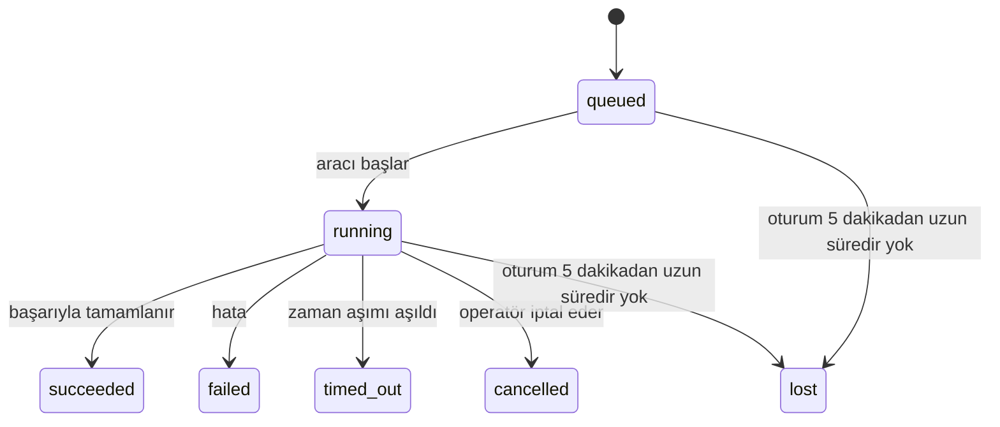

---
read_when:
    - Devam eden veya yakın zamanda tamamlanmış arka plan çalışmalarını inceleme
    - Ayrılmış aracı çalıştırmaları için teslimat hatalarını ayıklama
    - Arka plan çalıştırmalarının oturumlar, Cron ve Heartbeat ile nasıl ilişkili olduğunu anlama
summary: ACP çalıştırmaları, alt aracılar, yalıtılmış Cron işleri ve CLI işlemleri için arka plan görev izleme
title: Arka plan görevleri
x-i18n:
    generated_at: "2026-04-24T08:57:21Z"
    model: gpt-5.4
    provider: openai
    source_hash: 10f16268ab5cce8c3dfd26c54d8d913c0ac0f9bfb4856ed1bb28b085ddb78528
    source_path: automation/tasks.md
    workflow: 15
---

> **Zamanlama mı arıyorsunuz?** Doğru mekanizmayı seçmek için [Otomasyon ve Görevler](/tr/automation) sayfasına bakın. Bu sayfa zamanlamayı değil, arka plan çalışmalarının **izlenmesini** kapsar.

Arka plan görevleri, **ana konuşma oturumunuzun dışında** çalışan işleri izler:
ACP çalıştırmaları, alt aracı oluşturma işlemleri, yalıtılmış Cron işi yürütmeleri ve CLI tarafından başlatılan işlemler.

Görevler oturumların, Cron işlerinin veya Heartbeat'lerin yerini **almaz** — bunlar, ayrılmış çalışmanın ne zaman gerçekleştiğini ve başarılı olup olmadığını kaydeden **etkinlik defteridir**.

<Note>
Her aracı çalıştırması bir görev oluşturmaz. Heartbeat dönüşleri ve normal etkileşimli sohbetler oluşturmaz. Tüm Cron yürütmeleri, ACP oluşturmaları, alt aracı oluşturmaları ve CLI aracı komutları oluşturur.
</Note>

## Kısa özet

- Görevler zamanlayıcı değil, **kayıtlardır** — işin _ne zaman_ çalışacağını Cron ve Heartbeat belirler, _ne olduğunu_ görevler izler.
- ACP, alt aracılar, tüm Cron işleri ve CLI işlemleri görev oluşturur. Heartbeat dönüşleri oluşturmaz.
- Her görev `queued → running → terminal` (succeeded, failed, timed_out, cancelled veya lost) akışından geçer.
- Cron görevleri, Cron çalışma zamanı işi hâlâ sahipleniyorsa etkin kalır; sohbete dayalı CLI görevleri ise yalnızca sahip oldukları çalıştırma bağlamı hâlâ etkinse etkin kalır.
- Tamamlanma itme odaklıdır: ayrılmış çalışma, bittiğinde doğrudan bildirim gönderebilir veya istekte bulunan oturumu/Heartbeat'i uyandırabilir; bu nedenle durum yoklama döngüleri genellikle doğru yaklaşım değildir.
- Yalıtılmış Cron çalıştırmaları ve alt aracı tamamlanmaları, son temizleme kayıt işlemlerinden önce kendi alt oturumları için izlenen tarayıcı sekmelerini/süreçlerini en iyi çabayla temizler.
- Yalıtılmış Cron teslimi, alt soy alt aracı çalışması hâlâ boşalırken eski ara üst yanıtları bastırır ve teslimden önce gelirse son alt soy çıktısını tercih eder.
- Tamamlanma bildirimleri doğrudan bir kanala teslim edilir veya sonraki Heartbeat için kuyruğa alınır.
- `openclaw tasks list` tüm görevleri gösterir; `openclaw tasks audit` sorunları ortaya çıkarır.
- Terminal kayıtları 7 gün tutulur, ardından otomatik olarak temizlenir.

## Hızlı başlangıç

```bash
# Tüm görevleri listele (en yeniden başlayarak)
openclaw tasks list

# Çalışma zamanına veya duruma göre filtrele
openclaw tasks list --runtime acp
openclaw tasks list --status running

# Belirli bir görevin ayrıntılarını göster (kimlik, çalıştırma kimliği veya oturum anahtarına göre)
openclaw tasks show <lookup>

# Çalışan bir görevi iptal et (alt oturumu sonlandırır)
openclaw tasks cancel <lookup>

# Bir görev için bildirim ilkesini değiştir
openclaw tasks notify <lookup> state_changes

# Sağlık denetimi çalıştır
openclaw tasks audit

# Bakımı önizle veya uygula
openclaw tasks maintenance
openclaw tasks maintenance --apply

# TaskFlow durumunu incele
openclaw tasks flow list
openclaw tasks flow show <lookup>
openclaw tasks flow cancel <lookup>
```

## Hangi işlemler görev oluşturur

| Kaynak                 | Çalışma zamanı türü | Görev kaydının oluşturulduğu an                       | Varsayılan bildirim ilkesi |
| ---------------------- | ------------------- | ----------------------------------------------------- | -------------------------- |
| ACP arka plan çalıştırmaları | `acp`         | Alt ACP oturumu oluşturulması                         | `done_only`                |
| Alt aracı orkestrasyonu | `subagent`         | `sessions_spawn` ile alt aracı oluşturulması          | `done_only`                |
| Cron işleri (tüm türler) | `cron`            | Her Cron yürütmesi (ana oturum ve yalıtılmış)         | `silent`                   |
| CLI işlemleri          | `cli`               | Gateway üzerinden çalışan `openclaw agent` komutları  | `silent`                   |
| Aracı medya işleri     | `cli`               | Oturum destekli `video_generate` çalıştırmaları       | `silent`                   |

Ana oturum Cron görevleri varsayılan olarak `silent` bildirim ilkesini kullanır — izleme için kayıt oluştururlar ancak bildirim üretmezler. Yalıtılmış Cron görevleri de varsayılan olarak `silent` kullanır ancak kendi oturumlarında çalıştıkları için daha görünürdür.

Oturum destekli `video_generate` çalıştırmaları da `silent` bildirim ilkesini kullanır. Yine de görev kaydı oluştururlar, ancak tamamlanma sonucu özgün aracı oturumuna dahili bir uyandırma olarak geri verilir; böylece aracı takip mesajını yazabilir ve tamamlanan videoyu kendisi ekleyebilir. `tools.media.asyncCompletion.directSend` özelliğini etkinleştirirseniz, eşzamansız `music_generate` ve `video_generate` tamamlanmaları, istekte bulunan oturumu uyandırma yoluna geri dönmeden önce önce doğrudan kanal teslimini dener.

Oturum destekli bir `video_generate` görevi hâlâ etkinken, araç aynı zamanda bir koruma mekanizması olarak da davranır: aynı oturumda yinelenen `video_generate` çağrıları, ikinci bir eşzamanlı üretim başlatmak yerine etkin görev durumunu döndürür. Aracı tarafında açık bir ilerleme/durum sorgulaması istediğinizde `action: "status"` kullanın.

**Görev oluşturmayanlar:**

- Heartbeat dönüşleri — ana oturum; bkz. [Heartbeat](/tr/gateway/heartbeat)
- Normal etkileşimli sohbet dönüşleri
- Doğrudan `/command` yanıtları

## Görev yaşam döngüsü



| Durum       | Anlamı                                                                     |
| ----------- | -------------------------------------------------------------------------- |
| `queued`    | Oluşturuldu, aracının başlaması bekleniyor                                 |
| `running`   | Aracı dönüşü etkin olarak yürütülüyor                                      |
| `succeeded` | Başarıyla tamamlandı                                                       |
| `failed`    | Bir hatayla tamamlandı                                                     |
| `timed_out` | Yapılandırılmış zaman aşımı aşıldı                                         |
| `cancelled` | Operatör tarafından `openclaw tasks cancel` ile durduruldu                 |
| `lost`      | Çalışma zamanı, 5 dakikalık ek sürenin ardından yetkili destek durumunu kaybetti |

Geçişler otomatik olarak gerçekleşir — ilişkili aracı çalıştırması sona erdiğinde görev durumu buna göre güncellenir.

`lost` çalışma zamanına duyarlıdır:

- ACP görevleri: destekleyen ACP alt oturum meta verileri kayboldu.
- Alt aracı görevleri: destekleyen alt oturum hedef aracı deposundan kayboldu.
- Cron görevleri: Cron çalışma zamanı artık işi etkin olarak izlemiyor.
- CLI görevleri: yalıtılmış alt oturum görevleri alt oturumu kullanır; sohbete dayalı CLI görevleri ise canlı çalıştırma bağlamını kullanır, bu yüzden kalan kanal/grup/doğrudan oturum satırları onları etkin tutmaz.

## Teslim ve bildirimler

Bir görev terminal duruma ulaştığında OpenClaw size bildirim gönderir. İki teslim yolu vardır:

**Doğrudan teslim** — görevin bir kanal hedefi varsa (`requesterOrigin`), tamamlanma mesajı doğrudan o kanala gider (Telegram, Discord, Slack vb.). Alt aracı tamamlanmalarında OpenClaw ayrıca bağlı iş parçacığı/konu yönlendirmesini varsa korur ve doğrudan teslimden vazgeçmeden önce istekte bulunan oturumun kayıtlı yolundan (`lastChannel` / `lastTo` / `lastAccountId`) eksik `to` / hesabı doldurabilir.

**Oturum kuyruğuna alınmış teslim** — doğrudan teslim başarısız olursa veya origin ayarlanmamışsa, güncelleme istekte bulunanın oturumunda bir sistem olayı olarak kuyruğa alınır ve sonraki Heartbeat'te görünür.

<Tip>
Görev tamamlanması, sonucu hızlıca görmeniz için anında bir Heartbeat uyandırması tetikler — sonraki zamanlanmış Heartbeat tikini beklemeniz gerekmez.
</Tip>

Bu, olağan iş akışının itme tabanlı olduğu anlamına gelir: ayrılmış çalışmayı bir kez başlatın, ardından tamamlandığında çalışma zamanının sizi uyandırmasına veya bilgilendirmesine izin verin. Görev durumunu yalnızca hata ayıklama, müdahale veya açık bir denetim gerektiğinde yoklayın.

### Bildirim ilkeleri

Her görev hakkında ne kadar bilgi alacağınızı denetleyin:

| İlke                  | Teslim edilen içerik                                                      |
| --------------------- | ------------------------------------------------------------------------- |
| `done_only` (varsayılan) | Yalnızca terminal durum (succeeded, failed vb.) — **varsayılan budur** |
| `state_changes`       | Her durum geçişi ve ilerleme güncellemesi                                 |
| `silent`              | Hiçbir şey                                                               |

Bir görev çalışırken ilkeyi değiştirin:

```bash
openclaw tasks notify <lookup> state_changes
```

## CLI başvurusu

### `tasks list`

```bash
openclaw tasks list [--runtime <acp|subagent|cron|cli>] [--status <status>] [--json]
```

Çıktı sütunları: Görev Kimliği, Tür, Durum, Teslim, Çalıştırma Kimliği, Alt Oturum, Özet.

### `tasks show`

```bash
openclaw tasks show <lookup>
```

Arama belirteci bir görev kimliğini, çalıştırma kimliğini veya oturum anahtarını kabul eder. Zamanlama, teslim durumu, hata ve terminal özet dahil tam kaydı gösterir.

### `tasks cancel`

```bash
openclaw tasks cancel <lookup>
```

ACP ve alt aracı görevlerinde bu işlem alt oturumu sonlandırır. CLI tarafından izlenen görevlerde iptal, görev kayıt defterine kaydedilir (ayrı bir alt çalışma zamanı tanıtıcısı yoktur). Durum `cancelled` durumuna geçer ve uygunsa teslim bildirimi gönderilir.

### `tasks notify`

```bash
openclaw tasks notify <lookup> <done_only|state_changes|silent>
```

### `tasks audit`

```bash
openclaw tasks audit [--json]
```

Operasyonel sorunları ortaya çıkarır. Sorunlar tespit edildiğinde bulgular `openclaw status` içinde de görünür.

| Bulgu                     | Önem derecesi | Tetikleyici                                           |
| ------------------------- | ------------- | ----------------------------------------------------- |
| `stale_queued`            | warn          | 10 dakikadan uzun süredir kuyrukta                    |
| `stale_running`           | error         | 30 dakikadan uzun süredir çalışıyor                   |
| `lost`                    | error         | Çalışma zamanı destekli görev sahipliği kayboldu      |
| `delivery_failed`         | warn          | Teslim başarısız oldu ve bildirim ilkesi `silent` değil |
| `missing_cleanup`         | warn          | Temizleme zaman damgası olmayan terminal görev        |
| `inconsistent_timestamps` | warn          | Zaman çizelgesi ihlali (örneğin başlamadan önce bitmiş) |

### `tasks maintenance`

```bash
openclaw tasks maintenance [--json]
openclaw tasks maintenance --apply [--json]
```

Bunu, görevler ve Task Flow durumu için uzlaştırma, temizleme damgalaması ve temizlemeyi önizlemek veya uygulamak için kullanın.

Uzlaştırma çalışma zamanına duyarlıdır:

- ACP/alt aracı görevleri, destekleyen alt oturumu kontrol eder.
- Cron görevleri, Cron çalışma zamanının hâlâ işe sahip olup olmadığını kontrol eder.
- Sohbete dayalı CLI görevleri, yalnızca sohbet oturumu satırını değil, sahip olan canlı çalıştırma bağlamını kontrol eder.

Tamamlanma temizliği de çalışma zamanına duyarlıdır:

- Alt aracı tamamlanması, duyuru temizliği devam etmeden önce alt oturum için izlenen tarayıcı sekmelerini/süreçlerini en iyi çabayla kapatır.
- Yalıtılmış Cron tamamlanması, çalıştırma tamamen kapanmadan önce Cron oturumu için izlenen tarayıcı sekmelerini/süreçlerini en iyi çabayla kapatır.
- Yalıtılmış Cron teslimi, gerektiğinde alt soy alt aracı takibini bekler ve bunu duyurmak yerine eski üst onay metnini bastırır.
- Alt aracı tamamlama teslimi, en son görünür yardımcı metnini tercih eder; bu boşsa temizlenmiş son tool/toolResult metnine geri döner ve yalnızca zaman aşımına uğrayan tool-call çalıştırmaları kısa bir kısmi ilerleme özetine indirgenebilir. Terminal failed çalıştırmaları, yakalanan yanıt metnini yeniden oynatmadan başarısızlık durumunu duyurur.
- Temizleme hataları gerçek görev sonucunu maskelemez.

### `tasks flow list|show|cancel`

```bash
openclaw tasks flow list [--status <status>] [--json]
openclaw tasks flow show <lookup> [--json]
openclaw tasks flow cancel <lookup>
```

Arka plan görev kayıtlarından tek birinden ziyade sizi ilgilendiren şey orkestrasyonu yapan Task Flow olduğunda bunları kullanın.

## Sohbet görev panosu (`/tasks`)

O oturuma bağlı arka plan görevlerini görmek için herhangi bir sohbet oturumunda `/tasks` kullanın. Pano, çalışma zamanı, durum, zamanlama ve ilerleme veya hata ayrıntılarıyla etkin ve yakın zamanda tamamlanmış görevleri gösterir.

Geçerli oturumun görünür bağlı görevi olmadığında, `/tasks` diğer oturum ayrıntılarını sızdırmadan yine de genel bir görünüm alabilmeniz için aracıya yerel görev sayılarına geri döner.

Tam operatör kayıt defteri için CLI'yi kullanın: `openclaw tasks list`.

## Durum entegrasyonu (görev baskısı)

`openclaw status`, tek bakışta görülebilen bir görev özeti içerir:

```
Tasks: 3 queued · 2 running · 1 issues
```

Özet şunları bildirir:

- **active** — `queued` + `running` sayısı
- **failures** — `failed` + `timed_out` + `lost` sayısı
- **byRuntime** — `acp`, `subagent`, `cron`, `cli` dağılımı

Hem `/status` hem de `session_status` aracı temizleme farkındalıklı bir görev anlık görüntüsü kullanır: etkin görevler tercih edilir, eski tamamlanmış satırlar gizlenir ve yakın tarihli hatalar yalnızca etkin çalışma kalmadığında gösterilir. Bu, durum kartının şu anda önemli olan şeye odaklanmasını sağlar.

## Depolama ve bakım

### Görevlerin bulunduğu yer

Görev kayıtları SQLite içinde şu konumda kalıcı olarak saklanır:

```
$OPENCLAW_STATE_DIR/tasks/runs.sqlite
```

Kayıt defteri Gateway başlangıcında belleğe yüklenir ve yeniden başlatmalar arasında dayanıklılık için yazmaları SQLite ile eşzamanlar.

### Otomatik bakım

Her **60 saniyede** bir çalıştırılan bir süpürücü üç işi yerine getirir:

1. **Uzlaştırma** — etkin görevlerin hâlâ yetkili çalışma zamanı desteğine sahip olup olmadığını kontrol eder. ACP/alt aracı görevleri alt oturum durumunu, Cron görevleri etkin iş sahipliğini ve sohbete dayalı CLI görevleri sahip olan çalıştırma bağlamını kullanır. Bu destek durumu 5 dakikadan uzun süre yoksa görev `lost` olarak işaretlenir.
2. **Temizleme damgalaması** — terminal görevler üzerinde bir `cleanupAfter` zaman damgası ayarlar (`endedAt + 7 days`).
3. **Temizleme** — `cleanupAfter` tarihini geçmiş kayıtları siler.

**Saklama süresi**: terminal görev kayıtları **7 gün** tutulur, ardından otomatik olarak temizlenir. Yapılandırma gerekmez.

## Görevlerin diğer sistemlerle ilişkisi

### Görevler ve Task Flow

[Task Flow](/tr/automation/taskflow), arka plan görevlerinin üzerindeki akış orkestrasyon katmanıdır. Tek bir akış, yönetilen veya yansıtılmış eşzamanlama kiplerini kullanarak yaşam döngüsü boyunca birden fazla görevi koordine edebilir. Tek tek görev kayıtlarını incelemek için `openclaw tasks`, orkestrasyonu yapan akışı incelemek için `openclaw tasks flow` kullanın.

Ayrıntılar için [Task Flow](/tr/automation/taskflow) sayfasına bakın.

### Görevler ve Cron

Bir Cron işi **tanımı** `~/.openclaw/cron/jobs.json` içinde bulunur; çalışma zamanı yürütme durumu ise yanında `~/.openclaw/cron/jobs-state.json` içinde bulunur. **Her** Cron yürütmesi bir görev kaydı oluşturur — hem ana oturum hem de yalıtılmış olanlar. Ana oturum Cron görevleri, bildirim üretmeden izleme yapmaları için varsayılan olarak `silent` bildirim ilkesini kullanır.

Bkz. [Cron İşleri](/tr/automation/cron-jobs).

### Görevler ve Heartbeat

Heartbeat çalıştırmaları ana oturum dönüşleridir — görev kaydı oluşturmazlar. Bir görev tamamlandığında, sonucu hemen görebilmeniz için bir Heartbeat uyandırmasını tetikleyebilir.

Bkz. [Heartbeat](/tr/gateway/heartbeat).

### Görevler ve oturumlar

Bir görev bir `childSessionKey` (işin çalıştığı yer) ve bir `requesterSessionKey` (işi başlatan kişi) referansı içerebilir. Oturumlar konuşma bağlamıdır; görevler ise bunun üzerine eklenen etkinlik izlemesidir.

### Görevler ve aracı çalıştırmaları

Bir görevin `runId` değeri, işi yapan aracı çalıştırmasına bağlanır. Aracı yaşam döngüsü olayları (başlangıç, bitiş, hata) görev durumunu otomatik olarak günceller — yaşam döngüsünü elle yönetmeniz gerekmez.

## İlgili

- [Otomasyon ve Görevler](/tr/automation) — tüm otomasyon mekanizmaları tek bakışta
- [Task Flow](/tr/automation/taskflow) — görevlerin üzerindeki akış orkestrasyonu
- [Zamanlanmış Görevler](/tr/automation/cron-jobs) — arka plan çalışmalarını zamanlama
- [Heartbeat](/tr/gateway/heartbeat) — periyodik ana oturum dönüşleri
- [CLI: Görevler](/tr/cli/tasks) — CLI komut başvurusu
