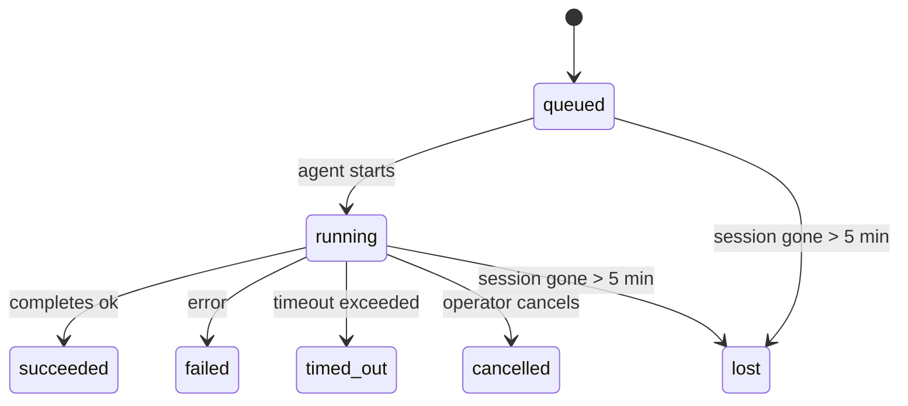

---
read_when:
    - Devam eden veya kısa süre önce tamamlanan arka plan işlerini incelerken
    - Ayrılmış ajan çalıştırmaları için teslimat hatalarını ayıklarken
    - Arka plan çalıştırmalarının oturumlar, cron ve heartbeat ile nasıl ilişkili olduğunu anlamak isterken
summary: ACP çalıştırmaları, alt ajanlar, yalıtılmış cron işleri ve CLI işlemleri için arka plan görev takibi
title: Arka Plan Görevleri
x-i18n:
    generated_at: "2026-04-05T13:42:52Z"
    model: gpt-5.4
    provider: openai
    source_hash: 6c95ccf4388d07e60a7bb68746b161793f4bb5ff2ba3d5ce9e51f2225dab2c4d
    source_path: automation/tasks.md
    workflow: 15
---

# Arka Plan Görevleri

> **Zamanlama mı arıyorsunuz?** Doğru mekanizmayı seçmek için [Automation & Tasks](/automation) sayfasına bakın. Bu sayfa arka plan işinin **takibini** kapsar, zamanlanmasını değil.

Arka plan görevleri, **ana konuşma oturumunuzun dışında** çalışan işleri izler:
ACP çalıştırmaları, alt ajan başlatmaları, yalıtılmış cron iş yürütmeleri ve CLI tarafından başlatılan işlemler.

Görevler oturumların, cron işlerinin veya heartbeat'lerin yerine geçmez — bunlar, ayrılmış işlerin ne olduğunu, ne zaman gerçekleştiğini ve başarılı olup olmadığını kaydeden **etkinlik defteridir**.

<Note>
Her ajan çalıştırması bir görev oluşturmaz. Heartbeat turları ve normal etkileşimli sohbet oluşturmaz. Tüm cron yürütmeleri, ACP başlatmaları, alt ajan başlatmaları ve CLI ajan komutları oluşturur.
</Note>

## Kısa özet

- Görevler zamanlayıcı değil, **kayıtlardır** — cron ve heartbeat işin _ne zaman_ çalışacağını belirler, görevler _ne olduğunu_ izler.
- ACP, alt ajanlar, tüm cron işleri ve CLI işlemleri görev oluşturur. Heartbeat turları oluşturmaz.
- Her görev `queued → running → terminal` (succeeded, failed, timed_out, cancelled veya lost) aşamalarından geçer.
- Cron görevleri, cron çalışma zamanı işi hâlâ sahiplenirken etkin kalır; sohbete bağlı CLI görevleri ise yalnızca sahip oldukları çalıştırma bağlamı hâlâ etkinken etkin kalır.
- Tamamlanma push odaklıdır: ayrılmış işler bittiğinde doğrudan bildirim gönderebilir veya
  istekte bulunan oturumu/heartbeat'i uyandırabilir; bu yüzden durum yoklama döngüleri
  genellikle yanlış yaklaşımdır.
- Yalıtılmış cron çalıştırmaları ve alt ajan tamamlanmaları, son temizlik kayıtlarından önce alt oturumları için izlenen tarayıcı sekmelerini/süreçlerini en iyi çabayla temizler.
- Yalıtılmış cron teslimatı, soy alt ajan işi hâlâ boşalırken eski ara üst yanıtları bastırır ve teslimattan önce gelirse son soy çıktısını tercih eder.
- Tamamlanma bildirimleri doğrudan bir kanala teslim edilir veya bir sonraki heartbeat için kuyruğa alınır.
- `openclaw tasks list` tüm görevleri gösterir; `openclaw tasks audit` sorunları ortaya çıkarır.
- Terminal kayıtları 7 gün tutulur, sonra otomatik olarak budanır.

## Hızlı başlangıç

```bash
# Tüm görevleri listele (en yeniden başlayarak)
openclaw tasks list

# Çalışma zamanına veya duruma göre filtrele
openclaw tasks list --runtime acp
openclaw tasks list --status running

# Belirli bir görev için ayrıntıları göster (kimlik, çalıştırma kimliği veya oturum anahtarıyla)
openclaw tasks show <lookup>

# Çalışan bir görevi iptal et (alt oturumu sonlandırır)
openclaw tasks cancel <lookup>

# Bir görev için bildirim ilkesini değiştir
openclaw tasks notify <lookup> state_changes

# Sistem durumu denetimi çalıştır
openclaw tasks audit

# Bakımı önizle veya uygula
openclaw tasks maintenance
openclaw tasks maintenance --apply

# TaskFlow durumunu incele
openclaw tasks flow list
openclaw tasks flow show <lookup>
openclaw tasks flow cancel <lookup>
```

## Görevi ne oluşturur

| Kaynak                 | Çalışma zamanı türü | Görev kaydının oluşturulduğu an                       | Varsayılan bildirim ilkesi |
| ---------------------- | ------------------- | ----------------------------------------------------- | -------------------------- |
| ACP arka plan çalıştırmaları | `acp`        | Alt ACP oturumu başlatılırken                         | `done_only`                |
| Alt ajan orkestrasyonu | `subagent`          | `sessions_spawn` ile alt ajan başlatılırken           | `done_only`                |
| Cron işleri (tüm türler) | `cron`            | Her cron yürütmesinde (ana oturum ve yalıtılmış)      | `silent`                   |
| CLI işlemleri          | `cli`               | Gateway üzerinden çalışan `openclaw agent` komutları | `silent`                   |

Ana oturum cron görevleri varsayılan olarak `silent` bildirim ilkesi kullanır — izleme için kayıt oluştururlar ama bildirim üretmezler. Yalıtılmış cron görevleri de varsayılan olarak `silent` kullanır ama kendi oturumlarında çalıştıkları için daha görünürdür.

**Görev oluşturmayanlar:**

- Heartbeat turları — ana oturum; bkz. [Heartbeat](/gateway/heartbeat)
- Normal etkileşimli sohbet turları
- Doğrudan `/command` yanıtları

## Görev yaşam döngüsü



| Durum       | Anlamı                                                                     |
| ----------- | -------------------------------------------------------------------------- |
| `queued`    | Oluşturuldu, ajanın başlaması bekleniyor                                   |
| `running`   | Ajan turu etkin olarak yürütülüyor                                         |
| `succeeded` | Başarıyla tamamlandı                                                       |
| `failed`    | Bir hatayla tamamlandı                                                     |
| `timed_out` | Yapılandırılmış zaman aşımı aşıldı                                         |
| `cancelled` | Operatör tarafından `openclaw tasks cancel` ile durduruldu                 |
| `lost`      | Çalışma zamanı, 5 dakikalık tolerans süresinden sonra yetkili arka durumu kaybetti |

Geçişler otomatik gerçekleşir — ilişkili ajan çalıştırması bittiğinde görev durumu buna uyacak şekilde güncellenir.

`lost` çalışma zamanı farkındalığına sahiptir:

- ACP görevleri: arka plandaki ACP alt oturum meta verisi kayboldu.
- Alt ajan görevleri: arka plandaki alt oturum hedef ajan deposundan kayboldu.
- Cron görevleri: cron çalışma zamanı işi artık etkin olarak izlemiyor.
- CLI görevleri: yalıtılmış alt oturum görevleri alt oturumu kullanır; sohbete bağlı CLI görevleri ise bunun yerine canlı çalıştırma bağlamını kullanır, bu nedenle kalmış kanal/grup/doğrudan oturum satırları bunları etkin tutmaz.

## Teslimat ve bildirimler

Bir görev terminal duruma ulaştığında, OpenClaw size bildirim gönderir. İki teslimat yolu vardır:

**Doğrudan teslimat** — görevin bir kanal hedefi varsa (`requesterOrigin`), tamamlanma mesajı doğrudan o kanala gider (Telegram, Discord, Slack vb.). Alt ajan tamamlanmalarında OpenClaw ayrıca mevcutsa bağlı ileti dizisi/konu yönlendirmesini korur ve doğrudan teslimattan vazgeçmeden önce eksik bir `to` / hesabı, istekte bulunan oturumun saklanan rotasından (`lastChannel` / `lastTo` / `lastAccountId`) tamamlayabilir.

**Oturum kuyruğuna alınan teslimat** — doğrudan teslimat başarısız olursa veya bir kaynak ayarlanmamışsa, güncelleme istekte bulunan oturumda sistem olayı olarak kuyruğa alınır ve bir sonraki heartbeat'te görünür.

<Tip>
Görev tamamlanması, sonucu hızlı görmeniz için hemen bir heartbeat uyandırması tetikler — bir sonraki zamanlanmış heartbeat tikini beklemeniz gerekmez.
</Tip>

Bu, olağan iş akışının push tabanlı olduğu anlamına gelir: ayrılmış işi bir kez başlatın, ardından çalışma zamanının tamamlandığında sizi uyandırmasına veya bildirmesine izin verin. Görev durumunu yalnızca hata ayıklama, müdahale veya açık bir denetim gerektiğinde yoklayın.

### Bildirim ilkeleri

Her görev hakkında ne kadar bilgi alacağınızı kontrol edin:

| İlke                  | Teslim edilen içerik                                                    |
| --------------------- | ----------------------------------------------------------------------- |
| `done_only` (varsayılan) | Yalnızca terminal durum (succeeded, failed vb.) — **varsayılan budur** |
| `state_changes`       | Her durum geçişi ve ilerleme güncellemesi                               |
| `silent`              | Hiçbir şey                                                             |

Bir görev çalışırken ilkeyi değiştirin:

```bash
openclaw tasks notify <lookup> state_changes
```

## CLI referansı

### `tasks list`

```bash
openclaw tasks list [--runtime <acp|subagent|cron|cli>] [--status <status>] [--json]
```

Çıktı sütunları: Görev Kimliği, Tür, Durum, Teslimat, Çalıştırma Kimliği, Alt Oturum, Özet.

### `tasks show`

```bash
openclaw tasks show <lookup>
```

Arama belirteci görev kimliğini, çalıştırma kimliğini veya oturum anahtarını kabul eder. Zamanlama, teslimat durumu, hata ve terminal özet dahil tam kaydı gösterir.

### `tasks cancel`

```bash
openclaw tasks cancel <lookup>
```

ACP ve alt ajan görevleri için bu, alt oturumu sonlandırır. Durum `cancelled` olarak değişir ve bir teslimat bildirimi gönderilir.

### `tasks notify`

```bash
openclaw tasks notify <lookup> <done_only|state_changes|silent>
```

### `tasks audit`

```bash
openclaw tasks audit [--json]
```

Operasyonel sorunları ortaya çıkarır. Sorun algılandığında bulgular `openclaw status` içinde de görünür.

| Bulgular                  | Önem düzeyi | Tetikleyici                                          |
| ------------------------- | ----------- | ---------------------------------------------------- |
| `stale_queued`            | warn        | 10 dakikadan uzun süre kuyruğa alınmış               |
| `stale_running`           | error       | 30 dakikadan uzun süredir çalışıyor                  |
| `lost`                    | error       | Çalışma zamanı destekli görev sahipliği kayboldu     |
| `delivery_failed`         | warn        | Teslimat başarısız ve bildirim ilkesi `silent` değil |
| `missing_cleanup`         | warn        | Temizleme zaman damgası olmayan terminal görev       |
| `inconsistent_timestamps` | warn        | Zaman çizelgesi ihlali (örneğin başlamadan önce bitmiş) |

### `tasks maintenance`

```bash
openclaw tasks maintenance [--json]
openclaw tasks maintenance --apply [--json]
```

Bunu görevler ve Task Flow durumu için uzlaştırma, temizleme damgalama ve budamayı önizlemek veya uygulamak için kullanın.

Uzlaştırma çalışma zamanı farkındalığına sahiptir:

- ACP/alt ajan görevleri arka plandaki alt oturumu kontrol eder.
- Cron görevleri cron çalışma zamanının hâlâ işe sahip olup olmadığını kontrol eder.
- Sohbete bağlı CLI görevleri yalnızca sohbet oturum satırını değil, sahip olan canlı çalıştırma bağlamını kontrol eder.

Tamamlanma temizliği de çalışma zamanı farkındalığına sahiptir:

- Alt ajan tamamlanması, duyuru temizliği devam etmeden önce alt oturum için izlenen tarayıcı sekmelerini/süreçlerini en iyi çabayla kapatır.
- Yalıtılmış cron tamamlanması, çalıştırma tamamen kapatılmadan önce cron oturumu için izlenen tarayıcı sekmelerini/süreçlerini en iyi çabayla kapatır.
- Yalıtılmış cron teslimatı, gerektiğinde soy alt ajan takibini bekler ve eski üst onay metnini duyurmak yerine bastırır.
- Alt ajan tamamlanma teslimatı en son görünür asistan metnini tercih eder; bu boşsa temizlenmiş en son tool/toolResult metnine geri döner ve yalnızca zaman aşımına uğramış tool-call çalıştırmaları kısa bir kısmi ilerleme özetine indirgenebilir.
- Temizleme hataları gerçek görev sonucunu gizlemez.

### `tasks flow list|show|cancel`

```bash
openclaw tasks flow list [--status <status>] [--json]
openclaw tasks flow show <lookup> [--json]
openclaw tasks flow cancel <lookup>
```

Bunu, tek bir arka plan görev kaydından ziyade ilgilendiğiniz şey düzenleyen Task Flow olduğunda kullanın.

## Sohbet görev panosu (`/tasks`)

O oturuma bağlı arka plan görevlerini görmek için herhangi bir sohbet oturumunda `/tasks` kullanın. Pano, etkin ve kısa süre önce tamamlanan görevleri çalışma zamanı, durum, zamanlama ve ilerleme veya hata ayrıntılarıyla gösterir.

Geçerli oturumun görünür bağlı görevi yoksa, `/tasks` diğer oturum ayrıntılarını sızdırmadan yine de genel bakış sunabilmesi için ajan yerel görev sayılarına geri döner.

Tam operatör defteri için CLI kullanın: `openclaw tasks list`.

## Durum entegrasyonu (görev baskısı)

`openclaw status` bir bakışta görev özeti içerir:

```
Tasks: 3 queued · 2 running · 1 issues
```

Özet şunları bildirir:

- **active** — `queued` + `running` sayısı
- **failures** — `failed` + `timed_out` + `lost` sayısı
- **byRuntime** — `acp`, `subagent`, `cron`, `cli` dağılımı

Hem `/status` hem de `session_status` aracı, temizleme farkındalığına sahip görev anlık görüntüsü kullanır: etkin görevler tercih edilir, eski tamamlanmış satırlar gizlenir ve son hatalar yalnızca etkin iş kalmadığında gösterilir. Bu, durum kartını şu anda önemli olana odaklı tutar.

## Depolama ve bakım

### Görevlerin bulunduğu yer

Görev kayıtları SQLite içinde şu konumda kalıcıdır:

```
$OPENCLAW_STATE_DIR/tasks/runs.sqlite
```

Kayıt defteri gateway başlangıcında belleğe yüklenir ve yeniden başlatmalar arasında dayanıklılık için yazmaları SQLite ile eşzamanlar.

### Otomatik bakım

Her **60 saniyede** bir çalışan bir temizleyici üç işi ele alır:

1. **Uzlaştırma** — etkin görevlerin hâlâ yetkili çalışma zamanı desteğine sahip olup olmadığını kontrol eder. ACP/alt ajan görevleri alt oturum durumunu, cron görevleri etkin iş sahipliğini ve sohbete bağlı CLI görevleri sahip olan çalıştırma bağlamını kullanır. Bu arka durum 5 dakikadan uzun süre yoksa görev `lost` olarak işaretlenir.
2. **Temizleme damgalama** — terminal görevlerde `cleanupAfter` zaman damgası ayarlar (`endedAt + 7 gün`).
3. **Budama** — `cleanupAfter` tarihini geçen kayıtları siler.

**Saklama**: terminal görev kayıtları **7 gün** tutulur, sonra otomatik olarak budanır. Yapılandırma gerekmez.

## Görevlerin diğer sistemlerle ilişkisi

### Görevler ve Task Flow

[Task Flow](/automation/taskflow), arka plan görevlerinin üzerindeki akış orkestrasyon katmanıdır. Tek bir akış, ömrü boyunca yönetilen veya yansıtılan eşzamanlama kiplerini kullanarak birden çok görevi koordine edebilir. Tek tek görev kayıtlarını incelemek için `openclaw tasks`, düzenleyen akışı incelemek için `openclaw tasks flow` kullanın.

Ayrıntılar için [Task Flow](/automation/taskflow) sayfasına bakın.

### Görevler ve cron

Bir cron işi **tanımı** `~/.openclaw/cron/jobs.json` içinde bulunur. **Her** cron yürütmesi bir görev kaydı oluşturur — hem ana oturum hem yalıtılmış. Ana oturum cron görevleri varsayılan olarak `silent` bildirim ilkesi kullanır, bu yüzden bildirim üretmeden izleme yaparlar.

Bkz. [Cron Jobs](/automation/cron-jobs).

### Görevler ve heartbeat

Heartbeat çalıştırmaları ana oturum turlarıdır — görev kaydı oluşturmazlar. Bir görev tamamlandığında, sonucu hızlı görmeniz için bir heartbeat uyandırması tetiklenebilir.

Bkz. [Heartbeat](/gateway/heartbeat).

### Görevler ve oturumlar

Bir görev `childSessionKey` (işin çalıştığı yer) ve `requesterSessionKey` (işi başlatan kişi) alanlarına başvurabilir. Oturumlar konuşma bağlamıdır; görevler bunun üstündeki etkinlik takibidir.

### Görevler ve ajan çalıştırmaları

Bir görevin `runId` değeri, işi yapan ajan çalıştırmasına bağlanır. Ajan yaşam döngüsü olayları (başlangıç, bitiş, hata) görev durumunu otomatik günceller — yaşam döngüsünü elle yönetmeniz gerekmez.

## İlgili

- [Automation & Tasks](/automation) — tüm otomasyon mekanizmaları bir bakışta
- [Task Flow](/automation/taskflow) — görevlerin üzerindeki akış orkestrasyonu
- [Scheduled Tasks](/automation/cron-jobs) — arka plan işlerinin zamanlanması
- [Heartbeat](/gateway/heartbeat) — düzenli ana oturum turları
- [CLI: Tasks](/cli/index#tasks) — CLI komut referansı
