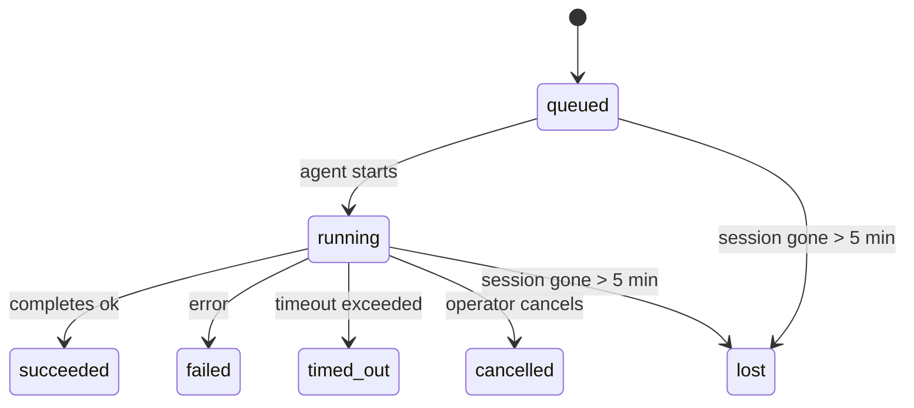

---
read_when:
    - Devam eden veya yakın zamanda tamamlanan arka plan çalışmalarını inceleme
    - Bağımsız ajan çalıştırmalarında teslimat hatalarını ayıklama
    - Arka plan çalıştırmalarının oturumlar, Cron ve Heartbeat ile nasıl ilişkili olduğunu anlamak
sidebarTitle: Background tasks
summary: ACP çalıştırmaları, alt ajanlar, yalıtılmış Cron işleri ve CLI işlemleri için arka plan görev takibi
title: Arka plan görevleri
x-i18n:
    generated_at: "2026-05-10T19:21:07Z"
    model: gpt-5.5
    provider: openai
    source_hash: 5764a89634f90181d826ff3990ec8dac9538239074934d30fd446c1eb4564869
    source_path: automation/tasks.md
    workflow: 16
---

<Note>
Zamanlama mı arıyorsunuz? Doğru mekanizmayı seçmek için [Otomasyon ve görevler](/tr/automation) bölümüne bakın. Bu sayfa, zamanlayıcı değil arka plan işleri için etkinlik defteridir.
</Note>

Arka plan görevleri, **ana konuşma oturumunuzun dışında** çalışan işleri izler: ACP çalıştırmaları, alt ajan başlatmaları, yalıtılmış Cron işi yürütmeleri ve CLI ile başlatılan işlemler.

Görevler oturumların, Cron işlerinin veya Heartbeat'lerin yerine geçmez; bunlar, hangi ayrılmış işin ne zaman gerçekleştiğini ve başarılı olup olmadığını kaydeden **etkinlik defteridir**.

<Note>
Her ajan çalıştırması bir görev oluşturmaz. Heartbeat dönüşleri ve normal etkileşimli sohbet oluşturmaz. Tüm Cron yürütmeleri, ACP başlatmaları, alt ajan başlatmaları ve CLI ajan komutları oluşturur.
</Note>

## Kısa Özet

- Görevler zamanlayıcı değil, **kayıtlardır**; Cron ve Heartbeat işin _ne zaman_ çalışacağını belirler, görevler ise _ne olduğunu_ izler.
- ACP, alt ajanlar, tüm Cron işleri ve CLI işlemleri görev oluşturur. Heartbeat dönüşleri oluşturmaz.
- Her görev `queued → running → terminal` boyunca ilerler (succeeded, failed, timed_out, cancelled veya lost).
- Cron görevleri, Cron çalışma zamanı işi hâlâ sahiplenirken canlı kalır; bellek içi çalışma zamanı durumu kaybolmuşsa görev bakımı, bir görevi lost olarak işaretlemeden önce dayanıklı Cron çalıştırma geçmişini kontrol eder.
- Tamamlama push odaklıdır: ayrılmış iş doğrudan bildirim gönderebilir veya tamamlandığında istekte bulunan oturumu/Heartbeat'i uyandırabilir; bu yüzden durum yoklama döngüleri genellikle yanlış biçimdir.
- Yalıtılmış Cron çalıştırmaları ve alt ajan tamamlamaları, son temizlik kayıtlarından önce alt oturumları için izlenen tarayıcı sekmelerini/süreçlerini en iyi çabayla temizler.
- Yalıtılmış Cron teslimi, alt soy alt ajan işi hâlâ boşalırken eski ara ebeveyn yanıtlarını bastırır ve teslimden önce geldiğinde son alt soy çıktısını tercih eder.
- Tamamlama bildirimleri doğrudan bir kanala teslim edilir veya bir sonraki Heartbeat için kuyruğa alınır.
- `openclaw tasks list` tüm görevleri gösterir; `openclaw tasks audit` sorunları ortaya çıkarır.
- Terminal kayıtları 7 gün tutulur, ardından otomatik olarak budanır.

## Hızlı başlangıç

<Tabs>
  <Tab title="Listele ve filtrele">
    ```bash
    # List all tasks (newest first)
    openclaw tasks list

    # Filter by runtime or status
    openclaw tasks list --runtime acp
    openclaw tasks list --status running
    ```

  </Tab>
  <Tab title="İncele">
    ```bash
    # Show details for a specific task (by ID, run ID, or session key)
    openclaw tasks show <lookup>
    ```
  </Tab>
  <Tab title="İptal et ve bildir">
    ```bash
    # Cancel a running task (kills the child session)
    openclaw tasks cancel <lookup>

    # Change notification policy for a task
    openclaw tasks notify <lookup> state_changes
    ```

  </Tab>
  <Tab title="Denetim ve bakım">
    ```bash
    # Run a health audit
    openclaw tasks audit

    # Preview or apply maintenance
    openclaw tasks maintenance
    openclaw tasks maintenance --apply
    ```

  </Tab>
  <Tab title="Görev akışı">
    ```bash
    # Inspect TaskFlow state
    openclaw tasks flow list
    openclaw tasks flow show <lookup>
    openclaw tasks flow cancel <lookup>
    ```
  </Tab>
</Tabs>

## Görevi ne oluşturur

| Kaynak                 | Çalışma zamanı türü | Bir görev kaydı ne zaman oluşturulur                    | Varsayılan bildirim ilkesi |
| ---------------------- | ------------ | ------------------------------------------------------ | --------------------- |
| ACP arka plan çalıştırmaları    | `acp`        | Bir alt ACP oturumu başlatılırken                           | `done_only`           |
| Alt ajan orkestrasyonu | `subagent`   | `sessions_spawn` üzerinden bir alt ajan başlatılırken               | `done_only`           |
| Cron işleri (tüm türler)  | `cron`       | Her Cron yürütmesinde (ana oturum ve yalıtılmış)       | `silent`              |
| CLI işlemleri         | `cli`        | Gateway üzerinden çalışan `openclaw agent` komutları | `silent`              |
| Ajan medya işleri       | `cli`        | Oturum destekli `music_generate`/`video_generate` çalıştırmaları  | `silent`              |

<AccordionGroup>
  <Accordion title="Cron ve medya için bildirim varsayılanları">
    Ana oturum Cron görevleri varsayılan olarak `silent` bildirim ilkesini kullanır; izleme için kayıt oluştururlar ancak bildirim üretmezler. Yalıtılmış Cron görevleri de varsayılan olarak `silent` kullanır ancak kendi oturumlarında çalıştıkları için daha görünürdür.

    Oturum destekli `music_generate` ve `video_generate` çalıştırmaları da `silent` bildirim ilkesini kullanır. Yine de görev kayıtları oluştururlar, ancak tamamlama, ajanın takip mesajını yazabilmesi ve bitmiş medyayı kendisinin ekleyebilmesi için iç uyandırma olarak özgün ajan oturumuna geri iletilir. Grup/kanal tamamlamaları normal görünür yanıt ilkesini izler; bu nedenle ajan, kaynak teslimi gerektirdiğinde mesaj aracını kullanır. Tamamlama ajanı, yalnızca araç kullanılan bir rotada mesaj aracı teslim kanıtı üretemezse OpenClaw, medyayı özelde bırakmak yerine tamamlama yedeğini doğrudan özgün kanala gönderir.

  </Accordion>
  <Accordion title="Eşzamanlı video_generate güvenlik sınırı">
    Oturum destekli bir `video_generate` görevi hâlâ etkinken araç aynı zamanda güvenlik sınırı görevi de görür: aynı oturumdaki tekrarlı `video_generate` çağrıları, ikinci bir eşzamanlı üretim başlatmak yerine etkin görev durumunu döndürür. Ajan tarafından açık bir ilerleme/durum sorgusu istediğinizde `action: "status"` kullanın.
  </Accordion>
  <Accordion title="Neler görev oluşturmaz">
    - Heartbeat dönüşleri; ana oturum için [Heartbeat](/tr/gateway/heartbeat) bölümüne bakın
    - Normal etkileşimli sohbet dönüşleri
    - Doğrudan `/command` yanıtları

  </Accordion>
</AccordionGroup>

## Görev yaşam döngüsü



| Durum      | Anlamı                                                              |
| ----------- | -------------------------------------------------------------------------- |
| `queued`    | Oluşturuldu, ajanın başlaması bekleniyor                                    |
| `running`   | Ajan dönüşü etkin olarak yürütülüyor                                           |
| `succeeded` | Başarıyla tamamlandı                                                     |
| `failed`    | Bir hatayla tamamlandı                                                    |
| `timed_out` | Yapılandırılmış zaman aşımı aşıldı                                            |
| `cancelled` | Operatör tarafından `openclaw tasks cancel` ile durduruldu                        |
| `lost`      | Çalışma zamanı, 5 dakikalık ek süreden sonra yetkili dayanak durumunu kaybetti |

Geçişler otomatik olarak gerçekleşir; ilişkili ajan çalıştırması bittiğinde görev durumu buna uyacak şekilde güncellenir.

Ajan çalıştırmasının tamamlanması, etkin görev kayıtları için belirleyicidir. Başarılı bir ayrılmış çalıştırma `succeeded` olarak sonlandırılır, sıradan çalıştırma hataları `failed` olarak sonlandırılır ve zaman aşımı veya iptal sonuçları `timed_out` olarak sonlandırılır. Bir operatör görevi zaten iptal etmişse veya çalışma zamanı `failed`, `timed_out` ya da `lost` gibi daha güçlü bir terminal durumu zaten kaydetmişse, daha sonra gelen bir başarı sinyali bu terminal durumu düşürmez.

`lost` çalışma zamanı farkındalıklıdır:

- ACP görevleri: dayanak ACP alt oturum meta verileri kayboldu.
- Alt ajan görevleri: dayanak alt oturum hedef ajan deposundan kayboldu.
- Cron görevleri: Cron çalışma zamanı işi artık etkin olarak izlemiyor ve dayanıklı Cron çalıştırma geçmişi bu çalıştırma için terminal sonuç göstermiyor. Çevrimdışı CLI denetimi, kendi boş süreç içi Cron çalışma zamanı durumunu yetkili kabul etmez.
- CLI görevleri: çalıştırma kimliği/kaynak kimliği olan görevler canlı çalıştırma bağlamını kullanır; bu nedenle kalıcı alt oturum veya sohbet oturumu satırları, Gateway sahipliğindeki çalıştırma kaybolduktan sonra onları canlı tutmaz. Çalıştırma kimliği olmayan eski CLI görevleri hâlâ alt oturuma geri döner. Gateway destekli `openclaw agent` çalıştırmaları da çalıştırma sonuçlarından sonlandırılır; böylece tamamlanmış çalıştırmalar süpürücü onları `lost` olarak işaretleyene kadar etkin kalmaz.

## Teslim ve bildirimler

Bir görev terminal duruma ulaştığında OpenClaw sizi bilgilendirir. İki teslim yolu vardır:

**Doğrudan teslim**; görevin bir kanal hedefi varsa (`requesterOrigin`), tamamlama mesajı doğrudan o kanala gider (Telegram, Discord, Slack vb.). Grup ve kanal görev tamamlamaları bunun yerine, ebeveyn ajanın görünür yanıtı yazabilmesi için istekte bulunan oturum üzerinden yönlendirilir. Alt ajan tamamlamaları için OpenClaw, mevcut olduğunda bağlı iş parçacığı/konu yönlendirmesini de korur ve doğrudan teslimden vazgeçmeden önce eksik bir `to` / hesabı, istekte bulunan oturumun saklanan rotasından (`lastChannel` / `lastTo` / `lastAccountId`) doldurabilir.

**Oturum kuyruğuna alınmış teslim**; doğrudan teslim başarısız olursa veya origin ayarlanmamışsa güncelleme, istekte bulunanın oturumunda bir sistem olayı olarak kuyruğa alınır ve bir sonraki Heartbeat'te görünür.

<Tip>
Görev tamamlaması anında bir Heartbeat uyandırması tetikler; böylece sonucu hızlıca görürsünüz, bir sonraki zamanlanmış Heartbeat tikini beklemeniz gerekmez.
</Tip>

Bu, olağan iş akışının push tabanlı olduğu anlamına gelir: ayrılmış işi bir kez başlatın, ardından çalışma zamanının tamamlanma sırasında sizi uyandırmasına veya bilgilendirmesine izin verin. Görev durumunu yalnızca hata ayıklama, müdahale veya açık bir denetim gerektiğinde yoklayın.

### Bildirim ilkeleri

Her görev hakkında ne kadar duyacağınızı denetleyin:

| İlke                | Ne teslim edilir                                                       |
| --------------------- | ----------------------------------------------------------------------- |
| `done_only` (varsayılan) | Yalnızca terminal durum (succeeded, failed vb.); **varsayılan budur** |
| `state_changes`       | Her durum geçişi ve ilerleme güncellemesi                              |
| `silent`              | Hiçbir şey                                                          |

Bir görev çalışırken ilkeyi değiştirin:

```bash
openclaw tasks notify <lookup> state_changes
```

## CLI başvurusu

<AccordionGroup>
  <Accordion title="tasks list">
    ```bash
    openclaw tasks list [--runtime <acp|subagent|cron|cli>] [--status <status>] [--json]
    ```

    Çıktı sütunları: Görev Kimliği, Tür, Durum, Teslim, Çalıştırma Kimliği, Alt Oturum, Özet.

  </Accordion>
  <Accordion title="tasks show">
    ```bash
    openclaw tasks show <lookup>
    ```

    Arama belirteci bir görev kimliğini, çalıştırma kimliğini veya oturum anahtarını kabul eder. Zamanlama, teslim durumu, hata ve terminal özet dahil tam kaydı gösterir.

  </Accordion>
  <Accordion title="tasks cancel">
    ```bash
    openclaw tasks cancel <lookup>
    ```

    ACP ve alt ajan görevleri için bu, alt oturumu sonlandırır. CLI tarafından izlenen görevler için iptal, görev kayıt defterine kaydedilir (ayrı bir alt çalışma zamanı tanıtıcısı yoktur). Durum `cancelled` değerine geçer ve uygun olduğunda bir teslim bildirimi gönderilir.

  </Accordion>
  <Accordion title="tasks notify">
    ```bash
    openclaw tasks notify <lookup> <done_only|state_changes|silent>
    ```
  </Accordion>
  <Accordion title="tasks audit">
    ```bash
    openclaw tasks audit [--json]
    ```

    Operasyonel sorunları ortaya çıkarır. Sorunlar algılandığında bulgular `openclaw status` içinde de görünür.

    | Bulgu                     | Önem       | Tetikleyici                                                                                                  |
    | ------------------------- | ---------- | ------------------------------------------------------------------------------------------------------------ |
    | `stale_queued`            | warn       | 10 dakikadan uzun süredir kuyrukta                                                                           |
    | `stale_running`           | error      | 30 dakikadan uzun süredir çalışıyor                                                                          |
    | `lost`                    | warn/error | Çalışma zamanı destekli görev sahipliği kayboldu; tutulan kayıp görevler `cleanupAfter` zamanına kadar uyarı verir, ardından hataya dönüşür |
    | `delivery_failed`         | warn       | Teslim başarısız oldu ve bildirim ilkesi `silent` değil                                                      |
    | `missing_cleanup`         | warn       | Temizleme zaman damgası olmayan terminal görev                                                               |
    | `inconsistent_timestamps` | warn       | Zaman çizelgesi ihlali (örneğin başlamadan önce bitmiş)                                                      |

  </Accordion>
  <Accordion title="görev bakımı">
    ```bash
    openclaw tasks maintenance [--json]
    openclaw tasks maintenance --apply [--json]
    ```

    Bunu görevler, Task Flow durumu ve eski cron çalıştırma oturumu kayıt defteri satırları için mutabakatı, temizleme damgalamayı ve budamayı önizlemek veya uygulamak üzere kullanın.

    Mutabakat çalışma zamanı farkındadır:

    - ACP/alt aracı görevleri, bunları destekleyen alt oturumu denetler.
    - Alt oturumu yeniden başlatma kurtarma mezar taşına sahip olan alt aracı görevleri, kurtarılabilir destek oturumları olarak ele alınmak yerine kayıp olarak işaretlenir.
    - Cron görevleri, cron çalışma zamanının işi hâlâ sahiplenip sahiplenmediğini denetler, ardından `lost` durumuna geri düşmeden önce kalıcı cron çalıştırma günlüklerinden/iş durumundan terminal durumu kurtarır. Bellek içi cron etkin iş kümesi için yalnızca Gateway süreci yetkilidir; çevrim dışı CLI denetimi kalıcı geçmişi kullanır ancak yalnızca bu yerel Set boş olduğu için bir cron görevini kayıp olarak işaretlemez.
    - Çalıştırma kimliği olan CLI görevleri yalnızca alt oturum veya sohbet oturumu satırlarını değil, sahip olan canlı çalıştırma bağlamını denetler.

    Tamamlama temizliği de çalışma zamanı farkındadır:

    - Alt aracı tamamlama, duyuru temizliği devam etmeden önce alt oturum için izlenen tarayıcı sekmelerini/süreçlerini en iyi çabayla kapatır.
    - Yalıtılmış cron tamamlama, çalıştırma tamamen sonlandırılmadan önce cron oturumu için izlenen tarayıcı sekmelerini/süreçlerini en iyi çabayla kapatır.
    - Yalıtılmış cron teslimi, gerektiğinde alt soy alt aracı takip işlemini bekler ve duyurmak yerine eski üst onay metnini bastırır.
    - Alt aracı tamamlama teslimi en son görünür asistan metnini tercih eder; bu boşsa temizlenmiş en son araç/toolResult metnine geri döner ve yalnızca zaman aşımı olan araç çağrısı çalıştırmaları kısa bir kısmi ilerleme özetine indirgenebilir. Terminal başarısız çalıştırmalar, yakalanan yanıt metnini yeniden oynatmadan başarısızlık durumunu duyurur.
    - Temizleme başarısızlıkları gerçek görev sonucunu maskelemez.

    Bakım uygulanırken OpenClaw ayrıca 7 günden eski eski `cron:<jobId>:run:<uuid>` oturum kayıt defteri satırlarını kaldırır; o anda çalışan cron işleri için satırları korur ve cron dışı oturum satırlarına dokunmaz.

  </Accordion>
  <Accordion title="görev akışı listele | göster | iptal et">
    ```bash
    openclaw tasks flow list [--status <status>] [--json]
    openclaw tasks flow show <lookup> [--json]
    openclaw tasks flow cancel <lookup>
    ```

    Bunları, ilgilendiğiniz şey tek bir arka plan görev kaydı yerine düzenleyici Task Flow olduğunda kullanın.

  </Accordion>
</AccordionGroup>

## Sohbet görev panosu (`/tasks`)

Bu oturuma bağlı arka plan görevlerini görmek için herhangi bir sohbet oturumunda `/tasks` kullanın. Pano, etkin ve yakın zamanda tamamlanmış görevleri çalışma zamanı, durum, zamanlama ve ilerleme veya hata ayrıntısıyla gösterir.

Geçerli oturumda görünür bağlı görev yoksa `/tasks`, diğer oturum ayrıntılarını sızdırmadan yine de genel bir görünüm almanız için aracıya yerel görev sayılarına geri döner.

Tam operatör defteri için CLI kullanın: `openclaw tasks list`.

## Durum entegrasyonu (görev baskısı)

`openclaw status`, hızlı bakış için bir görev özeti içerir:

```
Tasks: 3 queued · 2 running · 1 issues
```

Özet şunları bildirir:

- **active** - `queued` + `running` sayısı
- **failures** - `failed` + `timed_out` + `lost` sayısı
- **byRuntime** - `acp`, `subagent`, `cron`, `cli` bazında döküm

Hem `/status` hem de `session_status` aracı, temizleme farkındalığı olan bir görev anlık görüntüsü kullanır: etkin görevler tercih edilir, eski tamamlanmış satırlar gizlenir ve son hatalar yalnızca etkin iş kalmadığında yüzeye çıkar. Bu, durum kartının şu anda önemli olana odaklanmasını sağlar.

## Depolama ve bakım

### Görevler nerede bulunur?

Görev kayıtları SQLite içinde kalıcıdır:

```
$OPENCLAW_STATE_DIR/tasks/runs.sqlite
```

Kayıt defteri Gateway başlangıcında belleğe yüklenir ve yeniden başlatmalar arasında dayanıklılık için yazmaları SQLite ile eşitler.
Gateway, SQLite'ın varsayılan autocheckpoint eşiğini ve dönemsel ve kapanış `TRUNCATE` checkpoint'lerini kullanarak SQLite write-ahead log boyutunu sınırlı tutar.

### Otomatik bakım

Bir süpürücü her **60 saniyede** çalışır ve dört şeyi işler:

<Steps>
  <Step title="Mutabakat">
    Etkin görevlerin hâlâ yetkili çalışma zamanı desteğine sahip olup olmadığını denetler. ACP/alt aracı görevleri alt oturum durumunu, cron görevleri etkin iş sahipliğini ve çalıştırma kimliği olan CLI görevleri sahip olan çalıştırma bağlamını kullanır. Bu destek durumu 5 dakikadan uzun süre yoksa görev `lost` olarak işaretlenir.
  </Step>
  <Step title="ACP oturum onarımı">
    Terminal veya sahipsiz üst sahipli tek seferlik ACP oturumlarını kapatır ve eski terminal veya sahipsiz kalıcı ACP oturumlarını yalnızca etkin konuşma bağlaması kalmadığında kapatır.
  </Step>
  <Step title="Temizleme damgalama">
    Terminal görevlerde bir `cleanupAfter` zaman damgası ayarlar (endedAt + 7 gün). Saklama sırasında kayıp görevler denetimde uyarı olarak görünmeye devam eder; `cleanupAfter` süresi dolduktan sonra veya temizleme meta verileri eksik olduğunda bunlar hatadır.
  </Step>
  <Step title="Budama">
    `cleanupAfter` tarihini geçmiş kayıtları siler.
  </Step>
</Steps>

<Note>
**Saklama:** terminal görev kayıtları **7 gün** tutulur, ardından otomatik olarak budanır. Yapılandırma gerekmez.
</Note>

## Görevlerin diğer sistemlerle ilişkisi

<AccordionGroup>
  <Accordion title="Görevler ve Task Flow">
    [Task Flow](/tr/automation/taskflow), arka plan görevlerinin üzerindeki akış düzenleme katmanıdır. Tek bir akış, ömrü boyunca yönetilen veya yansıtılmış eşitleme modlarını kullanarak birden çok görevi koordine edebilir. Tek tek görev kayıtlarını incelemek için `openclaw tasks`, düzenleyici akışı incelemek için `openclaw tasks flow` kullanın.

    Ayrıntılar için bkz. [Task Flow](/tr/automation/taskflow).

  </Accordion>
  <Accordion title="Görevler ve cron">
    Bir cron işi **tanımı** `~/.openclaw/cron/jobs.json` içinde bulunur; çalışma zamanı yürütme durumu onun yanında `~/.openclaw/cron/jobs-state.json` içinde bulunur. **Her** cron yürütmesi, hem ana oturum hem de yalıtılmış olarak bir görev kaydı oluşturur. Ana oturum cron görevleri, bildirim oluşturmadan takip edebilmeleri için varsayılan olarak `silent` bildirim ilkesini kullanır.

    Bkz. [Cron İşleri](/tr/automation/cron-jobs).

  </Accordion>
  <Accordion title="Görevler ve Heartbeat">
    Heartbeat çalıştırmaları ana oturum dönüşleridir; görev kayıtları oluşturmazlar. Bir görev tamamlandığında, sonucu hızlıca görmeniz için bir heartbeat uyandırması tetikleyebilir.

    Bkz. [Heartbeat](/tr/gateway/heartbeat).

  </Accordion>
  <Accordion title="Görevler ve oturumlar">
    Bir görev bir `childSessionKey` (işin çalıştığı yer) ve bir `requesterSessionKey` (onu başlatan kişi) başvurusu içerebilir. Oturumlar konuşma bağlamıdır; görevler bunun üzerinde etkinlik takibidir.
  </Accordion>
  <Accordion title="Görevler ve aracı çalıştırmaları">
    Bir görevin `runId` değeri, işi yapan aracı çalıştırmasına bağlanır. Aracı yaşam döngüsü olayları (başlatma, bitiş, hata) görev durumunu otomatik olarak günceller; yaşam döngüsünü elle yönetmeniz gerekmez.
  </Accordion>
</AccordionGroup>

## İlgili

- [Otomasyon ve Görevler](/tr/automation) - tüm otomasyon mekanizmalarına hızlı bakış
- [CLI: Görevler](/tr/cli/tasks) - CLI komut başvurusu
- [Heartbeat](/tr/gateway/heartbeat) - dönemsel ana oturum dönüşleri
- [Zamanlanmış Görevler](/tr/automation/cron-jobs) - arka plan işlerini zamanlama
- [Task Flow](/tr/automation/taskflow) - görevlerin üzerindeki akış düzenleme
