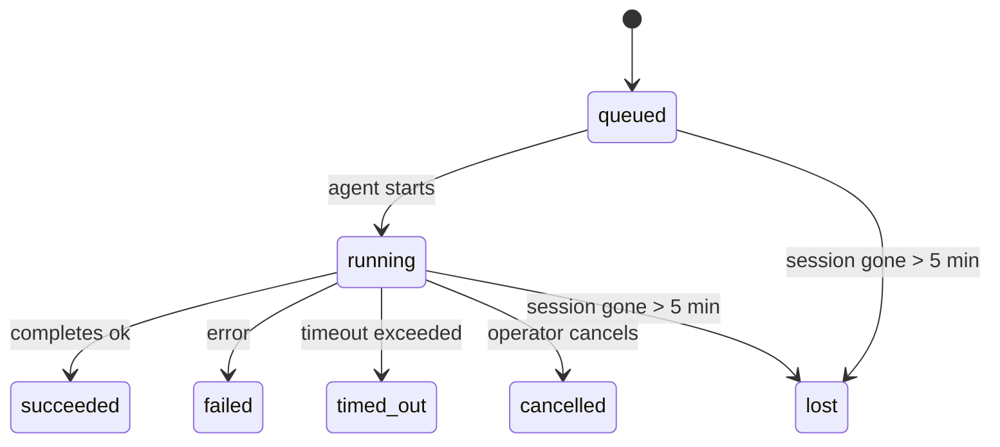

---
read_when:
    - Devam eden veya yakın zamanda tamamlanan arka plan çalışmalarını inceleme
    - Ayrılmış ajan çalıştırmalarında iletim başarısızlıklarında hata ayıklama
    - Arka plan çalıştırmalarının oturumlar, Cron ve Heartbeat ile nasıl ilişkili olduğunu anlama
sidebarTitle: Background tasks
summary: ACP çalıştırmaları, alt ajanlar, yalıtılmış Cron işleri ve CLI işlemleri için arka plan görev takibi
title: Arka plan görevleri
x-i18n:
    generated_at: "2026-05-06T09:02:21Z"
    model: gpt-5.5
    provider: openai
    source_hash: 055e16b4f53dbd089cc72eea7fe80bdaee5451dc56fa6e88a742f98e566bb57a
    source_path: automation/tasks.md
    workflow: 16
---

<Note>
Zamanlama mı arıyorsunuz? Doğru mekanizmayı seçmek için [Otomasyon ve görevler](/tr/automation) bölümüne bakın. Bu sayfa, zamanlayıcı değil, arka plan çalışmaları için etkinlik defteridir.
</Note>

Arka plan görevleri, **ana konuşma oturumunuzun dışında** çalışan işleri izler: ACP çalıştırmaları, alt ajan başlatmaları, yalıtılmış Cron işi yürütmeleri ve CLI tarafından başlatılan işlemler.

Görevler oturumların, Cron işlerinin veya Heartbeat'lerin yerine geçmez; bunlar, hangi ayrık işin ne zaman gerçekleştiğini ve başarılı olup olmadığını kaydeden **etkinlik defteridir**.

<Note>
Her ajan çalıştırması bir görev oluşturmaz. Heartbeat turları ve normal etkileşimli sohbet oluşturmaz. Tüm Cron yürütmeleri, ACP başlatmaları, alt ajan başlatmaları ve CLI ajan komutları oluşturur.
</Note>

## Kısa özet

- Görevler zamanlayıcı değil, **kayıtlardır**; Cron ve Heartbeat işin _ne zaman_ çalışacağını belirler, görevler _ne olduğunu_ izler.
- ACP, alt ajanlar, tüm Cron işleri ve CLI işlemleri görev oluşturur. Heartbeat turları oluşturmaz.
- Her görev `queued → running → terminal` aşamalarından geçer (succeeded, failed, timed_out, cancelled veya lost).
- Cron görevleri, Cron çalışma zamanı hâlâ işi sahipleniyorsa canlı kalır; bellek içi çalışma zamanı durumu kaybolduysa, görev bakımı bir görevi lost olarak işaretlemeden önce dayanıklı Cron çalıştırma geçmişini kontrol eder.
- Tamamlanma push odaklıdır: ayrık iş bittiğinde doğrudan bildirim gönderebilir veya istekte bulunan oturumu/Heartbeat'i uyandırabilir; bu yüzden durum yoklama döngüleri genellikle yanlış biçimdir.
- Yalıtılmış Cron çalıştırmaları ve alt ajan tamamlanmaları, son temizlik kayıtlarından önce alt oturumları için izlenen tarayıcı sekmelerini/süreçlerini en iyi çabayla temizler.
- Yalıtılmış Cron teslimi, alt soy alt ajan işi hâlâ boşalırken eskimiş geçici üst yanıtları bastırır ve teslimden önce geldiğinde nihai alt soy çıktısını tercih eder.
- Tamamlanma bildirimleri doğrudan bir kanala teslim edilir veya bir sonraki Heartbeat için kuyruğa alınır.
- `openclaw tasks list` tüm görevleri gösterir; `openclaw tasks audit` sorunları ortaya çıkarır.
- Terminal kayıtları 7 gün tutulur, ardından otomatik olarak budanır.

## Hızlı başlangıç

<Tabs>
  <Tab title="Listele ve filtrele">
    ```bash
    # List all tasks (newest first)
    openclaw tasks list

    # Filter by runtime or status
    openclaw tasks list --runtime acp
    openclaw tasks list --status running
    ```

  </Tab>
  <Tab title="İncele">
    ```bash
    # Show details for a specific task (by ID, run ID, or session key)
    openclaw tasks show <lookup>
    ```
  </Tab>
  <Tab title="İptal et ve bildir">
    ```bash
    # Cancel a running task (kills the child session)
    openclaw tasks cancel <lookup>

    # Change notification policy for a task
    openclaw tasks notify <lookup> state_changes
    ```

  </Tab>
  <Tab title="Denetim ve bakım">
    ```bash
    # Run a health audit
    openclaw tasks audit

    # Preview or apply maintenance
    openclaw tasks maintenance
    openclaw tasks maintenance --apply
    ```

  </Tab>
  <Tab title="Görev akışı">
    ```bash
    # Inspect TaskFlow state
    openclaw tasks flow list
    openclaw tasks flow show <lookup>
    openclaw tasks flow cancel <lookup>
    ```
  </Tab>
</Tabs>

## Ne görev oluşturur

| Kaynak                 | Çalışma zamanı türü | Görev kaydının oluşturulduğu zaman                      | Varsayılan bildirim ilkesi |
| ---------------------- | ------------ | ------------------------------------------------------ | --------------------- |
| ACP arka plan çalıştırmaları    | `acp`        | Bir alt ACP oturumu başlatma                           | `done_only`           |
| Alt ajan orkestrasyonu | `subagent`   | `sessions_spawn` aracılığıyla bir alt ajan başlatma               | `done_only`           |
| Cron işleri (tüm türler)  | `cron`       | Her Cron yürütmesi (ana oturum ve yalıtılmış)       | `silent`              |
| CLI işlemleri         | `cli`        | Gateway üzerinden çalışan `openclaw agent` komutları | `silent`              |
| Ajan medya işleri       | `cli`        | Oturum destekli `music_generate`/`video_generate` çalıştırmaları  | `silent`              |

<AccordionGroup>
  <Accordion title="Cron ve medya için bildirim varsayılanları">
    Ana oturum Cron görevleri varsayılan olarak `silent` bildirim ilkesini kullanır; izleme için kayıt oluştururlar ancak bildirim üretmezler. Yalıtılmış Cron görevleri de varsayılan olarak `silent` kullanır, ancak kendi oturumlarında çalıştıkları için daha görünürdür.

    Oturum destekli `music_generate` ve `video_generate` çalıştırmaları da `silent` bildirim ilkesini kullanır. Yine de görev kayıtları oluştururlar, ancak tamamlanma, ajanın takip mesajını yazabilmesi ve biten medyayı kendisinin ekleyebilmesi için özgün ajan oturumuna dahili bir uyandırma olarak geri verilir. Grup/kanal tamamlanmaları normal görünür yanıt ilkesini izler, bu yüzden kaynak teslimi gerektirdiğinde ajan mesaj aracını kullanır. Tamamlanma ajanı, yalnızca araç kullanan bir rotada mesaj aracı teslim kanıtı üretemezse, OpenClaw medyayı gizli bırakmak yerine tamamlanma yedeğini doğrudan özgün kanala gönderir.

  </Accordion>
  <Accordion title="Eşzamanlı video_generate koruması">
    Oturum destekli bir `video_generate` görevi hâlâ etkinken, araç ayrıca bir koruma işlevi görür: aynı oturumdaki yinelenen `video_generate` çağrıları, ikinci bir eşzamanlı üretim başlatmak yerine etkin görev durumunu döndürür. Ajan tarafında açık bir ilerleme/durum araması istediğinizde `action: "status"` kullanın.
  </Accordion>
  <Accordion title="Neler görev oluşturmaz">
    - Heartbeat turları; ana oturum, bkz. [Heartbeat](/tr/gateway/heartbeat)
    - Normal etkileşimli sohbet turları
    - Doğrudan `/command` yanıtları

  </Accordion>
</AccordionGroup>

## Görev yaşam döngüsü



| Durum      | Anlamı                                                              |
| ----------- | -------------------------------------------------------------------------- |
| `queued`    | Oluşturuldu, ajanın başlamasını bekliyor                                    |
| `running`   | Ajan turu etkin olarak yürütülüyor                                           |
| `succeeded` | Başarıyla tamamlandı                                                     |
| `failed`    | Bir hatayla tamamlandı                                                    |
| `timed_out` | Yapılandırılan zaman aşımını aştı                                            |
| `cancelled` | Operatör tarafından `openclaw tasks cancel` ile durduruldu                        |
| `lost`      | Çalışma zamanı, 5 dakikalık tolerans süresinden sonra yetkili destek durumunu kaybetti |

Geçişler otomatik olarak gerçekleşir; ilişkili ajan çalıştırması sona erdiğinde görev durumu buna uyacak şekilde güncellenir.

Ajan çalıştırmasının tamamlanması, etkin görev kayıtları için yetkilidir. Başarılı bir ayrık çalıştırma `succeeded` olarak sonlandırılır, sıradan çalıştırma hataları `failed` olarak sonlandırılır, zaman aşımı veya iptal sonuçları `timed_out` olarak sonlandırılır. Bir operatör görevi zaten iptal ettiyse veya çalışma zamanı `failed`, `timed_out` ya da `lost` gibi daha güçlü bir terminal durumu zaten kaydettiyse, daha sonra gelen başarı sinyali bu terminal durumunu düşürmez.

`lost` çalışma zamanı bilincine sahiptir:

- ACP görevleri: destekleyen ACP alt oturum meta verisi kayboldu.
- Alt ajan görevleri: destekleyen alt oturum hedef ajan deposundan kayboldu.
- Cron görevleri: Cron çalışma zamanı işi artık etkin olarak izlemiyor ve dayanıklı Cron çalıştırma geçmişi o çalıştırma için terminal bir sonuç göstermiyor. Çevrimdışı CLI denetimi, kendi boş süreç içi Cron çalışma zamanı durumunu yetkili olarak değerlendirmez.
- CLI görevleri: yalıtılmış alt oturum görevleri alt oturumu kullanır; sohbet destekli CLI görevleri ise bunun yerine canlı çalıştırma bağlamını kullanır, bu yüzden kalan kanal/grup/doğrudan oturum satırları onları canlı tutmaz. Gateway destekli `openclaw agent` çalıştırmaları da kendi çalıştırma sonucundan sonlandırılır, bu yüzden tamamlanan çalıştırmalar süpürücü onları `lost` olarak işaretleyene kadar etkin kalmaz.

## Teslim ve bildirimler

Bir görev terminal duruma ulaştığında OpenClaw sizi bilgilendirir. İki teslim yolu vardır:

**Doğrudan teslim** - görevin bir kanal hedefi varsa (`requesterOrigin`), tamamlanma mesajı doğrudan o kanala gider (Telegram, Discord, Slack vb.). Alt ajan tamamlanmaları için OpenClaw, varsa bağlı ileti dizisi/konu yönlendirmesini de korur ve doğrudan teslimden vazgeçmeden önce istekte bulunan oturumun saklanan rotasından (`lastChannel` / `lastTo` / `lastAccountId`) eksik bir `to` / hesabı doldurabilir.

**Oturum kuyruğuna alınmış teslim** - doğrudan teslim başarısız olursa veya kaynak ayarlanmamışsa, güncelleme istekte bulunanın oturumunda bir sistem olayı olarak kuyruğa alınır ve bir sonraki Heartbeat'te görünür.

<Tip>
Görev tamamlanması anında bir Heartbeat uyandırması tetikler; böylece sonucu hızlıca görürsünüz, bir sonraki zamanlanmış Heartbeat tikini beklemeniz gerekmez.
</Tip>

Bu, olağan iş akışının push tabanlı olduğu anlamına gelir: ayrık işi bir kez başlatın, ardından çalışma zamanının tamamlanınca sizi uyandırmasına veya bildirmesine izin verin. Görev durumunu yalnızca hata ayıklama, müdahale veya açık bir denetim gerektiğinde yoklayın.

### Bildirim ilkeleri

Her görev hakkında ne kadar haber alacağınızı denetleyin:

| İlke                | Teslim edilen                                                       |
| --------------------- | ----------------------------------------------------------------------- |
| `done_only` (varsayılan) | Yalnızca terminal durum (succeeded, failed vb.); **varsayılan budur** |
| `state_changes`       | Her durum geçişi ve ilerleme güncellemesi                              |
| `silent`              | Hiçbir şey                                                          |

Bir görev çalışırken ilkeyi değiştirin:

```bash
openclaw tasks notify <lookup> state_changes
```

## CLI referansı

<AccordionGroup>
  <Accordion title="tasks list">
    ```bash
    openclaw tasks list [--runtime <acp|subagent|cron|cli>] [--status <status>] [--json]
    ```

    Çıktı sütunları: Görev kimliği, Tür, Durum, Teslim, Çalıştırma kimliği, Alt oturum, Özet.

  </Accordion>
  <Accordion title="tasks show">
    ```bash
    openclaw tasks show <lookup>
    ```

    Arama belirteci bir görev kimliğini, çalıştırma kimliğini veya oturum anahtarını kabul eder. Zamanlama, teslim durumu, hata ve terminal özet dahil tam kaydı gösterir.

  </Accordion>
  <Accordion title="tasks cancel">
    ```bash
    openclaw tasks cancel <lookup>
    ```

    ACP ve alt ajan görevleri için bu, alt oturumu sonlandırır. CLI tarafından izlenen görevler için iptal, görev kayıt defterine kaydedilir (ayrı bir alt çalışma zamanı tanıtıcısı yoktur). Durum `cancelled` olarak değişir ve uygun olduğunda bir teslim bildirimi gönderilir.

  </Accordion>
  <Accordion title="tasks notify">
    ```bash
    openclaw tasks notify <lookup> <done_only|state_changes|silent>
    ```
  </Accordion>
  <Accordion title="tasks audit">
    ```bash
    openclaw tasks audit [--json]
    ```

    Operasyonel sorunları ortaya çıkarır. Sorunlar algılandığında bulgular `openclaw status` içinde de görünür.

    | Bulgu                     | Önem Derecesi | Tetikleyici                                                                                                          |
    | ------------------------- | ---------- | -------------------------------------------------------------------------------------------------------------------- |
    | `stale_queued`            | warn       | 10 dakikadan uzun süredir kuyrukta                                                                                    |
    | `stale_running`           | error      | 30 dakikadan uzun süredir çalışıyor                                                                                   |
    | `lost`                    | warn/error | Çalışma zamanı destekli görev sahipliği kayboldu; tutulan kayıp görevler `cleanupAfter` değerine kadar uyarı verir, sonra hata olur |
    | `delivery_failed`         | warn       | Teslim başarısız oldu ve bildirim ilkesi `silent` değil                                                               |
    | `missing_cleanup`         | warn       | Temizleme zaman damgası olmayan terminal görev                                                                        |
    | `inconsistent_timestamps` | warn       | Zaman çizelgesi ihlali (örneğin başlamadan önce sona erdi)                                                            |

  </Accordion>
  <Accordion title="tasks maintenance">
    ```bash
    openclaw tasks maintenance [--json]
    openclaw tasks maintenance --apply [--json]
    ```

    Bunu görevler ve Task Flow durumu için mutabakatı, temizleme damgalamasını ve budamayı önizlemek veya uygulamak için kullanın.

    Mutabakat çalışma zamanına duyarlıdır:

    - ACP/alt ajan görevleri, onları destekleyen alt oturumu denetler.
    - Alt oturumunda yeniden başlatma kurtarma mezar taşı bulunan alt ajan görevleri, kurtarılabilir destek oturumları olarak ele alınmak yerine kayıp olarak işaretlenir.
    - Cron görevleri, cron çalışma zamanının işi hâlâ sahiplenip sahiplenmediğini denetler, ardından `lost` durumuna geri dönmeden önce terminal durumunu kalıcı cron çalıştırma günlüklerinden/iş durumundan kurtarır. Bellek içi cron etkin iş kümesi için yalnızca Gateway işlemi yetkilidir; çevrimdışı CLI denetimi dayanıklı geçmişi kullanır ancak yalnızca bu yerel Set boş olduğu için bir cron görevini kayıp olarak işaretlemez.
    - Sohbet destekli CLI görevleri, yalnızca sohbet oturumu satırını değil, sahip olan canlı çalıştırma bağlamını denetler.

    Tamamlama temizliği de çalışma zamanına duyarlıdır:

    - Alt ajan tamamlaması, duyuru temizliği devam etmeden önce alt oturum için izlenen tarayıcı sekmelerini/işlemlerini en iyi çabayla kapatır.
    - Yalıtılmış cron tamamlaması, çalıştırma tamamen sona ermeden önce cron oturumu için izlenen tarayıcı sekmelerini/işlemlerini en iyi çabayla kapatır.
    - Yalıtılmış cron teslimi, gerektiğinde alt öğe alt ajan takip işlemini bekler ve duyurmak yerine eski üst onay metnini bastırır.
    - Alt ajan tamamlama teslimi en son görünen asistan metnini tercih eder; bu boşsa temizlenmiş en son araç/toolResult metnine geri döner ve yalnızca zaman aşımına uğramış araç çağrısı çalıştırmaları kısa bir kısmi ilerleme özetine indirgenebilir. Terminal başarısız çalıştırmalar, yakalanan yanıt metnini yeniden oynatmadan başarısızlık durumunu duyurur.
    - Temizleme hataları gerçek görev sonucunu maskelemez.

  </Accordion>
  <Accordion title="tasks flow list | show | cancel">
    ```bash
    openclaw tasks flow list [--status <status>] [--json]
    openclaw tasks flow show <lookup> [--json]
    openclaw tasks flow cancel <lookup>
    ```

    Bunları, önemsediğiniz şey tek bir arka plan görev kaydı yerine düzenleyici Task Flow olduğunda kullanın.

  </Accordion>
</AccordionGroup>

## Sohbet görev panosu (`/tasks`)

Bu oturuma bağlı arka plan görevlerini görmek için herhangi bir sohbet oturumunda `/tasks` kullanın. Pano, etkin ve yakın zamanda tamamlanan görevleri çalışma zamanı, durum, zamanlama ve ilerleme ya da hata ayrıntısıyla gösterir.

Geçerli oturumda görünür bağlı görev olmadığında, `/tasks` ajan yerel görev sayılarına geri döner; böylece diğer oturumların ayrıntılarını sızdırmadan yine de bir genel bakış elde edersiniz.

Tam operatör defteri için CLI kullanın: `openclaw tasks list`.

## Durum entegrasyonu (görev baskısı)

`openclaw status`, bir bakışta görev özeti içerir:

```
Tasks: 3 queued · 2 running · 1 issues
```

Özet şunları bildirir:

- **active** - `queued` + `running` sayısı
- **failures** - `failed` + `timed_out` + `lost` sayısı
- **byRuntime** - `acp`, `subagent`, `cron`, `cli` bazında döküm

Hem `/status` hem de `session_status` aracı temizliğe duyarlı bir görev anlık görüntüsü kullanır: etkin görevler tercih edilir, eski tamamlanmış satırlar gizlenir ve son başarısızlıklar yalnızca etkin iş kalmadığında gösterilir. Bu, durum kartını şu anda önemli olana odaklı tutar.

## Depolama ve bakım

### Görevlerin bulunduğu yer

Görev kayıtları SQLite içinde şu konumda kalıcı olur:

```
$OPENCLAW_STATE_DIR/tasks/runs.sqlite
```

Kayıt defteri Gateway başlangıcında belleğe yüklenir ve yeniden başlatmalar arasında dayanıklılık için yazmaları SQLite ile eşitler.
Gateway, SQLite varsayılan otomatik denetim noktası eşiğini ve düzenli/kapanış `TRUNCATE` denetim noktalarını kullanarak SQLite write-ahead log boyutunu sınırlı tutar.

### Otomatik bakım

Bir süpürücü her **60 saniyede** bir çalışır ve dört şeyi yönetir:

<Steps>
  <Step title="Reconciliation">
    Etkin görevlerin hâlâ yetkili çalışma zamanı desteğine sahip olup olmadığını denetler. ACP/alt ajan görevleri alt oturum durumunu, cron görevleri etkin iş sahipliğini ve sohbet destekli CLI görevleri sahip olan çalıştırma bağlamını kullanır. Bu destek durumu 5 dakikadan uzun süre yoksa görev `lost` olarak işaretlenir.
  </Step>
  <Step title="ACP session repair">
    Terminal veya sahipsiz üst sahipli tek seferlik ACP oturumlarını kapatır ve eski terminal veya sahipsiz kalıcı ACP oturumlarını yalnızca etkin konuşma bağlaması kalmadığında kapatır.
  </Step>
  <Step title="Cleanup stamping">
    Terminal görevlerde bir `cleanupAfter` zaman damgası ayarlar (endedAt + 7 gün). Saklama süresi boyunca kayıp görevler denetimde hâlâ uyarı olarak görünür; `cleanupAfter` süresi dolduktan sonra veya temizleme meta verisi eksik olduğunda hata olurlar.
  </Step>
  <Step title="Pruning">
    `cleanupAfter` tarihini geçmiş kayıtları siler.
  </Step>
</Steps>

<Note>
**Saklama:** terminal görev kayıtları **7 gün** tutulur, ardından otomatik olarak budanır. Yapılandırma gerekmez.
</Note>

## Görevlerin diğer sistemlerle ilişkisi

<AccordionGroup>
  <Accordion title="Tasks and Task Flow">
    [Task Flow](/tr/automation/taskflow), arka plan görevlerinin üzerindeki akış düzenleme katmanıdır. Tek bir akış, yaşam süresi boyunca yönetilen veya yansıtılan eşitleme modlarını kullanarak birden çok görevi koordine edebilir. Tek tek görev kayıtlarını incelemek için `openclaw tasks`, düzenleyici akışı incelemek için `openclaw tasks flow` kullanın.

    Ayrıntılar için [Task Flow](/tr/automation/taskflow) bölümüne bakın.

  </Accordion>
  <Accordion title="Tasks and cron">
    Bir cron işi **tanımı** `~/.openclaw/cron/jobs.json` içinde bulunur; çalışma zamanı yürütme durumu ise yanında `~/.openclaw/cron/jobs-state.json` içinde bulunur. **Her** cron yürütmesi bir görev kaydı oluşturur - hem ana oturum hem de yalıtılmış yürütmeler. Ana oturum cron görevleri, bildirim oluşturmadan izlenebilmeleri için varsayılan olarak `silent` bildirim ilkesini kullanır.

    Bkz. [Cron İşleri](/tr/automation/cron-jobs).

  </Accordion>
  <Accordion title="Tasks and heartbeat">
    Heartbeat çalıştırmaları ana oturum turlarıdır - görev kaydı oluşturmazlar. Bir görev tamamlandığında, sonucu hızlıca görmeniz için bir Heartbeat uyandırması tetikleyebilir.

    Bkz. [Heartbeat](/tr/gateway/heartbeat).

  </Accordion>
  <Accordion title="Tasks and sessions">
    Bir görev bir `childSessionKey` (işin çalıştığı yer) ve bir `requesterSessionKey` (işi başlatan kişi) referans alabilir. Oturumlar konuşma bağlamıdır; görevler bunun üzerindeki etkinlik takibidir.
  </Accordion>
  <Accordion title="Tasks and agent runs">
    Bir görevin `runId` değeri, işi yapan ajan çalıştırmasına bağlanır. Ajan yaşam döngüsü olayları (başlatma, bitiş, hata) görev durumunu otomatik olarak günceller - yaşam döngüsünü elle yönetmeniz gerekmez.
  </Accordion>
</AccordionGroup>

## İlgili

- [Otomasyon ve Görevler](/tr/automation) - tüm otomasyon mekanizmalarına bir bakış
- [CLI: Görevler](/tr/cli/tasks) - CLI komut başvurusu
- [Heartbeat](/tr/gateway/heartbeat) - düzenli ana oturum turları
- [Zamanlanmış Görevler](/tr/automation/cron-jobs) - arka plan işini zamanlama
- [Task Flow](/tr/automation/taskflow) - görevlerin üzerindeki akış düzenleme
