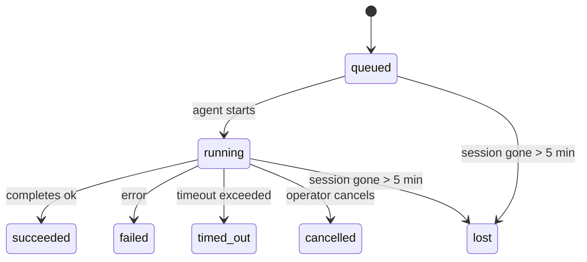

---
read_when:
    - Devam eden veya yakın zamanda tamamlanan arka plan çalışmalarını inceleme
    - Ayrılmış ajan çalıştırmalarında teslimat hatalarında hata ayıklama
    - Arka plan çalıştırmalarının oturumlar, Cron ve Heartbeat ile nasıl ilişkili olduğunu anlama
sidebarTitle: Background tasks
summary: ACP çalıştırmaları, alt ajanlar, yalıtılmış Cron işleri ve CLI işlemleri için arka plan görev takibi
title: Arka plan görevleri
x-i18n:
    generated_at: "2026-05-12T00:56:11Z"
    model: gpt-5.5
    provider: openai
    source_hash: 31cbf09df48bab0686a1350f91aefffffef899c86704bb97b68320fc47e78021
    source_path: automation/tasks.md
    workflow: 16
---

<Note>
Zamanlama mı arıyorsunuz? Doğru mekanizmayı seçmek için [Automation](/tr/automation) sayfasına bakın. Bu sayfa arka plan işi için etkinlik defteridir, zamanlayıcı değildir.
</Note>

Arka plan görevleri, **ana konuşma oturumunuzun dışında** çalışan işleri izler: ACP çalıştırmaları, alt ajan başlatmaları, izole cron işi yürütmeleri ve CLI tarafından başlatılan işlemler.

Görevler oturumların, cron işlerinin veya heartbeat'lerin yerini **almaz**; bunlar, hangi bağımsız işin ne zaman gerçekleştiğini ve başarılı olup olmadığını kaydeden **etkinlik defteridir**.

<Note>
Her ajan çalıştırması görev oluşturmaz. Heartbeat dönüşleri ve normal etkileşimli sohbet oluşturmaz. Tüm cron yürütmeleri, ACP başlatmaları, alt ajan başlatmaları ve CLI ajan komutları oluşturur.
</Note>

## TL;DR

- Görevler zamanlayıcı değil, **kayıtlardır**; cron ve heartbeat işin _ne zaman_ çalışacağına karar verir, görevler _ne olduğunu_ izler.
- ACP, alt ajanlar, tüm cron işleri ve CLI işlemleri görev oluşturur. Heartbeat dönüşleri oluşturmaz.
- Her görev `queued → running → terminal` (succeeded, failed, timed_out, cancelled veya lost) üzerinden ilerler.
- Cron görevleri, cron çalışma zamanı işi hâlâ sahiplenirken canlı kalır; bellek içi çalışma zamanı durumu kaybolduysa görev bakımı, görevi lost olarak işaretlemeden önce dayanıklı cron çalıştırma geçmişini denetler.
- Tamamlama push odaklıdır: bağımsız iş doğrudan bildirebilir veya bittiğinde istekte bulunan oturumu/heartbeat'i uyandırabilir; bu yüzden durum yoklama döngüleri genellikle yanlış biçimdir.
- İzole cron çalıştırmaları ve alt ajan tamamlamaları, son temizlik muhasebesinden önce alt oturumları için izlenen tarayıcı sekmelerini/süreçlerini en iyi çabayla temizler.
- İzole cron teslimi, soy alt ajan işi hâlâ boşalırken eski ara üst yanıtları bastırır ve teslimden önce gelirse son soy çıktısını tercih eder.
- Tamamlama bildirimleri doğrudan bir kanala teslim edilir veya bir sonraki heartbeat için kuyruğa alınır.
- `openclaw tasks list` tüm görevleri gösterir; `openclaw tasks audit` sorunları ortaya çıkarır.
- Terminal kayıtları 7 gün tutulur, ardından otomatik olarak budanır.

## Hızlı başlangıç

<Tabs>
  <Tab title="Listele ve filtrele">
    ```bash
    # Tüm görevleri listele (en yeni önce)
    openclaw tasks list

    # Çalışma zamanı veya duruma göre filtrele
    openclaw tasks list --runtime acp
    openclaw tasks list --status running
    ```

  </Tab>
  <Tab title="İncele">
    ```bash
    # Belirli bir görev için ayrıntıları göster (ID, çalıştırma ID'si veya oturum anahtarına göre)
    openclaw tasks show <lookup>
    ```
  </Tab>
  <Tab title="İptal et ve bildir">
    ```bash
    # Çalışan bir görevi iptal et (alt oturumu sonlandırır)
    openclaw tasks cancel <lookup>

    # Bir görev için bildirim politikasını değiştir
    openclaw tasks notify <lookup> state_changes
    ```

  </Tab>
  <Tab title="Denetim ve bakım">
    ```bash
    # Sağlık denetimi çalıştır
    openclaw tasks audit

    # Bakımı önizle veya uygula
    openclaw tasks maintenance
    openclaw tasks maintenance --apply
    ```

  </Tab>
  <Tab title="TaskFlow">
    ```bash
    # TaskFlow durumunu incele
    openclaw tasks flow list
    openclaw tasks flow show <lookup>
    openclaw tasks flow cancel <lookup>
    ```
  </Tab>
</Tabs>

## Ne görev oluşturur

| Kaynak                 | Çalışma zamanı türü | Bir görev kaydı oluşturulduğu zaman                      | Varsayılan bildirim politikası |
| ---------------------- | ------------ | ------------------------------------------------------ | --------------------- |
| ACP arka plan çalıştırmaları    | `acp`        | Bir alt ACP oturumu başlatılırken                           | `done_only`           |
| Alt ajan orkestrasyonu | `subagent`   | `sessions_spawn` üzerinden bir alt ajan başlatılırken               | `done_only`           |
| Cron işleri (tüm türler)  | `cron`       | Her cron yürütmesi (ana oturum ve izole)       | `silent`              |
| CLI işlemleri         | `cli`        | Gateway üzerinden çalışan `openclaw agent` komutları | `silent`              |
| Ajan medya işleri       | `cli`        | Oturum destekli `music_generate`/`video_generate` çalıştırmaları  | `silent`              |

<AccordionGroup>
  <Accordion title="Cron ve medya için bildirim varsayılanları">
    Ana oturum cron görevleri varsayılan olarak `silent` bildirim politikasını kullanır; izleme için kayıt oluştururlar ama bildirim üretmezler. İzole cron görevleri de varsayılan olarak `silent` kullanır ancak kendi oturumlarında çalıştıkları için daha görünürdür.

    Oturum destekli `music_generate` ve `video_generate` çalıştırmaları da `silent` bildirim politikasını kullanır. Yine de görev kayıtları oluştururlar, ancak tamamlama özgün ajan oturumuna dahili bir uyandırma olarak geri verilir; böylece ajan takip mesajını yazabilir ve tamamlanan medyayı kendisi ekleyebilir. Grup/kanal tamamlamaları normal görünür yanıt politikasını izler, bu yüzden kaynak teslimi gerektirdiğinde ajan mesaj aracını kullanır. Tamamlama ajanı yalnızca araç kullanılan bir rotada mesaj aracı teslim kanıtı üretemezse OpenClaw, medyayı özel bırakmak yerine tamamlama yedeğini doğrudan özgün kanala gönderir.

  </Accordion>
  <Accordion title="Eşzamanlı video_generate güvenlik sınırı">
    Oturum destekli bir `video_generate` görevi hâlâ aktifken araç aynı zamanda bir güvenlik sınırı gibi davranır: aynı oturumdaki tekrarlanan `video_generate` çağrıları ikinci bir eşzamanlı üretim başlatmak yerine aktif görev durumunu döndürür. Ajan tarafından açık bir ilerleme/durum araması istediğinizde `action: "status"` kullanın.
  </Accordion>
  <Accordion title="Ne görev oluşturmaz">
    - Heartbeat dönüşleri - ana oturum; bkz. [Heartbeat](/tr/gateway/heartbeat)
    - Normal etkileşimli sohbet dönüşleri
    - Doğrudan `/command` yanıtları

  </Accordion>
</AccordionGroup>

## Görev yaşam döngüsü



| Durum      | Anlamı                                                              |
| ----------- | -------------------------------------------------------------------------- |
| `queued`    | Oluşturuldu, ajanın başlamasını bekliyor                                    |
| `running`   | Ajan dönüşü etkin olarak yürütülüyor                                           |
| `succeeded` | Başarıyla tamamlandı                                                     |
| `failed`    | Bir hatayla tamamlandı                                                    |
| `timed_out` | Yapılandırılan zaman aşımını aştı                                            |
| `cancelled` | Operatör tarafından `openclaw tasks cancel` ile durduruldu                        |
| `lost`      | Çalışma zamanı, 5 dakikalık bekleme süresinden sonra yetkili destek durumunu kaybetti |

Geçişler otomatik olarak gerçekleşir; ilişkili ajan çalıştırması bittiğinde görev durumu buna uyacak şekilde güncellenir.

Ajan çalıştırmasının tamamlanması aktif görev kayıtları için belirleyicidir. Başarılı bir bağımsız çalıştırma `succeeded` olarak sonlandırılır, sıradan çalıştırma hataları `failed` olarak sonlandırılır ve zaman aşımı veya iptal sonuçları `timed_out` olarak sonlandırılır. Bir operatör görevi zaten iptal ettiyse veya çalışma zamanı `failed`, `timed_out` ya da `lost` gibi daha güçlü bir terminal durumu zaten kaydettiyse daha sonraki bir başarı sinyali bu terminal durumu düşürmez.

`lost` çalışma zamanı farkındadır:

- ACP görevleri: destekleyen ACP alt oturum metaverisi kayboldu.
- Alt ajan görevleri: destekleyen alt oturum hedef ajan deposundan kayboldu.
- Cron görevleri: cron çalışma zamanı işi artık aktif olarak izlemiyor ve dayanıklı cron çalıştırma geçmişi bu çalıştırma için terminal bir sonuç göstermiyor. Çevrimdışı CLI denetimi, kendi boş süreç içi cron çalışma zamanı durumunu yetkili saymaz.
- CLI görevleri: çalıştırma ID'si/kaynak ID'si olan görevler canlı çalıştırma bağlamını kullanır; böylece kalıcı alt oturum veya sohbet oturumu satırları, Gateway sahipliğindeki çalıştırma kaybolduktan sonra onları canlı tutmaz. Çalıştırma kimliği olmayan eski CLI görevleri hâlâ alt oturuma geri döner. Gateway destekli `openclaw agent` çalıştırmaları da çalıştırma sonucundan sonlandırılır; bu nedenle tamamlanan çalıştırmalar süpürücü onları `lost` olarak işaretleyene kadar aktif kalmaz.

## Teslim ve bildirimler

Bir görev terminal duruma ulaştığında OpenClaw sizi bilgilendirir. İki teslim yolu vardır:

**Doğrudan teslim** - görevde bir kanal hedefi varsa (`requesterOrigin`), tamamlama mesajı doğrudan o kanala gider (Telegram, Discord, Slack vb.). Grup ve kanal görevi tamamlamaları bunun yerine istekte bulunan oturum üzerinden yönlendirilir; böylece üst ajan görünür yanıtı yazabilir. Alt ajan tamamlamaları için OpenClaw, mevcut olduğunda bağlı iş parçacığı/konu yönlendirmesini de korur ve doğrudan teslimden vazgeçmeden önce eksik bir `to` / hesabı istekte bulunan oturumun saklanan rotasından (`lastChannel` / `lastTo` / `lastAccountId`) doldurabilir.

**Oturum kuyruğuna alınmış teslim** - doğrudan teslim başarısız olursa veya origin ayarlanmamışsa güncelleme, istekte bulunanın oturumunda bir sistem olayı olarak kuyruğa alınır ve bir sonraki heartbeat'te görünür.

<Tip>
Görev tamamlanması anında bir heartbeat uyandırmasını tetikler; böylece sonucu hızlıca görürsünüz, bir sonraki zamanlanmış heartbeat anını beklemeniz gerekmez.
</Tip>

Bu, olağan iş akışının push tabanlı olduğu anlamına gelir: bağımsız işi bir kez başlatın, sonra çalışma zamanının tamamlandığında sizi uyandırmasına veya bilgilendirmesine izin verin. Görev durumunu yalnızca hata ayıklama, müdahale veya açık bir denetim gerektiğinde yoklayın.

### Bildirim politikaları

Her görev hakkında ne kadar duyacağınızı denetleyin:

| Politika                | Ne teslim edilir                                                       |
| --------------------- | ----------------------------------------------------------------------- |
| `done_only` (varsayılan) | Yalnızca terminal durum (succeeded, failed vb.) - **varsayılan budur** |
| `state_changes`       | Her durum geçişi ve ilerleme güncellemesi                              |
| `silent`              | Hiçbir şey                                                          |

Bir görev çalışırken politikayı değiştirin:

```bash
openclaw tasks notify <lookup> state_changes
```

## CLI başvurusu

<AccordionGroup>
  <Accordion title="tasks list">
    ```bash
    openclaw tasks list [--runtime <acp|subagent|cron|cli>] [--status <status>] [--json]
    ```

    Çıktı sütunları: Görev ID'si, Tür, Durum, Teslim, Çalıştırma ID'si, Alt Oturum, Özet.

  </Accordion>
  <Accordion title="tasks show">
    ```bash
    openclaw tasks show <lookup>
    ```

    Arama belirteci bir görev ID'si, çalıştırma ID'si veya oturum anahtarı kabul eder. Zamanlama, teslim durumu, hata ve terminal özet dahil tam kaydı gösterir.

  </Accordion>
  <Accordion title="tasks cancel">
    ```bash
    openclaw tasks cancel <lookup>
    ```

    ACP ve alt ajan görevleri için bu, alt oturumu sonlandırır. CLI ile izlenen görevler için iptal görev kayıt defterine kaydedilir (ayrı bir alt çalışma zamanı tanıtıcısı yoktur). Durum `cancelled` değerine geçer ve uygulanabilir olduğunda teslim bildirimi gönderilir.

  </Accordion>
  <Accordion title="tasks notify">
    ```bash
    openclaw tasks notify <lookup> <done_only|state_changes|silent>
    ```
  </Accordion>
  <Accordion title="tasks audit">
    ```bash
    openclaw tasks audit [--json]
    ```

    Operasyonel sorunları ortaya çıkarır. Bulgular, sorun algılandığında `openclaw status` içinde de görünür.

    | Bulgu                     | Önem       | Tetikleyici                                                                                                  |
    | ------------------------- | ---------- | ------------------------------------------------------------------------------------------------------------ |
    | `stale_queued`            | warn       | 10 dakikadan uzun süredir kuyrukta                                                                           |
    | `stale_running`           | error      | 30 dakikadan uzun süredir çalışıyor                                                                          |
    | `lost`                    | warn/error | Runtime destekli görev sahipliği kayboldu; tutulan kayıp görevler `cleanupAfter` zamanına kadar uyarı verir, sonra hataya dönüşür |
    | `delivery_failed`         | warn       | Teslim başarısız oldu ve bildirim ilkesi `silent` değil                                                      |
    | `missing_cleanup`         | warn       | Temizleme zaman damgası olmayan terminal görev                                                               |
    | `inconsistent_timestamps` | warn       | Zaman çizelgesi ihlali (örneğin başlamadan önce bitmiş)                                                      |

  </Accordion>
  <Accordion title="tasks maintenance">
    ```bash
    openclaw tasks maintenance [--json]
    openclaw tasks maintenance --apply [--json]
    ```

    Bunu görevler, Task Flow durumu ve eski cron çalıştırma oturumu kayıt defteri satırları için mutabakatı, temizleme damgalamasını ve budamayı önizlemek veya uygulamak için kullanın.

    Mutabakat runtime farkındadır:

    - ACP/subagent görevleri, destekleyen alt oturumlarını denetler.
    - Alt oturumunda yeniden başlatma kurtarma mezar taşı olan subagent görevleri, kurtarılabilir destek oturumları olarak ele alınmak yerine kayıp olarak işaretlenir.
    - Cron görevleri, cron runtime'ının işi hâlâ sahiplenip sahiplenmediğini denetler, ardından `lost` durumuna düşmeden önce kalıcı cron çalıştırma günlüklerinden/iş durumundan terminal durumu kurtarır. Bellek içi cron etkin iş kümesi için yalnızca Gateway süreci yetkilidir; çevrimdışı CLI denetimi dayanıklı geçmişi kullanır ancak yalnızca bu yerel Set boş olduğu için bir cron görevini kayıp olarak işaretlemez.
    - Çalıştırma kimliğine sahip CLI görevleri, yalnızca alt oturum veya sohbet oturumu satırlarını değil, sahip olan canlı çalıştırma bağlamını denetler.

    Tamamlanma temizliği de runtime farkındadır:

    - Subagent tamamlanması, duyuru temizliği devam etmeden önce alt oturum için izlenen tarayıcı sekmelerini/süreçlerini en iyi çabayla kapatır.
    - Yalıtılmış cron tamamlanması, çalıştırma tamamen sonlandırılmadan önce cron oturumu için izlenen tarayıcı sekmelerini/süreçlerini en iyi çabayla kapatır.
    - Yalıtılmış cron teslimi, gerektiğinde alt soy subagent takibini bekler ve bunu duyurmak yerine eski üst onay metnini bastırır.
    - Subagent tamamlanma teslimi en son görünür assistant metnini tercih eder; bu boşsa temizlenmiş en son araç/toolResult metnine geri döner ve yalnızca zaman aşımına uğramış araç çağrısı çalıştırmaları kısa bir kısmi ilerleme özetine indirgenebilir. Terminal başarısız çalıştırmalar, yakalanan yanıt metnini yeniden oynatmadan başarısızlık durumunu duyurur.
    - Temizleme hataları gerçek görev sonucunu maskelemez.

    Bakım uygulanırken OpenClaw, o anda çalışan cron işleri için satırları koruyup cron olmayan oturum satırlarına dokunmadan, 7 günden eski eski `cron:<jobId>:run:<uuid>` oturum kayıt defteri satırlarını da kaldırır.

  </Accordion>
  <Accordion title="tasks flow list | show | cancel">
    ```bash
    openclaw tasks flow list [--status <status>] [--json]
    openclaw tasks flow show <lookup> [--json]
    openclaw tasks flow cancel <lookup>
    ```

    Önemsediğiniz şey tek bir arka plan görev kaydı değil, orkestrasyonu yapan Task Flow olduğunda bunları kullanın.

  </Accordion>
</AccordionGroup>

## Sohbet görev panosu (`/tasks`)

Bu oturuma bağlı arka plan görevlerini görmek için herhangi bir sohbet oturumunda `/tasks` kullanın. Pano, etkin ve yakın zamanda tamamlanmış görevleri runtime, durum, zamanlama ve ilerleme veya hata ayrıntısıyla gösterir.

Geçerli oturumda görünür bağlı görev yoksa, `/tasks` diğer oturum ayrıntılarını sızdırmadan yine de bir genel bakış almanız için aracı yerel görev sayılarına geri döner.

Tam operatör defteri için CLI kullanın: `openclaw tasks list`.

## Durum entegrasyonu (görev baskısı)

`openclaw status` bir bakışta görev özeti içerir:

```
Tasks: 3 queued · 2 running · 1 issues
```

Özet şunları bildirir:

- **active** - `queued` + `running` sayısı
- **failures** - `failed` + `timed_out` + `lost` sayısı
- **byRuntime** - `acp`, `subagent`, `cron`, `cli` kırılımı

Hem `/status` hem de `session_status` aracı temizleme farkındalığı olan bir görev anlık görüntüsü kullanır: etkin görevler tercih edilir, eski tamamlanmış satırlar gizlenir ve son hatalar yalnızca etkin iş kalmadığında yüzeye çıkar. Bu, durum kartının şu anda önemli olana odaklı kalmasını sağlar.

## Depolama ve bakım

### Görevlerin bulunduğu yer

Görev kayıtları SQLite içinde şu konumda kalıcıdır:

```
$OPENCLAW_STATE_DIR/tasks/runs.sqlite
```

Kayıt defteri Gateway başlangıcında belleğe yüklenir ve yeniden başlatmalar arasında dayanıklılık için yazmaları SQLite ile eşitler.
Gateway, SQLite'ın varsayılan autocheckpoint eşiğini ve periyodik ve kapanış `TRUNCATE` checkpoint'lerini kullanarak SQLite write-ahead log'unu sınırlı tutar.

### Otomatik bakım

Bir süpürücü her **60 saniyede** çalışır ve dört şeyi ele alır:

<Steps>
  <Step title="Mutabakat">
    Etkin görevlerin hâlâ yetkili runtime desteğine sahip olup olmadığını denetler. ACP/subagent görevleri alt oturum durumunu, cron görevleri etkin iş sahipliğini ve çalıştırma kimliğine sahip CLI görevleri sahip olan çalıştırma bağlamını kullanır. Bu destek durumu 5 dakikadan uzun süre yoksa görev `lost` olarak işaretlenir.
  </Step>
  <Step title="ACP oturum onarımı">
    Terminal veya yetim kalmış üst sahipli tek seferlik ACP oturumlarını kapatır ve eski terminal veya yetim kalmış kalıcı ACP oturumlarını yalnızca etkin konuşma bağlaması kalmadığında kapatır.
  </Step>
  <Step title="Temizleme damgalaması">
    Terminal görevlere bir `cleanupAfter` zaman damgası ayarlar (endedAt + 7 gün). Saklama sırasında kayıp görevler denetimde hâlâ uyarı olarak görünür; `cleanupAfter` süresi dolduktan sonra veya temizleme meta verisi eksik olduğunda hata olurlar.
  </Step>
  <Step title="Budama">
    `cleanupAfter` tarihini geçen kayıtları siler.
  </Step>
</Steps>

<Note>
**Saklama:** terminal görev kayıtları **7 gün** tutulur, sonra otomatik olarak budanır. Yapılandırma gerekmez.
</Note>

## Görevlerin diğer sistemlerle ilişkisi

<AccordionGroup>
  <Accordion title="Görevler ve Task Flow">
    [Task Flow](/tr/automation/taskflow), arka plan görevlerinin üzerindeki akış orkestrasyon katmanıdır. Tek bir akış, ömrü boyunca yönetilen veya aynalanmış eşitleme modlarını kullanarak birden fazla görevi koordine edebilir. Tek tek görev kayıtlarını incelemek için `openclaw tasks`, orkestrasyonu yapan akışı incelemek için `openclaw tasks flow` kullanın.

    Ayrıntılar için bkz. [Task Flow](/tr/automation/taskflow).

  </Accordion>
  <Accordion title="Görevler ve cron">
    Bir cron işi **tanımı** `~/.openclaw/cron/jobs.json` içinde yaşar; runtime yürütme durumu yanında `~/.openclaw/cron/jobs-state.json` içinde yaşar. **Her** cron yürütmesi bir görev kaydı oluşturur - hem ana oturum hem de yalıtılmış. Ana oturum cron görevleri, bildirim oluşturmadan izleyebilmeleri için varsayılan olarak `silent` bildirim ilkesini kullanır.

    Bkz. [Cron İşleri](/tr/automation/cron-jobs).

  </Accordion>
  <Accordion title="Görevler ve Heartbeat">
    Heartbeat çalıştırmaları ana oturum dönüşleridir - görev kaydı oluşturmazlar. Bir görev tamamlandığında, sonucu hemen görmeniz için bir heartbeat uyandırmasını tetikleyebilir.

    Bkz. [Heartbeat](/tr/gateway/heartbeat).

  </Accordion>
  <Accordion title="Görevler ve oturumlar">
    Bir görev bir `childSessionKey` (işin çalıştığı yer) ve bir `requesterSessionKey` (onu başlatan kişi) başvurusu içerebilir. Oturumlar konuşma bağlamıdır; görevler bunun üzerindeki etkinlik izlemedir.
  </Accordion>
  <Accordion title="Görevler ve aracı çalıştırmaları">
    Bir görevin `runId` değeri, işi yapan aracı çalıştırmasına bağlanır. Aracı yaşam döngüsü olayları (başlatma, bitiş, hata) görev durumunu otomatik olarak günceller - yaşam döngüsünü elle yönetmeniz gerekmez.
  </Accordion>
</AccordionGroup>

## İlgili

- [Otomasyon](/tr/automation) - tüm otomasyon mekanizmalarına bir bakış
- [CLI: Görevler](/tr/cli/tasks) - CLI komut başvurusu
- [Heartbeat](/tr/gateway/heartbeat) - periyodik ana oturum dönüşleri
- [Zamanlanmış Görevler](/tr/automation/cron-jobs) - arka plan işini zamanlama
- [Task Flow](/tr/automation/taskflow) - görevlerin üzerinde akış orkestrasyonu
