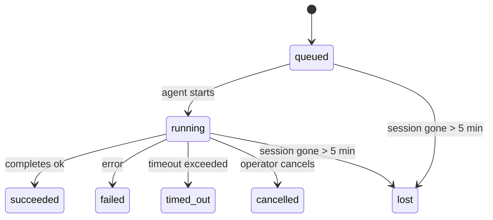

---
read_when:
    - Devam eden veya yakın zamanda tamamlanan arka plan çalışmalarını inceleme
    - Ayrık ajan çalıştırmalarında teslimat hatalarını ayıklama
    - Arka plan çalıştırmalarının oturumlar, Cron ve Heartbeat ile ilişkisini anlama
sidebarTitle: Background tasks
summary: ACP çalıştırmaları, alt ajanlar, yalıtılmış Cron işleri ve CLI işlemleri için arka plan görevi takibi
title: Arka plan görevleri
x-i18n:
    generated_at: "2026-05-05T01:44:38Z"
    model: gpt-5.5
    provider: openai
    source_hash: 60d6ea6178535b19b95d761b8e8b05a665234584ae69852fd21097988aa32991
    source_path: automation/tasks.md
    workflow: 16
---

<Note>
Zamanlama mı arıyorsunuz? Doğru mekanizmayı seçmek için [Otomasyon ve görevler](/tr/automation) bölümüne bakın. Bu sayfa, zamanlayıcı değil, arka plan çalışmaları için etkinlik defteridir.
</Note>

Arka plan görevleri, **ana konuşma oturumunuzun dışında** çalışan işleri izler: ACP çalıştırmaları, alt ajan başlatmaları, yalıtılmış cron işi yürütmeleri ve CLI tarafından başlatılan işlemler.

Görevler oturumların, cron işlerinin veya heartbeat'lerin yerini **almaz**; ayrık çalışmada ne olduğunu, ne zaman olduğunu ve başarılı olup olmadığını kaydeden **etkinlik defteridir**.

<Note>
Her ajan çalıştırması bir görev oluşturmaz. Heartbeat dönüşleri ve normal etkileşimli sohbet oluşturmaz. Tüm cron yürütmeleri, ACP başlatmaları, alt ajan başlatmaları ve CLI ajan komutları oluşturur.
</Note>

## Kısa Özet

- Görevler zamanlayıcı değil, **kayıtlardır**; cron ve heartbeat işin _ne zaman_ çalışacağını belirler, görevler _ne olduğunu_ izler.
- ACP, alt ajanlar, tüm cron işleri ve CLI işlemleri görev oluşturur. Heartbeat dönüşleri oluşturmaz.
- Her görev `queued → running → terminal` akışından geçer (succeeded, failed, timed_out, cancelled veya lost).
- Cron görevleri, cron çalışma zamanı işi hâlâ sahiplenirken canlı kalır; bellek içi çalışma zamanı durumu yoksa görev bakımı, bir görevi lost olarak işaretlemeden önce kalıcı cron çalışma geçmişini kontrol eder.
- Tamamlanma push tabanlıdır: ayrık çalışma doğrudan bildirim gönderebilir veya bittiğinde istekte bulunan oturumu/heartbeat'i uyandırabilir; bu yüzden durum yoklama döngüleri genellikle yanlış kalıptır.
- Yalıtılmış cron çalıştırmaları ve alt ajan tamamlanmaları, son temizlik kayıtlarından önce alt oturumları için izlenen tarayıcı sekmelerini/süreçlerini mümkün olduğunca temizler.
- Yalıtılmış cron teslimi, alt alt ajan çalışması hâlâ boşalırken bayat ara ebeveyn yanıtlarını bastırır ve teslimden önce ulaştığında son alt çıktıyı tercih eder.
- Tamamlanma bildirimleri doğrudan bir kanala teslim edilir veya bir sonraki heartbeat için kuyruğa alınır.
- `openclaw tasks list` tüm görevleri gösterir; `openclaw tasks audit` sorunları ortaya çıkarır.
- Terminal kayıtları 7 gün saklanır, sonra otomatik olarak budanır.

## Hızlı başlangıç

<Tabs>
  <Tab title="Listele ve filtrele">
    ```bash
    # Tüm görevleri listele (en yeniler önce)
    openclaw tasks list

    # Çalışma zamanına veya duruma göre filtrele
    openclaw tasks list --runtime acp
    openclaw tasks list --status running
    ```

  </Tab>
  <Tab title="İncele">
    ```bash
    # Belirli bir görevin ayrıntılarını göster (ID, çalışma ID'si veya oturum anahtarına göre)
    openclaw tasks show <lookup>
    ```
  </Tab>
  <Tab title="İptal et ve bildir">
    ```bash
    # Çalışan bir görevi iptal et (alt oturumu sonlandırır)
    openclaw tasks cancel <lookup>

    # Bir görevin bildirim ilkesini değiştir
    openclaw tasks notify <lookup> state_changes
    ```

  </Tab>
  <Tab title="Denetim ve bakım">
    ```bash
    # Sağlık denetimi çalıştır
    openclaw tasks audit

    # Bakımı önizle veya uygula
    openclaw tasks maintenance
    openclaw tasks maintenance --apply
    ```

  </Tab>
  <Tab title="TaskFlow akışı">
    ```bash
    # TaskFlow durumunu incele
    openclaw tasks flow list
    openclaw tasks flow show <lookup>
    openclaw tasks flow cancel <lookup>
    ```
  </Tab>
</Tabs>

## Bir görevi ne oluşturur?

| Kaynak                 | Çalışma zamanı türü | Görev kaydı ne zaman oluşturulur                       | Varsayılan bildirim ilkesi |
| ---------------------- | ------------ | ------------------------------------------------------ | --------------------- |
| ACP arka plan çalıştırmaları    | `acp`        | Bir alt ACP oturumu başlatılırken                           | `done_only`           |
| Alt ajan orkestrasyonu | `subagent`   | `sessions_spawn` ile bir alt ajan başlatılırken               | `done_only`           |
| Cron işleri (tüm türler)  | `cron`       | Her cron yürütmesi (ana oturum ve yalıtılmış)       | `silent`              |
| CLI işlemleri         | `cli`        | Gateway üzerinden çalışan `openclaw agent` komutları | `silent`              |
| Ajan medya işleri       | `cli`        | Oturum destekli `music_generate`/`video_generate` çalıştırmaları  | `silent`              |

<AccordionGroup>
  <Accordion title="Cron ve medya için bildirim varsayılanları">
    Ana oturum cron görevleri varsayılan olarak `silent` bildirim ilkesini kullanır; izleme için kayıt oluştururlar ancak bildirim üretmezler. Yalıtılmış cron görevleri de varsayılan olarak `silent` kullanır, ancak kendi oturumlarında çalıştıkları için daha görünürdür.

    Oturum destekli `music_generate` ve `video_generate` çalıştırmaları da `silent` bildirim ilkesini kullanır. Yine de görev kayıtları oluştururlar, ancak tamamlanma özgün ajan oturumuna dahili bir uyandırma olarak geri verilir; böylece ajan takip mesajını yazabilir ve tamamlanan medyayı kendisi ekleyebilir. Grup/kanal tamamlanmaları normal görünür yanıt ilkesini izler, bu yüzden kaynak teslimi gerektirdiğinde ajan mesaj aracını kullanır.

  </Accordion>
  <Accordion title="Eşzamanlı video_generate güvenlik sınırı">
    Oturum destekli bir `video_generate` görevi hâlâ etkinken araç aynı zamanda bir güvenlik sınırı görevi görür: aynı oturumda tekrarlanan `video_generate` çağrıları, ikinci bir eşzamanlı üretim başlatmak yerine etkin görev durumunu döndürür. Ajan tarafında açık bir ilerleme/durum sorgusu istediğinizde `action: "status"` kullanın.
  </Accordion>
  <Accordion title="Ne görev oluşturmaz?">
    - Heartbeat dönüşleri; ana oturum, bkz. [Heartbeat](/tr/gateway/heartbeat)
    - Normal etkileşimli sohbet dönüşleri
    - Doğrudan `/command` yanıtları

  </Accordion>
</AccordionGroup>

## Görev yaşam döngüsü



| Durum      | Anlamı                                                              |
| ----------- | -------------------------------------------------------------------------- |
| `queued`    | Oluşturuldu, ajanın başlamasını bekliyor                                    |
| `running`   | Ajan dönüşü etkin olarak yürütülüyor                                           |
| `succeeded` | Başarıyla tamamlandı                                                     |
| `failed`    | Bir hatayla tamamlandı                                                    |
| `timed_out` | Yapılandırılmış zaman aşımını aştı                                            |
| `cancelled` | Operatör tarafından `openclaw tasks cancel` ile durduruldu                        |
| `lost`      | Çalışma zamanı, 5 dakikalık ek süreden sonra yetkili destek durumunu kaybetti |

Geçişler otomatik olarak gerçekleşir; ilişkili ajan çalıştırması bittiğinde görev durumu buna uyacak şekilde güncellenir.

Ajan çalıştırmasının tamamlanması, etkin görev kayıtları için yetkilidir. Başarılı bir ayrık çalıştırma `succeeded` olarak sonlandırılır, olağan çalıştırma hataları `failed` olarak sonlandırılır ve zaman aşımı veya iptal sonuçları `timed_out` olarak sonlandırılır. Operatör görevi zaten iptal ettiyse veya çalışma zamanı `failed`, `timed_out` ya da `lost` gibi daha güçlü bir terminal durumunu zaten kaydettiyse, sonradan gelen başarı sinyali bu terminal durumu düşürmez.

`lost` çalışma zamanının farkındadır:

- ACP görevleri: destekleyen ACP alt oturum meta verileri kayboldu.
- Alt ajan görevleri: destekleyen alt oturum hedef ajan deposundan kayboldu.
- Cron görevleri: cron çalışma zamanı işi artık etkin olarak izlemiyor ve kalıcı cron çalışma geçmişi bu çalıştırma için terminal sonuç göstermiyor. Çevrimdışı CLI denetimi, kendi boş süreç içi cron çalışma zamanı durumunu yetkili kabul etmez.
- CLI görevleri: yalıtılmış alt oturum görevleri alt oturumu kullanır; sohbet destekli CLI görevleri bunun yerine canlı çalıştırma bağlamını kullanır, bu yüzden kalan kanal/grup/doğrudan oturum satırları onları canlı tutmaz. Gateway destekli `openclaw agent` çalıştırmaları da çalıştırma sonucundan sonlandırılır, bu yüzden tamamlanan çalıştırmalar süpürücü onları `lost` olarak işaretleyene kadar etkin kalmaz.

## Teslim ve bildirimler

Bir görev terminal duruma ulaştığında OpenClaw sizi bilgilendirir. İki teslim yolu vardır:

**Doğrudan teslim** — görevin bir kanal hedefi varsa (`requesterOrigin`), tamamlanma mesajı doğrudan o kanala gider (Telegram, Discord, Slack vb.). Alt ajan tamamlanmaları için OpenClaw ayrıca mevcut olduğunda bağlı iş parçacığı/konu yönlendirmesini korur ve doğrudan teslimden vazgeçmeden önce eksik `to` / hesabı, istekte bulunan oturumun saklanan rotasından (`lastChannel` / `lastTo` / `lastAccountId`) doldurabilir.

**Oturum kuyruğuna alınmış teslim** — doğrudan teslim başarısız olursa veya origin ayarlı değilse, güncelleme istekte bulunan oturumda sistem olayı olarak kuyruğa alınır ve bir sonraki heartbeat'te görünür.

<Tip>
Görev tamamlanması anında bir heartbeat uyandırması tetikler, böylece sonucu hızlıca görürsünüz; bir sonraki zamanlanmış heartbeat anını beklemeniz gerekmez.
</Tip>

Bu, olağan iş akışının push tabanlı olduğu anlamına gelir: ayrık işi bir kez başlatın, sonra çalışma zamanının tamamlanınca sizi uyandırmasına veya bilgilendirmesine izin verin. Görev durumunu yalnızca hata ayıklama, müdahale veya açık bir denetim gerektiğinde yoklayın.

### Bildirim ilkeleri

Her görev hakkında ne kadar duyacağınızı denetleyin:

| İlke                | Ne teslim edilir                                                       |
| --------------------- | ----------------------------------------------------------------------- |
| `done_only` (varsayılan) | Yalnızca terminal durum (succeeded, failed vb.) — **varsayılan budur** |
| `state_changes`       | Her durum geçişi ve ilerleme güncellemesi                              |
| `silent`              | Hiçbir şey                                                          |

Bir görev çalışırken ilkeyi değiştirin:

```bash
openclaw tasks notify <lookup> state_changes
```

## CLI başvurusu

<AccordionGroup>
  <Accordion title="tasks list">
    ```bash
    openclaw tasks list [--runtime <acp|subagent|cron|cli>] [--status <status>] [--json]
    ```

    Çıktı sütunları: Görev ID'si, Tür, Durum, Teslim, Çalışma ID'si, Alt Oturum, Özet.

  </Accordion>
  <Accordion title="tasks show">
    ```bash
    openclaw tasks show <lookup>
    ```

    Arama belirteci bir görev ID'si, çalışma ID'si veya oturum anahtarı kabul eder. Zamanlama, teslim durumu, hata ve terminal özet dahil tam kaydı gösterir.

  </Accordion>
  <Accordion title="tasks cancel">
    ```bash
    openclaw tasks cancel <lookup>
    ```

    ACP ve alt ajan görevleri için bu, alt oturumu sonlandırır. CLI tarafından izlenen görevler için iptal görev kayıt defterine kaydedilir (ayrı bir alt çalışma zamanı tanıtıcısı yoktur). Durum `cancelled` değerine geçer ve geçerli olduğunda teslim bildirimi gönderilir.

  </Accordion>
  <Accordion title="tasks notify">
    ```bash
    openclaw tasks notify <lookup> <done_only|state_changes|silent>
    ```
  </Accordion>
  <Accordion title="tasks audit">
    ```bash
    openclaw tasks audit [--json]
    ```

    Operasyonel sorunları ortaya çıkarır. Bulgular, sorunlar algılandığında `openclaw status` içinde de görünür.

    | Bulgu                     | Önem       | Tetikleyici                                                                                                      |
    | ------------------------- | ---------- | ------------------------------------------------------------------------------------------------------------ |
    | `stale_queued`            | uyarı      | 10 dakikadan uzun süredir kuyrukta                                                                              |
    | `stale_running`           | hata       | 30 dakikadan uzun süredir çalışıyor                                                                             |
    | `lost`                    | uyarı/hata | Çalışma zamanınca desteklenen görev sahipliği kayboldu; tutulan kayıp görevler `cleanupAfter` değerine kadar uyarı verir, sonra hataya dönüşür |
    | `delivery_failed`         | uyarı      | Teslim başarısız oldu ve bildirim ilkesi `silent` değil                                                            |
    | `missing_cleanup`         | uyarı      | Temizleme zaman damgası olmayan sonlanmış görev                                                                      |
    | `inconsistent_timestamps` | uyarı      | Zaman çizelgesi ihlali (örneğin başlamadan önce bitmiş)                                                        |

  </Accordion>
  <Accordion title="görev bakımı">
    ```bash
    openclaw tasks maintenance [--json]
    openclaw tasks maintenance --apply [--json]
    ```

    Bunu görevler ve TaskFlow durumu için uzlaştırmayı, temizleme damgalamasını ve budamayı önizlemek veya uygulamak için kullanın.

    Uzlaştırma çalışma zamanı farkındadır:

    - ACP/alt ajan görevleri, arkalarındaki çocuk oturumu denetler.
    - Çocuk oturumunda yeniden başlatma kurtarma mezar taşı bulunan alt ajan görevleri, kurtarılabilir arka oturumlar olarak ele alınmak yerine kayıp olarak işaretlenir.
    - Cron görevleri, cron çalışma zamanının işi hâlâ sahiplenip sahiplenmediğini denetler, ardından `lost` durumuna düşmeden önce kalıcı cron çalışma günlüklerinden/iş durumundan sonlanmış durumu kurtarır. Bellek içi cron etkin iş kümesi için yalnızca Gateway işlemi yetkilidir; çevrimdışı CLI denetimi kalıcı geçmişi kullanır ancak yalnızca bu yerel Set boş olduğu için bir cron görevini kayıp olarak işaretlemez.
    - Sohbet destekli CLI görevleri yalnızca sohbet oturumu satırını değil, sahip olan canlı çalıştırma bağlamını denetler.

    Tamamlama temizliği de çalışma zamanı farkındadır:

    - Alt ajan tamamlaması, duyuru temizliği devam etmeden önce çocuk oturum için izlenen tarayıcı sekmelerini/işlemlerini en iyi çabayla kapatır.
    - Yalıtılmış cron tamamlaması, çalıştırma tamamen sökülmeden önce cron oturumu için izlenen tarayıcı sekmelerini/işlemlerini en iyi çabayla kapatır.
    - Yalıtılmış cron teslimi, gerektiğinde alt soy alt ajan takibini bekler ve bunu duyurmak yerine bayat üst onay metnini bastırır.
    - Alt ajan tamamlama teslimi en son görünür asistan metnini tercih eder; bu boşsa temizlenmiş en son araç/toolResult metnine geri döner ve yalnızca zaman aşımına uğramış araç çağrısı çalıştırmaları kısa bir kısmi ilerleme özetine daralabilir. Sonlanmış başarısız çalıştırmalar, yakalanan yanıt metnini yeniden oynatmadan hata durumunu duyurur.
    - Temizleme hataları gerçek görev sonucunu maskelemez.

  </Accordion>
  <Accordion title="görev akışı listele | göster | iptal et">
    ```bash
    openclaw tasks flow list [--status <status>] [--json]
    openclaw tasks flow show <lookup> [--json]
    openclaw tasks flow cancel <lookup>
    ```

    Tek bir arka plan görev kaydı yerine önemsediğiniz şey düzenleyici TaskFlow olduğunda bunları kullanın.

  </Accordion>
</AccordionGroup>

## Sohbet görev panosu (`/tasks`)

Bu oturuma bağlı arka plan görevlerini görmek için herhangi bir sohbet oturumunda `/tasks` kullanın. Pano, etkin ve yakın zamanda tamamlanmış görevleri çalışma zamanı, durum, zamanlama ve ilerleme ya da hata ayrıntısıyla gösterir.

Geçerli oturumda görünür bağlı görev yoksa, `/tasks` ajan yerel görev sayılarına geri döner; böylece diğer oturum ayrıntılarını sızdırmadan yine de bir genel görünüm elde edersiniz.

Tam operatör defteri için CLI'yi kullanın: `openclaw tasks list`.

## Durum entegrasyonu (görev baskısı)

`openclaw status` hızlı bakış için bir görev özeti içerir:

```
Tasks: 3 queued · 2 running · 1 issues
```

Özet şunları bildirir:

- **active** — `queued` + `running` sayısı
- **failures** — `failed` + `timed_out` + `lost` sayısı
- **byRuntime** — `acp`, `subagent`, `cron`, `cli` bazında dağılım

Hem `/status` hem de `session_status` aracı temizleme farkındalığı olan bir görev anlık görüntüsü kullanır: etkin görevler tercih edilir, bayat tamamlanmış satırlar gizlenir ve son hatalar yalnızca etkin iş kalmadığında görünür. Bu, durum kartının şu anda önemli olana odaklanmasını sağlar.

## Depolama ve bakım

### Görevlerin yaşadığı yer

Görev kayıtları SQLite içinde şu konumda kalıcıdır:

```
$OPENCLAW_STATE_DIR/tasks/runs.sqlite
```

Kayıt defteri Gateway başlangıcında belleğe yüklenir ve yeniden başlatmalar arasında dayanıklılık için yazımları SQLite ile eşitler.
Gateway, SQLite'ın varsayılan otomatik denetim noktası eşiğini ve periyodik ile kapanış `TRUNCATE` denetim noktalarını kullanarak SQLite ileri yazma günlüğünü sınırlı tutar.

### Otomatik bakım

Bir süpürücü her **60 saniyede** çalışır ve dört şeyi yönetir:

<Steps>
  <Step title="Uzlaştırma">
    Etkin görevlerin hâlâ yetkili çalışma zamanı desteğine sahip olup olmadığını denetler. ACP/alt ajan görevleri çocuk oturum durumunu, cron görevleri etkin iş sahipliğini, sohbet destekli CLI görevleri ise sahip olan çalıştırma bağlamını kullanır. Bu destek durumu 5 dakikadan uzun süre yoksa görev `lost` olarak işaretlenir.
  </Step>
  <Step title="ACP oturumu onarımı">
    Sonlanmış veya yetim kalmış üst sahipli tek seferlik ACP oturumlarını kapatır ve bayat sonlanmış ya da yetim kalmış kalıcı ACP oturumlarını yalnızca etkin konuşma bağı kalmadığında kapatır.
  </Step>
  <Step title="Temizleme damgalaması">
    Sonlanmış görevlerde bir `cleanupAfter` zaman damgası ayarlar (endedAt + 7 gün). Saklama süresince kayıp görevler denetimde hâlâ uyarı olarak görünür; `cleanupAfter` süresi dolduktan sonra veya temizleme metadatası eksik olduğunda bunlar hatadır.
  </Step>
  <Step title="Budama">
    `cleanupAfter` tarihini geçen kayıtları siler.
  </Step>
</Steps>

<Note>
**Saklama:** sonlanmış görev kayıtları **7 gün** tutulur, ardından otomatik olarak budanır. Yapılandırma gerekmez.
</Note>

## Görevlerin diğer sistemlerle ilişkisi

<AccordionGroup>
  <Accordion title="Görevler ve TaskFlow">
    [TaskFlow](/tr/automation/taskflow), arka plan görevlerinin üzerindeki akış düzenleme katmanıdır. Tek bir akış, ömrü boyunca yönetilen veya aynalanan eşitleme modlarını kullanarak birden fazla görevi koordine edebilir. Tekil görev kayıtlarını incelemek için `openclaw tasks`, düzenleyici akışı incelemek için `openclaw tasks flow` kullanın.

    Ayrıntılar için [TaskFlow](/tr/automation/taskflow) bölümüne bakın.

  </Accordion>
  <Accordion title="Görevler ve cron">
    Bir cron işi **tanımı** `~/.openclaw/cron/jobs.json` içinde yaşar; çalışma zamanı yürütme durumu yanında `~/.openclaw/cron/jobs-state.json` içinde yaşar. **Her** cron yürütmesi bir görev kaydı oluşturur; hem ana oturum hem de yalıtılmış olanlar. Ana oturum cron görevleri, bildirim üretmeden izlenmeleri için varsayılan olarak `silent` bildirim ilkesini kullanır.

    Bkz. [Cron İşleri](/tr/automation/cron-jobs).

  </Accordion>
  <Accordion title="Görevler ve Heartbeat">
    Heartbeat çalıştırmaları ana oturum dönüşleridir; görev kaydı oluşturmazlar. Bir görev tamamlandığında sonucu hızlıca görmeniz için bir Heartbeat uyandırması tetikleyebilir.

    Bkz. [Heartbeat](/tr/gateway/heartbeat).

  </Accordion>
  <Accordion title="Görevler ve oturumlar">
    Bir görev bir `childSessionKey` (işin çalıştığı yer) ve bir `requesterSessionKey` (onu başlatan kişi) referans gösterebilir. Oturumlar konuşma bağlamıdır; görevler bunun üzerinde etkinlik takibidir.
  </Accordion>
  <Accordion title="Görevler ve ajan çalıştırmaları">
    Bir görevin `runId` değeri, işi yapan ajan çalıştırmasına bağlanır. Ajan yaşam döngüsü olayları (başlangıç, bitiş, hata) görev durumunu otomatik olarak günceller; yaşam döngüsünü elle yönetmeniz gerekmez.
  </Accordion>
</AccordionGroup>

## İlgili

- [Otomasyon ve Görevler](/tr/automation) — tüm otomasyon mekanizmalarına hızlı bakış
- [CLI: Görevler](/tr/cli/tasks) — CLI komut başvurusu
- [Heartbeat](/tr/gateway/heartbeat) — periyodik ana oturum dönüşleri
- [Zamanlanmış Görevler](/tr/automation/cron-jobs) — arka plan işini zamanlama
- [TaskFlow](/tr/automation/taskflow) — görevlerin üzerindeki akış düzenleme
