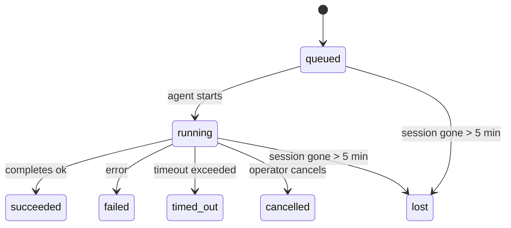

---
read_when:
    - Devam eden veya yakın zamanda tamamlanan arka plan çalışmasını inceleme
    - Ayrılmış ajan çalıştırmalarında iletim hatalarını ayıklama
    - Arka plan çalıştırmalarının oturumlar, cron ve heartbeat ile ilişkisini anlama
sidebarTitle: Background tasks
summary: ACP çalıştırmaları, alt ajanlar, yalıtılmış cron işleri ve CLI işlemleri için arka plan görevi takibi
title: Arka plan görevleri
x-i18n:
    generated_at: "2026-06-28T00:10:50Z"
    model: gpt-5.5
    postprocess_version: locale-links-v1
    provider: openai
    source_hash: 4a630a52d0d6bfd387a37415dd63fc4bfbce23f99eaa8cb780c3d6f8913675fd
    source_path: automation/tasks.md
    workflow: 16
---

<Note>
Zamanlama mı arıyorsunuz? Doğru mekanizmayı seçmek için [Automation](/tr/automation) sayfasına bakın. Bu sayfa, zamanlayıcı değil, arka plan işleri için etkinlik defteridir.
</Note>

Arka plan görevleri, **ana konuşma oturumunuzun dışında** çalışan işleri izler: ACP çalıştırmaları, alt aracı başlatmaları, yalıtılmış cron işi yürütmeleri ve CLI tarafından başlatılan işlemler.

Görevler oturumların, cron işlerinin veya Heartbeat’lerin yerini **almaz**; bunlar, hangi ayrılmış işin ne zaman gerçekleştiğini ve başarılı olup olmadığını kaydeden **etkinlik defteridir**.

<Note>
Her aracı çalıştırması bir görev oluşturmaz. Heartbeat turları ve normal etkileşimli sohbet bunu yapmaz. Tüm cron yürütmeleri, ACP başlatmaları, alt aracı başlatmaları ve CLI aracı komutları görev oluşturur.
</Note>

## Özet

- Görevler **kayıttır**, zamanlayıcı değildir; cron ve Heartbeat işin _ne zaman_ çalışacağını belirler, görevler ise _ne olduğunu_ izler.
- ACP, alt aracılar, tüm cron işleri ve CLI işlemleri görev oluşturur. Heartbeat turları oluşturmaz.
- Her görev `queued → running → terminal` sürecinden geçer (succeeded, failed, timed_out, cancelled veya lost).
- Cron çalışma zamanı işi hâlâ sahiplenirken cron görevleri canlı kalır; bellek içi çalışma zamanı durumu kaybolursa görev bakımı, bir görevi lost olarak işaretlemeden önce kalıcı cron çalışma geçmişini kontrol eder.
- Tamamlanma push odaklıdır: ayrılmış iş doğrudan bildirim gönderebilir veya bittiğinde istekte bulunan oturumu/Heartbeat’i uyandırabilir; bu nedenle durum yoklama döngüleri genellikle yanlış biçimdir.
- Yalıtılmış cron çalıştırmaları ve alt aracı tamamlanmaları, son temizlik kayıtlarından önce alt oturumları için izlenen tarayıcı sekmelerini/süreçlerini en iyi çabayla temizler.
- Yalıtılmış cron teslimi, alt alt aracı işi hâlâ boşalırken eski ara üst yanıtları bastırır ve teslimden önce geldiğinde son alt çıktıyı tercih eder.
- Tamamlanma bildirimleri doğrudan bir kanala teslim edilir veya bir sonraki Heartbeat için sıraya alınır.
- `openclaw tasks list` tüm görevleri gösterir; `openclaw tasks audit` sorunları yüzeye çıkarır.
- Terminal kayıtları 7 gün tutulur, ardından otomatik olarak budanır.

## Hızlı başlangıç

<Tabs>
  <Tab title="Listele ve filtrele">
    ```bash
    # List all tasks (newest first)
    openclaw tasks list

    # Filter by runtime or status
    openclaw tasks list --runtime acp
    openclaw tasks list --status running
    ```

  </Tab>
  <Tab title="İncele">
    ```bash
    # Show details for a specific task (by ID, run ID, or session key)
    openclaw tasks show <lookup>
    ```
  </Tab>
  <Tab title="İptal et ve bildir">
    ```bash
    # Cancel a running task (kills the child session)
    openclaw tasks cancel <lookup>

    # Change notification policy for a task
    openclaw tasks notify <lookup> state_changes
    ```

  </Tab>
  <Tab title="Denetim ve bakım">
    ```bash
    # Run a health audit
    openclaw tasks audit

    # Preview or apply maintenance
    openclaw tasks maintenance
    openclaw tasks maintenance --apply
    ```

  </Tab>
  <Tab title="Görev akışı">
    ```bash
    # Inspect TaskFlow state
    openclaw tasks flow list
    openclaw tasks flow show <lookup>
    openclaw tasks flow cancel <lookup>
    ```
  </Tab>
</Tabs>

## Görevi ne oluşturur?

| Kaynak                 | Çalışma zamanı türü | Görev kaydının oluşturulduğu zaman                                      | Varsayılan bildirim ilkesi |
| ---------------------- | ------------ | ---------------------------------------------------------------------- | --------------------- |
| ACP arka plan çalıştırmaları    | `acp`        | Bir alt ACP oturumu başlatıldığında                                           | `done_only`           |
| Alt aracı orkestrasyonu | `subagent`   | `sessions_spawn` aracılığıyla bir alt aracı başlatıldığında                               | `done_only`           |
| Cron işleri (tüm türler)  | `cron`       | Her cron yürütmesinde (ana oturum ve yalıtılmış)                       | `silent`              |
| CLI işlemleri         | `cli`        | Gateway üzerinden çalışan `openclaw agent` komutları                 | `silent`              |
| Aracı medya işleri       | `cli`        | Oturum destekli `image_generate`/`music_generate`/`video_generate` çalıştırmaları | `silent`              |

<AccordionGroup>
  <Accordion title="Cron ve medya için bildirim varsayılanları">
    Ana oturum cron görevleri varsayılan olarak `silent` bildirim ilkesini kullanır; izleme için kayıt oluştururlar ancak bildirim üretmezler. Yalıtılmış cron görevleri de varsayılan olarak `silent` kullanır, ancak kendi oturumlarında çalıştıkları için daha görünürdür.

    Oturum destekli `image_generate`, `music_generate` ve `video_generate` çalıştırmaları da `silent` bildirim ilkesini kullanır. Yine görev kayıtları oluştururlar, ancak tamamlanma, aracının takip mesajını yazabilmesi ve tamamlanan medyayı kendisinin ekleyebilmesi için iç uyandırma olarak özgün aracı oturumuna geri verilir. İstekte bulunan aracı, normal görünür yanıt sözleşmesini izler: yapılandırıldığında otomatik son yanıt veya oturum mesaj aracı yanıtları gerektirdiğinde `message(action="send")` artı `NO_REPLY`. İstekte bulunan oturum artık etkin değilse veya etkin uyandırması başarısız olursa ve tamamlanma aracısı üretilen medyanın bir kısmını ya da tamamını kaçırırsa OpenClaw, yalnızca eksik medyayı içeren idempotent bir doğrudan yedeği özgün kanal hedefine gönderir.

  </Accordion>
  <Accordion title="Eşzamanlı medya üretimi koruma sınırı">
    Oturum destekli bir medya üretimi görevi hâlâ etkinken medya araçları, yanlışlıkla yapılan yeniden denemeler için de koruma sınırı görevi görür. Aynı istem için yinelenen `image_generate` çağrıları eşleşen etkin görev durumunu döndürürken farklı bir görsel istemi kendi görevini başlatabilir. `music_generate` ve `video_generate` çağrıları, ikinci bir eşzamanlı üretim başlatmak yerine yine o oturum için etkin görev durumunu döndürür. Aracı tarafında açık bir ilerleme/durum sorgusu istediğinizde `action: "status"` kullanın.
  </Accordion>
  <Accordion title="Görev oluşturmayanlar">
    - Heartbeat turları - ana oturum; bkz. [Heartbeat](/tr/gateway/heartbeat)
    - Normal etkileşimli sohbet turları
    - Doğrudan `/command` yanıtları

  </Accordion>
</AccordionGroup>

## Görev yaşam döngüsü



| Durum      | Anlamı                                                              |
| ----------- | -------------------------------------------------------------------------- |
| `queued`    | Oluşturuldu, aracının başlamasını bekliyor                                    |
| `running`   | Aracı turu etkin olarak yürütülüyor                                           |
| `succeeded` | Başarıyla tamamlandı                                                     |
| `failed`    | Bir hatayla tamamlandı                                                    |
| `timed_out` | Yapılandırılmış zaman aşımını aştı                                            |
| `cancelled` | Operatör tarafından `openclaw tasks cancel` ile durduruldu                        |
| `lost`      | Çalışma zamanı, 5 dakikalık ek süreden sonra yetkili dayanak durumunu kaybetti |

Geçişler otomatik olarak gerçekleşir; ilişkili aracı çalıştırması sona erdiğinde görev durumu buna uyacak şekilde güncellenir.

Aracı çalıştırmasının tamamlanması, etkin görev kayıtları için yetkilidir. Başarılı bir ayrılmış çalıştırma `succeeded` olarak, sıradan çalıştırma hataları `failed` olarak, zaman aşımı veya iptal sonuçları ise `timed_out` olarak sonlandırılır. Bir operatör görevi zaten iptal ettiyse veya çalışma zamanı `failed`, `timed_out` ya da `lost` gibi daha güçlü bir terminal durumu zaten kaydettiyse, daha sonra gelen başarı sinyali bu terminal durumunu düşürmez.

`lost` çalışma zamanına duyarlıdır:

- ACP görevleri: dayanak ACP alt oturum meta verileri kayboldu.
- Alt aracı görevleri: dayanak alt oturum, hedef aracı deposundan kayboldu.
- Cron görevleri: cron çalışma zamanı artık işi etkin olarak izlemiyor ve kalıcı cron çalışma geçmişi o çalışma için terminal bir sonuç göstermiyor. Çevrimdışı CLI denetimi, kendi boş süreç içi cron çalışma zamanı durumunu yetkili kabul etmez.
- CLI görevleri: çalışma kimliği/kaynak kimliği olan görevler canlı çalışma bağlamını kullanır; bu nedenle kalan alt oturum veya sohbet oturumu satırları, Gateway’in sahip olduğu çalışma kaybolduktan sonra onları canlı tutmaz. Çalışma kimliği olmayan eski CLI görevleri hâlâ alt oturuma geri döner. Gateway destekli `openclaw agent` çalıştırmaları da çalışma sonuçlarından sonlandırılır; bu yüzden tamamlanmış çalıştırmalar, süpürücü onları `lost` olarak işaretleyene kadar etkin kalmaz.

## Teslim ve bildirimler

Bir görev terminal duruma ulaştığında OpenClaw sizi bilgilendirir. İki teslim yolu vardır:

**Doğrudan teslim** - görevde bir kanal hedefi (`requesterOrigin`) varsa tamamlanma mesajı doğrudan o kanala gider (Telegram, Discord, Slack vb.). Grup ve kanal görev tamamlanmaları bunun yerine istekte bulunan oturum üzerinden yönlendirilir; böylece üst aracı görünür yanıtı yazabilir. Alt aracı tamamlanmaları için OpenClaw, mevcut olduğunda bağlı iş parçacığı/konu yönlendirmesini de korur ve doğrudan teslimden vazgeçmeden önce eksik bir `to` / hesabı, istekte bulunan oturumun saklanan rotasından (`lastChannel` / `lastTo` / `lastAccountId`) doldurabilir.

**Oturum kuyruğuna alınmış teslim** - doğrudan teslim başarısız olursa veya origin ayarlanmamışsa güncelleme, istekte bulunanın oturumunda bir sistem olayı olarak kuyruğa alınır ve bir sonraki Heartbeat’te görünür.

<Tip>
Görev tamamlanması anında bir Heartbeat uyandırması tetikler; böylece sonucu hızlıca görürsünüz, bir sonraki zamanlanmış Heartbeat tikini beklemeniz gerekmez.
</Tip>

Bu, olağan iş akışının push tabanlı olduğu anlamına gelir: ayrılmış işi bir kez başlatın, ardından çalışma zamanının tamamlanınca sizi uyandırmasına veya bilgilendirmesine izin verin. Görev durumunu yalnızca hata ayıklama, müdahale veya açık bir denetim gerektiğinde yoklayın.

### Bildirim ilkeleri

Her görev hakkında ne kadar bildirim alacağınızı denetleyin:

| İlke                | Teslim edilenler                                                       |
| --------------------- | ----------------------------------------------------------------------- |
| `done_only` (varsayılan) | Yalnızca terminal durum (succeeded, failed vb.) - **varsayılan budur** |
| `state_changes`       | Her durum geçişi ve ilerleme güncellemesi                              |
| `silent`              | Hiçbir şey                                                          |

Bir görev çalışırken ilkeyi değiştirin:

```bash
openclaw tasks notify <lookup> state_changes
```

## CLI başvurusu

<AccordionGroup>
  <Accordion title="tasks list">
    ```bash
    openclaw tasks list [--runtime <acp|subagent|cron|cli>] [--status <status>] [--json]
    ```

    Çıktı sütunları: Görev kimliği, Tür, Durum, Teslim, Çalışma kimliği, Alt Oturum, Özet.

  </Accordion>
  <Accordion title="tasks show">
    ```bash
    openclaw tasks show <lookup>
    ```

    Arama belirteci bir görev kimliğini, çalışma kimliğini veya oturum anahtarını kabul eder. Zamanlama, teslim durumu, hata ve terminal özet dahil tam kaydı gösterir.

  </Accordion>
  <Accordion title="tasks cancel">
    ```bash
    openclaw tasks cancel <lookup>
    ```

    ACP ve alt aracı görevleri için bu, alt oturumu sonlandırır. CLI tarafından izlenen görevlerde iptal, görev kayıt defterine kaydedilir (ayrı bir alt çalışma zamanı tanıtıcısı yoktur). Durum `cancelled` olur ve uygunsa bir teslim bildirimi gönderilir.

  </Accordion>
  <Accordion title="tasks notify">
    ```bash
    openclaw tasks notify <lookup> <done_only|state_changes|silent>
    ```
  </Accordion>
  <Accordion title="tasks audit">
    ```bash
    openclaw tasks audit [--json]
    ```

    Operasyonel sorunları yüzeye çıkarır. Sorunlar algılandığında bulgular `openclaw status` içinde de görünür.

    | Bulgu                     | Önem derecesi | Tetikleyici                                                                                                                  |
    | ------------------------- | ------------- | ---------------------------------------------------------------------------------------------------------------------------- |
    | `stale_queued`            | uyarı         | 10 dakikadan uzun süredir kuyrukta                                                                                           |
    | `stale_running`           | hata          | 30 dakikadan uzun süredir çalışıyor                                                                                          |
    | `lost`                    | uyarı/hata    | Çalışma zamanı destekli görev sahipliği kayboldu; tutulan kayıp görevler `cleanupAfter` zamanına kadar uyarı verir, sonra hata olur |
    | `delivery_failed`         | uyarı         | Teslimat başarısız oldu ve bildirim ilkesi `silent` değil                                                                    |
    | `missing_cleanup`         | uyarı         | Temizleme zaman damgası olmayan sonlanmış görev                                                                               |
    | `inconsistent_timestamps` | uyarı         | Zaman çizelgesi ihlali (örneğin başlamadan önce sona erdi)                                                                   |

  </Accordion>
  <Accordion title="tasks maintenance">
    ```bash
    openclaw tasks maintenance [--json]
    openclaw tasks maintenance --apply [--json]
    ```

    Bunu görevler, Görev Akışı durumu ve bayat Cron çalıştırma oturumu kayıt satırları için uzlaştırma, temizleme damgalama ve budamayı önizlemek veya uygulamak amacıyla kullanın.

    Uzlaştırma çalışma zamanı farkındadır:

    - ACP/alt ajan görevleri, arkalarındaki alt oturumu denetler.
    - Alt oturumunda yeniden başlatma kurtarma mezar taşı bulunan alt ajan görevleri, kurtarılabilir arka oturumlar olarak ele alınmak yerine kayıp olarak işaretlenir.
    - Cron görevleri, Cron çalışma zamanının işi hâlâ sahiplenip sahiplenmediğini denetler, ardından `lost` durumuna düşmeden önce kalıcı Cron çalıştırma günlüklerinden/iş durumundan terminal durumu kurtarır. Bellek içi Cron etkin iş kümesi için yalnızca Gateway süreci yetkilidir; çevrimdışı CLI denetimi kalıcı geçmişi kullanır ancak yalnızca bu yerel Set boş olduğu için bir Cron görevini kayıp olarak işaretlemez.
    - Çalıştırma kimliği olan CLI görevleri, yalnızca alt oturum veya sohbet oturumu satırlarını değil, sahip olan canlı çalıştırma bağlamını denetler.

    Tamamlama temizliği de çalışma zamanı farkındadır:

    - Alt ajan tamamlama, duyuru temizliği devam etmeden önce alt oturum için izlenen tarayıcı sekmelerini/süreçlerini en iyi çabayla kapatır.
    - Yalıtılmış Cron tamamlama, çalıştırma tamamen sonlandırılmadan önce Cron oturumu için izlenen tarayıcı sekmelerini/süreçlerini en iyi çabayla kapatır.
    - Yalıtılmış Cron teslimatı gerektiğinde alt soy alt ajan takip işlemini bekler ve bunu duyurmak yerine bayat üst onay metnini bastırır.
    - Alt ajan tamamlama teslimatı yalnızca alt öğenin en son görünür asistan metnini kullanır. Araç/toolResult çıktısı alt sonuç metnine yükseltilmez. Terminal başarısız çalıştırmalar, yakalanan yanıt metnini yeniden oynatmadan başarısızlık durumunu duyurur.
    - Temizleme hataları gerçek görev sonucunu maskelemez.

    Bakım uygulanırken OpenClaw, çalışmakta olan Cron işleri için satırları korurken ve Cron dışı oturum satırlarına dokunmadan 7 günden eski bayat `cron:<jobId>:run:<uuid>` oturum kayıt satırlarını da kaldırır.

  </Accordion>
  <Accordion title="tasks flow list | show | cancel">
    ```bash
    openclaw tasks flow list [--status <status>] [--json]
    openclaw tasks flow show <lookup> [--json]
    openclaw tasks flow cancel <lookup>
    ```

    Tek bir arka plan görev kaydı yerine önem verdiğiniz şey düzenleyici Görev Akışı olduğunda bunları kullanın.

  </Accordion>
</AccordionGroup>

## Sohbet görev panosu (`/tasks`)

Bu oturuma bağlı arka plan görevlerini görmek için herhangi bir sohbet oturumunda `/tasks` kullanın. Pano, etkin ve yakın zamanda tamamlanan görevleri çalışma zamanı, durum, zamanlama ve ilerleme veya hata ayrıntısıyla gösterir.

Geçerli oturumda görünür bağlı görev yoksa `/tasks`, başka oturum ayrıntılarını sızdırmadan yine de bir genel bakış almanız için ajan yerel görev sayılarına geri döner.

Tam operatör defteri için CLI kullanın: `openclaw tasks list`.

## Durum entegrasyonu (görev baskısı)

`openclaw status` bir bakışta görev özeti içerir:

```
Tasks: 3 queued · 2 running · 1 issues
```

Özet şunları bildirir:

- **etkin** - `queued` + `running` sayısı
- **başarısızlıklar** - `failed` + `timed_out` + `lost` sayısı
- **byRuntime** - `acp`, `subagent`, `cron`, `cli` kırılımı

Hem `/status` hem de `session_status` aracı temizleme farkındalığına sahip bir görev anlık görüntüsü kullanır: etkin görevler tercih edilir, bayat tamamlanmış satırlar gizlenir ve yakın tarihli başarısızlıklar yalnızca etkin iş kalmadığında yüzeye çıkar. Bu, durum kartını şu anda önemli olana odaklı tutar.

## Depolama ve bakım

### Görevlerin yaşadığı yer

Görev kayıtları SQLite içinde şu konumda kalıcıdır:

```
$OPENCLAW_STATE_DIR/tasks/runs.sqlite
```

Kayıt, Gateway başlangıcında belleğe yüklenir ve yeniden başlatmalar arasında dayanıklılık için yazımları SQLite ile eşitler.
Gateway, SQLite'ın varsayılan otomatik kontrol noktası eşiğini ve periyodik `PASSIVE` kontrol noktalarını kullanarak SQLite write-ahead log boyutunu sınırlı tutar. Kapatma ve açık bakım kontrol noktaları yine `TRUNCATE` kullanır; böylece normal kapanışlar, arka plan süpürücüsünü etkin okuyucuları bekletmeden WAL alanını geri kazanabilir.

### Otomatik bakım

Bir süpürücü her **60 saniyede** çalışır ve dört şeyi ele alır:

<Steps>
  <Step title="Reconciliation">
    Etkin görevlerin hâlâ yetkili çalışma zamanı desteğine sahip olup olmadığını denetler. ACP/alt ajan görevleri alt oturum durumunu, Cron görevleri etkin iş sahipliğini ve çalıştırma kimliği olan CLI görevleri sahip olan çalıştırma bağlamını kullanır. Bu destek durumu 5 dakikadan uzun süre yoksa görev `lost` olarak işaretlenir.
  </Step>
  <Step title="ACP session repair">
    Sonlanmış veya sahipsiz üst sahipli tek seferlik ACP oturumlarını kapatır ve bayat sonlanmış veya sahipsiz kalıcı ACP oturumlarını yalnızca etkin konuşma bağlaması kalmadığında kapatır.
  </Step>
  <Step title="Cleanup stamping">
    Sonlanmış görevlere bir `cleanupAfter` zaman damgası ayarlar (endedAt + 7 gün). Saklama süresi boyunca kayıp görevler denetimde hâlâ uyarı olarak görünür; `cleanupAfter` süresi dolduktan sonra veya temizleme meta verisi eksik olduğunda hata olurlar.
  </Step>
  <Step title="Pruning">
    `cleanupAfter` tarihini geçmiş kayıtları siler.
  </Step>
</Steps>

<Note>
**Saklama:** terminal görev kayıtları **7 gün** tutulur, ardından otomatik olarak budanır. Yapılandırma gerekmez.
</Note>

## Görevler diğer sistemlerle nasıl ilişkilidir

<AccordionGroup>
  <Accordion title="Tasks and Task Flow">
    [Görev Akışı](/tr/automation/taskflow), arka plan görevlerinin üstündeki akış düzenleme katmanıdır. Tek bir akış, ömrü boyunca yönetilen veya yansıtılmış eşitleme modlarını kullanarak birden çok görevi koordine edebilir. Tek tek görev kayıtlarını incelemek için `openclaw tasks`, düzenleyici akışı incelemek için `openclaw tasks flow` kullanın.

    Ayrıntılar için bkz. [Görev Akışı](/tr/automation/taskflow).

  </Accordion>
  <Accordion title="Tasks and cron">
    Cron iş tanımları, çalışma zamanı yürütme durumu ve çalıştırma geçmişi OpenClaw'ın paylaşılan SQLite durum veritabanında yaşar. **Her** Cron yürütmesi bir görev kaydı oluşturur - hem ana oturum hem de yalıtılmış. Ana oturum Cron görevleri, bildirim üretmeden izleme yapmaları için varsayılan olarak `silent` bildirim ilkesini kullanır.

    Bkz. [Cron İşleri](/tr/automation/cron-jobs).

  </Accordion>
  <Accordion title="Tasks and heartbeat">
    Heartbeat çalıştırmaları ana oturum turlarıdır - görev kaydı oluşturmazlar. Bir görev tamamlandığında, sonucu hızlıca görmeniz için bir Heartbeat uyandırması tetikleyebilir.

    Bkz. [Heartbeat](/tr/gateway/heartbeat).

  </Accordion>
  <Accordion title="Tasks and sessions">
    Bir görev, işin çalıştığı yeri belirten bir `childSessionKey` ve onu başlatan kişiyi belirten bir `requesterSessionKey` referans gösterebilir. `agentId` alanı işi yürüten ajanı tanımlarken, isteyen ve sahip alanları başlatma ve kontrol bağlamını korur. Oturumlar konuşma bağlamıdır; görevler bunun üzerindeki etkinlik izlemedir.
  </Accordion>
  <Accordion title="Tasks and agent runs">
    Bir görevin `runId` değeri, işi yapan ajan çalıştırmasına bağlanır. Ajan yaşam döngüsü olayları (başlatma, bitiş, hata) görev durumunu otomatik olarak günceller - yaşam döngüsünü elle yönetmeniz gerekmez.
  </Accordion>
</AccordionGroup>

## İlgili

- [Otomasyon](/tr/automation) - tüm otomasyon mekanizmalarına bir bakış
- [CLI: Görevler](/tr/cli/tasks) - CLI komut başvurusu
- [Heartbeat](/tr/gateway/heartbeat) - periyodik ana oturum turları
- [Zamanlanmış Görevler](/tr/automation/cron-jobs) - arka plan işi zamanlama
- [Görev Akışı](/tr/automation/taskflow) - görevlerin üstündeki akış düzenleme
