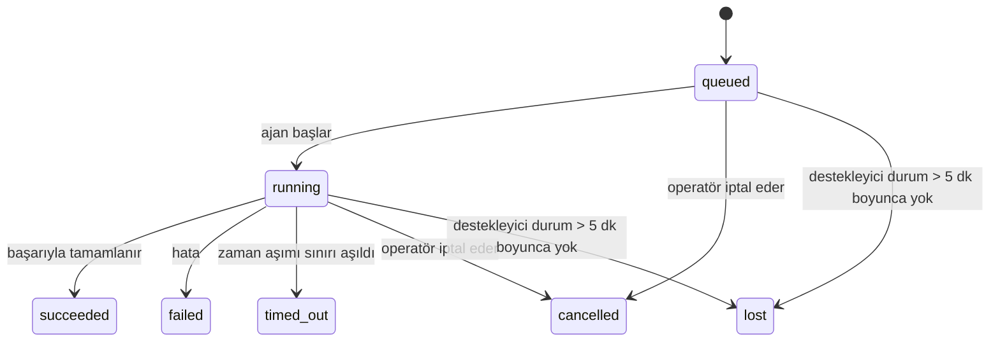

---
read_when:
    - Devam eden veya yakın zamanda tamamlanan arka plan işlerini inceleme
    - Bağımsız agent çalıştırmalarındaki teslimat hatalarını ayıklama
    - Arka plan çalıştırmalarının oturumlar, Cron ve Heartbeat ile ilişkisini anlama
sidebarTitle: Background tasks
summary: ACP çalıştırmaları, alt aracılar, cron yürütmeleri ve CLI işlemleri için arka plan görevi takibi
title: Arka plan görevleri
x-i18n:
    generated_at: "2026-07-12T11:27:52Z"
    model: gpt-5.6
    postprocess_version: locale-links-v1
    provider: openai
    source_hash: 0a945e8103c5df5a64785f326a9d0b08784ac32a2ca6fa3d4c399d75fc54be2b
    source_path: automation/tasks.md
    workflow: 16
---

<Note>
Zamanlama mı arıyorsunuz? Doğru mekanizmayı seçmek için [Otomasyon](/tr/automation) sayfasına bakın. Bu sayfa, zamanlayıcı değil, arka plan çalışmalarının etkinlik kaydıdır.
</Note>

Arka plan görevleri, **ana konuşma oturumunuzun dışında** yürütülen çalışmaları izler: ACP çalıştırmaları, alt ajan başlatmaları, cron işi yürütmeleri ve CLI tarafından başlatılan işlemler.

Görevler; oturumların, cron işlerinin veya heartbeat'lerin **yerini almaz**; bağımsız çalışmaların ne zaman gerçekleştiğini, **ne olduğunu** ve başarılı olup olmadığını kaydeden **etkinlik kayıtlarıdır**.

<Note>
Her ajan çalıştırması bir görev oluşturmaz. Heartbeat dönüşleri ve normal etkileşimli sohbetler görev oluşturmaz. Tüm cron yürütmeleri, ACP başlatmaları, alt ajan başlatmaları ve Gateway tarafından yönlendirilen CLI ajan komutları görev oluşturur.
</Note>

## Kısa özet

- Görevler zamanlayıcı değil, **kayıtlardır**; cron ve heartbeat çalışmanın _ne zaman_ yürütüleceğine karar verir, görevler ise _ne olduğunu_ izler.
- ACP, alt ajanlar, tüm cron işleri ve CLI işlemleri görev oluşturur. Heartbeat dönüşleri oluşturmaz.
- Her görev `queued → running → terminal` durumları arasında ilerler (`succeeded`, `failed`, `timed_out`, `cancelled` veya `lost`).
- Cron çalışma zamanı işin sahipliğini sürdürdüğü müddetçe cron görevleri etkin kalır; bellek içi çalışma zamanı durumu kaybolmuşsa görev bakımı, görevi `lost` olarak işaretlemeden önce kalıcı cron çalıştırma geçmişini kontrol eder.
- Tamamlanma, gönderim odaklıdır: bağımsız çalışma tamamlandığında doğrudan bildirim gönderebilir veya istekte bulunan oturumu/heartbeat'i uyandırabilir; bu nedenle durum sorgulama döngüleri genellikle yanlış yaklaşımdır.
- Yalıtılmış cron çalıştırmaları ve alt ajan tamamlanmaları, son temizlik kayıtlarından önce alt oturumları için izlenen tarayıcı sekmelerini/süreçlerini mümkün olan en iyi şekilde temizler.
- Yalıtılmış cron teslimi, alt ajan çalışmaları hâlâ tamamlanmayı beklerken eski geçici üst ajan yanıtlarını bastırır ve teslimden önce ulaşırsa alt ajanın nihai çıktısını tercih eder.
- Tamamlanma bildirimleri doğrudan bir kanala teslim edilir veya sonraki heartbeat için kuyruğa alınır.
- `openclaw tasks list` tüm görevleri gösterir; `openclaw tasks audit` sorunları ortaya çıkarır.
- Sonlanmış kayıtlar 7 gün (`lost` kayıtları 24 saat) tutulur, ardından otomatik olarak budanır.

## Hızlı başlangıç

<Tabs>
  <Tab title="Listeleme ve filtreleme">
    ```bash
    # Tüm görevleri listele (en yeniler önce)
    openclaw tasks list

    # Çalışma zamanına veya duruma göre filtrele
    openclaw tasks list --runtime acp
    openclaw tasks list --status running
    ```

  </Tab>
  <Tab title="İnceleme">
    ```bash
    # Belirli bir görevin ayrıntılarını göster (görev kimliğine, çalıştırma kimliğine veya oturum anahtarına göre)
    openclaw tasks show <lookup>
    ```
  </Tab>
  <Tab title="İptal ve bildirim">
    ```bash
    # Çalışan bir görevi iptal et (alt oturumu sonlandırır)
    openclaw tasks cancel <lookup>

    # Bir görevin bildirim politikasını değiştir
    openclaw tasks notify <lookup> state_changes
    ```

  </Tab>
  <Tab title="Denetim ve bakım">
    ```bash
    # Sistem durumu denetimi çalıştır
    openclaw tasks audit

    # Bakımı önizle veya uygula
    openclaw tasks maintenance
    openclaw tasks maintenance --apply
    ```

  </Tab>
  <Tab title="Görev akışı">
    ```bash
    # TaskFlow durumunu incele
    openclaw tasks flow list
    openclaw tasks flow show <lookup>
    openclaw tasks flow cancel <lookup>
    ```
  </Tab>
</Tabs>

## Görevi ne oluşturur?

| Kaynak                  | Çalışma zamanı türü | Görev kaydının oluşturulduğu zaman                                    | Varsayılan bildirim politikası |
| ----------------------- | ------------------- | --------------------------------------------------------------------- | ------------------------------ |
| ACP arka plan çalışmaları | `acp`             | Alt ACP oturumu başlatıldığında                                       | `done_only`                    |
| Alt ajan orkestrasyonu  | `subagent`          | `sessions_spawn` aracılığıyla bir alt ajan başlatıldığında             | `done_only`                    |
| Cron işleri (tüm türler) | `cron`             | Her cron yürütmesinde (ana oturum ve yalıtılmış)                       | `silent`                       |
| CLI işlemleri           | `cli`               | Gateway üzerinden çalışan `openclaw agent` komutlarında                | `silent`                       |
| Ajan medya işleri       | `cli`               | Oturum destekli `image_generate`/`music_generate`/`video_generate` çalıştırmalarında | `silent`              |

<AccordionGroup>
  <Accordion title="Cron ve medya için bildirim varsayılanları">
    Cron görevleri (ana oturum ve yalıtılmış), `silent` bildirim politikasını kullanır; izleme için kayıt oluştururlar ancak kendi görev bildirimlerini üretmezler. Teslim yolunun sahibi cron'dur.

    Oturum destekli `image_generate`, `music_generate` ve `video_generate` çalıştırmaları da `silent` bildirim politikasını kullanır. Yine de görev kayıtları oluştururlar ancak tamamlanma, dahili bir uyandırma olarak özgün ajan oturumuna geri iletilir; böylece ajan takip mesajını yazabilir ve tamamlanan medyayı kendisi ekleyebilir. İstekte bulunan ajan, normal görünür yanıt sözleşmesini izler: yapılandırıldığında otomatik nihai yanıt veya oturum mesaj aracı yanıtlarını gerektirdiğinde `message(action="send")` ve ardından `NO_REPLY`. İstekte bulunan oturum artık etkin değilse veya etkin uyandırması başarısız olursa ve tamamlanma ajanı oluşturulan medyanın bir kısmını ya da tamamını kaçırırsa OpenClaw, yalnızca eksik medyayı özgün kanal hedefine idempotent bir doğrudan yedek teslim olarak gönderir.

  </Accordion>
  <Accordion title="Eşzamanlı medya üretimi koruması">
    Oturum destekli bir medya üretim görevi hâlâ etkinken `image_generate`, `music_generate` ve `video_generate` yanlışlıkla yapılan yeniden denemelere karşı koruma sağlar: aynı istem/istek için çağrı yinelendiğinde kopya bir görev başlatmak yerine eşleşen etkin görevin durumu döndürülür; farklı bir istem ise kendi görevini başlatabilir. Ajan tarafından açık bir ilerleme/durum sorgulaması yapmak istediğinizde `action: "status"` kullanın.
  </Accordion>
  <Accordion title="Görev oluşturmayan işlemler">
    - Heartbeat dönüşleri — ana oturum; bkz. [Heartbeat](/tr/gateway/heartbeat)
    - Normal etkileşimli sohbet dönüşleri
    - Doğrudan `/command` yanıtları

  </Accordion>
</AccordionGroup>

## Görev yaşam döngüsü



| Durum       | Anlamı                                                                      |
| ----------- | --------------------------------------------------------------------------- |
| `queued`    | Oluşturuldu, ajanın başlaması bekleniyor                                    |
| `running`   | Ajan dönüşü etkin olarak yürütülüyor                                         |
| `succeeded` | Başarıyla tamamlandı                                                         |
| `failed`    | Bir hatayla tamamlandı                                                       |
| `timed_out` | Yapılandırılan zaman aşımı süresini aştı                                    |
| `cancelled` | Operatör tarafından `openclaw tasks cancel` ile durduruldu veya çalışma sonlandırıldı |
| `lost`      | Çalışma zamanı, 5 dakikalık tolerans süresinden sonra yetkili destek durumunu kaybetti |

Geçişler otomatik olarak gerçekleşir; ajan çalıştırma yaşam döngüsü olayları (başlatma, bitiş, hata) görev durumunu günceller. Bunları elle yönetmezsiniz.

Etkin görev kayıtları için ajan çalıştırmasının tamamlanması belirleyicidir. Başarılı bir bağımsız çalışma `succeeded`, olağan çalışma hataları `failed`, zaman aşımları `timed_out`, iptal/sonlandırma sonuçları ise `cancelled` olarak sonuçlandırılır. Bir görev sonlanmış duruma ulaştığında sonraki yaşam döngüsü sinyalleri durumunu geriye düşürmez; operatör tarafından iptal edilmiş veya zaten `failed`/`timed_out`/`lost` durumundaki bir görev, sonradan başarı sinyali gelse bile aynı durumda kalır.

`lost`, çalışma zamanının türünü dikkate alır:

- ACP görevleri: çalışmanın etkin olduğunu yalnızca Gateway içindeki canlı, süreç içi bir ACP dönüşü kanıtlar; kalıcı oturum meta verileri tek başına yeterli değildir. Çevrimdışı CLI denetimi ihtiyatlı davranır ve ACP görevlerini hiçbir zaman geri kazanmaz.
- Alt ajan görevleri: destekleyici alt oturum, hedef ajan deposundan kaybolmuştur (veya yeniden başlatma kurtarma işaretçisi taşır).
- Cron görevleri: cron çalışma zamanı artık işi etkin olarak izlemiyordur ve kalıcı cron çalıştırma geçmişinde bu çalıştırma için sonlanmış bir sonuç yoktur. Çevrimdışı CLI denetimi, kendi boş süreç içi cron çalışma zamanı durumunu yetkili kaynak olarak kabul etmez.
- CLI görevleri: çalıştırma kimliği/kaynak kimliği bulunan görevler canlı çalıştırma bağlamını kullanır; dolayısıyla kalıcı alt oturum veya sohbet oturumu satırları, Gateway'in sahip olduğu çalışma kaybolduktan sonra görevi etkin tutmaz. Çalıştırma kimliği olmayan eski CLI görevleri yine alt oturuma başvurur. Gateway destekli `openclaw agent` çalıştırmaları da çalıştırma sonuçlarına göre sonuçlandırılır; böylece tamamlanan çalışmalar, temizleyici onları `lost` olarak işaretleyene kadar etkin durumda kalmaz.

## Teslim ve bildirimler

Bir görev sonlanmış duruma ulaştığında OpenClaw size bildirim gönderir. İki teslim yolu vardır:

**Doğrudan teslim** — görevin bir kanal hedefi (`requesterOrigin`) varsa tamamlanma mesajı doğrudan bu kanala (Discord, Slack, Telegram vb.) gider. Grup ve kanal görevi tamamlanmaları ise üst ajanın görünür yanıtı yazabilmesi için istekte bulunan oturum üzerinden yönlendirilir. Alt ajan tamamlanmalarında OpenClaw, mevcut olduğunda bağlı ileti dizisi/konu yönlendirmesini de korur ve doğrudan teslimden vazgeçmeden önce eksik `to` / hesabı, istekte bulunan oturumun kayıtlı rotasından (`lastChannel` / `lastTo` / `lastAccountId`) tamamlayabilir.

**Oturum kuyruğuna teslim** — doğrudan teslim başarısız olursa veya kaynak ayarlanmamışsa güncelleme, istekte bulunanın oturumunda bir sistem olayı olarak kuyruğa alınır ve sonraki heartbeat'te görünür.

<Tip>
Oturum kuyruğundaki görev tamamlanmaları anında bir heartbeat uyandırması tetikler; böylece sonucu hızla görürsünüz ve planlanan sonraki heartbeat vuruşunu beklemeniz gerekmez.
</Tip>

Bu, olağan iş akışının gönderim tabanlı olduğu anlamına gelir: bağımsız çalışmayı bir kez başlatın, ardından tamamlandığında çalışma zamanının sizi uyandırmasına veya bilgilendirmesine izin verin. Görev durumunu yalnızca hata ayıklama, müdahale veya açık bir denetim gerektiğinde sorgulayın.

### Bildirim politikaları

Her görev hakkında ne kadar bilgi alacağınızı denetleyin:

| Politika              | Teslim edilenler                                             |
| --------------------- | ------------------------------------------------------------ |
| `done_only` (varsayılan) | Yalnızca sonlanmış durum (`succeeded`, `failed` vb.)       |
| `state_changes`       | Her durum geçişi ve ilerleme güncellemesi                    |
| `silent`              | Hiçbir şey (cron, CLI ve medya görevleri için varsayılan)    |

Görev çalışırken politikayı değiştirin:

```bash
openclaw tasks notify <lookup> state_changes
```

## CLI başvurusu

<AccordionGroup>
  <Accordion title="tasks list">
    ```bash
    openclaw tasks list [--runtime <acp|subagent|cron|cli>] [--status <status>] [--json]
    ```

    Çıktı sütunları: Görev, Tür, Durum, Teslim, Çalıştırma, Alt Oturum, Özet. Yalın `openclaw tasks`, `openclaw tasks list` gibi davranır.

  </Accordion>
  <Accordion title="tasks show">
    ```bash
    openclaw tasks show <lookup> [--json]
    ```

    Arama belirteci bir görev kimliğini, çalıştırma kimliğini veya oturum anahtarını kabul eder. Zamanlama, teslim durumu, hata ve sonlanma özeti dâhil olmak üzere kaydın tamamını gösterir.

  </Accordion>
  <Accordion title="tasks cancel">
    ```bash
    openclaw tasks cancel <lookup>
    ```

    ACP ve alt ajan görevlerinde bu işlem alt oturumu sonlandırır; ACP ve cron iptalleri çalışan Gateway (`tasks.cancel`) üzerinden yönlendirilir. CLI tarafından izlenen görevlerde iptal, görev kayıt defterine kaydedilir (ayrı bir alt çalışma zamanı tanıtıcısı yoktur). Durum `cancelled` olarak değişir ve uygun olduğunda teslim bildirimi gönderilir.

  </Accordion>
  <Accordion title="tasks notify">
    ```bash
    openclaw tasks notify <lookup> <done_only|state_changes|silent>
    ```
  </Accordion>
  <Accordion title="tasks audit">
    ```bash
    openclaw tasks audit [--severity <warn|error>] [--code <name>] [--limit <n>] [--json]
    ```

    Görevler **ve** TaskFlow'lar için operasyonel sorunları tek bir raporda ortaya çıkarır. Sorunlar algılandığında bulgular `openclaw status` içinde de görünür.

    Görev bulguları:

    | Bulgu                     | Önem Derecesi | Tetikleyici                                                                                                  |
    | ------------------------- | ------------- | ------------------------------------------------------------------------------------------------------------ |
    | `stale_queued`            | warn          | 10 dakikadan uzun süredir kuyrukta                                                                           |
    | `stale_running`           | error         | 30 dakikadan uzun süredir çalışıyor                                                                           |
    | `lost`                    | warn/error    | Çalışma zamanı destekli görev sahipliği kayboldu; tutulan kayıp görevler `cleanupAfter` zamanına kadar uyarı verir, ardından hataya dönüşür |
    | `delivery_failed`         | warn          | Teslimat başarısız oldu ve bildirim ilkesi `silent` değil                                                     |
    | `missing_cleanup`         | warn          | Temizleme zaman damgası olmayan sonlandırılmış görev                                                          |
    | `inconsistent_timestamps` | warn          | Zaman çizelgesi ihlali (örneğin başlamadan önce sona erme)                                                    |

    TaskFlow bulguları:

    | Bulgu                  | Önem Derecesi | Tetikleyici                                                                |
    | ---------------------- | ------------- | -------------------------------------------------------------------------- |
    | `restore_failed`       | error         | Akış kayıt defterinin SQLite'tan geri yüklenmesi başarısız oldu             |
    | `stale_running`        | error         | Çalışan akış 30 dakikadan uzun süredir ilerlemedi                           |
    | `stale_waiting`        | warn          | Bekleyen akış 30 dakikadan uzun süredir ilerlemedi                          |
    | `stale_blocked`        | warn          | Engellenmiş akış 30 dakikadan uzun süredir ilerlemedi                       |
    | `cancel_stuck`         | warn          | İptal 5 dakikadan uzun süre önce istendi, etkin alt görev yok ve hâlâ sonlandırılmamış durumda |
    | `missing_linked_tasks` | warn/error    | Bağlı görevi veya bekleme durumu olmayan eski yönetilen akış                |
    | `blocked_task_missing` | warn          | Engellenmiş akış artık mevcut olmayan bir görev kimliğine işaret ediyor     |

  </Accordion>
  <Accordion title="görev bakımı">
    ```bash
    openclaw tasks maintenance [--json]
    openclaw tasks maintenance --apply [--json]
    ```

    Görevler, TaskFlow durumu ve eski cron çalıştırma oturumu kayıt defteri satırları için uzlaştırma, temizleme damgalama ve budama işlemlerini önizlemek veya uygulamak üzere bunu kullanın.

    Uzlaştırma, çalışma zamanını dikkate alır:

    - ACP görevleri Gateway içinde canlı bir işlem içi tur gerektirir; alt ajan görevleri bunları destekleyen alt oturumu denetler.
    - Alt oturumunda yeniden başlatma kurtarma mezar taşı bulunan alt ajan görevleri, kurtarılabilir destek oturumları olarak değerlendirilmek yerine kayıp olarak işaretlenir.
    - Cron görevleri önce cron çalışma zamanının işi hâlâ sahiplenip sahiplenmediğini denetler, ardından `lost` durumuna geri dönmeden önce kalıcı cron çalıştırma günlüklerinden/iş durumundan sonlandırma durumunu kurtarır. Bellek içi cron etkin iş kümesi için yalnızca Gateway işlemi yetkilidir; çevrimdışı CLI denetimi kalıcı geçmişi kullanır ancak yalnızca bu yerel küme boş olduğu için bir cron görevini kayıp olarak işaretlemez.
    - Çalıştırma kimliği bulunan CLI görevleri yalnızca alt oturum veya sohbet oturumu satırlarını değil, sahibi olan canlı çalıştırma bağlamını denetler.

    Tamamlama temizliği de çalışma zamanını dikkate alır:

    - Alt ajan tamamlandığında, duyuru temizliği devam etmeden önce alt oturum için izlenen tarayıcı sekmeleri/işlemleri mümkün olan en iyi şekilde kapatılır.
    - Yalıtılmış cron tamamlandığında, çalıştırma tamamen sonlandırılmadan önce cron oturumu için izlenen tarayıcı sekmeleri/işlemleri mümkün olan en iyi şekilde kapatılır.
    - Yalıtılmış cron teslimatı gerektiğinde alt ajanların devam işlemlerinin bitmesini bekler ve eski üst öğe alındı metnini duyurmak yerine bastırır.
    - Alt ajan tamamlama teslimatı yalnızca alt öğenin en son görünür asistan metnini kullanır. Araç/araçSonucu çıktısı alt öğe sonuç metnine yükseltilmez. Başarısız sonlandırılmış çalıştırmalar, yakalanan yanıt metnini yeniden oynatmadan başarısızlık durumunu duyurur.
    - Temizleme hataları gerçek görev sonucunu gizlemez.

    Bakım uygulanırken OpenClaw ayrıca 7 günden eski `cron:<jobId>:run:<runId>` oturum kayıt defteri satırlarını kaldırır; o anda çalışan cron işlerinin satırlarını korur ve cron dışındaki oturum satırlarına dokunmaz.

  </Accordion>
  <Accordion title="görev akışı listeleme | gösterme | iptal etme">
    ```bash
    openclaw tasks flow list [--status <status>] [--json]
    openclaw tasks flow show <lookup> [--json]
    openclaw tasks flow cancel <lookup>
    ```

    Akış arama belirteci bir akış kimliğini veya sahip anahtarını kabul eder. Tek bir arka plan görev kaydı yerine düzenleyici [Görev Akışı](/tr/automation/taskflow) ile ilgileniyorsanız bunları kullanın.

  </Accordion>
</AccordionGroup>

## Sohbet görev panosu (`/tasks`)

İlgili oturuma bağlı arka plan görevlerini görmek için herhangi bir sohbet oturumunda `/tasks` kullanın. Pano; çalışma zamanı, durum, zamanlama ve ilerleme veya hata ayrıntılarıyla birlikte en fazla beş etkin ve yakın zamanda tamamlanmış görevi gösterir.

Geçerli oturumda görünür bağlı görev yoksa `/tasks`, diğer oturumların ayrıntılarını sızdırmadan genel bir görünüm sunabilmek için ajan yerelindeki görev sayılarına geri döner.

Eksiksiz operatör kayıt defteri için CLI'ı kullanın: `openclaw tasks list`.

### Denetim Arayüzü

Web Denetim Arayüzü'nün kenar çubuğunda canlı etkin ve yakın tarihli arka plan görevlerini gösteren bir **Görevler** sayfası bulunur. İlerlemeyi incelemek, bağlı oturumları açmak, kayıt defterini yenilemek veya kuyruktaki ve çalışan görevleri iptal etmek için bunu kullanın.

Sohbet bölmelerinde ayrıca bölmenin ajanıyla sınırlandırılmış, daraltılabilir bir **Arka plan görevleri** bölümü bulunur: durdurma denetimine sahip çalışan görevler ve alt ajanlar, tamamlananlar bölümü ve her görevin alt oturumuna yönlendiren Dökümü görüntüle bağlantıları. Bunu bölme başlığındaki etkinlik düğmesinden (veya tek bölmeli sohbetteki kayan etkinlik düğmesinden) açın.

## Durum entegrasyonu (görev baskısı)

`openclaw status`, görevleri bir bakışta gösteren bir satır içerir:

```
Görevler    2 etkin · 1 kuyrukta · 1 çalışıyor · 1 sorun · denetim temiz · 6 izleniyor
```

Özet; etkin işleri (`queued` + `running`), başarısızlıkları (`failed` + `timed_out` + `lost`), denetim bulgularını ve izlenen toplam kayıt sayısını gösterir; JSON yükü ayrıca sayıları çalışma zamanına (`acp`, `subagent`, `cron`, `cli`) göre ayırır.

Hem `/status` hem de `session_status` aracı temizlemeyi dikkate alan bir görev anlık görüntüsü kullanır: etkin görevlere öncelik verilir, süresi dolmuş satırlar gizlenir ve sonlandırılmış görevler yalnızca kısa bir yakın geçmiş penceresinde (5 dakika) görünür; etkin iş kalmadığında başarısızlıklara odaklanılır. Bu, durum kartının o anda önemli olan konulara odaklanmasını sağlar.

## Depolama ve bakım

### Görevlerin bulunduğu yer

Görev kayıtları ve teslimat durumu, paylaşılan OpenClaw SQLite durum veritabanında kalıcı olarak saklanır:

```
~/.openclaw/state/openclaw.sqlite   (tablolar: task_runs, task_delivery_state, flow_runs)
```

Tüm durum kökünü (varsayılan olarak `~/.openclaw`) başka bir konuma taşımak için `OPENCLAW_STATE_DIR` değerini ayarlayın; paylaşılan veritabanı yolu da onunla birlikte taşınır.

Kayıt defteri ilk kullanımda belleğe yüklenir ve her yazma işlemini SQLite'a kalıcı olarak kaydeder; böylece kayıtlar Gateway yeniden başlatmalarından sonra korunur. WAL büyümesi, SQLite'ın varsayılan otomatik denetim noktası eşiği ile düzenli `PASSIVE` denetim noktaları sayesinde sınırlı kalır; kapatma ve açık bakım denetim noktaları `TRUNCATE` kullanır. Böylece normal kapatmalar, arka plan temizleyicisini etkin okuyucuları bekletmeden WAL alanını geri kazanır.

Eski kurulumlardan kalan eski yan depo depoları (`tasks/runs.sqlite`, `flows/registry.sqlite`), `openclaw doctor` tarafından paylaşılan veritabanına aktarılır.

### Otomatik bakım

Bir temizleyici her **60 saniyede** bir çalışır (ilk geçiş Gateway başlatıldıktan yaklaşık 5 saniye sonra gerçekleşir) ve dört işlemi gerçekleştirir:

<Steps>
  <Step title="Uzlaştırma">
    Etkin görevlerin hâlâ yetkili çalışma zamanı desteğine sahip olup olmadığını denetler. ACP görevleri canlı bir işlem içi tur gerektirir, alt ajan görevleri alt oturum durumunu kullanır, cron görevleri etkin iş sahipliğiyle birlikte kalıcı çalıştırma geçmişini kullanır ve çalıştırma kimliğine sahip CLI görevleri sahibi olan çalıştırma bağlamını kullanır. Destek durumu 5 dakikadan uzun süredir yoksa (alt öğesiz yerel alt ajan görevlerinde 30 dakika), görev `lost` olarak işaretlenir.
  </Step>
  <Step title="ACP oturumu onarımı">
    Sonlandırılmış veya sahipsiz, üst öğe sahipliğindeki tek kullanımlık ACP oturumlarını kapatır; eski sonlandırılmış veya sahipsiz kalıcı ACP oturumlarını ise yalnızca etkin bir konuşma bağlaması kalmadığında kapatır.
  </Step>
  <Step title="Temizleme damgalama">
    Sonlandırılmış görevlere bir `cleanupAfter` zaman damgası (sonlandırma zamanı + saklama süresi) ayarlar. Saklama süresi boyunca kayıp görevler denetimde uyarı olarak görünmeye devam eder; `cleanupAfter` süresi dolduğunda veya temizleme meta verileri eksik olduğunda hataya dönüşür.
  </Step>
  <Step title="Budama">
    `cleanupAfter` tarihini geçmiş kayıtları siler.
  </Step>
</Steps>

<Note>
**Saklama:** sonlandırılmış görev kayıtları **7 gün** (`lost` kayıtları **24 saat**) tutulur ve ardından otomatik olarak budanır. Yapılandırma gerekmez.
</Note>

## Görevlerin diğer sistemlerle ilişkisi

<AccordionGroup>
  <Accordion title="Görevler ve Görev Akışı">
    [Görev Akışı](/tr/automation/taskflow), arka plan görevlerinin üzerindeki akış düzenleme katmanıdır. Tek bir akış, kullanım ömrü boyunca yönetilen veya yansıtılmış eşitleme kiplerini kullanarak birden çok görevi koordine edebilir. Tek tek görev kayıtlarını incelemek için `openclaw tasks`, düzenleyici akışı incelemek için `openclaw tasks flow` kullanın.

  </Accordion>
  <Accordion title="Görevler ve cron">
    Cron iş tanımları, çalışma zamanı yürütme durumu ve çalıştırma geçmişi OpenClaw'ın paylaşılan SQLite durum veritabanında bulunur. Ana oturumda veya yalıtılmış olarak gerçekleştirilen **her** cron yürütmesi, `silent` bildirim ilkesiyle bir görev kaydı oluşturur; böylece cron çalıştırmaları kendi görev bildirimlerini oluşturmadan izlenir.

    Bkz. [Cron İşleri](/tr/automation/cron-jobs).

  </Accordion>
  <Accordion title="Görevler ve Heartbeat">
    Heartbeat çalıştırmaları ana oturum turlarıdır; görev kaydı oluşturmazlar. Bir görev tamamlandığında, sonucu hızlıca görebilmeniz için bir Heartbeat uyandırması tetikleyebilir.

    Bkz. [Heartbeat](/tr/gateway/heartbeat).

  </Accordion>
  <Accordion title="Görevler ve oturumlar">
    Bir görev, bir `childSessionKey` (işin çalıştığı yer) ve bir `requesterSessionKey` (işi başlatan) bilgisine başvurabilir. `agentId`, işi yürüten ajanı tanımlarken istekte bulunan ve sahip alanları başlatma ve denetim bağlamını korur. Oturumlar konuşma bağlamıdır; görevler bunun üzerindeki etkinlik izlemesidir.
  </Accordion>
  <Accordion title="Görevler ve ajan çalıştırmaları">
    Bir görevin `runId` değeri, işi yapan ajan çalıştırmasına bağlanır. Ajan yaşam döngüsü olayları (başlatma, bitiş, hata) görev durumunu otomatik olarak günceller; yaşam döngüsünü elle yönetmeniz gerekmez.
  </Accordion>
</AccordionGroup>

## İlgili konular

- [Otomasyon](/tr/automation) - tüm otomasyon mekanizmalarına bir bakış
- [CLI: Görevler](/tr/cli/tasks) - CLI komut başvurusu
- [Heartbeat](/tr/gateway/heartbeat) - düzenli ana oturum turları
- [Zamanlanmış Görevler](/tr/automation/cron-jobs) - arka plan işlerini zamanlama
- [Görev Akışı](/tr/automation/taskflow) - görevlerin üzerindeki akış düzenleme katmanı
