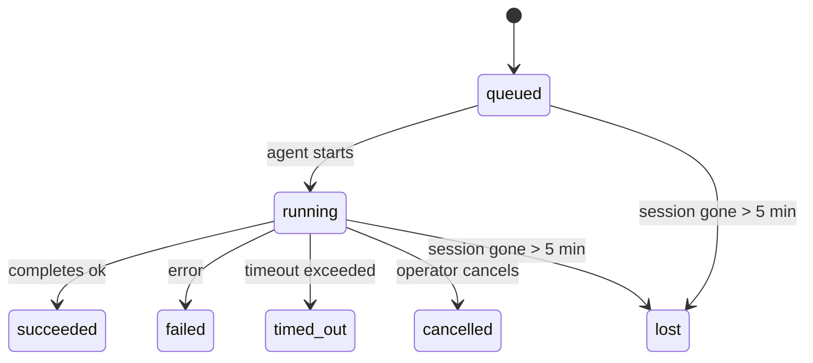

---
read_when:
    - Devam eden veya yakın zamanda tamamlanan arka plan çalışmalarını inceleme
    - Ayrılmış ajan çalıştırmalarında teslimat hatalarını ayıklama
    - Arka plan çalıştırmalarının oturumlar, Cron ve Heartbeat ile nasıl ilişkili olduğunu anlama
sidebarTitle: Background tasks
summary: ACP çalıştırmaları, alt ajanlar, yalıtılmış Cron işleri ve CLI işlemleri için arka plan görev takibi
title: Arka plan görevleri
x-i18n:
    generated_at: "2026-04-30T09:05:24Z"
    model: gpt-5.5
    provider: openai
    source_hash: 4bbf74f3aeea532738b56b83cd2e1a0a3734bfd453da6636b8be985a28ccc027
    source_path: automation/tasks.md
    workflow: 16
---

<Note>
Zamanlama mı arıyorsunuz? Doğru mekanizmayı seçmek için [Otomasyon ve görevler](/tr/automation) sayfasına bakın. Bu sayfa arka plan işleri için etkinlik kayıt defteridir, zamanlayıcı değildir.
</Note>

Arka plan görevleri, **ana konuşma oturumunuzun dışında** çalışan işleri izler: ACP çalıştırmaları, alt ajan başlatmaları, yalıtılmış cron işi yürütmeleri ve CLI tarafından başlatılan işlemler.

Görevler oturumların, cron işlerinin veya Heartbeat'lerin yerini **almaz**; bunlar, ayrılmış hangi işin ne zaman gerçekleştiğini ve başarılı olup olmadığını kaydeden **etkinlik kayıt defteridir**.

<Note>
Her ajan çalıştırması bir görev oluşturmaz. Heartbeat dönüşleri ve normal etkileşimli sohbet oluşturmaz. Tüm cron yürütmeleri, ACP başlatmaları, alt ajan başlatmaları ve CLI ajan komutları oluşturur.
</Note>

## TL;DR

- Görevler zamanlayıcı değil, **kayıtlardır**; cron ve Heartbeat işin _ne zaman_ çalışacağına karar verir, görevler _ne olduğunu_ izler.
- ACP, alt ajanlar, tüm cron işleri ve CLI işlemleri görev oluşturur. Heartbeat dönüşleri oluşturmaz.
- Her görev `queued → running → terminal` aşamalarından geçer (succeeded, failed, timed_out, cancelled veya lost).
- Cron görevleri, cron çalışma zamanı işi hâlâ sahiplenirken canlı kalır; bellek içi çalışma zamanı durumu kaybolduysa, görev bakımı bir görevi kayıp olarak işaretlemeden önce dayanıklı cron çalıştırma geçmişini kontrol eder.
- Tamamlama anlık iletim odaklıdır: ayrılmış iş, tamamlandığında doğrudan bildirim gönderebilir veya istekte bulunan oturumu/Heartbeat'i uyandırabilir; bu nedenle durum yoklama döngüleri genellikle yanlış yaklaşımdır.
- Yalıtılmış cron çalıştırmaları ve alt ajan tamamlamaları, son temizlik kayıt işlemlerinden önce alt oturumları için izlenen tarayıcı sekmelerini/süreçlerini en iyi çabayla temizler.
- Yalıtılmış cron teslimi, alt alt ajan işleri hâlâ boşalırken eski ara üst yanıtları bastırır ve teslimden önce gelirse son alt çıktıyı tercih eder.
- Tamamlama bildirimleri doğrudan bir kanala teslim edilir veya bir sonraki Heartbeat için kuyruğa alınır.
- `openclaw tasks list` tüm görevleri gösterir; `openclaw tasks audit` sorunları ortaya çıkarır.
- Terminal kayıtları 7 gün tutulur, ardından otomatik olarak budanır.

## Hızlı başlangıç

<Tabs>
  <Tab title="Listele ve filtrele">
    ```bash
    # Tüm görevleri listele (en yeni önce)
    openclaw tasks list

    # Çalışma zamanına veya duruma göre filtrele
    openclaw tasks list --runtime acp
    openclaw tasks list --status running
    ```

  </Tab>
  <Tab title="İncele">
    ```bash
    # Belirli bir görevin ayrıntılarını göster (ID, çalıştırma ID'si veya oturum anahtarına göre)
    openclaw tasks show <lookup>
    ```
  </Tab>
  <Tab title="İptal et ve bildir">
    ```bash
    # Çalışan bir görevi iptal et (alt oturumu sonlandırır)
    openclaw tasks cancel <lookup>

    # Bir görev için bildirim ilkesini değiştir
    openclaw tasks notify <lookup> state_changes
    ```

  </Tab>
  <Tab title="Denetim ve bakım">
    ```bash
    # Sağlık denetimi çalıştır
    openclaw tasks audit

    # Bakımı önizle veya uygula
    openclaw tasks maintenance
    openclaw tasks maintenance --apply
    ```

  </Tab>
  <Tab title="Görev akışı">
    ```bash
    # TaskFlow durumunu incele
    openclaw tasks flow list
    openclaw tasks flow show <lookup>
    openclaw tasks flow cancel <lookup>
    ```
  </Tab>
</Tabs>

## Görevi ne oluşturur

| Kaynak                 | Çalışma zamanı türü | Görev kaydı oluşturulma zamanı                         | Varsayılan bildirim ilkesi |
| ---------------------- | ------------ | ------------------------------------------------------ | --------------------- |
| ACP arka plan çalıştırmaları | `acp`        | Alt ACP oturumu başlatılırken                         | `done_only`           |
| Alt ajan orkestrasyonu | `subagent`   | `sessions_spawn` ile alt ajan başlatılırken            | `done_only`           |
| Cron işleri (tüm türler) | `cron`       | Her cron yürütmesinde (ana oturum ve yalıtılmış)       | `silent`              |
| CLI işlemleri          | `cli`        | Gateway üzerinden çalışan `openclaw agent` komutları   | `silent`              |
| Ajan medya işleri      | `cli`        | Oturum destekli `video_generate` çalıştırmaları        | `silent`              |

<AccordionGroup>
  <Accordion title="Cron ve medya için bildirim varsayılanları">
    Ana oturum cron görevleri varsayılan olarak `silent` bildirim ilkesini kullanır; izleme için kayıt oluştururlar ancak bildirim üretmezler. Yalıtılmış cron görevleri de varsayılan olarak `silent` kullanır, ancak kendi oturumlarında çalıştıkları için daha görünürdür.

    Oturum destekli `video_generate` çalıştırmaları da `silent` bildirim ilkesini kullanır. Yine de görev kayıtları oluştururlar, ancak tamamlama özgün ajan oturumuna iç uyanma olarak geri verilir; böylece ajan takip mesajını yazabilir ve biten videoyu kendisi ekleyebilir. `tools.media.asyncCompletion.directSend` seçeneğini etkinleştirirseniz, zaman uyumsuz `music_generate` ve `video_generate` tamamlamaları, istekte bulunan oturum uyandırma yoluna dönmeden önce doğrudan kanal teslimini dener.

  </Accordion>
  <Accordion title="Eşzamanlı video_generate koruması">
    Oturum destekli bir `video_generate` görevi hâlâ etkinken, araç aynı zamanda bir koruma olarak da davranır: aynı oturumdaki yinelenen `video_generate` çağrıları, ikinci bir eşzamanlı üretim başlatmak yerine etkin görev durumunu döndürür. Ajan tarafından açık bir ilerleme/durum sorgusu istediğinizde `action: "status"` kullanın.
  </Accordion>
  <Accordion title="Neler görev oluşturmaz">
    - Heartbeat dönüşleri — ana oturum; bkz. [Heartbeat](/tr/gateway/heartbeat)
    - Normal etkileşimli sohbet dönüşleri
    - Doğrudan `/command` yanıtları

  </Accordion>
</AccordionGroup>

## Görev yaşam döngüsü



| Durum       | Anlamı                                                                     |
| ----------- | -------------------------------------------------------------------------- |
| `queued`    | Oluşturuldu, ajanın başlamasını bekliyor                                   |
| `running`   | Ajan dönüşü etkin olarak yürütülüyor                                       |
| `succeeded` | Başarıyla tamamlandı                                                       |
| `failed`    | Bir hatayla tamamlandı                                                     |
| `timed_out` | Yapılandırılmış zaman aşımını aştı                                         |
| `cancelled` | Operatör tarafından `openclaw tasks cancel` ile durduruldu                 |
| `lost`      | Çalışma zamanı, 5 dakikalık bekleme süresinden sonra yetkili destek durumunu kaybetti |

Geçişler otomatik olarak gerçekleşir; ilişkili ajan çalıştırması sona erdiğinde görev durumu buna uyacak şekilde güncellenir.

Ajan çalıştırmasının tamamlanması, etkin görev kayıtları için yetkili kaynaktır. Başarılı bir ayrılmış çalıştırma `succeeded` olarak sonlandırılır, sıradan çalıştırma hataları `failed` olarak sonlandırılır ve zaman aşımı veya iptal sonuçları `timed_out` olarak sonlandırılır. Bir operatör görevi zaten iptal ettiyse veya çalışma zamanı `failed`, `timed_out` ya da `lost` gibi daha güçlü bir terminal durumu zaten kaydettiyse, daha sonra gelen başarı sinyali bu terminal durumunu düşürmez.

`lost` çalışma zamanı farkındadır:

- ACP görevleri: destekleyen ACP alt oturum meta verileri kayboldu.
- Alt ajan görevleri: destekleyen alt oturum hedef ajan deposundan kayboldu.
- Cron görevleri: cron çalışma zamanı işi artık etkin olarak izlemiyor ve dayanıklı cron çalıştırma geçmişi bu çalıştırma için terminal sonuç göstermiyor. Çevrimdışı CLI denetimi, kendi boş süreç içi cron çalışma zamanı durumunu yetkili kaynak olarak kabul etmez.
- CLI görevleri: yalıtılmış alt oturum görevleri alt oturumu kullanır; sohbet destekli CLI görevleri bunun yerine canlı çalıştırma bağlamını kullanır, bu nedenle kalıcı kanal/grup/doğrudan oturum satırları onları canlı tutmaz. Gateway destekli `openclaw agent` çalıştırmaları da çalıştırma sonuçlarından sonlandırılır, bu nedenle tamamlanan çalıştırmalar süpürücü onları `lost` olarak işaretleyene kadar etkin kalmaz.

## Teslim ve bildirimler

Bir görev terminal duruma ulaştığında OpenClaw sizi bilgilendirir. İki teslim yolu vardır:

**Doğrudan teslim** — görevin bir kanal hedefi varsa (`requesterOrigin`), tamamlama mesajı doğrudan o kanala gider (Telegram, Discord, Slack vb.). Alt ajan tamamlamalarında OpenClaw, varsa bağlı konu/başlık yönlendirmesini de korur ve doğrudan teslimden vazgeçmeden önce eksik `to` / hesabı, istekte bulunan oturumun saklanan rotasından (`lastChannel` / `lastTo` / `lastAccountId`) doldurabilir.

**Oturum kuyruğuna teslim** — doğrudan teslim başarısız olursa veya köken ayarlanmamışsa, güncelleme istekte bulunanın oturumunda sistem olayı olarak kuyruğa alınır ve bir sonraki Heartbeat'te görünür.

<Tip>
Görev tamamlanması anında bir Heartbeat uyandırması tetikler; böylece sonucu hızlıca görürsünüz, bir sonraki zamanlanmış Heartbeat işaretini beklemeniz gerekmez.
</Tip>

Bu, olağan iş akışının anlık iletim tabanlı olduğu anlamına gelir: ayrılmış işi bir kez başlatın, ardından çalışma zamanının tamamlandığında sizi uyandırmasına veya bilgilendirmesine izin verin. Görev durumunu yalnızca hata ayıklama, müdahale veya açık bir denetim gerektiğinde yoklayın.

### Bildirim ilkeleri

Her görev hakkında ne kadar bilgi alacağınızı kontrol edin:

| İlke                  | Ne teslim edilir                                                         |
| --------------------- | ----------------------------------------------------------------------- |
| `done_only` (varsayılan) | Yalnızca terminal durum (succeeded, failed vb.) — **varsayılan budur** |
| `state_changes`       | Her durum geçişi ve ilerleme güncellemesi                               |
| `silent`              | Hiçbir şey                                                              |

Bir görev çalışırken ilkeyi değiştirin:

```bash
openclaw tasks notify <lookup> state_changes
```

## CLI başvurusu

<AccordionGroup>
  <Accordion title="tasks list">
    ```bash
    openclaw tasks list [--runtime <acp|subagent|cron|cli>] [--status <status>] [--json]
    ```

    Çıktı sütunları: Görev ID'si, Tür, Durum, Teslim, Çalıştırma ID'si, Alt Oturum, Özet.

  </Accordion>
  <Accordion title="tasks show">
    ```bash
    openclaw tasks show <lookup>
    ```

    Arama belirteci bir görev ID'si, çalıştırma ID'si veya oturum anahtarı kabul eder. Zamanlama, teslim durumu, hata ve terminal özet dahil tam kaydı gösterir.

  </Accordion>
  <Accordion title="tasks cancel">
    ```bash
    openclaw tasks cancel <lookup>
    ```

    ACP ve alt ajan görevleri için bu, alt oturumu sonlandırır. CLI tarafından izlenen görevlerde iptal, görev kayıt defterine kaydedilir (ayrı bir alt çalışma zamanı tanıtıcısı yoktur). Durum `cancelled` olarak değişir ve uygunsa teslim bildirimi gönderilir.

  </Accordion>
  <Accordion title="tasks notify">
    ```bash
    openclaw tasks notify <lookup> <done_only|state_changes|silent>
    ```
  </Accordion>
  <Accordion title="tasks audit">
    ```bash
    openclaw tasks audit [--json]
    ```

    Operasyonel sorunları ortaya çıkarır. Sorunlar algılandığında bulgular `openclaw status` içinde de görünür.

    | Bulgu                     | Önem Derecesi | Tetikleyici                                                                                                                                    |
    | ------------------------- | ---------- | ---------------------------------------------------------------------------------------------------------------------------------------------- |
    | `stale_queued`            | warn       | 10 dakikadan uzun süredir kuyrukta                                                                                                             |
    | `stale_running`           | error      | 30 dakikadan uzun süredir çalışıyor                                                                                                            |
    | `lost`                    | warn/error | Çalışma zamanı destekli görev sahipliği kayboldu; saklanan kayıp görevler `cleanupAfter` zamanına kadar uyarı verir, ardından hata olur       |
    | `delivery_failed`         | warn       | Teslim başarısız oldu ve bildirim ilkesi `silent` değil                                                                                        |
    | `missing_cleanup`         | warn       | Temizleme zaman damgası olmayan terminal görev                                                                                                 |
    | `inconsistent_timestamps` | warn       | Zaman çizelgesi ihlali (örneğin başlamadan önce bitmiş)                                                                                        |

  </Accordion>
  <Accordion title="görev bakımı">
    ```bash
    openclaw tasks maintenance [--json]
    openclaw tasks maintenance --apply [--json]
    ```

    Bunu görevler ve Task Flow durumu için mutabakatı, temizleme damgalamasını ve budamayı önizlemek veya uygulamak için kullanın.

    Mutabakat çalışma zamanının farkındadır:

    - ACP/subagent görevleri, destekleyen alt oturumlarını denetler.
    - Cron görevleri, cron çalışma zamanının işi hâlâ sahiplenip sahiplenmediğini denetler, ardından `lost` durumuna düşmeden önce kalıcı cron çalıştırma günlüklerinden/iş durumundan terminal durumu kurtarır. Bellek içi cron etkin iş kümesi için yalnızca Gateway süreci yetkilidir; çevrimdışı CLI denetimi kalıcı geçmişi kullanır ancak yalnızca bu yerel Set boş olduğu için bir cron görevini kayıp olarak işaretlemez.
    - Sohbet destekli CLI görevleri yalnızca sohbet oturumu satırını değil, sahip olan canlı çalıştırma bağlamını denetler.

    Tamamlama temizliği de çalışma zamanının farkındadır:

    - Subagent tamamlaması, duyuru temizliği devam etmeden önce alt oturum için izlenen tarayıcı sekmelerini/süreçlerini en iyi çabayla kapatır.
    - Yalıtılmış cron tamamlaması, çalıştırma tamamen kapanmadan önce cron oturumu için izlenen tarayıcı sekmelerini/süreçlerini en iyi çabayla kapatır.
    - Yalıtılmış cron teslimi, gerektiğinde alt soy subagent takip işinin bitmesini bekler ve onu duyurmak yerine eski üst onay metnini bastırır.
    - Subagent tamamlama teslimi en son görünür asistan metnini tercih eder; bu boşsa temizlenmiş en son araç/toolResult metnine geri döner ve yalnızca zaman aşımına uğrayan araç çağrısı çalıştırmaları kısa bir kısmi ilerleme özetine indirgenebilir. Terminal başarısız çalıştırmalar, yakalanan yanıt metnini yeniden oynatmadan hata durumunu duyurur.
    - Temizleme hataları gerçek görev sonucunu maskelemez.

  </Accordion>
  <Accordion title="görev akışı listele | göster | iptal et">
    ```bash
    openclaw tasks flow list [--status <status>] [--json]
    openclaw tasks flow show <lookup> [--json]
    openclaw tasks flow cancel <lookup>
    ```

    Tek bir arka plan görev kaydı yerine yöneten Task Flow sizin için önemli olduğunda bunları kullanın.

  </Accordion>
</AccordionGroup>

## Sohbet görev panosu (`/tasks`)

Bu oturuma bağlı arka plan görevlerini görmek için herhangi bir sohbet oturumunda `/tasks` kullanın. Pano, etkin ve yakın zamanda tamamlanan görevleri çalışma zamanı, durum, zamanlama ve ilerleme ya da hata ayrıntısıyla gösterir.

Geçerli oturumda görünür bağlı görev olmadığında, `/tasks` diğer oturum ayrıntılarını sızdırmadan yine de genel bir görünüm almanız için aracı yerel görev sayılarına geri döner.

Tam operatör defteri için CLI kullanın: `openclaw tasks list`.

## Durum entegrasyonu (görev baskısı)

`openclaw status` hızlı bakış sağlayan bir görev özeti içerir:

```
Tasks: 3 queued · 2 running · 1 issues
```

Özet şunları bildirir:

- **active** — `queued` + `running` sayısı
- **failures** — `failed` + `timed_out` + `lost` sayısı
- **byRuntime** — `acp`, `subagent`, `cron`, `cli` kırılımı

Hem `/status` hem de `session_status` aracı temizleme farkındalıklı bir görev anlık görüntüsü kullanır: etkin görevler tercih edilir, eski tamamlanmış satırlar gizlenir ve son hatalar yalnızca etkin iş kalmadığında gösterilir. Bu, durum kartını şu anda önemli olan şeye odaklı tutar.

## Depolama ve bakım

### Görevlerin bulunduğu yer

Görev kayıtları SQLite içinde şu konumda kalıcıdır:

```
$OPENCLAW_STATE_DIR/tasks/runs.sqlite
```

Kayıt defteri Gateway başlangıcında belleğe yüklenir ve yeniden başlatmalar arasında dayanıklılık için yazmaları SQLite ile eşitler.
Gateway, SQLite varsayılan otomatik checkpoint eşiğini ve periyodik ve kapanış `TRUNCATE` checkpoint'lerini kullanarak SQLite write-ahead log boyutunu sınırlı tutar.

### Otomatik bakım

Bir süpürücü her **60 saniyede** çalışır ve dört şeyi ele alır:

<Steps>
  <Step title="Mutabakat">
    Etkin görevlerin hâlâ yetkili çalışma zamanı desteğine sahip olup olmadığını denetler. ACP/subagent görevleri alt oturum durumunu, cron görevleri etkin iş sahipliğini ve sohbet destekli CLI görevleri sahip olan çalıştırma bağlamını kullanır. Bu destek durumu 5 dakikadan uzun süre kaybolursa görev `lost` olarak işaretlenir.
  </Step>
  <Step title="ACP oturum onarımı">
    Terminal veya yetim kalmış üst sahipliğindeki tek seferlik ACP oturumlarını kapatır ve eski terminal veya yetim kalmış kalıcı ACP oturumlarını yalnızca etkin konuşma bağlaması kalmadığında kapatır.
  </Step>
  <Step title="Temizleme damgalaması">
    Terminal görevlerinde bir `cleanupAfter` zaman damgası ayarlar (endedAt + 7 gün). Saklama sırasında kayıp görevler denetimde hâlâ uyarı olarak görünür; `cleanupAfter` süresi dolduktan sonra veya temizleme meta verisi eksik olduğunda hata olur.
  </Step>
  <Step title="Budama">
    `cleanupAfter` tarihini geçmiş kayıtları siler.
  </Step>
</Steps>

<Note>
**Saklama:** terminal görev kayıtları **7 gün** tutulur, ardından otomatik olarak budanır. Yapılandırma gerekmez.
</Note>

## Görevlerin diğer sistemlerle ilişkisi

<AccordionGroup>
  <Accordion title="Görevler ve Task Flow">
    [Task Flow](/tr/automation/taskflow), arka plan görevlerinin üstündeki akış orkestrasyon katmanıdır. Tek bir akış, ömrü boyunca yönetilen veya yansıtılan eşitleme modlarını kullanarak birden fazla görevi koordine edebilir. Tek tek görev kayıtlarını incelemek için `openclaw tasks`, yöneten akışı incelemek için `openclaw tasks flow` kullanın.

    Ayrıntılar için [Task Flow](/tr/automation/taskflow) bölümüne bakın.

  </Accordion>
  <Accordion title="Görevler ve cron">
    Bir cron işi **tanımı** `~/.openclaw/cron/jobs.json` içinde bulunur; çalışma zamanı yürütme durumu onun yanında `~/.openclaw/cron/jobs-state.json` içinde bulunur. **Her** cron yürütmesi bir görev kaydı oluşturur; hem ana oturum hem de yalıtılmış yürütmeler. Ana oturum cron görevleri, bildirim üretmeden izlenmeleri için varsayılan olarak `silent` bildirim ilkesini kullanır.

    [Cron İşleri](/tr/automation/cron-jobs) bölümüne bakın.

  </Accordion>
  <Accordion title="Görevler ve heartbeat">
    Heartbeat çalıştırmaları ana oturum dönüşleridir; görev kaydı oluşturmazlar. Bir görev tamamlandığında, sonucu hızlıca görmeniz için bir heartbeat uyandırması tetikleyebilir.

    [Heartbeat](/tr/gateway/heartbeat) bölümüne bakın.

  </Accordion>
  <Accordion title="Görevler ve oturumlar">
    Bir görev bir `childSessionKey` (işin çalıştığı yer) ve bir `requesterSessionKey` (onu başlatan kişi) başvurusu içerebilir. Oturumlar konuşma bağlamıdır; görevler bunun üstündeki etkinlik takibidir.
  </Accordion>
  <Accordion title="Görevler ve aracı çalıştırmaları">
    Bir görevin `runId` değeri, işi yapan aracı çalıştırmasına bağlanır. Aracı yaşam döngüsü olayları (başlangıç, bitiş, hata) görev durumunu otomatik olarak günceller; yaşam döngüsünü elle yönetmeniz gerekmez.
  </Accordion>
</AccordionGroup>

## İlgili

- [Otomasyon ve Görevler](/tr/automation) — tüm otomasyon mekanizmalarına hızlı bakış
- [CLI: Görevler](/tr/cli/tasks) — CLI komut başvurusu
- [Heartbeat](/tr/gateway/heartbeat) — periyodik ana oturum dönüşleri
- [Zamanlanmış Görevler](/tr/automation/cron-jobs) — arka plan işini zamanlama
- [Task Flow](/tr/automation/taskflow) — görevlerin üstündeki akış orkestrasyonu
