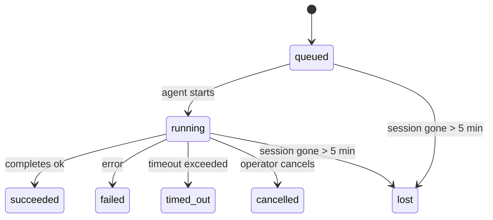

---
read_when:
    - Devam eden veya yakın zamanda tamamlanan arka plan çalışmalarını inceleme
    - Bağımsız aracı çalıştırmaları için teslim hatalarında hata ayıklama
    - Arka plan çalıştırmalarının oturumlar, Cron ve Heartbeat ile ilişkisini anlama
sidebarTitle: Background tasks
summary: ACP çalıştırmaları, alt ajanlar, yalıtılmış Cron işleri ve CLI işlemleri için arka plan görev takibi
title: Arka plan görevleri
x-i18n:
    generated_at: "2026-05-07T13:13:29Z"
    model: gpt-5.5
    provider: openai
    source_hash: a91a04ef6142e488d2fbc459d2c663afb93816a58fe9f52e0a51420703ea2d4d
    source_path: automation/tasks.md
    workflow: 16
---

<Note>
Zamanlama mı arıyorsunuz? Doğru mekanizmayı seçmek için [Otomasyon ve görevler](/tr/automation) bölümüne bakın. Bu sayfa arka plan çalışmaları için etkinlik defteridir, zamanlayıcı değildir.
</Note>

Arka plan görevleri, **ana konuşma oturumunuzun dışında** çalışan işleri izler: ACP çalıştırmaları, subagent başlatmaları, izole cron işi yürütmeleri ve CLI tarafından başlatılan işlemler.

Görevler oturumların, cron işlerinin veya heartbeat'lerin yerini **almaz**; bunlar, ayrılmış hangi işin ne zaman gerçekleştiğini ve başarılı olup olmadığını kaydeden **etkinlik defteridir**.

<Note>
Her agent çalıştırması bir görev oluşturmaz. Heartbeat dönüşleri ve normal etkileşimli sohbet bunu yapmaz. Tüm cron yürütmeleri, ACP başlatmaları, subagent başlatmaları ve CLI agent komutları yapar.
</Note>

## TL;DR

- Görevler zamanlayıcı değil, **kayıtlardır**; cron ve heartbeat işin _ne zaman_ çalışacağına karar verir, görevler _ne olduğunu_ izler.
- ACP, subagent'lar, tüm cron işleri ve CLI işlemleri görev oluşturur. Heartbeat dönüşleri oluşturmaz.
- Her görev `queued → running → terminal` aşamalarından geçer (succeeded, failed, timed_out, cancelled veya lost).
- Cron görevleri, cron runtime işi hâlâ sahiplenirken canlı kalır; bellek içi runtime durumu kaybolmuşsa görev bakımı, bir görevi kayıp olarak işaretlemeden önce dayanıklı cron çalışma geçmişini kontrol eder.
- Tamamlama push odaklıdır: ayrılmış iş, bittiğinde doğrudan bildirim gönderebilir veya istekte bulunan oturumu/heartbeat'i uyandırabilir; bu yüzden durum yoklama döngüleri genellikle yanlış biçimdir.
- İzole cron çalıştırmaları ve subagent tamamlamaları, son temizlik defteri kaydından önce alt oturumları için izlenen tarayıcı sekmelerini/süreçlerini en iyi çabayla temizler.
- İzole cron teslimi, alt soy subagent işi hâlâ boşalırken eskimiş ara üst yanıtları bastırır ve teslimden önce geldiyse son alt soy çıktısını tercih eder.
- Tamamlama bildirimleri doğrudan bir kanala teslim edilir veya bir sonraki heartbeat için kuyruğa alınır.
- `openclaw tasks list` tüm görevleri gösterir; `openclaw tasks audit` sorunları ortaya çıkarır.
- Terminal kayıtları 7 gün tutulur, ardından otomatik olarak budanır.

## Hızlı başlangıç

<Tabs>
  <Tab title="Listele ve filtrele">
    ```bash
    # List all tasks (newest first)
    openclaw tasks list

    # Filter by runtime or status
    openclaw tasks list --runtime acp
    openclaw tasks list --status running
    ```

  </Tab>
  <Tab title="İncele">
    ```bash
    # Show details for a specific task (by ID, run ID, or session key)
    openclaw tasks show <lookup>
    ```
  </Tab>
  <Tab title="İptal et ve bildir">
    ```bash
    # Cancel a running task (kills the child session)
    openclaw tasks cancel <lookup>

    # Change notification policy for a task
    openclaw tasks notify <lookup> state_changes
    ```

  </Tab>
  <Tab title="Denetim ve bakım">
    ```bash
    # Run a health audit
    openclaw tasks audit

    # Preview or apply maintenance
    openclaw tasks maintenance
    openclaw tasks maintenance --apply
    ```

  </Tab>
  <Tab title="Görev akışı">
    ```bash
    # Inspect TaskFlow state
    openclaw tasks flow list
    openclaw tasks flow show <lookup>
    openclaw tasks flow cancel <lookup>
    ```
  </Tab>
</Tabs>

## Bir görevi ne oluşturur?

| Kaynak                 | Runtime türü | Bir görev kaydı ne zaman oluşturulur                   | Varsayılan bildirim politikası |
| ---------------------- | ------------ | ------------------------------------------------------ | ------------------------------ |
| ACP arka plan çalıştırmaları | `acp`        | Bir alt ACP oturumu başlatılırken                      | `done_only`                    |
| Subagent orkestrasyonu | `subagent`   | `sessions_spawn` ile bir subagent başlatılırken        | `done_only`                    |
| Cron işleri (tüm türler) | `cron`       | Her cron yürütmesi (ana oturum ve izole)               | `silent`                       |
| CLI işlemleri          | `cli`        | Gateway üzerinden çalışan `openclaw agent` komutları   | `silent`                       |
| Agent medya işleri     | `cli`        | Oturum destekli `music_generate`/`video_generate` çalıştırmaları | `silent`              |

<AccordionGroup>
  <Accordion title="Cron ve medya için bildirim varsayılanları">
    Ana oturum cron görevleri varsayılan olarak `silent` bildirim politikasını kullanır; izleme için kayıt oluştururlar ama bildirim üretmezler. İzole cron görevleri de varsayılan olarak `silent` kullanır, ancak kendi oturumlarında çalıştıkları için daha görünürdür.

    Oturum destekli `music_generate` ve `video_generate` çalıştırmaları da `silent` bildirim politikasını kullanır. Yine de görev kayıtları oluştururlar, ancak tamamlama, agent'ın takip mesajını yazıp tamamlanan medyayı kendisinin ekleyebilmesi için iç uyandırma olarak özgün agent oturumuna geri verilir. Grup/kanal tamamlamaları normal görünür yanıt politikasını izler; bu yüzden kaynak teslimi gerektirdiğinde agent mesaj aracını kullanır. Tamamlama agent'ı yalnızca araç rotasında mesaj aracı teslim kanıtı üretemezse OpenClaw, medyayı özel bırakmak yerine tamamlama yedeğini doğrudan özgün kanala gönderir.

  </Accordion>
  <Accordion title="Eşzamanlı video_generate güvenlik sınırı">
    Oturum destekli bir `video_generate` görevi hâlâ aktifken araç aynı zamanda bir güvenlik sınırı gibi davranır: aynı oturumdaki yinelenen `video_generate` çağrıları, ikinci bir eşzamanlı üretim başlatmak yerine aktif görev durumunu döndürür. Agent tarafından açık bir ilerleme/durum sorgusu istediğinizde `action: "status"` kullanın.
  </Accordion>
  <Accordion title="Neler görev oluşturmaz?">
    - Heartbeat dönüşleri - ana oturum; bkz. [Heartbeat](/tr/gateway/heartbeat)
    - Normal etkileşimli sohbet dönüşleri
    - Doğrudan `/command` yanıtları

  </Accordion>
</AccordionGroup>

## Görev yaşam döngüsü



| Durum       | Ne anlama gelir                                                           |
| ----------- | -------------------------------------------------------------------------- |
| `queued`    | Oluşturuldu, agent'ın başlaması bekleniyor                                |
| `running`   | Agent dönüşü aktif olarak yürütülüyor                                     |
| `succeeded` | Başarıyla tamamlandı                                                       |
| `failed`    | Bir hatayla tamamlandı                                                     |
| `timed_out` | Yapılandırılan zaman aşımını aştı                                          |
| `cancelled` | Operatör tarafından `openclaw tasks cancel` ile durduruldu                |
| `lost`      | Runtime, 5 dakikalık ek süre sonrasında yetkili destek durumunu kaybetti  |

Geçişler otomatik olarak gerçekleşir; ilişkili agent çalıştırması sona erdiğinde görev durumu buna uyacak şekilde güncellenir.

Agent çalıştırmasının tamamlanması, aktif görev kayıtları için yetkilidir. Başarılı ayrılmış bir çalıştırma `succeeded` olarak sonlandırılır, olağan çalıştırma hataları `failed` olarak sonlandırılır ve zaman aşımı veya durdurma sonuçları `timed_out` olarak sonlandırılır. Bir operatör görevi zaten iptal ettiyse veya runtime `failed`, `timed_out` ya da `lost` gibi daha güçlü bir terminal durumu zaten kaydettiyse, daha sonra gelen başarı sinyali bu terminal durumunu düşürmez.

`lost` runtime'a duyarlıdır:

- ACP görevleri: destekleyen ACP alt oturum meta verileri kayboldu.
- Subagent görevleri: destekleyen alt oturum hedef agent deposundan kayboldu.
- Cron görevleri: cron runtime artık işi aktif olarak izlemiyor ve dayanıklı cron çalışma geçmişi bu çalıştırma için terminal bir sonuç göstermiyor. Çevrim dışı CLI denetimi, kendi boş süreç içi cron runtime durumunu yetkili kabul etmez.
- CLI görevleri: çalıştırma kimliği/kaynak kimliği olan görevler canlı çalıştırma bağlamını kullanır; bu yüzden kalan alt oturum veya sohbet oturumu satırları, Gateway tarafından sahiplenilen çalıştırma kaybolduktan sonra onları canlı tutmaz. Çalıştırma kimliği olmayan eski CLI görevleri yine alt oturuma geri döner. Gateway destekli `openclaw agent` çalıştırmaları da çalıştırma sonucundan sonlandırılır; bu yüzden tamamlanan çalıştırmalar, süpürücü onları `lost` olarak işaretleyene kadar aktif kalmaz.

## Teslim ve bildirimler

Bir görev terminal duruma ulaştığında OpenClaw size bildirim gönderir. İki teslim yolu vardır:

**Doğrudan teslim** - görevde bir kanal hedefi varsa (`requesterOrigin`), tamamlama mesajı doğrudan o kanala gider (Telegram, Discord, Slack vb.). Subagent tamamlamaları için OpenClaw ayrıca mevcut olduğunda bağlı iş parçacığı/konu yönlendirmesini korur ve doğrudan teslimden vazgeçmeden önce eksik bir `to` / hesabı, istekte bulunan oturumun saklanan rotasından (`lastChannel` / `lastTo` / `lastAccountId`) doldurabilir.

**Oturum kuyruğuna teslim** - doğrudan teslim başarısız olursa veya origin ayarlanmadıysa güncelleme, istekte bulunanın oturumunda bir sistem olayı olarak kuyruğa alınır ve bir sonraki heartbeat'te görünür.

<Tip>
Görev tamamlanması anında bir heartbeat uyandırması tetikler, böylece sonucu hızlıca görürsünüz; bir sonraki zamanlanmış heartbeat tikini beklemeniz gerekmez.
</Tip>

Bu, olağan iş akışının push tabanlı olduğu anlamına gelir: ayrılmış işi bir kez başlatın, sonra runtime'ın tamamlanma sırasında sizi uyandırmasına veya bilgilendirmesine izin verin. Görev durumunu yalnızca hata ayıklama, müdahale veya açık bir denetim gerektiğinde yoklayın.

### Bildirim politikaları

Her görev hakkında ne kadar duyacağınızı kontrol edin:

| Politika              | Ne teslim edilir                                                        |
| --------------------- | ----------------------------------------------------------------------- |
| `done_only` (varsayılan) | Yalnızca terminal durum (succeeded, failed vb.) - **varsayılan budur** |
| `state_changes`       | Her durum geçişi ve ilerleme güncellemesi                               |
| `silent`              | Hiçbir şey                                                              |

Bir görev çalışırken politikayı değiştirin:

```bash
openclaw tasks notify <lookup> state_changes
```

## CLI başvurusu

<AccordionGroup>
  <Accordion title="tasks list">
    ```bash
    openclaw tasks list [--runtime <acp|subagent|cron|cli>] [--status <status>] [--json]
    ```

    Çıktı sütunları: Görev kimliği, Tür, Durum, Teslim, Çalıştırma kimliği, Alt oturum, Özet.

  </Accordion>
  <Accordion title="tasks show">
    ```bash
    openclaw tasks show <lookup>
    ```

    Arama belirteci bir görev kimliği, çalıştırma kimliği veya oturum anahtarını kabul eder. Zamanlama, teslim durumu, hata ve terminal özeti dahil tam kaydı gösterir.

  </Accordion>
  <Accordion title="tasks cancel">
    ```bash
    openclaw tasks cancel <lookup>
    ```

    ACP ve subagent görevleri için bu, alt oturumu sonlandırır. CLI tarafından izlenen görevler için iptal, görev kayıt defterine kaydedilir (ayrı bir alt runtime tanıtıcısı yoktur). Durum `cancelled` olarak değişir ve uygulanabilir olduğunda bir teslim bildirimi gönderilir.

  </Accordion>
  <Accordion title="tasks notify">
    ```bash
    openclaw tasks notify <lookup> <done_only|state_changes|silent>
    ```
  </Accordion>
  <Accordion title="tasks audit">
    ```bash
    openclaw tasks audit [--json]
    ```

    Operasyonel sorunları ortaya çıkarır. Sorunlar algılandığında bulgular `openclaw status` içinde de görünür.

    | Bulgu                    | Önem Derecesi | Tetikleyici                                                                                                                             |
    | ------------------------- | ---------- | ---------------------------------------------------------------------------------------------------------------------------------------- |
    | `stale_queued`            | warn       | 10 dakikadan uzun süredir kuyrukta                                                                                                      |
    | `stale_running`           | error      | 30 dakikadan uzun süredir çalışıyor                                                                                                     |
    | `lost`                    | warn/error | Runtime destekli görev sahipliği kayboldu; tutulan kayıp görevler `cleanupAfter` zamanına kadar uyarı verir, sonra hataya dönüşür |
    | `delivery_failed`         | warn       | Teslim başarısız oldu ve bildirim ilkesi `silent` değil                                                                                 |
    | `missing_cleanup`         | warn       | Temizleme zaman damgası olmayan terminal görev                                                                                          |
    | `inconsistent_timestamps` | warn       | Zaman çizelgesi ihlali (örneğin başlamadan önce bitmiş)                                                                                 |

  </Accordion>
  <Accordion title="tasks maintenance">
    ```bash
    openclaw tasks maintenance [--json]
    openclaw tasks maintenance --apply [--json]
    ```

    Bunu görevler ve Task Flow durumu için uzlaştırma, temizleme damgası ekleme ve budamayı önizlemek veya uygulamak için kullanın.

    Uzlaştırma runtime farkındadır:

    - ACP/alt aracı görevleri, destekleyen alt oturumlarını denetler.
    - Alt oturumunda yeniden başlatma kurtarma mezar taşı bulunan alt aracı görevleri, kurtarılabilir destek oturumları olarak ele alınmak yerine kayıp olarak işaretlenir.
    - Cron görevleri, cron runtime'ının işi hâlâ sahiplenip sahiplenmediğini denetler, ardından `lost` durumuna düşmeden önce kalıcı cron çalıştırma günlüklerinden/iş durumundan terminal durumunu kurtarır. Bellek içi cron etkin iş kümesi için yalnızca Gateway süreci yetkilidir; çevrimdışı CLI denetimi kalıcı geçmişi kullanır ancak yalnızca yerel Set boş olduğu için bir cron görevini kayıp olarak işaretlemez.
    - Çalıştırma kimliği olan CLI görevleri yalnızca alt oturum veya sohbet oturumu satırlarını değil, sahip olan canlı çalıştırma bağlamını denetler.

    Tamamlama temizliği de runtime farkındadır:

    - Alt aracı tamamlama, duyuru temizliği devam etmeden önce alt oturum için izlenen tarayıcı sekmelerini/süreçlerini en iyi çabayla kapatır.
    - Yalıtılmış cron tamamlama, çalışma tamamen sonlandırılmadan önce cron oturumu için izlenen tarayıcı sekmelerini/süreçlerini en iyi çabayla kapatır.
    - Yalıtılmış cron teslimi gerektiğinde alt aracı takip sürecinin tamamlanmasını bekler ve bunu duyurmak yerine eski ebeveyn onay metnini bastırır.
    - Alt aracı tamamlama teslimi en son görünür asistan metnini tercih eder; bu boşsa temizlenmiş en son araç/toolResult metnine geri döner ve yalnızca zaman aşımına uğramış araç çağrısı çalıştırmaları kısa bir kısmi ilerleme özetine indirgenebilir. Terminal başarısız çalıştırmalar, yakalanmış yanıt metnini tekrar oynatmadan hata durumunu duyurur.
    - Temizleme hataları gerçek görev sonucunu maskelemez.

  </Accordion>
  <Accordion title="tasks flow list | show | cancel">
    ```bash
    openclaw tasks flow list [--status <status>] [--json]
    openclaw tasks flow show <lookup> [--json]
    openclaw tasks flow cancel <lookup>
    ```

    Önemsediğiniz şey tek bir arka plan görev kaydı yerine düzenleyici Task Flow olduğunda bunları kullanın.

  </Accordion>
</AccordionGroup>

## Sohbet görev panosu (`/tasks`)

Bu oturuma bağlı arka plan görevlerini görmek için herhangi bir sohbet oturumunda `/tasks` kullanın. Pano, etkin ve yakın zamanda tamamlanmış görevleri runtime, durum, zamanlama ve ilerleme ya da hata ayrıntılarıyla gösterir.

Geçerli oturumda görünür bağlı görev yoksa, `/tasks` diğer oturum ayrıntılarını sızdırmadan yine de genel bakış alabilmeniz için aracı yerel görev sayılarına geri döner.

Tam operatör defteri için CLI'yi kullanın: `openclaw tasks list`.

## Durum entegrasyonu (görev baskısı)

`openclaw status` bir bakışta görev özeti içerir:

```
Tasks: 3 queued · 2 running · 1 issues
```

Özet şunları bildirir:

- **active** - `queued` + `running` sayısı
- **failures** - `failed` + `timed_out` + `lost` sayısı
- **byRuntime** - `acp`, `subagent`, `cron`, `cli` bazında döküm

Hem `/status` hem de `session_status` aracı temizleme farkında bir görev anlık görüntüsü kullanır: etkin görevler tercih edilir, eski tamamlanmış satırlar gizlenir ve son hatalar yalnızca etkin iş kalmadığında yüzeye çıkarılır. Bu, durum kartının şu anda önemli olana odaklanmasını sağlar.

## Depolama ve bakım

### Görevlerin bulunduğu yer

Görev kayıtları SQLite içinde kalıcı olarak şurada saklanır:

```
$OPENCLAW_STATE_DIR/tasks/runs.sqlite
```

Kayıt defteri Gateway başlangıcında belleğe yüklenir ve yeniden başlatmalar arasında dayanıklılık için yazmaları SQLite ile eşitler.
Gateway, SQLite yazma-önü günlüğünü SQLite'ın varsayılan
otomatik denetim noktası eşiği ile periyodik ve kapanış `TRUNCATE` denetim noktalarını kullanarak sınırlı tutar.

### Otomatik bakım

Bir süpürücü her **60 saniyede** çalışır ve dört şeyi ele alır:

<Steps>
  <Step title="Reconciliation">
    Etkin görevlerin hâlâ yetkili runtime desteğine sahip olup olmadığını denetler. ACP/alt aracı görevleri alt oturum durumunu, cron görevleri etkin iş sahipliğini ve çalıştırma kimliği olan CLI görevleri sahip olan çalıştırma bağlamını kullanır. Bu destek durumu 5 dakikadan uzun süre yoksa görev `lost` olarak işaretlenir.
  </Step>
  <Step title="ACP session repair">
    Terminal veya sahipsiz ebeveyne ait tek seferlik ACP oturumlarını kapatır ve eski terminal ya da sahipsiz kalıcı ACP oturumlarını yalnızca etkin konuşma bağlaması kalmadığında kapatır.
  </Step>
  <Step title="Cleanup stamping">
    Terminal görevlere bir `cleanupAfter` zaman damgası ayarlar (endedAt + 7 gün). Saklama süresi boyunca kayıp görevler denetimde hâlâ uyarı olarak görünür; `cleanupAfter` süresi dolduktan sonra veya temizleme meta verisi eksik olduğunda hata olurlar.
  </Step>
  <Step title="Pruning">
    `cleanupAfter` tarihini geçmiş kayıtları siler.
  </Step>
</Steps>

<Note>
**Saklama:** terminal görev kayıtları **7 gün** tutulur, ardından otomatik olarak budanır. Yapılandırma gerekmez.
</Note>

## Görevlerin diğer sistemlerle ilişkisi

<AccordionGroup>
  <Accordion title="Tasks and Task Flow">
    [Task Flow](/tr/automation/taskflow), arka plan görevlerinin üzerindeki akış düzenleme katmanıdır. Tek bir akış, ömrü boyunca yönetilen veya yansıtılmış eşitleme modlarını kullanarak birden çok görevi koordine edebilir. Tek tek görev kayıtlarını incelemek için `openclaw tasks`, düzenleyici akışı incelemek için `openclaw tasks flow` kullanın.

    Ayrıntılar için bkz. [Task Flow](/tr/automation/taskflow).

  </Accordion>
  <Accordion title="Tasks and cron">
    Bir cron işi **tanımı** `~/.openclaw/cron/jobs.json` içinde bulunur; runtime yürütme durumu yanında `~/.openclaw/cron/jobs-state.json` içinde bulunur. **Her** cron yürütmesi bir görev kaydı oluşturur - hem ana oturum hem yalıtılmış oturum. Ana oturum cron görevleri, bildirim üretmeden izlenmeleri için varsayılan olarak `silent` bildirim ilkesini kullanır.

    Bkz. [Cron İşleri](/tr/automation/cron-jobs).

  </Accordion>
  <Accordion title="Tasks and heartbeat">
    Heartbeat çalıştırmaları ana oturum dönüşleridir - görev kaydı oluşturmazlar. Bir görev tamamlandığında, sonucu hızlıca görmeniz için heartbeat uyandırmasını tetikleyebilir.

    Bkz. [Heartbeat](/tr/gateway/heartbeat).

  </Accordion>
  <Accordion title="Tasks and sessions">
    Bir görev, bir `childSessionKey` (işin çalıştığı yer) ve bir `requesterSessionKey` (onu başlatan kişi) referans gösterebilir. Oturumlar konuşma bağlamıdır; görevler bunun üzerinde etkinlik takibidir.
  </Accordion>
  <Accordion title="Tasks and agent runs">
    Bir görevin `runId` değeri, işi yapan aracı çalıştırmasına bağlanır. Aracı yaşam döngüsü olayları (başlangıç, bitiş, hata) görev durumunu otomatik olarak günceller - yaşam döngüsünü elle yönetmeniz gerekmez.
  </Accordion>
</AccordionGroup>

## İlgili

- [Otomasyon ve Görevler](/tr/automation) - tüm otomasyon mekanizmalarına bir bakışta genel görünüm
- [CLI: Görevler](/tr/cli/tasks) - CLI komut referansı
- [Heartbeat](/tr/gateway/heartbeat) - periyodik ana oturum dönüşleri
- [Zamanlanmış Görevler](/tr/automation/cron-jobs) - arka plan işlerini zamanlama
- [Task Flow](/tr/automation/taskflow) - görevlerin üzerindeki akış düzenleme
