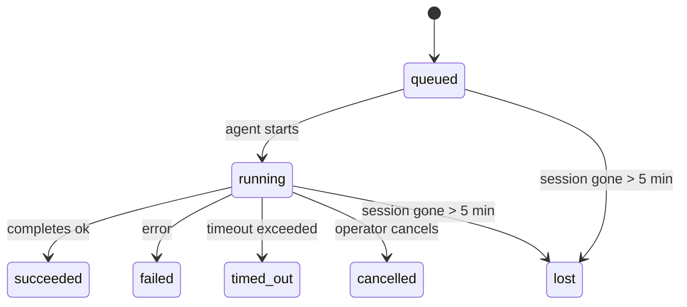

---
read_when:
    - Devam eden veya yakın zamanda tamamlanan arka plan çalışmalarını inceleme
    - Ayrılmış aracı çalıştırmalarında teslimat hatalarını ayıklama
    - Arka plan çalıştırmalarının oturumlar, Cron ve Heartbeat ile nasıl ilişkili olduğunu anlama
sidebarTitle: Background tasks
summary: ACP çalıştırmaları, alt ajanlar, izole Cron işleri ve CLI işlemleri için arka plan görev takibi
title: Arka plan görevleri
x-i18n:
    generated_at: "2026-05-05T06:16:24Z"
    model: gpt-5.5
    provider: openai
    source_hash: bafd959feaf2e220820ec56bf1ef144207d05757418e9971ebf427844cf30c46
    source_path: automation/tasks.md
    workflow: 16
---

<Note>
Zamanlama mı arıyorsunuz? Doğru mekanizmayı seçmek için [Otomasyon ve görevler](/tr/automation) sayfasına bakın. Bu sayfa zamanlayıcı değil, arka plan çalışmaları için etkinlik defteridir.
</Note>

Arka plan görevleri, **ana konuşma oturumunuzun dışında** çalışan işleri izler: ACP çalıştırmaları, subagent başlatmaları, yalıtılmış cron işi yürütmeleri ve CLI ile başlatılan işlemler.

Görevler oturumların, cron işlerinin veya heartbeats’in yerini **almaz**; ayrılmış hangi işin ne zaman gerçekleştiğini ve başarılı olup olmadığını kaydeden **etkinlik defteridir**.

<Note>
Her agent çalıştırması bir görev oluşturmaz. Heartbeat dönüşleri ve normal etkileşimli sohbet bunu yapmaz. Tüm cron yürütmeleri, ACP başlatmaları, subagent başlatmaları ve CLI agent komutları yapar.
</Note>

## TL;DR

- Görevler zamanlayıcı değil, **kayıtlardır**; cron ve heartbeat işin _ne zaman_ çalışacağına karar verir, görevler ise _ne olduğunu_ izler.
- ACP, subagent’lar, tüm cron işleri ve CLI işlemleri görev oluşturur. Heartbeat dönüşleri oluşturmaz.
- Her görev `queued → running → terminal` sürecinden geçer (succeeded, failed, timed_out, cancelled veya lost).
- Cron görevleri, cron çalışma zamanı işi hâlâ sahiplenirken canlı kalır; bellek içi çalışma zamanı durumu kaybolduysa görev bakımı, görevi lost olarak işaretlemeden önce dayanıklı cron çalışma geçmişini kontrol eder.
- Tamamlama push odaklıdır: ayrılmış iş bittiğinde doğrudan bildirim gönderebilir veya istekte bulunan oturumu/heartbeat’i uyandırabilir; bu yüzden durum yoklama döngüleri genellikle yanlış biçimdir.
- Yalıtılmış cron çalıştırmaları ve subagent tamamlanmaları, son temizlik defteri kaydından önce alt oturumları için izlenen tarayıcı sekmelerini/süreçlerini en iyi çabayla temizler.
- Yalıtılmış cron teslimi, alt descendant subagent çalışması hâlâ boşalırken eski ara parent yanıtlarını bastırır ve teslimden önce ulaştığında son descendant çıktısını tercih eder.
- Tamamlama bildirimleri doğrudan bir kanala teslim edilir veya bir sonraki heartbeat için kuyruğa alınır.
- `openclaw tasks list` tüm görevleri gösterir; `openclaw tasks audit` sorunları ortaya çıkarır.
- Terminal kayıtları 7 gün tutulur, sonra otomatik olarak budanır.

## Hızlı başlangıç

<Tabs>
  <Tab title="Listele ve filtrele">
    ```bash
    # Tüm görevleri listele (en yeniler önce)
    openclaw tasks list

    # Çalışma zamanı veya duruma göre filtrele
    openclaw tasks list --runtime acp
    openclaw tasks list --status running
    ```

  </Tab>
  <Tab title="İncele">
    ```bash
    # Belirli bir görevin ayrıntılarını göster (ID, çalışma ID'si veya oturum anahtarı ile)
    openclaw tasks show <lookup>
    ```
  </Tab>
  <Tab title="İptal et ve bildir">
    ```bash
    # Çalışan bir görevi iptal et (alt oturumu sonlandırır)
    openclaw tasks cancel <lookup>

    # Bir görevin bildirim politikasını değiştir
    openclaw tasks notify <lookup> state_changes
    ```

  </Tab>
  <Tab title="Denetim ve bakım">
    ```bash
    # Sağlık denetimi çalıştır
    openclaw tasks audit

    # Bakımı önizle veya uygula
    openclaw tasks maintenance
    openclaw tasks maintenance --apply
    ```

  </Tab>
  <Tab title="Görev akışı">
    ```bash
    # TaskFlow durumunu incele
    openclaw tasks flow list
    openclaw tasks flow show <lookup>
    openclaw tasks flow cancel <lookup>
    ```
  </Tab>
</Tabs>

## Neler görev oluşturur

| Kaynak                 | Çalışma zamanı türü | Görev kaydının oluşturulduğu zaman                    | Varsayılan bildirim politikası |
| ---------------------- | ------------ | ------------------------------------------------------ | --------------------- |
| ACP arka plan çalıştırmaları    | `acp`        | Alt ACP oturumu başlatılırken                           | `done_only`           |
| Subagent orkestrasyonu | `subagent`   | `sessions_spawn` aracılığıyla subagent başlatılırken               | `done_only`           |
| Cron işleri (tüm türler)  | `cron`       | Her cron yürütmesi (ana oturum ve yalıtılmış)       | `silent`              |
| CLI işlemleri         | `cli`        | Gateway üzerinden çalışan `openclaw agent` komutları | `silent`              |
| Agent medya işleri       | `cli`        | Oturum destekli `music_generate`/`video_generate` çalıştırmaları  | `silent`              |

<AccordionGroup>
  <Accordion title="Cron ve medya için bildirim varsayılanları">
    Ana oturum cron görevleri varsayılan olarak `silent` bildirim politikasını kullanır; izleme için kayıt oluştururlar ama bildirim üretmezler. Yalıtılmış cron görevleri de varsayılan olarak `silent` kullanır, ancak kendi oturumlarında çalıştıkları için daha görünürdür.

    Oturum destekli `music_generate` ve `video_generate` çalıştırmaları da `silent` bildirim politikasını kullanır. Yine de görev kayıtları oluştururlar, ancak tamamlama özgün agent oturumuna dahili uyandırma olarak geri verilir; böylece agent takip mesajını yazabilir ve biten medyayı kendisi ekleyebilir. Grup/kanal tamamlanmaları normal görünür yanıt politikasını izler, bu yüzden kaynak teslimi gerektirdiğinde agent mesaj aracını kullanır. Tamamlama agent’ı yalnızca araç rotasında mesaj aracı teslim kanıtı üretemezse OpenClaw, medyayı özel bırakmak yerine tamamlama yedeğini doğrudan özgün kanala gönderir.

  </Accordion>
  <Accordion title="Eşzamanlı video_generate güvenlik sınırı">
    Oturum destekli bir `video_generate` görevi hâlâ etkinken araç aynı zamanda güvenlik sınırı gibi davranır: aynı oturumdaki yinelenen `video_generate` çağrıları ikinci bir eşzamanlı üretim başlatmak yerine etkin görev durumunu döndürür. Agent tarafından açık bir ilerleme/durum araması istediğinizde `action: "status"` kullanın.
  </Accordion>
  <Accordion title="Neler görev oluşturmaz">
    - Heartbeat dönüşleri; ana oturum, bkz. [Heartbeat](/tr/gateway/heartbeat)
    - Normal etkileşimli sohbet dönüşleri
    - Doğrudan `/command` yanıtları

  </Accordion>
</AccordionGroup>

## Görev yaşam döngüsü



| Durum      | Ne anlama gelir                                                              |
| ----------- | -------------------------------------------------------------------------- |
| `queued`    | Oluşturuldu, agent’ın başlaması bekleniyor                                    |
| `running`   | Agent dönüşü etkin olarak yürütülüyor                                           |
| `succeeded` | Başarıyla tamamlandı                                                     |
| `failed`    | Bir hatayla tamamlandı                                                    |
| `timed_out` | Yapılandırılmış zaman aşımını aştı                                            |
| `cancelled` | Operatör tarafından `openclaw tasks cancel` ile durduruldu                        |
| `lost`      | Çalışma zamanı, 5 dakikalık ek süreden sonra yetkili dayanak durumunu kaybetti |

Geçişler otomatik olarak gerçekleşir; ilişkili agent çalıştırması bittiğinde görev durumu buna uyacak şekilde güncellenir.

Agent çalıştırmasının tamamlanması, etkin görev kayıtları için yetkilidir. Başarılı bir ayrılmış çalıştırma `succeeded` olarak sonlanır, olağan çalışma hataları `failed` olarak sonlanır ve zaman aşımı veya iptal sonuçları `timed_out` olarak sonlanır. Bir operatör görevi zaten iptal ettiyse veya çalışma zamanı `failed`, `timed_out` ya da `lost` gibi daha güçlü bir terminal durumu zaten kaydettiyse sonraki başarı sinyali bu terminal durumunu düşürmez.

`lost` çalışma zamanı farkındadır:

- ACP görevleri: dayanak ACP alt oturumu meta verileri kayboldu.
- Subagent görevleri: dayanak alt oturumu hedef agent deposundan kayboldu.
- Cron görevleri: cron çalışma zamanı işi artık etkin olarak izlemiyor ve dayanıklı cron çalışma geçmişi o çalışma için terminal sonuç göstermiyor. Çevrimdışı CLI denetimi kendi boş süreç içi cron çalışma zamanı durumunu yetkili kabul etmez.
- CLI görevleri: yalıtılmış alt oturum görevleri alt oturumu kullanır; sohbet destekli CLI görevleri bunun yerine canlı çalışma bağlamını kullanır, bu yüzden kalıcı kanal/grup/doğrudan oturum satırları onları canlı tutmaz. Gateway destekli `openclaw agent` çalıştırmaları da çalışma sonuçlarından sonlanır, bu yüzden tamamlanmış çalıştırmalar süpürücü onları `lost` olarak işaretleyene kadar etkin kalmaz.

## Teslim ve bildirimler

Bir görev terminal duruma ulaştığında OpenClaw sizi bilgilendirir. İki teslim yolu vardır:

**Doğrudan teslim** — görevin bir kanal hedefi varsa (`requesterOrigin`), tamamlama mesajı doğrudan o kanala gider (Telegram, Discord, Slack vb.). Subagent tamamlanmaları için OpenClaw, mümkün olduğunda bağlı thread/konu yönlendirmesini de korur ve doğrudan teslimden vazgeçmeden önce eksik `to` / hesabı, istekte bulunan oturumun saklı rotasından (`lastChannel` / `lastTo` / `lastAccountId`) doldurabilir.

**Oturum kuyruğuna teslim** — doğrudan teslim başarısız olursa veya origin ayarlanmamışsa güncelleme, istekte bulunan oturumda bir sistem olayı olarak kuyruğa alınır ve bir sonraki heartbeat’te görünür.

<Tip>
Görev tamamlanması anında heartbeat uyandırması tetikler; sonucu hızlıca görürsünüz, bir sonraki zamanlanmış heartbeat tikini beklemeniz gerekmez.
</Tip>

Bu, olağan iş akışının push tabanlı olduğu anlamına gelir: ayrılmış işi bir kez başlatın, sonra çalışma zamanının tamamlanınca sizi uyandırmasına veya bilgilendirmesine izin verin. Görev durumunu yalnızca hata ayıklama, müdahale veya açık bir denetim gerektiğinde yoklayın.

### Bildirim politikaları

Her görev hakkında ne kadar bilgi alacağınızı denetleyin:

| Politika                | Teslim edilenler                                                       |
| --------------------- | ----------------------------------------------------------------------- |
| `done_only` (varsayılan) | Yalnızca terminal durum (succeeded, failed vb.) — **varsayılan budur** |
| `state_changes`       | Her durum geçişi ve ilerleme güncellemesi                              |
| `silent`              | Hiçbir şey                                                          |

Bir görev çalışırken politikayı değiştirin:

```bash
openclaw tasks notify <lookup> state_changes
```

## CLI başvurusu

<AccordionGroup>
  <Accordion title="tasks list">
    ```bash
    openclaw tasks list [--runtime <acp|subagent|cron|cli>] [--status <status>] [--json]
    ```

    Çıktı sütunları: Görev ID'si, Tür, Durum, Teslim, Çalışma ID'si, Alt Oturum, Özet.

  </Accordion>
  <Accordion title="tasks show">
    ```bash
    openclaw tasks show <lookup>
    ```

    Arama belirteci görev ID'si, çalışma ID'si veya oturum anahtarı kabul eder. Zamanlama, teslim durumu, hata ve terminal özeti dahil tam kaydı gösterir.

  </Accordion>
  <Accordion title="tasks cancel">
    ```bash
    openclaw tasks cancel <lookup>
    ```

    ACP ve subagent görevleri için bu, alt oturumu sonlandırır. CLI tarafından izlenen görevlerde iptal, görev kayıt defterine kaydedilir (ayrı bir alt çalışma zamanı tanıtıcısı yoktur). Durum `cancelled` değerine geçer ve uygunsa teslim bildirimi gönderilir.

  </Accordion>
  <Accordion title="tasks notify">
    ```bash
    openclaw tasks notify <lookup> <done_only|state_changes|silent>
    ```
  </Accordion>
  <Accordion title="tasks audit">
    ```bash
    openclaw tasks audit [--json]
    ```

    Operasyonel sorunları ortaya çıkarır. Sorunlar algılandığında bulgular `openclaw status` içinde de görünür.

    | Bulgu                     | Önem       | Tetikleyici                                                                                                           |
    | ------------------------- | ---------- | --------------------------------------------------------------------------------------------------------------------- |
    | `stale_queued`            | uyarı      | 10 dakikadan uzun süredir kuyrukta                                                                                    |
    | `stale_running`           | hata       | 30 dakikadan uzun süredir çalışıyor                                                                                   |
    | `lost`                    | uyarı/hata | Çalışma zamanı destekli görev sahipliği kayboldu; tutulan kayıp görevler `cleanupAfter` zamanına kadar uyarı verir, sonra hataya dönüşür |
    | `delivery_failed`         | uyarı      | Teslim başarısız oldu ve bildirim ilkesi `silent` değil                                                               |
    | `missing_cleanup`         | uyarı      | Temizleme zaman damgası olmayan terminal görev                                                                        |
    | `inconsistent_timestamps` | uyarı      | Zaman çizelgesi ihlali (örneğin başlamadan önce sona ermiş)                                                           |

  </Accordion>
  <Accordion title="tasks maintenance">
    ```bash
    openclaw tasks maintenance [--json]
    openclaw tasks maintenance --apply [--json]
    ```

    Bunu görevler ve Görev Akışı durumu için mutabakatı, temizleme damgalamayı ve budamayı önizlemek veya uygulamak için kullanın.

    Mutabakat çalışma zamanı farkındadır:

    - ACP/alt ajan görevleri, onları destekleyen alt oturumu denetler.
    - Alt oturumunda yeniden başlatma-kurtarma mezar taşı olan alt ajan görevleri, kurtarılabilir destek oturumları olarak ele alınmak yerine kayıp olarak işaretlenir.
    - Cron görevleri, cron çalışma zamanının işi hâlâ sahiplenip sahiplenmediğini denetler, ardından `lost` durumuna düşmeden önce terminal durumunu kalıcı cron çalıştırma günlüklerinden/iş durumundan kurtarır. Bellekteki cron etkin-iş kümesi için yalnızca Gateway süreci yetkilidir; çevrimdışı CLI denetimi kalıcı geçmişi kullanır ancak yalnızca bu yerel Set boş olduğu için bir cron görevini kayıp olarak işaretlemez.
    - Sohbet destekli CLI görevleri, yalnızca sohbet oturumu satırını değil, sahip olan canlı çalıştırma bağlamını denetler.

    Tamamlama temizliği de çalışma zamanı farkındadır:

    - Alt ajan tamamlaması, duyuru temizliği devam etmeden önce alt oturum için izlenen tarayıcı sekmelerini/süreçlerini en iyi çabayla kapatır.
    - Yalıtılmış cron tamamlaması, çalıştırma tamamen sonlandırılmadan önce cron oturumu için izlenen tarayıcı sekmelerini/süreçlerini en iyi çabayla kapatır.
    - Yalıtılmış cron teslimi, gerektiğinde alt ajan takip işleminin bitmesini bekler ve bunu duyurmak yerine eski üst onay metnini bastırır.
    - Alt ajan tamamlama teslimi en son görünür asistan metnini tercih eder; bu boşsa temizlenmiş en son araç/toolResult metnine geri döner ve yalnızca zaman aşımına uğramış araç çağrısı çalıştırmaları kısa bir kısmi ilerleme özetine indirgenebilir. Terminal başarısız çalıştırmalar, yakalanan yanıt metnini yeniden oynatmadan hata durumunu duyurur.
    - Temizleme hataları gerçek görev sonucunu maskelemez.

  </Accordion>
  <Accordion title="tasks flow list | show | cancel">
    ```bash
    openclaw tasks flow list [--status <status>] [--json]
    openclaw tasks flow show <lookup> [--json]
    openclaw tasks flow cancel <lookup>
    ```

    Tek bir arka plan görev kaydı yerine düzenleyici Görev Akışı ile ilgilendiğinizde bunları kullanın.

  </Accordion>
</AccordionGroup>

## Sohbet görev panosu (`/tasks`)

Bu oturuma bağlı arka plan görevlerini görmek için herhangi bir sohbet oturumunda `/tasks` kullanın. Pano, etkin ve yakın zamanda tamamlanmış görevleri çalışma zamanı, durum, zamanlama ve ilerleme veya hata ayrıntısıyla gösterir.

Geçerli oturumda görünür bağlı görev yoksa `/tasks`, başka oturum ayrıntılarını sızdırmadan yine de bir genel bakış alabilmeniz için ajan yerel görev sayılarına geri döner.

Tam operatör defteri için CLI kullanın: `openclaw tasks list`.

## Durum entegrasyonu (görev baskısı)

`openclaw status`, bir bakışta görev özeti içerir:

```
Tasks: 3 queued · 2 running · 1 issues
```

Özet şunları bildirir:

- **etkin** — `queued` + `running` sayısı
- **hatalar** — `failed` + `timed_out` + `lost` sayısı
- **byRuntime** — `acp`, `subagent`, `cron`, `cli` bazında döküm

Hem `/status` hem de `session_status` aracı temizleme farkındalığı olan bir görev anlık görüntüsü kullanır: etkin görevler tercih edilir, eski tamamlanmış satırlar gizlenir ve yakın tarihli hatalar yalnızca etkin iş kalmadığında gösterilir. Bu, durum kartını şu anda önemli olan şeye odaklı tutar.

## Depolama ve bakım

### Görevlerin bulunduğu yer

Görev kayıtları SQLite içinde şurada kalıcı olur:

```
$OPENCLAW_STATE_DIR/tasks/runs.sqlite
```

Kayıt defteri Gateway başlangıcında belleğe yüklenir ve yeniden başlatmalar arasında dayanıklılık için yazımları SQLite ile eşitler.
Gateway, SQLite'ın varsayılan otomatik kontrol noktası eşiğini ve periyodik/kapanış `TRUNCATE` kontrol noktalarını kullanarak SQLite write-ahead log boyutunu sınırlı tutar.

### Otomatik bakım

Bir süpürücü her **60 saniyede** çalışır ve dört şeyi ele alır:

<Steps>
  <Step title="Mutabakat">
    Etkin görevlerin hâlâ yetkili çalışma zamanı desteğine sahip olup olmadığını denetler. ACP/alt ajan görevleri alt oturum durumunu, cron görevleri etkin-iş sahipliğini ve sohbet destekli CLI görevleri sahip olan çalıştırma bağlamını kullanır. Bu destek durumu 5 dakikadan uzun süre yoksa görev `lost` olarak işaretlenir.
  </Step>
  <Step title="ACP oturum onarımı">
    Terminal veya sahipsiz üst sahipli tek seferlik ACP oturumlarını kapatır ve eski terminal veya sahipsiz kalıcı ACP oturumlarını yalnızca etkin konuşma bağlaması kalmadığında kapatır.
  </Step>
  <Step title="Temizleme damgalama">
    Terminal görevlerde bir `cleanupAfter` zaman damgası ayarlar (endedAt + 7 gün). Saklama süresi boyunca kayıp görevler denetimde hâlâ uyarı olarak görünür; `cleanupAfter` süresi dolduktan sonra veya temizleme meta verisi eksik olduğunda bunlar hatadır.
  </Step>
  <Step title="Budama">
    `cleanupAfter` tarihini geçmiş kayıtları siler.
  </Step>
</Steps>

<Note>
**Saklama:** terminal görev kayıtları **7 gün** tutulur, ardından otomatik olarak budanır. Yapılandırma gerekmez.
</Note>

## Görevlerin diğer sistemlerle ilişkisi

<AccordionGroup>
  <Accordion title="Görevler ve Görev Akışı">
    [Görev Akışı](/tr/automation/taskflow), arka plan görevlerinin üzerindeki akış düzenleme katmanıdır. Tek bir akış, yönetilen veya yansıtılmış eşitleme modlarını kullanarak ömrü boyunca birden çok görevi koordine edebilir. Tekil görev kayıtlarını incelemek için `openclaw tasks`, düzenleyici akışı incelemek için `openclaw tasks flow` kullanın.

    Ayrıntılar için [Görev Akışı](/tr/automation/taskflow) bölümüne bakın.

  </Accordion>
  <Accordion title="Görevler ve cron">
    Bir cron işi **tanımı** `~/.openclaw/cron/jobs.json` içinde bulunur; çalışma zamanı yürütme durumu onun yanında `~/.openclaw/cron/jobs-state.json` içinde bulunur. **Her** cron yürütmesi bir görev kaydı oluşturur — hem ana oturum hem de yalıtılmış. Ana oturum cron görevleri, bildirim oluşturmadan izlenmeleri için varsayılan olarak `silent` bildirim ilkesini kullanır.

    [Cron İşleri](/tr/automation/cron-jobs) bölümüne bakın.

  </Accordion>
  <Accordion title="Görevler ve Heartbeat">
    Heartbeat çalıştırmaları ana oturum dönüşleridir — görev kaydı oluşturmazlar. Bir görev tamamlandığında, sonucu hızlıca görmeniz için bir heartbeat uyandırması tetikleyebilir.

    [Heartbeat](/tr/gateway/heartbeat) bölümüne bakın.

  </Accordion>
  <Accordion title="Görevler ve oturumlar">
    Bir görev, `childSessionKey` (işin çalıştığı yer) ve `requesterSessionKey` (onu başlatan kişi) değerlerine başvurabilir. Oturumlar konuşma bağlamıdır; görevler bunun üzerinde etkinlik izlemedir.
  </Accordion>
  <Accordion title="Görevler ve ajan çalıştırmaları">
    Bir görevin `runId` değeri, işi yapan ajan çalıştırmasına bağlanır. Ajan yaşam döngüsü olayları (başlangıç, bitiş, hata) görev durumunu otomatik olarak günceller — yaşam döngüsünü elle yönetmeniz gerekmez.
  </Accordion>
</AccordionGroup>

## İlgili

- [Otomasyon ve Görevler](/tr/automation) — tüm otomasyon mekanizmalarına bir bakışta genel görünüm
- [CLI: Görevler](/tr/cli/tasks) — CLI komut başvurusu
- [Heartbeat](/tr/gateway/heartbeat) — periyodik ana oturum dönüşleri
- [Zamanlanmış Görevler](/tr/automation/cron-jobs) — arka plan işini zamanlama
- [Görev Akışı](/tr/automation/taskflow) — görevlerin üzerindeki akış düzenleme
