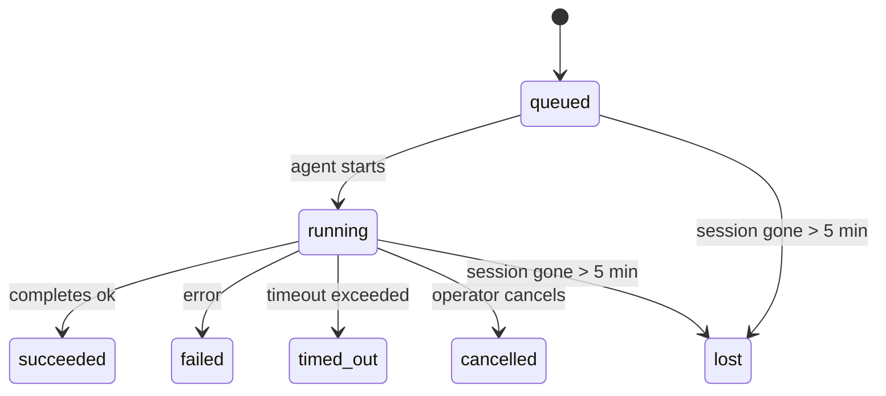

---
read_when:
    - Devam eden veya yakın zamanda tamamlanan arka plan çalışmalarını inceleme
    - Ayrık ajan çalıştırmalarında iletim hatalarını ayıklama
    - Arka plan çalıştırmalarının oturumlar, Cron ve Heartbeat ile nasıl ilişkili olduğunu anlama
sidebarTitle: Background tasks
summary: 'Arka plan görev takibi: ACP çalıştırmaları, alt ajanlar, yalıtılmış Cron işleri ve CLI işlemleri'
title: Arka plan görevleri
x-i18n:
    generated_at: "2026-05-01T08:58:44Z"
    model: gpt-5.5
    provider: openai
    source_hash: 8782987a79989264ae3bd1ca4b16755bdfb7e295e4f77933bf3a38c136d837f4
    source_path: automation/tasks.md
    workflow: 16
---

<Note>
Zamanlama mı arıyorsunuz? Doğru mekanizmayı seçmek için [Otomasyon ve görevler](/tr/automation) sayfasına bakın. Bu sayfa arka plan işi için etkinlik defteridir, zamanlayıcı değildir.
</Note>

Arka plan görevleri, **ana konuşma oturumunuzun dışında** çalışan işleri izler: ACP çalıştırmaları, alt ajan başlatmaları, yalıtılmış cron işi yürütmeleri ve CLI tarafından başlatılan işlemler.

Görevler oturumların, cron işlerinin veya heartbeart'lerin yerini **almaz**; bunlar, hangi ayrılmış işin ne zaman gerçekleştiğini ve başarılı olup olmadığını kaydeden **etkinlik defteridir**.

<Note>
Her ajan çalıştırması bir görev oluşturmaz. Heartbeat turları ve normal etkileşimli sohbet oluşturmaz. Tüm cron yürütmeleri, ACP başlatmaları, alt ajan başlatmaları ve CLI ajan komutları oluşturur.
</Note>

## TL;DR

- Görevler **kayıtlardır**, zamanlayıcı değildir; cron ve Heartbeat işin _ne zaman_ çalışacağını belirler, görevler _ne olduğunu_ izler.
- ACP, alt ajanlar, tüm cron işleri ve CLI işlemleri görev oluşturur. Heartbeat turları oluşturmaz.
- Her görev `queued → running → terminal` durumlarından geçer (succeeded, failed, timed_out, cancelled veya lost).
- Cron görevleri, cron çalışma zamanı hâlâ işe sahip olduğu sürece canlı kalır; bellek içi çalışma zamanı durumu kaybolursa görev bakımı, bir görevi kayıp olarak işaretlemeden önce kalıcı cron çalıştırma geçmişini kontrol eder.
- Tamamlanma push odaklıdır: ayrılmış iş, bittiğinde doğrudan bildirim gönderebilir veya istekte bulunan oturumu/Heartbeat'i uyandırabilir; bu nedenle durum yoklama döngüleri genellikle yanlış biçimdir.
- Yalıtılmış cron çalıştırmaları ve alt ajan tamamlanmaları, son temizlik kayıtlarından önce alt oturumları için izlenen tarayıcı sekmelerini/süreçlerini en iyi çabayla temizler.
- Yalıtılmış cron teslimi, alt alt ajan işi hâlâ boşalırken eski ara üst yanıtları bastırır ve teslimden önce geldiğinde son alt çıktıyı tercih eder.
- Tamamlanma bildirimleri doğrudan bir kanala iletilir veya bir sonraki Heartbeat için kuyruğa alınır.
- `openclaw tasks list` tüm görevleri gösterir; `openclaw tasks audit` sorunları ortaya çıkarır.
- Terminal kayıtları 7 gün tutulur, ardından otomatik olarak budanır.

## Hızlı başlangıç

<Tabs>
  <Tab title="Listele ve filtrele">
    ```bash
    # Tüm görevleri listele (önce en yeni)
    openclaw tasks list

    # Çalışma zamanına veya duruma göre filtrele
    openclaw tasks list --runtime acp
    openclaw tasks list --status running
    ```

  </Tab>
  <Tab title="İncele">
    ```bash
    # Belirli bir görevin ayrıntılarını göster (ID, çalıştırma ID'si veya oturum anahtarına göre)
    openclaw tasks show <lookup>
    ```
  </Tab>
  <Tab title="İptal et ve bildir">
    ```bash
    # Çalışan bir görevi iptal et (alt oturumu sonlandırır)
    openclaw tasks cancel <lookup>

    # Bir görev için bildirim politikasını değiştir
    openclaw tasks notify <lookup> state_changes
    ```

  </Tab>
  <Tab title="Denetim ve bakım">
    ```bash
    # Sağlık denetimi çalıştır
    openclaw tasks audit

    # Bakımı önizle veya uygula
    openclaw tasks maintenance
    openclaw tasks maintenance --apply
    ```

  </Tab>
  <Tab title="Görev akışı">
    ```bash
    # TaskFlow durumunu incele
    openclaw tasks flow list
    openclaw tasks flow show <lookup>
    openclaw tasks flow cancel <lookup>
    ```
  </Tab>
</Tabs>

## Görevi ne oluşturur?

| Kaynak                 | Çalışma zamanı türü | Görev kaydının oluşturulduğu zaman                      | Varsayılan bildirim politikası |
| ---------------------- | ------------------- | ------------------------------------------------------- | ------------------------------ |
| ACP arka plan çalıştırmaları | `acp`        | Alt ACP oturumu başlatıldığında                         | `done_only`                    |
| Alt ajan orkestrasyonu | `subagent`          | `sessions_spawn` ile bir alt ajan başlatıldığında       | `done_only`                    |
| Cron işleri (tüm türler) | `cron`             | Her cron yürütmesi (ana oturum ve yalıtılmış)           | `silent`                       |
| CLI işlemleri          | `cli`               | Gateway üzerinden çalışan `openclaw agent` komutları    | `silent`                       |
| Ajan medya işleri      | `cli`               | Oturum destekli `music_generate`/`video_generate` çalıştırmaları | `silent`              |

<AccordionGroup>
  <Accordion title="Cron ve medya için bildirim varsayılanları">
    Ana oturum cron görevleri varsayılan olarak `silent` bildirim politikasını kullanır; izleme için kayıt oluştururlar ancak bildirim üretmezler. Yalıtılmış cron görevleri de varsayılan olarak `silent` kullanır, ancak kendi oturumlarında çalıştıkları için daha görünürdür.

    Oturum destekli `music_generate` ve `video_generate` çalıştırmaları da `silent` bildirim politikasını kullanır. Yine de görev kayıtları oluştururlar, ancak tamamlanma, ajanın takip mesajını yazıp tamamlanan medyayı kendisi ekleyebilmesi için iç uyandırma olarak özgün ajan oturumuna geri verilir. `tools.media.asyncCompletion.directSend` seçeneğini etkinleştirirseniz, zaman uyumsuz `video_generate` tamamlanmaları önce doğrudan kanal teslimini deneyebilir; zaman uyumsuz `music_generate` tamamlanmaları istekte bulunan oturumun uyandırma yolunda kalır.

  </Accordion>
  <Accordion title="Eşzamanlı video_generate koruma sınırı">
    Oturum destekli bir `video_generate` görevi hâlâ etkinken, araç aynı zamanda bir koruma sınırı gibi davranır: aynı oturumdaki yinelenen `video_generate` çağrıları, ikinci bir eşzamanlı üretim başlatmak yerine etkin görev durumunu döndürür. Ajan tarafında açık bir ilerleme/durum araması istediğinizde `action: "status"` kullanın.
  </Accordion>
  <Accordion title="Neler görev oluşturmaz?">
    - Heartbeat turları; ana oturum, bkz. [Heartbeat](/tr/gateway/heartbeat)
    - Normal etkileşimli sohbet turları
    - Doğrudan `/command` yanıtları

  </Accordion>
</AccordionGroup>

## Görev yaşam döngüsü



| Durum       | Anlamı                                                                     |
| ----------- | -------------------------------------------------------------------------- |
| `queued`    | Oluşturuldu, ajanın başlaması bekleniyor                                   |
| `running`   | Ajan turu etkin olarak yürütülüyor                                         |
| `succeeded` | Başarıyla tamamlandı                                                       |
| `failed`    | Bir hatayla tamamlandı                                                     |
| `timed_out` | Yapılandırılan zaman aşımı aşıldı                                          |
| `cancelled` | Operatör tarafından `openclaw tasks cancel` ile durduruldu                 |
| `lost`      | Çalışma zamanı, 5 dakikalık ek süreden sonra yetkili destek durumunu kaybetti |

Geçişler otomatik olarak gerçekleşir; ilişkili ajan çalıştırması sona erdiğinde görev durumu buna uyacak şekilde güncellenir.

Ajan çalıştırmasının tamamlanması, etkin görev kayıtları için yetkilidir. Başarılı bir ayrılmış çalıştırma `succeeded` olarak sonlanır, olağan çalıştırma hataları `failed` olarak sonlanır ve zaman aşımı veya iptal sonuçları `timed_out` olarak sonlanır. Bir operatör görevi zaten iptal ettiyse veya çalışma zamanı `failed`, `timed_out` ya da `lost` gibi daha güçlü bir terminal durumu zaten kaydettiyse, daha sonraki bir başarı sinyali bu terminal durumunu düşürmez.

`lost` çalışma zamanının farkındadır:

- ACP görevleri: destekleyen ACP alt oturum meta verileri kayboldu.
- Alt ajan görevleri: destekleyen alt oturum hedef ajan deposundan kayboldu.
- Cron görevleri: cron çalışma zamanı artık işi etkin olarak izlemiyor ve kalıcı cron çalıştırma geçmişi o çalıştırma için terminal bir sonuç göstermiyor. Çevrimdışı CLI denetimi, kendi boş süreç içi cron çalışma zamanı durumunu yetkili kabul etmez.
- CLI görevleri: yalıtılmış alt oturum görevleri alt oturumu kullanır; sohbet destekli CLI görevleri bunun yerine canlı çalıştırma bağlamını kullanır, bu nedenle kalan kanal/grup/doğrudan oturum satırları onları canlı tutmaz. Gateway destekli `openclaw agent` çalıştırmaları da çalıştırma sonuçlarından sonlanır, bu nedenle tamamlanmış çalıştırmalar süpürücü onları `lost` olarak işaretleyene kadar etkin kalmaz.

## Teslim ve bildirimler

Bir görev terminal duruma ulaştığında OpenClaw sizi bilgilendirir. İki teslim yolu vardır:

**Doğrudan teslim** — görevin bir kanal hedefi varsa (`requesterOrigin`), tamamlanma mesajı doğrudan o kanala gider (Telegram, Discord, Slack vb.). Alt ajan tamamlanmaları için OpenClaw, varsa bağlı iş parçacığı/konu yönlendirmesini de korur ve doğrudan teslimden vazgeçmeden önce eksik bir `to` / hesabı, istekte bulunan oturumun depolanan rotasından (`lastChannel` / `lastTo` / `lastAccountId`) doldurabilir.

**Oturum kuyruğuna alınan teslim** — doğrudan teslim başarısız olursa veya kaynak ayarlanmamışsa, güncelleme istekte bulunanın oturumunda bir sistem olayı olarak kuyruğa alınır ve bir sonraki Heartbeat'te görünür.

<Tip>
Görev tamamlanması anında bir Heartbeat uyandırması tetikler, böylece sonucu hızlıca görürsünüz; bir sonraki zamanlanmış Heartbeat tikini beklemeniz gerekmez.
</Tip>

Bu, olağan iş akışının push tabanlı olduğu anlamına gelir: ayrılmış işi bir kez başlatın, ardından çalışma zamanının tamamlanma sırasında sizi uyandırmasına veya bilgilendirmesine izin verin. Görev durumunu yalnızca hata ayıklama, müdahale veya açık bir denetim gerektiğinde yoklayın.

### Bildirim politikaları

Her görev hakkında ne kadar duyacağınızı denetleyin:

| Politika              | Teslim edilenler                                                       |
| --------------------- | --------------------------------------------------------------------- |
| `done_only` (varsayılan) | Yalnızca terminal durum (succeeded, failed vb.) — **varsayılan budur** |
| `state_changes`       | Her durum geçişi ve ilerleme güncellemesi                             |
| `silent`              | Hiçbir şey                                                            |

Bir görev çalışırken politikayı değiştirin:

```bash
openclaw tasks notify <lookup> state_changes
```

## CLI başvurusu

<AccordionGroup>
  <Accordion title="tasks list">
    ```bash
    openclaw tasks list [--runtime <acp|subagent|cron|cli>] [--status <status>] [--json]
    ```

    Çıktı sütunları: Görev ID'si, Tür, Durum, Teslim, Çalıştırma ID'si, Alt Oturum, Özet.

  </Accordion>
  <Accordion title="tasks show">
    ```bash
    openclaw tasks show <lookup>
    ```

    Arama belirteci bir görev ID'si, çalıştırma ID'si veya oturum anahtarı kabul eder. Zamanlama, teslim durumu, hata ve terminal özeti dahil tam kaydı gösterir.

  </Accordion>
  <Accordion title="tasks cancel">
    ```bash
    openclaw tasks cancel <lookup>
    ```

    ACP ve alt ajan görevleri için bu, alt oturumu sonlandırır. CLI ile izlenen görevler için iptal, görev kayıt defterine kaydedilir (ayrı bir alt çalışma zamanı tanıtıcısı yoktur). Durum `cancelled` olarak değişir ve uygulanabilir olduğunda bir teslim bildirimi gönderilir.

  </Accordion>
  <Accordion title="tasks notify">
    ```bash
    openclaw tasks notify <lookup> <done_only|state_changes|silent>
    ```
  </Accordion>
  <Accordion title="tasks audit">
    ```bash
    openclaw tasks audit [--json]
    ```

    Operasyonel sorunları ortaya çıkarır. Sorunlar algılandığında bulgular `openclaw status` içinde de görünür.

    | Bulgular                 | Önem     | Tetikleyici                                                                                                   |
    | ------------------------- | -------- | ------------------------------------------------------------------------------------------------------------- |
    | `stale_queued`            | uyarı    | 10 dakikadan uzun süredir kuyrukta                                                                            |
    | `stale_running`           | hata     | 30 dakikadan uzun süredir çalışıyor                                                                           |
    | `lost`                    | uyarı/hata | Çalışma zamanı destekli görev sahipliği kayboldu; tutulan kayıp görevler `cleanupAfter` zamanına kadar uyarı verir, sonra hataya dönüşür |
    | `delivery_failed`         | uyarı    | Teslimat başarısız oldu ve bildirim ilkesi `silent` değil                                                     |
    | `missing_cleanup`         | uyarı    | Temizleme zaman damgası olmayan terminal görev                                                                |
    | `inconsistent_timestamps` | uyarı    | Zaman çizelgesi ihlali (örneğin başlamadan önce bitmiş)                                                       |

  </Accordion>
  <Accordion title="tasks maintenance">
    ```bash
    openclaw tasks maintenance [--json]
    openclaw tasks maintenance --apply [--json]
    ```

    Bunu görevler ve Görev Akışı durumu için uzlaştırma, temizleme damgalama ve budamayı önizlemek veya uygulamak için kullanın.

    Uzlaştırma çalışma zamanının farkındadır:

    - ACP/alt aracı görevleri, bunları destekleyen alt oturumu denetler.
    - Alt oturumu yeniden başlatma-kurtarma mezar taşına sahip olan alt aracı görevleri, kurtarılabilir destek oturumları olarak ele alınmak yerine kayıp olarak işaretlenir.
    - Cron görevleri, cron çalışma zamanının işi hâlâ sahiplenip sahiplenmediğini denetler, ardından `lost` durumuna düşmeden önce kalıcı cron çalıştırma günlüklerinden/iş durumundan terminal durumunu kurtarır. Bellek içi cron etkin iş kümesi için yalnızca Gateway süreci yetkilidir; çevrimdışı CLI denetimi dayanıklı geçmişi kullanır ancak yalnızca bu yerel Set boş olduğu için bir cron görevini kayıp olarak işaretlemez.
    - Sohbet destekli CLI görevleri, yalnızca sohbet oturumu satırını değil, sahip olan canlı çalıştırma bağlamını denetler.

    Tamamlanma temizliği de çalışma zamanının farkındadır:

    - Alt aracı tamamlanması, duyuru temizliği devam etmeden önce alt oturum için izlenen tarayıcı sekmelerini/süreçlerini en iyi çabayla kapatır.
    - Yalıtılmış cron tamamlanması, çalıştırma tamamen kapatılmadan önce cron oturumu için izlenen tarayıcı sekmelerini/süreçlerini en iyi çabayla kapatır.
    - Yalıtılmış cron teslimatı, gerektiğinde alt aracı takip işlemlerini bekler ve duyurmak yerine bayat üst onay metnini bastırır.
    - Alt aracı tamamlanma teslimatı, en son görünür asistan metnini tercih eder; bu boşsa temizlenmiş en son tool/toolResult metnine geri döner ve yalnızca zaman aşımına uğramış araç çağrısı çalıştırmaları kısa bir kısmi ilerleme özetine indirgenebilir. Terminal başarısız çalıştırmalar, yakalanan yanıt metnini yeniden oynatmadan başarısızlık durumunu duyurur.
    - Temizleme hataları gerçek görev sonucunu gizlemez.

  </Accordion>
  <Accordion title="tasks flow list | show | cancel">
    ```bash
    openclaw tasks flow list [--status <status>] [--json]
    openclaw tasks flow show <lookup> [--json]
    openclaw tasks flow cancel <lookup>
    ```

    Tek bir arka plan görev kaydı yerine düzenleyici Görev Akışı ile ilgileniyorsanız bunları kullanın.

  </Accordion>
</AccordionGroup>

## Sohbet görev panosu (`/tasks`)

Bu oturuma bağlı arka plan görevlerini görmek için herhangi bir sohbet oturumunda `/tasks` kullanın. Pano, etkin ve yakın zamanda tamamlanan görevleri çalışma zamanı, durum, zamanlama ve ilerleme ya da hata ayrıntısıyla gösterir.

Geçerli oturumda görünür bağlı görev yoksa, `/tasks` aracı yerel görev sayılarına geri döner; böylece diğer oturum ayrıntılarını sızdırmadan yine de bir genel bakış alırsınız.

Tam operatör defteri için CLI kullanın: `openclaw tasks list`.

## Durum entegrasyonu (görev baskısı)

`openclaw status`, hızlı bakışlık bir görev özeti içerir:

```
Tasks: 3 queued · 2 running · 1 issues
```

Özet şunları bildirir:

- **active** — `queued` + `running` sayısı
- **failures** — `failed` + `timed_out` + `lost` sayısı
- **byRuntime** — `acp`, `subagent`, `cron`, `cli` bazında döküm

Hem `/status` hem de `session_status` aracı temizleme farkındalıklı bir görev anlık görüntüsü kullanır: etkin görevler tercih edilir, bayat tamamlanmış satırlar gizlenir ve son başarısızlıklar yalnızca etkin iş kalmadığında yüzeye çıkar. Bu, durum kartının şu anda önemli olana odaklanmasını sağlar.

## Depolama ve bakım

### Görevler nerede bulunur

Görev kayıtları SQLite içinde kalıcıdır:

```
$OPENCLAW_STATE_DIR/tasks/runs.sqlite
```

Kayıt defteri Gateway başlangıcında belleğe yüklenir ve yeniden başlatmalar arasında dayanıklılık için yazmaları SQLite ile eşitler.
Gateway, SQLite'ın varsayılan otomatik denetim noktası eşiğini ve periyodik ile kapatma zamanı `TRUNCATE` denetim noktalarını kullanarak SQLite write-ahead log'unu sınırlı tutar.

### Otomatik bakım

Bir süpürücü her **60 saniyede** bir çalışır ve dört şeyi ele alır:

<Steps>
  <Step title="Reconciliation">
    Etkin görevlerin hâlâ yetkili çalışma zamanı desteğine sahip olup olmadığını denetler. ACP/alt aracı görevleri alt oturum durumunu, cron görevleri etkin iş sahipliğini ve sohbet destekli CLI görevleri sahip olan çalıştırma bağlamını kullanır. Bu destek durumu 5 dakikadan uzun süre yoksa görev `lost` olarak işaretlenir.
  </Step>
  <Step title="ACP session repair">
    Terminal veya yetim üst sahipli tek kullanımlık ACP oturumlarını kapatır ve bayat terminal ya da yetim kalıcı ACP oturumlarını yalnızca etkin konuşma bağı kalmadığında kapatır.
  </Step>
  <Step title="Cleanup stamping">
    Terminal görevlere bir `cleanupAfter` zaman damgası ayarlar (endedAt + 7 gün). Saklama sırasında kayıp görevler denetimde hâlâ uyarı olarak görünür; `cleanupAfter` süresi dolduktan sonra veya temizleme meta verileri eksik olduğunda hata olurlar.
  </Step>
  <Step title="Pruning">
    `cleanupAfter` tarihini geçmiş kayıtları siler.
  </Step>
</Steps>

<Note>
**Saklama:** terminal görev kayıtları **7 gün** tutulur, ardından otomatik olarak budanır. Yapılandırma gerekmez.
</Note>

## Görevlerin diğer sistemlerle ilişkisi

<AccordionGroup>
  <Accordion title="Tasks and Task Flow">
    [Görev Akışı](/tr/automation/taskflow), arka plan görevlerinin üzerindeki akış düzenleme katmanıdır. Tek bir akış, ömrü boyunca yönetilen veya yansıtılmış eşitleme modlarını kullanarak birden çok görevi koordine edebilir. Tek tek görev kayıtlarını incelemek için `openclaw tasks`, düzenleyici akışı incelemek için `openclaw tasks flow` kullanın.

    Ayrıntılar için bkz. [Görev Akışı](/tr/automation/taskflow).

  </Accordion>
  <Accordion title="Tasks and cron">
    Bir cron işi **tanımı** `~/.openclaw/cron/jobs.json` içinde bulunur; çalışma zamanı yürütme durumu onun yanında `~/.openclaw/cron/jobs-state.json` içinde bulunur. **Her** cron yürütmesi bir görev kaydı oluşturur — hem ana oturum hem de yalıtılmış olanlar. Ana oturum cron görevleri varsayılan olarak `silent` bildirim ilkesini kullanır; böylece bildirim oluşturmadan izlenirler.

    Bkz. [Cron İşleri](/tr/automation/cron-jobs).

  </Accordion>
  <Accordion title="Tasks and heartbeat">
    Heartbeat çalıştırmaları ana oturum turlarıdır — görev kaydı oluşturmazlar. Bir görev tamamlandığında, sonucu hemen görmeniz için bir heartbeat uyandırmasını tetikleyebilir.

    Bkz. [Heartbeat](/tr/gateway/heartbeat).

  </Accordion>
  <Accordion title="Tasks and sessions">
    Bir görev bir `childSessionKey` (işin çalıştığı yer) ve bir `requesterSessionKey` (onu başlatan kişi) başvurusu içerebilir. Oturumlar konuşma bağlamıdır; görevler bunun üzerindeki etkinlik takibidir.
  </Accordion>
  <Accordion title="Tasks and agent runs">
    Bir görevin `runId` değeri, işi yapan aracı çalıştırmasına bağlanır. Aracı yaşam döngüsü olayları (başlama, bitiş, hata) görev durumunu otomatik olarak günceller — yaşam döngüsünü elle yönetmeniz gerekmez.
  </Accordion>
</AccordionGroup>

## İlgili

- [Otomasyon ve Görevler](/tr/automation) — tüm otomasyon mekanizmalarına hızlı bakış
- [CLI: Görevler](/tr/cli/tasks) — CLI komut başvurusu
- [Heartbeat](/tr/gateway/heartbeat) — periyodik ana oturum turları
- [Zamanlanmış Görevler](/tr/automation/cron-jobs) — arka plan işini zamanlama
- [Görev Akışı](/tr/automation/taskflow) — görevlerin üzerindeki akış düzenleme
