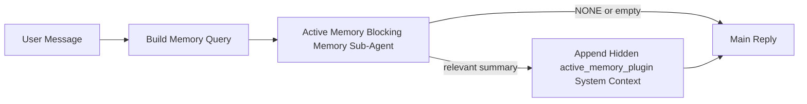

---
read_when:
    - Active Memory'nin ne için olduğunu anlamak istiyorsunuz
    - Bir konuşma aracısı için Active Memory'yi açmak istiyorsunuz
    - Active Memory davranışını her yerde etkinleştirmeden ayarlamak istiyorsunuz
summary: Etkileşimli sohbet oturumlarına ilgili belleği enjekte eden, Plugin sahipliğinde engelleyici bir bellek alt aracısı
title: Active Memory
x-i18n:
    generated_at: "2026-04-12T23:28:02Z"
    model: gpt-5.4
    provider: openai
    source_hash: 11665dbc888b6d4dc667a47624cc1f2e4cc71e1d58e1f7d9b5fe4057ec4da108
    source_path: concepts/active-memory.md
    workflow: 15
---

# Active Memory

Active Memory, uygun konuşma oturumları için ana yanıttan önce çalışan, isteğe bağlı, Plugin sahipliğinde engelleyici bir bellek alt aracısıdır.

Bunun var olma nedeni, çoğu bellek sisteminin yetenekli ama tepkisel olmasıdır. Bellekte ne zaman arama yapılacağına ana aracının karar vermesine ya da kullanıcının "bunu hatırla" veya "bellekte ara" gibi şeyler söylemesine güvenirler. O noktada, belleğin yanıtı doğal hissettireceği an zaten geçmiş olur.

Active Memory, ana yanıt üretilmeden önce sisteme ilgili belleği ortaya çıkarma konusunda sınırlı bir fırsat verir.

## Bunu Aracınıza Yapıştırın

Active Memory'yi bağımsız, güvenli varsayılanlara sahip bir kurulumla etkinleştirmesini istiyorsanız bunu aracınıza yapıştırın:

```json5
{
  plugins: {
    entries: {
      "active-memory": {
        enabled: true,
        config: {
          enabled: true,
          agents: ["main"],
          allowedChatTypes: ["direct"],
          modelFallback: "google/gemini-3-flash",
          queryMode: "recent",
          promptStyle: "balanced",
          timeoutMs: 15000,
          maxSummaryChars: 220,
          persistTranscripts: false,
          logging: true,
        },
      },
    },
  },
}
```

Bu, Plugin'i `main` aracısı için açar, varsayılan olarak onu yalnızca doğrudan mesaj tarzı oturumlarla sınırlar, önce mevcut oturum modelini devralmasına izin verir ve yalnızca açıkça belirtilmiş veya devralınmış bir model yoksa yapılandırılmış yedek modeli kullanır.

Bundan sonra Gateway'i yeniden başlatın:

```bash
openclaw gateway
```

Bunu bir konuşma içinde canlı olarak incelemek için:

```text
/verbose on
/trace on
```

## Active Memory'yi açın

En güvenli kurulum şudur:

1. Plugin'i etkinleştirin
2. tek bir konuşma aracısını hedefleyin
3. ayarlama yaparken günlüğü açık tutun

`openclaw.json` içinde şununla başlayın:

```json5
{
  plugins: {
    entries: {
      "active-memory": {
        enabled: true,
        config: {
          agents: ["main"],
          allowedChatTypes: ["direct"],
          modelFallback: "google/gemini-3-flash",
          queryMode: "recent",
          promptStyle: "balanced",
          timeoutMs: 15000,
          maxSummaryChars: 220,
          persistTranscripts: false,
          logging: true,
        },
      },
    },
  },
}
```

Ardından Gateway'i yeniden başlatın:

```bash
openclaw gateway
```

Bunun anlamı:

- `plugins.entries.active-memory.enabled: true`, Plugin'i açar
- `config.agents: ["main"]`, yalnızca `main` aracısını Active Memory'ye dahil eder
- `config.allowedChatTypes: ["direct"]`, varsayılan olarak Active Memory'yi yalnızca doğrudan mesaj tarzı oturumlarda açık tutar
- `config.model` ayarlanmamışsa, Active Memory önce mevcut oturum modelini devralır
- `config.modelFallback`, geri çağırma için isteğe bağlı olarak kendi yedek sağlayıcı/modelinizi sunar
- `config.promptStyle: "balanced"`, `recent` modu için varsayılan genel amaçlı istem stilini kullanır
- Active Memory yine de yalnızca uygun etkileşimli kalıcı sohbet oturumlarında çalışır

## Nasıl görürsünüz

Active Memory, model için gizli sistem bağlamı enjekte eder. Ham `<active_memory_plugin>...</active_memory_plugin>` etiketlerini istemciye göstermez.

## Oturum geçişi

Yapılandırmayı düzenlemeden mevcut sohbet oturumu için Active Memory'yi duraklatmak veya sürdürmek istediğinizde Plugin komutunu kullanın:

```text
/active-memory status
/active-memory off
/active-memory on
```

Bu, oturum kapsamındadır. Şunu değiştirmez:
`plugins.entries.active-memory.enabled`, aracının hedeflenmesi veya diğer genel
yapılandırmalar.

Komutun yapılandırmaya yazmasını ve tüm oturumlar için Active Memory'yi duraklatmasını veya sürdürmesini istiyorsanız, açık genel biçimi kullanın:

```text
/active-memory status --global
/active-memory off --global
/active-memory on --global
```

Genel biçim `plugins.entries.active-memory.config.enabled` değerini yazar. Daha sonra Active Memory'yi yeniden açmak için komut kullanılabilir kalsın diye `plugins.entries.active-memory.enabled` değerini açık bırakır.

Canlı bir oturumda Active Memory'nin ne yaptığını görmek istiyorsanız, istediğiniz çıktıyla eşleşen oturum geçişlerini açın:

```text
/verbose on
/trace on
```

Bunlar etkinleştirildiğinde OpenClaw şunları gösterebilir:

- `/verbose on` etkin olduğunda `Active Memory: ok 842ms recent 34 chars` gibi bir Active Memory durum satırı
- `/trace on` etkin olduğunda `Active Memory Debug: Lemon pepper wings with blue cheese.` gibi okunabilir bir hata ayıklama özeti

Bu satırlar, gizli sistem bağlamını besleyen aynı Active Memory geçişinden türetilir, ancak ham istem işaretlemesini göstermek yerine insanlar için biçimlendirilir. Telegram gibi kanal istemcilerinin normal yanıttan önce ayrı bir tanılama baloncuğu göstermemesi için bunlar normal yardımcı yanıtından sonra bir takip tanılama mesajı olarak gönderilir.

Varsayılan olarak, engelleyici bellek alt aracısı dökümü geçicidir ve çalışma tamamlandıktan sonra silinir.

Örnek akış:

```text
/verbose on
/trace on
hangi kanatları sipariş etmeliyim?
```

Beklenen görünür yanıt biçimi:

```text
...normal assistant reply...

🧩 Active Memory: ok 842ms recent 34 chars
🔎 Active Memory Debug: Lemon pepper wings with blue cheese.
```

## Ne zaman çalışır

Active Memory iki geçit kullanır:

1. **Yapılandırma ile dahil etme**
   Plugin etkinleştirilmiş olmalı ve geçerli aracı kimliği
   `plugins.entries.active-memory.config.agents` içinde görünmelidir.
2. **Sıkı çalışma zamanı uygunluğu**
   Etkinleştirilmiş ve hedeflenmiş olsa bile Active Memory yalnızca uygun
   etkileşimli kalıcı sohbet oturumlarında çalışır.

Gerçek kural şudur:

```text
plugin enabled
+
agent id targeted
+
allowed chat type
+
eligible interactive persistent chat session
=
active memory runs
```

Bunlardan herhangi biri başarısız olursa Active Memory çalışmaz.

## Oturum türleri

`config.allowedChatTypes`, hangi tür konuşmaların Active Memory'yi
çalıştırabileceğini kontrol eder.

Varsayılan değer şudur:

```json5
allowedChatTypes: ["direct"]
```

Bu, Active Memory'nin varsayılan olarak doğrudan mesaj tarzı oturumlarda çalıştığı, ancak açıkça dahil etmediğiniz sürece grup veya kanal oturumlarında çalışmadığı anlamına gelir.

Örnekler:

```json5
allowedChatTypes: ["direct"]
```

```json5
allowedChatTypes: ["direct", "group"]
```

```json5
allowedChatTypes: ["direct", "group", "channel"]
```

## Nerede çalışır

Active Memory, platform genelinde bir çıkarım özelliği değil, konuşma zenginleştirme özelliğidir.

| Surface                                                             | Active Memory çalışır mı?                               |
| ------------------------------------------------------------------- | ------------------------------------------------------- |
| Control UI / web chat persistent sessions                           | Evet, Plugin etkinse ve aracı hedeflenmişse             |
| Other interactive channel sessions on the same persistent chat path | Evet, Plugin etkinse ve aracı hedeflenmişse             |
| Headless one-shot runs                                              | Hayır                                                   |
| Heartbeat/background runs                                           | Hayır                                                   |
| Generic internal `agent-command` paths                              | Hayır                                                   |
| Sub-agent/internal helper execution                                 | Hayır                                                   |

## Neden kullanılır

Active Memory'yi şu durumlarda kullanın:

- oturum kalıcı ve kullanıcıya dönük olduğunda
- aracının aranabilecek anlamlı uzun vadeli belleği olduğunda
- süreklilik ve kişiselleştirme, ham istem belirlenimciliğinden daha önemli olduğunda

Özellikle şu durumlarda iyi çalışır:

- kalıcı tercihler
- tekrarlayan alışkanlıklar
- doğal biçimde ortaya çıkması gereken uzun vadeli kullanıcı bağlamı

Şunlar için uygun değildir:

- otomasyon
- iç çalışanlar
- tek seferlik API görevleri
- gizli kişiselleştirmenin şaşırtıcı olacağı yerler

## Nasıl çalışır

Çalışma zamanı şekli şöyledir:



Engelleyici bellek alt aracısı yalnızca şunları kullanabilir:

- `memory_search`
- `memory_get`

Bağlantı zayıfsa `NONE` döndürmelidir.

## Sorgu modları

`config.queryMode`, engelleyici bellek alt aracısının konuşmanın ne kadarını gördüğünü kontrol eder.

## İstem stilleri

`config.promptStyle`, engelleyici bellek alt aracısının
bellek döndürüp döndürmemeye karar verirken ne kadar istekli veya katı olduğunu kontrol eder.

Kullanılabilir stiller:

- `balanced`: `recent` modu için genel amaçlı varsayılan
- `strict`: en az istekli; yakın bağlamdan çok az sızıntı istediğinizde en iyisi
- `contextual`: süreklilik açısından en dost seçenek; konuşma geçmişinin daha önemli olması gerektiğinde en iyisi
- `recall-heavy`: daha yumuşak ama yine de makul eşleşmelerde belleği ortaya çıkarmaya daha isteklidir
- `precision-heavy`: eşleşme bariz değilse agresif şekilde `NONE` tercih eder
- `preference-only`: favoriler, alışkanlıklar, rutinler, zevkler ve tekrarlayan kişisel olgular için optimize edilmiştir

`config.promptStyle` ayarlanmamışsa varsayılan eşleme:

```text
message -> strict
recent -> balanced
full -> contextual
```

`config.promptStyle` değerini açıkça ayarlarsanız bu geçersiz kılma kazanır.

Örnek:

```json5
promptStyle: "preference-only"
```

## Model yedek politikası

`config.model` ayarlanmamışsa Active Memory bir modeli şu sırayla çözümlemeye çalışır:

```text
explicit plugin model
-> current session model
-> agent primary model
-> optional configured fallback model
```

`config.modelFallback`, yapılandırılmış yedek adımı kontrol eder.

İsteğe bağlı özel yedek:

```json5
modelFallback: "google/gemini-3-flash"
```

Açık, devralınmış veya yapılandırılmış bir yedek model çözümlenemezse Active Memory o tur için geri çağırmayı atlar.

`config.modelFallbackPolicy`, yalnızca eski yapılandırmalar için kullanım dışı bırakılmış bir uyumluluk alanı olarak tutulur. Artık çalışma zamanı davranışını değiştirmez.

## Gelişmiş kaçış noktaları

Bu seçenekler bilinçli olarak önerilen kurulumun parçası değildir.

`config.thinking`, engelleyici bellek alt aracısının düşünme düzeyini geçersiz kılabilir:

```json5
thinking: "medium"
```

Varsayılan:

```json5
thinking: "off"
```

Bunu varsayılan olarak etkinleştirmeyin. Active Memory yanıt yolunda çalışır, bu nedenle ek düşünme süresi doğrudan kullanıcının gördüğü gecikmeyi artırır.

`config.promptAppend`, varsayılan Active Memory isteminden sonra ve konuşma bağlamından önce ek operatör talimatları ekler:

```json5
promptAppend: "Prefer stable long-term preferences over one-off events."
```

`config.promptOverride`, varsayılan Active Memory istemini değiştirir. OpenClaw
yine de sonrasında konuşma bağlamını ekler:

```json5
promptOverride: "You are a memory search agent. Return NONE or one compact user fact."
```

Bilerek farklı bir geri çağırma sözleşmesini test etmiyorsanız istem özelleştirmesi önerilmez. Varsayılan istem, ana model için `NONE` veya kompakt kullanıcı olgusu bağlamı döndürecek şekilde ayarlanmıştır.

### `message`

Yalnızca en son kullanıcı mesajı gönderilir.

```text
Latest user message only
```

Bunu şu durumlarda kullanın:

- en hızlı davranışı istiyorsanız
- kalıcı tercihleri geri çağırmaya yönelik en güçlü eğilimi istiyorsanız
- takip turlarının konuşma bağlamına ihtiyacı yoksa

Önerilen zaman aşımı:

- `3000` ile `5000` ms civarında başlayın

### `recent`

En son kullanıcı mesajı ve yakın geçmişten küçük bir konuşma kuyruğu gönderilir.

```text
Recent conversation tail:
user: ...
assistant: ...
user: ...

Latest user message:
...
```

Bunu şu durumlarda kullanın:

- hız ve konuşma temellendirmesi arasında daha iyi bir denge istiyorsanız
- takip soruları çoğu zaman son birkaç tura bağlıysa

Önerilen zaman aşımı:

- `15000` ms civarında başlayın

### `full`

Tam konuşma engelleyici bellek alt aracısına gönderilir.

```text
Full conversation context:
user: ...
assistant: ...
user: ...
...
```

Bunu şu durumlarda kullanın:

- en güçlü geri çağırma kalitesi gecikmeden daha önemliyse
- konuşma, iş parçacığının çok gerisinde önemli kurulumlar içeriyorsa

Önerilen zaman aşımı:

- `message` veya `recent` ile karşılaştırıldığında bunu belirgin biçimde artırın
- iş parçacığı boyutuna bağlı olarak `15000` ms veya daha yüksek bir değerden başlayın

Genel olarak zaman aşımı, bağlam boyutuyla birlikte artmalıdır:

```text
message < recent < full
```

## Döküm kalıcılığı

Active Memory engelleyici bellek alt aracısı çalıştırmaları, engelleyici bellek alt aracısı çağrısı sırasında gerçek bir `session.jsonl` dökümü oluşturur.

Varsayılan olarak bu döküm geçicidir:

- geçici bir dizine yazılır
- yalnızca engelleyici bellek alt aracısı çalıştırması için kullanılır
- çalıştırma biter bitmez hemen silinir

Hata ayıklama veya inceleme için bu engelleyici bellek alt aracısı dökümlerini diskte tutmak istiyorsanız, kalıcılığı açıkça etkinleştirin:

```json5
{
  plugins: {
    entries: {
      "active-memory": {
        enabled: true,
        config: {
          agents: ["main"],
          persistTranscripts: true,
          transcriptDir: "active-memory",
        },
      },
    },
  },
}
```

Etkinleştirildiğinde Active Memory, dökümleri ana kullanıcı konuşması döküm yolunda değil, hedef aracının oturumlar klasörü altındaki ayrı bir dizinde depolar.

Varsayılan düzen kavramsal olarak şöyledir:

```text
agents/<agent>/sessions/active-memory/<blocking-memory-sub-agent-session-id>.jsonl
```

Göreli alt dizini `config.transcriptDir` ile değiştirebilirsiniz.

Bunu dikkatli kullanın:

- engelleyici bellek alt aracısı dökümleri yoğun oturumlarda hızla birikebilir
- `full` sorgu modu çok fazla konuşma bağlamını çoğaltabilir
- bu dökümler gizli istem bağlamı ve geri çağrılan anıları içerir

## Yapılandırma

Tüm Active Memory yapılandırması şu konumda bulunur:

```text
plugins.entries.active-memory
```

En önemli alanlar şunlardır:

| Anahtar                    | Tür                                                                                                  | Anlamı                                                                                                  |
| -------------------------- | ---------------------------------------------------------------------------------------------------- | ------------------------------------------------------------------------------------------------------- |
| `enabled`                  | `boolean`                                                                                            | Plugin'in kendisini etkinleştirir                                                                       |
| `config.agents`            | `string[]`                                                                                           | Active Memory kullanabilecek aracı kimlikleri                                                           |
| `config.model`             | `string`                                                                                             | İsteğe bağlı engelleyici bellek alt aracısı model başvurusu; ayarlanmadığında Active Memory mevcut oturum modelini kullanır |
| `config.queryMode`         | `"message" \| "recent" \| "full"`                                                                    | Engelleyici bellek alt aracısının ne kadar konuşma gördüğünü kontrol eder                               |
| `config.promptStyle`       | `"balanced" \| "strict" \| "contextual" \| "recall-heavy" \| "precision-heavy" \| "preference-only"` | Engelleyici bellek alt aracısının bellek döndürmeye karar verirken ne kadar istekli veya katı olduğunu kontrol eder |
| `config.thinking`          | `"off" \| "minimal" \| "low" \| "medium" \| "high" \| "xhigh" \| "adaptive"`                         | Engelleyici bellek alt aracısı için gelişmiş düşünme geçersiz kılması; hız için varsayılan `off`       |
| `config.promptOverride`    | `string`                                                                                             | Gelişmiş tam istem değiştirme; normal kullanım için önerilmez                                           |
| `config.promptAppend`      | `string`                                                                                             | Varsayılan veya geçersiz kılınmış isteme eklenen gelişmiş ek talimatlar                                 |
| `config.timeoutMs`         | `number`                                                                                             | Engelleyici bellek alt aracısı için kesin zaman aşımı                                                   |
| `config.maxSummaryChars`   | `number`                                                                                             | Active Memory özetinde izin verilen en fazla toplam karakter sayısı                                     |
| `config.logging`           | `boolean`                                                                                            | Ayarlama sırasında Active Memory günlüklerini yayar                                                     |
| `config.persistTranscripts`| `boolean`                                                                                            | Engelleyici bellek alt aracısı dökümlerini geçici dosyaları silmek yerine diskte tutar                 |
| `config.transcriptDir`     | `string`                                                                                             | Aracı oturumlar klasörü altındaki göreli engelleyici bellek alt aracısı döküm dizini                   |

Yararlı ayarlama alanları:

| Anahtar                      | Tür      | Anlamı                                                        |
| ---------------------------- | -------- | ------------------------------------------------------------- |
| `config.maxSummaryChars`     | `number` | Active Memory özetinde izin verilen en fazla toplam karakter sayısı |
| `config.recentUserTurns`     | `number` | `queryMode` `recent` olduğunda dahil edilecek önceki kullanıcı turları |
| `config.recentAssistantTurns`| `number` | `queryMode` `recent` olduğunda dahil edilecek önceki yardımcı turları |
| `config.recentUserChars`     | `number` | Yakın geçmişteki kullanıcı turu başına en fazla karakter      |
| `config.recentAssistantChars`| `number` | Yakın geçmişteki yardımcı turu başına en fazla karakter       |
| `config.cacheTtlMs`          | `number` | Tekrarlanan aynı sorgular için önbellek yeniden kullanımı     |

## Önerilen kurulum

`recent` ile başlayın.

```json5
{
  plugins: {
    entries: {
      "active-memory": {
        enabled: true,
        config: {
          agents: ["main"],
          queryMode: "recent",
          promptStyle: "balanced",
          timeoutMs: 15000,
          maxSummaryChars: 220,
          logging: true,
        },
      },
    },
  },
}
```

Ayarlama yaparken canlı davranışı incelemek istiyorsanız, ayrı bir Active Memory hata ayıklama komutu aramak yerine normal durum satırı için `/verbose on`, active-memory hata ayıklama özeti için ise `/trace on` kullanın. Sohbet kanallarında bu tanılama satırları ana yardımcı yanıtından önce değil sonra gönderilir.

Ardından şunlara geçin:

- daha düşük gecikme istiyorsanız `message`
- ek bağlamın daha yavaş engelleyici bellek alt aracısına değdiğine karar verirseniz `full`

## Hata ayıklama

Active Memory beklediğiniz yerde görünmüyorsa:

1. Plugin'in `plugins.entries.active-memory.enabled` altında etkinleştirildiğini doğrulayın.
2. Geçerli aracı kimliğinin `config.agents` içinde listelendiğini doğrulayın.
3. Etkileşimli kalıcı bir sohbet oturumu üzerinden test yaptığınızı doğrulayın.
4. `config.logging: true` değerini açın ve Gateway günlüklerini izleyin.
5. `openclaw memory status --deep` ile bellek aramanın kendisinin çalıştığını doğrulayın.

Bellek eşleşmeleri gürültülüyse, şunu sıkılaştırın:

- `maxSummaryChars`

Active Memory çok yavaşsa:

- `queryMode` değerini düşürün
- `timeoutMs` değerini düşürün
- yakın geçmiş tur sayısını azaltın
- tur başına karakter sınırlarını azaltın

## Yaygın sorunlar

### Gömme sağlayıcısı beklenmedik şekilde değişti

Active Memory, `agents.defaults.memorySearch` altındaki normal `memory_search` işlem hattını kullanır. Bu, gömme sağlayıcısı kurulumunun yalnızca `memorySearch` kurulumunuz istediğiniz davranış için gömmeler gerektiriyorsa zorunlu olduğu anlamına gelir.

Pratikte:

- `ollama` gibi otomatik algılanmayan bir sağlayıcı istiyorsanız açık sağlayıcı kurulumu **zorunludur**
- ortamınız için otomatik algılama kullanılabilir herhangi bir gömme sağlayıcısını çözemiyorsa açık sağlayıcı kurulumu **zorunludur**
- "önce kullanılabilir olan kazanır" yerine belirlenimci sağlayıcı seçimi istiyorsanız açık sağlayıcı kurulumu **şiddetle önerilir**
- otomatik algılama zaten istediğiniz sağlayıcıyı çözümlüyor ve bu sağlayıcı dağıtımınızda kararlıysa açık sağlayıcı kurulumu genellikle **zorunlu değildir**

`memorySearch.provider` ayarlanmamışsa OpenClaw kullanılabilir ilk gömme sağlayıcısını otomatik algılar.

Bu, gerçek dağıtımlarda kafa karıştırıcı olabilir:

- yeni kullanılabilir bir API anahtarı, bellek aramasının hangi sağlayıcıyı kullandığını değiştirebilir
- bir komut veya tanılama yüzeyi, seçilen sağlayıcının canlı bellek eşitlemesi veya arama önyüklemesi sırasında gerçekten vurduğunuz yoldan farklı görünmesine neden olabilir
- barındırılan sağlayıcılar, yalnızca Active Memory her yanıttan önce geri çağırma aramaları yapmaya başladığında ortaya çıkan kota veya hız sınırı hatalarıyla başarısız olabilir

`memory_search`, herhangi bir gömme sağlayıcısı çözümlenemediğinde tipik olarak gerçekleşen, bozulmuş yalnızca sözcüksel modda çalışabildiğinde Active Memory yine de gömme olmadan çalışabilir.

Bir sağlayıcı zaten seçildikten sonra kota tükenmesi, hız sınırları, ağ/sağlayıcı hataları veya eksik yerel/uzak modeller gibi sağlayıcı çalışma zamanı hatalarında aynı geri dönüşün olacağını varsaymayın.

Pratikte:

- hiçbir gömme sağlayıcısı çözümlenemiyorsa `memory_search` yalnızca sözcüksel getirmeye düşebilir
- bir gömme sağlayıcısı çözümlenip sonra çalışma zamanında başarısız olursa OpenClaw şu anda o istek için sözcüksel bir geri dönüşü garanti etmez
- belirlenimci sağlayıcı seçimine ihtiyacınız varsa `agents.defaults.memorySearch.provider` değerini sabitleyin
- çalışma zamanı hatalarında sağlayıcı devralmasına ihtiyacınız varsa `agents.defaults.memorySearch.fallback` değerini açıkça yapılandırın

Gömme destekli geri çağırmaya, çok kipli indekslemeye veya belirli bir yerel/uzak sağlayıcıya bağımlıysanız otomatik algılamaya güvenmek yerine sağlayıcıyı açıkça sabitleyin.

Yaygın sabitleme örnekleri:

OpenAI:

```json5
{
  agents: {
    defaults: {
      memorySearch: {
        provider: "openai",
        model: "text-embedding-3-small",
      },
    },
  },
}
```

Gemini:

```json5
{
  agents: {
    defaults: {
      memorySearch: {
        provider: "gemini",
        model: "gemini-embedding-001",
      },
    },
  },
}
```

Ollama:

```json5
{
  agents: {
    defaults: {
      memorySearch: {
        provider: "ollama",
        model: "nomic-embed-text",
      },
    },
  },
}
```

Kota tükenmesi gibi çalışma zamanı hatalarında sağlayıcı devralması bekliyorsanız yalnızca bir sağlayıcıyı sabitlemek yeterli değildir. Açık bir geri dönüş de yapılandırın:

```json5
{
  agents: {
    defaults: {
      memorySearch: {
        provider: "openai",
        fallback: "gemini",
      },
    },
  },
}
```

### Sağlayıcı sorunlarını hata ayıklama

Active Memory yavaşsa, boşsa veya sağlayıcıları beklenmedik şekilde değiştiriyor gibi görünüyorsa:

- sorunu yeniden üretirken Gateway günlüklerini izleyin; `active-memory: ... start|done`, `memory sync failed (search-bootstrap)` veya sağlayıcıya özgü gömme hataları gibi satırları arayın
- oturumda Plugin sahipliğindeki Active Memory hata ayıklama özetini ortaya çıkarmak için `/trace on` komutunu açın
- ayrıca her yanıttan sonra normal `🧩 Active Memory: ...` durum satırını da istiyorsanız `/verbose on` komutunu açın
- geçerli bellek arama arka ucunu ve dizin sağlığını incelemek için `openclaw memory status --deep` çalıştırın
- beklediğiniz sağlayıcının çalışma zamanında gerçekten çözümlenebilen sağlayıcı olduğundan emin olmak için `agents.defaults.memorySearch.provider` ve ilgili kimlik doğrulama/yapılandırmayı kontrol edin
- `ollama` kullanıyorsanız, yapılandırılmış gömme modelinin kurulu olduğunu doğrulayın; örneğin `ollama list`

Örnek hata ayıklama döngüsü:

```text
1. Gateway'i başlatın ve günlüklerini izleyin
2. Sohbet oturumunda /trace on komutunu çalıştırın
3. Active Memory'yi tetiklemesi gereken bir mesaj gönderin
4. Sohbette görünen hata ayıklama satırını Gateway günlük satırlarıyla karşılaştırın
5. Sağlayıcı seçimi belirsizse agents.defaults.memorySearch.provider değerini açıkça sabitleyin
```

Örnek:

```json5
{
  agents: {
    defaults: {
      memorySearch: {
        provider: "ollama",
        model: "nomic-embed-text",
      },
    },
  },
}
```

Veya Gemini gömmeleri istiyorsanız:

```json5
{
  agents: {
    defaults: {
      memorySearch: {
        provider: "gemini",
      },
    },
  },
}
```

Sağlayıcıyı değiştirdikten sonra Gateway'i yeniden başlatın ve yeni bir testte
`/trace on` çalıştırın; böylece Active Memory hata ayıklama satırı yeni gömme yolunu yansıtır.

## İlgili sayfalar

- [Memory Search](/tr/concepts/memory-search)
- [Bellek yapılandırması başvurusu](/tr/reference/memory-config)
- [Plugin SDK kurulumu](/tr/plugins/sdk-setup)
