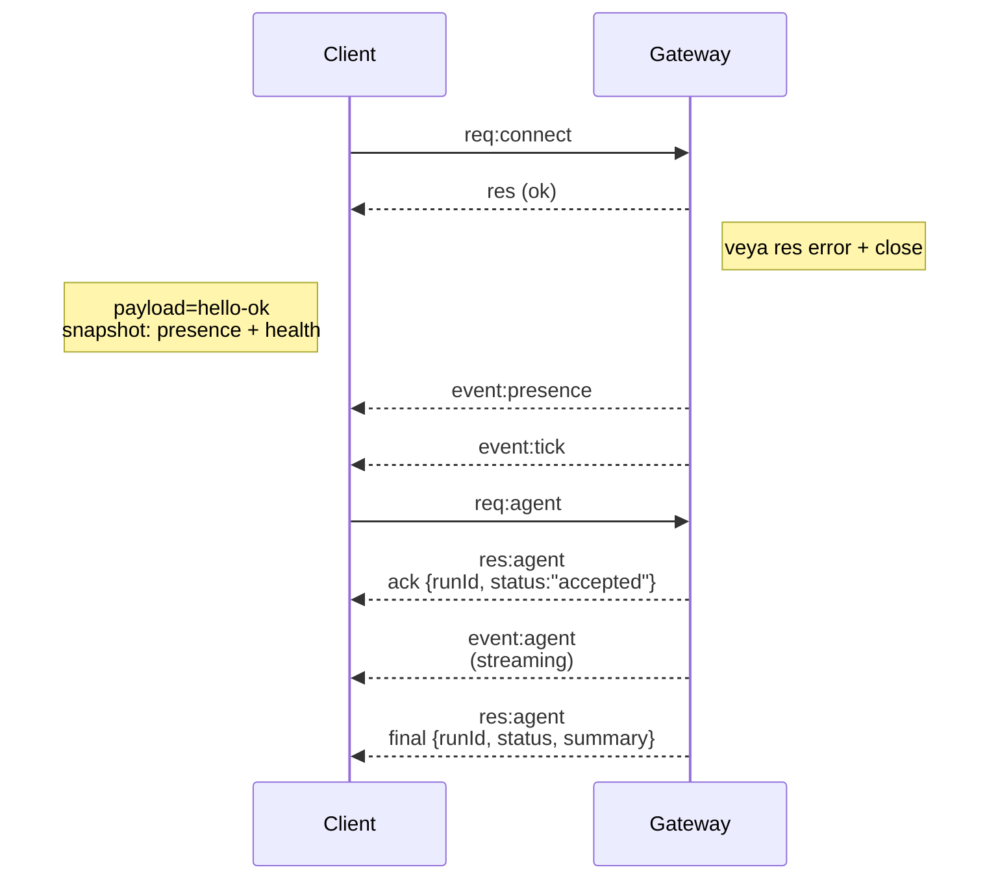

---
read_when:
    - Gateway protokolü, istemciler veya taşıma katmanları üzerinde çalışılıyor
summary: WebSocket Gateway mimarisi, bileşenleri ve istemci akışları
title: Gateway mimarisi
x-i18n:
    generated_at: "2026-04-24T09:04:28Z"
    model: gpt-5.4
    provider: openai
    source_hash: 91c553489da18b6ad83fc860014f5bfb758334e9789cb7893d4d00f81c650f02
    source_path: concepts/architecture.md
    workflow: 15
---

## Genel Bakış

- Tek ve uzun ömürlü bir **Gateway**, tüm mesajlaşma yüzeylerinin sahibidir (Baileys üzerinden WhatsApp, grammY üzerinden Telegram, Slack, Discord, Signal, iMessage, WebChat).
- Control plane istemcileri (macOS uygulaması, CLI, web arayüzü, otomasyonlar), yapılandırılmış bind host üzerinde (varsayılan `127.0.0.1:18789`) **WebSocket** üzerinden Gateway'e bağlanır.
- **Node**'lar (macOS/iOS/Android/başsız) da **WebSocket** üzerinden bağlanır, ancak açık caps/commands ile `role: node` bildirir.
- Her host için bir Gateway; WhatsApp oturumu açan tek yer burasıdır.
- **Canvas host**, Gateway HTTP sunucusu tarafından şu yollar altında sunulur:
  - `/__openclaw__/canvas/` (agent tarafından düzenlenebilir HTML/CSS/JS)
  - `/__openclaw__/a2ui/` (A2UI host)
    Aynı portu Gateway ile paylaşır (varsayılan `18789`).

## Bileşenler ve akışlar

### Gateway (daemon)

- Sağlayıcı bağlantılarını sürdürür.
- Türlenmiş bir WS API'si sunar (istekler, yanıtlar, sunucu push olayları).
- Gelen frame'leri JSON Schema'ya göre doğrular.
- `agent`, `chat`, `presence`, `health`, `heartbeat`, `cron` gibi olaylar yayar.

### İstemciler (mac uygulaması / CLI / web yönetimi)

- İstemci başına bir WS bağlantısı.
- İstek gönderir (`health`, `status`, `send`, `agent`, `system-presence`).
- Olaylara abone olur (`tick`, `agent`, `presence`, `shutdown`).

### Node'lar (macOS / iOS / Android / başsız)

- `role: node` ile **aynı WS sunucusuna** bağlanır.
- `connect` içinde bir cihaz kimliği sağlar; eşleştirme **cihaz tabanlıdır** (`role: node`) ve onay cihaz eşleştirme deposunda tutulur.
- `canvas.*`, `camera.*`, `screen.record`, `location.get` gibi komutları açığa çıkarır.

Protokol ayrıntıları:

- [Gateway protocol](/tr/gateway/protocol)

### WebChat

- Sohbet geçmişi ve gönderimler için Gateway WS API'sini kullanan statik arayüz.
- Uzak kurulumlarda, diğer istemcilerle aynı SSH/Tailscale tüneli üzerinden bağlanır.

## Bağlantı yaşam döngüsü (tek istemci)



## Wire protocol (özet)

- Taşıma: WebSocket, JSON payload'lu metin frame'leri.
- İlk frame **mutlaka** `connect` olmalıdır.
- Handshake'den sonra:
  - İstekler: `{type:"req", id, method, params}` → `{type:"res", id, ok, payload|error}`
  - Olaylar: `{type:"event", event, payload, seq?, stateVersion?}`
- `hello-ok.features.methods` / `events`, keşif meta verileridir; çağrılabilir her helper route'un üretilmiş bir dökümü değildir.
- Paylaşılan gizli anahtar kimlik doğrulaması, yapılandırılmış Gateway auth moduna bağlı olarak `connect.params.auth.token` veya `connect.params.auth.password` kullanır.
- Tailscale Serve gibi kimlik taşıyan modlar (`gateway.auth.allowTailscale: true`) veya local loopback olmayan `gateway.auth.mode: "trusted-proxy"`, kimlik doğrulamayı `connect.params.auth.*` yerine istek başlıklarından karşılar.
- Özel girişte `gateway.auth.mode: "none"`, paylaşılan gizli anahtar kimlik doğrulamasını tamamen devre dışı bırakır; bu modu herkese açık/güvenilmeyen girişlerde kapalı tutun.
- Yan etkili yöntemlerde (`send`, `agent`) güvenli yeniden deneme için idempotency anahtarları gereklidir; sunucu kısa ömürlü bir tekilleştirme önbelleği tutar.
- Node'lar `connect` içinde `role: "node"` ile birlikte caps/commands/permissions da içermelidir.

## Eşleştirme + yerel güven

- Tüm WS istemcileri (operatörler + Node'lar), `connect` içinde bir **cihaz kimliği** içerir.
- Yeni cihaz kimlikleri eşleştirme onayı gerektirir; Gateway sonraki bağlantılar için bir **cihaz token'ı** verir.
- Doğrudan yerel local loopback bağlantıları, aynı host UX'ini sorunsuz tutmak için otomatik onaylanabilir.
- OpenClaw ayrıca güvenilir paylaşılan gizli anahtar helper akışları için dar kapsamlı bir backend/container-local self-connect yoluna sahiptir.
- Aynı host tailnet bind'leri dahil olmak üzere tailnet ve LAN bağlantıları yine de açık eşleştirme onayı gerektirir.
- Tüm bağlantılar `connect.challenge` nonce'unu imzalamalıdır.
- `v3` imza payload'u ayrıca `platform` + `deviceFamily` bağlar; Gateway, eşleştirilmiş meta verileri yeniden bağlantıda sabitler ve meta veri değişikliklerinde onarım eşleştirmesi ister.
- **Yerel olmayan** bağlantılar yine de açık onay gerektirir.
- Gateway auth (`gateway.auth.*`), yerel veya uzak fark etmeksizin **tüm** bağlantılara yine uygulanır.

Ayrıntılar: [Gateway protocol](/tr/gateway/protocol), [Pairing](/tr/channels/pairing),
[Security](/tr/gateway/security).

## Protokol türleme ve kod üretimi

- TypeBox şemaları protokolü tanımlar.
- JSON Schema bu şemalardan üretilir.
- Swift modelleri JSON Schema'dan üretilir.

## Uzak erişim

- Tercih edilen: Tailscale veya VPN.
- Alternatif: SSH tüneli

  ```bash
  ssh -N -L 18789:127.0.0.1:18789 user@host
  ```

- Aynı handshake + auth token tünel üzerinden de geçerlidir.
- Uzak kurulumlarda WS için TLS + isteğe bağlı pinning etkinleştirilebilir.

## Operasyon özeti

- Başlatma: `openclaw gateway` (ön planda, günlükleri stdout'a yazar).
- Sağlık: WS üzerinden `health` (ayrıca `hello-ok` içinde yer alır).
- Denetim: otomatik yeniden başlatma için launchd/systemd.

## Değişmezler

- Her hostta tam olarak bir Gateway, tek bir Baileys oturumunu denetler.
- Handshake zorunludur; JSON olmayan veya `connect` olmayan ilk frame kesin kapatmadır.
- Olaylar yeniden oynatılmaz; istemciler boşluklarda yenileme yapmalıdır.

## İlgili

- [Agent Loop](/tr/concepts/agent-loop) — ayrıntılı agent yürütme döngüsü
- [Gateway Protocol](/tr/gateway/protocol) — WebSocket protokol sözleşmesi
- [Queue](/tr/concepts/queue) — komut kuyruğu ve eşzamanlılık
- [Security](/tr/gateway/security) — güven modeli ve sağlamlaştırma
