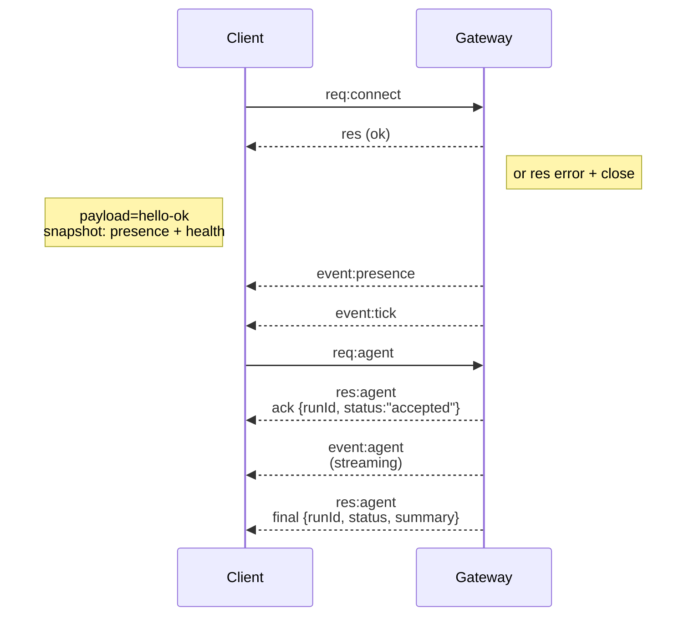

---
read_when:
    - Gateway protokolü, istemcileri veya taşıma katmanları üzerinde çalışma
summary: WebSocket Gateway mimarisi, bileşenleri ve istemci akışları
title: Gateway mimarisi
x-i18n:
    generated_at: "2026-05-06T09:06:59Z"
    model: gpt-5.5
    provider: openai
    source_hash: 433489081bfe07691b211f5076ec45ce0ed3fd043eb86128f73121f2cab71cd3
    source_path: concepts/architecture.md
    workflow: 16
---

## Genel Bakış

- Tek, uzun ömürlü bir **Gateway** tüm mesajlaşma yüzeylerini yönetir (Baileys üzerinden WhatsApp, grammY üzerinden Telegram, Slack, Discord, Signal, iMessage, WebChat).
- Kontrol düzlemi istemcileri (macOS uygulaması, CLI, web UI, otomasyonlar), yapılandırılmış bağlama ana makinesinde (varsayılan `127.0.0.1:18789`) **WebSocket** üzerinden Gateway'e bağlanır.
- **Node'lar** (macOS/iOS/Android/headless) da **WebSocket** üzerinden bağlanır, ancak açık caps/commands ile `role: node` bildirir.
- Her ana makine için bir Gateway; WhatsApp oturumu açan tek yer odur.
- **canvas host**, Gateway HTTP sunucusu tarafından şu yollar altında sunulur:
  - `/__openclaw__/canvas/` (ajan tarafından düzenlenebilir HTML/CSS/JS)
  - `/__openclaw__/a2ui/` (A2UI host)
    Gateway ile aynı bağlantı noktasını kullanır (varsayılan `18789`).

## Bileşenler ve akışlar

### Gateway (daemon)

- Sağlayıcı bağlantılarını sürdürür.
- Türlendirilmiş bir WS API'si sunar (istekler, yanıtlar, sunucu itmeli olaylar).
- Gelen frame'leri JSON Schema'ya göre doğrular.
- `agent`, `chat`, `presence`, `health`, `heartbeat`, `cron` gibi olaylar yayar.

### İstemciler (Mac uygulaması / CLI / web yöneticisi)

- Her istemci için bir WS bağlantısı.
- İstek gönderir (`health`, `status`, `send`, `agent`, `system-presence`).
- Olaylara abone olur (`tick`, `agent`, `presence`, `shutdown`).

### Node'lar (macOS / iOS / Android / headless)

- `role: node` ile **aynı WS sunucusuna** bağlanır.
- `connect` içinde bir cihaz kimliği sağlar; eşleştirme **cihaz tabanlıdır** (rol `node`) ve onay cihaz eşleştirme deposunda yaşar.
- `canvas.*`, `camera.*`, `screen.record`, `location.get` gibi komutlar sunar.

Protokol ayrıntıları:

- [Gateway protokolü](/tr/gateway/protocol)

### WebChat

- Sohbet geçmişi ve gönderimler için Gateway WS API'sini kullanan statik UI.
- Uzak kurulumlarda, diğer istemcilerle aynı SSH/Tailscale tüneli üzerinden bağlanır.

## Bağlantı yaşam döngüsü (tek istemci)



## Kablo protokolü (özet)

- Taşıma: WebSocket, JSON yükleriyle metin frame'leri.
- İlk frame **mutlaka** `connect` olmalıdır.
- El sıkışmadan sonra:
  - İstekler: `{type:"req", id, method, params}` → `{type:"res", id, ok, payload|error}`
  - Olaylar: `{type:"event", event, payload, seq?, stateVersion?}`
- `hello-ok.features.methods` / `events`, keşif metaverileridir; çağrılabilir her yardımcı rotanın üretilmiş dökümü değildir.
- Paylaşılan gizli anahtar kimlik doğrulaması, yapılandırılmış gateway kimlik doğrulama moduna bağlı olarak `connect.params.auth.token` veya `connect.params.auth.password` kullanır.
- Tailscale Serve (`gateway.auth.allowTailscale: true`) veya local loopback olmayan `gateway.auth.mode: "trusted-proxy"` gibi kimlik taşıyan modlar, kimlik doğrulamayı `connect.params.auth.*` yerine istek başlıklarından karşılar.
- Özel giriş `gateway.auth.mode: "none"`, paylaşılan gizli anahtar kimlik doğrulamasını tamamen devre dışı bırakır; bu modu herkese açık/güvenilmeyen girişlerde kapalı tutun.
- Yan etkili yöntemlerde (`send`, `agent`) güvenli yeniden deneme için idempotency anahtarları gereklidir; sunucu kısa ömürlü bir tekilleştirme önbelleği tutar.
- Node'lar `connect` içinde `role: "node"` ile birlikte caps/commands/permissions eklemelidir.

## Eşleştirme + yerel güven

- Tüm WS istemcileri (operatörler + node'lar), `connect` sırasında bir **cihaz kimliği** içerir.
- Yeni cihaz ID'leri eşleştirme onayı gerektirir; Gateway sonraki bağlantılar için bir **cihaz token'ı** verir.
- Doğrudan local loopback bağlantıları, aynı ana makine UX'ini akıcı tutmak için otomatik onaylanabilir.
- OpenClaw ayrıca güvenilir paylaşılan gizli anahtar yardımcı akışları için dar bir backend/container-local kendi kendine bağlanma yoluna sahiptir.
- Aynı ana makine tailnet bağlamaları dahil olmak üzere tailnet ve LAN bağlantıları yine de açık eşleştirme onayı gerektirir.
- Tüm bağlantılar `connect.challenge` nonce'unu imzalamalıdır.
- İmza yükü `v3`, `platform` + `deviceFamily` değerlerini de bağlar; gateway yeniden bağlanmada eşleştirilmiş metaverileri sabitler ve metaveri değişiklikleri için onarım eşleştirmesi gerektirir.
- **Yerel olmayan** bağlantılar yine de açık onay gerektirir.
- Gateway kimlik doğrulaması (`gateway.auth.*`), yerel veya uzak fark etmeksizin **tüm** bağlantılara hâlâ uygulanır.

Ayrıntılar: [Gateway protokolü](/tr/gateway/protocol), [Eşleştirme](/tr/channels/pairing), [Güvenlik](/tr/gateway/security).

## Protokol türlendirmesi ve codegen

- TypeBox şemaları protokolü tanımlar.
- JSON Schema bu şemalardan üretilir.
- Swift modelleri JSON Schema'dan üretilir.

## Uzak erişim

- Tercih edilen: Tailscale veya VPN.
- Alternatif: SSH tüneli

  ```bash
  ssh -N -L 18789:127.0.0.1:18789 user@host
  ```

- Aynı el sıkışma + kimlik doğrulama token'ı tünel üzerinden geçerlidir.
- Uzak kurulumlarda WS için TLS + isteğe bağlı pinning etkinleştirilebilir.

## Operasyon anlık görüntüsü

- Başlatma: `openclaw gateway` (ön planda, günlükler stdout'a).
- Sağlık: WS üzerinden `health` (`hello-ok` içine de dahildir).
- Gözetim: otomatik yeniden başlatma için launchd/systemd.

## Değişmezler

- Tek bir Gateway, her ana makinede tek bir Baileys oturumunu kontrol eder.
- El sıkışma zorunludur; JSON olmayan veya ilk frame'i connect olmayan her bağlantı sert şekilde kapatılır.
- Olaylar yeniden oynatılmaz; istemciler boşluklarda yenileme yapmalıdır.

## İlgili

- [Ajan Döngüsü](/tr/concepts/agent-loop) — ayrıntılı ajan yürütme döngüsü
- [Gateway Protokolü](/tr/gateway/protocol) — WebSocket protokol sözleşmesi
- [Kuyruk](/tr/concepts/queue) — komut kuyruğu ve eşzamanlılık
- [Güvenlik](/tr/gateway/security) — güven modeli ve sağlamlaştırma
