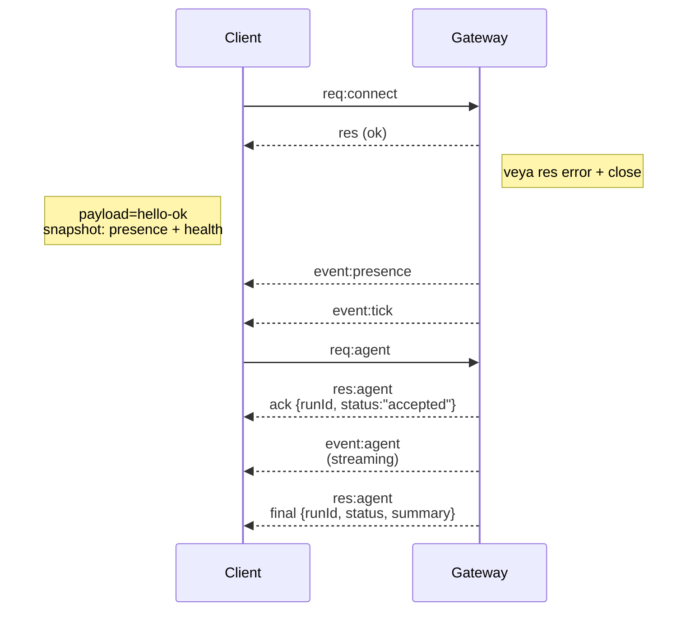

---
read_when:
    - Gateway protokolü, istemciler veya taşımalar üzerinde çalışıyorsunuz
summary: WebSocket gateway mimarisi, bileşenleri ve istemci akışları
title: Gateway Mimarisi
x-i18n:
    generated_at: "2026-04-05T13:50:11Z"
    model: gpt-5.4
    provider: openai
    source_hash: 2b12a2a29e94334c6d10787ac85c34b5b046f9a14f3dd53be453368ca4a7547d
    source_path: concepts/architecture.md
    workflow: 15
---

# Gateway mimarisi

## Genel Bakış

- Tek ve uzun ömürlü bir **Gateway**, tüm mesajlaşma yüzeylerinin sahibidir (Baileys üzerinden WhatsApp, grammY üzerinden Telegram, Slack, Discord, Signal, iMessage, WebChat).
- Kontrol düzlemi istemcileri (macOS uygulaması, CLI, web UI, otomasyonlar), yapılandırılmış bind host üzerinde **WebSocket** aracılığıyla Gateway'e bağlanır (varsayılan: `127.0.0.1:18789`).
- **Node**'lar (macOS/iOS/Android/headless) da **WebSocket** üzerinden bağlanır, ancak açık caps/commands ile `role: node` bildirir.
- Ana makine başına bir Gateway vardır; WhatsApp oturumunu açan tek yer burasıdır.
- **canvas host**, Gateway HTTP sunucusu tarafından şu yollar altında sunulur:
  - `/__openclaw__/canvas/` (aracı tarafından düzenlenebilir HTML/CSS/JS)
  - `/__openclaw__/a2ui/` (A2UI host)
    Gateway ile aynı portu kullanır (varsayılan `18789`).

## Bileşenler ve akışlar

### Gateway (daemon)

- Sağlayıcı bağlantılarını yönetir.
- Türlendirilmiş bir WS API'si sunar (istekler, yanıtlar, sunucudan gönderilen olaylar).
- Gelen çerçeveleri JSON Schema'ya göre doğrular.
- `agent`, `chat`, `presence`, `health`, `heartbeat`, `cron` gibi olaylar yayar.

### İstemciler (mac uygulaması / CLI / web admin)

- İstemci başına bir WS bağlantısı.
- İstek gönderir (`health`, `status`, `send`, `agent`, `system-presence`).
- Olaylara abone olur (`tick`, `agent`, `presence`, `shutdown`).

### Node'lar (macOS / iOS / Android / headless)

- `role: node` ile **aynı WS sunucusuna** bağlanır.
- `connect` içinde bir cihaz kimliği sağlar; eşleştirme **cihaz tabanlıdır** (`node` rolü) ve onay cihaz eşleştirme deposunda tutulur.
- `canvas.*`, `camera.*`, `screen.record`, `location.get` gibi komutları sunar.

Protokol ayrıntıları:

- [Gateway protokolü](/gateway/protocol)

### WebChat

- Sohbet geçmişi ve gönderimler için Gateway WS API'sini kullanan statik UI.
- Uzak kurulumlarda, diğer istemcilerle aynı SSH/Tailscale tüneli üzerinden bağlanır.

## Bağlantı yaşam döngüsü (tek istemci)



## Wire protokolü (özet)

- Taşıma: WebSocket, JSON payload'lu metin çerçeveleri.
- İlk çerçeve **`connect` olmalıdır**.
- Handshake'den sonra:
  - İstekler: `{type:"req", id, method, params}` → `{type:"res", id, ok, payload|error}`
  - Olaylar: `{type:"event", event, payload, seq?, stateVersion?}`
- `hello-ok.features.methods` / `events`, keşif meta verileridir; çağrılabilir tüm yardımcı route'larının oluşturulmuş bir dökümü değildir.
- Paylaşılan gizli anahtar kimlik doğrulaması, yapılandırılmış gateway auth moduna bağlı olarak `connect.params.auth.token` veya `connect.params.auth.password` kullanır.
- Tailscale Serve gibi kimlik taşıyan modlar (`gateway.auth.allowTailscale: true`) veya loopback olmayan `gateway.auth.mode: "trusted-proxy"`, kimlik doğrulamayı `connect.params.auth.*` yerine istek üstbilgilerinden karşılar.
- Özel girişli `gateway.auth.mode: "none"`, paylaşılan gizli anahtar kimlik doğrulamasını tamamen devre dışı bırakır; bu modu herkese açık/güvenilmeyen girişlerde kapalı tutun.
- İdempotency anahtarları, güvenli yeniden denemeler için yan etkili yöntemlerde (`send`, `agent`) zorunludur; sunucu kısa ömürlü bir dedupe önbelleği tutar.
- Node'lar `connect` içinde `role: "node"` ile birlikte caps/commands/permissions eklemelidir.

## Eşleştirme + yerel güven

- Tüm WS istemcileri (operatörler + node'lar), `connect` üzerinde bir **cihaz kimliği** içerir.
- Yeni cihaz kimlikleri eşleştirme onayı gerektirir; Gateway sonraki bağlantılar için bir **cihaz token**'ı verir.
- Doğrudan yerel local loopback bağlantıları, aynı ana makinedeki UX'i sorunsuz tutmak için otomatik onaylanabilir.
- OpenClaw ayrıca güvenilir paylaşılan gizli anahtar yardımcı akışları için dar kapsamlı bir backend/container-local self-connect yoluna da sahiptir.
- Aynı ana makinedeki tailnet bind'ları dahil olmak üzere tailnet ve LAN bağlantıları yine de açık eşleştirme onayı gerektirir.
- Tüm bağlantılar `connect.challenge` nonce değerini imzalamalıdır.
- İmza payload'ı `v3`, ayrıca `platform` + `deviceFamily` bağlar; gateway yeniden bağlantıda eşleştirilmiş meta verileri sabitler ve meta veri değişikliklerinde onarım eşleştirmesi ister.
- **Yerel olmayan** bağlantılar yine de açık onay gerektirir.
- Gateway auth (`gateway.auth.*`), yerel veya uzak tüm bağlantılar için geçerlidir.

Ayrıntılar: [Gateway protokolü](/gateway/protocol), [Eşleştirme](/tr/channels/pairing),
[Güvenlik](/gateway/security).

## Protokol türlendirmesi ve kod üretimi

- TypeBox şemaları protokolü tanımlar.
- JSON Schema bu şemalardan oluşturulur.
- Swift modelleri JSON Schema'dan oluşturulur.

## Uzak erişim

- Tercih edilen: Tailscale veya VPN.
- Alternatif: SSH tüneli

  ```bash
  ssh -N -L 18789:127.0.0.1:18789 user@host
  ```

- Aynı handshake + auth token tünel üzerinden de geçerlidir.
- Uzak kurulumlarda WS için TLS + isteğe bağlı pinning etkinleştirilebilir.

## İşletim anlık görüntüsü

- Başlatma: `openclaw gateway` (ön planda, günlükler stdout'a yazılır).
- Sağlık: WS üzerinden `health` (ayrıca `hello-ok` içine dahildir).
- Denetim: otomatik yeniden başlatma için launchd/systemd.

## Değişmezler

- Her ana makinede tam olarak bir Gateway, tek bir Baileys oturumunu kontrol eder.
- Handshake zorunludur; JSON olmayan veya ilk çerçevesi `connect` olmayan her şey için bağlantı sert şekilde kapatılır.
- Olaylar yeniden oynatılmaz; boşluklarda istemciler yenileme yapmalıdır.

## İlgili

- [Agent Loop](/concepts/agent-loop) — ayrıntılı aracı yürütme döngüsü
- [Gateway Protocol](/gateway/protocol) — WebSocket protokol sözleşmesi
- [Queue](/concepts/queue) — komut kuyruğu ve eşzamanlılık
- [Security](/gateway/security) — güven modeli ve sağlamlaştırma
