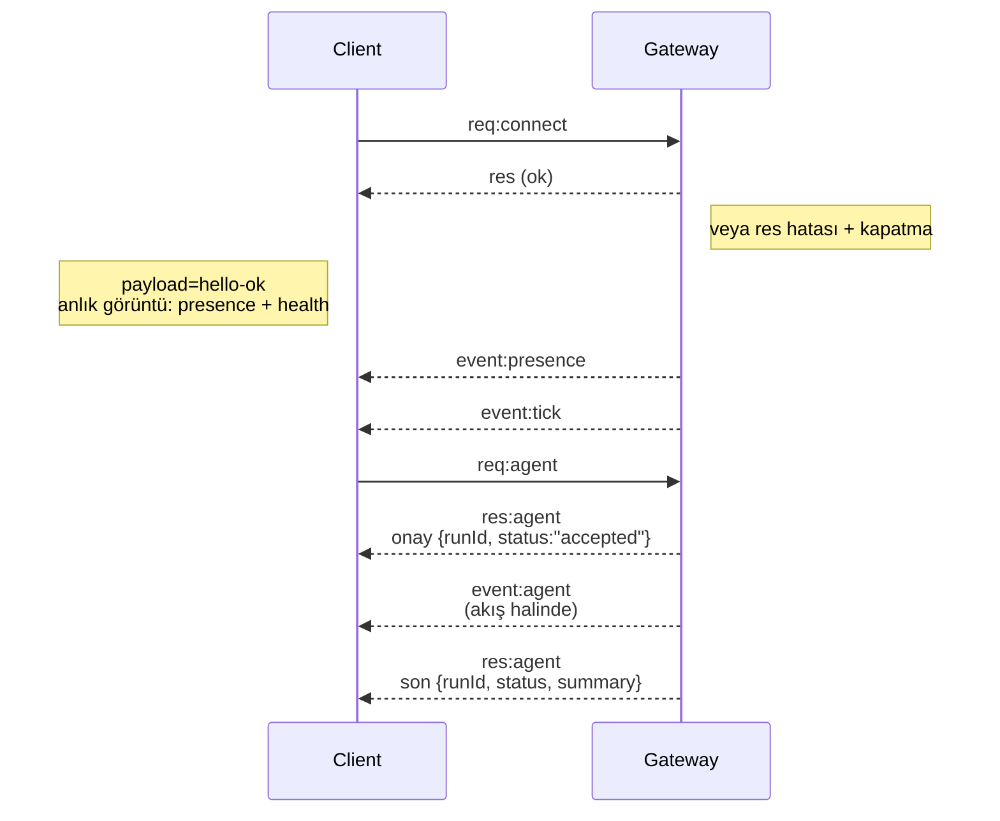

---
read_when:
    - Gateway protokolü, istemciler veya aktarım katmanları üzerinde çalışma
summary: WebSocket Gateway mimarisi, bileşenleri ve istemci akışları
title: Gateway mimarisi
x-i18n:
    generated_at: "2026-07-12T11:37:40Z"
    model: gpt-5.6
    postprocess_version: locale-links-v1
    provider: openai
    source_hash: f8054bd87f738b957c24f8d6965d55365de2293d44902530a9ba778afa597cc7
    source_path: concepts/architecture.md
    workflow: 16
---

## Genel Bakış

- Uzun süre çalışan tek bir **Gateway**, tüm mesajlaşma yüzeylerini yönetir (Baileys üzerinden WhatsApp, grammY üzerinden Telegram, Slack, Discord, Signal, iMessage, WebChat).
- Denetim düzlemi istemcileri (macOS uygulaması, CLI, web kullanıcı arayüzü, otomasyonlar), yapılandırılmış bağlama ana makinesinde (varsayılan `127.0.0.1:18789`) **WebSocket** üzerinden Gateway'e bağlanır.
- **Node'lar** (macOS/iOS/Android/başsız) da **WebSocket** üzerinden bağlanır, ancak açık yetenekler/komutlarla `role: node` bildirir.
- Ana makine başına bir Gateway bulunur; WhatsApp oturumu açan tek bileşen odur.
- **Tuval ana makinesi**, Gateway HTTP sunucusu tarafından şu yollar altında sunulur:
  - `/__openclaw__/canvas/` (aracı tarafından düzenlenebilir HTML/CSS/JS)
  - `/__openclaw__/a2ui/` (A2UI ana makinesi)

  Gateway ile aynı bağlantı noktasını kullanır (varsayılan `18789`).

## Bileşenler ve akışlar

### Gateway (arka plan hizmeti)

- Sağlayıcı bağlantılarını sürdürür.
- Türü belirlenmiş bir WS API'si sunar (istekler, yanıtlar, sunucu tarafından gönderilen olaylar).
- Gelen çerçeveleri JSON Schema'ya göre doğrular.
- `agent`, `chat`, `presence`, `health`, `heartbeat`, `cron` gibi olaylar yayınlar.

### İstemciler (Mac uygulaması / CLI / web yönetimi)

- İstemci başına bir WS bağlantısı.
- İstek gönderir (`health`, `status`, `send`, `agent`, `system-presence`).
- Olaylara abone olur (`tick`, `agent`, `presence`, `shutdown`).

### Node'lar (macOS / iOS / Android / başsız)

- `role: node` ile **aynı WS sunucusuna** bağlanır.
- `connect` içinde bir cihaz kimliği sağlar; eşleştirme **cihaz tabanlıdır** (`node` rolü) ve onay, cihaz eşleştirme deposunda tutulur.
- `canvas.*`, `camera.*`, `screen.record`, `location.get` gibi komutları kullanıma sunar.

Protokol ayrıntıları: [Gateway protokolü](/tr/gateway/protocol)

### WebChat

- Sohbet geçmişi ve gönderimler için Gateway WS API'sini kullanan statik kullanıcı arayüzü.
- Uzak kurulumlarda diğer istemcilerle aynı SSH/Tailscale tüneli üzerinden bağlanır.

## Bağlantı yaşam döngüsü (tek istemci)



## Hat protokolü (özet)

- Aktarım: JSON yüklerine sahip WebSocket metin çerçeveleri.
- İlk çerçeve **mutlaka** `connect` olmalıdır.
- El sıkışmadan sonra:
  - İstekler: `{type:"req", id, method, params}` → `{type:"res", id, ok, payload|error}`
  - Olaylar: `{type:"event", event, payload, seq?, stateVersion?}`
- `hello-ok.features.methods` / `events`, keşif meta verileridir; çağrılabilir her yardımcı rotanın oluşturulmuş bir dökümü değildir.
- Paylaşılan gizli anahtar kimlik doğrulaması, yapılandırılmış Gateway kimlik doğrulama moduna bağlı olarak `connect.params.auth.token` veya `connect.params.auth.password` kullanır.
- Tailscale Serve (`gateway.auth.allowTailscale: true`) veya local loopback dışı `gateway.auth.mode: "trusted-proxy"` gibi kimlik taşıyan modlar, kimlik doğrulamayı `connect.params.auth.*` yerine istek başlıklarından karşılar.
- Özel giriş `gateway.auth.mode: "none"`, paylaşılan gizli anahtar kimlik doğrulamasını tamamen devre dışı bırakır; bu modu herkese açık/güvenilmeyen girişlerde kullanmayın.
- Güvenli yeniden deneme için yan etki oluşturan yöntemlerde (`send`, `agent`) eşgüçlülük anahtarları gereklidir; sunucu kısa ömürlü bir yinelenenleri ayıklama önbelleği tutar.
- Node'lar `connect` içinde `role: "node"` ile birlikte yetenekleri/komutları/izinleri içermelidir.

## Eşleştirme ve yerel güven

- Tüm WS istemcileri (operatörler + Node'lar), `connect` içinde bir **cihaz kimliği** içerir.
- Yeni cihaz kimlikleri eşleştirme onayı gerektirir; Gateway, sonraki bağlantılar için bir **cihaz belirteci** verir.
- Aynı ana makinedeki kullanıcı deneyimini sorunsuz tutmak için doğrudan local loopback bağlantıları otomatik olarak onaylanabilir.
- OpenClaw ayrıca güvenilir, paylaşılan gizli anahtar kullanan yardımcı akışlar için dar kapsamlı bir arka uç/kapsayıcı-yerel öz bağlantı yoluna sahiptir.
- Aynı ana makinedeki tailnet bağlamaları dahil olmak üzere Tailnet ve LAN bağlantıları yine açık eşleştirme onayı gerektirir.
- Tüm bağlantılar `connect.challenge` tek kullanımlık değerini imzalamalıdır. `v3` imza yükü ayrıca `platform` ve `deviceFamily` değerlerini bağlar; Gateway, yeniden bağlantıda eşleştirilmiş meta verileri sabitler ve meta veri değişiklikleri için yeniden eşleştirme gerektirir.
- **Yerel olmayan** bağlantılar yine açık onay gerektirir.
- Gateway kimlik doğrulaması (`gateway.auth.*`), yerel veya uzak **tüm** bağlantılar için geçerliliğini korur.

Ayrıntılar: [Gateway protokolü](/tr/gateway/protocol), [Eşleştirme](/tr/channels/pairing),
[Güvenlik](/tr/gateway/security).

## Protokol türleri ve kod üretimi

- TypeBox şemaları protokolü tanımlar.
- JSON Schema bu şemalardan oluşturulur.
- Swift modelleri JSON Schema'dan oluşturulur.

## Uzaktan erişim

- Tercih edilen: Tailscale veya VPN.
- Alternatif: SSH tüneli

  ```bash
  ssh -N -L 18789:127.0.0.1:18789 user@gateway-host
  ```

- Aynı el sıkışma ve kimlik doğrulama belirteci tünel üzerinden de geçerlidir.
- Uzak kurulumlarda WS için TLS ve isteğe bağlı sabitleme etkinleştirilebilir.

## İşletim anlık görüntüsü

- Başlatma: `openclaw gateway` (ön planda, günlükler standart çıktıya yazılır).
- Sistem durumu: WS üzerinden `health` (`hello-ok` içinde de bulunur).
- Gözetim: otomatik yeniden başlatma için launchd/systemd.

## Değişmezler

- Ana makine başına tam olarak bir Gateway, tek bir Baileys oturumunu denetler.
- El sıkışma zorunludur; JSON olmayan veya ilk çerçevesi `connect` olmayan her bağlantı kesin olarak kapatılır.
- Olaylar yeniden oynatılmaz; istemciler boşluk oluştuğunda yenileme yapmalıdır.

## İlgili

- [Aracı Döngüsü](/tr/concepts/agent-loop) — ayrıntılı aracı yürütme döngüsü
- [Gateway Protokolü](/tr/gateway/protocol) — WebSocket protokol sözleşmesi
- [Kuyruk](/tr/concepts/queue) — komut kuyruğu ve eşzamanlılık
- [Güvenlik](/tr/gateway/security) — güven modeli ve sağlamlaştırma
