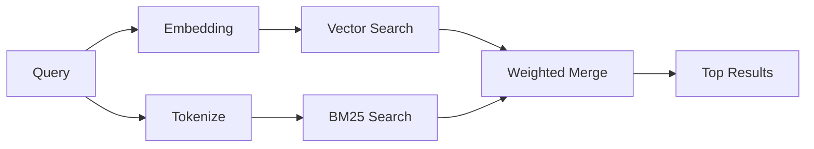

---
read_when:
    - memory_search'in nasıl çalıştığını anlamak istiyorsunuz
    - Bir gömme sağlayıcısı seçmek istiyorsunuz
    - Arama kalitesine ince ayar yapmak istiyorsunuz
summary: Bellek aramasının, gömmeler ve hibrit getirme kullanarak ilgili notları nasıl bulduğu
title: Bellek araması
x-i18n:
    generated_at: "2026-04-30T09:16:32Z"
    model: gpt-5.5
    provider: openai
    source_hash: 3e6c44d90f49a797bda01b9a575928c128a334f89ae14fc3620e65562a866aa9
    source_path: concepts/memory-search.md
    workflow: 16
---

`memory_search`, ifade özgün metinden farklı olsa bile bellek dosyalarınızdan ilgili notları bulur. Bunu belleği küçük parçalara dizinleyerek ve embedding’ler, anahtar sözcükler veya ikisini birden kullanarak arama yaparak gerçekleştirir.

## Hızlı başlangıç

Bir GitHub Copilot aboneliğiniz ya da yapılandırılmış OpenAI, Gemini, Voyage veya Mistral API anahtarınız varsa bellek araması otomatik olarak çalışır. Bir sağlayıcıyı açıkça ayarlamak için:

```json5
{
  agents: {
    defaults: {
      memorySearch: {
        provider: "openai", // or "gemini", "local", "ollama", etc.
      },
    },
  },
}
```

Çok uç noktalı kurulumlar için `provider`, ilgili sağlayıcı `api: "ollama"` veya başka bir embedding bağdaştırıcısı sahibi ayarladığında `ollama-5080` gibi özel bir `models.providers.<id>` girdisi de olabilir.

API anahtarı olmayan yerel embedding’ler için isteğe bağlı `node-llama-cpp` çalışma zamanı paketini OpenClaw yanına kurun ve `provider: "local"` kullanın.

Bazı OpenAI uyumlu embedding uç noktaları, aramalar için `input_type: "query"` ve dizinlenmiş parçalar için `input_type: "document"` veya `"passage"` gibi asimetrik etiketler gerektirir. Bunları `memorySearch.queryInputType` ve `memorySearch.documentInputType` ile yapılandırın; bkz. [Bellek yapılandırma başvurusu](/tr/reference/memory-config#provider-specific-config).

## Desteklenen sağlayıcılar

| Sağlayıcı      | Kimlik          | API anahtarı gerekir | Notlar                                                   |
| -------------- | ---------------- | ------------- | ---------------------------------------------------- |
| Bedrock        | `bedrock`        | Hayır         | AWS kimlik bilgisi zinciri çözümlendiğinde otomatik algılanır |
| Gemini         | `gemini`         | Evet          | Görsel/ses dizinlemeyi destekler                      |
| GitHub Copilot | `github-copilot` | Hayır         | Otomatik algılanır, Copilot aboneliğini kullanır      |
| Yerel          | `local`          | Hayır         | GGUF modeli, ~0,6 GB indirme                          |
| Mistral        | `mistral`        | Evet          | Otomatik algılanır                                    |
| Ollama         | `ollama`         | Hayır         | Yerel, açıkça ayarlanmalıdır                          |
| OpenAI         | `openai`         | Evet          | Otomatik algılanır, hızlı                             |
| Voyage         | `voyage`         | Evet          | Otomatik algılanır                                    |

## Arama nasıl çalışır

OpenClaw iki getirme yolunu paralel olarak çalıştırır ve sonuçları birleştirir:



- **Vektör araması**, benzer anlama sahip notları bulur ("gateway host", "OpenClaw çalıştıran makine" ile eşleşir).
- **BM25 anahtar sözcük araması**, tam eşleşmeleri bulur (kimlikler, hata dizeleri, yapılandırma anahtarları).

Yalnızca bir yol kullanılabiliyorsa (embedding yoksa veya FTS yoksa), diğeri tek başına çalışır.

Embedding’ler kullanılamadığında OpenClaw, yalnızca ham tam eşleşme sıralamasına dönmek yerine FTS sonuçları üzerinde sözcüksel sıralamayı kullanmaya devam eder. Bu düşürülmüş mod, daha güçlü sorgu terimi kapsamına ve ilgili dosya yollarına sahip parçaları öne çıkarır; bu da `sqlite-vec` veya bir embedding sağlayıcısı olmadan bile geri çağırmayı kullanışlı tutar.

## Arama kalitesini iyileştirme

Büyük bir not geçmişiniz olduğunda iki isteğe bağlı özellik yardımcı olur:

### Zamansal azalma

Eski notlar sıralama ağırlığını kademeli olarak kaybeder, böylece güncel bilgiler önce öne çıkar. Varsayılan 30 günlük yarı ömürle, geçen aydan bir not özgün ağırlığının %50’siyle puanlanır. `MEMORY.md` gibi kalıcı dosyalara hiçbir zaman azalma uygulanmaz.

<Tip>
Temsilcinizin aylarca günlük notu varsa ve eskimiş bilgiler güncel bağlamın önüne geçmeye devam ediyorsa zamansal azalmayı etkinleştirin.
</Tip>

### MMR (çeşitlilik)

Yinelenen sonuçları azaltır. Beş notun tamamı aynı yönlendirici yapılandırmasından söz ediyorsa MMR, üst sonuçların tekrar etmek yerine farklı konuları kapsamasını sağlar.

<Tip>
`memory_search` farklı günlük notlardan neredeyse yinelenen parçalar döndürmeye devam ediyorsa MMR’yi etkinleştirin.
</Tip>

### İkisini de etkinleştirme

```json5
{
  agents: {
    defaults: {
      memorySearch: {
        query: {
          hybrid: {
            mmr: { enabled: true },
            temporalDecay: { enabled: true },
          },
        },
      },
    },
  },
}
```

## Çok modlu bellek

Gemini Embedding 2 ile Markdown’ın yanı sıra görselleri ve ses dosyalarını da dizinleyebilirsiniz. Arama sorguları metin olarak kalır, ancak görsel ve ses içeriğiyle eşleşir. Kurulum için [Bellek yapılandırma başvurusu](/tr/reference/memory-config) bölümüne bakın.

## Oturum belleği araması

İsteğe bağlı olarak oturum dökümlerini dizinleyebilir, böylece `memory_search` önceki konuşmaları hatırlayabilir. Bu, `memorySearch.experimental.sessionMemory` üzerinden tercihli olarak etkinleştirilir. Ayrıntılar için [yapılandırma başvurusu](/tr/reference/memory-config) bölümüne bakın.

## Sorun giderme

**Sonuç yok mu?** Dizini kontrol etmek için `openclaw memory status` çalıştırın. Boşsa `openclaw memory index --force` çalıştırın.

**Yalnızca anahtar sözcük eşleşmeleri mi var?** Embedding sağlayıcınız yapılandırılmamış olabilir. `openclaw memory status --deep` ile kontrol edin.

**Yerel embedding’lerde zaman aşımı mı oluyor?** `ollama`, `lmstudio` ve `local` varsayılan olarak daha uzun bir satır içi toplu işlem zaman aşımı kullanır. Konak yalnızca yavaşsa `agents.defaults.memorySearch.sync.embeddingBatchTimeoutSeconds` ayarlayın ve `openclaw memory index --force` komutunu yeniden çalıştırın.

**CJK metni bulunamıyor mu?** FTS dizinini `openclaw memory index --force` ile yeniden oluşturun.

## Ek okuma

- [Active Memory](/tr/concepts/active-memory) -- etkileşimli sohbet oturumları için alt temsilci belleği
- [Bellek](/tr/concepts/memory) -- dosya düzeni, arka uçlar, araçlar
- [Bellek yapılandırma başvurusu](/tr/reference/memory-config) -- tüm yapılandırma düğmeleri

## İlgili

- [Bellek genel bakışı](/tr/concepts/memory)
- [Active Memory](/tr/concepts/active-memory)
- [Yerleşik bellek motoru](/tr/concepts/memory-builtin)
