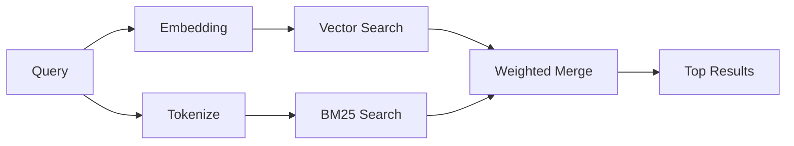

---
read_when:
    - memory_search'in nasıl çalıştığını anlamak istiyorsunuz
    - Bir gömme sağlayıcısı seçmek istiyorsunuz
    - Arama kalitesini ince ayarlamak istiyorsunuz
summary: Bellek aramasının gömlemeler ve hibrit getirim kullanarak ilgili notları nasıl bulduğu
title: Bellek araması
x-i18n:
    generated_at: "2026-04-30T16:27:55Z"
    model: gpt-5.5
    provider: openai
    source_hash: 7f40bbe32453a28070ffc67f19a4c06e2fe59a24237a2aef353f4b9b8260bcf2
    source_path: concepts/memory-search.md
    workflow: 16
---

`memory_search`, ifade özgün metinden farklı olsa bile bellek dosyalarınızdan ilgili notları bulur. Bunu belleği küçük parçalara dizinleyerek ve bunlarda embedding'ler, anahtar sözcükler veya ikisini birden kullanarak arama yaparak gerçekleştirir.

## Hızlı başlangıç

Yapılandırılmış bir GitHub Copilot aboneliğiniz, OpenAI, Gemini, Voyage veya Mistral API anahtarınız varsa bellek araması otomatik olarak çalışır. Bir sağlayıcıyı açıkça ayarlamak için:

```json5
{
  agents: {
    defaults: {
      memorySearch: {
        provider: "openai", // or "gemini", "local", "ollama", etc.
      },
    },
  },
}
```

Çok uç noktalı kurulumlarda `provider`, bu sağlayıcı `api: "ollama"` veya başka bir embedding bağdaştırıcısı sahibi ayarladığında `ollama-5080` gibi özel bir `models.providers.<id>` girdisi de olabilir.

API anahtarı olmadan yerel embedding'ler için `provider: "local"` ayarlayın. Paketlenmiş kurulumlar, yerel `node-llama-cpp` çalışma zamanını OpenClaw'un yönetilen Plugin runtime-deps ağacında tutar; bu ağacın onarılması gerekiyorsa `openclaw doctor --fix` komutunu çalıştırın.

Bazı OpenAI uyumlu embedding uç noktaları, aramalar için `input_type: "query"` ve dizinlenmiş parçalar için `input_type: "document"` veya `"passage"` gibi asimetrik etiketler gerektirir. Bunları `memorySearch.queryInputType` ve `memorySearch.documentInputType` ile yapılandırın; [Bellek yapılandırma referansı](/tr/reference/memory-config#provider-specific-config) bölümüne bakın.

## Desteklenen sağlayıcılar

| Sağlayıcı      | ID               | API anahtarı gerekiyor | Notlar                                               |
| -------------- | ---------------- | ---------------------- | ---------------------------------------------------- |
| Bedrock        | `bedrock`        | Hayır                  | AWS kimlik bilgisi zinciri çözümlendiğinde otomatik algılanır |
| Gemini         | `gemini`         | Evet                   | Görüntü/ses dizinlemeyi destekler                    |
| GitHub Copilot | `github-copilot` | Hayır                  | Otomatik algılanır, Copilot aboneliğini kullanır     |
| Local          | `local`          | Hayır                  | GGUF modeli, ~0,6 GB indirme                         |
| Mistral        | `mistral`        | Evet                   | Otomatik algılanır                                   |
| Ollama         | `ollama`         | Hayır                  | Yerel, açıkça ayarlanmalıdır                         |
| OpenAI         | `openai`         | Evet                   | Otomatik algılanır, hızlı                            |
| Voyage         | `voyage`         | Evet                   | Otomatik algılanır                                   |

## Arama nasıl çalışır?

OpenClaw iki getirme yolunu paralel olarak çalıştırır ve sonuçları birleştirir:



- **Vektör araması**, benzer anlamdaki notları bulur ("gateway host", "OpenClaw çalıştıran makine" ile eşleşir).
- **BM25 anahtar sözcük araması**, tam eşleşmeleri bulur (ID'ler, hata dizeleri, yapılandırma anahtarları).

Yalnızca bir yol kullanılabiliyorsa (embedding yoksa veya FTS yoksa), diğeri tek başına çalışır.

Embedding'ler kullanılamadığında OpenClaw, yalnızca ham tam eşleşme sıralamasına geri dönmek yerine FTS sonuçları üzerinde yine de sözcüksel sıralama kullanır. Bu azaltılmış mod, daha güçlü sorgu terimi kapsamına ve ilgili dosya yollarına sahip parçaları öne çıkarır; bu da `sqlite-vec` veya bir embedding sağlayıcısı olmadan bile hatırlamayı kullanışlı tutar.

## Arama kalitesini iyileştirme

Büyük bir not geçmişiniz olduğunda iki isteğe bağlı özellik yardımcı olur:

### Zamansal azalma

Eski notlar sıralama ağırlığını kademeli olarak kaybeder, böylece güncel bilgiler önce görünür. Varsayılan 30 günlük yarı ömürle, geçen aya ait bir not özgün ağırlığının %50'siyle puanlanır. `MEMORY.md` gibi her zaman geçerli dosyalar hiçbir zaman azaltılmaz.

<Tip>
Ajanınızın aylarca günlük notu varsa ve eski bilgiler güncel bağlamın önüne geçmeye devam ediyorsa zamansal azalmayı etkinleştirin.
</Tip>

### MMR (çeşitlilik)

Yinelenen sonuçları azaltır. Beş notun tümü aynı yönlendirici yapılandırmasından bahsediyorsa MMR, en üst sonuçların tekrar etmek yerine farklı konuları kapsamasını sağlar.

<Tip>
`memory_search` farklı günlük notlardan neredeyse aynı parçacıkları döndürmeye devam ediyorsa MMR'yi etkinleştirin.
</Tip>

### İkisini de etkinleştirme

```json5
{
  agents: {
    defaults: {
      memorySearch: {
        query: {
          hybrid: {
            mmr: { enabled: true },
            temporalDecay: { enabled: true },
          },
        },
      },
    },
  },
}
```

## Çok modlu bellek

Gemini Embedding 2 ile Markdown'ın yanı sıra görüntü ve ses dosyalarını da dizinleyebilirsiniz. Arama sorguları metin olarak kalır, ancak görsel ve ses içeriğiyle eşleşir. Kurulum için [Bellek yapılandırma referansı](/tr/reference/memory-config) bölümüne bakın.

## Oturum belleği araması

`memory_search` daha önceki konuşmaları hatırlayabilsin diye oturum dökümlerini isteğe bağlı olarak dizinleyebilirsiniz. Bu, `memorySearch.experimental.sessionMemory` üzerinden isteğe bağlıdır. Ayrıntılar için [yapılandırma referansı](/tr/reference/memory-config) bölümüne bakın.

## Sorun giderme

**Sonuç yok mu?** Dizini kontrol etmek için `openclaw memory status` komutunu çalıştırın. Boşsa `openclaw memory index --force` komutunu çalıştırın.

**Yalnızca anahtar sözcük eşleşmeleri mi var?** Embedding sağlayıcınız yapılandırılmamış olabilir. `openclaw memory status --deep` komutunu kontrol edin.

**Yerel embedding'ler zaman aşımına mı uğruyor?** `ollama`, `lmstudio` ve `local` varsayılan olarak daha uzun bir satır içi toplu işlem zaman aşımı kullanır. Host yalnızca yavaşsa `agents.defaults.memorySearch.sync.embeddingBatchTimeoutSeconds` değerini ayarlayın ve `openclaw memory index --force` komutunu yeniden çalıştırın.

**CJK metni bulunamıyor mu?** FTS dizinini `openclaw memory index --force` ile yeniden oluşturun.

## Daha fazla okuma

- [Active Memory](/tr/concepts/active-memory) -- etkileşimli sohbet oturumları için alt ajan belleği
- [Bellek](/tr/concepts/memory) -- dosya düzeni, arka uçlar, araçlar
- [Bellek yapılandırma referansı](/tr/reference/memory-config) -- tüm yapılandırma ayarları

## İlgili

- [Bellek genel bakışı](/tr/concepts/memory)
- [Active memory](/tr/concepts/active-memory)
- [Yerleşik bellek motoru](/tr/concepts/memory-builtin)
