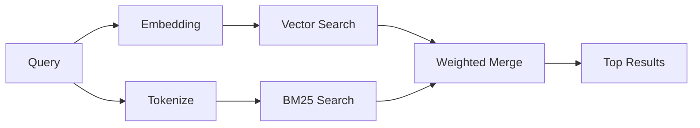

---
read_when:
    - memory_search'ün nasıl çalıştığını anlamak istiyorsunuz
    - Bir embedding sağlayıcısı seçmek istiyorsunuz
    - Arama kalitesini ayarlamak istiyorsunuz
summary: Bellek aramasının ilgili notları gömmeler ve hibrit getirme kullanarak nasıl bulduğu
title: Bellek araması
x-i18n:
    generated_at: "2026-06-28T22:33:49Z"
    model: gpt-5.5
    postprocess_version: locale-links-v1
    provider: openai
    source_hash: 32ffb9d996851566eb92b7812c5425f545ecbb5387a0a445686df35a6c8ae143
    source_path: concepts/memory-search.md
    workflow: 16
---

`memory_search`, ifade özgün metinden farklı olsa bile bellek dosyalarınızdan ilgili notları bulur. Bunu belleği küçük parçalara indeksleyerek ve bunları gömmeler, anahtar sözcükler veya her ikisiyle arayarak yapar.

## Hızlı başlangıç

Bellek araması varsayılan olarak OpenAI gömmelerini kullanır. Başka bir gömme arka ucu kullanmak için açıkça bir sağlayıcı ayarlayın:

```json5
{
  agents: {
    defaults: {
      memorySearch: {
        provider: "openai", // or "gemini", "local", "ollama", "openai-compatible", etc.
      },
    },
  },
}
```

Belleğe özel sağlayıcıları olan çok uç noktalı kurulumlarda, `provider` ayrıca söz konusu sağlayıcı `api: "ollama"` veya başka bir bellek gömme adaptörü sahibi ayarladığında `ollama-5080` gibi özel bir `models.providers.<id>` girdisi olabilir.

API anahtarı gerektirmeyen yerel gömmeler için `@openclaw/llama-cpp-provider` kurun ve `provider: "local"` ayarlayın. Kaynak checkout'ları yine de yerel derleme onayı gerektirebilir: `pnpm approve-builds`, ardından `pnpm rebuild node-llama-cpp`.

Bazı OpenAI uyumlu gömme uç noktaları, aramalar için `input_type: "query"` ve indekslenen parçalar için `input_type: "document"` veya `"passage"` gibi asimetrik etiketler gerektirir. Bunları `memorySearch.queryInputType` ve `memorySearch.documentInputType` ile yapılandırın; [Bellek yapılandırma başvurusu](/tr/reference/memory-config#provider-specific-config) sayfasına bakın.

## Desteklenen sağlayıcılar

| Sağlayıcı         | ID                  | API anahtarı gerekir | Notlar                          |
| ----------------- | ------------------- | -------------------- | ------------------------------- |
| Bedrock           | `bedrock`           | Hayır                | AWS kimlik bilgisi zincirini kullanır |
| DeepInfra         | `deepinfra`         | Evet                 | Varsayılan: `BAAI/bge-m3`       |
| Gemini            | `gemini`            | Evet                 | Görsel/ses indekslemeyi destekler |
| GitHub Copilot    | `github-copilot`    | Hayır                | Copilot aboneliğini kullanır    |
| Local             | `local`             | Hayır                | GGUF modeli, ~0.6 GB indirme    |
| Mistral           | `mistral`           | Evet                 |                                 |
| Ollama            | `ollama`            | Hayır                | Yerel/kendi barındırdığınız     |
| OpenAI            | `openai`            | Evet                 | Varsayılan                      |
| OpenAI-compatible | `openai-compatible` | Genellikle           | Genel `/v1/embeddings`          |
| Voyage            | `voyage`            | Evet                 |                                 |

## Arama nasıl çalışır

OpenClaw iki alma yolunu paralel çalıştırır ve sonuçları birleştirir:



- **Vektör araması**, benzer anlama sahip notları bulur ("gateway host", "OpenClaw çalıştıran makine" ile eşleşir).
- **BM25 anahtar sözcük araması**, tam eşleşmeleri bulur (ID'ler, hata dizeleri, yapılandırma anahtarları).

Yalnızca bir yol kullanılabiliyorsa diğeri tek başına çalışır. Bilerek kullanılan yalnızca FTS modu (`provider: "none"`) ve otomatik/varsayılan sağlayıcı seçimi, gömmeler kullanılamadığında yine de sözcüksel sıralamayı kullanabilir.

Açıkça ayarlanmış yerel olmayan gömme sağlayıcıları farklıdır. `memorySearch.provider` değerini somut bir uzak destekli sağlayıcıya ayarlarsanız ve bu sağlayıcı çalışma zamanında kullanılamazsa, `memory_search` sessizce yalnızca FTS sonuçlarını kullanmak yerine belleği kullanılamaz olarak bildirir. Bu, bozuk yapılandırılmış semantik sağlayıcıyı görünür tutar. Bilerek yalnızca FTS geri çağırma için `provider: "none"` ayarlayın veya semantik sıralamayı geri yüklemek için sağlayıcı/kimlik doğrulama yapılandırmasını düzeltin.

## Arama kalitesini iyileştirme

Büyük bir not geçmişiniz olduğunda iki isteğe bağlı özellik yardımcı olur:

### Zamansal azalma

Eski notlar sıralama ağırlığını kademeli olarak kaybeder, böylece güncel bilgiler önce öne çıkar. Varsayılan 30 günlük yarı ömürle, geçen aydan bir not özgün ağırlığının %50'siyle puanlanır. `MEMORY.md` gibi her zaman geçerli dosyalar asla azaltılmaz.

<Tip>
Ajanınızın aylarca günlük notu varsa ve bayat bilgiler güncel bağlamın önüne geçmeye devam ediyorsa zamansal azalmayı etkinleştirin.
</Tip>

### MMR (çeşitlilik)

Yinelenen sonuçları azaltır. Beş notun tamamı aynı yönlendirici yapılandırmasından bahsediyorsa MMR, en üst sonuçların tekrarlamak yerine farklı konuları kapsamasını sağlar.

<Tip>
`memory_search` farklı günlük notlardan neredeyse yinelenen parçalar döndürmeye devam ediyorsa MMR'yi etkinleştirin.
</Tip>

### İkisini de etkinleştirin

```json5
{
  agents: {
    defaults: {
      memorySearch: {
        query: {
          hybrid: {
            mmr: { enabled: true },
            temporalDecay: { enabled: true },
          },
        },
      },
    },
  },
}
```

## Çok modlu bellek

Gemini Embedding 2 ile Markdown'un yanında görselleri ve ses dosyalarını indeksleyebilirsiniz. Arama sorguları metin olarak kalır, ancak görsel ve ses içerikleriyle eşleşir. Kurulum için [Bellek yapılandırma başvurusu](/tr/reference/memory-config) sayfasına bakın.

## Oturum belleği araması

İsteğe bağlı olarak oturum dökümlerini indeksleyebilirsiniz; böylece `memory_search` önceki konuşmaları hatırlayabilir. Bu, `memorySearch.experimental.sessionMemory` ve `sources: ["sessions"]` üzerinden isteğe bağlıdır; varsayılan kaynak listesi yalnızca bellektir. Deneysel bayrak oturum dökümü indekslemeyi etkinleştirirken, `sources` oturum parçalarının aranıp aranmayacağını denetler.

Oturum isabetleri `tools.sessions.visibility` değerine uyar: varsayılan `tree` ayarı yalnızca geçerli oturumu ve onun başlattığı oturumları açığa çıkarır. Ayrı bir DM oturumundan ilgisiz, aynı ajana ait gateway tarafından gönderilmiş bir oturumu hatırlamak için görünürlüğü bilerek `agent` değerine genişletin.

QMD kullanırken, dökümlerin bir QMD koleksiyonuna dışa aktarılması için `memory.qmd.sessions.enabled: true` değerini de ayarlayın. Ayrıntılar için [yapılandırma başvurusuna](/tr/reference/memory-config) bakın.

## Sorun giderme

**Sonuç yok mu?** İndeksi kontrol etmek için `openclaw memory status` çalıştırın. Boşsa `openclaw memory index --force` çalıştırın.

**Yalnızca anahtar sözcük eşleşmeleri mi var?** Gömme sağlayıcınız yapılandırılmamış olabilir. `openclaw memory status --deep` ile kontrol edin.

**Yerel gömmeler zaman aşımına mı uğruyor?** `ollama`, `lmstudio` ve `local` varsayılan olarak daha uzun bir satır içi toplu iş zaman aşımı kullanır. Ana makine yalnızca yavaşsa `agents.defaults.memorySearch.sync.embeddingBatchTimeoutSeconds` ayarlayın ve `openclaw memory index --force` komutunu yeniden çalıştırın.

**CJK metni bulunamıyor mu?** FTS indeksini `openclaw memory index --force` ile yeniden oluşturun.

## Daha fazla okuma

- [Active Memory](/tr/concepts/active-memory) -- etkileşimli sohbet oturumları için alt ajan belleği
- [Bellek](/tr/concepts/memory) -- dosya düzeni, arka uçlar, araçlar
- [Bellek yapılandırma başvurusu](/tr/reference/memory-config) -- tüm yapılandırma ayarları

## İlgili

- [Belleğe genel bakış](/tr/concepts/memory)
- [Active Memory](/tr/concepts/active-memory)
- [Yerleşik bellek motoru](/tr/concepts/memory-builtin)
