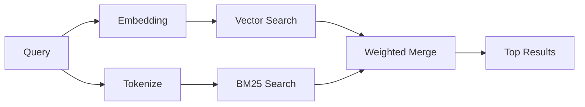

---
read_when:
    - memory_search'in nasıl çalıştığını anlamak istiyorsunuz
    - Bir gömme sağlayıcısı seçmek istiyorsunuz
    - Arama kalitesini ayarlamak istiyorsunuz
summary: Bellek aramasının gömmeler ve hibrit getirme kullanarak ilgili notları nasıl bulduğu
title: Bellek araması
x-i18n:
    generated_at: "2026-05-02T08:52:25Z"
    model: gpt-5.5
    provider: openai
    source_hash: 2a71fb0809d5c70689e8046f854e4b4b4e79f45769ac2964e40a762ebb4e91a8
    source_path: concepts/memory-search.md
    workflow: 16
---

`memory_search`, ifadeler özgün metinden farklı olsa bile bellek dosyalarınızdan ilgili notları bulur. Belleği küçük parçalara dizinleyip bunları embedding'ler, anahtar sözcükler veya ikisiyle birlikte arayarak çalışır.

## Hızlı başlangıç

Yapılandırılmış bir GitHub Copilot aboneliğiniz, OpenAI, Gemini, Voyage veya Mistral API anahtarınız varsa bellek araması otomatik olarak çalışır. Bir sağlayıcıyı açıkça ayarlamak için:

```json5
{
  agents: {
    defaults: {
      memorySearch: {
        provider: "openai", // or "gemini", "local", "ollama", etc.
      },
    },
  },
}
```

Çok uç noktalı kurulumlarda `provider`, ilgili sağlayıcı `api: "ollama"` veya başka bir embedding adaptörü sahibi ayarladığında `ollama-5080` gibi özel bir `models.providers.<id>` girdisi de olabilir.

API anahtarı olmadan yerel embedding'ler için `provider: "local"` ayarlayın. Kaynak checkout'ları yine de yerel derleme onayı gerektirebilir: `pnpm approve-builds`, ardından `pnpm rebuild node-llama-cpp`.

Bazı OpenAI uyumlu embedding uç noktaları, aramalar için `input_type: "query"` ve dizinlenen parçalar için `input_type: "document"` veya `"passage"` gibi asimetrik etiketler gerektirir. Bunları `memorySearch.queryInputType` ve `memorySearch.documentInputType` ile yapılandırın; bkz. [Bellek yapılandırma referansı](/tr/reference/memory-config#provider-specific-config).

## Desteklenen sağlayıcılar

| Sağlayıcı      | ID               | API anahtarı gerekir | Notlar                                               |
| -------------- | ---------------- | -------------------- | ---------------------------------------------------- |
| Bedrock        | `bedrock`        | Hayır                | AWS kimlik bilgisi zinciri çözümlendiğinde otomatik algılanır |
| Gemini         | `gemini`         | Evet                 | Görüntü/ses dizinlemeyi destekler                    |
| GitHub Copilot | `github-copilot` | Hayır                | Otomatik algılanır, Copilot aboneliğini kullanır     |
| Yerel          | `local`          | Hayır                | GGUF modeli, ~0.6 GB indirme                         |
| Mistral        | `mistral`        | Evet                 | Otomatik algılanır                                   |
| Ollama         | `ollama`         | Hayır                | Yerel, açıkça ayarlanmalıdır                         |
| OpenAI         | `openai`         | Evet                 | Otomatik algılanır, hızlı                            |
| Voyage         | `voyage`         | Evet                 | Otomatik algılanır                                   |

## Arama nasıl çalışır

OpenClaw iki geri getirme yolunu paralel olarak çalıştırır ve sonuçları birleştirir:



- **Vektör araması**, benzer anlamdaki notları bulur ("gateway host", "OpenClaw çalıştıran makine" ile eşleşir).
- **BM25 anahtar sözcük araması**, tam eşleşmeleri bulur (ID'ler, hata dizeleri, yapılandırma anahtarları).

Yalnızca bir yol kullanılabiliyorsa (embedding yoksa veya FTS yoksa), diğer yol tek başına çalışır.

Embedding'ler kullanılamadığında OpenClaw, yalnızca ham tam eşleşme sıralamasına geri dönmek yerine FTS sonuçları üzerinde sözcüksel sıralama kullanmaya devam eder. Bu düşürülmüş mod, daha güçlü sorgu terimi kapsamına ve ilgili dosya yollarına sahip parçaları öne çıkarır; bu da `sqlite-vec` veya bir embedding sağlayıcısı olmadan bile hatırlamayı kullanışlı tutar.

## Arama kalitesini iyileştirme

Büyük bir not geçmişiniz olduğunda iki isteğe bağlı özellik yardımcı olur:

### Zamansal azalma

Eski notlar sıralama ağırlığını kademeli olarak kaybeder, böylece güncel bilgiler önce görünür. Varsayılan 30 günlük yarı ömürle, geçen aydan bir not özgün ağırlığının %50'siyle puanlanır. `MEMORY.md` gibi her zaman geçerli dosyalara asla azalma uygulanmaz.

<Tip>
Aracınızda aylarca günlük not varsa ve eski bilgiler güncel bağlamın önüne geçmeyi sürdürüyorsa zamansal azalmayı etkinleştirin.
</Tip>

### MMR (çeşitlilik)

Yinelenen sonuçları azaltır. Beş notun tamamı aynı yönlendirici yapılandırmasından bahsediyorsa MMR, en üst sonuçların tekrarlamak yerine farklı konuları kapsamasını sağlar.

<Tip>
`memory_search` farklı günlük notlardan neredeyse yinelenen parçalar döndürmeyi sürdürüyorsa MMR'yi etkinleştirin.
</Tip>

### İkisini de etkinleştirme

```json5
{
  agents: {
    defaults: {
      memorySearch: {
        query: {
          hybrid: {
            mmr: { enabled: true },
            temporalDecay: { enabled: true },
          },
        },
      },
    },
  },
}
```

## Çok kipli bellek

Gemini Embedding 2 ile görüntü ve ses dosyalarını Markdown ile birlikte dizinleyebilirsiniz. Arama sorguları metin olarak kalır, ancak görsel ve ses içeriğiyle eşleşir. Kurulum için [Bellek yapılandırma referansı](/tr/reference/memory-config) bölümüne bakın.

## Oturum bellek araması

İsteğe bağlı olarak oturum transkriptlerini dizinleyebilirsiniz; böylece `memory_search` önceki konuşmaları hatırlayabilir. Bu, `memorySearch.experimental.sessionMemory` aracılığıyla isteğe bağlıdır. Ayrıntılar için [yapılandırma referansı](/tr/reference/memory-config) bölümüne bakın.

## Sorun giderme

**Sonuç yok mu?** Dizini denetlemek için `openclaw memory status` çalıştırın. Boşsa `openclaw memory index --force` çalıştırın.

**Yalnızca anahtar sözcük eşleşmeleri mi var?** Embedding sağlayıcınız yapılandırılmamış olabilir. `openclaw memory status --deep` ile denetleyin.

**Yerel embedding'ler zaman aşımına mı uğruyor?** `ollama`, `lmstudio` ve `local` varsayılan olarak daha uzun bir satır içi toplu iş zaman aşımı kullanır. Ana makine sadece yavaşsa `agents.defaults.memorySearch.sync.embeddingBatchTimeoutSeconds` ayarlayın ve `openclaw memory index --force` komutunu yeniden çalıştırın.

**CJK metni bulunamıyor mu?** FTS dizinini `openclaw memory index --force` ile yeniden oluşturun.

## Ek okuma

- [Active Memory](/tr/concepts/active-memory) -- etkileşimli sohbet oturumları için alt aracı belleği
- [Bellek](/tr/concepts/memory) -- dosya düzeni, arka uçlar, araçlar
- [Bellek yapılandırma referansı](/tr/reference/memory-config) -- tüm yapılandırma düğmeleri

## İlgili

- [Belleğe genel bakış](/tr/concepts/memory)
- [Active memory](/tr/concepts/active-memory)
- [Yerleşik bellek motoru](/tr/concepts/memory-builtin)
