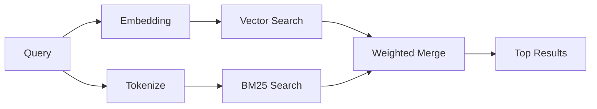

---
read_when:
    - '`memory_search`''ün nasıl çalıştığını anlamak istiyorsunuz.'
    - Bir embedding sağlayıcısı seçmek istiyorsunuz.
    - Arama kalitesini ayarlamak istiyorsunuz.
summary: Bellek araması, embedding'ler ve hibrit erişim kullanarak ilgili notları nasıl bulur?
title: Bellek araması
x-i18n:
    generated_at: "2026-04-26T11:27:27Z"
    model: gpt-5.4
    provider: openai
    source_hash: 95d86fb3efe79aae92f5e3590f1c15fb0d8f3bb3301f8fe9a41f891e290d7a14
    source_path: concepts/memory-search.md
    workflow: 15
---

`memory_search`, bellek dosyalarınızdan ilgili notları bulur; ifadeler özgün metinden farklı olsa bile. Bunu, belleği küçük parçalara indeksleyip bu parçaları embedding'ler, anahtar kelimeler veya her ikisini kullanarak arayarak yapar.

## Hızlı başlangıç

Bir GitHub Copilot aboneliğiniz ya da yapılandırılmış bir OpenAI, Gemini, Voyage veya Mistral API anahtarınız varsa, bellek araması otomatik olarak çalışır. Bir sağlayıcıyı açıkça ayarlamak için:

```json5
{
  agents: {
    defaults: {
      memorySearch: {
        provider: "openai", // veya "gemini", "local", "ollama" vb.
      },
    },
  },
}
```

API anahtarı olmadan yerel embedding'ler için, isteğe bağlı `node-llama-cpp` çalışma zamanı paketini OpenClaw'ın yanına kurun ve `provider: "local"` kullanın.

## Desteklenen sağlayıcılar

| Sağlayıcı       | Kimlik           | API anahtarı gerekir | Notlar                                                  |
| --------------- | ---------------- | -------------------- | ------------------------------------------------------- |
| Bedrock         | `bedrock`        | Hayır                | AWS kimlik bilgisi zinciri çözümlendiğinde otomatik algılanır |
| Gemini          | `gemini`         | Evet                 | Görsel/ses indekslemeyi destekler                       |
| GitHub Copilot  | `github-copilot` | Hayır                | Otomatik algılanır, Copilot aboneliğini kullanır        |
| Local           | `local`          | Hayır                | GGUF model, ~0.6 GB indirme                             |
| Mistral         | `mistral`        | Evet                 | Otomatik algılanır                                      |
| Ollama          | `ollama`         | Hayır                | Yerel, açıkça ayarlanmalıdır                            |
| OpenAI          | `openai`         | Evet                 | Otomatik algılanır, hızlı                               |
| Voyage          | `voyage`         | Evet                 | Otomatik algılanır                                      |

## Arama nasıl çalışır

OpenClaw iki erişim yolunu paralel çalıştırır ve sonuçları birleştirir:



- **Vektör araması**, anlam olarak benzer notları bulur ("gateway host", "OpenClaw'ı çalıştıran makine" ile eşleşir).
- **BM25 anahtar kelime araması**, tam eşleşmeleri bulur (kimlikler, hata dizgeleri, yapılandırma anahtarları).

Yalnızca bir yol kullanılabiliyorsa (embedding yoksa veya FTS yoksa), diğeri tek başına çalışır.

Embedding'ler kullanılamadığında OpenClaw, yalnızca ham tam eşleşme sıralamasına geri dönmek yerine FTS sonuçları üzerinde yine sözlüksel sıralama kullanır. Bu bozulmuş mod, daha güçlü sorgu terimi kapsamına ve ilgili dosya yollarına sahip parçaları öne çıkarır; bu da `sqlite-vec` veya bir embedding sağlayıcısı olmadan bile geri çağırmayı kullanışlı tutar.

## Arama kalitesini iyileştirme

Büyük bir not geçmişiniz olduğunda iki isteğe bağlı özellik yardımcı olur:

### Zamansal azalma

Eski notlar sıralama ağırlığını kademeli olarak kaybeder, böylece son bilgiler önce görünür.
Varsayılan 30 günlük yarı ömürle, geçen aydan bir not özgün ağırlığının %50'siyle puanlanır.
`MEMORY.md` gibi her zaman geçerli dosyalar hiçbir zaman azaltılmaz.

<Tip>
Ajanınızın aylarca günlük notları varsa ve eski bilgiler sürekli olarak güncel bağlamın üstünde çıkıyorsa zamansal azalmayı etkinleştirin.
</Tip>

### MMR (çeşitlilik)

Yinelenen sonuçları azaltır. Beş notun tümü aynı yönlendirici yapılandırmasından söz ediyorsa MMR,
üst sonuçların tekrar etmek yerine farklı konuları kapsamasını sağlar.

<Tip>
`memory_search`, farklı günlük notlardan birbirine çok benzeyen parçaları sürekli döndürüyorsa MMR'ı etkinleştirin.
</Tip>

### İkisini de etkinleştirme

```json5
{
  agents: {
    defaults: {
      memorySearch: {
        query: {
          hybrid: {
            mmr: { enabled: true },
            temporalDecay: { enabled: true },
          },
        },
      },
    },
  },
}
```

## Çok kipli bellek

Gemini Embedding 2 ile görselleri ve ses dosyalarını Markdown ile birlikte indeksleyebilirsiniz.
Arama sorguları metin olarak kalır, ancak görsel ve ses içeriğiyle eşleşir. Kurulum için [Bellek yapılandırma başvurusu](/tr/reference/memory-config) sayfasına bakın.

## Oturum belleği araması

`memory_search`'ün önceki konuşmaları hatırlayabilmesi için oturum dökümlerini isteğe bağlı olarak indeksleyebilirsiniz. Bu,
`memorySearch.experimental.sessionMemory` ile isteğe bağlı olarak etkinleştirilir. Ayrıntılar için
[yapılandırma başvurusu](/tr/reference/memory-config) sayfasına bakın.

## Sorun giderme

**Sonuç yok mu?** İndeksi denetlemek için `openclaw memory status` çalıştırın. Boşsa
`openclaw memory index --force` çalıştırın.

**Yalnızca anahtar kelime eşleşmeleri mi var?** Embedding sağlayıcınız yapılandırılmamış olabilir. `openclaw memory status --deep`
ile denetleyin.

**Yerel embedding'ler zaman aşımına mı uğruyor?** `ollama`, `lmstudio` ve `local` varsayılan olarak daha uzun
satır içi toplu zaman aşımı kullanır. Ana makine yalnızca yavaşsa
`agents.defaults.memorySearch.sync.embeddingBatchTimeoutSeconds` ayarlayın ve `openclaw memory index --force`
komutunu yeniden çalıştırın.

**CJK metni bulunamıyor mu?** FTS indeksini
`openclaw memory index --force` ile yeniden oluşturun.

## Daha fazla okuma

- [Active Memory](/tr/concepts/active-memory) -- etkileşimli sohbet oturumları için alt ajan belleği
- [Bellek](/tr/concepts/memory) -- dosya düzeni, arka uçlar, araçlar
- [Bellek yapılandırma başvurusu](/tr/reference/memory-config) -- tüm yapılandırma seçenekleri

## İlgili

- [Belleğe genel bakış](/tr/concepts/memory)
- [Active Memory](/tr/concepts/active-memory)
- [Yerleşik bellek motoru](/tr/concepts/memory-builtin)
