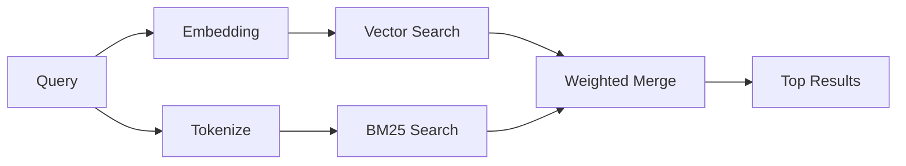

---
read_when:
    - '`memory_search` öğesinin nasıl çalıştığını anlamak istiyorsunuz'
    - Bir gömü sağlayıcısı seçmek istiyorsunuz
    - Arama kalitesini ayarlamak istiyorsunuz
summary: Bellek araması, gömüler ve hibrit erişim kullanarak ilgili notları nasıl bulur
title: Bellek Araması
x-i18n:
    generated_at: "2026-04-12T23:28:05Z"
    model: gpt-5.4
    provider: openai
    source_hash: 71fde251b7d2dc455574aa458e7e09136f30613609ad8dafeafd53b2729a0310
    source_path: concepts/memory-search.md
    workflow: 15
---

# Bellek Araması

`memory_search`, ifade biçimi özgün metinden farklı olsa bile bellek dosyalarınızdan ilgili notları bulur. Bunu, belleği küçük parçalara ayırarak dizinleyip gömüler, anahtar sözcükler veya her ikisini kullanarak arayarak yapar.

## Hızlı başlangıç

Yapılandırılmış bir OpenAI, Gemini, Voyage veya Mistral API anahtarınız varsa, bellek araması otomatik olarak çalışır. Bir sağlayıcıyı açıkça ayarlamak için:

```json5
{
  agents: {
    defaults: {
      memorySearch: {
        provider: "openai", // veya "gemini", "local", "ollama" vb.
      },
    },
  },
}
```

API anahtarı olmadan yerel gömüler için `provider: "local"` kullanın (`node-llama-cpp` gerektirir).

## Desteklenen sağlayıcılar

| Sağlayıcı | ID        | API anahtarı gerekir | Notlar                                               |
| --------- | --------- | -------------------- | ---------------------------------------------------- |
| OpenAI    | `openai`  | Evet                 | Otomatik algılanır, hızlı                            |
| Gemini    | `gemini`  | Evet                 | Görüntü/ses dizinlemeyi destekler                    |
| Voyage    | `voyage`  | Evet                 | Otomatik algılanır                                   |
| Mistral   | `mistral` | Evet                 | Otomatik algılanır                                   |
| Bedrock   | `bedrock` | Hayır                | AWS kimlik bilgisi zinciri çözümlendiğinde otomatik algılanır |
| Ollama    | `ollama`  | Hayır                | Yerel, açıkça ayarlanmalıdır                         |
| Local     | `local`   | Hayır                | GGUF modeli, ~0.6 GB indirme                         |

## Arama nasıl çalışır

OpenClaw iki erişim yolunu paralel olarak çalıştırır ve sonuçları birleştirir:



- **Vektör araması**, anlam olarak benzer notları bulur (`"gateway host"`, `"the machine running OpenClaw"` ile eşleşir).
- **BM25 anahtar sözcük araması**, tam eşleşmeleri bulur (kimlikler, hata dizeleri, yapılandırma anahtarları).

Yalnızca bir yol kullanılabiliyorsa (gömü yoksa veya FTS yoksa), yalnızca diğeri çalışır.

Gömüler kullanılamadığında, OpenClaw yalnızca ham tam eşleşme sıralamasına geri dönmek yerine yine de FTS sonuçları üzerinde sözcüksel sıralama kullanır. Bu düşük özellikli kip, sorgu terimlerini daha güçlü kapsayan ve ilgili dosya yollarına sahip parçaları öne çıkarır; bu da `sqlite-vec` veya bir gömü sağlayıcısı olmadan da geri çağırmayı kullanışlı tutar.

## Arama kalitesini iyileştirme

Not geçmişiniz büyük olduğunda iki isteğe bağlı özellik yardımcı olur:

### Zamansal azalma

Eski notlar sıralama ağırlığını zamanla kademeli olarak kaybeder, böylece güncel bilgiler önce görünür. Varsayılan 30 günlük yarı ömürle, geçen aydan bir not özgün ağırlığının %50'siyle puanlanır. `MEMORY.md` gibi kalıcı dosyalara hiçbir zaman azalma uygulanmaz.

<Tip>
Aracınızın aylarca günlük notları varsa ve eski bilgiler sürekli daha yeni bağlamın önüne geçiyorsa zamansal azalmayı etkinleştirin.
</Tip>

### MMR (çeşitlilik)

Tekrarlayan sonuçları azaltır. Beş notun da aynı yönlendirici yapılandırmasından bahsetmesi durumunda MMR, en üstteki sonuçların tekrar etmek yerine farklı konuları kapsamasını sağlar.

<Tip>
`memory_search` farklı günlük notlardan birbirine çok benzeyen parçaları döndürmeye devam ediyorsa MMR'yi etkinleştirin.
</Tip>

### Her ikisini de etkinleştirme

```json5
{
  agents: {
    defaults: {
      memorySearch: {
        query: {
          hybrid: {
            mmr: { enabled: true },
            temporalDecay: { enabled: true },
          },
        },
      },
    },
  },
}
```

## Çok modlu bellek

Gemini Embedding 2 ile görüntüleri ve ses dosyalarını Markdown ile birlikte dizinleyebilirsiniz. Arama sorguları metin olarak kalır, ancak görsel ve ses içeriğiyle eşleşir. Kurulum için [Bellek yapılandırma başvurusu](/tr/reference/memory-config) bölümüne bakın.

## Oturum belleği araması

`memory_search` öğesinin önceki konuşmaları hatırlayabilmesi için oturum dökümlerini isteğe bağlı olarak dizinleyebilirsiniz. Bu, `memorySearch.experimental.sessionMemory` üzerinden isteğe bağlı olarak etkinleştirilir. Ayrıntılar için [yapılandırma başvurusu](/tr/reference/memory-config) bölümüne bakın.

## Sorun giderme

**Sonuç yok mu?** Dizini kontrol etmek için `openclaw memory status` çalıştırın. Boşsa `openclaw memory index --force` çalıştırın.

**Yalnızca anahtar sözcük eşleşmeleri mi var?** Gömü sağlayıcınız yapılandırılmamış olabilir. `openclaw memory status --deep` ile kontrol edin.

**CJK metni bulunamıyor mu?** FTS dizinini `openclaw memory index --force` ile yeniden oluşturun.

## Ek okuma

- [Active Memory](/tr/concepts/active-memory) -- etkileşimli sohbet oturumları için alt aracı belleği
- [Bellek](/tr/concepts/memory) -- dosya düzeni, arka uçlar, araçlar
- [Bellek yapılandırma başvurusu](/tr/reference/memory-config) -- tüm yapılandırma ayarları
